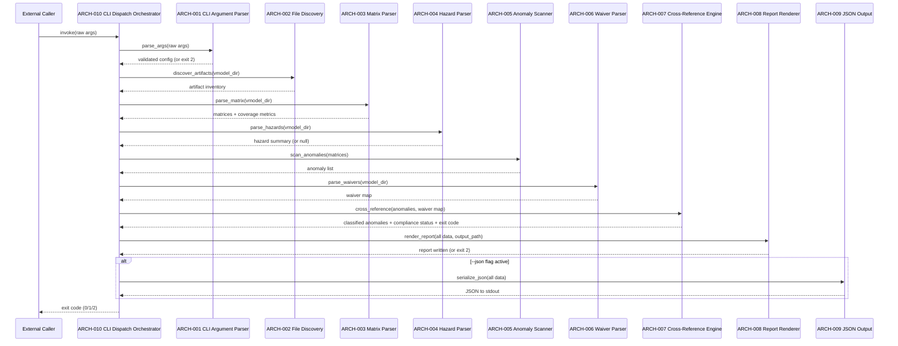

# V-Model Architecture Design: Release Audit Report

**Feature Branch**: `feature/005e-audit-report`
**Created**: 2026-04-05
**Status**: Approved
**Source**: `specs/005e-audit-report/v-model/system-design.md`

## Overview

This document decomposes the system components into architecture modules following IEEE 42010/Kruchten 4+1 views. The audit-report system is implemented as Bash + PowerShell wrapper scripts with shared logic patterns.

## Logical View — Component Breakdown

| ARCH ID | Name | Description | Parent SYS | Type |
|---------|------|-------------|------------|------|
| ARCH-001 | CLI Argument Parser | Parses and validates command-line arguments for both Bash and PowerShell entry points | SYS-008 | Component |
| ARCH-002 | File Discovery Module | Enumerates V-Model filenames, checks existence, collects Git metadata | SYS-001 | Component |
| ARCH-003 | Matrix Parser Module | Reads traceability-matrix.md, splits into matrix sections, extracts rows and coverage | SYS-002 | Component |
| ARCH-004 | Hazard Parser Module | Parses hazard-analysis.md FMEA table to extract HAZ-NNN entries | SYS-003 | Component |
| ARCH-005 | Anomaly Scanner Module | Scans matrix rows for failed/skipped statuses | SYS-004 | Component |
| ARCH-006 | Waiver Parser Module | Parses waivers.md for WAV-NNN entries and artifact ID mappings | SYS-004 | Component |
| ARCH-007 | Cross-Reference Engine | Joins anomalies with waivers, computes compliance status | SYS-004, SYS-005 | Component |
| ARCH-008 | Report Renderer Module | Renders 7-section Markdown report from all collected data | SYS-006 | Component |
| ARCH-009 | JSON Output Module | Serializes audit data to JSON when --json flag is active | SYS-007 | Component |
| ARCH-010 | CLI Dispatch Orchestrator | Top-level entry point in both Bash and PowerShell scripts; invokes ARCH-001 for argument parsing, then sequentially orchestrates ARCH-002 through ARCH-009, and propagates the exit code from compliance status. Uses only standard CI toolchain (Bash 4+, PowerShell 7+, Git, Python 3.x stdlib) — no external package managers or third-party libraries | SYS-008 | Component |

## Architecture Modules

### ARCH-001 — CLI Argument Parser

| Field | Value |
|-------|-------|
| **Traces To** | SYS-008 |
| **Description** | Parses command-line arguments for both Bash and PowerShell entry points: positional vmodel-dir, named options (--system-name, --version, --git-tag, --regulatory-context, --output, --json, --help). Validates required arguments and file existence. Invoked by ARCH-010 before pipeline dispatch. |

**Logical View**: Sequential argument parsing. Bash uses `getopts`-style loop; PowerShell uses `param()` block.

**Interface View**: Input: raw CLI args. Output: validated config object (vmodel_dir, system_name, version, git_tag, regulatory_context, output_path, json_flag). Exception: prints usage to stderr and exits 2 on missing required argument.

### ARCH-002 — File Discovery Module

| Field | Value |
|-------|-------|
| **Traces To** | SYS-001 |
| **Description** | Enumerates known V-Model filenames in the target directory and checks existence. Calls Git for metadata on each found file. |

**Logical View**: Iterate over a hardcoded list of expected filenames. For each existing file, run `git log -1 --format='%h|%aI' -- <file>` to extract SHA and date.

**Interface View**: Input: vmodel_dir path. Output: array of `{name, file, sha, date}` records.

### ARCH-003 — Matrix Parser Module

| Field | Value |
|-------|-------|
| **Traces To** | SYS-002 |
| **Description** | Reads traceability-matrix.md, splits into matrix sections, extracts table rows, and computes coverage metrics. |

**Logical View**: Line-by-line parsing. `## Matrix X` headings delimit sections. Within each section, the first `|`-row is the header, subsequent `|`-rows are data (skip separator). Coverage computed by counting unique design IDs in column 1 vs test IDs in the last ID column.

**Interface View**: Input: traceability-matrix.md path. Output: `{matrices: [{id, header, rows, coverage_metrics}]}`.

### ARCH-004 — Hazard Parser Module

| Field | Value |
|-------|-------|
| **Traces To** | SYS-003 |
| **Description** | Parses hazard-analysis.md FMEA table to extract HAZ-NNN entries. |

**Logical View**: Find the FMEA table by scanning for the `| HAZ` header pattern. Extract each data row. Compute aggregates.

**Interface View**: Input: hazard-analysis.md path (nullable). Output: `{hazards: [], summary: {}}` or null.

### ARCH-005 — Anomaly Scanner Module

| Field | Value |
|-------|-------|
| **Traces To** | SYS-004 |
| **Description** | Scans matrix rows for failed/skipped statuses, optionally scans peer-review files for Critical/Major findings. |

**Logical View**: Iterate matrix rows. Match status column for `❌ Failed` or `⏭️ Skipped` → add to anomaly list with type and matrix reference. Optionally glob for `peer-review-*.md` files, scan for `### PRF-` headings with `Critical` or `Major` severity.

**Interface View**: Input: parsed matrices, optional peer-review file paths. Output: `anomalies[]` array.

### ARCH-006 — Waiver Parser Module

| Field | Value |
|-------|-------|
| **Traces To** | SYS-004 |
| **Description** | Parses waivers.md for WAV-NNN entries and extracts artifact ID mappings. |

**Logical View**: Scan for `### WAV-NNN` heading pattern via regex. For each match, extract `**Artifact**:` field value. Build a map: `{artifact_id → {wav_id, type, justification, approved_by}}`.

**Interface View**: Input: waivers.md path (nullable). Output: waiver map `{artifact_id → waiver_record}`.

### ARCH-007 — Cross-Reference Engine

| Field | Value |
|-------|-------|
| **Traces To** | SYS-004, SYS-005 |
| **Description** | Joins anomalies with waivers to determine disposition (Waived/BLOCKING) and identifies orphaned waivers. Computes final compliance status. |

**Logical View**: For each anomaly, look up its ID in the waiver map → Waived if found, BLOCKING otherwise. For each waiver, check if its artifact ID is in the anomaly set → Orphaned if not. Count BLOCKING anomalies to determine status.

**Interface View**: Input: anomaly list + waiver map. Output: `{classified_anomalies[], orphaned_waivers[], compliance_status, exit_code}`.

### ARCH-008 — Report Renderer Module

| Field | Value |
|-------|-------|
| **Traces To** | SYS-006 |
| **Description** | Renders the final Markdown report by filling the template with all collected data. Writes to output file. Prints summary to stderr. |

**Logical View**: Build each section as a string. Executive summary uses `printf`/string interpolation for metrics. Tables rendered with Markdown pipe syntax. Concatenate all sections. Write to file. Print summary.

**Interface View**: Input: all computed data + metadata + output path. Output: Markdown file + stderr summary.

### ARCH-009 — JSON Output Module

| Field | Value |
|-------|-------|
| **Traces To** | SYS-007 |
| **Description** | Serializes all audit data into JSON format when --json flag is active. |

**Logical View**: Build JSON object from all data structures. Use `python3 -m json.tool` (Bash) or `ConvertTo-Json` (PowerShell) for formatting.

**Interface View**: Input: all computed data. Output: JSON string to stdout.

### ARCH-010 — CLI Dispatch Orchestrator

| Field | Value |
|-------|-------|
| **Traces To** | SYS-008 |
| **Description** | The top-level entry point function in both the Bash (`build-audit-report.sh`) and PowerShell (`Build-Audit-Report.ps1`) scripts. Invokes ARCH-001 to parse and validate arguments, then orchestrates the full processing pipeline in sequence, and propagates the exit code returned by ARCH-007 via SYS-005 compliance status. Uses only standard CI toolchain dependencies (Bash 4+, PowerShell 7+, Git, optionally Python 3.x standard library) — no external package managers or third-party libraries. |

**Logical View**: Main function / script body. Bash implementation calls named functions in sequence; PowerShell implementation calls local functions. No loop or parallelism — strictly sequential single-threaded execution.

**Interface View**: Input: raw process arguments (delegated immediately to ARCH-001). Output: exit code (0 = RELEASE READY or RELEASE CANDIDATE, 1 = NOT READY, 2 = missing required artifacts or argument error). Exception: propagates exit code 2 from any sub-component that encounters a fatal error.

## Process View

**Execution order (sequential, single-threaded)**:
1. ARCH-010 (Entry Point) → delegates to ARCH-001 to validate args
2. ARCH-002 (File Discovery) → enumerate artifacts + git metadata
3. ARCH-003 (Matrix Parser) → extract matrices + coverage
4. ARCH-004 (Hazard Parser) → extract HAZ entries (if present)
5. ARCH-005 (Anomaly Scanner) → find failed/skipped/findings
6. ARCH-006 (Waiver Parser) → parse WAV entries (if present)
7. ARCH-007 (Cross-Reference) → join anomalies ↔ waivers → status
8. ARCH-008 (Report Renderer) → assemble + write report
9. ARCH-009 (JSON Output) → serialize to JSON (if --json)
10. ARCH-010 (Entry Point) → propagates exit code to caller

## Data Flow View

| Source | Data | Destination |
|--------|------|-------------|
| CLI args | raw argv (vmodel-dir, metadata, flags) | ARCH-010 |
| ARCH-010 | raw args | ARCH-001 |
| ARCH-001 | validated config (vmodel_dir, system_name, version, git_tag, regulatory_context, output_path, json_flag) | ARCH-010 |
| ARCH-010 | vmodel_dir | ARCH-002 |
| ARCH-002 | artifact inventory | ARCH-008 |
| ARCH-010 | vmodel_dir | ARCH-003 |
| ARCH-003 | matrices, coverage metrics | ARCH-005, ARCH-008 |
| ARCH-010 | vmodel_dir | ARCH-004 |
| ARCH-004 | hazard summary | ARCH-008 |
| ARCH-003 | matrix rows with status | ARCH-005 |
| ARCH-005 | anomaly list | ARCH-007 |
| ARCH-010 | vmodel_dir | ARCH-006 |
| ARCH-006 | waiver map | ARCH-007 |
| ARCH-007 | classified anomalies, compliance status, exit code | ARCH-008, ARCH-009, ARCH-010 |
| ARCH-008 | Markdown report | output file |
| ARCH-009 | JSON | stdout |
| ARCH-010 | exit code (0/1/2) | caller process |
---

## Coverage Summary

| Metric | Count |
|--------|-------|
| Total Architecture Modules (ARCH) | 10 (10 active, 0 deprecated) |
| SYS → ARCH Coverage | 8/8 (100%) |
| ARCH modules by Type | Component: 10 |
| Cross-Cutting Modules | 0 |
| **Forward Coverage (SYS→ARCH)** | **100%** |

---

## Architecture Evaluation (ISO 42030:2019 + ISO 25010:2023)

This section performs a scenario-based fitness-for-purpose evaluation per ISO/IEC 42030:2019, completing the IEEE 42010 "describe" → ISO 42030 "evaluate" cycle. Quality characteristics are referenced by name per ISO/IEC 25010:2023.

### Quality Attribute Justification (ISO/IEC 25010:2023)

For each of the 10 architecture modules, the primary quality characteristic driving its design is documented alongside the trade-off accepted.

| ARCH ID | Architecture Decision | Primary Quality Characteristic (ISO 25010:2023) | Trade-off Accepted |
|---------|----------------------|------------------------------------------------|---------------------|
| ARCH-001 | Argument parsing via a `getopts`-style loop (Bash) and `param()` block (PowerShell); validates required arg and file existence before any pipeline step | Reliability — Fault Tolerance §4.2.2 ↑; Functional Suitability — Completeness §4.2.1 ↑ | Strict validation fails fast on missing or invalid directories; this sacrifices leniency for predictability — a deliberate trade of Flexibility §4.2.8 for Reliability §4.2.2 |
| ARCH-002 | Hardcoded ordered list of 11 expected V-Model filenames; Git `log -1` metadata extraction per file | Reliability — Faultlessness §4.2.2 ↑; Functional Suitability — Completeness §4.2.1 ↑ | Hardcoded filename list sacrifices Flexibility §4.2.8 (cannot discover non-standard artifact names) for Reliability §4.2.2 (no accidental file inclusion) |
| ARCH-003 | Line-by-line `## Matrix X` heading delimited parsing; coverage metrics computed inline | Functional Suitability — Correctness §4.2.1 ↑; Maintainability — Analysability §4.2.7 ↑ | Heading-based section delimitation couples ARCH-003 to the exact heading format in `traceability-matrix.md`; heading changes cause silent zero-extraction |
| ARCH-004 | `| HAZ-` pattern scan to locate FMEA table; aggregate stats computed in-pass | Reliability — Fault Tolerance §4.2.2 ↑; Functional Suitability §4.2.1 ↑ | Null return on absent hazard file is a controlled optional path, not a failure; downstream ARCH-008 renders the "no hazard analysis" message deterministically |
| ARCH-005 | Matrix row scan for `❌ Failed` and `⏭️ Skipped` status emoji; optional peer-review glob for Critical/Major findings | Functional Suitability — Completeness §4.2.1 ↑; Safety — Risk Identification §4.2.9 ↑ | Unicode emoji matching is locale-sensitive; CI environments with non-UTF-8 locales may fail to match status columns — mitigated by REQ-NF-002 (standard toolchain requirement) |
| ARCH-006 | Regex split on `### WAV-NNN` headings; field extraction by `**Artifact**:` pattern | Reliability — Faultlessness §4.2.2 ↑; Maintainability — Modifiability §4.2.7 ↑ | Regex-based field extraction is brittle against whitespace variations in the waiver format; REQ-CN-003 mitigates this by mandating a strict waivers.md schema |
| ARCH-007 | Artifact-ID lookup in waiver map; BLOCKING count drives exit code; orphan detection via set difference | Safety — Risk Identification §4.2.9 ↑; Reliability — Faultlessness §4.2.2 ↑ | All-or-nothing waiver matching (exact artifact ID) sacrifices Flexibility §4.2.8 (no fuzzy matching) for Safety §4.2.9 (no anomaly can pass undetected through ambiguous matching) |
| ARCH-008 | Template-fill via `printf`/string interpolation; all 7 sections assembled as strings; write to output path; summary to stderr | Functional Suitability — Completeness §4.2.1 ↑; Interaction Capability §4.2.4 ↑ | String concatenation assembly is simple and dependency-free; trade-off is that formatting errors produce malformed Markdown rather than an explicit error, requiring post-generation review |
| ARCH-009 | `python3 -m json.tool` (Bash) / `ConvertTo-Json` (PowerShell) for JSON formatting; activated only when `--json` flag is set | Compatibility — Interoperability §4.2.6 ↑; Flexibility — Adaptability §4.2.8 ↑ | Optional JSON path relies on Python 3.x being available (per REQ-NF-002); PowerShell and Bash paths produce structurally identical JSON to enable cross-platform CI tooling |
| ARCH-010 | Sequential single-threaded pipeline orchestration; no parallelism; propagates exit code from ARCH-007 | Reliability — Faultlessness §4.2.2 ↑; Maintainability — Analysability §4.2.7 ↑ | Sequential execution eliminates race conditions and inter-component state corruption at the cost of Performance Efficiency §4.2.3 (no parallel I/O); acceptable given the 30-second budget of REQ-NF-003 |

### Fitness-for-Purpose Scenario Analysis (ISO 42030:2019 §6)

Evaluation of the architecture against top stakeholder concerns per ISO/IEC 42030:2019 §6.3.

| Quality Scenario | Stimulus | Environment | Response | Measure | Architecture Modules | Verdict |
|-----------------|---------|-------------|----------|---------|---------------------|---------|
| **Reliability — Deterministic compliance status**: The cross-reference engine must produce identical compliance status for identical inputs on any CI runner | Repeated invocation of ARCH-007 with the same anomaly list and waiver map | Standard CI runner (Bash 4+, Git, Python 3.x); no external state beyond the V-Model directory | ARCH-007 executes set-lookup and count operations with no random or time-dependent inputs | Exit code and compliance status string are byte-identical across repeated runs and across Linux/macOS/Windows CI runners | ARCH-006 (deterministic waiver map), ARCH-007 (set-lookup, no randomness), ARCH-010 (sequential, no shared state) | ✅ Addressed — ARCH-006 and ARCH-007 are stateless functions; ARCH-010 enforces single-threaded execution |
| **Performance — Report generation under 30 seconds for 500-ID projects**: The pipeline must complete within the budget defined in REQ-NF-003 | `build-audit-report.sh` invoked against a V-Model directory with 500 IDs spread across 5 matrices | Standard CI runner with Git history; Python 3.x available for JSON formatting | The pipeline executes all 10 ARCH modules sequentially and writes the report file | Wall-clock time < 30 seconds | ARCH-002 (11 `git log -1` calls = dominant I/O cost), ARCH-003 (line-by-line parse of one file), ARCH-010 (sequential orchestration) | ✅ Addressed — 11 Git log calls are the dominant cost; on modern CI runners each call is < 100ms, totalling < 1.5s; Markdown parsing is O(n) in file size |
| **Maintainability — Adding a new regulatory context requires zero script changes**: A new `--regulatory-context` value must not require modifying the script | User passes `--regulatory-context "AS9100D"` to the command | No configuration file exists for the new context | ARCH-001 accepts the value; ARCH-008 writes it into the executive summary template without validation | New regulatory context appears correctly in the report; no error or warning is emitted | ARCH-001 (passthrough argument), ARCH-008 (template interpolation without validation) | ✅ Addressed — `--regulatory-context` is a free-text string passed through by ARCH-001 and interpolated by ARCH-008 without enumeration; any string is accepted. Trade-off: no validation means misspelled contexts produce incorrect reports silently |

### Sensitivity and Trade-off Points

**Sensitivity Points** (where a small change significantly affects one or more quality characteristics):

1. **ARCH-005 — Unicode emoji status matching**: ARCH-005 matches matrix row anomalies by detecting the Unicode characters `❌` and `⏭️` in status columns. A CI environment running with a non-UTF-8 locale or a text editor that substitutes similar-looking characters (e.g., replacing `❌` U+274C with `✗` U+2717) would cause ARCH-005 to silently miss anomalies, producing a false RELEASE READY status. This is a Safety §4.2.9 sensitivity point.

2. **ARCH-006 — WAV-NNN heading regex coupling**: ARCH-006's `### WAV-NNN` heading regex is tightly coupled to REQ-CN-003's waiver format. A project that uses `## WAV-NNN` (two hashes) or `WAV-001:` (colon-style) instead of `### WAV-NNN` would cause all waivers to be silently undetected, turning all anomalies into BLOCKING status. This is a Reliability §4.2.2 and Safety §4.2.9 sensitivity point.

3. **ARCH-008 — No section-render validation**: ARCH-008 assembles the 7-section report via string concatenation without structural validation. If any upstream component returns null or an empty data structure, ARCH-008 renders an empty section without error. Auditors receiving a report with empty sections may not detect the missing content. This is a Functional Suitability §4.2.1 sensitivity point.

**Trade-off Points** (where improving one characteristic degrades another):

1. **All-or-nothing waiver matching (ARCH-007) — Safety ↑ vs. Flexibility ↓**: Exact artifact-ID matching in the waiver cross-reference maximises Safety §4.2.9 (no anomaly escapes through ambiguous matching) at the cost of Flexibility §4.2.8. A waiver covering `SCN-001-A` does NOT automatically cover `SCN-001-A1` or `SCN-001-A2`. Each scenario ID must be waived individually, which is more work but prevents accidental over-broad waivers.

2. **Hardcoded filename list (ARCH-002) — Reliability ↑ vs. Adaptability ↓**: The fixed list of 11 expected V-Model filenames in ARCH-002 ensures no unexpected files are included in the inventory, improving Reliability §4.2.2. The trade-off is Flexibility §4.2.8: teams that use non-standard artifact filenames (e.g., `system-requirements.md` instead of `requirements.md`) receive no discovery coverage and no warning that their files were not found.

3. **No output validation (ARCH-008) — Performance ↑ vs. Functional Suitability ↓**: Skipping post-assembly structural validation in ARCH-008 keeps the pipeline fast (Performance Efficiency §4.2.3 ↑) but accepts the risk of malformed reports when upstream components fail silently. Adding a post-render section-count check would detect missing sections at the cost of additional processing time.
