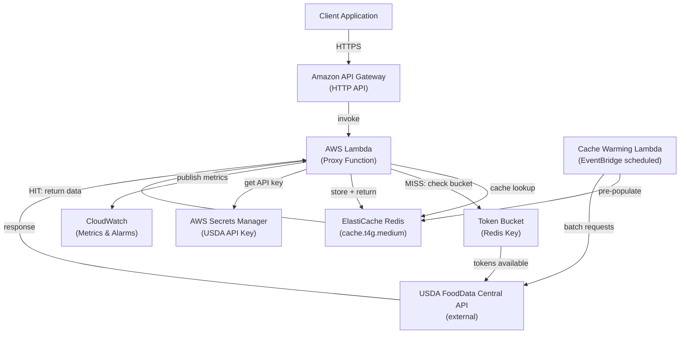
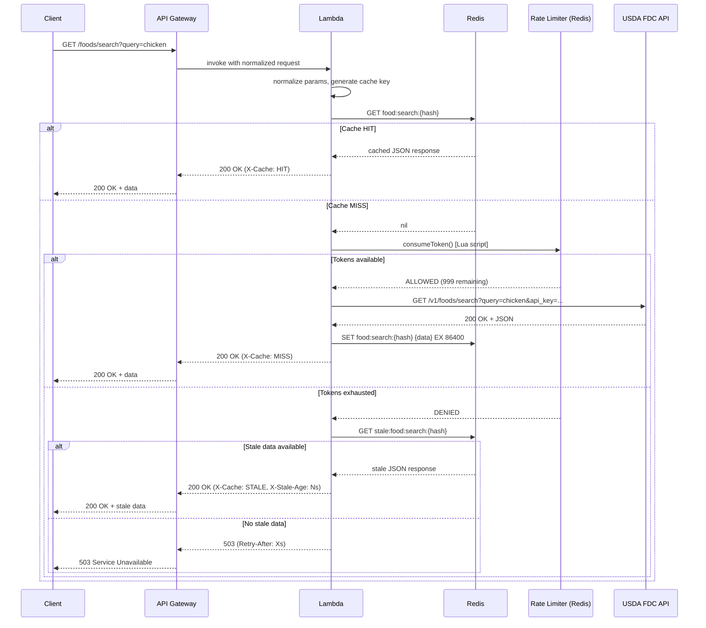

# Architecture 2: Smart Caching Proxy

## Metadata

| Field    | Value                                     |
| -------- | ----------------------------------------- |
| Status   | Proposal                                  |
| Date     | 2026-04-07                                |
| Author   | AI-Generated                              |
| Version  | 1.0                                       |
| Audience | Engineering, Architecture Review, Product |

---

## Executive Summary

This document describes a smart caching proxy architecture for a recipe application that depends on the USDA FoodData Central (FDC) API as its source of nutrition data. The design places an intelligent proxy layer — Amazon API Gateway, AWS Lambda, and ElastiCache Redis — between the application and the upstream USDA API, caching responses aggressively to stay well within the 1,000 req/hr rate limit.

The defining characteristic of this architecture is its deliberate avoidance of a local database. Redis serves as the sole data store, and the USDA API remains the authoritative source of truth. This keeps the system lightweight, operationally simple, and cheap at small scale, making it the right choice for MVPs, prototypes, and applications with moderate, predictable traffic.

The critical constraint to understand upfront: the USDA rate limit is a hard ceiling. Scaling the proxy infrastructure horizontally does not increase throughput for cache misses. Cache hit ratio is the governing metric, and this architecture is optimized to maximize it through intelligent TTL strategy, stampede prevention, and proactive cache warming.

---

## Context & Problem Statement

### The Constraint

The USDA FoodData Central API enforces a **1,000 requests/hour per IP** rate limit using a rolling window. For a recipe application operating at any meaningful user-facing scale, this is trivially exhaustible. A single user browsing recipes could generate dozens of food lookups; a few hundred concurrent users could exhaust the budget in minutes.

### Why Caching Is the Right Tool Here

Nutrition data is semi-static by nature:

- **Foundation Foods** (~1,400 items): updated twice per year by USDA
- **SR Legacy** (~8,790 items): frozen as of April 2018, never updated
- **FNDDS** (~8,700 items): updated with each NHANES release, roughly every 2 years
- **Branded Foods** (~300,000 items): updated monthly as manufacturers submit reformulations

When users search for "chicken breast" or "brown rice," they are almost always getting the same items. Access patterns for food data follow a strong power-law distribution — a small fraction of foods account for the vast majority of lookups. A cache exploiting this distribution can achieve hit ratios well above 90%.

### Why Not Manage the Data Locally?

Bulk data ingestion (downloading the entire USDA dataset and managing it in a local PostgreSQL instance) requires significant upfront engineering: ETL pipelines, data normalization, full-text search indexing, and an ongoing sync strategy complicated by the fact that USDA provides no delta/changelog endpoint. For an early-stage application, this overhead is premature. This architecture avoids all of it — until the scale justifies the investment.

---

## Architecture Overview

### High-Level Description

The proxy layer intercepts every outbound call to the USDA FDC API. When a client requests food data, the request hits API Gateway, which triggers a Lambda function. The Lambda checks Redis for a cached response. On a hit, it returns immediately. On a miss, it first checks the rate limiter token bucket in Redis, then calls the USDA API, stores the response, and returns it to the client.

The token bucket rate limiter enforces the 1,000 req/hr constraint at the application level, before the upstream API ever sees the request. If the bucket is empty, the system falls back to stale cache if available, or returns a `503 Service Unavailable` with a `Retry-After` header.

### Architecture Diagram



### Key Architectural Decisions

**Redis is the data store.** There is no separate database. Redis holds all cached food data. When Redis evicts an item due to memory pressure (using `allkeys-lfu` policy), the data is simply re-fetched on next request.

**The USDA API is the source of truth.** The system never owns the canonical data. This means zero ETL burden but also a hard dependency on external availability.

**Token bucket lives in Redis.** The rate limiter state is stored as a Redis key, updated atomically via Lua script. This is the mechanism that prevents the application from ever issuing more than ~16.67 requests per minute to the USDA API.

---

## System Components

### 1. API Gateway (Amazon API Gateway HTTP API)

API Gateway is the entry point for all client traffic. HTTP API is chosen over REST API because it costs less ($1.00/million vs $3.50/million) and has lower latency, with the trade-off of fewer advanced features — none of which are needed here.

**Routes** mirror the USDA FDC API surface:

| Route                | USDA Equivalent        | Description                 |
| -------------------- | ---------------------- | --------------------------- |
| `GET /foods/{fdcId}` | `GET /v1/food/{fdcId}` | Single food item by ID      |
| `POST /foods/batch`  | `POST /v1/foods`       | Batch lookup (up to 20 IDs) |
| `GET /foods/search`  | `GET /v1/foods/search` | Full-text food search       |
| `GET /foods/list`    | `GET /v1/foods/list`   | Paginated food listing      |

**Request throttling** is configured at the API Gateway stage as a secondary safety net (e.g., 500 req/sec burst limit) to protect Lambda from traffic spikes independent of the USDA rate limit.

**Custom domain** with TLS certificate via AWS Certificate Manager. All traffic is HTTPS-only; HTTP is rejected.

**API key or Cognito authorizer** gates access, depending on whether the consumers are server-to-server (API key) or end-user clients (Cognito JWT).

---

### 2. Lambda Functions (Proxy Logic)

A single Lambda function handles all proxy logic. The function is stateless; all state lives in Redis.

**Core execution path:**

```
receive request
  → normalize parameters (lowercase, sort, trim)
  → generate deterministic cache key
  → check Redis for cached response
    → HIT: return cached data, set X-Cache: HIT header
    → MISS: check rate limiter token bucket
      → tokens available: call USDA API, cache response, return data
      → tokens exhausted: check for stale cache entry
        → stale available: return stale, set X-Cache: STALE header
        → no stale: return 503 with Retry-After header
```

**Response transformation** normalizes USDA API responses to a stable internal schema. This insulates client code from upstream API changes and allows field pruning to reduce Redis memory usage.

**Error handling** covers USDA API failure modes:

- `429 Too Many Requests` from USDA: exponential backoff, drain token bucket to zero, serve stale
- `5xx` from USDA: return stale if available, otherwise propagate error with circuit breaker logic
- Network timeout: treat as `5xx`

**Memory and timeout:** 128MB is sufficient for proxy logic. Timeout set to 10 seconds to account for USDA API response time under load.

---

### 3. ElastiCache Redis (Primary Cache)

Redis serves dual purpose: cache store and rate limiter state.

**Instance: `cache.t4g.medium`**

- 3.09 GB memory
- 2 vCPUs (Graviton2, ARM)
- ~$45/month in us-east-1
- Single-AZ for cost optimization at this scale; upgrade to Multi-AZ when availability SLA demands it

`cache.t4g.small` (1.37 GB) is not sufficient if Redis is the primary data store for potentially thousands of food items. The medium tier provides comfortable headroom.

**Eviction policy: `allkeys-lfu`**
Least Frequently Used eviction is optimal for power-law access patterns. The most popular foods stay in memory; obscure items are evicted first. This is preferable to `allkeys-lru` for food data because popularity is more stable than recency.

**TTL Strategy by Data Type**

| Data Type          | TTL           | Rationale                               |
| ------------------ | ------------- | --------------------------------------- |
| Foundation Foods   | 180 days      | Updated twice/year by USDA              |
| SR Legacy          | Never expires | Frozen dataset since April 2018         |
| FNDDS              | 180 days      | Updated ~every 2 years                  |
| Branded Foods      | 7 days        | Monthly reformulations by manufacturers |
| Search results     | 24 hours      | Catalog additions could shift results   |
| Paginated listings | 24 hours      | Same rationale as search                |

All TTLs include **±10% random jitter** to prevent thundering herd expiration. A 7-day TTL becomes 7 days ± 16.8 hours. This spreads renewal traffic across time rather than clustering it at synchronized expiration moments.

**Data structure: Redis Hashes**
Individual food items are stored as Redis Hashes (`HSET food:{fdcId} field value`) rather than serialized JSON strings. This enables partial field retrieval (`HGET`) and reduces bandwidth when clients need only a subset of nutritional fields. Search results and batch responses are stored as serialized JSON strings with `SET`.

**Key naming convention:** See [Cache Key Design](#cache-key-design) section below.

---

### 4. Rate Limiter (Redis-based Token Bucket)

The token bucket rate limiter enforces the 1,000 req/hr constraint before any outbound request reaches the USDA API.

**Parameters:**

- Capacity: 1,000 tokens
- Refill rate: 16.67 tokens/minute (1,000 / 60)
- Storage: Redis key `ratelimit:usda:tokens` with associated `ratelimit:usda:last_refill` timestamp

**Algorithm (pseudocode):**

```
function consumeToken():
  current_time = now()
  last_refill = GET ratelimit:usda:last_refill
  tokens = GET ratelimit:usda:tokens

  elapsed_minutes = (current_time - last_refill) / 60
  new_tokens = min(1000, tokens + floor(elapsed_minutes * 16.67))

  SET ratelimit:usda:last_refill = current_time
  SET ratelimit:usda:tokens = new_tokens

  if new_tokens >= 1:
    DECR ratelimit:usda:tokens
    return ALLOWED
  else:
    return DENIED
```

This logic executes as an **atomic Lua script** loaded into Redis (`EVALSHA`). Atomicity is critical — without it, concurrent Lambda invocations would race on the token count and potentially exceed the 1,000/hr limit.

**When the bucket is empty:**

1. Check for a stale cached response (entry exists but TTL has expired and was kept as a stale marker)
2. If stale exists: return it with `X-Cache: STALE` and `X-Stale-Age: {seconds}` headers
3. If no stale: return `503 Service Unavailable` with `Retry-After: {seconds_until_refill}` header

**Alerting:** A CloudWatch alarm fires when the token bucket drops below 200 (20% capacity), giving operators advance warning before the system starts returning 503s.

---

### 5. Cache Stampede Prevention

Cache stampedes occur when many concurrent requests arrive for the same key at the moment it expires, all simultaneously calling the USDA API. At scale, this can exhaust the rate limit in seconds.

Three complementary mechanisms prevent this:

**Probabilistic Early Expiration (X-Fetch Algorithm)**

Before a cache entry expires, the system probabilistically decides to refresh it early. The formula:

```
refresh_early_if:
  now - (expiry - delta * beta * log(random())) > 0

where:
  delta = time it took to recompute the value (USDA API latency in seconds)
  beta  = tuning parameter (typically 1.0)
  expiry = absolute timestamp when key expires
```

As the key approaches expiration, the probability of early refresh increases. The first request that "wins" the probabilistic check refreshes the cache; subsequent requests continue getting the current cached value. This is implemented inside the Lambda proxy logic.

**Mutex Locking for Popular Keys**

For high-traffic keys (detected by monitoring hit count), a Redis-based mutex prevents concurrent refresh:

```
on cache miss:
  lock = SET lock:{cache_key} 1 NX PX 5000
  if lock acquired:
    fetch from USDA API
    store in Redis
    release lock
  else:
    wait 100ms, retry cache lookup (the lock holder is refreshing it)
    if still miss after retry: proceed without lock (fallback)
```

The lock TTL (5 seconds) is set longer than the expected USDA API response time to prevent orphaned locks from blocking indefinitely.

**Stale-while-revalidate**

When a cache miss triggers a USDA API call, the Lambda serves the stale entry (if it exists) immediately to the client while the refresh happens asynchronously. This eliminates the latency penalty for the user triggering the refresh.

---

### 6. Cache Warming (Optional Pre-population)

Cold starts are dangerous for this architecture. When Redis has no data (after a restart, or on first deployment), every request becomes a USDA API call. With a cold cache and any meaningful traffic, the rate limit exhausts immediately.

**Implementation:**

An EventBridge-scheduled Lambda runs daily during low-traffic hours (e.g., 3:00 AM UTC). It pre-fetches the top 1,000 most-accessed food items.

**Batch strategy:**

- USDA batch endpoint accepts up to 20 FDC IDs per `POST /v1/foods` request
- 1,000 foods / 20 per batch = 50 API requests
- At 16.67 tokens/minute, 50 requests completes in ~3 minutes
- The warmer throttles itself to 15 requests/minute to leave buffer for organic traffic

**Popularity tracking:**
The Lambda proxy records a hit counter in Redis for each FDC ID (`INCR hitcount:{fdcId}`). The warming job reads these counters, sorts by frequency, and pre-fetches the top 1,000. A weekly `RESET` clears counters to allow organic popularity to shift.

**On first deployment** (no hit data), seed with a curated list of common foods: the top 200 Foundation Foods by likely search frequency, core SR Legacy items for common proteins/grains/vegetables.

---

### 7. Monitoring & Observability

**CloudWatch Metrics (custom, emitted by Lambda)**

| Metric               | Namespace               | Unit         | Description                       |
| -------------------- | ----------------------- | ------------ | --------------------------------- |
| `CacheHitRatio`      | `FoodProxy/Cache`       | Percent      | Rolling 5-min cache hit %         |
| `CacheMissCount`     | `FoodProxy/Cache`       | Count        | Misses per minute                 |
| `RateLimitRemaining` | `FoodProxy/RateLimit`   | Count        | Tokens remaining in bucket        |
| `USDAApiLatency`     | `FoodProxy/Upstream`    | Milliseconds | P50/P95/P99 USDA response time    |
| `USDAApiErrorRate`   | `FoodProxy/Upstream`    | Percent      | 4xx/5xx rate from USDA            |
| `StaleServedCount`   | `FoodProxy/Cache`       | Count        | Responses served from stale cache |
| `ProxyLatency`       | `FoodProxy/Performance` | Milliseconds | End-to-end Lambda execution time  |

**CloudWatch Alarms**

| Alarm                   | Condition                            | Severity | Action                            |
| ----------------------- | ------------------------------------ | -------- | --------------------------------- |
| Low cache hit ratio     | `CacheHitRatio < 80%` for 5 min      | High     | SNS → ops alert                   |
| Rate limit critical     | `RateLimitRemaining < 100`           | Critical | SNS → PagerDuty / immediate alert |
| Rate limit warning      | `RateLimitRemaining < 200`           | Warning  | SNS → ops Slack channel           |
| USDA API errors         | `USDAApiErrorRate > 5%` for 2 min    | High     | SNS → ops alert                   |
| Redis connection errors | Lambda error metric on Redis timeout | Critical | SNS → PagerDuty                   |
| High stale rate         | `StaleServedCount > 50/min`          | Warning  | SNS → ops Slack                   |

**CloudWatch Dashboard: "Food Proxy Operations"**

Single operational dashboard with six panels:

1. Cache hit ratio (time series, target line at 90%)
2. Rate limit token count (gauge + time series)
3. Request volume by type (hit / miss / stale / 503)
4. USDA API latency P50/P95/P99 (time series)
5. Lambda duration P99 (time series)
6. Redis memory utilization (time series)

**Distributed Tracing**

AWS X-Ray traces enabled on both API Gateway and Lambda. This provides end-to-end request visibility: client → API Gateway → Lambda → Redis → USDA API. Segment annotations include `cache_result` (HIT/MISS/STALE), `fdc_id`, and `data_type` for query-level analysis.

---

## Cache Key Design

Cache keys must be deterministic regardless of parameter ordering or casing variations in client requests.

### Key Naming Convention

| Key Pattern                          | Example                                | Data Stored                        |
| ------------------------------------ | -------------------------------------- | ---------------------------------- |
| `food:single:{fdcId}:{format}`       | `food:single:2262065:full`             | Single food item (Hash)            |
| `food:batch:{hash}:{format}`         | `food:batch:a3f8c2:full`               | Batch response (JSON string)       |
| `food:search:{query_hash}`           | `food:search:7b4d19`                   | Search result page (JSON string)   |
| `food:list:{page}:{pageSize}:{sort}` | `food:list:1:25:dataType.keyword:desc` | Paginated listing (JSON string)    |
| `hitcount:{fdcId}`                   | `hitcount:2262065`                     | Access frequency counter (integer) |
| `ratelimit:usda:tokens`              | —                                      | Token bucket count (float)         |
| `ratelimit:usda:last_refill`         | —                                      | Last refill timestamp (unix ms)    |
| `lock:{cache_key}`                   | `lock:food:single:2262065:full`        | Mutex lock (ephemeral, 5s TTL)     |
| `stale:{cache_key}`                  | `stale:food:search:7b4d19`             | Stale data marker (JSON string)    |

### Key Normalization Rules

Before generating any cache key, the Lambda proxy applies these normalization steps in order:

1. **Lowercase everything**: `Query=Chicken Breast` → `query=chicken breast`
2. **Trim whitespace** from all values: `query= chicken ` → `query=chicken`
3. **Sort query parameters alphabetically**: `format=full&query=chicken` not `query=chicken&format=full`
4. **Encode special characters** consistently (URL-encode or hash the full parameter string)
5. **Hash long values**: query strings longer than 64 characters are SHA-256 hashed to keep keys short
6. **Exclude cache-control headers** from key computation (they're client directives, not data identifiers)
7. **Normalize food type filters** to canonical lowercase USDA values: `Foundation`, `SR Legacy`, `Branded`, `Survey (FNDDS)`

For batch lookups (`POST /foods`), the list of FDC IDs is **sorted numerically** before hashing to ensure `[123, 456, 789]` and `[789, 123, 456]` produce the same cache key.

---

## Data Flow

### Sequence Diagram



### Step-by-Step Flow

1. Client sends `GET /foods/search?query=chicken` to API Gateway over HTTPS
2. API Gateway authenticates the request (API key or Cognito JWT), applies stage-level throttling, and invokes the Lambda proxy
3. Lambda normalizes parameters: lowercase query, sort params, trim whitespace, generate SHA-256 hash of the normalized query string as cache key suffix
4. Lambda issues `GET food:search:{hash}` to Redis (sub-millisecond round trip inside VPC)
5. **CACHE HIT**: Lambda returns cached JSON with `X-Cache: HIT`, `X-Cache-TTL: {remaining}`, and `Cache-Control: max-age={ttl}` headers. Total latency: ~10-20ms
6. **CACHE MISS**: Lambda calls `consumeToken()` Lua script in Redis atomically
7. **Tokens available**: Lambda retrieves the USDA API key from Secrets Manager (cached in Lambda memory after first retrieval), calls `GET /v1/foods/search?query=chicken` on the USDA API. On success, stores response in Redis with appropriate TTL (including jitter), returns to client with `X-Cache: MISS`. Total latency: ~200-600ms depending on USDA API response time
8. **Tokens exhausted — stale available**: Lambda checks the `stale:` key prefix. Returns stale data with `X-Cache: STALE` and `X-Stale-Age` header. Client receives potentially outdated but functional data
9. **Tokens exhausted — no stale data**: Lambda returns `503 Service Unavailable` with `Retry-After: {seconds_until_next_token}` header computed from the rate limiter state
10. Lambda emits custom CloudWatch metrics for every request (cache result, latency, token count)

---

## Scalability

### Horizontal Scaling Properties

| Component         | Scales How                                     | Bottleneck                                       |
| ----------------- | ---------------------------------------------- | ------------------------------------------------ |
| API Gateway       | Automatic, unlimited                           | Not a bottleneck                                 |
| Lambda            | Automatic horizontal (concurrent executions)   | 1,000 default concurrent limit (soft, raiseable) |
| ElastiCache Redis | Vertical (instance size) or Redis Cluster mode | Memory (eviction) and connection count           |
| USDA FDC API      | Does not scale for us                          | Hard ceiling at 1,000 req/hr                     |

### The Fundamental Ceiling

**Scaling the proxy infrastructure does not increase throughput for cache misses.** More Lambda instances can serve more cached responses in parallel, but each cache miss still consumes one token from the 1,000 req/hr budget. At 100% cache miss rate, the system can serve exactly 16.67 unique food items per minute, regardless of how many Lambda instances are running.

This means **cache hit ratio is the critical scaling metric**, not request volume.

### Cache Hit Ratio Impact on Effective Capacity

| Cache Hit Ratio | Max Unique Lookups/Hour | Effective Capacity |
| --------------- | ----------------------- | ------------------ |
| 99%             | ~100,000/hr             | Excellent          |
| 95%             | ~20,000/hr              | Good               |
| 90%             | ~10,000/hr              | Acceptable         |
| 80%             | ~5,000/hr               | Danger zone        |
| 70%             | ~3,333/hr               | Unsustainable      |
| <70%            | <3,333/hr               | System will 503    |

At 90% hit ratio: 1,000 misses/hour go to USDA, 9,000 additional requests are served from cache, yielding 10,000 total unique food lookups per hour.

### Scaling Thresholds

**Redis memory:** At `cache.t4g.medium` (3.09 GB), assuming average food item serialization of ~3 KB per Redis Hash, the cache holds ~1,000,000 individual food records. In practice, the USDA catalog is ~320,000 items. Even storing the entire catalog with overhead is feasible on this instance.

**If Redis becomes the bottleneck:**

- Step 1: Upgrade to `cache.r7g.large` (13.07 GB, ~$130/mo)
- Step 2: Enable Redis Cluster mode for horizontal sharding (requires code change to use cluster-aware client)
- Step 3: Add read replicas if read throughput is the constraint (not typically an issue at this scale)

**Lambda concurrency:** Default limit of 1,000 concurrent executions covers ~50,000 DAU comfortably. Above that, request a limit increase from AWS.

---

## Security Considerations

### Network Architecture

The Lambda function runs **inside a VPC** in a private subnet. It has no public IP address. Outbound access to the USDA API (which is public internet) routes through a **NAT Gateway** in a public subnet.

ElastiCache Redis is deployed in a **private subnet** with a security group that allows inbound connections only from the Lambda security group on port 6379. It is not accessible from the public internet.

```
Private Subnet A          │  Public Subnet A
─────────────────         │  ──────────────────────
Lambda (proxy)  ──────────┼──► NAT Gateway ──► USDA API
Lambda (warmer)           │
                          │
Private Subnet B          │
─────────────────         │
ElastiCache Redis         │
```

### Secrets Management

The USDA FDC API key is stored in **AWS Secrets Manager** (not environment variables, not Parameter Store). Lambda retrieves it on cold start and caches it in memory for the function lifetime. If the key is compromised, it can be rotated in Secrets Manager; the Lambda will pick up the new value on next cold start or after a configurable TTL.

IAM role for Lambda grants:

- `secretsmanager:GetSecretValue` on the USDA API key secret ARN (specific ARN, not wildcard)
- `elasticache:Connect` (if using IAM auth for Redis) or VPC-level access only
- `cloudwatch:PutMetricData` for custom metrics
- `xray:PutTraceSegments` for distributed tracing

### API Gateway Authorization

Two options depending on consumer type:

**Server-to-server (recommended for initial deployment):** API key stored in AWS API Gateway Usage Plans. Clients send `x-api-key` header. Rate limits per key are enforceable at the API Gateway layer.

**End-user clients:** Cognito User Pool authorizer. Lambda authorizer validates JWT; no API key in client-side code.

### Input Validation

All query parameters are validated before the cache key is generated or any USDA call is made:

- `fdcId`: must be a positive integer (reject strings, SQL fragments, path traversal)
- `query`: sanitize for special characters before forwarding to USDA (prevent injection via USDA's search parser)
- `pageSize`: enforce maximum of 200 (USDA's documented maximum)
- `page`: must be a positive integer
- `dataType` filter: validate against the known enum of USDA data types

### Data Privacy

No personally identifiable information (PII) is stored. Redis contains only food data from USDA's public, CC0-licensed dataset. API Gateway logs can be configured to exclude query parameters if search terms are considered sensitive.

### TLS Everywhere

- Client → API Gateway: TLS 1.2+ (enforced by API Gateway)
- Lambda → Redis: TLS in transit enabled on ElastiCache (slight performance overhead, worth it for compliance)
- Lambda → USDA API: HTTPS/TLS 1.2+ (USDA's API endpoint)

---

## Cost Analysis

All prices are AWS us-east-1 on-demand rates as of early 2026. Costs are monthly estimates.

### Component Pricing

**API Gateway (HTTP API)**

- $1.00 per 1 million requests
- Data transfer out: $0.09/GB (first 10 TB/month)

**AWS Lambda**

- $0.20 per 1 million invocations
- $0.0000166667 per GB-second (128 MB = 0.125 GB; at 200ms avg = 0.025 GB-sec per invocation)
- Compute: $0.000000417 per invocation at 128MB/200ms

**ElastiCache (cache.t4g.medium)**

- ~$45.00/month (single-AZ, on-demand)
- Multi-AZ adds ~$45 more ($90 total) — optional at this scale

**NAT Gateway**

- $0.045/hour = **$32.40/month** fixed (per AZ)
- $0.045 per GB of data processed

**AWS Secrets Manager**

- $0.40/secret/month = $0.40/month (one secret for USDA API key)
- API calls: $0.05 per 10,000 API calls — negligible (Lambda caches in memory)

**CloudWatch**

- Custom metrics: $0.30/metric/month × ~10 metrics = $3.00/month
- Dashboard: $3.00/dashboard/month
- Log ingestion: $0.50/GB — varies with log verbosity
- Total: ~$5-8/month

**X-Ray Tracing**

- $5.00 per 1 million traces recorded (first 100K free/month)
- At low scale: $0-2/month

### Three-Tier Cost Estimates

#### Low Traffic: 10,000 DAU

Assumptions: 5 food lookups/user/day = 50,000 requests/day = 1.5M requests/month. Assume 85% cache hit ratio → 225,000 USDA API calls/month (well within 720,000/month budget at 1,000/hr).

| Component              | Monthly Cost                       |
| ---------------------- | ---------------------------------- |
| API Gateway            | $1.50 (1.5M × $1.00/M)             |
| Lambda invocations     | $0.30 (1.5M × $0.20/M)             |
| Lambda compute         | $0.63 (1.5M × $0.000000417 × ... ) |
| ElastiCache t4g.medium | $45.00                             |
| NAT Gateway (fixed)    | $32.40                             |
| NAT Gateway (data)     | $0.45 (10 GB)                      |
| Secrets Manager        | $0.40                              |
| CloudWatch + X-Ray     | $6.00                              |
| **Total**              | **~$87/month**                     |

#### Medium Traffic: 100,000 DAU

Assumptions: 5 lookups/user/day = 500,000 requests/day = 15M requests/month. Assume 92% cache hit ratio → 1.2M USDA API calls/month. This exceeds the 720K/month rate limit budget — the system will begin serving stale/503 responses unless cache hit ratio improves or is supplemented by a second IP/endpoint. **This scale approaches the edge of this architecture.**

| Component              | Monthly Cost           |
| ---------------------- | ---------------------- |
| API Gateway            | $15.00 (15M × $1.00/M) |
| Lambda invocations     | $3.00 (15M × $0.20/M)  |
| Lambda compute         | $6.30                  |
| ElastiCache t4g.medium | $45.00                 |
| NAT Gateway (fixed)    | $32.40                 |
| NAT Gateway (data)     | $4.50 (100 GB)         |
| Secrets Manager        | $0.40                  |
| CloudWatch + X-Ray     | $10.00                 |
| **Total**              | **~$117/month**        |

> ⚠️ At this scale, the rate limit becomes the binding constraint before cost does. Architecture 3 (Hybrid) is recommended.

#### High Traffic: 1,000,000 DAU

This architecture is not recommended at this scale. Provided for completeness.

Assumptions: 5 lookups/user/day = 5M requests/day = 150M requests/month. At 99% cache hit ratio, still 1.5M misses/month to USDA. The rate limit budget is 720K/month. The system will serve 50%+ stale/503 responses even at an exceptional hit ratio.

| Component                        | Monthly Cost    |
| -------------------------------- | --------------- |
| API Gateway                      | $150.00         |
| Lambda invocations               | $30.00          |
| Lambda compute                   | $63.00          |
| ElastiCache r7g.large (upgraded) | $130.00         |
| NAT Gateway (fixed)              | $32.40          |
| NAT Gateway (data)               | $45.00 (1 TB)   |
| Secrets Manager                  | $0.40           |
| CloudWatch + X-Ray               | $25.00          |
| **Total**                        | **~$476/month** |

> ⚠️ At 1M DAU, the USDA rate limit makes this architecture non-functional for cache misses. Migrate to Architecture 3 or 1.

### The NAT Gateway Surprise

NAT Gateway costs are routinely underestimated by engineers new to AWS VPC networking. At low scale ($32 fixed), it's the second most expensive component after ElastiCache. It does not scale to zero — you pay $32/month even if Lambda makes zero requests.

For development/staging environments, consider using a VPC Endpoint for Secrets Manager access (eliminates that traffic from NAT) and connecting to USDA API via a cheaper alternative. One option: deploy Lambda outside the VPC and use security group restrictions + Secrets Manager VPC endpoint instead. This eliminates NAT Gateway cost entirely but requires careful security review.

**At medium and high scale**, NAT data processing charges ($0.045/GB) compound. Every MB of USDA API response data costs $0.000045 to route through NAT. At 100K USDA calls/month with ~5 KB average response = 500 MB = $0.02/month — negligible. But image-heavy or large response payloads change this calculus quickly.

---

## Failure Modes & Recovery

### USDA API Unavailable

**Scenario:** USDA API returns 5xx or times out.

**Impact:** Cache misses cannot be fulfilled from the source of truth.

**Recovery:**

1. Lambda catches the error, checks for a stale cache entry for the requested key
2. If stale exists: serve it with `X-Cache: STALE` header and log the event
3. If no stale: return `503` to client
4. CloudWatch alarm fires on elevated USDA error rate
5. No data is lost — cached items remain in Redis untouched
6. When USDA recovers, normal cache miss flow resumes automatically

**Operator action:** Monitor USDA status page. No intervention needed unless outage exceeds cache TTL age.

---

### USDA API Returns 429 (Rate Limited)

**Scenario:** The USDA API returns 429 despite the token bucket. This can happen if the Lambda has multiple function instances that haven't synchronized their token count, or during a deploy where the token bucket state was reset.

**Recovery:**

1. Lambda receives 429 from USDA
2. Immediately drain the token bucket to zero (set `ratelimit:usda:tokens = 0` in Redis)
3. Log the event as a critical anomaly — this should never happen in normal operation
4. Back off exponentially before any retry (start at 60 seconds, cap at 600 seconds)
5. Serve stale responses for all subsequent requests until the bucket refills

**Root cause investigation:** If this happens repeatedly, check whether multiple Lambda functions are sharing the same IP (NAT Gateway by default assigns all Lambda traffic to one IP) and whether there's another service on the same IP consuming rate limit budget.

---

### Redis Failure

**Scenario:** ElastiCache Redis becomes unreachable (node replacement, network issue, maintenance).

**Impact:** All cache lookups fail. Every request becomes a cache miss. The system immediately attempts to forward all traffic to the USDA API. With any meaningful traffic, the 1,000 req/hr rate limit exhausts in seconds.

**Recovery:**

1. Lambda detects Redis connection failure
2. Circuit breaker activates: stop forwarding to USDA API (would exhaust rate limit pointlessly)
3. Return `503 Service Unavailable` to all clients with `Retry-After: 60` header
4. CloudWatch alarm fires on Redis connection errors within seconds
5. Ops investigates: ElastiCache typically auto-recovers from node replacement in 1-3 minutes
6. After Redis recovery, cache is cold. Trigger cache warming Lambda manually before re-enabling traffic

**Prevention:** Enable Multi-AZ on ElastiCache for automatic failover (adds ~$45/month). This reduces Redis downtime from minutes to seconds during node failures.

---

### Redis Cold Start (Empty Cache)

**Scenario:** Redis restarts (scheduled maintenance, failover to cold replica, first deployment).

**Impact:** 100% cache miss rate until the cache warms organically or via the warming Lambda.

**Recovery:**

1. Detect cold cache by monitoring cache hit ratio (it drops to 0%)
2. Rate limiter alert fires as token bucket drains rapidly
3. Manually trigger the cache warming Lambda immediately
4. Apply traffic throttling at API Gateway: reduce request rate to force cache hit ratio above 80% before accepting full traffic
5. The organic traffic itself warms the cache — the most popular items are re-cached within the first few minutes of operation

**Prevention:** Cache warming Lambda runs daily. After planned maintenance, trigger it before re-enabling traffic.

---

### Lambda Cold Start

**Scenario:** Lambda has not been invoked recently; a new execution environment must be initialized.

**Impact:** 500ms to 1,000ms additional latency on first request to a new Lambda instance. This is noticeable to users but not catastrophic.

**Recovery:** No recovery needed — subsequent requests from the same execution environment do not cold start.

**Mitigation options:**

1. **Provisioned Concurrency**: Pre-warms Lambda instances, eliminates cold start latency. Costs ~$0.015/GB-hr for provisioned instances. For 128MB at 5 provisioned instances: ~$1.08/month
2. **SnapStart**: Not available for all runtimes; check current Lambda documentation
3. **Keep-warm pings**: EventBridge rule invokes Lambda every 5 minutes with a warm-up event. Cheap but not reliable under burst traffic

For most applications at this scale, cold start latency is acceptable. Enable provisioned concurrency only if P99 latency is a contractual requirement.

---

## Risks

| Risk                                                                                                                                        | Impact     | Probability | Mitigation                                                                                                                                                                            |
| ------------------------------------------------------------------------------------------------------------------------------------------- | ---------- | ----------- | ------------------------------------------------------------------------------------------------------------------------------------------------------------------------------------- |
| **Rate limit exhaustion** — traffic spike with low cache hit ratio causes token bucket to drain; system returns 503 to users                | High       | Medium      | Token bucket with early-warning alarms at 20% capacity; stale-while-revalidate to serve degraded responses; API Gateway throttling to shed load before rate limit is hit              |
| **Cache miss storm** — Redis restart or cold start causes all requests to simultaneously miss; USDA rate limit exhausted in seconds         | High       | Low         | Circuit breaker on Redis failure; cache warming Lambda on restart; traffic throttling during cold start ramp-up                                                                       |
| **USDA API changes or deprecation** — USDA modifies response schema, renames fields, or deprecates endpoints                                | Medium     | Low         | Response transformation layer in Lambda provides abstraction; schema validation on inbound USDA responses alerts on unexpected structure; monitor USDA developer newsletter           |
| **Redis memory exhaustion** — more food items are cached than the instance can hold; eviction of popular items causes hit ratio degradation | Medium     | Low         | `allkeys-lfu` eviction prevents this from being catastrophic (popular items stay); monitor `used_memory` via CloudWatch; upgrade instance proactively at 80% utilization              |
| **NAT Gateway cost overrun** — unexpected data volume through NAT Gateway produces a surprise AWS bill                                      | Medium     | Medium      | Tag NAT Gateway data transfer in Cost Explorer; set billing alert at $50 NAT Gateway spend; evaluate whether Lambda-outside-VPC architecture is viable                                |
| **Data staleness** — a cached response becomes stale and is served to users after a USDA update (e.g., Branded Food reformulation)          | Low-Medium | Medium      | TTL strategy aligns with USDA update frequency; Branded Foods TTL of 7 days limits max staleness; accept that some staleness is the explicit design trade-off of this architecture    |
| **USDA API key compromise** — API key exposed in logs, error messages, or environment variables                                             | High       | Low         | Store key in Secrets Manager, never in code or env vars; never log the full request URL to USDA (it contains the key in the query string — use header-based auth if USDA supports it) |
| **Stale marker expiration** — stale markers stored in `stale:` keys expire, making fallback unavailable when needed most                    | Medium     | Low         | Store stale data with a much longer TTL than the primary key (e.g., primary TTL 7 days, stale marker TTL 30 days); use a separate key namespace to avoid collision with eviction      |

---

## Trade-offs

### Advantages

**No database to manage.** There are no migration scripts, no schema evolution concerns, no backup windows, and no RDS operational overhead. Redis is operationally simpler and fully managed.

**Low base cost at small scale.** Below 10K DAU, the total bill is under $90/month. For an MVP or prototype, this is materially cheaper than architectures that require a database.

**Simplicity.** The entire system is three AWS components: API Gateway, Lambda, ElastiCache. There are no queues, no ETL pipelines, no data sync jobs (other than the optional cache warmer).

**Always up-to-date on cache misses.** When the cache misses, the system fetches directly from USDA. There is no risk of serving months-old data for items not in cache — only for items that are cached and whose TTL hasn't expired.

**No bulk data ingestion required.** Getting started requires zero data engineering. Deploy the infrastructure and it works immediately, fetching data on demand.

### Disadvantages

**Runtime dependency on an external API.** The USDA API is a single point of failure outside your control. USDA planned maintenance, network issues, or API changes can degrade or break the service. There is no offline mode for uncached data.

**Hard throughput ceiling.** The 1,000 req/hr rate limit is an absolute ceiling for unique item throughput. No amount of infrastructure investment breaks through it. At 100K DAU, this architecture begins to buckle.

**Cold start issues.** Redis restarts produce a cascading failure — empty cache, rate limit exhaustion, widespread 503s — that requires careful operational handling.

**NAT Gateway hidden cost.** The fixed $32/month NAT Gateway charge makes the minimum monthly cost ~$80, higher than it appears if you count only Lambda and ElastiCache.

**Limited search capability.** Search is proxied directly to USDA's search API with no customization. Custom ranking, fuzzy matching, typo tolerance, and cross-dataset search are not available. You get exactly what USDA's Elasticsearch instance returns.

**Cache miss latency is high.** A cache miss requires a round-trip to the USDA API (~200-500ms network + USDA processing time). Total client-facing latency on a cache miss is 300-700ms. Sub-100ms latency on all requests is not achievable with this architecture.

---

## When to Choose This Architecture

This is the right architecture when:

- **Budget is tight** — targeting under $100/month total infrastructure cost
- **Traffic is low to moderate** — under 50,000 DAU, with predictable (not spiky) patterns
- **Your food catalog is naturally limited** — users search the same ~5,000 to 20,000 foods repeatedly, keeping cache hit ratio high
- **You don't need custom search** — USDA's built-in search is sufficient; you don't need typo tolerance, custom ranking, or cross-catalog search
- **You're in MVP or prototype phase** — getting to production quickly matters more than hitting every edge case
- **The team is small** — one or two engineers can operate this architecture without dedicated data platform expertise
- **You want the simplest possible setup** — minimal moving parts, minimal operational burden

---

## When NOT to Choose This Architecture

Walk away from this architecture when:

- **Traffic exceeds 100K DAU** — the rate limit becomes the dominant system constraint regardless of cache hit ratio
- **You need guaranteed sub-50ms latency** — cache misses will always be 300ms+; the only way to guarantee sub-50ms is to serve everything from local storage
- **You need full-text search with custom ranking** — USDA's search API is not configurable; you cannot add synonyms, boost specific foods, or tune relevance
- **You cannot tolerate runtime dependency on an external API** — if USDA has an outage, uncached food data is unavailable
- **You need to serve food data when USDA is down** — for compliance, contractual, or user experience reasons that require 100% availability of food data
- **Your food catalog requires frequent fresh data** — if your users expect real-time branded food data (minute-level freshness), 7-day TTL is unacceptable

---

## Migration Path

This architecture is designed to be a stepping stone, not a final destination.

**Evolving to Architecture 3 (Hybrid):** Add a PostgreSQL (RDS) instance alongside Redis. Migrate the top 10,000 most-accessed food items into the database. Lambda checks the database before Redis and USDA. This offloads the most popular queries entirely from the rate limit dependency. Redis continues to serve as a fast cache; the database becomes the secondary source of truth for high-traffic items. Estimated migration effort: 1-2 weeks.

**Fully migrating to Architecture 1 (Full Local Mirror):** When scale justifies the investment, replace the USDA API dependency entirely with a locally managed PostgreSQL database populated via bulk USDA data downloads. All food data lives in your infrastructure. The caching proxy becomes a pure database query layer. Estimated migration effort: 3-4 weeks (ETL pipeline, data normalization, sync strategy).

Redis and the Lambda proxy are reusable across both migration paths — the caching layer remains valuable even when the data source changes.

---

## Implementation Roadmap

| Phase                                           | Tasks                                                                                                                                                                                                                                                                                   | Duration |
| ----------------------------------------------- | --------------------------------------------------------------------------------------------------------------------------------------------------------------------------------------------------------------------------------------------------------------------------------------- | -------- |
| **Phase 1: API Gateway + Lambda Passthrough**   | Provision API Gateway HTTP API with routes mirroring USDA endpoints. Deploy Lambda with direct USDA API passthrough (no cache). Configure Secrets Manager for USDA API key. Set up VPC, private subnets, NAT Gateway. Verify end-to-end connectivity.                                   | 2 days   |
| **Phase 2: Redis Caching Layer**                | Provision ElastiCache Redis (cache.t4g.medium). Configure `allkeys-lfu` eviction and TLS in transit. Implement cache key normalization logic. Add cache read/write to Lambda proxy. Configure TTL strategy by data type with jitter. Verify cache hit/miss behavior.                    | 2 days   |
| **Phase 3: Rate Limiter + Stampede Prevention** | Implement token bucket Lua script in Redis. Add `consumeToken()` call to Lambda before USDA API requests. Implement stale cache fallback path and `X-Cache` headers. Add X-Fetch probabilistic early expiration algorithm. Implement mutex locking for popular keys.                    | 2 days   |
| **Phase 4: Cache Warming Lambda**               | Create EventBridge-scheduled Lambda for cache pre-population. Implement hit-counter tracking in Redis (`INCR hitcount:{fdcId}`). Build popularity-sorted prefetch logic. Configure batch USDA API calls (20 IDs per request, 15 req/min throttle). Test cold-start recovery procedure.  | 1 day    |
| **Phase 5: Monitoring, Alerts & Dashboard**     | Configure custom CloudWatch metrics emission from Lambda. Create all CloudWatch alarms (hit ratio, rate limit, USDA errors). Build CloudWatch dashboard with six panels. Enable X-Ray tracing on API Gateway and Lambda. Run load test to validate hit ratio and rate limiter behavior. | 1 day    |

**Total estimated implementation time: 8 working days**

---

_This document represents an architectural proposal. Implementation should be preceded by a security review and a sign-off from the engineering lead. Cost estimates are based on us-east-1 on-demand pricing as of early 2026 and should be validated against current AWS pricing before committing to a budget._
