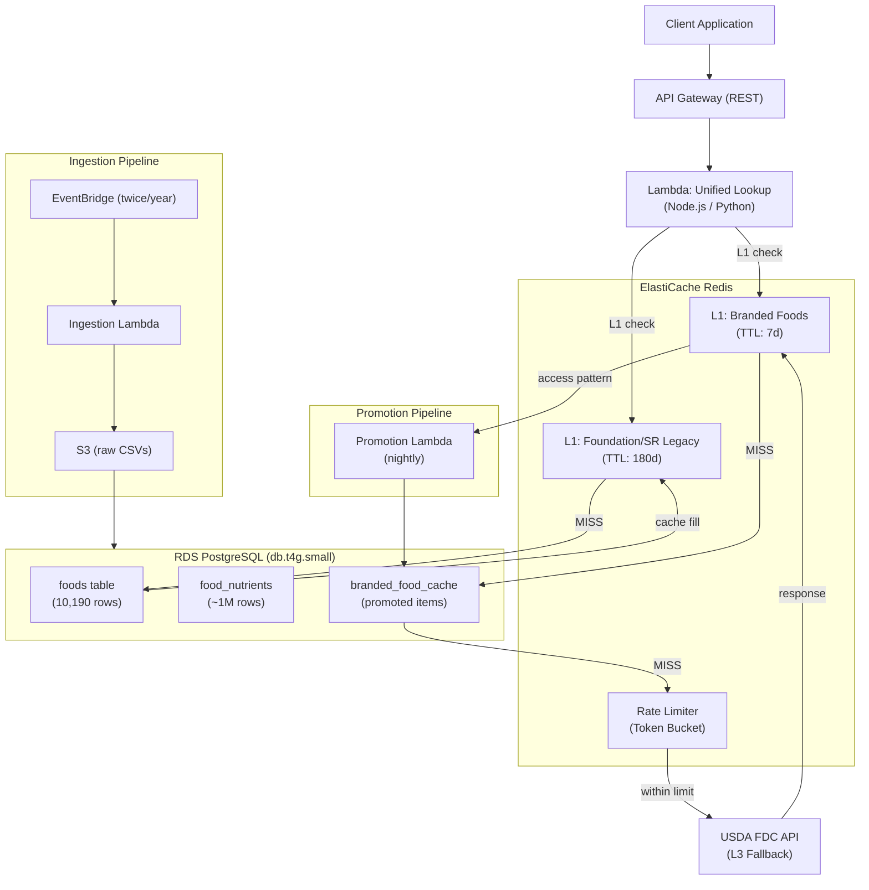
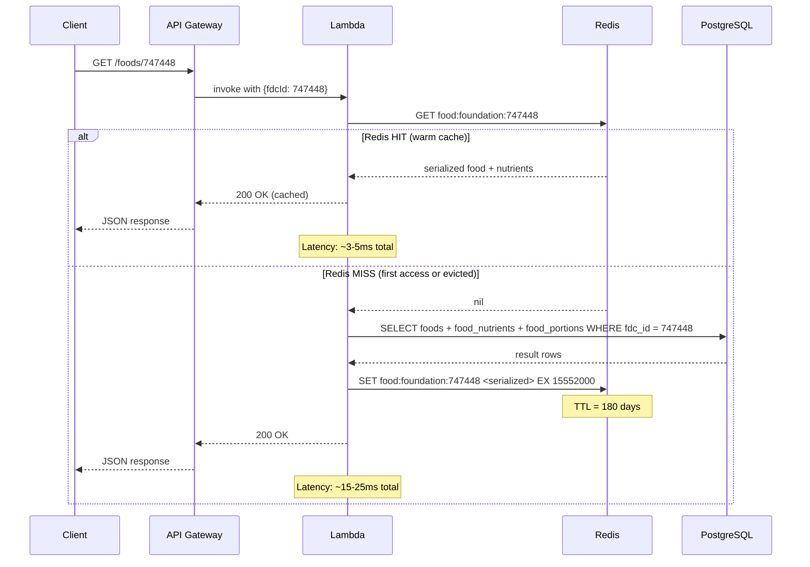
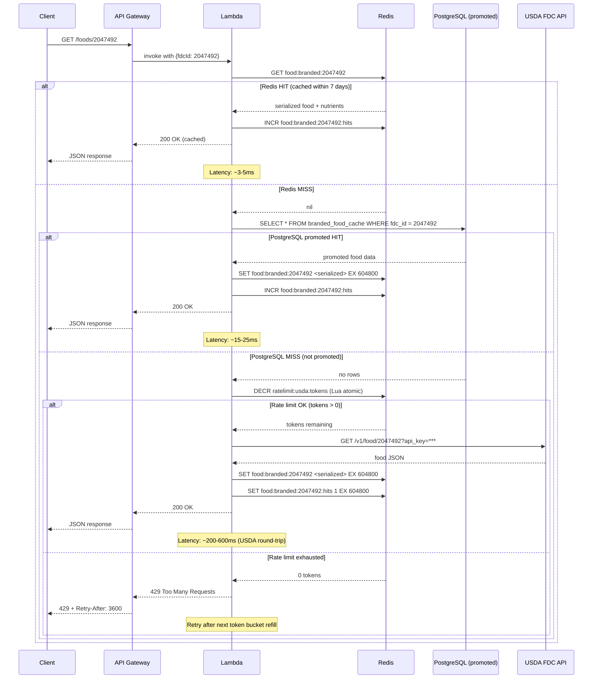
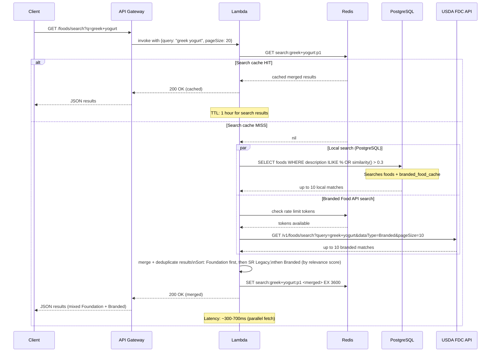

# Architecture 3: Hybrid (Local DB + API Fallback)

## Metadata

| Field    | Value                                       |
| -------- | ------------------------------------------- |
| Status   | Proposal                                    |
| Date     | 2026-04-07                                  |
| Author   | AI-Generated                                |
| Version  | 1.0                                         |
| Category | Backend Architecture / Data Access Strategy |

---

## Executive Summary

This architecture takes a pragmatic view of the USDA FoodData Central dataset: not all 330K+ foods are created equal. Foundation Foods (~1,400 items) and SR Legacy (~8,790 items) represent the nutritionally authoritative, analytically rich data that recipe applications depend on — chicken breasts, rice, flour, eggs, butter. These fit in under 200 MB of PostgreSQL storage and can be fully materialized locally. Branded Foods (~300K items) are important for barcode scanning and packaged product lookup, but the vast majority will never appear in a typical recipe app's query log.

The result is a three-tier lookup strategy: Redis as L1 hot cache, PostgreSQL as L2 for local Foundation and SR Legacy data, and the USDA API as L3 fallback for Branded Foods. A promotion pipeline watches Redis access patterns and permanently persists frequently accessed Branded Foods to PostgreSQL, so the system gradually becomes more self-sufficient over time. After 30 days of real traffic, an estimated 80% of all Branded Food lookups will be served from local storage.

This is the "Goldilocks" architecture of the five proposals: more resilient and cost-effective than a pure caching proxy (Architecture 2), and significantly cheaper to operate than the full mirror (Architecture 1). The trade-off is routing complexity — two distinct data paths must stay synchronized and observable. Teams with moderate operational maturity and budgets in the $60-90/month range will find this the most defensible long-term choice.

---

## Context & Problem Statement

The USDA FoodData Central (FDC) database contains over 330,000 foods across five datasets, but the distribution of value for recipe applications is highly skewed:

**Foundation Foods (~1,400 items)** are the highest-quality entries in the database. Each item includes multiple analytical data points per nutrient — minimum, maximum, median, and standard deviation — derived from laboratory analyses of multiple samples. When a recipe calls for "chicken breast, boneless, skinless," Foundation Foods provides the definitive nutritional answer. The complete dataset is 3.4 MB zipped, 29 MB unzipped. It updates roughly twice per year.

**SR Legacy (~8,790 items)** is the final release of the USDA Standard Reference database, frozen at April 2018. It covers a broad range of natural and minimally processed foods with high reliability. At 6.7 MB zipped and 54 MB unzipped, it never changes — once loaded, it requires zero maintenance.

**Branded Foods (~300K items)** are manufacturer-submitted entries for packaged and processed products. At 427 MB zipped, this dataset is two orders of magnitude larger than Foundation + SR Legacy combined. These items are essential for barcode scanning features but account for a small fraction of ingredient lookups in recipe contexts. Storing all 300K locally has a real cost in storage, ingestion complexity, and sync maintenance.

**The USDA rate limit is 1,000 requests per hour.** For the ~10,190 Foundation + SR Legacy foods, this limit is irrelevant — they live in PostgreSQL. For Branded Foods, 1,000 req/hr with batch requests of 20 IDs means up to 20,000 Branded Food lookups per hour from the API before throttling — more than sufficient for a cold-start scenario.

The core insight: store the small, high-value datasets locally and lazy-fetch the large, lower-priority dataset on demand. The USDA API becomes a supplementary source rather than a primary dependency.

---

## Architecture Overview

### Three-Tier Lookup Strategy

```
L1: Redis (hot cache)
  ├── Foundation/SR Legacy items cached after first PostgreSQL read (TTL: 180 days)
  └── Branded Food items cached after first USDA API fetch (TTL: 7 days)

L2: PostgreSQL (local store)
  ├── Foundation Foods: ~1,400 items (fully populated)
  ├── SR Legacy: ~8,790 items (fully populated)
  └── Branded Foods (promoted): grows over time based on access frequency

L3: USDA FDC API (external fallback)
  └── Branded Foods: fetched on demand, rate-limited via Redis token bucket
```

Every lookup begins at Redis. If it misses, the system checks whether the food's `data_type` is `foundation_food` or `sr_legacy_food` — if so, it goes to PostgreSQL (guaranteed to have the data). If the food is `branded_food`, it checks the PostgreSQL promoted table first, then falls back to the USDA API.

### System Architecture Diagram



### Key Insight

Common recipe ingredients — chicken, rice, flour, eggs, butter, whole milk, olive oil, onions, garlic, tomatoes — are all Foundation Foods. These represent the vast majority of ingredient lookups in any recipe application. They are always served from PostgreSQL (or Redis after first access), with no dependency on the USDA API whatsoever.

---

## System Components

### 1. PostgreSQL (Amazon RDS)

Stores the authoritative local copy of Foundation Foods and SR Legacy data. Much smaller than a full mirror since Branded Foods are not pre-loaded.

**Instance:** `db.t4g.small` (2 vCPU, 2 GB RAM)

At ~10,190 rows in the foods table and ~1 million rows in food_nutrients, this instance is appropriately sized. The full mirror (Architecture 1) requires `db.t4g.medium` for 15M+ nutrient rows; this dataset is 15x smaller.

**Storage:** 10 GB gp3

Actual data footprint: approximately 200 MB with all indexes. The 10 GB allocation provides ~50x headroom for promoted Branded Foods growth, WAL files, and operational overhead. gp3 delivers 3,000 IOPS and 125 MB/s throughput at the base tier — more than sufficient.

**Schema:** Same structure as a full mirror but sparsely populated. Only Foundation and SR Legacy rows exist at launch. The `data_type` column on the `foods` table allows routing logic to determine whether to consult PostgreSQL or the USDA API without an extra lookup.

**Full-text search:** `pg_trgm` extension with `GIN` indexes on `description` and `additional_descriptions` columns. Trigram similarity search handles typos and partial matches for local foods. Branded Food search delegates to the USDA API's search endpoint.

**Estimated DB size at launch:** ~200 MB data + ~80 MB indexes = ~280 MB total. Well under 1% of the allocated 10 GB.

---

### 2. ElastiCache Redis

Plays a dual role: hot cache for local data and primary persistence layer for Branded Foods between USDA API calls.

**Instance:** `cache.t4g.small` (1.37 GB RAM)

**Eviction policy:** `allkeys-lfu` (Least Frequently Used across all keys)

LFU is the correct choice for this workload. Food lookup patterns follow a power law — a small number of items (Foundation Foods) are accessed extremely frequently, while the long tail of Branded Foods are accessed rarely. LFU ensures hot Foundation/SR Legacy items are never evicted to make room for cold Branded Foods.

**Two logical cache roles:**

**Role A — Foundation/SR Legacy hot cache**

- Key pattern: `food:foundation:{fdcId}` and `food:srlegacy:{fdcId}`
- TTL: 180 days (effectively permanent; refreshed on ingestion)
- Stores full serialized food + nutrient response
- Purpose: Eliminate PostgreSQL reads for repeat queries on common ingredients

**Role B — Branded Foods cache**

- Key pattern: `food:branded:{fdcId}`
- TTL: 7 days
- Stores full serialized food + nutrient response from USDA API
- Purpose: Avoid repeat API calls for recently accessed Branded Foods

**Rate limiter:**

- Key pattern: `ratelimit:usda:tokens`
- Implements a sliding window token bucket: 1,000 tokens replenished hourly
- Each API call (single food) costs 1 token; each batch call costs 1 token regardless of batch size
- Lambda checks and decrements atomically via Lua script before every USDA API call

---

### 3. Lambda (API Layer + USDA Proxy)

A unified lookup Lambda handles all food requests. Routing logic based on `data_type` keeps the implementation straightforward.

**Runtime:** Node.js 22.x or Python 3.13 (team preference)

**Memory:** 512 MB (sufficient for in-memory result merging during search queries)

**Timeout:** 10 seconds (accommodates USDA API round-trip latency)

**Lookup routing logic:**

```
if (fdcId provided):
    check Redis L1
    if HIT: return cached result

    if data_type in (foundation_food, sr_legacy_food):
        query PostgreSQL
        cache in Redis (TTL 180d)
        return result

    if data_type == branded_food:
        check PostgreSQL promoted table
        if HIT: cache in Redis (TTL 7d), return result
        check rate limit token bucket
        if tokens available: call USDA API, cache in Redis, return result
        if rate limited: return 429 with Retry-After header
```

**USDA API proxy features:**

- Passes `api_key` from Secrets Manager — never exposed to client
- Retries on 5xx with exponential backoff (max 3 attempts)
- Smart batching: when multiple Branded Food IDs are requested simultaneously, groups them into POST `/v1/foods` batch requests (up to 20 IDs per call)
- Logs every USDA API call with token consumption for monitoring

**VPC configuration:** Lambda runs in private subnets, routes outbound to USDA API via NAT Gateway. PostgreSQL and Redis are reachable via VPC-internal endpoints.

---

### 4. Data Ingestion (Local Datasets Only)

Intentionally minimal — this is a major operational advantage over a full mirror.

**EventBridge schedule:**

- Foundation Foods: twice per year (aligned with USDA release cycle, ~April and ~October)
- SR Legacy: never (dataset is frozen at April 2018, load once at deployment)

**Ingestion Lambda steps:**

1. Download Foundation Foods CSV from USDA FDC bulk download endpoint (3.4 MB zipped)
2. Upload raw file to S3 for audit trail
3. Parse CSV (streaming, low memory footprint)
4. Upsert into PostgreSQL using `INSERT ... ON CONFLICT DO UPDATE`
5. Invalidate Redis keys for updated items
6. Emit CloudWatch metric: `IngestedItemCount`, `UpdatedItemCount`, `IngestionDurationMs`

**SR Legacy initial load:** Run once at deployment via a one-time Lambda invocation or a database migration script. The 8,790 items take under 60 seconds to load.

**Download size:** 3.4 MB (Foundation) + 6.7 MB (SR Legacy, one-time) vs. 458 MB for the full dataset. The ingestion Lambda's memory footprint and execution time are negligible.

---

### 5. Branded Food Promotion Pipeline (Optional)

A background process that converts frequently accessed Branded Foods from ephemeral Redis cache entries into permanent PostgreSQL rows. Over time, this "learns" which Branded Foods your users actually care about.

**Nightly promotion Lambda (EventBridge, 02:00 UTC):**

1. Scan Redis for Branded Food keys: `food:branded:*`
2. Retrieve access count metadata (tracked via a parallel `food:branded:{fdcId}:hits` counter incremented on each cache hit)
3. Identify items accessed more than 100 times in the past 7 days
4. Fetch full food data from Redis (already cached)
5. Insert into `branded_food_cache` table in PostgreSQL
6. Set Redis TTL on the item to 365 days (considered "promoted")
7. Emit metric: `PromotedFoodCount`

**Threshold rationale:** 100 accesses / 7 days ≈ 14 accesses/day. This filters out one-off lookups while capturing genuinely popular items. The threshold is configurable via an environment variable.

**Expected growth curve:**

- Day 0: 0 promoted items
- Day 7: First promotion batch runs — popular Branded Foods from week 1
- Day 30: Estimated 200-500 promoted Branded Foods (varies by app usage patterns)
- Day 90: API fallback rate for Branded Foods drops significantly; most lookups hit PostgreSQL or Redis

---

### 6. Monitoring & Observability

CloudWatch custom metrics emitted by Lambda on every request:

**Cache performance:**

- `CacheHitRatio` (dimension: `DataType` = foundation, sr_legacy, branded)
- `CacheMissByTier` (dimension: `Tier` = redis, postgres, usda_api)

**USDA API consumption:**

- `UsdaApiCallCount` (per hour)
- `UsdaRateLimitTokensRemaining` (sampled every 5 minutes)
- `UsdaApiLatencyMs` (p50, p95, p99)

**Lookup latency by tier:**

- `LookupLatencyMs` (dimension: `Tier` = redis_hit, postgres_hit, usda_api_hit)
- Target SLAs: Redis < 5ms, PostgreSQL < 20ms, USDA API < 500ms

**Promotion pipeline:**

- `PromotedFoodCount` (nightly)
- `PromotionCandidateCount` (items above threshold)

**Alerts:**

- USDA rate limit tokens < 100 remaining (SNS → PagerDuty or email)
- USDA API error rate > 5% over 5 minutes
- PostgreSQL connection pool exhaustion
- Lookup p99 > 1 second for Foundation/SR Legacy (should never happen — indicates DB issue)

---

## Data Model

The schema mirrors a full FDC database in structure but is sparsely populated at launch. This keeps the routing logic simple (same queries work regardless of data source) and makes future migration to a full mirror straightforward.

```sql
-- Core food identity table
-- At launch: ~10,190 rows (Foundation + SR Legacy only)
-- data_type drives routing logic in Lambda
CREATE TABLE foods (
    fdc_id           INTEGER PRIMARY KEY,
    data_type        TEXT NOT NULL CHECK (data_type IN (
                         'foundation_food',
                         'sr_legacy_food',
                         'branded_food',      -- promoted items only
                         'survey_fndds_food'  -- if FNDDS is in scope
                     )),
    description      TEXT NOT NULL,
    food_category_id INTEGER REFERENCES food_categories(id),
    publication_date DATE,
    data_source      TEXT NOT NULL CHECK (data_source IN (
                         'local_bulk_import',   -- Foundation, SR Legacy via ingestion Lambda
                         'usda_api_fetch',      -- fetched on demand (should not appear here at launch)
                         'promoted_from_cache'  -- Branded Foods promoted by promotion pipeline
                     )),
    created_at       TIMESTAMPTZ NOT NULL DEFAULT NOW(),
    updated_at       TIMESTAMPTZ NOT NULL DEFAULT NOW()
);

-- Trigram index for full-text search on local foods
CREATE EXTENSION IF NOT EXISTS pg_trgm;
CREATE INDEX idx_foods_description_trgm
    ON foods USING GIN (description gin_trgm_ops);
CREATE INDEX idx_foods_data_type
    ON foods (data_type);

-- Food categories (reference data, ~100 rows)
CREATE TABLE food_categories (
    id          INTEGER PRIMARY KEY,
    code        TEXT,
    description TEXT NOT NULL
);

-- Nutrient definitions (~200 rows, loaded once)
CREATE TABLE nutrients (
    id                    INTEGER PRIMARY KEY,
    name                  TEXT NOT NULL,
    unit_name             TEXT NOT NULL,
    nutrient_nbr          NUMERIC,
    rank                  INTEGER
);

-- Food-nutrient associations
-- At launch: ~1M rows (Foundation ~400K + SR Legacy ~600K)
-- Compare: full mirror has ~15M rows
CREATE TABLE food_nutrients (
    id                    BIGSERIAL PRIMARY KEY,
    fdc_id                INTEGER NOT NULL REFERENCES foods(fdc_id) ON DELETE CASCADE,
    nutrient_id           INTEGER NOT NULL REFERENCES nutrients(id),
    amount                NUMERIC,
    -- Foundation Foods only: analytical statistics
    data_points           INTEGER,          -- NULL for SR Legacy
    derivation_id         INTEGER,
    min                   NUMERIC,          -- NULL for SR Legacy
    max                   NUMERIC,          -- NULL for SR Legacy
    median                NUMERIC,          -- NULL for SR Legacy
    UNIQUE (fdc_id, nutrient_id)
);

CREATE INDEX idx_food_nutrients_fdc_id ON food_nutrients (fdc_id);
CREATE INDEX idx_food_nutrients_nutrient_id ON food_nutrients (nutrient_id);

-- Serving size information
CREATE TABLE food_portions (
    id                    SERIAL PRIMARY KEY,
    fdc_id                INTEGER NOT NULL REFERENCES foods(fdc_id) ON DELETE CASCADE,
    seq_num               INTEGER,
    amount                NUMERIC,
    measure_unit_id       INTEGER,
    portion_description   TEXT,
    modifier              TEXT,
    gram_weight           NUMERIC NOT NULL
);

CREATE INDEX idx_food_portions_fdc_id ON food_portions (fdc_id);

-- Foundation Foods specific metadata
-- Only ~1,400 rows
CREATE TABLE foundation_food_details (
    fdc_id              INTEGER PRIMARY KEY REFERENCES foods(fdc_id),
    footnote            TEXT,
    is_historical_reference BOOLEAN DEFAULT FALSE,
    ndb_number          INTEGER
);

-- SR Legacy specific metadata
CREATE TABLE sr_legacy_food_details (
    fdc_id              INTEGER PRIMARY KEY REFERENCES foods(fdc_id),
    ndb_number          INTEGER UNIQUE
);

-- Promoted Branded Foods cache table
-- Initially empty; grows via the promotion pipeline
-- Stores the full USDA API response as JSONB for flexibility
-- Avoids complex schema mapping for a dataset we don't fully control
CREATE TABLE branded_food_cache (
    fdc_id              INTEGER PRIMARY KEY,
    description         TEXT NOT NULL,
    brand_owner         TEXT,
    brand_name          TEXT,
    gtin_upc            TEXT,              -- barcode
    serving_size        NUMERIC,
    serving_size_unit   TEXT,
    household_serving_fulltext TEXT,
    branded_food_category TEXT,
    api_response_json   JSONB NOT NULL,   -- full USDA API response
    access_count        INTEGER NOT NULL DEFAULT 0,
    first_fetched_at    TIMESTAMPTZ NOT NULL DEFAULT NOW(),
    promoted_at         TIMESTAMPTZ NOT NULL DEFAULT NOW(),
    last_accessed_at    TIMESTAMPTZ NOT NULL DEFAULT NOW(),
    api_updated_date    DATE             -- from USDA response, for staleness checks
);

CREATE INDEX idx_branded_food_cache_gtin ON branded_food_cache (gtin_upc)
    WHERE gtin_upc IS NOT NULL;
CREATE INDEX idx_branded_food_cache_description_trgm
    ON branded_food_cache USING GIN (description gin_trgm_ops);
CREATE INDEX idx_branded_food_cache_access_count
    ON branded_food_cache (access_count DESC);

-- Table population status at launch
-- +-----------------------+------------------+--------------------+
-- | Table                 | Rows at Launch   | Fully Populated?   |
-- +-----------------------+------------------+--------------------+
-- | foods                 | ~10,190          | No (no Branded)    |
-- | food_nutrients        | ~1,000,000       | No (no Branded)    |
-- | food_portions         | ~50,000          | No (no Branded)    |
-- | foundation_food_details| ~1,400          | Yes                |
-- | sr_legacy_food_details| ~8,790           | Yes                |
-- | branded_food_cache    | 0                | N/A (grows over time)|
-- | food_categories       | ~100             | Yes                |
-- | nutrients             | ~200             | Yes                |
-- +-----------------------+------------------+--------------------+
```

**Key design decisions:**

- `branded_food_cache` uses `JSONB` for the full API response rather than a normalized schema. Branded Food data from the USDA API has inconsistent field presence; JSONB avoids nullable column sprawl and allows querying specific fields when needed.
- `data_source` column on `foods` provides an audit trail for every row's origin.
- `food_nutrients.data_points`, `min`, `max`, `median` are nullable. Foundation Foods populate these; SR Legacy rows leave them NULL. This avoids a separate table join for callers who want Foundation-specific analytics.

---

## Data Flow

### Scenario 1: Foundation / SR Legacy Lookup (Local Path — Fastest)

A client requests nutritional data for `fdcId=747448` (chicken breast, Foundation Food).



**Characteristics:** No external API calls. No rate limit concerns. Consistent sub-25ms p99 for any Foundation or SR Legacy food, regardless of traffic volume.

---

### Scenario 2: Branded Food Lookup (API Path)

A client requests `fdcId=2047492` (specific yogurt brand, Branded Food).



**Characteristics:** Best-case (Redis hit) is identical to Foundation path at ~3-5ms. Worst-case (cold USDA API call) is ~200-600ms. After the first fetch, subsequent calls serve from Redis for 7 days.

---

### Scenario 3: Search Query (Mixed Results)

A client searches for "greek yogurt" — results should span both local Foundation/SR Legacy foods and Branded Foods.



**Characteristics:** PostgreSQL search and USDA API search run in parallel, minimizing total latency. Results are merged with Foundation and SR Legacy items ranked above Branded Foods. Search results cached for 1 hour.

---

## Scalability

### Local Data Path (Foundation + SR Legacy)

The local path scales identically to a full PostgreSQL mirror at equivalent traffic. PostgreSQL handles thousands of read queries per second for a 10,190-row foods table. If read throughput becomes a bottleneck:

1. Add a read replica (RDS Multi-AZ read replica, `db.t4g.small`: ~$25/mo additional)
2. Redis already absorbs the vast majority of repeat reads — cold-start traffic is the only pressure on PostgreSQL

A Redis cache with a 180-day TTL for Foundation foods means that after the first 10,190 unique requests (which takes minutes at any meaningful traffic level), PostgreSQL receives almost no Foundation/SR Legacy reads. This path is effectively unlimited in throughput.

### Branded Foods Path

The Branded Food path has two scalability dimensions:

**Cache-served traffic (Redis):** Scales identically to Foundation — Redis handles millions of reads per second.

**Cold API traffic (USDA fallback):** Bounded by the 1,000 req/hr rate limit. With batch requests of 20 IDs, the effective limit is 20,000 unique Branded Food IDs per hour from a cold start.

The promotion pipeline reduces API dependency over time:

| Time Since Launch | Estimated Branded Food API Miss Rate    |
| ----------------- | --------------------------------------- |
| Day 1             | ~100% (everything is cold)              |
| Day 7             | ~40% (popular items promoted)           |
| Day 30            | ~20% (80% served locally or from Redis) |
| Day 90            | ~5-10% (long-tail items only)           |

This is a self-healing property: the more traffic the app receives, the more Branded Foods get promoted, the less the app depends on the USDA API.

### Vertical scaling

If `db.t4g.small` becomes a bottleneck (unlikely given the data size), upgrading to `db.t4g.medium` (4 GB RAM, ~$50/mo) doubles RAM and allows PostgreSQL to buffer the entire dataset in memory.

---

## Security Considerations

### Network Isolation

All components run in a VPC:

- RDS and ElastiCache in **private subnets** with no public access
- Lambda in **private subnets** with a NAT Gateway for outbound USDA API calls
- API Gateway as the sole public-facing entry point

Security groups enforce least-privilege connectivity:

- Lambda SG → RDS: port 5432 only
- Lambda SG → ElastiCache: port 6379 only
- Lambda SG → NAT Gateway: port 443 only (HTTPS to USDA API)

### Secrets Management

- USDA API key stored in **AWS Secrets Manager** (not environment variables)
- Lambda retrieves the key at cold start and caches it in memory for the function lifetime
- Key rotation: set a reminder for annual rotation; USDA API key compromise risk is low but non-zero
- RDS credentials also in Secrets Manager, rotated via RDS native rotation (90-day schedule)

### Encryption

- RDS: encryption at rest enabled (AES-256 via AWS KMS)
- ElastiCache: in-transit encryption via TLS (Redis `--tls-replication yes`)
- S3 (raw CSV storage): SSE-S3 default encryption
- All traffic between Lambda and AWS services uses TLS

### Input Sanitization

- `fdcId` parameter: validated as integer before use (prevents SQL injection via parameterized queries regardless, but defense in depth)
- Search query: maximum length enforced (256 characters), special characters stripped before constructing USDA API URL
- USDA API responses: validated against expected JSON schema before caching or returning to client

### IAM

Lambda execution role follows least-privilege:

- `rds-data:ExecuteStatement` or VPC-level PostgreSQL access (not admin credentials)
- `elasticache:Connect` for Redis
- `secretsmanager:GetSecretValue` scoped to specific secret ARNs
- `s3:PutObject` / `s3:GetObject` scoped to the ingestion bucket only

---

## Cost Analysis

All prices are AWS us-east-1, on-demand unless noted. Prices current as of April 2026.

### Fixed Monthly Costs

| Component                 | Spec                       | Monthly Cost (On-Demand)   | Monthly Cost (1yr Reserved) |
| ------------------------- | -------------------------- | -------------------------- | --------------------------- |
| RDS PostgreSQL            | db.t4g.small (2 vCPU, 2GB) | ~$25.55                    | ~$16.06 (~37% off)          |
| RDS Storage               | 10 GB gp3                  | ~$1.15                     | ~$1.15 (no reserved)        |
| RDS Backup Storage        | 1x DB size (free tier)     | $0.00                      | $0.00                       |
| ElastiCache Redis         | cache.t4g.small (1.37 GB)  | ~$22.27                    | ~$14.14 (~37% off)          |
| NAT Gateway               | 1 AZ, hourly charge        | ~$32.40 (730 hrs × $0.045) | ~$32.40 (no reserved)       |
| CloudWatch Logs & Metrics | Custom metrics + logs      | ~$3.00-5.00                | ~$3.00-5.00                 |
| S3 (raw CSV storage)      | < 500 MB                   | ~$0.01                     | ~$0.01                      |

**NAT Gateway note:** At $0.045/hr, the NAT Gateway is the single largest line item after RDS and ElastiCache. This is an unavoidable cost any time Lambda needs to call external APIs. NAT Gateway data processing charges ($0.045/GB) are additional but minimal at this scale — 1,000 USDA API calls/day × ~10 KB/response = ~90 MB/day × $0.045 = ~$0.12/day = ~$3.60/mo.

### Variable Monthly Costs

| Component            | Low Traffic (~1K DAU) | Medium Traffic (~10K DAU) | High Traffic (~100K DAU) |
| -------------------- | --------------------- | ------------------------- | ------------------------ |
| Lambda invocations   | ~$0.50                | ~$2.00                    | ~$15.00                  |
| API Gateway requests | ~$0.35                | ~$3.50                    | ~$35.00                  |
| NAT Gateway data     | ~$0.50                | ~$2.00                    | ~$10.00                  |

### Total Monthly Estimates

| Traffic Tier | On-Demand Total | 1-Year Reserved Total | Notes                             |
| ------------ | --------------- | --------------------- | --------------------------------- |
| **Low**      | ~$85/mo         | ~$69/mo               | 1K DAU, mostly Foundation Foods   |
| **Medium**   | ~$91/mo         | ~$75/mo               | 10K DAU, mixed Foundation+Branded |
| **High**     | ~$124/mo        | ~$108/mo              | 100K DAU, may need read replica   |

At high traffic, consider adding a read replica (~$16/mo reserved) before upgrading the primary instance. The promotion pipeline pays off at high traffic — fewer USDA API calls means lower NAT Gateway data costs.

**Cost comparison snapshot:**

- Architecture 1 (full mirror): ~$115-140/mo
- Architecture 3 (this document): ~$69-108/mo
- Savings: ~$30-50/mo by not storing or ingesting all 300K Branded Foods

---

## Failure Modes & Recovery

### PostgreSQL Failure

**Impact:** Foundation Foods and SR Legacy lookups fail for items not in Redis. New requests for cold Foundation/SR Legacy foods fail.

**Mitigation:**

- Redis hot cache absorbs most repeat requests even during DB outage
- Multi-AZ deployment (optional, ~$25/mo additional) provides automatic failover in ~60 seconds
- Branded Food path via USDA API is completely unaffected
- Degraded mode: Lambda detects PostgreSQL connection failure and returns 503 for Foundation/SR Legacy lookups with `Retry-After: 30` header

**Recovery:** RDS automated backups with 7-day retention. Point-in-time recovery available. If automated failover is enabled, no manual intervention required.

---

### Redis Failure

**Impact:** All L1 cache becomes unavailable. Every request misses to either PostgreSQL or USDA API.

**Mitigation:**

- PostgreSQL handles the load for Foundation/SR Legacy — at low traffic, this is a minor latency increase
- Branded Foods fall back to USDA API directly (rate limit applies)
- Lambda connection pool retries with exponential backoff; gracefully degrades to DB-only path

**Recovery:** ElastiCache Automatic Failover with a replica node (~$22/mo additional for second node). Without a replica, cold restart means empty cache — the system self-warms within minutes for hot Foundation items.

---

### USDA API Outage

**Impact:** Only Branded Foods not yet cached or promoted are unavailable. Foundation Foods and SR Legacy are completely unaffected.

**This is the key resilience advantage of this architecture.** The most common recipe ingredients always work regardless of USDA API status.

**Mitigation:**

- Return cached Branded Foods from Redis and PostgreSQL normally
- For cache misses during outage, return 503 with clear error message indicating the specific food is temporarily unavailable
- Lambda circuit breaker: after 5 consecutive USDA API failures, stop calling for 5 minutes (avoids wasting tokens on failed calls)

**Recovery:** Automatic — when USDA API recovers, Lambda resumes normal operation. No manual intervention required.

---

### Ingestion Failure (Foundation Foods Update)

**Impact:** Foundation Foods data stays at the previous version. Given updates happen twice per year, this means using data that may be 0-6 months old.

**Mitigation:**

- Previous data is nutritionally valid and functionally complete — this is an acceptable degraded state
- S3 holds the raw CSV for manual reprocessing
- EventBridge will retry on the next scheduled run (or a manual trigger)
- CloudWatch alarm on ingestion Lambda errors sends alert within 5 minutes

**Recovery:** Manually trigger the ingestion Lambda with the last successful CSV from S3, or wait for the next scheduled run.

---

### Rate Limit Exhaustion

**Impact:** Branded Food cache misses cannot be served from USDA API until the token bucket refills.

**Mitigation:**

- This only affects Branded Foods — Foundation/SR Legacy always available
- Token bucket refills 1,000 tokens per hour; exhaustion is recoverable within 1 hour
- Clients receive 429 with `Retry-After` indicating refill time
- Alert fires at < 100 tokens remaining, giving time to investigate before exhaustion

**Recovery:** Automatic — tokens refill hourly. If exhaustion is recurring, lower the promotion threshold to accelerate building the local Branded Foods catalog.

---

## Risks

| Risk                                                                                            | Impact                                                | Probability                                                               | Mitigation                                                                                                                                                          |
| ----------------------------------------------------------------------------------------------- | ----------------------------------------------------- | ------------------------------------------------------------------------- | ------------------------------------------------------------------------------------------------------------------------------------------------------------------- |
| Branded Food cache misses exceed rate limit during traffic spike                                | High — Branded Food lookups fail                      | Medium — any viral moment or new user surge triggers this                 | Token bucket rate limiter prevents exhaustion; promotion pipeline reduces dependency over time; return 429 with retry rather than failing silently                  |
| Data inconsistency: PostgreSQL Foundation data vs USDA API returning a different schema version | Medium — fields may differ across data_types          | Low — USDA API schema is relatively stable                                | Normalize API responses to internal schema before caching; integration tests comparing local and API responses for the same fdcId                                   |
| Promotion pipeline promotes low-quality or incorrect items (e.g., discontinued products)        | Low — incorrect data served to users                  | Low — access count threshold filters noise                                | Include `api_updated_date` from USDA response; re-validate promoted items weekly against USDA API; allow manual demotion                                            |
| PostgreSQL and USDA API returning different schema versions for overlapping items               | Medium — if a Foundation food also appears in Branded | Low — FDC IDs are unique per data_type                                    | Strict data_type routing: a given fdcId always resolves to exactly one data source; never query both paths for the same fdcId                                       |
| NAT Gateway cost increases with traffic growth                                                  | Medium — unexpected bill increase at high traffic     | High — any app growth triggers this                                       | Monitor NAT Gateway data processing charges in Cost Explorer; NAT Gateway has no reserved pricing option; budget for this scaling step explicitly                   |
| Complexity of managing two data sources creates debugging difficulty                            | Medium — incidents take longer to diagnose            | High — this is inherently more complex than single-source architectures   | Structured logging with `data_source` on every response; `x-data-source` response header for debugging; comprehensive CloudWatch dashboard showing all three tiers  |
| Redis eviction under LFU removes a Branded Food before promotion threshold is reached           | Low — users re-trigger a USDA API call                | Medium — LFU can evict items that are moderately popular but not top-tier | Increase Redis instance size if eviction rate is high; lower promotion threshold to 50 accesses if eviction is common; monitor eviction rate as a CloudWatch metric |

---

## Trade-offs

### Advantages

**Best of both worlds for typical recipe workloads.** Chicken, rice, flour, eggs, and olive oil are Foundation Foods — always local, always fast, no API dependency. The USDA API only enters the picture for packaged product lookups, which are a minority of recipe ingredient queries.

**Lower cost than full mirror.** Skipping the ingestion and storage of 300K Branded Foods saves ~$30-50/month compared to Architecture 1. The db.t4g.small instance is sufficient where a full mirror requires db.t4g.medium.

**Simpler ingestion.** Downloading 3.4 MB twice a year is trivially easy to operate. No S3 bulk download of 458 MB, no streaming parser for millions of rows, no extended ingestion windows.

**Core features work without USDA API.** If USDA goes down, recipe nutrition lookup for all whole and natural ingredients continues without interruption. This is a meaningful reliability improvement over pure API proxy architectures.

**Self-optimizing.** The promotion pipeline means the system improves over time without manual intervention. An app that gains popularity automatically reduces its API dependency.

### Disadvantages

**Most complex routing logic of the five architectures.** Every lookup must determine its data type and route accordingly. Bugs in routing produce subtle failures — a Foundation food accidentally routed to the USDA API path will still return data, but with different latency and reliability characteristics.

**Two data sources to keep in sync.** If USDA updates nutritional values for a Foundation Food between ingestion cycles, the local PostgreSQL data and the USDA API will temporarily disagree. For most recipe nutrition use cases, this is acceptable — but it requires explicit documentation for users.

**Branded Food first-access latency is higher.** Cold USDA API round-trips are 200-600ms. Users who frequently search for packaged products will notice a slower response on first access compared to a full mirror.

**NAT Gateway is still required.** The same ~$35/mo infrastructure cost as any Lambda-to-external-API architecture. There is no way to avoid this while calling the USDA API from Lambda inside a VPC.

**Promotion pipeline adds operational complexity.** A nightly Lambda that modifies the database based on heuristics is a new failure mode. The threshold tuning, monitoring, and occasional manual intervention add ongoing maintenance burden.

---

## When to Choose This Architecture

- Your recipe app primarily uses whole and natural ingredients. Foundation Foods covers chicken, beef, fish, dairy, grains, vegetables, fruits, legumes, nuts — everything in a typical recipe.
- You want high reliability for core features without the cost or complexity of a full mirror.
- Your traffic is in the 10K-100K DAU range, where the USDA rate limit is sufficient for cache-miss Branded Food lookups.
- You want a system that improves autonomously over time as usage patterns become clear.
- Your monthly infrastructure budget is $60-90 and you want the most defensible long-term architecture at that price point.
- You have a small engineering team that can invest 2-3 days in initial complexity but wants low ongoing maintenance.

---

## When NOT to Choose This Architecture

- Your app is primarily about packaged and branded foods — barcode scanning, grocery product lookup, meal kit services. If Branded Foods are your primary use case, the API fallback path will be your hot path, not your cold path.
- You need all 300K+ foods available with sub-50ms latency unconditionally. Only a full mirror (Architecture 1) guarantees that.
- Your complexity budget is low. This is the most architecturally complex of the five proposals. If your team is small and operational maturity is limited, a simpler architecture with higher per-unit cost may be the right trade-off.
- You can comfortably afford the full mirror ($80-100/mo) and prefer simplicity over cost optimization. The complexity tax here is only worth paying if the $30-50/month savings matter.

---

## Migration Path

### Evolving FROM Architecture 2 (Pure API Proxy)

Adding this architecture on top of a pure API proxy is the most natural upgrade path:

1. Provision RDS db.t4g.small and run the initial SR Legacy bulk load (one-time, ~60 seconds)
2. Deploy the Foundation Foods ingestion Lambda and run it immediately
3. Update the Lambda routing logic to check data_type and consult PostgreSQL before the USDA API
4. Deploy the promotion pipeline as a separate Lambda
5. Foundation/SR Legacy traffic immediately moves off the USDA API entirely

This migration can be done with zero downtime via a feature flag on the routing logic.

### Evolving TO Architecture 1 (Full Mirror)

If traffic growth warrants a full mirror, the migration path is straightforward:

1. Expand the ingestion Lambda to include Branded Foods (download the 427 MB CSV, stream-parse into PostgreSQL)
2. Upgrade RDS to db.t4g.medium (more RAM for 15M+ nutrient rows)
3. Increase storage to 50 GB gp3
4. Remove the USDA API fallback path from routing logic
5. Decommission the promotion pipeline (no longer needed)

The promoted Branded Foods in `branded_food_cache` provide a head start — the most popular items are already in PostgreSQL before the full migration completes.

---

## Implementation Roadmap

### Phase 1: PostgreSQL Schema + Foundation/SR Legacy Bulk Load (3 days)

- Provision RDS db.t4g.small in private subnet
- Run database migrations (schema above)
- One-time SR Legacy CSV load via migration script (8,790 items, ~60 seconds)
- Deploy Foundation Foods ingestion Lambda
- Run initial Foundation Foods ingestion (1,400 items, ~30 seconds)
- Verify row counts and sample nutrient data

**Deliverable:** PostgreSQL contains all Foundation + SR Legacy data. Queries return correct results.

---

### Phase 2: Redis Caching Layer with Three-Tier Lookup (3 days)

- Provision ElastiCache cache.t4g.small in private subnet
- Implement Redis cache read/write in Lambda with correct TTLs (180d Foundation, 7d Branded)
- Implement LFU eviction monitoring
- Write unit tests for cache hit/miss scenarios
- Deploy unified lookup Lambda with data_type routing

**Deliverable:** Foundation/SR Legacy lookups serve from Redis on second access. Cache hit ratio metric visible in CloudWatch.

---

### Phase 3: USDA API Proxy with Rate Limiting for Branded Foods (2 days)

- Retrieve USDA API key from Secrets Manager in Lambda
- Implement Redis token bucket rate limiter (Lua script for atomic decrement)
- Implement single-food and batch-food USDA API calls
- Add retry logic with exponential backoff
- Add circuit breaker for sustained USDA API failures
- Test rate limit enforcement under synthetic load

**Deliverable:** Branded Food lookups work end-to-end. Rate limit enforced. 429 response with Retry-After on exhaustion.

---

### Phase 4: Search Merging (Local + API Results) (2 days)

- Implement parallel search: PostgreSQL trigram search + USDA API search
- Merge and deduplicate results (Foundation first, SR Legacy second, Branded third)
- Cache merged search results in Redis (TTL 1 hour)
- Add pagination support for search results
- Test edge cases: search term matches only local, only Branded, or both

**Deliverable:** `/foods/search` endpoint returns results from both local and API sources with correct ranking.

---

### Phase 5: Branded Food Promotion Pipeline (3 days)

- Add `food:branded:{fdcId}:hits` counter increment to every Branded Food cache hit
- Implement nightly promotion Lambda (EventBridge schedule)
- Scan for items above promotion threshold (configurable, default 100)
- Insert promoted items into `branded_food_cache` PostgreSQL table
- Update Lambda routing to check `branded_food_cache` before USDA API
- Test promotion end-to-end: simulate 100+ accesses, verify promotion runs, verify subsequent lookup hits PostgreSQL

**Deliverable:** Frequently accessed Branded Foods persist to PostgreSQL. Promotion metrics visible in CloudWatch.

---

### Phase 6: Monitoring & Alerting (2 days)

- Add `CacheHitRatio` custom metric with `DataType` dimension
- Add `UsdaApiCallCount` and `UsdaRateLimitTokensRemaining` metrics
- Add `LookupLatencyMs` metric with `Tier` dimension
- Add `PromotedFoodCount` metric
- Create CloudWatch dashboard with all three tiers visible
- Configure alarms: rate limit < 100 tokens, USDA error rate > 5%, PostgreSQL p99 > 500ms
- Set up SNS topic for alarm notifications

**Deliverable:** Full observability into all three tiers. Alerts fire correctly under simulated failure conditions.

**Total estimated implementation time: 15 days (3 weeks) for a single engineer.**
