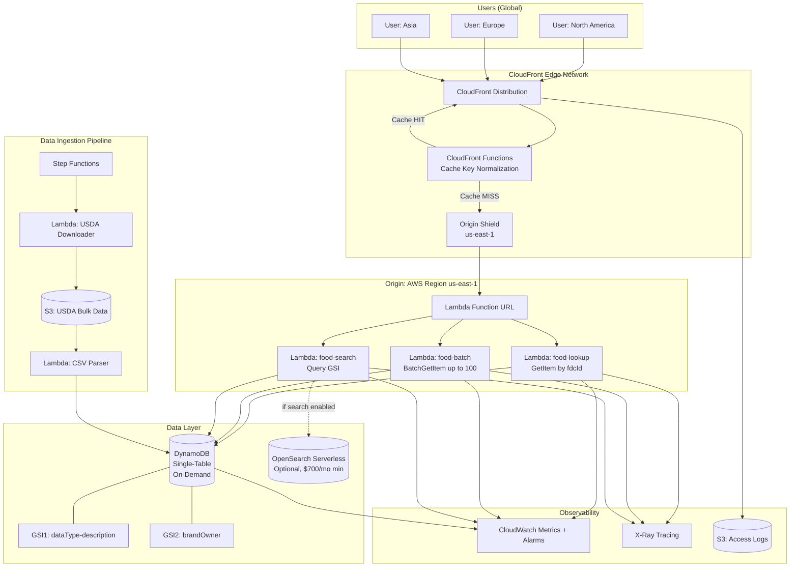
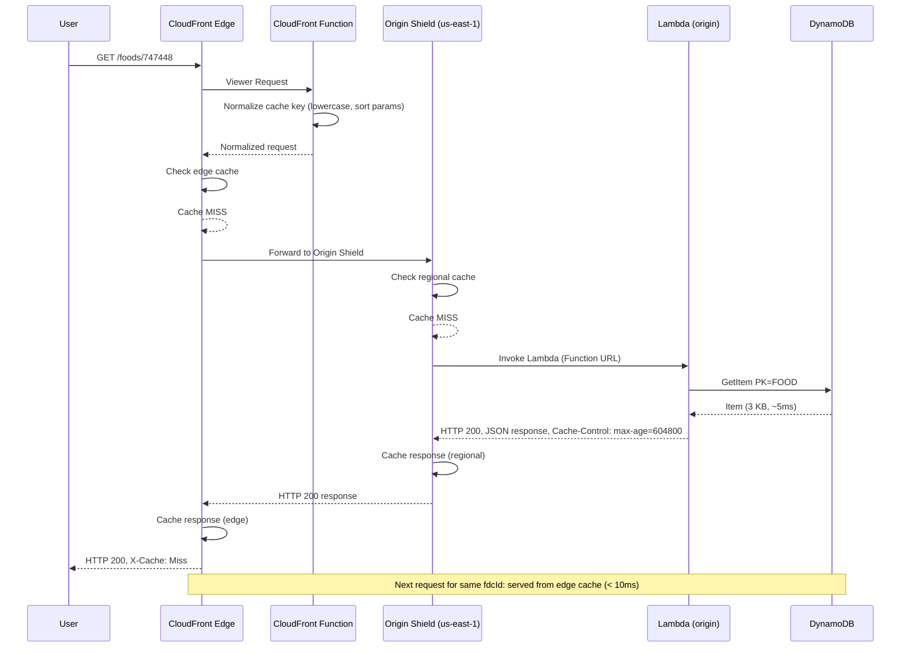
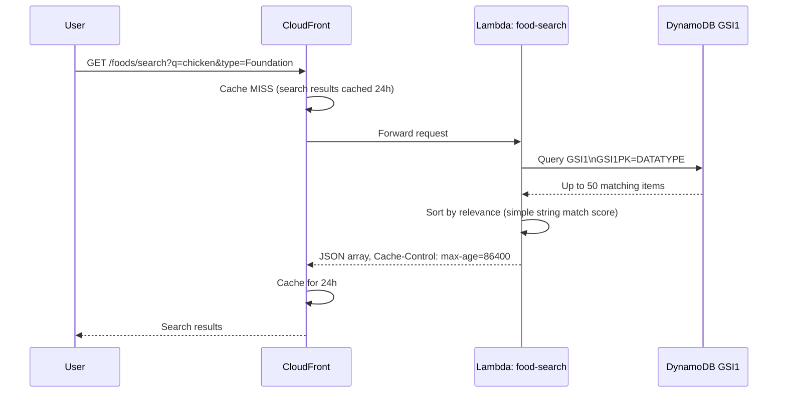
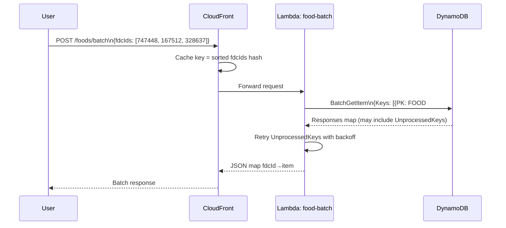

# Architecture 4: Edge-First Serverless (CloudFront + Lambda@Edge + DynamoDB)

## Metadata

| Field   | Value                                         |
| ------- | --------------------------------------------- |
| Status  | Proposal                                      |
| Date    | 2026-04-07                                    |
| Author  | AI-Generated                                  |
| Version | 1.0                                           |
| Tags    | serverless, dynamodb, cloudfront, lambda-edge |

---

## Executive Summary

This architecture eliminates every traditional server, managed database, and idle resource from the recipe application backend. DynamoDB stores all food and nutrition data in a single-table design optimized for the read-heavy, write-rarely access patterns of USDA FDC data. CloudFront sits in front of everything, caching responses at 400+ global edge locations and dramatically reducing the number of requests that ever reach origin infrastructure.

The result is an architecture that costs approximately $7/month at near-zero traffic, with no fixed baseline cost. Lambda functions spin up on demand, DynamoDB charges per request, and CloudFront's free tier covers the first 1 TB of transfer and 10 million requests per month. For applications in early stages or with unpredictable traffic, this is the most cost-efficient option available on AWS.

The primary constraint is search. DynamoDB is not a search engine, and achieving full-text search over 330K food descriptions requires either accepting degraded search quality (filtered queries with `contains()`) or paying for OpenSearch Serverless, which carries a hard floor of approximately $700/month just for the minimum OCU allocation. This architecture is ideal when basic filtering is acceptable and full-text search can be deferred or delegated to the USDA API as a fallback.

---

## Context & Problem Statement

### Why Edge-First?

USDA FDC data has specific characteristics that make it a poor fit for traditional server architectures and an excellent fit for edge caching:

- **Read-heavy, write-rarely.** The USDA publishes new data semi-annually. After ingestion, the data is essentially static. Reads will outnumber writes by a factor of millions to one.
- **Key-value access dominates.** The most common query is "give me the food with this `fdcId`." This maps perfectly to DynamoDB's primary key lookup model.
- **Global users, consistent data.** Food data doesn't change based on who is asking or where they are. The same response is valid for a user in Tokyo and a user in São Paulo, making it ideal for aggressive edge caching.
- **USDA rate limits enforce local storage.** At 1,000 requests per hour, the USDA API cannot serve production traffic. A local copy is mandatory, but it doesn't have to be RDS.

### Why Not Traditional Servers?

Fixed costs are the core problem. An RDS instance with a t3.micro runs around $15/month whether it receives one query or a million. A t3.medium is $30/month. Add ElastiCache for caching, EC2 or ECS for compute, a NAT Gateway for private subnet egress, and you're at $80-100/month before a single user has signed up.

At low traffic (fewer than 1,000 daily active users), that fixed cost is pure waste. This architecture replaces it with pay-per-request pricing where $0 traffic generates a $0 compute bill.

### The Core Insight

DynamoDB on-demand pricing is $0.25 per million read request units and $1.25 per million write request units. When CloudFront caches a response for 7 days, that one DynamoDB read serves potentially thousands of CloudFront cache hits at zero additional cost. The effective cost per user approaches zero as cache hit rates climb.

---

## Architecture Overview

This architecture has no servers, no RDS, no ElastiCache, and no EC2. Every component is either a managed AWS service or a function invoked on demand.

```
Users (globally distributed)
        |
        v
CloudFront (400+ edge locations)
  - Cache-Control TTLs by data type
  - Origin Shield: us-east-1
  - CloudFront Functions: cache key normalization
        |
        | (cache MISS only)
        v
Lambda Function URL (origin)
  - Food lookup (GetItem)
  - Batch lookup (BatchGetItem)
  - Search (Query + GSI)
        |
        v
DynamoDB (single-table, on-demand)
  - FOOD#{fdcId} items
  - GSI for type and brand browsing
        |
        ^ (optional, for full-text search only)
        |
OpenSearch Serverless (~$700/mo minimum — see trade-offs)
```

**Key components at a glance:**

| Component             | Role                        | Pricing Model            |
| --------------------- | --------------------------- | ------------------------ |
| CloudFront            | Edge cache, CDN, WAF entry  | Per request + transfer   |
| CloudFront Functions  | Cache key normalization     | Per invocation           |
| Lambda@Edge           | Complex origin routing      | Per invocation           |
| Lambda (origin)       | DynamoDB queries            | Per invocation           |
| DynamoDB              | Primary data store          | Per request + storage    |
| Step Functions        | Ingestion orchestration     | Per state transition     |
| OpenSearch Serverless | Full-text search (optional) | Per OCU-hour (EXPENSIVE) |
| S3                    | USDA bulk CSV storage, logs | Per GB stored            |

### Mermaid Architecture Diagram



---

## System Components

### 1. CloudFront Distribution

CloudFront is the first layer every request touches. It serves as the edge cache, CDN, and entry point for WAF rules. For read-heavy, globally consistent data like USDA FDC, CloudFront absorbs the overwhelming majority of traffic before it ever reaches a Lambda function or DynamoDB.

**Origin configuration:**

- Primary origin: Lambda Function URL (avoids API Gateway costs for simple HTTP)
- Origin Shield: `us-east-1` — adds a regional cache tier between edge locations and the Lambda origin, reducing origin load by an estimated 40-60% on top of edge caching

**Cache behaviors by path:**

| Path Pattern                  | TTL      | Reasoning                                         |
| ----------------------------- | -------- | ------------------------------------------------- |
| `/foods/{fdcId}` (SR Legacy)  | 365 days | SR Legacy data never changes once released        |
| `/foods/{fdcId}` (Foundation) | 180 days | Foundation data changes semi-annually at most     |
| `/foods/{fdcId}` (Branded)    | 7 days   | Branded data can update more frequently           |
| `/foods/search`               | 24 hours | Search results may shift as data is refreshed     |
| `/foods/batch`                | 7 days   | Batch results are as stable as individual lookups |

**Cache key policy:**

- Normalize query parameters: lowercase, sort alphabetically, strip whitespace
- Exclude `Authorization` header from cache key (use signed URLs instead)
- Include `Accept-Encoding` to serve compressed responses from cache

**Custom error responses:**

- 502/504 from origin: return stale cached response if available (stale-while-revalidate pattern)
- 404: return a structured JSON error response from CloudFront directly (no origin hit)

**Invalidation strategy:**

- After USDA bulk ingestion completes, trigger a targeted cache invalidation for modified food types
- Use path-prefix invalidation (`/foods/*`) or specific `fdcId` paths for surgical updates
- Note: invalidations cost $0.005 per path after the first 1,000/month — keep them targeted

---

### 2. Lambda@Edge / CloudFront Functions

Two function types handle different scopes of logic at the edge.

**CloudFront Functions (Viewer Request stage):**
Executes at every edge location for every request. Ultra-low latency, but limited to JavaScript with no network I/O. Used for:

- Cache key normalization: lowercase `fdcId`, sort query params, remove empty params
- Request validation: reject malformed `fdcId` values before they reach origin
- Header injection: add `X-Request-ID` for tracing

**Lambda@Edge (Origin Request stage):**
Executes only on cache misses, in the origin shield region. Allows full Node.js with async I/O. Used for:

- A/B routing: direct requests to different Lambda versions for gradual rollouts
- Request enrichment: add internal headers before forwarding to origin Lambda
- Path-based routing: route `/foods/search` to the search Lambda, `/foods/batch` to the batch Lambda

**Lambda@Edge (Viewer Response stage):**

- Inject `X-Cache-Status: HIT` or `MISS` headers so clients can observe caching behavior
- Inject `X-Origin-Region` for debugging multi-region setups
- Normalize `Cache-Control` response headers

**Important Lambda@Edge constraints:**

- Maximum memory: 128 MB (Viewer) / 10 GB (Origin)
- Maximum execution time: 5 seconds (Viewer) / 30 seconds (Origin)
- Cannot access VPC resources
- Deployed globally; must be created in `us-east-1`

---

### 3. Lambda Functions (Origin)

These are standard Lambda functions accessed via Function URL, invoked only on CloudFront cache misses.

**`food-lookup`**

- Trigger: CloudFront via Function URL
- Operation: `GetItem` on DynamoDB — `PK=FOOD#{fdcId}`, `SK=METADATA`
- Optionally project attributes to return only requested fields (reduces RCU consumption)
- Estimated duration: 3-10 ms after warm start
- Cold start: ~100-200 ms for Node.js (use Lambda SnapStart for Java if needed)

**`food-batch`**

- Trigger: CloudFront via Function URL
- Operation: `BatchGetItem` — up to 100 items per request
- Handles unprocessed keys with retry (DynamoDB can return partial results under load)
- Response: map of `fdcId` to food item, preserving request order

**`food-search`**

- Trigger: CloudFront via Function URL
- Operation (without OpenSearch): `Query` on GSI1 with `contains()` filter expression
  - Limitation: `contains()` requires a full table scan on the GSI, returns poor relevance ranking
  - For small result sets with a prefix, `begins_with()` on the sort key is more efficient
- Operation (with OpenSearch): forward query to OpenSearch Serverless collection
- Response: array of food summaries with `fdcId`, `description`, `dataType`, `brandOwner`

**Runtime:** Node.js 22.x (latest LTS as of 2026)
**Memory:** 512 MB for lookup/batch, 1 GB for search (larger heap for result sorting)
**Architecture:** arm64 (Graviton2) — ~20% cheaper than x86 for same performance

---

### 4. DynamoDB — Primary Data Store

DynamoDB is the core of this architecture. It replaces PostgreSQL, RDS, and ElastiCache in a single service. The key design choice is on-demand (pay-per-request) capacity mode, which means $0 charges when nothing is reading or writing.

**Capacity mode:** On-demand

- No capacity planning required
- Scales instantly to any traffic level
- Pricing: $0.25/million RRU, $1.25/million WRU

**Table name:** `food-data` (single-table design)

**Estimated data volumes:**

- ~330,000 food items (METADATA records)
- ~15,000,000 nutrient records (NUTRIENT records, roughly 45 nutrients per food)
- ~1,000,000 portion records (PORTION records)
- Total items: ~16.3 million
- Estimated storage: ~2-3 KB per food item (denormalized METADATA), ~200 bytes per nutrient record, ~300 bytes per portion
- Rough total storage: 330K _ 3 KB + 15M _ 0.2 KB + 1M \* 0.3 KB = ~4.9 GB
- Storage cost at $0.25/GB: ~$1.22/month

**DynamoDB item size limit awareness:**

- Maximum item size: 400 KB
- Foods with 100+ nutrients are at risk if nutrients are embedded in the METADATA item
- Mitigation: store nutrients as separate items (`SK=NUTRIENT#{nutrientId}`) and embed only the top 20 nutrients in the METADATA item for fast single-read access
- A food item with 186 nutrients (the maximum in USDA FDC) stored as separate items is well within limits (~200 bytes each)

---

### 5. OpenSearch Serverless (Optional, Expensive)

OpenSearch Serverless provides the closest equivalent to PostgreSQL's `pg_trgm` or Elasticsearch for full-text search over food descriptions. It is genuinely powerful. It is also genuinely expensive.

**Minimum cost:** 2 indexing OCUs + 2 search OCUs = 4 OCUs total

- At $0.24/OCU-hour: 4 _ $0.24 _ 720 hours = **$691/month minimum**
- This cost exists whether you receive one query or one million queries per month
- There is no free tier, no auto-scale-to-zero for OpenSearch Serverless

**What you get for $700/month:**

- BM25 relevance ranking over food descriptions
- Fuzzy matching ("applle" finds "apple")
- Multi-field search (description, brand, category simultaneously)
- Faceted filtering with aggregations

**Alternatives that cost $0:**

1. **DynamoDB `contains()` filter** — Scans the GSI1 description index. Slow for large datasets, no relevance ranking, but functional for exact substring matches. Acceptable if search quality can be low.

2. **USDA FDC Search API fallback** — Use the USDA's own search endpoint for complex queries. Rate limited to 1,000 requests/hour, but the rate limit applies to the application, not per user. Works well for infrequent complex searches.

3. **Client-side search on a subset** — Cache a compressed index of food descriptions in CloudFront, serve it to clients, perform search in the browser. Feasible for a single food category (Branded only = ~250K items), impractical for the full dataset.

**Recommendation:** Do not deploy OpenSearch Serverless unless search quality is a hard requirement and the $700/month floor has been explicitly budgeted. The cost transforms this from the cheapest architecture to one of the most expensive.

---

### 6. Data Ingestion Pipeline

The ingestion pipeline runs on a schedule (semi-annually, aligned with USDA release dates) and is fully serverless.

**Orchestration:** AWS Step Functions (Standard Workflow)

- Retries built into each state
- Partial progress is preserved — if ingestion fails at batch 5,000, it resumes from batch 5,000
- Visual execution monitoring in AWS Console

**Pipeline steps:**

```
Step 1: Download
  Lambda (2 GB memory, 15 min timeout)
  Downloads USDA bulk CSV files from FDC API to S3
  Files: FoodData_Central_*.csv (~500 MB total)

Step 2: Parse + Shard
  Lambda (2 GB memory, 15 min timeout)
  Reads CSV from S3, splits into shards of 2,500 records
  Writes shard manifest to S3 (list of S3 keys)

Step 3: Fan-out (Map state in Step Functions)
  Parallel Lambda invocations, one per shard
  Each Lambda reads its shard from S3

Step 4: Write to DynamoDB (per shard)
  Lambda calls BatchWriteItem (max 25 items per call)
  2,500 records / 25 per batch = 100 BatchWriteItem calls per shard
  330K records total = 13,200 BatchWriteItem calls
  Handles unprocessed items with exponential backoff

Step 5: Verify
  Lambda queries DynamoDB for record counts by dataType
  Compares against expected counts from CSV
  Sends SNS notification with ingestion summary
```

**Ingestion cost estimate:**

- WRU calculation: 330K food items, average 2 KB each = 330K WCUs (1 WCU per 1 KB, round up)
- Plus 15M nutrient records at ~0.2 KB = 15M \* 1 WCU = 15M WCUs
- Total write cost: ~15.33M WCUs \* $1.25/million = **~$19 per full ingestion** (one-time, semi-annually)
- Incremental updates (new/changed foods only) cost proportionally less

**Ingestion time estimate:**

- 13,200 `BatchWriteItem` calls across parallel shards
- With 50 concurrent Lambda functions (default limit), ~264 batches per function
- At ~50ms per batch: ~13 seconds per Lambda = total ~5-15 minutes for full ingestion

---

### 7. Monitoring & Observability

**CloudFront:**

- Access logs to S3 (fields: timestamp, edge location, bytes, method, URI, status, referrer, user-agent, cache result)
- CloudWatch metrics: `CacheHitRate`, `4xxErrorRate`, `5xxErrorRate`, `Requests`, `BytesDownloaded`
- Alarms: `5xxErrorRate > 1%` for 5 minutes triggers PagerDuty/SNS

**Lambda:**

- CloudWatch Logs: structured JSON logging with `fdcId`, `requestId`, `duration`, `cacheResult`
- CloudWatch metrics: `Errors`, `Duration`, `Throttles`, `ConcurrentExecutions`
- Alarms: `Errors > 10` in 1 minute, `Throttles > 0` (throttles indicate need for reserved concurrency)

**DynamoDB:**

- CloudWatch metrics: `ConsumedReadCapacityUnits`, `ConsumedWriteCapacityUnits`, `ThrottledRequests`, `SystemErrors`
- Alarms: `ThrottledRequests > 0` (any throttling is worth investigating in on-demand mode)
- Contributor Insights: identify hot partition keys (critical for catching popular food items causing uneven load)

**X-Ray Tracing:**

- End-to-end trace: CloudFront Function → Lambda@Edge → Lambda (origin) → DynamoDB
- Service map shows latency breakdown at each hop
- Sampling rate: 5% of requests (sufficient for p99 latency analysis without high cost)

**Cost of monitoring:**

- CloudWatch Logs: ~$0.50/GB ingested — keep log verbosity low in production
- X-Ray: first 100K traces/month free, then $5/million
- CloudFront access logs to S3: negligible storage cost for log files

---

## Data Model (DynamoDB Single-Table Design)

Single-table design consolidates all entity types into one DynamoDB table, using composite primary keys to model relationships. This pattern minimizes round trips to DynamoDB and takes advantage of DynamoDB's efficient partition-level operations.

### Table: `food-data`

**Primary Key:**

- `PK` (Partition Key): String
- `SK` (Sort Key): String

### Item Types

**METADATA item (one per food):**

| Attribute             | Type   | Example Value                                   |
| --------------------- | ------ | ----------------------------------------------- |
| `PK`                  | String | `FOOD#747448`                                   |
| `SK`                  | String | `METADATA`                                      |
| `fdcId`               | Number | `747448`                                        |
| `description`         | String | `"Chicken, broilers or fryers, raw"`            |
| `dataType`            | String | `"Foundation"`                                  |
| `brandOwner`          | String | `null` (Foundation) / `"Kraft Heinz"` (Branded) |
| `brandedFoodCategory` | String | `null` / `"Cheese"`                             |
| `publicationDate`     | String | `"2020-10-30"`                                  |
| `topNutrients`        | Map    | `{energy: 172, protein: 20.8, ...}`             |
| `GSI1PK`              | String | `DATATYPE#Foundation`                           |
| `GSI1SK`              | String | `DESCRIPTION#Chicken, broilers...`              |
| `GSI2PK`              | String | `BRAND#Kraft Heinz` (Branded only)              |
| `GSI2SK`              | String | `FOOD#747448`                                   |
| `ttl`                 | Number | (omit — food data does not expire)              |

**NUTRIENT item (one per nutrient per food):**

| Attribute     | Type   | Example Value   |
| ------------- | ------ | --------------- |
| `PK`          | String | `FOOD#747448`   |
| `SK`          | String | `NUTRIENT#1003` |
| `nutrientId`  | Number | `1003`          |
| `name`        | String | `"Protein"`     |
| `amount`      | Number | `20.8`          |
| `unitName`    | String | `"G"`           |
| `nutrientNbr` | String | `"203"`         |

**PORTION item (one per portion per food):**

| Attribute     | Type   | Example Value    |
| ------------- | ------ | ---------------- |
| `PK`          | String | `FOOD#747448`    |
| `SK`          | String | `PORTION#1`      |
| `portionId`   | Number | `1`              |
| `description` | String | `"1 cup, diced"` |
| `gramWeight`  | Number | `140`            |
| `modifier`    | String | `"diced"`        |

### Global Secondary Indexes

**GSI1: `dataType-description-index`**

- `GSI1PK` = `DATATYPE#{dataType}` (e.g., `DATATYPE#Foundation`)
- `GSI1SK` = `DESCRIPTION#{description}` (prefix-sortable, enables `begins_with()`)
- Projection: `KEYS_ONLY` + `fdcId`, `description`, `brandOwner`, `brandedFoodCategory`
- Use: Browse foods by type, search by description prefix

**GSI2: `brandOwner-index`**

- `GSI2PK` = `BRAND#{brandOwner}` (e.g., `BRAND#Kraft Heinz`)
- `GSI2SK` = `FOOD#{fdcId}`
- Projection: `KEYS_ONLY` + `fdcId`, `description`, `brandedFoodCategory`
- Use: Filter Branded foods by manufacturer

### Access Patterns Mapped to Table Design

| Access Pattern                          | Operation                              | DynamoDB Call                                                        |
| --------------------------------------- | -------------------------------------- | -------------------------------------------------------------------- |
| Get food by fdcId                       | GetItem                                | `PK=FOOD#747448, SK=METADATA`                                        |
| Get all nutrients for a food            | Query                                  | `PK=FOOD#747448, SK begins_with(NUTRIENT#)`                          |
| Get portions for a food                 | Query                                  | `PK=FOOD#747448, SK begins_with(PORTION#)`                           |
| Get food + all nutrients in one request | TransactGetItems or two parallel calls | Two Queries on same partition — very fast                            |
| Browse Foundation foods                 | Query on GSI1                          | `GSI1PK=DATATYPE#Foundation, limit=50, ExclusiveStartKey for paging` |
| Browse Branded foods by category        | Query on GSI1 + filter                 | `GSI1PK=DATATYPE#Branded, FilterExpression: brandedFoodCategory=X`   |
| Filter by brand owner                   | Query on GSI2                          | `GSI2PK=BRAND#Kraft Heinz`                                           |
| Full-text search by description         | Query on GSI1 with `begins_with()`     | `GSI1PK=DATATYPE#All, GSI1SK begins_with(DESCRIPTION#chick)`         |
| Batch lookup (up to 100 items)          | BatchGetItem                           | Up to 100 `{PK, SK=METADATA}` keys per call                          |

### Denormalization Strategy

The `topNutrients` map in the METADATA item embeds the 20 most commonly requested nutrients (energy, protein, total fat, carbohydrates, fiber, sugar, sodium, calcium, iron, potassium, and common vitamins). This allows the most frequent use case (show a food summary with basic nutrition) to be served with a single `GetItem` call consuming one RCU.

Full nutrient detail (all 100+ nutrients for some foods) requires a `Query` on the same partition, which is efficient because all NUTRIENT items share the same partition key as METADATA.

### Item Collection Considerations

All items for a single food (`METADATA` + all `NUTRIENT#` + all `PORTION#`) share the same partition key. DynamoDB has no limit on the number of items in a partition key, but the total size of all items in a partition must stay under 10 GB — no food item comes close to this limit.

The practical concern is hot partitions. If one food (say, a popular ingredient) receives millions of reads per second, its partition could throttle. Mitigations:

1. CloudFront caching absorbs the vast majority of repeated reads
2. DynamoDB Accelerator (DAX) can be added as a microsecond cache in front of DynamoDB if needed (but CloudFront should make this unnecessary)
3. Read-through caching in Lambda with in-memory LRU (helps with Lambda warm containers)

---

## Data Flow

### Happy Path: Cache Hit

```
User request → CloudFront edge (nearest location)
  → CloudFront cache: HIT
  → Return cached response (< 10ms, globally)
```

No Lambda invocation. No DynamoDB read. Cost: CloudFront request ($0.0000006/request in us-east-1).

### Cache Miss: Origin Fetch



### Search Flow (Without OpenSearch)



### Batch Lookup Flow



---

## Scalability

### CloudFront

CloudFront is the scaling story for this architecture. It operates across 400+ Points of Presence globally with no capacity limits. A single distribution can handle millions of requests per second. Because USDA FDC data is essentially static, cache hit rates of 95%+ are realistic once the cache warms — meaning 95% of requests never touch Lambda or DynamoDB.

### Lambda

Lambda scales horizontally by adding concurrent executions. The default account limit is 1,000 concurrent executions (across all functions in a region), which is sufficient for tens of thousands of simultaneous cache-miss requests per second. This limit is a soft limit — submit a support request to increase it.

For food lookup, a 10ms DynamoDB `GetItem` at 1,000 concurrent executions = 100,000 requests per second from Lambda alone. With CloudFront absorbing 95% of traffic, Lambda needs to handle only 5% of end-user requests.

**Cold starts:** For Node.js, cold start latency is typically 100-300ms. With Lambda@Edge routing and a warm CloudFront cache, cold starts are rare and affect only the first user to request a given food after the cache expires.

### DynamoDB

On-demand capacity mode auto-scales to any level without manual intervention. DynamoDB can sustain millions of requests per second. The theoretical limit is the partition throughput limit: 3,000 RCU or 1,000 WCU per second per partition. Given that CloudFront caching dramatically reduces the read rate reaching DynamoDB, partition hotspots are unlikely except for extraordinarily popular foods.

For read-heavy workloads, DynamoDB Accelerator (DAX) can be added as a microsecond in-memory cache in front of DynamoDB. However, DAX has a minimum cost of ~$25/month per node and requires VPC deployment, which conflicts with the zero-VPC goal of this architecture. Evaluate DAX only if DynamoDB itself becomes the bottleneck.

### Global Distribution

By default, this architecture serves all users from the nearest CloudFront edge location with a single origin in `us-east-1`. For applications requiring read performance in specific regions, DynamoDB Global Tables can be enabled:

- Replicates data to additional regions (e.g., `eu-west-1`, `ap-southeast-1`)
- Each region adds ~$0.25/GB/month in replication storage cost
- Global Table write replication: $0.75/million replicated WRU
- For read-heavy workloads with CloudFront caching, Global Tables are rarely necessary

---

## Security Considerations

### CloudFront + WAF

AWS WAF integrates directly with CloudFront for L7 protection:

- **Rate limiting rules:** Block IPs exceeding 1,000 requests/5 minutes (prevents scraping and DDoS)
- **Managed rule groups:** AWS Managed Rules for common threats (SQL injection, XSS, bad bots) — $5/month per rule group
- **Geo-restriction:** Block access from specific countries if required for compliance
- **Bot Control:** Identify and rate-limit headless browsers and scrapers — $10/month base

### Lambda Security

- **IAM execution role:** Grant only `dynamodb:GetItem`, `dynamodb:BatchGetItem`, `dynamodb:Query` on the specific table ARN — no `dynamodb:Scan`, no `dynamodb:PutItem` from the read path
- **Function URL auth:** Use `AWS_IAM` auth type for Function URLs — only CloudFront's Origin Access Identity can invoke the Lambda
- **Environment variables:** Store any configuration in Systems Manager Parameter Store (not plaintext environment variables)
- **No VPC required:** Lambda accesses DynamoDB over AWS private backbone via Gateway VPC Endpoint — no internet routing, no NAT Gateway, no security group complexity

### DynamoDB Security

- **Encryption at rest:** Enabled by default using AWS owned keys. For compliance requirements, switch to customer-managed KMS keys (~$1/month per key + $0.03/10K API calls)
- **Fine-grained access control:** IAM conditions can restrict Lambda to specific partition key values (not needed here but available)
- **Point-in-time recovery (PITR):** Enables recovery to any second within the last 35 days — $0.20/GB/month. Strongly recommended for the food data table
- **VPC endpoint:** Use a DynamoDB Gateway endpoint for any Lambda functions that run inside a VPC — eliminates internet routing and NAT Gateway charges

### API Authentication

The architecture is public data (USDA FDC data has CC0 license). Two options for controlling access:

1. **API keys via CloudFront:** Create a CloudFront key group, distribute API keys to API consumers, require `x-api-key` header in cache key policy
2. **JWT authorizer in Lambda:** Validate JWTs from an identity provider (Cognito, Auth0) inside the origin Lambda — adds ~5ms to every cache-miss request

For a recipe application serving its own users, a Cognito User Pool + Lambda authorizer is standard. The JWTs are not included in the CloudFront cache key (this would defeat caching), so authorization is checked only on cache misses.

### Cost of Security Extras

| Feature                  | Monthly Cost       |
| ------------------------ | ------------------ |
| AWS WAF (basic)          | ~$5-15/mo          |
| WAF Managed Rule Groups  | $5-10/mo per group |
| Bot Control              | ~$10/mo base       |
| DynamoDB PITR            | ~$0.25/mo (at 1GB) |
| KMS Customer Managed Key | ~$1/mo + usage     |

---

## Cost Analysis (Detailed)

All prices are `us-east-1`, USD, as of Q1 2026. AWS pricing changes occasionally — verify at aws.amazon.com/pricing.

### DynamoDB Pricing Reference

| Resource                      | Price              |
| ----------------------------- | ------------------ |
| Read Request Units (RRU)      | $0.25 / million    |
| Write Request Units (WRU)     | $1.25 / million    |
| Storage                       | $0.25 / GB / month |
| PITR (Point-in-time recovery) | $0.20 / GB / month |
| Global Table replication WRU  | $0.75 / million    |

### CloudFront Pricing Reference (us-east-1 transfer rates)

| Resource                        | Price                                |
| ------------------------------- | ------------------------------------ |
| Data transfer out (first 10 TB) | $0.0085 / GB                         |
| HTTP requests (first 10M)       | $0.0100 / 10K requests               |
| Free tier (12 months)           | 1 TB transfer + 10M requests         |
| Cache invalidations             | $0.005/path (after 1,000 free/month) |

### Lambda Pricing Reference

| Resource             | Price                     |
| -------------------- | ------------------------- |
| Requests             | $0.20 / million           |
| Duration (arm64)     | $0.0000133334 / GB-second |
| Free tier            | 1M requests + 400K GB-sec |
| Lambda@Edge requests | $0.60 / million           |
| Lambda@Edge duration | $0.00005001 / GB-second   |

---

### Scenario 1: Zero / Low Traffic (< 1,000 DAU)

Assumptions: 500 DAU, 10 food lookups per session, 90% cache hit rate on CloudFront, average response 3 KB.

| Service          | Usage                                                | Monthly Cost      |
| ---------------- | ---------------------------------------------------- | ----------------- |
| DynamoDB storage | ~5 GB (data + GSIs)                                  | $1.25             |
| DynamoDB reads   | 500K DAU-sessions _ 10 lookups _ 10% miss = 500K RRU | < $0.13           |
| CloudFront       | 150M requests/mo = within free tier (1TB, 10M req)   | $0.00 (free tier) |
| Lambda (origin)  | 500K/mo cache misses = within free tier (1M req)     | $0.00 (free tier) |
| S3 (logs)        | ~1 GB/mo logs                                        | $0.02             |
| CloudWatch       | Basic metrics                                        | $0.00             |
| **Total**        |                                                      | **~$2-5/mo**      |

**This is the cheapest production architecture you can build on AWS for this use case.**

---

### Scenario 2: Medium Traffic (10,000-100,000 DAU)

Assumptions: 50,000 DAU, 8 lookups per session, 85% CloudFront cache hit rate, average response 3 KB.

| Service             | Usage                                | Monthly Cost   |
| ------------------- | ------------------------------------ | -------------- |
| DynamoDB storage    | ~5 GB                                | $1.25          |
| DynamoDB reads      | 50K _ 8 _ 30d \* 15% miss = 1.8M RRU | $0.45          |
| DynamoDB PITR       | 5 GB                                 | $1.00          |
| CloudFront requests | 50K _ 8 _ 30d = 12M requests/mo      | ~$12           |
| CloudFront transfer | 12M \* 3KB = 36 GB/mo                | $0.31          |
| Lambda invocations  | 1.8M/mo (cache misses)               | $0.36          |
| Lambda duration     | 1.8M _ 10ms _ 0.5GB = 2,500 GB-sec   | $0.03          |
| Lambda@Edge         | 12M viewer requests                  | $7.20          |
| CloudWatch Logs     | ~5 GB/mo                             | $2.50          |
| **Total**           |                                      | **~$25-30/mo** |

---

### Scenario 3: High Traffic (1,000,000 DAU)

Assumptions: 1M DAU, 6 lookups per session, 90% CloudFront cache hit rate, average response 3 KB.

| Service             | Usage                              | Monthly Cost     |
| ------------------- | ---------------------------------- | ---------------- |
| DynamoDB storage    | ~5 GB                              | $1.25            |
| DynamoDB reads      | 1M _ 6 _ 30d \* 10% miss = 18M RRU | $4.50            |
| DynamoDB PITR       | 5 GB                               | $1.00            |
| CloudFront requests | 1M _ 6 _ 30d = 180M requests/mo    | ~$18             |
| CloudFront transfer | 180M \* 3KB = 540 GB/mo            | $4.59            |
| Lambda invocations  | 18M/mo                             | $3.60            |
| Lambda duration     | 18M _ 10ms _ 0.5GB = 25,000 GB-sec | $0.33            |
| Lambda@Edge         | 180M viewer requests               | $108             |
| CloudWatch Logs     | ~20 GB/mo                          | $10              |
| AWS WAF             | ~1M requests/day                   | $15              |
| **Total**           |                                    | **~$165-175/mo** |

Note: Lambda@Edge at high volume becomes the dominant cost driver. At 1M DAU, consider whether viewer-request CloudFront Functions (cheaper at $0.10/million vs $0.60/million for Lambda@Edge) can replace Lambda@Edge for the cache key normalization use case.

---

### WARNING: OpenSearch Serverless Cost Impact

If full-text search is required and OpenSearch Serverless is deployed:

| Traffic Level    | Base Cost (without OpenSearch) | + OpenSearch Serverless | Total    |
| ---------------- | ------------------------------ | ----------------------- | -------- |
| Low (< 1K DAU)   | ~$5/mo                         | +$691/mo                | ~$696/mo |
| Medium (50K DAU) | ~$25/mo                        | +$691/mo                | ~$716/mo |
| High (1M DAU)    | ~$170/mo                       | +$691/mo                | ~$861/mo |

**OpenSearch Serverless eliminates the cost advantage of this architecture at all traffic levels.** The $691/month floor is present regardless of query volume. This is not a "scale to zero" cost — it is a permanent baseline.

If you need full-text search, consider Architecture 1 (PostgreSQL with `pg_trgm`) which runs on RDS and provides excellent full-text search for significantly lower total cost.

---

### Data Ingestion Cost (One-Time, Semi-Annual)

| Item                                          | Cost        |
| --------------------------------------------- | ----------- |
| Lambda: USDA download + parsing (15 min, 2GB) | ~$0.03      |
| Step Functions state transitions (~50K)       | $0.025      |
| DynamoDB writes: 15.33M WRU                   | $19.16      |
| S3 storage for bulk CSV (~500 MB, 1 month)    | $0.01       |
| **Total per ingestion**                       | **~$19-20** |

---

## Failure Modes & Recovery

### DynamoDB Failures

DynamoDB is a fully managed, multi-AZ service with a 99.99% uptime SLA for single-region deployments and 99.999% for Global Tables. AWS manages replication and failover transparently.

**Throttling:** On-demand mode auto-scales capacity, but there is an instantaneous burst limit. If traffic spikes from zero to millions of requests in seconds, DynamoDB may throttle until it scales. Lambda should implement exponential backoff with jitter for `ProvisionedThroughputExceededException` errors.

**Partial failures in BatchGetItem:** DynamoDB can return `UnprocessedKeys` for items it couldn't serve in a single batch call. Lambda must retry these with backoff.

**Recovery:** PITR allows restoration to any point in the last 35 days. On-demand backups are available for point-in-time snapshots.

### CloudFront Failures

CloudFront is globally distributed across AWS's network of edge locations. A failure of individual edge locations is automatically handled by routing requests to the next-nearest location. CloudFront itself has no single point of failure.

**Origin failure:** If Lambda or DynamoDB is unavailable, CloudFront can be configured to serve stale cached content (via `Cache-Control: stale-if-error`) for a defined period. For food data that changes semi-annually, serving a stale response is often acceptable.

### Lambda Failures

Lambda retries are built-in for asynchronous invocations. For synchronous invocations (via CloudFront), the retry must be implemented by the caller (CloudFront itself has retry logic for 5xx responses from origin, with configurable retry attempts and intervals).

**Dead letter queues:** Configure DLQ for asynchronous Lambda invocations in the ingestion pipeline to capture failed records.

**Cold starts:** For latency-sensitive paths, configure Lambda Provisioned Concurrency to eliminate cold starts at the cost of per-hour pricing ($0.000004646/GB-second provisioned).

### Ingestion Failures

Step Functions preserves execution state. If a Lambda in the ingestion pipeline fails:

- Step Functions retries per the configured retry policy (typically 3 retries with exponential backoff)
- On terminal failure, the execution moves to a FAILED state with the error captured
- The fan-out Map state tracks which shards succeeded — restart re-processes only failed shards
- DynamoDB `BatchWriteItem` is idempotent for PK/SK overwrites, so re-running a shard is safe

### Data Staleness

USDA FDC publishes new data semi-annually. The ingestion pipeline should run within 24 hours of a new USDA release. Between releases, data is static. CloudFront TTLs should be set with confidence — data will not change mid-TTL.

Post-ingestion, trigger targeted cache invalidations only for `dataType` categories that changed (typically Branded data, which updates more frequently than Foundation or SR Legacy).

---

## Risks

| Risk                                                   | Impact                                                                                   | Probability                                                                                                            | Mitigation                                                                                                                                                                                                      |
| ------------------------------------------------------ | ---------------------------------------------------------------------------------------- | ---------------------------------------------------------------------------------------------------------------------- | --------------------------------------------------------------------------------------------------------------------------------------------------------------------------------------------------------------- |
| **DynamoDB hot partition on popular foods**            | Medium — throttling causes Lambda retries and latency spikes                             | Low — CloudFront absorbs 90%+ of reads for popular items                                                               | CloudFront aggressive caching + DynamoDB Contributor Insights to monitor hot keys. DAX as escape hatch if needed.                                                                                               |
| **OpenSearch Serverless cost explosion**               | High — $691/month minimum turns this into the most expensive architecture                | High — search quality requirements often escalate during development                                                   | Explicitly decide on search quality requirements before starting implementation. Define "good enough" for DynamoDB-only search. Treat OpenSearch as out-of-scope for MVP.                                       |
| **Search quality without full-text engine**            | Medium — users cannot find foods by misspelling, partial match, or semantic similarity   | Certain — DynamoDB `begins_with()` and `contains()` are not search engines                                             | Set clear expectations with stakeholders. Implement USDA search API fallback for complex queries. Invest in client-side fuzzy matching for the description index.                                               |
| **DynamoDB item size limit (400 KB)**                  | Low — any single item approaching 400 KB will be rejected by DynamoDB                    | Very Low — average food item is 2-3 KB. Only edge cases with 500+ nutrients and large embedded data approach the limit | Store nutrients as separate items (not embedded). Keep METADATA items lean. Monitor max item size during ingestion. Alert if any item exceeds 100 KB.                                                           |
| **CloudFront cache invalidation is not instantaneous** | Low — invalidations propagate within ~10-15 minutes globally                             | Low — USDA data is semi-annual; invalidations are rare                                                                 | Plan ingestion around off-peak hours. Set TTLs conservatively (7 days instead of 30) for data types that change more frequently. Accept eventual consistency for cache refresh.                                 |
| **Vendor lock-in (DynamoDB is AWS-specific)**          | Medium — migrating to PostgreSQL or another database requires a full data model redesign | Certain — DynamoDB single-table design patterns are not portable                                                       | Accept the trade-off explicitly. Document the migration path to PostgreSQL. Maintain a clear data schema that could be mapped to relational tables if needed. Keep DynamoDB access behind an abstraction layer. |
| **Lambda cold start latency on infrequent traffic**    | Low — first request after period of inactivity may take 200-500ms                        | Medium — at low traffic, Lambda containers expire frequently                                                           | For latency-sensitive endpoints, configure Provisioned Concurrency on the `food-lookup` Lambda. Alternatively, accept cold starts as acceptable for a low-traffic service.                                      |
| **DynamoDB scan costs for search**                     | Medium — GSI scans with `contains()` consume RCUs proportional to items scanned          | Medium — naive search implementation can scan entire GSI                                                               | Use `begins_with()` instead of `contains()` where possible. Paginate search results (never fetch all). Add a CloudFront cache layer in front of search endpoints.                                               |

---

## Trade-offs

### Advantages

**True pay-per-use pricing.** At near-zero traffic, this architecture costs approximately $2-5/month. No idle server costs, no minimum database fees, no NAT Gateway. For a product in early stages, this is the correct financial choice.

**Zero operational overhead.** No servers to patch, no database instances to tune, no Redis cluster to monitor. AWS manages all of it. A small team can ship and forget.

**Global distribution is automatic.** CloudFront's 400+ edge locations mean a user in Singapore gets the same sub-10ms cached response as a user in Virginia. Achieving this with traditional infrastructure would require multi-region deployments costing hundreds of dollars per month.

**Infinite scaling with no capacity planning.** DynamoDB on-demand and Lambda auto-scaling handle traffic spikes without any intervention. No need to size instances, adjust provisioned capacity, or schedule scale-out events.

**No VPC required.** Lambda accesses DynamoDB via AWS's private backbone using a Gateway endpoint. No NAT Gateway ($32/month + data processing), no security groups, no subnet routing tables.

**Ingestion cost is tiny.** One full USDA dataset ingestion costs approximately $19 — paid twice per year. After ingestion, storage costs less than $2/month.

### Disadvantages

**DynamoDB vendor lock-in is real.** The single-table design and the DynamoDB data model are not portable to PostgreSQL, MongoDB, or any other database without a full redesign. This is the most significant long-term risk.

**Search quality is a hard constraint.** DynamoDB is a key-value database with limited query capabilities. Without OpenSearch Serverless ($700+/month), search means prefix matching on a GSI — not full-text search. Users who expect "contains", fuzzy matching, or typo tolerance will be disappointed.

**Single-table design is complex.** DynamoDB single-table design requires upfront access pattern modeling. Adding a new access pattern after launch often requires a new GSI and a data backfill. The learning curve is steep for teams coming from relational databases.

**CloudFront cache invalidation is eventual.** After a USDA data update and DynamoDB rewrite, CloudFront will continue serving old data until TTLs expire or an invalidation is triggered. Invalidation propagates in ~10-15 minutes, not instantly.

**Higher per-request cost at extreme scale.** At very high traffic (10M+ DAU), the cost per request in this architecture (CloudFront + Lambda@Edge + Lambda + DynamoDB) can exceed what a tuned RDS + ElastiCache setup would charge for the same workload. The break-even point depends on cache hit rates and DynamoDB capacity pricing.

**DynamoDB item size limit.** The 400 KB item limit is generous but finite. Highly complex food items with many custom fields embedded in a single record can hit this ceiling. The mitigation (separate items for nutrients) is well-known but adds query complexity.

---

## When to Choose This Architecture

- **You want the absolute lowest cost at low traffic.** No other option in this proposal set matches $2-5/month at near-zero traffic.
- **Your application is globally distributed.** Users worldwide benefit immediately from CloudFront's edge network.
- **Your team is comfortable with DynamoDB single-table design.** This pattern is well-documented but requires experience to get right.
- **Full-text search is not a hard requirement.** Basic prefix search on food names is acceptable, and complex searches can fall back to the USDA API.
- **You want zero operational overhead.** No on-call for database instances, no patch windows, no capacity planning.
- **You're already building a serverless application.** This fits naturally into a Lambda + DynamoDB + CloudFront stack.
- **Traffic is unpredictable.** Pay-per-request pricing absorbs traffic spikes without surprise bills.

---

## When NOT to Choose This Architecture

- **You need rich full-text search.** Users who need fuzzy matching, multi-word queries, or relevance ranking will struggle with DynamoDB-only search. Look at Architecture 1 (PostgreSQL + `pg_trgm`) for this use case.
- **Your team doesn't know DynamoDB.** Relational developers who are not familiar with single-table design and access pattern modeling will spend weeks on schema redesign. The cost savings won't justify the productivity loss.
- **You need complex relational queries.** Joins, aggregations, GROUP BY, and complex WHERE clauses are not possible in DynamoDB. Any reporting or analytics workload requires a different database.
- **Cost predictability matters more than cost efficiency.** DynamoDB on-demand pricing fluctuates with traffic. For teams that need a fixed monthly infrastructure budget, provisioned DynamoDB capacity or RDS Reserved Instances offer more predictability.
- **You're uncomfortable with AWS vendor lock-in.** DynamoDB's data model and pricing are AWS-specific. If multi-cloud portability is a requirement, this architecture is the wrong choice.

---

## Migration Path

### From This Architecture to PostgreSQL (if search becomes critical)

Migrating from DynamoDB single-table design to PostgreSQL requires a full schema redesign — there is no automated conversion. The migration process:

1. **Design the PostgreSQL schema** based on the established access patterns. The DynamoDB single-table model maps roughly to: `foods`, `nutrients`, `food_nutrients`, `portions` tables.
2. **Write a migration script** that reads from DynamoDB (Scan + pagination) and inserts into PostgreSQL. For 16M items, this will take several hours.
3. **Run both databases in parallel** during a transition period, writing to both and reading from PostgreSQL for new deployments.
4. **Decommission DynamoDB** after validation.

This migration is possible but painful. Treat it as a last resort. The better decision is to make the right architectural choice before significant data is in production.

### Adding DAX (if DynamoDB performance becomes a concern)

DynamoDB Accelerator (DAX) adds a microsecond in-memory cache directly in front of DynamoDB, compatible with the DynamoDB SDK. Adding DAX requires VPC deployment (which this architecture avoids), a DAX cluster (minimum $25/month for `dax.t3.small`), and Lambda functions moved into the same VPC.

Given CloudFront's role as the primary cache, DAX is only worth considering if DynamoDB itself throttles under load — which is unlikely with on-demand capacity and 90%+ CloudFront cache hit rates. If DAX becomes necessary, it signals that the architecture has scaled beyond the serverless sweet spot.

### Switching to DynamoDB Provisioned Capacity

At consistent high traffic (10M+ RRU/month), switching from on-demand to provisioned DynamoDB capacity with Reserved Capacity pricing can reduce costs by 60-70%:

- On-demand: $0.25/million RRU = $2.50 per 10M RRU
- Provisioned with Reserved Capacity (1-year): approximately $0.06/million RRU = $0.60 per 10M RRU

This switch is transparent to the application — the data model and SDK calls don't change. It's a purely operational decision made in the DynamoDB console.

---

## Implementation Roadmap

### Phase 1: DynamoDB Table Design + Initial Bulk Load (3 days)

**Goal:** A populated DynamoDB table with all USDA FDC data and verified access patterns.

- Design the single-table schema (PK/SK patterns, GSI definitions)
- Create the `food-data` table with GSI1 and GSI2
- Enable PITR
- Build the Step Functions ingestion pipeline:
  - Lambda: USDA CSV downloader → S3
  - Lambda: CSV parser + DynamoDB writer (BatchWriteItem, 25 items/call)
- Run full ingestion (~330K foods + 15M nutrients)
- Verify item counts by `dataType`
- Benchmark read latency for `GetItem` and `Query` operations

**Deliverables:** Populated table, ingestion pipeline, verified access patterns.

---

### Phase 2: Lambda Functions for Food Lookup + Batch (2 days)

**Goal:** Working origin Lambda functions accessible via Function URL.

- Implement `food-lookup` Lambda (Node.js 22.x, arm64):
  - `GetItem` by `fdcId` with attribute projection
  - Structured JSON response with `Cache-Control` headers
- Implement `food-batch` Lambda:
  - `BatchGetItem` for up to 100 `fdcId`s
  - Handle `UnprocessedKeys` with retry
- Implement `food-search` Lambda:
  - Query GSI1 with `begins_with()` on description
  - Result sorting by relevance score (simple string match)
- Deploy all functions with Function URLs (IAM auth)
- Set IAM execution roles (least-privilege DynamoDB access)
- Write unit tests for each Lambda

**Deliverables:** Three deployed Lambda functions with Function URLs.

---

### Phase 3: CloudFront Distribution with Cache Behaviors (2 days)

**Goal:** A CloudFront distribution routing to the Lambda origins with correct TTLs.

- Create CloudFront distribution:
  - Origin: Lambda Function URL (with OAI for auth)
  - Origin Shield: `us-east-1`
- Configure cache behaviors:
  - `/foods/*` — TTL by `dataType` (set via Lambda `Cache-Control` response header)
  - `/foods/search` — TTL 24 hours
  - `/foods/batch` — TTL 7 days
- Configure cache key policies (normalize query params)
- Set custom error responses (502, 503, 504 → return last-known-good cached response)
- Enable CloudFront access logs to S3
- Test cache hit/miss behavior with `curl -I`

**Deliverables:** Working CloudFront distribution with correct caching behavior.

---

### Phase 4: Lambda@Edge for Cache Key Normalization (1 day)

**Goal:** Consistent cache keys regardless of client-side query string variations.

- Deploy CloudFront Function (Viewer Request):
  - Lowercase all query parameters
  - Sort query parameters alphabetically
  - Strip empty or default-value parameters
  - Remove trailing whitespace from values
- Deploy Lambda@Edge (Viewer Response):
  - Inject `X-Cache-Status: HIT | MISS | STALE` header
  - Inject `X-Origin-Region: us-east-1` for debugging
- Test: verify that `/foods/747448`, `/foods/747448?`, and `/foods/747448?q=` resolve to the same cache key

**Deliverables:** Deployed CloudFront Function and Lambda@Edge with verified cache key normalization.

---

### Phase 5: Search Solution Evaluation (3 days)

**Goal:** A documented and implemented search strategy appropriate for the application's requirements.

- Benchmark DynamoDB GSI search:
  - Measure RCU consumption for `contains()` vs `begins_with()` on GSI1
  - Measure latency for 50-result search queries
  - Document search quality (precision, recall) for 20 representative queries
- Evaluate USDA search API as fallback:
  - Implement a Lambda that proxies complex queries to the USDA FDC API
  - Measure rate limit headroom (1,000 req/hr budget)
- Decision gate: is DynamoDB-only search acceptable?
  - YES → ship with DynamoDB + USDA fallback
  - NO → evaluate OpenSearch Serverless with full cost awareness ($700+/month)
- Implement chosen search strategy
- Cache search results in CloudFront (24-hour TTL)

**Deliverables:** Implemented search strategy, documented quality trade-offs, cost decision recorded in architecture decision record.

---

### Phase 6: Monitoring, X-Ray Tracing, Alarms (2 days)

**Goal:** Full observability into the production system.

- Enable X-Ray tracing on all Lambda functions
- Configure CloudWatch alarms:
  - DynamoDB `ThrottledRequests > 0` → SNS notification
  - Lambda `Errors > 10` in 1 minute → SNS notification
  - CloudFront `5xxErrorRate > 1%` for 5 minutes → SNS notification
  - Lambda@Edge `Errors > 5` in 1 minute → SNS notification
- Create CloudWatch dashboard:
  - CloudFront: CacheHitRate, RequestCount, ErrorRate, Latency
  - Lambda: Invocations, Duration (p50, p95, p99), Errors, Throttles
  - DynamoDB: ConsumedRCU, ConsumedWCU, ThrottledRequests
- Enable DynamoDB Contributor Insights (identifies hot partition keys)
- Set up S3 lifecycle policy on CloudFront access logs (delete after 90 days)
- Document runbook: how to respond to DynamoDB throttling, Lambda errors, cache invalidation

**Deliverables:** Monitoring dashboard, alarms with SNS notifications, operational runbook.

---

## Total Implementation Estimate

| Phase     | Description                        | Duration    |
| --------- | ---------------------------------- | ----------- |
| 1         | DynamoDB + ingestion pipeline      | 3 days      |
| 2         | Lambda origin functions            | 2 days      |
| 3         | CloudFront distribution            | 2 days      |
| 4         | Lambda@Edge normalization          | 1 day       |
| 5         | Search evaluation + implementation | 3 days      |
| 6         | Monitoring + observability         | 2 days      |
| **Total** |                                    | **13 days** |

A team of one full-stack engineer comfortable with DynamoDB and serverless patterns can complete this in approximately 3 working weeks, including testing and documentation.
