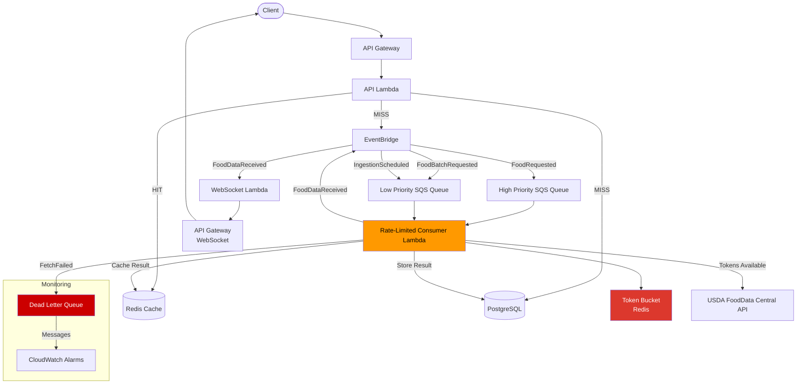
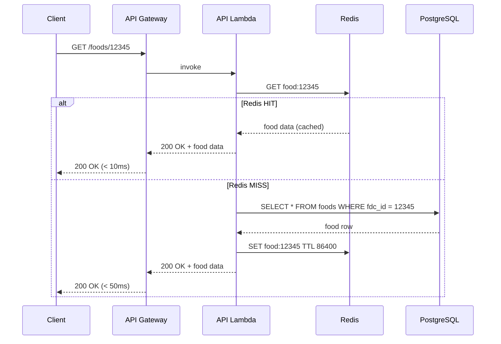
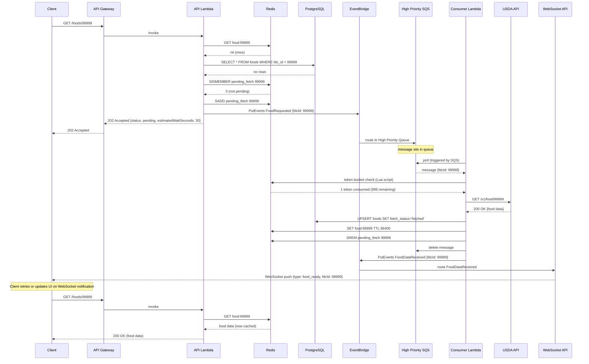

# Architecture 5: Event-Driven / Queue-Based

| Field        | Value                                                         |
| ------------ | ------------------------------------------------------------- |
| Status       | Proposal                                                      |
| Date         | 2026-04-07                                                    |
| Author       | AI-Generated                                                  |
| Architecture | Event-Driven / Queue-Based (SQS + EventBridge + Rate Limiter) |
| Relates To   | Architecture 1 (Full Mirror), Architecture 2 (Smart Cache)    |

---

## Executive Summary

This architecture treats the USDA API rate limit not as a problem to work around, but as a first-class constraint to model explicitly. Rather than blocking user requests on slow or throttled API calls, the system decouples data fetching from data serving: user-facing reads are fast and non-blocking, while USDA data is populated asynchronously in the background at a precisely controlled rate. An SQS queue buffers all USDA fetch requests; a single rate-limited Lambda consumer processes them at exactly 1,000 requests per hour using a Redis-backed token bucket algorithm.

The result is a self-healing system that grows its local data store organically based on actual usage. The first time a user requests an unknown food item, they get a `202 Accepted` with partial data and a "pending" flag. Seconds or minutes later, the data is available. Subsequent requests for the same food are served instantly from Redis or PostgreSQL. Over time, the local database fills up with exactly the foods your users actually care about, not the full 330K-food USDA dataset sitting largely unused.

This is the most operationally complex of the five architectures. It introduces SQS, EventBridge, a custom token bucket rate limiter, and an async response pattern that requires client-side awareness of eventual consistency. Choose it when you need precise USDA API control, can tolerate eventual consistency, and your team is comfortable operating event-driven AWS infrastructure.

---

## Context & Problem Statement

The USDA FoodData Central API imposes a hard ceiling of **1,000 requests per hour**. Every architectural decision in this proposal flows from that constraint.

**The throughput bottleneck.** At 1,000 req/hr, naively fetching individual foods exhausts your quota in under 17 minutes if traffic spikes. The only way to safely operate within the limit without over-engineering synchronous retry loops is to treat the rate limit as a queue-draining problem, not a per-request problem.

**User requests shouldn't block on slow API calls.** A synchronous USDA API call takes 200-800ms. Worse, under rate limiting, requests fail with HTTP 429 and require exponential backoff, potentially adding seconds of latency. Blocking the user thread on this is architecturally unacceptable for a read-heavy recipe app.

**Reads and writes need to be decoupled.** The USDA API is a write-path concern (populating local data). Reads serve users. Coupling them means API instability bleeds into user-facing latency. This architecture separates them completely: reads always serve from local state (Redis or PostgreSQL), writes happen asynchronously through a queue.

**Data fetching should be demand-driven.** Downloading all 330K foods upfront (Architecture 1) costs time and money regardless of whether your users ever ask for those foods. This architecture inverts the model: fetch exactly what users request, when they request it. The local database grows organically, shaped by real usage.

**The system should self-heal.** If a food isn't in local store, it gets queued automatically. If the fetch fails, SQS retries it. If it fails three times, the Dead Letter Queue captures it for investigation. No manual intervention required for transient failures.

---

## Architecture Overview

This is an event-driven architecture where user requests trigger events, events trigger data fetching, and data fetching populates the local store asynchronously. SQS queues buffer USDA API requests, a rate-limited Lambda consumer drains them at a controlled rate, and EventBridge provides the event routing backbone.

**Key difference from other architectures:** there is no synchronous USDA API call in the request path. The API Lambda never calls USDA directly. It only reads from local state and, on a miss, emits an event. This means user-facing latency is always bounded by local infrastructure, never by an external API.

**Key insight:** instead of blocking the user on a cache miss, return partial data immediately and backfill asynchronously. The trade-off is explicit: users see "pending" for new foods, but existing foods are always fast.



**Component summary:**

- **API Gateway + Lambda** — serves reads, emits events on miss
- **EventBridge** — central event bus, routes by event type
- **SQS Queues** — buffer USDA fetch requests by priority
- **Rate-Limited Consumer Lambda** — the core of this architecture; single-threaded token-bucket-controlled USDA caller
- **PostgreSQL (RDS)** — persistent store, incrementally populated
- **Redis (ElastiCache)** — hot cache + token bucket state + pending-fetch deduplication set
- **WebSocket API** (optional) — real-time client notifications when data is ready

---

## System Components

### 1. API Layer (API Gateway + Lambda)

The API Lambda handles all user-facing food lookup requests. Its behavior depends on local data availability:

**On Redis HIT:** return immediately, sub-10ms response.

**On Redis MISS + PostgreSQL HIT:** fetch from PostgreSQL, backfill Redis, return. Still fast (20-50ms).

**On full MISS (neither cache nor DB):**

1. Check the "pending fetch" set in Redis — is this food already queued?
2. If not pending: add to pending set, publish `FoodRequested` event to EventBridge.
3. Return `202 Accepted` immediately:
   ```json
   {
     "status": "pending",
     "fdcId": 12345,
     "description": "Avocado, raw",
     "estimatedWaitSeconds": 30,
     "partialData": { "fdcId": 12345, "description": null }
   }
   ```
4. If already pending: return same `202` without re-queuing (deduplication via Redis set).

The API Lambda **never calls the USDA API directly.** It only reads local state and emits events. This keeps its execution time under 100ms in all paths.

**Endpoints:**

- `GET /foods/{fdcId}` — single food lookup
- `GET /foods/search?query=...` — text search (local only)
- `POST /recipes` — recipe submission with ingredient lookup (triggers batch event)
- `GET /foods/{fdcId}/status` — check fetch status for pending food

### 2. EventBridge — Central Event Bus

EventBridge serves as the decoupling layer between the API and the SQS queues. This indirection has a practical benefit: you can add new consumers (analytics, audit logs, ML pipelines) without touching the API Lambda.

**Event types:**

| Event                | Source             | Description                                    | Target                      |
| -------------------- | ------------------ | ---------------------------------------------- | --------------------------- |
| `FoodRequested`      | API Lambda         | User requested a food not in local store       | High Priority SQS Queue     |
| `FoodBatchRequested` | API Lambda         | Recipe import triggered multiple food lookups  | Low Priority SQS Queue      |
| `IngestionScheduled` | EventBridge (cron) | Periodic full data refresh or stale data check | Low Priority SQS Queue      |
| `FoodDataReceived`   | Consumer Lambda    | USDA fetch succeeded, data stored              | WebSocket Lambda (optional) |
| `FetchFailed`        | Consumer Lambda    | USDA fetch failed after retries                | CloudWatch Logs / SNS       |

**EventBridge rules:**

- Rule 1: `source = "recipe-app.api"` AND `detail-type = "FoodRequested"` → High Priority Queue
- Rule 2: `source = "recipe-app.api"` AND `detail-type = "FoodBatchRequested"` → Low Priority Queue
- Rule 3: `source = "aws.scheduler"` AND `detail-type = "IngestionScheduled"` → Low Priority Queue
- Rule 4: `source = "recipe-app.consumer"` AND `detail-type = "FoodDataReceived"` → WebSocket Lambda

EventBridge custom buses cost $1.00/million events. At typical usage (a few thousand events/day), this rounds to effectively zero.

### 3. SQS Queues

Three queues with distinct roles:

**High Priority Queue** (`recipe-app-food-high-priority.fifo` or standard)

- For: individual food lookups triggered by active user requests
- Visibility timeout: 60 seconds (consumer has 60s to process before message reappears)
- Message retention: 4 days
- Max receive count: 3 (then routes to DLQ)
- Deduplication: content-based using `fdcId` as the deduplication ID (SQS FIFO deduplication, or application-level via Redis pending set)
- Polling: consumer checks this queue first

**Low Priority Queue** (`recipe-app-food-low-priority`)

- For: recipe imports, periodic stale-data refresh, background enrichment
- Visibility timeout: 120 seconds (larger batches take longer)
- Message retention: 14 days
- Max receive count: 3 (then routes to DLQ)
- Polled only when High Priority Queue is empty

**Dead Letter Queue (DLQ)** (`recipe-app-food-dlq`)

- Receives messages that failed 3 processing attempts
- Retention: 14 days
- CloudWatch alarm: fires when `ApproximateNumberOfMessagesVisible > 0`
- Common causes: food doesn't exist in USDA (404), malformed fdcId, persistent USDA outage
- Investigation process: inspect message, check USDA manually, either fix or tombstone the fdcId

**Message format:**

```json
{
  "fdcId": 12345,
  "requestedAt": "2026-04-07T10:00:00Z",
  "requestSource": "user-lookup",
  "priority": "high",
  "batchIds": [12345, 67890, 11111]
}
```

`batchIds` is populated for batch requests, allowing the consumer to use the USDA batch endpoint efficiently.

### 4. Rate-Limited Consumer Lambda

This is the architectural centrepiece. Everything else exists to feed this Lambda and to serve data it produces.

**Trigger:** SQS (high priority queue first, falls through to low priority)
**Reserved concurrency:** 1 (critical — exactly one consumer running at any time)
**Batch size:** 10 messages per invocation
**Timeout:** 5 minutes (enough to process 10 messages with backoff)

**The token bucket rate limiter:**

The token bucket lives in Redis as a hash with two fields: `tokens` and `last_refill`. An atomic Lua script handles both the check-and-consume and the refill in a single Redis operation, preventing race conditions (even though reserved concurrency = 1 makes races unlikely, it's correct regardless).

```
Token Bucket Parameters:
  capacity     = 1000 tokens
  refill_rate  = 16.67 tokens/minute (1000/60)
  stored_in    = Redis key "rate_limiter:usda"
  operation    = atomic Lua script (GET + SET in one round-trip)
```

**Per-message processing logic:**

```
for each message in batch:
  1. Parse fdcId(s) from message
  2. Check token bucket:
     - If tokens < 1: extend message visibility timeout, continue to next
     - If tokens >= 1: consume 1 token (or N tokens for batch of N IDs)
  3. Call USDA API:
     - Single ID: GET /v1/food/{fdcId}
     - Batch IDs: POST /v1/foods with up to 20 fdcIds
  4. On success:
     - Store each food in PostgreSQL (upsert, set fetch_status = 'fetched')
     - Cache each food in Redis (TTL 24h)
     - Remove fdcId(s) from "pending fetch" set in Redis
     - Delete SQS message
     - Emit FoodDataReceived event to EventBridge
  5. On USDA 429 (rate limited despite token bucket):
     - Do NOT delete message (it will reappear after visibility timeout)
     - Reset token bucket to 0 (force wait for refill)
     - Return immediately (don't process remaining messages)
  6. On USDA 404:
     - Store tombstone in PostgreSQL (fetch_status = 'not_found')
     - Delete SQS message (no retry needed — food genuinely doesn't exist)
  7. On USDA 5xx:
     - Do NOT delete message (will retry up to 3 times via SQS)
     - Emit FetchFailed event
```

**Batch endpoint optimization:**

The USDA `POST /v1/foods` endpoint accepts up to 20 `fdcIds` per request, returning all results in one response. The consumer batches message fdcIds together (up to 20) into a single API call, consuming just 1 token from the bucket per 20 foods. This multiplies effective throughput:

```
1,000 API calls/hr × 20 IDs/call = 20,000 foods/hour (theoretical max)
```

In practice, not every message carries 20 IDs, so real throughput is somewhere between 1,000 and 20,000 foods/hour depending on batch fill rate. For individual lookups, you get 1,000 foods/hour. For bulk recipe imports, you approach the 20,000 ceiling.

**Priority queue polling:**

The consumer checks the High Priority Queue first. If messages are present, it processes those. Only when the High Priority Queue is empty does it poll the Low Priority Queue. This ensures user-facing lookups are always processed ahead of background enrichment jobs, even under load.

### 5. PostgreSQL (RDS) — Persistent Data Store

Same schema foundation as Architecture 1, with one important addition: `fetch_status` tracking.

**foods table additions:**

```sql
fetch_status  VARCHAR(20)  -- 'pending' | 'fetched' | 'failed' | 'not_found' | 'stale'
fetched_at    TIMESTAMP
last_requested_at TIMESTAMP
request_count INT DEFAULT 0
```

The `fetch_status` column lets the API Lambda immediately return meaningful state to clients ("this food is pending enrichment") without having to infer it. `request_count` provides usage data for prioritization and analytics.

**Initial sizing:** `db.t4g.small` (2 vCPU, 2GB RAM, ~$25/mo). Unlike Architecture 1, the database starts empty and grows incrementally. You won't need to size for 330K foods on day one — the DB grows to fit actual demand.

**Indexing strategy:**

- Primary: `fdcId` (B-tree)
- `fetch_status` + `fetched_at` (for stale data detection queries)
- `last_requested_at` (for LRU eviction analysis)
- Full-text on `description` (for local search)

### 6. ElastiCache Redis — Cache + Rate Limiter + Deduplication

Redis takes on three distinct roles in this architecture:

**Role 1: Hot cache** (same as all other architectures)

- Food data cached at TTL 24h
- Search results cached at TTL 1h
- Eviction policy: `allkeys-lfu` (evict least frequently used)
- Cache key: `food:{fdcId}`

**Role 2: Token bucket state**

- Key: `rate_limiter:usda`
- Type: Hash with fields `tokens` (float) and `last_refill` (unix timestamp ms)
- Updated atomically via Lua script on every consumer invocation
- TTL: none (perpetual key, reset only on Redis restart)
- On Redis restart: token bucket resets to full capacity (1000 tokens) — conservative and safe

**Role 3: Pending fetch deduplication set**

- Key: `pending_fetch`
- Type: Redis Set containing fdcIds currently in-queue
- Purpose: prevents multiple SQS messages for the same food when traffic spikes
- TTL: 4 hours (auto-expire in case consumer fails to clean up)
- On cache miss: API Lambda checks `SISMEMBER pending_fetch {fdcId}` before publishing to EventBridge

**Sizing:** `cache.t4g.small` (1 vCPU, 1.37GB RAM, ~$22/mo). The additional Redis keys for rate limiting and dedup tracking are negligible in size.

### 7. Notification System (Optional)

When a food fetch completes asynchronously, users need a way to learn that. Two options:

**Option A: Client polling**

- Client retries `GET /foods/{fdcId}` with exponential backoff: 2s, 4s, 8s, 16s
- Simple to implement, works with any client
- Drawback: wasted requests, ~15s average wait before polling catches the result

**Option B: WebSocket via API Gateway WebSocket API**

- Consumer emits `FoodDataReceived` event to EventBridge
- EventBridge triggers a WebSocket Lambda
- Lambda calls `POST /connections/{connectionId}/@connections` to push notification to client
- Connection IDs stored in DynamoDB or Redis during session
- Client receives: `{"type": "food_ready", "fdcId": 12345}`
- UI transitions from "Loading nutrition data..." to rendering the food card
- Cost addition: ~$1-3/mo at typical usage, $0.25/million connection minutes

**Option C: AppSync subscriptions**

- GraphQL-native real-time updates
- More setup, but cleaner API contract for GraphQL shops
- ~$4/mo base + usage

For most teams, **Option A (polling)** is the right start. Add WebSocket only if UX testing shows the polling UX is unacceptable.

### 8. Monitoring & Observability

**Queue depth metrics (CloudWatch):**

- `ApproximateNumberOfMessagesVisible` on High Priority Queue → alarm if > 500 (user requests backing up)
- `ApproximateNumberOfMessagesVisible` on Low Priority Queue → informational, alert if > 10,000
- `ApproximateNumberOfMessagesVisible` on DLQ → alarm if > 0 (any failure needs investigation)
- `ApproximateAgeOfOldestMessage` → alarm if High Priority messages are > 5 minutes old

**Rate limiter metrics (custom CloudWatch):**

- Token consumption rate (tokens consumed per minute)
- Token bucket level at each consumer invocation
- USDA API success rate (5xx responses as percentage)
- USDA API 429 rate (rate limit hits — should be near zero if bucket is calibrated correctly)

**End-to-end latency:**

- `time_from_request_to_available` = `fetched_at` - `last_requested_at` from PostgreSQL
- Track p50, p95, p99 — target p95 < 60 seconds
- CloudWatch dashboard showing latency distribution over time

**Business metrics:**

- Cache hit rate (Redis / total requests) — want > 90% as DB fills up
- Fetch completion rate (fetched / requested over 24h window)
- DLQ accumulation rate (foods that consistently fail to fetch)
- Unique foods in local DB over time (growth curve)

**Consumer health:**

- Lambda duration per invocation
- Lambda error rate
- SQS messages deleted (successful processing rate)
- SQS messages returned to queue (token exhaustion events)

---

## Data Flow — Three Scenarios

### Scenario 1: Food Already in Local Store (Happy Path)

The fast path. No events, no queues, no async. This is what most requests look like once the local store has warmed up.



**Latency:** 5-50ms end-to-end. No USDA involvement. No queues touched.

### Scenario 2: Food NOT in Local Store (Async Backfill)

The interesting path. User gets an immediate response, data arrives in the background.



**Timeline:** 202 returned in < 100ms. Data available in 10-60 seconds depending on queue depth and token availability.

### Scenario 3: Recipe Import (Bulk Async)

A user submits a recipe with many ingredients. Some are local, some aren't. The system returns what it has immediately and fills in the rest.

```mermaid
sequenceDiagram
    participant C as Client
    participant AG as API Gateway
    participant AL as API Lambda
    participant R as Redis
    participant PG as PostgreSQL
    participant EB as EventBridge
    participant SQS as Low Priority SQS
    participant CL as Consumer Lambda
    participant USDA as USDA API

    C->>AG: POST /recipes {ingredients: [id1, id2, ..., id20]}
    AG->>AL: invoke

    AL->>R: MGET food:id1 food:id2 ... food:id20
    R-->>AL: [hit, hit, nil, nil, nil, ...]
    Note over AL: 8 local, 12 missing

    AL->>PG: SELECT WHERE fdc_id IN (missing ids)
    PG-->>AL: 2 more found in DB

    Note over AL: 10 total local, 10 missing
    Note over AL: Check pending set for each missing id

    AL->>R: SMEMBERS pending_fetch (check missing IDs)
    R-->>AL: 3 already pending

    AL->>R: SADD pending_fetch [7 new IDs]
    AL->>EB: PutEvents FoodBatchRequested {fdcIds: [7 new IDs]}

    EB->>SQS: route to Low Priority Queue (single message, 7 IDs)
    AL-->>C: 200 OK {
        localFoods: [10 complete food objects],
        pendingFoods: [10 fdcIds with status: pending],
        recipe: {partiallyResolved: true}
    }

    Note over C: UI renders partial recipe, shows spinners for pending

    CL->>SQS: poll (triggered by SQS, High Priority empty)
    SQS-->>CL: batch message {fdcIds: [7 IDs]}

    CL->>R: token bucket check — consume 1 token (batch endpoint)
    R-->>CL: 1 token consumed

    CL->>USDA: POST /v1/foods {fdcIds: [7 IDs]}
    Note over USDA: Single API call returns all 7 foods
    USDA-->>CL: 200 OK [{food1}, {food2}, ..., {food7}]

    CL->>PG: UPSERT 7 foods (bulk insert)
    CL->>R: MSET food:id1 ... food:id7 (bulk cache)
    CL->>R: SREM pending_fetch [7 IDs]
    CL->>SQS: delete message
    CL->>EB: PutEvents FoodDataReceived x7

    Note over C: WebSocket notifications arrive, UI updates in real-time
```

**Efficiency highlight:** 7 foods fetched with 1 USDA API call (1 token consumed). This is the batch endpoint optimization at work. A recipe import of 20 ingredients costs exactly 1 USDA API token, regardless of how many ingredients were missing.

---

## Scalability

The queue-based architecture scales gracefully, with one immovable ceiling.

**What scales linearly:**

- SQS queue depth: up to 120,000 messages in-flight, 14-day retention
- EventBridge: handles millions of events per second
- API Lambda: scales to thousands of concurrent invocations
- PostgreSQL: scales vertically (or via read replicas as data grows)

**What doesn't scale: the USDA rate limit.**

20,000 foods per hour is the hard ceiling, achieved only when every API call is a full 20-item batch. This is the architectural reality regardless of how much AWS infrastructure you throw at it. The token bucket enforces this ceiling; it can't lift it.

**Horizontal scaling with shared token bucket:**

If you run multiple consumer Lambda instances (increase reserved concurrency > 1), they must share the same Redis token bucket. The atomic Lua script handles this correctly — multiple consumers can compete for tokens without exceeding the rate limit. However, reserved concurrency = 1 is usually right because:

1. The USDA rate limit is the bottleneck, not Lambda throughput
2. A single consumer processing 10-message batches can drain 600 messages/minute easily, far exceeding queue fill rate for typical apps

**Long-term trajectory:**

The system gets cheaper and faster over time. As the local DB fills with frequently-requested foods, cache hit rates climb and queue depth drops. After weeks of operation, most user requests never touch the queue at all. The architecture's operational cost effectively decreases as usage increases, inverting the usual scaling curve.

**Projections:**

- 1,000 unique foods in local DB → 70-80% cache hit rate (most popular foods)
- 10,000 unique foods → 90%+ cache hit rate
- 50,000 unique foods → 95%+ cache hit rate (approaching Architecture 1 coverage for a focused food domain)
- Full USDA dataset (330K foods) at 20K/hr: ~16.5 hours of continuous backfill

---

## Security Considerations

**SQS encryption:**

- Enable Server-Side Encryption (SSE-SQS) on all three queues: free, no performance impact
- For compliance requirements: SSE-KMS with a managed key (~$1/mo per key)
- Encrypt message attributes (fdcId values) alongside message body

**EventBridge resource policies:**

- Restrict event publishing to specific IAM principals (API Lambda role only)
- Restrict event consumption to specific targets (SQS queues, Consumer Lambda role)
- Custom bus prevents cross-account event injection without explicit policy grants

**Lambda IAM roles (least privilege):**

- API Lambda role: `sqs:SendMessage` on specific queues, `events:PutEvents` on specific bus, `elasticache:*` (via VPC), `rds-data:*` (if using Data API)
- Consumer Lambda role: `sqs:ReceiveMessage`, `sqs:DeleteMessage`, `sqs:ChangeMessageVisibility` on specific queues, `events:PutEvents`, no direct internet access except via NAT Gateway to USDA API

**RDS security:**

- Same as Architecture 1: VPC private subnet, security group allows inbound 5432 from Lambda security group only
- Encryption at rest (AES-256 via AWS KMS)
- Credentials via AWS Secrets Manager (rotated automatically)

**Rate limiter as API key protection:**

- The token bucket prevents your USDA API key from being burned through by a traffic spike or runaway Lambda
- If the consumer Lambda has a bug causing it to ignore token bucket state, the 429 response from USDA triggers the "reset bucket to 0" failsafe
- This protects against USDA banning your API key for abuse

**Input validation before queuing:**

- Validate fdcId format (numeric, within valid range) in API Lambda before publishing to EventBridge
- Reject obviously invalid IDs immediately with `400 Bad Request`
- Never allow raw user input to flow unvalidated into SQS messages

**DLQ access control:**

- DLQ contains failed message data — restrict read access to operations role only
- Never expose DLQ contents directly to end users

---

## Cost Analysis

All prices are us-east-1, on-demand pricing, as of 2026.

### SQS

| Usage Tier      | Monthly Requests | Cost  |
| --------------- | ---------------- | ----- |
| First 1M/mo     | 1M               | Free  |
| Above 1M        | $0.40/million    | —     |
| Low traffic app | ~500K req/mo     | $0.00 |
| Medium traffic  | ~2M req/mo       | $0.40 |
| High traffic    | ~10M req/mo      | $3.60 |

SQS is effectively free at all but extreme scale.

### EventBridge

| Usage          | Events/mo | Cost          |
| -------------- | --------- | ------------- |
| Custom bus     | per event | $1.00/million |
| Low traffic    | 100K      | $0.10         |
| Medium traffic | 1M        | $1.00         |
| High traffic   | 5M        | $5.00         |

### Lambda

| Function        | Invocations/mo | Avg Duration | Memory | Cost (est.) |
| --------------- | -------------- | ------------ | ------ | ----------- |
| API Lambda      | 500K           | 100ms        | 512MB  | $1-3/mo     |
| Consumer Lambda | 50K            | 30s          | 512MB  | $2-8/mo     |
| WS Lambda       | 100K           | 50ms         | 256MB  | $0.50-1/mo  |

Lambda free tier (1M invocations, 400K GB-seconds/mo) covers most of this at low traffic.

### Infrastructure (fixed monthly)

| Component             | Config                  | Monthly Cost |
| --------------------- | ----------------------- | ------------ |
| RDS PostgreSQL        | db.t4g.small            | ~$25.00      |
| RDS Storage           | 20GB gp2                | ~$2.30       |
| RDS Backups           | 7 days automated        | ~$1.00       |
| ElastiCache Redis     | cache.t4g.small         | ~$22.00      |
| NAT Gateway           | 1 AZ, ~10GB/mo          | ~$32.00      |
| API Gateway REST      | ~1M req/mo              | ~$3.50       |
| API Gateway WebSocket | optional                | ~$1-3/mo     |
| CloudWatch            | logs + metrics + alarms | ~$3-5/mo     |

### Total Monthly Cost by Tier

| Tier     | Description                                    | Monthly Cost |
| -------- | ---------------------------------------------- | ------------ |
| **Low**  | < 10K daily users, mostly cache hits           | **$65-75**   |
| **Med**  | 10-50K daily users, mixed new/returning        | **$75-95**   |
| **High** | 50K+ daily users, significant new food traffic | **$95-125**  |

The cost floor is dominated by RDS ($25) + ElastiCache ($22) + NAT Gateway ($32) = $79/mo in infrastructure alone, regardless of traffic. SQS, EventBridge, and Lambda add only marginal cost on top. This architecture costs roughly the same as Architecture 1 at the base level, with better handling of the USDA rate limit constraint.

**Cost comparison note:** This is $15-30/mo more expensive than Architecture 2 (smart caching proxy) due to the additional SQS/EventBridge layer and the need for persistent PostgreSQL rather than pure cache. The premium buys you precise rate control, async UX, and self-healing data population.

---

## Failure Modes & Recovery

### SQS Message Processing Failure

- **Cause:** Consumer Lambda crashes, times out, or throws unhandled exception
- **Recovery:** SQS automatically makes message visible again after visibility timeout (60-120s)
- **Retry limit:** 3 attempts, then message routes to DLQ
- **Impact:** Food fetch delayed by 1-3 visibility timeout cycles (1-6 minutes)
- **No data loss:** message persists in SQS up to 14 days

### USDA API 429 (Rate Limited)

- **Cause:** Token bucket desync, or USDA rate limit is stricter than documented
- **Detection:** USDA returns 429 despite consumer checking token bucket
- **Recovery:** Consumer resets token bucket to 0, returns message to queue, waits for refill
- **Impact:** No food processing for ~1 minute (one refill cycle)
- **Protection:** Token bucket ensures this should be extremely rare (< 1% of API calls)

### USDA API 5xx

- **Cause:** USDA service degradation or outage
- **Recovery:** SQS handles retry (3 attempts with visibility timeout gaps)
- **Exponential backoff:** Consumer increases visibility timeout on each retry (60s → 120s → 240s)
- **Impact:** Foods queue up during outage; processed when USDA recovers
- **Persistence:** Low Priority Queue retains messages for 14 days — survives multi-day USDA outages

### Token Bucket Desync

- **Cause:** Redis TTL expiry, Redis restart, clock drift between multiple consumers
- **On Redis restart:** Bucket resets to full capacity (1000 tokens). Consumer might make a burst of API calls before the bucket drains to steady-state. This is safe — it just means slightly more than 1,000 calls in the first hour after restart.
- **On multi-consumer desync:** Atomic Lua script prevents true race conditions. Each `check-and-consume` is serialized by Redis. Worst case is slightly suboptimal token counting, not rate limit violation.
- **Self-correction:** Within one refill interval (1 minute), the bucket converges to correct state

### PostgreSQL Failure

- **Cause:** RDS instance unavailable (planned maintenance, AZ failure)
- **Impact:** Consumer cannot store fetched data, API cannot serve DB-backed responses
- **Recovery:** Consumer Lambda fails, messages remain in SQS (no data loss from queue perspective)
- **Limitation:** Successfully-fetched USDA data that hasn't been written to PG is lost (Lambda memory is ephemeral)
- **Mitigation:** Multi-AZ RDS deployment ($50/mo more) for production; otherwise accept occasional re-fetch

### Redis Failure

- **Cause:** ElastiCache node unavailable
- **Impact (Rate Limiter):** Consumer cannot check token bucket. Should pause processing (fail-closed behavior) to avoid USDA rate limit violation. Implement: if Redis unavailable, delay 60 seconds and retry.
- **Impact (Cache):** All reads fall back to PostgreSQL. Higher DB load but functional.
- **Impact (Pending Set):** Deduplication breaks temporarily. Multiple SQS messages may be created for the same food. SQS FIFO deduplication or PostgreSQL fetch_status check prevents duplicate USDA calls.
- **Recovery:** Redis cluster typically recovers within 1-2 minutes for single-node failure

### DLQ Accumulation

- **Cause:** Foods that consistently fail to fetch (don't exist in USDA, malformed IDs)
- **Alert:** CloudWatch alarm fires immediately on first DLQ message
- **Investigation:** Check message body for fdcId, query USDA API manually
- **Resolution options:**
  1. Food doesn't exist: tombstone in PostgreSQL, remove from DLQ manually
  2. Temporary USDA issue: requeue from DLQ after USDA recovers
  3. Malformed ID: fix API validation to reject this pattern, purge from DLQ

### Poison Message (Invalid fdcId)

- **Path:** Invalid ID → Consumer calls USDA → 404 → Consumer writes `fetch_status = 'not_found'` → Deletes SQS message (no retry for 404)
- **Not a true "poison" scenario** because the consumer handles 404 explicitly
- **True poison message:** Malformed JSON, unexpected schema, or Consumer bug causing crash
  - SQS retries 3 times, then routes to DLQ
  - DLQ alarm fires, human investigates

---

## Risks

| Risk                                          | Impact                                                                    | Probability                            | Mitigation                                                                                                      |
| --------------------------------------------- | ------------------------------------------------------------------------- | -------------------------------------- | --------------------------------------------------------------------------------------------------------------- |
| Token bucket desync across multiple consumers | High — could exhaust USDA quota                                           | Low (reserved concurrency = 1)         | Atomic Lua script; single consumer by default; integration test covers desync scenario                          |
| DLQ accumulation from unfetchable foods       | Medium — foods permanently unavailable                                    | Medium (bad data in client apps)       | 404 handling creates DB tombstones; CloudWatch alarm catches early; periodic DLQ review process                 |
| Poor UX with async responses                  | High — users frustrated by "pending" data                                 | High (inherent to design)              | Set clear expectations in UI; fast polling fallback; WebSocket for instant notification; design for sub-30s p95 |
| SQS standard queue doesn't guarantee ordering | Low — a newer fetch might overwrite a fresher one                         | Low (same food, same data)             | Use `fetched_at` timestamp on upsert; newer timestamp wins; no functional impact                                |
| Thundering herd on popular new food           | Medium — hundreds of duplicate SQS messages                               | Medium (viral content scenario)        | Redis pending set deduplication; SQS FIFO dedup as backup; only 1 USDA call per food regardless                 |
| Cold start latency on Consumer Lambda         | Low — first invocation takes 500ms-2s                                     | Low (always-on via queue polling)      | Provisioned concurrency for Consumer Lambda ($3-5/mo); Lambda stays warm when queue has messages                |
| Event-driven debugging complexity             | High — tracing a request through API → EventBridge → SQS → Lambda is hard | High (this IS the operational reality) | AWS X-Ray across all components; structured logging with correlation IDs; CloudWatch Insights queries pre-built |
| Redis unavailability breaks rate limiter      | High — uncontrolled USDA API usage risks key ban                          | Low (ElastiCache 99.9% SLA)            | Fail-closed: Consumer pauses on Redis unavailable; Multi-AZ Redis for production                                |
| USDA API key ban from accidental abuse        | Critical — entire system loses data access                                | Very Low (token bucket prevents this)  | Token bucket hard ceiling; 429 response resets bucket; alert on any 429 received                                |

---

## Trade-offs

### Pros

**Never blocks users on API calls.** The request path has zero USDA API calls. User-facing latency is always bounded by Redis (< 10ms) or PostgreSQL (< 50ms), never by an external API that might be slow, rate-limited, or down.

**Precise rate limit control.** The token bucket algorithm gives you exact control over USDA API consumption. You'll never accidentally burn your quota during a traffic spike. You can also deliberately throttle below 1,000/hr to leave headroom.

**Self-healing data population.** The system discovers and fetches missing data automatically based on demand. No manual data pipeline scripts, no scheduled full dumps, no maintenance windows. New foods appear in USDA's dataset and get fetched the first time a user requests them.

**Handles spiky traffic gracefully.** SQS is the buffer between traffic bursts and the rate-limited consumer. A sudden 10,000-request spike for a new food trend queues up cleanly without exceeding USDA limits. The queue simply takes longer to drain.

**Local DB grows based on actual usage.** You store only what users actually want. After months of operation, your local DB is a perfect reflection of your users' food interests, not a generic 330K-food dataset. Storage costs and query times stay low for longer.

**Excellent observability.** Queue depth, token consumption, fetch latency, and DLQ status are all quantified metrics. You can see exactly how backed up the fetch pipeline is at any moment.

### Cons

**Users see partial/pending data on first request for new foods.** This is a fundamental consequence of async data population. There's no way around it. Some users find "loading..." acceptable; others don't. Know your audience before choosing this architecture.

**Most complex architecture of the five.** Five AWS services work together (API Gateway, SQS, EventBridge, Lambda, RDS, ElastiCache — six if you count WebSocket). Each adds operational surface area. Deployments, rollbacks, and debugging are all more involved than a synchronous architecture.

**Eventual consistency.** Data is correct, but not immediately. A user who requested a food 30 seconds ago might refresh and get the data; a user who requested 5 seconds ago might not. Applications built on this architecture must tolerate and communicate this to users.

**Debugging event-driven flows is harder.** "Why didn't this food get fetched?" requires tracing through CloudWatch Logs for API Lambda, EventBridge rule evaluation, SQS message visibility, Consumer Lambda invocation, and USDA API call. Without X-Ray and structured correlation IDs, this is painful.

**Same base cost as hybrid (~$65-75/mo) with more operational complexity.** The infrastructure cost floor is similar to Architecture 1. You're paying the complexity tax without necessarily a cost benefit. The trade-off is precision and resilience, not cost.

---

## When to Choose This Architecture

- **Your app can tolerate eventual consistency for nutrition data.** Users accept seeing "loading..." for 10-30 seconds the first time they look up an unfamiliar food.
- **You expect bursty traffic patterns.** Recipe imports, viral food trends, batch user uploads — scenarios where many new foods arrive simultaneously benefit from the queue buffer.
- **You want precise control over USDA API usage.** The token bucket gives you exact, auditable rate limit compliance. You can confidently operate at 99% of the rate limit without fear of 429s.
- **Your team is experienced with event-driven AWS architecture.** SQS, EventBridge, and async debugging are not new concepts to your team.
- **You want the system to self-populate based on actual user behavior.** You'd rather not manage a scheduled data pipeline and prefer demand-driven data collection.
- **Real-time nutrition data isn't critical.** Your app doesn't require instant results for every possible food — a short wait for first-time lookups is acceptable in your UX model.
- **You're planning to extend the event system.** The EventBridge backbone can be reused for recipe analysis jobs, meal planning triggers, nutrition scoring pipelines, and more. The investment in event-driven infrastructure pays dividends across the product.

---

## When NOT to Choose This Architecture

- **Users expect instant results for all foods.** If your UX requires that every food lookup returns complete data in under 200ms, the async model breaks that contract. Use Architecture 1 (full mirror) or Architecture 2 (synchronous cache proxy).
- **Your team isn't comfortable with SQS/EventBridge debugging.** The debugging complexity of this architecture is real. If your team finds it hard to trace an event through multiple AWS services, you'll spend more time debugging than building. Architecture 2 or 3 are simpler.
- **Operational simplicity is a priority.** If you want to minimize the number of moving parts, this is the wrong choice. Architecture 2 has 3 components; this one has 7+.
- **You'd rather just download the whole dataset.** Architecture 1 is simpler, cheaper over time, and eliminates all the async complexity. If a one-time 16-hour backfill is acceptable, start there.
- **You have < 5,000 foods to support.** For a small, well-defined food catalog, this architecture is massive overkill. A simple synchronous proxy (Architecture 2) or static file approach covers the need at 10% of the complexity.
- **You need strong consistency for regulatory or medical use.** If nutrition data must be verifiably up-to-date (clinical nutrition apps, FDA compliance), eventual consistency is architecturally inappropriate. Use Architecture 1 with scheduled full refreshes.

---

## Lean Launch Variant

The full architecture described above includes ElastiCache Redis ($22/mo) and RDS `db.t4g.small` ($25/mo). For launch, both can be reduced or eliminated to cut the cost floor from ~$79/mo to ~$48/mo while preserving all functional capabilities.

### What Changes

| Component             | Full Architecture                                                | Lean Launch                      | Monthly Savings |
| --------------------- | ---------------------------------------------------------------- | -------------------------------- | --------------- |
| **ElastiCache Redis** | `cache.t4g.small` — hot cache, token bucket, pending-fetch dedup | **Removed entirely**             | **-$22/mo**     |
| **RDS PostgreSQL**    | `db.t4g.small` (2 vCPU, 2GB RAM)                                 | `db.t4g.micro` (2 vCPU, 1GB RAM) | **-$13/mo**     |
| **NAT Gateway**       | 1 AZ                                                             | 1 AZ (unchanged)                 | $0              |

**Lean launch cost floor**: ~$12 (RDS micro) + $32 (NAT GW) + ~$4 (Lambda/SQS/EventBridge/CloudWatch) = **~$48/mo**

### Redis Role Migration to PostgreSQL

Each of Redis's three roles has a clean PostgreSQL replacement:

**Role 1: Hot Cache → Removed (PostgreSQL serves reads directly)**

Without Redis, all food lookups hit PostgreSQL. Latency increases from sub-10ms to 20–50ms. For a recipe app at launch traffic, this is imperceptible to users. The async nature of the architecture (users already see `202 Accepted` for uncached foods) means the cache layer is a performance optimization, not a correctness requirement.

Add Redis back when: cache hit analysis shows >80% of requests serve the same ~5K foods and you need sub-10ms p95 latency.

**Role 2: Token Bucket → PostgreSQL Row**

Create a single-row table:

```sql
CREATE TABLE rate_limiter (
    id            INTEGER PRIMARY KEY DEFAULT 1,
    tokens        DOUBLE PRECISION NOT NULL DEFAULT 1000.0,
    last_refill   TIMESTAMPTZ NOT NULL DEFAULT NOW(),
    CONSTRAINT single_row CHECK (id = 1)
);

INSERT INTO rate_limiter (id) VALUES (1);
```

The Consumer Lambda performs an atomic check-and-consume:

```sql
-- Atomic token bucket operation (single transaction)
UPDATE rate_limiter
SET tokens = LEAST(1000.0,
              tokens + (EXTRACT(EPOCH FROM NOW() - last_refill) * 16.6667)
            ) - $1,  -- $1 = tokens to consume (1 for single, N for batch)
    last_refill = NOW()
WHERE id = 1
  AND LEAST(1000.0,
        tokens + (EXTRACT(EPOCH FROM NOW() - last_refill) * 16.6667)
      ) >= $1
RETURNING tokens;
```

If zero rows returned → insufficient tokens, back off. If one row returned → tokens consumed, proceed with USDA API call.

This works because the Consumer Lambda already runs at `reserved_concurrency = 1` — there is no contention on this row. The ~5ms PostgreSQL round-trip vs ~1ms Redis round-trip is irrelevant when the consumer spends 200–800ms per USDA API call.

**Role 3: Pending Fetch Deduplication → PostgreSQL `fetch_status` Column**

The `foods` table already has `fetch_status VARCHAR(20)`. Replace the Redis Set with a database check:

```sql
-- API Lambda: check if food is already pending or fetched
SELECT fetch_status FROM foods WHERE fdc_id = $1;
```

Three outcomes:

- **Row exists, `fetch_status = 'fetched'`**: return food data (normal read path)
- **Row exists, `fetch_status = 'pending'`**: return `202 Accepted` without re-queuing (dedup)
- **Row does not exist**: insert pending row, publish to EventBridge, return `202 Accepted`

```sql
-- Atomic insert-if-not-exists (prevents race condition between concurrent API requests)
INSERT INTO foods (fdc_id, fetch_status, last_requested_at, request_count)
VALUES ($1, 'pending', NOW(), 1)
ON CONFLICT (fdc_id) DO UPDATE
SET last_requested_at = NOW(),
    request_count = foods.request_count + 1
RETURNING fetch_status;
```

If the returned `fetch_status` is `'pending'` and the row was newly inserted (check via `xmax = 0` or application logic), publish to EventBridge. If the row already existed, skip publishing — it's already queued or fetched.

This is arguably **cleaner** than the Redis Set approach: the dedup state is durable (survives Redis restarts), queryable (you can `SELECT COUNT(*) FROM foods WHERE fetch_status = 'pending'`), and doesn't require TTL-based cleanup.

### Lean Launch Cost Summary

| Tier                    | Full Architecture | Lean Launch    | Savings |
| ----------------------- | ----------------- | -------------- | ------- |
| **Low** (<10K DAU)      | $65–75/mo         | **$45–55/mo**  | ~$20/mo |
| **Medium** (10–50K DAU) | $75–95/mo         | **$55–75/mo**  | ~$20/mo |
| **High** (50K+ DAU)     | $95–125/mo        | **$75–105/mo** | ~$20/mo |

### When to Add Redis Back

| Signal                                          | Threshold                       | Action                                                                               |
| ----------------------------------------------- | ------------------------------- | ------------------------------------------------------------------------------------ |
| p95 read latency exceeds 100ms                  | Sustained over 1 week           | Add ElastiCache for hot cache (Role 1)                                               |
| Consumer concurrency needs to increase beyond 1 | Queue depth consistently >1,000 | Add Redis for token bucket (Role 2) — PostgreSQL row lock under contention is slower |
| Food lookup volume exceeds 50K/day              | Sustained                       | Add Redis — PostgreSQL connection pool will be the bottleneck before CPU             |

Adding Redis is a non-breaking change: add the ElastiCache instance, update Lambda environment variables, deploy new Lambda code that checks Redis before PostgreSQL. Zero schema migration, zero downtime.

### Implementation Roadmap Adjustments (Lean Launch)

Phase 1 changes:

- Skip ElastiCache provisioning
- Use `db.t4g.micro` instead of `db.t4g.small`
- Add `rate_limiter` table to schema migration

Phase 3 changes:

- Replace Redis Lua token bucket with PostgreSQL `UPDATE ... RETURNING` query
- Simpler Consumer Lambda (no Redis client dependency)

Phase 4 changes:

- Replace Redis Set dedup check with PostgreSQL `INSERT ... ON CONFLICT` pattern
- API Lambda has one fewer dependency (no Redis client)

**Net effect on timeline**: saves ~1 day (no ElastiCache setup, no Lua script implementation). Total estimate drops from 14–16 days to **13–15 days**.

---

## Database Technology Alternatives

### Why RDS PostgreSQL (and not Aurora DSQL)

Aurora DSQL (GA since late 2024) is AWS's distributed SQL offering with PostgreSQL wire compatibility. Despite the PostgreSQL compatibility branding, **DSQL is not viable for this workload** due to three hard blockers:

**Blocker 1: No extension support.** DSQL does not support `CREATE EXTENSION`. The `pg_trgm` extension — used for fuzzy food name search (`SELECT * FROM foods WHERE description % 'avacado'`) — cannot be installed. There is no workaround within DSQL; you would need to move search to an external service (OpenSearch, Typesense), adding $691+/mo and architectural complexity.

**Blocker 2: No GIN indexes.** Even replacing `pg_trgm` with native PostgreSQL full-text search (`tsvector`/`tsquery`), GIN indexes are required for efficient search over 330K food items. DSQL supports only B-tree indexes via `CREATE INDEX ASYNC`. Without GIN, full-text search requires sequential scans — unusable at this dataset size.

**Blocker 3: 3,000-row transaction limit.** DSQL enforces a hard cap of 3,000 rows mutated per transaction. Bulk-loading 15M nutrient rows (even incrementally via the queue consumer) requires chunking every write into sub-3,000-row batches with explicit retry logic for OCC (optimistic concurrency control) conflicts. This adds significant application-layer complexity for zero benefit.

DSQL is purpose-built for **globally distributed, high-concurrency OLTP** (multi-region shopping carts, leaderboards, financial ledgers). A single-region food database with extension-heavy search is the wrong workload.

### Viable Alternatives to RDS PostgreSQL

| Option                              | Monthly Cost | pg_trgm | GIN Index | Bulk Load (`COPY`) | Best For                            |
| ----------------------------------- | ------------ | ------- | --------- | ------------------ | ----------------------------------- |
| **RDS `db.t4g.micro`**              | ~$12/mo      | ✅      | ✅        | ✅                 | Lean launch (this variant)          |
| **RDS `db.t4g.small`**              | ~$25/mo      | ✅      | ✅        | ✅                 | Full architecture, moderate traffic |
| **Aurora PostgreSQL Serverless v2** | ~$44–100/mo  | ✅      | ✅        | ✅                 | Bursty traffic, scale-to-near-zero  |
| **Aurora DSQL**                     | Variable     | ❌      | ❌        | ❌                 | ❌ Not viable                       |

Aurora Serverless v2 is the only interesting alternative — it has full extension support and scales down to 0.5 ACU. However, its minimum cost (~$44/mo) is higher than RDS `db.t4g.micro` ($12/mo) and `db.t4g.small` ($25/mo), making it cost-effective only if your traffic is genuinely bursty with long idle periods where ACUs drop below 0.5. For steady low-to-moderate traffic, plain RDS wins on cost.

---

## Migration Path

**Combining with Architecture 1 (recommended hybrid):**
Start with Architecture 1's full bulk ingestion to populate the database with the base 330K-food dataset. Then layer this architecture's queue-based system on top to handle delta updates, newly added USDA foods, and corrections. The queue system handles only changes rather than the full dataset, dramatically reducing ongoing API consumption. This hybrid gives you Architecture 1's completeness with Architecture 5's precision for ongoing updates.

**Simplifying to Architecture 2 or 3:**
If the async complexity proves too much to operate, the queue layer can be removed without affecting the data model. Replace the async Consumer Lambda with a synchronous USDA API call directly in the API Lambda. The PostgreSQL schema (including `fetch_status`) and Redis caching layer remain identical. Migration is a single Lambda change, not a data migration.

**Extending the event system:**
The EventBridge bus is already the backbone for food data events. Extending it requires only adding new rules and targets:

- **Recipe analysis pipeline:** `RecipeCreated` event → Lambda computes nutritional totals → stores in `recipe_nutrition` table
- **Meal planning suggestions:** `MealPlanRequested` event → Lambda queries PostgreSQL for matching foods → returns ranked suggestions
- **Data freshness refresh:** Scheduled `IngestionScheduled` event already exists — extend it to trigger a "stale data check" that re-queues foods with `fetched_at > 30 days ago`
- **Audit logging:** Add EventBridge rule that routes all events to CloudWatch Logs for compliance audit trail

**Migrating from this architecture to something simpler:**
If you later decide to download the full USDA dataset (Architecture 1), you already have PostgreSQL with the right schema. Run the bulk ingestion job once, remove the SQS/EventBridge layer, and update the API Lambda to remove the async response logic. The database migration is zero work; only application code changes.

---

## Implementation Roadmap

This is a 14-16 day implementation assuming one backend engineer familiar with AWS serverless. See **Lean Launch Variant** above for a 13–15 day alternative that removes ElastiCache and downsizes RDS.

**Phase 1: Data Layer Foundation (2 days)**

- Provision RDS PostgreSQL (`db.t4g.small`, VPC private subnet) — or `db.t4g.micro` for lean launch
- Apply schema: `foods` table with `fetch_status`, `fetched_at`, `last_requested_at`, `request_count`
- Apply `rate_limiter` table (lean launch only — replaces Redis token bucket)
- Provision ElastiCache Redis (`cache.t4g.small`, `allkeys-lfu`) — skip for lean launch
- Create SQS queues: High Priority, Low Priority, DLQ with correct visibility timeouts and retention
- Configure DLQ redrive policies (max receive count = 3)
- Deliverable: infrastructure deployed, schema applied, queues visible in console

**Phase 2: EventBridge Event Bus (1 day)**

- Create custom EventBridge bus (`recipe-app-events`)
- Define event schemas for all 5 event types (`FoodRequested`, `FoodBatchRequested`, `IngestionScheduled`, `FoodDataReceived`, `FetchFailed`)
- Create routing rules with appropriate targets
- Test rule matching with EventBridge sandbox (send test events, verify routing)
- Deliverable: events route correctly from bus to SQS queues

**Phase 3: Rate-Limited Consumer Lambda (3 days)**

- Implement token bucket: Redis Lua script (full architecture) or PostgreSQL `UPDATE ... RETURNING` (lean launch)
- Implement Consumer Lambda: SQS polling, priority queue logic, token bucket integration
- Implement USDA API client with batch endpoint support (`POST /v1/foods`)
- Implement per-message processing: fetch → store PostgreSQL → cache Redis (if present) → delete SQS message
- Implement failure handling: 429 bucket reset, 5xx retry passthrough, 404 tombstone
- Unit tests: token bucket behavior, batch processing, failure modes
- Load test: simulate 1,000 messages, verify rate limit compliance
- Deliverable: consumer processes messages at correct rate, passes load test

**Phase 4: API Layer with Async Response Pattern (2 days)**

- Implement `GET /foods/{fdcId}` with cache-first (if Redis present), DB-second, queue-fallback logic
- Implement `202 Accepted` response with `estimatedWaitSeconds` calculation
- Implement pending-fetch deduplication: Redis Set (full) or PostgreSQL `INSERT ... ON CONFLICT` (lean launch)
- Implement `GET /foods/{fdcId}/status` endpoint for client polling
- Implement `POST /recipes` with bulk ingredient lookup and partial response
- Integration tests: verify 200/202 response codes, deduplication behavior
- Deliverable: API returns correct responses, async backfill triggers correctly

**Phase 5: Priority Queue Routing + Batch Processing (2 days)**

- Update API Lambda to route single lookups to High Priority, batch/recipe requests to Low Priority
- Update Consumer Lambda to poll High Priority before Low Priority
- Implement batch message packing (group multiple fdcIds into single SQS message)
- Test priority ordering: low priority messages wait when high priority queue has messages
- Deliverable: priority routing working, batch endpoint utilization maximized

**Phase 6: Optional WebSocket Notifications (2 days)**

- Provision API Gateway WebSocket API
- Implement connection management Lambda (store connection IDs in DynamoDB or Redis)
- Implement WebSocket push Lambda (triggered by `FoodDataReceived` EventBridge event)
- Add client-side WebSocket connection and `food_ready` event handler
- Test end-to-end: food request → 202 → background fetch → WebSocket notification → UI update
- Deliverable: real-time food availability notifications working in browser

**Phase 7: Monitoring, Alerting, Dashboards (2 days)**

- CloudWatch alarms: DLQ depth > 0, High Priority queue age > 5 minutes, Consumer error rate > 5%
- CloudWatch dashboard: queue depths, token consumption, fetch latency p50/p95/p99, cache hit rate
- Custom metrics: emit `food_fetch_latency_seconds` from Consumer Lambda on each successful fetch
- X-Ray tracing: enable on API Lambda and Consumer Lambda, create service map
- CloudWatch Insights queries: pre-built queries for common debugging scenarios
- Runbook: document DLQ investigation process, token bucket troubleshooting, USDA outage response
- Deliverable: full observability, alerting configured, runbook written

**Total estimate: 14-16 engineering days**

The longest phase is Phase 3 (Consumer Lambda), which contains the most critical logic. Allocate extra time here — the token bucket implementation must be correct before anything else is reliable.
