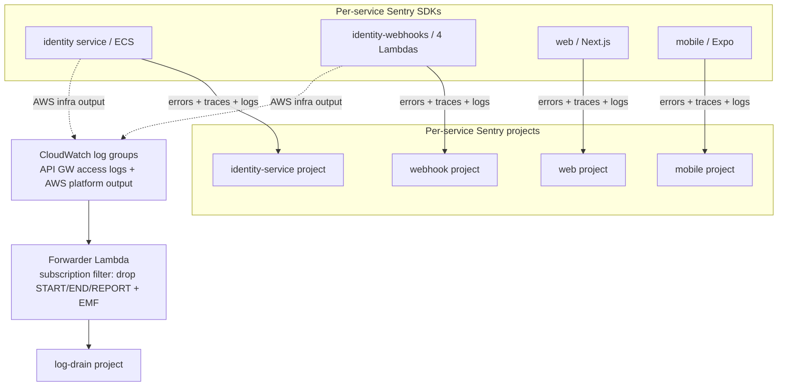

# Observability: Sentry Integration Across the Commise Stack

## Summary

Add end-to-end observability on Sentry across all four Commise deployables — the NestJS identity service (ECS), the four identity-webhooks Lambdas, the Next.js web app, and the Expo mobile app — plus a CloudWatch→Sentry log drain. Each deployable reports errors and purposeful logs through its own Sentry SDK to its own project; everything AWS writes to CloudWatch is forwarded to a separate log-drain project. Apps stop writing to stdout, so application logs and infrastructure logs never overlap.

---

## Problem Frame

The stack has no working error reporting today. The identity service runs with zero instrumentation — a plain NestJS `Logger` to stdout, no global exception handling. The identity-webhooks package has Sentry _scaffolded_ (`packages/services/identity-webhooks/src/common/observability.ts` initializes `@sentry/aws-serverless` and wraps three of four handlers) but `SENTRY_DSN` is never injected by CDK, so it is dormant in deployed environments, and the authorizer handler is unwrapped. The web and mobile apps have the Sentry env keys templated but no SDK installed. When something breaks in production, there is no triaged issue, no stack trace, and no single place to look.

Two log audiences are tangled today: AWS infrastructure/access logs and deliberate in-code logs both land in CloudWatch with 1-month retention and no downstream destination. The goal is to separate them cleanly and route each to the right home in Sentry.

---

## Key Decisions

- **Two-path model: SDK for app signal, drain for infra signal.** Each service's Sentry SDK sends errors, traces, and purposeful logs to that service's own project. A separate CloudWatch→Sentry drain forwards AWS-generated logs to a dedicated log-drain project. The paths do not overlap.
- **Apps do not log to stdout.** Purposeful logging goes through the Sentry SDK log API to the per-service project (co-located with that service's errors and traces). This is what makes the two paths non-overlapping — once apps are off stdout, the CloudWatch service log groups carry only AWS-generated content.
- **Drain via subscription filter + one forwarder Lambda**, not Kinesis Firehose — it fits the existing CDK/Lambda/Sentry stack with low carrying cost. Revisit only if log volume forces it.
- **Skip ALB access logs.** An ALB can only emit access logs to S3, never directly to CloudWatch. API Gateway sits in front of the identity service and its access logs already flow to CloudWatch, so they are the access-log layer; no ALB→S3→forwarder detour.
- **Drop Powertools `Logger`, keep Powertools `Metrics`.** The Sentry log API replaces `Logger` (better triage — logs sit next to errors in the per-service project). `Metrics` is retained because it emits custom CloudWatch metrics that Sentry does not cleanly replace.
- **Preserve context parity.** Whatever context Powertools `Logger` auto-injected (function name/version, AWS request id, cold-start flag, service name) is reproduced on the Sentry side — on both Lambda and ECS — and extended to log entries, not just error events.

---

## Architecture

---

## Requirements

**Log drain pipeline**

- R1. A CloudWatch Logs subscription-filter → forwarder Lambda → log-drain Sentry project pipeline forwards CloudWatch log events to the log-drain project.
- R2. The forwarder subscribes to all service log groups: the four identity-webhooks Lambda log groups, both API Gateway access-log groups (`ApiStack` and the webhooks `RestApi`), and the identity-service ECS log group.
- R3. The subscription-filter pattern excludes routine Lambda platform lines (`START`/`END`/`REPORT`) and Powertools EMF metric payloads (`_aws` embedded-metric JSON), forwarding access logs, warnings, errors, and non-routine events only.
- R4. Forwarded events preserve source context (log group, log stream, timestamp) as attributes on the Sentry log entry, so each is traceable to its origin.
- R5. The forwarder fails safe: a drain error never blocks or crashes the source service, and is itself observable.

**Identity-webhooks (Lambda)**

- R6. `SENTRY_DSN` (webhook project), `STAGE`, and `SENTRY_TRACES_SAMPLE_RATE` are injected into all four Lambdas via CDK (`packages/services/identity-webhooks/infra/lib/webhooks-stack.ts`), activating the existing conditional `Sentry.init` in `src/common/observability.ts`.
- R7. The authorizer handler (`src/authorizer/handler.ts`) is wrapped with `withObservability()` for error-capture parity with the other three handlers.
- R8. Powertools `Logger` is removed; purposeful logs are emitted through the Sentry SDK log API to the webhook project.
- R9. Powertools `Metrics` is retained; the custom counts (`UserCreatedWebhook`, `UserUpdatedWebhook`, `UserDeletedWebhook`, `ReconciliationDrift`) continue to emit as CloudWatch metrics.
- R10. Sentry log entries and error events carry the context Powertools `Logger` previously injected: function name, function version, AWS request id, cold-start flag, and `serviceName`.

**Identity service (ECS / NestJS)**

- R11. `@sentry/node` is added and initialized at bootstrap (`packages/services/identity/src/main.ts`) before app creation, using the identity-service DSN, with `environment` from `STAGE`.
- R12. A global exception filter reports unhandled exceptions to Sentry; service code reports handled errors from `catch` blocks via the SDK.
- R13. `SENTRY_DSN` (plus sample rate) is added to the Zod `EnvironmentSchema` (`src/config/env.schema.ts`) and injected via CDK (`infra/lib/identity-service-stack.ts`).
- R14. NestJS `Logger` purposeful logging is migrated to the Sentry log API; the service does not write logs to stdout.
- R15. Sentry log entries and error events carry context equivalent to the Lambda side: `serviceName`, ECS task/instance id, and a per-request id derived in middleware.

**Web (Next.js)**

- R16. `@sentry/nextjs` is installed with `instrumentation.ts` (client/server/edge), `withSentryConfig` in `next.config.ts`, and a `global-error` boundary, reading the `NEXT_PUBLIC_SENTRY_DSN` / `SENTRY_*` keys already present in `.env.template`.
- R17. Errors are captured automatically (unhandled + React error boundary) and from `catch` blocks; the Sentry log API is available for purposeful logging.
- R18. Source maps upload to Sentry on build using the templated `SENTRY_ORG` / `SENTRY_PROJECT` / `SENTRY_AUTH_TOKEN`.

**Mobile (Expo)**

- R19. `@sentry/react-native` is installed with its Expo config plugin registered in `app.json` (the `plugins` array is currently empty), and the root `App` is wrapped, reading `EXPO_PUBLIC_SENTRY_DSN`.
- R20. Errors are captured automatically and from `catch` blocks, with an error boundary; the Sentry log API is available for purposeful logging.
- R21. Source maps upload to Sentry on EAS build using the templated `SENTRY_*` keys.

**Cross-cutting**

- R22. Each deployable reports to its own project; errors appear as triaged Issues with stack traces (source-mapped where applicable), not as drained text — no error is double-counted between SDK and drain.
- R23. Every SDK init tags `environment` from `STAGE` and sets a release identifier for source-map association.
- R24. Web and mobile Sentry integration ship in the same release (cross-platform rule, `docs/CODING_STANDARDS.md §14`).

---

## Acceptance Examples

- AE1. **Covers R3.** Given a Lambda invocation that emits `START`/`END`/`REPORT` plus one application warning, when the drain runs, then only the warning reaches the log-drain project — the platform lines and any EMF metric payload are filtered out.
- AE2. **Covers R14, R22.** Given an unhandled exception in the identity service, then it appears once as an Issue (with stack trace) in the identity-service project, and does _not_ also appear as a drained log line in the log-drain project — because the app no longer writes to stdout.
- AE3. **Covers R8, R10.** Given a webhook handler logs "user synced" via the Sentry log API, then the entry in the webhook project carries function name, AWS request id, cold-start flag, and `serviceName`.
- AE4. **Covers R7.** Given the authorizer throws during JWT validation, then the error is captured to the webhook project, matching the other three handlers.

---

## Success Criteria

- All four deployables visibly report to their correct Sentry projects in a deployed (staging) environment.
- The log-drain project receives access/warning/error logs from every service, with routine platform lines and EMF payloads absent.
- An unhandled error triggered on each surface produces exactly one source-mapped Issue in the correct project.
- `ReconciliationDrift` (and the user-event counts) remain queryable as CloudWatch metrics.
- No application writes logs to stdout.

---

## Scope Boundaries

**Deferred for later**

- Sentry alert rules, dashboards, and SLO/monitor configuration (set up in the Sentry UI).
- CloudWatch metric alarms on the retained custom metrics (e.g., paging on `ReconciliationDrift`).
- Performance/tracing depth beyond a default, environment-configurable sample rate.

**Outside this effort's identity**

- Replacing CloudWatch as the durable log store — the drain is additive, not a replacement.
- Migrating Powertools `Metrics` to a different metrics backend.
- Observability for services that do not yet exist.

---

## Dependencies / Assumptions

- **DSNs** (provided; to be injected via env, not committed to source):
    - Log-drain project: `<log-drain-dsn>` (concrete value injected via env/SSM, not committed)
    - identity-webhooks project: `<webhook-dsn>`
    - identity-service project: `<identity-service-dsn>`
    - Web / mobile: in their respective `.env.local` files (`NEXT_PUBLIC_SENTRY_DSN` / `EXPO_PUBLIC_SENTRY_DSN`).
- The Sentry org plan includes the **Logs** feature for both per-service log entries and log-drain ingestion.
- Source-map upload requires `SENTRY_AUTH_TOKEN` available in CI (templated locally; must be set as a CI secret).
- The esbuild/Metro/Next build steps already emit source maps; the work wires their upload, not their generation.

---

## Outstanding Questions

**Resolve before planning**

- DSN injection method: plain CDK environment variables vs Secrets Manager/SSM. DSNs are low-sensitivity (send-only), so plain env is likely fine — confirm the convention to use.
- Confirm the Sentry org plan tier actually includes Logs ingestion at the expected volume for the drain.

**Deferred to planning**

- Per-environment traces sample rate values.
- Forwarder shape: one shared forwarder vs per-log-group subscriptions, and the exact mapping from CloudWatch event to Sentry log envelope.
- Release/version scheme for source maps (git SHA vs build number) across web, mobile, and Lambda.
- PII scrubbing configuration (`beforeSend` / data scrubbing) given user data flows through identity.
