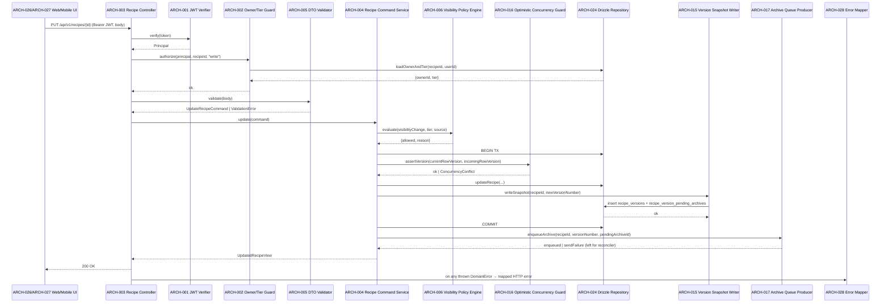
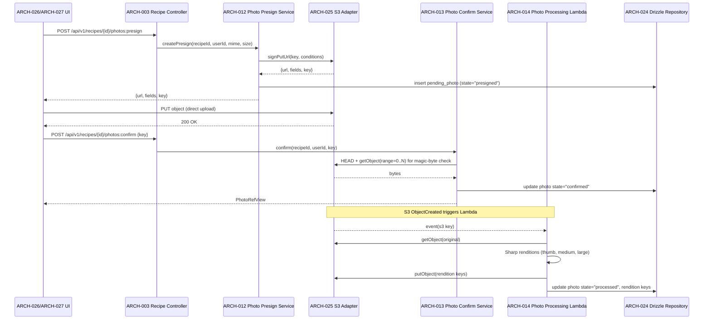
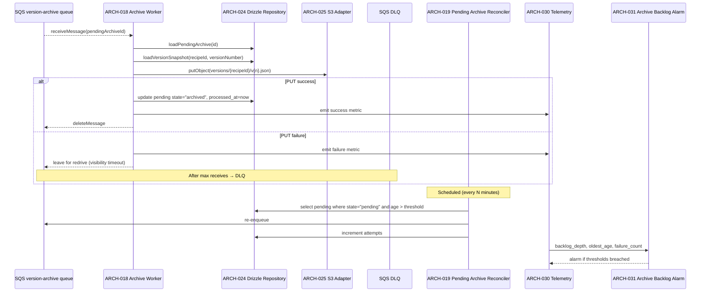
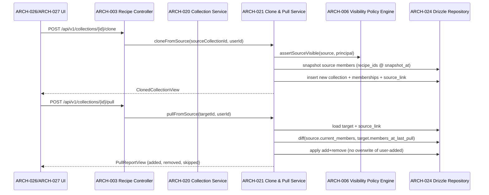
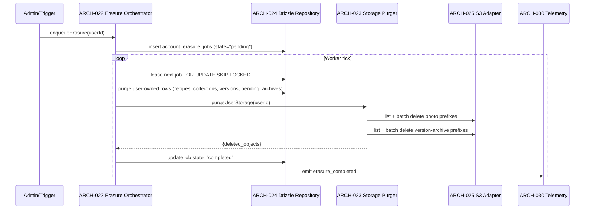

# Architecture Design: Commise - Recipe Management Core

**Feature Branch**: `001-commise-recipe-app`
**Created**: 2026-05-01
**Status**: Draft
**Source**: `specs/001-commise-recipe-app/v-model/system-design.md`

## Overview

This architecture decomposes the 20 system components from `system-design.md` into 33 software modules following IEEE 42010 / Kruchten 4+1 conventions. Decomposition is driven by NestJS module boundaries on the API tier (controller → service → policy/repository), Lambda-as-module boundaries for asynchronous workers (photo processor, archive worker), client-tier separation (web orchestration vs. mobile orchestration), and explicit cross-cutting infrastructure modules for configuration, telemetry, alarming, CI governance, and dependency-injection wiring. Each SYS-NNN may map to multiple ARCH-NNN (e.g., SYS-002 splits into Controller, Command Service, DTO Validator, and Error Mapper) and each ARCH-NNN may serve multiple SYS-NNN where the implementation boundary genuinely spans them (e.g., the Drizzle Repository Layer serves SYS-014 across all data-touching commands and queries). The Process View captures five critical end-to-end flows (authenticated recipe save with versioning, photo upload pipeline, async archive lifecycle with retry/DLQ, collection clone-and-pull, and GDPR erasure orchestration). The Interface View provides explicit input/output/exception contracts for every module — no black boxes — to drive Interface Contract Testing and Interface Fault Injection in `/speckit.v-model.integration-test`.

## ID Schema

- **Architecture Module**: `ARCH-NNN` — sequential identifier for each module
- **Parent System Components**: Comma-separated `SYS-NNN` list per module (many-to-many)
- **Cross-Cutting Tag**: `[CROSS-CUTTING]` for infrastructure/utility modules not traceable to a specific SYS
- Example: `ARCH-004` with Parent System Components `SYS-002, SYS-008` — module serves both Recipe Command Service and Versioning subsystems
- Example: `ARCH-033 [CROSS-CUTTING]` — NestJS dependency-injection wiring with no single SYS parent

## View Mapping (IEEE 42010 / Kruchten 4+1 Alignment)

| View Slot        | Realized By                                                                  | Purpose                                                                                                                                     |
| ---------------- | ---------------------------------------------------------------------------- | ------------------------------------------------------------------------------------------------------------------------------------------- |
| Logical View     | `## Logical View — Component Breakdown`                                      | Static decomposition of SYS components into ARCH modules with SYS↔ARCH traceability                                                         |
| Process View     | `## Process View (+1 Scenarios) — Dynamic Behavior`                          | Dynamic interactions, concurrency model, and synchronization points                                                                         |
| Physical View    | `## Physical View — Deployment Topology`                                     | Runtime/infrastructure deployment targets and allocation                                                                                    |
| Development View | `## Development View — Code Organization`                                    | Source-code/package/module allocation in the monorepo                                                                                       |
| +1 Scenarios     | The five interactions in `## Process View (+1 Scenarios) — Dynamic Behavior` | Validates Logical (module responsibilities), Physical (runtime placement), and Development (package ownership) through end-to-end use cases |

**Extension views (not Kruchten 4+1 named slots)**:

- `## Interface View — API Contracts (IEEE 42010 §8 Extension)` provides explicit module interface specifications required for verification.
- `## Data Flow View — Data Transformation Chains (Extension beyond Kruchten 4+1)` provides transformation-chain traceability across module boundaries.

## Logical View — Component Breakdown (IEEE 42010 / Kruchten 4+1)

| ARCH ID                  | Name                             | Description                                                                                                                                                                                                                                                                                                                                                                                                                                                                                          | Parent System Components                             | Type      |
| ------------------------ | -------------------------------- | ---------------------------------------------------------------------------------------------------------------------------------------------------------------------------------------------------------------------------------------------------------------------------------------------------------------------------------------------------------------------------------------------------------------------------------------------------------------------------------------------------- | ---------------------------------------------------- | --------- |
| ARCH-001                 | Auth0 JWT Verifier               | Validates incoming bearer tokens against Auth0 JWKS, decodes claims, and produces a typed `Principal` for downstream guards.                                                                                                                                                                                                                                                                                                                                                                         | SYS-001                                              | Service   |
| ARCH-002                 | Owner & Tier Authorization Guard | Enforces per-resource ownership and subscription-tier checks (free/premium) on protected NestJS routes.                                                                                                                                                                                                                                                                                                                                                                                              | SYS-001                                              | Component |
| ARCH-003                 | Recipe HTTP Controller           | NestJS controller exposing `/api/v1/recipes`, `/api/v1/recipes/{id}`, `/api/v1/recipes/{id}/clone`, `/api/v1/recipes/{id}/visibility`; binds DTOs to service.                                                                                                                                                                                                                                                                                                                                        | SYS-002                                              | Component |
| ARCH-004                 | Recipe Command Service           | Application service orchestrating create/update/delete/clone, transactional save, version snapshot creation, and archive enqueue.                                                                                                                                                                                                                                                                                                                                                                    | SYS-002, SYS-008                                     | Service   |
| ARCH-005                 | Recipe DTO Validator             | `class-validator` schemas for `CreateRecipeRequest`, `UpdateRecipeRequest`, visibility payload, and clone parameters.                                                                                                                                                                                                                                                                                                                                                                                | SYS-002                                              | Library   |
| ARCH-006                 | Visibility Policy Engine         | Pure-function policy evaluator returning `{ allowed, reason, ruleId }` for tier × source × visibility combinations; fail-closed on errors.                                                                                                                                                                                                                                                                                                                                                           | SYS-003                                              | Library   |
| ARCH-007                 | Substantive Edit Detector        | Compares pre/post recipe diffs over ingredients and instructions to determine whether a privacy unlock is permitted on imported clones.                                                                                                                                                                                                                                                                                                                                                              | SYS-003                                              | Library   |
| ARCH-008                 | Ingredient Resolver Service      | Resolves linked ingredient IDs and free-text ingredient strings against the catalog; powers autocomplete and save-time linkage.                                                                                                                                                                                                                                                                                                                                                                      | SYS-004                                              | Service   |
| ARCH-009                 | Nutrition Calculator             | Computes per-recipe nutrition aggregates from resolved ingredient quantities and unit conversions.                                                                                                                                                                                                                                                                                                                                                                                                   | SYS-004                                              | Library   |
| ARCH-010                 | Recipe Search Service            | Application service for `/api/v1/search/recipes` performing keyword + structured filter queries with pagination and facet projection.                                                                                                                                                                                                                                                                                                                                                                | SYS-005                                              | Service   |
| ARCH-011                 | Search Query Builder             | Translates filter DTOs into parameterized SQL/Drizzle queries against PostgreSQL `tsvector` and `pg_trgm` indexes; latency-aware plan shaping.                                                                                                                                                                                                                                                                                                                                                       | SYS-005                                              | Library   |
| ARCH-012                 | Photo Presign Service            | Issues S3 presigned PUT URLs scoped to a recipe and user, recording per-upload metadata for later validation.                                                                                                                                                                                                                                                                                                                                                                                        | SYS-006                                              | Service   |
| ARCH-013                 | Photo Confirm Service            | Server-side magic-byte revalidation, attaches confirmed object key to recipe, manages per-file retry semantics.                                                                                                                                                                                                                                                                                                                                                                                      | SYS-006                                              | Service   |
| ARCH-014                 | Photo Processing Lambda Handler  | AWS Lambda function consuming S3 ObjectCreated events, generating renditions via Sharp, and updating photo state in RDS.                                                                                                                                                                                                                                                                                                                                                                             | SYS-007                                              | Service   |
| ARCH-015                 | Version Snapshot Writer          | Writes JSONB version snapshots to `recipe_versions` and inserts the corresponding `recipe_version_pending_archives` row in the same transaction.                                                                                                                                                                                                                                                                                                                                                     | SYS-008                                              | Service   |
| ARCH-016                 | Optimistic Concurrency Guard     | Enforces row-versioned compare-and-set on recipe updates; emits explicit 409 conflict payloads with current/incoming snapshots.                                                                                                                                                                                                                                                                                                                                                                      | SYS-008                                              | Library   |
| ARCH-017                 | Archive Queue Producer           | Sends archive job messages to the version-archive SQS queue; tolerates send failures by leaving pending row for the reconciler.                                                                                                                                                                                                                                                                                                                                                                      | SYS-009                                              | Service   |
| ARCH-018                 | Archive Worker Lambda            | Consumes SQS archive messages, serializes the snapshot, writes `versions/{recipe_id}/v{n}.json` to S3, then transitions pending row state.                                                                                                                                                                                                                                                                                                                                                           | SYS-010                                              | Service   |
| ARCH-019                 | Pending Archive Reconciler       | Scheduled sweeper that re-enqueues pending-archive rows whose age exceeds threshold and increments attempt counters.                                                                                                                                                                                                                                                                                                                                                                                 | SYS-010                                              | Service   |
| ARCH-020                 | Collection Service               | CRUD and membership management for collections, including non-cascade delete semantics and visibility checks via ARCH-006.                                                                                                                                                                                                                                                                                                                                                                           | SYS-011                                              | Service   |
| ARCH-021                 | Collection Clone & Pull Service  | Snapshot-clone source collections and execute user-initiated pull-from-source reconciliation under explicit add/remove/no-overwrite rules.                                                                                                                                                                                                                                                                                                                                                           | SYS-012                                              | Service   |
| ARCH-022                 | GDPR Erasure Orchestrator        | Enqueues, leases, and progresses `account_erasure_jobs` ledger rows; coordinates RDS purge + S3 purge with idempotent state transitions.                                                                                                                                                                                                                                                                                                                                                             | SYS-013                                              | Service   |
| ARCH-023                 | Erasure Storage Purger           | Lists user-owned object prefixes in S3 (photos + version archives) and performs batched deletes with retries.                                                                                                                                                                                                                                                                                                                                                                                        | SYS-013, SYS-015                                     | Adapter   |
| ARCH-024                 | Drizzle Repository Layer         | Encapsulates all PostgreSQL access (recipes, ingredients, photos, versions, pending archives, collections, erasure ledger) via Drizzle ORM.                                                                                                                                                                                                                                                                                                                                                          | SYS-014                                              | Adapter   |
| ARCH-025                 | S3 & CloudFront Adapter          | Wraps `@aws-sdk/client-s3` and presigner SDKs, owns bucket/key conventions, signs URLs, and exposes object lifecycle helpers.                                                                                                                                                                                                                                                                                                                                                                        | SYS-015                                              | Adapter   |
| ARCH-026                 | Web Recipe & Collection UI       | Next.js App Router pages, client-side validation, conflict UI, accessibility primitives, and Auth0 web SDK session integration.                                                                                                                                                                                                                                                                                                                                                                      | SYS-016                                              | Component |
| ARCH-027                 | Mobile Recipe & Collection UI    | Expo React Native screens, client-side validation, conflict UI, accessibility props, secure-store token persistence, and mobile API base URL.                                                                                                                                                                                                                                                                                                                                                        | SYS-017                                              | Component |
| ARCH-028                 | API Error Mapper                 | NestJS exception filter translating domain errors (validation, conflict, policy denial, not-found) into structured HTTP responses with codes.                                                                                                                                                                                                                                                                                                                                                        | SYS-002                                              | Library   |
| ARCH-029                 | Config Loader                    | `@nestjs/config` + Zod-validated environment loader exposing typed config tokens to all modules; resolves API/web/mobile defaults and ports.                                                                                                                                                                                                                                                                                                                                                         | SYS-018                                              | Utility   |
| ARCH-030                 | Telemetry & Logger               | Powertools/structured logger and metric emitter wired into all NestJS providers and Lambdas; correlation IDs and Sentry breadcrumb propagation.                                                                                                                                                                                                                                                                                                                                                      | SYS-019                                              | Utility   |
| ARCH-031                 | Archive Backlog Alarm            | CloudWatch alarm definitions on archive failure count, pending-row depth, and oldest-pending-age metrics emitted by ARCH-018/ARCH-019.                                                                                                                                                                                                                                                                                                                                                               | SYS-019                                              | Utility   |
| ARCH-032                 | CI & Test Governance Harness     | Turborepo + ESLint + tsc + vitest + LocalStack orchestration enforcing strict TS, JSDoc, TDD gates, and out-of-scope constraint checks in CI.                                                                                                                                                                                                                                                                                                                                                        | SYS-020                                              | Utility   |
| ARCH-033 [CROSS-CUTTING] | NestJS Module Wiring             | Root `AppModule` and feature modules composing providers, guards, filters, and adapters; binds DI tokens for testability. **Rationale: NestJS dependency-injection wiring is inherently cross-cutting — it composes providers from multiple domain-boundary modules (auth, recipe, persistence, config, telemetry) into a single `AppModule`. Attributing it to any single SYS would misrepresent its actual multi-SYS scope. Classified [CROSS-CUTTING] per the tagging convention in §ID Schema.** | SYS-001, SYS-002, SYS-014, SYS-018, SYS-019, SYS-020 | Utility   |

### SYS→ARCH Reverse Traceability

| SYS ID  | SYS Name                                       | Implementing ARCH IDs                            | ARCH Count |
| ------- | ---------------------------------------------- | ------------------------------------------------ | ---------- |
| SYS-001 | Auth0 Identity and Access Guard                | ARCH-001, ARCH-002, ARCH-033                     | 3          |
| SYS-002 | Recipe Command Service                         | ARCH-003, ARCH-004, ARCH-005, ARCH-028, ARCH-033 | 5          |
| SYS-003 | Visibility and Source Policy Engine            | ARCH-006, ARCH-007                               | 2          |
| SYS-004 | Ingredient Catalog and Nutrition Resolver      | ARCH-008, ARCH-009                               | 2          |
| SYS-005 | Recipe Search and Filter Service               | ARCH-010, ARCH-011                               | 2          |
| SYS-006 | Photo Upload Validation and Attachment Service | ARCH-012, ARCH-013                               | 2          |
| SYS-007 | Photo Processing Lambda                        | ARCH-014                                         | 1          |
| SYS-008 | Recipe Versioning and Conflict Service         | ARCH-004, ARCH-015, ARCH-016                     | 3          |
| SYS-009 | Version Archive Queue Producer                 | ARCH-017                                         | 1          |
| SYS-010 | Version Archive Worker and Replay Engine       | ARCH-018, ARCH-019                               | 2          |
| SYS-011 | Collection Management Service                  | ARCH-020                                         | 1          |
| SYS-012 | Collection Clone and Pull Reconcile Service    | ARCH-021                                         | 1          |
| SYS-013 | GDPR Erasure Orchestrator                      | ARCH-022, ARCH-023                               | 2          |
| SYS-014 | Data Access and Persistence Layer              | ARCH-024, ARCH-033                               | 2          |
| SYS-015 | Object Storage and CDN Subsystem               | ARCH-023, ARCH-025                               | 2          |
| SYS-016 | Web Client Application (Next.js)               | ARCH-026                                         | 1          |
| SYS-017 | Mobile Client Application (Expo/React Native)  | ARCH-027                                         | 1          |
| SYS-018 | Configuration and Environment Resolution       | ARCH-029, ARCH-033                               | 2          |
| SYS-019 | Observability and Alerting                     | ARCH-030, ARCH-031, ARCH-033                     | 3          |
| SYS-020 | Quality, Test, and CI Governance               | ARCH-032, ARCH-033                               | 2          |

## Process View (+1 Scenarios) — Dynamic Behavior (Kruchten 4+1)

The five scenarios below are the document's **+1 Scenarios** view and collectively exercise the Logical View module decomposition, Physical View runtime placement (API container, S3, SQS, Lambda, RDS), and Development View ownership boundaries (API/web/mobile/worker/infra packages).

### Interaction: Authenticated Recipe Save with Versioning and Archive Enqueue

**Concurrency Model**: NestJS request-per-task on Node event loop; database transaction provides isolation (`READ COMMITTED`) plus row-version compare-and-set in ARCH-016 for optimistic concurrency. Queue send (ARCH-017) executes after commit but failures are tolerated because ARCH-019 reconciler replays from the pending row.
**Synchronization Points**: (1) DB transaction commit boundary in ARCH-004; (2) row-version CAS in ARCH-016; (3) post-commit queue send (best-effort) in ARCH-017; (4) archive worker `processed_at` write in ARCH-018 only after S3 PUT confirmed.

### Interaction: Photo Upload — Presign, Confirm, Async Processing

**Concurrency Model**: Browser/mobile uploads directly to S3 (out-of-process); Lambda concurrency is per-S3-event with reserved concurrency cap. Confirm is synchronous to API; Lambda processing is asynchronous and idempotent on object key.
**Synchronization Points**: (1) confirm magic-byte check before persisting `confirmed`; (2) Lambda writes `processed` only after all renditions PUT; retries via Lambda destination on failure.

### Interaction: Async Archive Worker with Retry/DLQ and Reconciler

**Concurrency Model**: SQS at-least-once delivery; Lambda concurrency limited by reserved capacity; reconciler runs on EventBridge schedule with single-instance lock via row-level `FOR UPDATE SKIP LOCKED`.
**Synchronization Points**: (1) S3 PUT confirmation gates the pending-row state transition (no premature delete); (2) `SKIP LOCKED` prevents reconciler/worker double-processing; (3) DLQ threshold gates manual replay.

### Interaction: Collection Clone and User-Initiated Pull Reconciliation

**Concurrency Model**: Single transaction per pull; per-collection advisory lock prevents concurrent pulls on the same target.
**Synchronization Points**: PostgreSQL advisory lock keyed on `target_collection_id` for the pull duration.

### Interaction: GDPR Erasure Orchestration (Idempotent)

**Concurrency Model**: Single-leader leasing via `FOR UPDATE SKIP LOCKED` on `account_erasure_jobs`; per-job idempotent (replays safely on partial completion via state transitions).
**Synchronization Points**: (1) job lease boundary; (2) RDS purge committed before S3 purge to ensure references are gone; (3) S3 batch delete is retried on partial-failure responses.

## Physical View — Deployment Topology (Kruchten 4+1)

### Runtime/Infrastructure Topology

- **Region strategy**: Primary deployment in one AWS region (for example `us-east-1`) with managed regional services: VPC, RDS PostgreSQL 16, SQS queues, Lambda workers, and ECS Fargate API runtime.
- **Network layout**:
    - Public edge: CloudFront distribution terminating TLS for web static assets and image/object delivery from S3 via Origin Access Control (ARCH-025).
    - Private application plane: API runtime in private subnets (ECS Fargate service behind ALB) hosting NestJS modules (ARCH-003, ARCH-004, ARCH-010, ARCH-020, ARCH-021, ARCH-022, ARCH-028, ARCH-029, ARCH-030, ARCH-033).
    - Data plane: RDS PostgreSQL in isolated/private subnets accessed through security groups by API and worker runtimes (ARCH-024).
    - Async plane: SQS main queue + DLQ for version archives (ARCH-017 producer, ARCH-018 worker, ARCH-019 reconciler, ARCH-031 alarm).
- **Stateful services**:
    - **RDS PostgreSQL 16** stores recipes, versions, pending archives, collections, erasure jobs (primarily ARCH-024, invoked by ARCH-004/ARCH-015/ARCH-022).
    - **S3 buckets** store recipe photos/renditions and archived version objects (ARCH-012, ARCH-013, ARCH-014, ARCH-018, ARCH-023, ARCH-025).
    - **CloudFront CDN** fronts web and signed/static object delivery paths (ARCH-025).
- **Compute services**:
    - **NestJS API container runtime** (ECS Fargate) executes synchronous request path and orchestration modules (ARCH-001, ARCH-002, ARCH-003, ARCH-004, ARCH-005, ARCH-006, ARCH-007, ARCH-008, ARCH-009, ARCH-010, ARCH-011, ARCH-012, ARCH-013, ARCH-015, ARCH-016, ARCH-017, ARCH-020, ARCH-021, ARCH-022, ARCH-024, ARCH-028, ARCH-029, ARCH-030, ARCH-033).
    - **Photo processor Lambda** executes Sharp rendition pipeline from S3 events (ARCH-014).
    - **Version-archive worker Lambda** consumes SQS archive jobs and writes version objects to S3 (ARCH-018).
    - **Scheduled reconciler Lambda/cron compute** re-enqueues stale pending archives (ARCH-019).
- **Clients (outside VPC)**:
    - **Web app** (ARCH-026) served via CloudFront/Next.js deployment surface; calls API over HTTPS with Auth0 bearer tokens.
    - **Mobile app** (ARCH-027, Expo React Native) communicates directly with API and presigned S3 upload targets.

### Runtime Allocation Matrix

| Runtime Location                     | Deployed Modules (ARCH)                                                                                                                                                                                                                        | Notes                                                             |
| ------------------------------------ | ---------------------------------------------------------------------------------------------------------------------------------------------------------------------------------------------------------------------------------------------- | ----------------------------------------------------------------- |
| API Container (ECS Fargate)          | ARCH-001, ARCH-002, ARCH-003, ARCH-004, ARCH-005, ARCH-006, ARCH-007, ARCH-008, ARCH-009, ARCH-010, ARCH-011, ARCH-012, ARCH-013, ARCH-015, ARCH-016, ARCH-017, ARCH-020, ARCH-021, ARCH-022, ARCH-024, ARCH-028, ARCH-029, ARCH-030, ARCH-033 | Main synchronous HTTP/API and orchestration runtime               |
| Lambda: Photo Processor              | ARCH-014, ARCH-024, ARCH-025, ARCH-030                                                                                                                                                                                                         | Event-driven image rendition and persistence updates              |
| Lambda: Archive Worker               | ARCH-018, ARCH-024, ARCH-025, ARCH-030                                                                                                                                                                                                         | SQS-driven archive object materialization                         |
| Lambda/Scheduled Compute: Reconciler | ARCH-019, ARCH-017, ARCH-024, ARCH-030, ARCH-031                                                                                                                                                                                               | Scheduled replay of stalled pending archives with metric emission |
| CloudFront + S3 Edge/Object Layer    | ARCH-025, ARCH-012, ARCH-013, ARCH-014, ARCH-018, ARCH-023, ARCH-026                                                                                                                                                                           | Presigned upload/download and cached asset delivery               |
| Client Device/Browsers               | ARCH-026, ARCH-027                                                                                                                                                                                                                             | Web/mobile UX, request initiation, conflict handling              |

## Development View — Code Organization (Kruchten 4+1)

### Monorepo Module Organization

- **API application package** (`packages/apps/commise/api`): NestJS code organized by feature/domain module boundaries.
    - `auth/`: token and policy guards (ARCH-001, ARCH-002).
    - `recipes/`: controller + command/query orchestration + DTO/contracts (ARCH-003, ARCH-004, ARCH-005, ARCH-010, ARCH-011, ARCH-028).
    - `visibility/`: visibility rules and substantive edit policy helpers (ARCH-006, ARCH-007).
    - `ingredients/` and nutrition domain services (ARCH-008, ARCH-009).
    - `photos/`: presign/confirm orchestration (ARCH-012, ARCH-013).
    - `versions/archives/`: snapshot + enqueue logic (ARCH-015, ARCH-016, ARCH-017).
    - `collections/`: collection and clone/pull modules (ARCH-020, ARCH-021).
    - `privacy/erasure/`: account erasure orchestrator paths (ARCH-022, ARCH-023).
    - `infrastructure/`: config, telemetry, wiring, adapters (ARCH-024, ARCH-025, ARCH-029, ARCH-030, ARCH-033).
- **Worker/serverless package(s)** (`packages/apps/commise/workers` or infra-defined Lambda sources):
    - `photo-processor/` for rendition Lambda (ARCH-014).
    - `version-archive-worker/` for SQS archive worker (ARCH-018).
    - `archive-reconciler/` for scheduled replay (ARCH-019).
- **Web app package** (`packages/apps/commise/web`): Next.js App Router UI modules and API client orchestration (ARCH-026).
- **Mobile app package** (`packages/apps/commise/mobile`): Expo React Native screens, secure token handling, API client (ARCH-027).
- **Shared libraries** (`packages/ui`, `packages/libs/*`, or shared workspace packages): reusable UI, DTO/type contracts, and utility code consumed by ARCH-026/ARCH-027 and API-side validators.
- **Infrastructure as code** (`infra/` or `packages/infra/*`): CDK stacks for VPC, RDS, S3, CloudFront, SQS, Lambda, alarms, IAM, deployment wiring (ARCH-025, ARCH-031, ARCH-032).
- **Quality and governance tooling** (`packages/tools/*`, root Turborepo pipelines, CI workflows): lint/type/test gates and integration harnesses mapped to ARCH-032.

### Development Allocation Matrix

| Repository Area                                     | Primary Modules (ARCH)                                                                   | Responsibility                                                     |
| --------------------------------------------------- | ---------------------------------------------------------------------------------------- | ------------------------------------------------------------------ |
| `packages/apps/commise/api/v1/src/auth`           | ARCH-001, ARCH-002                                                                       | AuthN/AuthZ pipeline and route guards                              |
| `packages/apps/commise/api/v1/src/recipes`        | ARCH-003, ARCH-004, ARCH-005, ARCH-010, ARCH-011, ARCH-028                               | Recipe command/query endpoints and validation/error contracts      |
| `packages/apps/commise/api/v1/src/domain`         | ARCH-006, ARCH-007, ARCH-008, ARCH-009, ARCH-015, ARCH-016, ARCH-020, ARCH-021, ARCH-022 | Domain policies and orchestrators                                  |
| `packages/apps/commise/api/v1/src/infrastructure` | ARCH-024, ARCH-025, ARCH-029, ARCH-030, ARCH-033                                         | Persistence, cloud adapters, config, telemetry, module composition |
| `packages/apps/commise/workers/*`                 | ARCH-014, ARCH-018, ARCH-019                                                             | Event/schedule-driven worker runtimes                              |
| `packages/apps/commise/web`                       | ARCH-026                                                                                 | Web user interface and client orchestration                        |
| `packages/apps/commise/mobile`                    | ARCH-027                                                                                 | Mobile user interface and secure token/API handling                |
| `infra/` + CI workflows (`.github/workflows`)       | ARCH-031, ARCH-032                                                                       | Deployment topology definitions, alarms, and governance gates      |

## Interface View — API Contracts (IEEE 42010 §8 Extension)

This section is an **IEEE 42010 interface-specification extension** and is not one of the five named Kruchten 4+1 views. It is cross-referenced by the Logical View module list and used by integration/contract testing.

### ARCH-001: Auth0 JWT Verifier

| Direction | Name             | Type   | Format                           | Constraints                                                         |
| --------- | ---------------- | ------ | -------------------------------- | ------------------------------------------------------------------- |
| Input     | bearerToken      | string | JWT compact serialization        | Required; non-empty; signed by configured Auth0 tenant; not expired |
| Output    | principal        | object | `{ sub, email, tier, iat, exp }` | `sub` non-empty; `tier ∈ {"free","premium"}`; `exp` > now           |
| Exception | INVALID_TOKEN    | 401    | `{ code, message }`              | Thrown on signature/claim/expiry/issuer/audience failure            |
| Exception | JWKS_UNAVAILABLE | 503    | `{ code, message, retryAfter }`  | Thrown when JWKS endpoint unreachable after retries                 |

### ARCH-002: Owner & Tier Authorization Guard

| Direction | Name            | Type   | Format                           | Constraints                                                                |
| --------- | --------------- | ------ | -------------------------------- | -------------------------------------------------------------------------- |
| Input     | principal       | object | Principal from ARCH-001          | Required                                                                   |
| Input     | resourceRef     | object | `{ kind, id, action }`           | `kind ∈ {recipe, collection, photo}`; `action ∈ {read,write,delete,clone}` |
| Output    | decision        | object | `{ allowed: true }`              | Returned only when allowed                                                 |
| Exception | FORBIDDEN_OWNER | 403    | `{ code, ruleId }`               | Principal is not owner and resource is not public                          |
| Exception | FORBIDDEN_TIER  | 403    | `{ code, ruleId, requiredTier }` | Principal tier insufficient for action                                     |

### ARCH-003: Recipe HTTP Controller

| Direction | Name                | Type       | Format                                             | Constraints                                                             |
| --------- | ------------------- | ---------- | -------------------------------------------------- | ----------------------------------------------------------------------- |
| Input     | request             | HTTP       | NestJS controller route + body                     | Bearer token required; body matches DTO                                 |
| Output    | response            | HTTP       | JSON resource view + status                        | 2xx on success; pagination headers on lists                             |
| Exception | INVALID_TOKEN       | 401        | `{ code, message, traceId }`                       | Originates in ARCH-001; surfaced via ARCH-028 at controller boundary    |
| Exception | FORBIDDEN_OWNER     | 403        | `{ code, message, ruleId, traceId }`               | Originates in ARCH-002 ownership guard; surfaced via ARCH-028           |
| Exception | FORBIDDEN_TIER      | 403        | `{ code, message, ruleId, requiredTier, traceId }` | Originates in ARCH-002 tier guard; surfaced via ARCH-028                |
| Exception | RECIPE_NOT_FOUND    | 404        | `{ code, message, details?, traceId }`             | Path/resource lookup miss at controller boundary; surfaced via ARCH-028 |
| Exception | METHOD_NOT_ALLOWED  | 405        | `{ code, message, traceId }`                       | Unsupported HTTP method at controller boundary; surfaced via ARCH-028   |
| Exception | mapped via ARCH-028 | HTTP error | `{ code, message, details?, traceId }`             | All other thrown domain errors traverse the global filter               |

### ARCH-004: Recipe Command Service

| Direction | Name                 | Type   | Format                                          | Constraints                                                    |
| --------- | -------------------- | ------ | ----------------------------------------------- | -------------------------------------------------------------- | ------ | -------------------- | ----------------------------- |
| Input     | command              | object | `Create                                         | Update                                                         | Delete | Clone RecipeCommand` | Validated; principal attached |
| Output    | result               | object | `RecipeView` with `versionNumber`, `rowVersion` | New `versionNumber` monotonic per recipe; `rowVersion` updated |
| Exception | CONCURRENCY_CONFLICT | 409    | `{ code, currentRowVersion, currentSnapshot }`  | Raised by ARCH-016                                             |
| Exception | POLICY_DENIED        | 403    | `{ code, ruleId, reason }`                      | Raised by ARCH-006                                             |
| Exception | VALIDATION_FAILED    | 400    | `{ code, fieldErrors[] }`                       | Raised by ARCH-005 before service entry                        |

### ARCH-005: Recipe DTO Validator

| Direction | Name              | Type   | Format                                     | Constraints                                                |
| --------- | ----------------- | ------ | ------------------------------------------ | ---------------------------------------------------------- |
| Input     | rawBody           | object | unsanitized JSON                           | Any object                                                 |
| Output    | dto               | object | typed `CreateRecipeRequest` etc.           | Strict whitelist; trimmed strings; numeric ranges enforced |
| Exception | VALIDATION_FAILED | 400    | `{ fieldErrors[]: {path, code, message} }` | Aggregates all rule violations                             |

### ARCH-006: Visibility Policy Engine

| Direction | Name            | Type   | Format                                                                     | Constraints                                                   |
| --------- | --------------- | ------ | -------------------------------------------------------------------------- | ------------------------------------------------------------- |
| Input     | context         | object | `{ tier, source, currentVisibility, targetVisibility, isSubstantiveEdit }` | All required; values from enums                               |
| Output    | decision        | object | `{ allowed: boolean, reason: string, ruleId: string }`                     | Deterministic; pure function                                  |
| Exception | POLICY_INTERNAL | 500    | `{ code, ruleId? }`                                                        | Thrown only on enum mismatch (programming error); fail-closed |

### ARCH-007: Substantive Edit Detector

| Direction | Name         | Type   | Format                                                | Constraints                                                             |
| --------- | ------------ | ------ | ----------------------------------------------------- | ----------------------------------------------------------------------- |
| Input     | beforeRecipe | object | `RecipeSnapshot`                                      | Required                                                                |
| Input     | afterRecipe  | object | `RecipeSnapshot`                                      | Required                                                                |
| Output    | result       | object | `{ isSubstantive: boolean, changedFields: string[] }` | `isSubstantive=true` iff ingredients or instructions materially changed |
| Exception | none         | —      | —                                                     | Pure function                                                           |

### ARCH-008: Ingredient Resolver Service

| Direction | Name                 | Type  | Format                                                      | Constraints                                |
| --------- | -------------------- | ----- | ----------------------------------------------------------- | ------------------------------------------ | -------------------------------------------------- |
| Input     | items                | array | `[{ kind: "linked"                                          | "freeform", id?, text?, quantity, unit }]` | `linked` requires `id`; `freeform` requires `text` |
| Output    | resolved             | array | `[{ inputIndex, ingredientId?, freeform?, normalizedQty }]` | Stable order matching input                |
| Exception | INGREDIENT_NOT_FOUND | 404   | `{ code, inputIndex, attemptedId }`                         | Linked id missing in catalog               |

### ARCH-009: Nutrition Calculator

| Direction | Name               | Type   | Format                                      | Constraints                                                       |
| --------- | ------------------ | ------ | ------------------------------------------- | ----------------------------------------------------------------- |
| Input     | resolvedItems      | array  | output of ARCH-008                          | All linked items must have nutrition rows; freeform items skipped |
| Output    | nutrition          | object | `{ perServing, perRecipe, missingItems[] }` | `missingItems` lists indexes that lacked nutrition data           |
| Exception | UNIT_INCONVERTIBLE | 422    | `{ code, inputIndex, fromUnit, toUnit }`    | Quantity unit cannot be converted to nutrition base unit          |

### ARCH-010: Recipe Search Service

| Direction | Name           | Type   | Format                                     | Constraints                                           |
| --------- | -------------- | ------ | ------------------------------------------ | ----------------------------------------------------- |
| Input     | query          | object | `{ q?, filters?, page, pageSize }`         | `pageSize ≤ 100`; respects principal visibility scope |
| Output    | results        | object | `{ items[], page, totalPages, latencyMs }` | `latencyMs` recorded for SLO observation              |
| Exception | SEARCH_TIMEOUT | 504    | `{ code, queryHash }`                      | Underlying query exceeded configured timeout          |

### ARCH-011: Search Query Builder

| Direction | Name           | Type   | Format                    | Constraints                                       |
| --------- | -------------- | ------ | ------------------------- | ------------------------------------------------- |
| Input     | filterDto      | object | normalized search filters | Whitelisted filter keys only                      |
| Output    | sql            | object | `{ text, params[] }`      | All values parameterized; no string interpolation |
| Exception | INVALID_FILTER | 400    | `{ code, field }`         | Filter outside whitelist                          |

### ARCH-012: Photo Presign Service

| Direction | Name                  | Type   | Format                            | Constraints                                    |
| --------- | --------------------- | ------ | --------------------------------- | ---------------------------------------------- |
| Input     | request               | object | `{ recipeId, mime, sizeBytes }`   | mime in allowed set; size ≤ configured max     |
| Output    | presign               | object | `{ url, fields, key, expiresAt }` | Expires within configured window (e.g., 5 min) |
| Exception | UPLOAD_QUOTA_EXCEEDED | 429    | `{ code, retryAfter }`            | Per-user upload rate or count cap              |

### ARCH-013: Photo Confirm Service

| Direction | Name             | Type   | Format                          | Constraints                                            |
| --------- | ---------------- | ------ | ------------------------------- | ------------------------------------------------------ |
| Input     | request          | object | `{ recipeId, key }`             | `key` must match a presigned record owned by principal |
| Output    | photoView        | object | `{ photoId, key, state, mime }` | `state="confirmed"`                                    |
| Exception | UPLOAD_INVALID   | 422    | `{ code, reason }`              | Magic-byte/MIME mismatch or object missing             |
| Exception | UPLOAD_NOT_FOUND | 404    | `{ code, key }`                 | No presigned record matches                            |

### ARCH-014: Photo Processing Lambda Handler

| Direction | Name              | Type    | Format                         | Constraints                                                |
| --------- | ----------------- | ------- | ------------------------------ | ---------------------------------------------------------- |
| Input     | s3Event           | object  | AWS S3 ObjectCreated event     | Single object per record; bucket/key parsed                |
| Output    | result            | object  | `{ photoId, renditionKeys[] }` | Lambda return; logged + persisted via ARCH-024             |
| Exception | PROCESSING_FAILED | runtime | `{ code, photoId, stage }`     | Causes Lambda retry; routed to destination on max attempts |

### ARCH-015: Version Snapshot Writer

| Direction | Name                 | Type   | Format                                | Constraints                                             |
| --------- | -------------------- | ------ | ------------------------------------- | ------------------------------------------------------- |
| Input     | input                | object | `{ recipeId, snapshot, txn }`         | Must run inside caller's DB transaction                 |
| Output    | result               | object | `{ versionNumber, pendingArchiveId }` | `versionNumber` monotonic; pending row inserted same TX |
| Exception | VERSION_WRITE_FAILED | 500    | `{ code, recipeId }`                  | DB constraint violation; aborts caller's transaction    |

### ARCH-016: Optimistic Concurrency Guard

| Direction | Name                 | Type   | Format                                         | Constraints                           |
| --------- | -------------------- | ------ | ---------------------------------------------- | ------------------------------------- |
| Input     | input                | object | `{ table, id, expectedRowVersion }`            | `expectedRowVersion` from client read |
| Output    | result               | object | `{ ok: true, newRowVersion }`                  | Returned only on CAS success          |
| Exception | CONCURRENCY_CONFLICT | 409    | `{ code, currentRowVersion, currentSnapshot }` | Raised when CAS fails                 |

### ARCH-017: Archive Queue Producer

| Direction | Name              | Type   | Format                                          | Constraints                                      |
| --------- | ----------------- | ------ | ----------------------------------------------- | ------------------------------------------------ |
| Input     | message           | object | `{ pendingArchiveId, recipeId, versionNumber }` | All fields required                              |
| Output    | ack               | object | `{ messageId, sentAt }`                         | Only on SQS 200                                  |
| Exception | QUEUE_SEND_FAILED | warn   | `{ code, pendingArchiveId }`                    | Logged; pending row left for ARCH-019 reconciler |

### ARCH-018: Archive Worker Lambda

| Direction | Name                 | Type    | Format                              | Constraints                                     |
| --------- | -------------------- | ------- | ----------------------------------- | ----------------------------------------------- |
| Input     | sqsEvent             | object  | SQS batch event                     | Each record = 1 pendingArchiveId                |
| Output    | result               | object  | `{ batchItemFailures[] }`           | Standard SQS partial-batch-failure response     |
| Exception | ARCHIVE_WRITE_FAILED | runtime | `{ code, pendingArchiveId, stage }` | Causes message redrive then DLQ on max attempts |

### ARCH-019: Pending Archive Reconciler

| Direction | Name                 | Type   | Format                         | Constraints                                |
| --------- | -------------------- | ------ | ------------------------------ | ------------------------------------------ |
| Input     | trigger              | object | EventBridge schedule event     | Cron-driven                                |
| Output    | report               | object | `{ reEnqueued, ageHistogram }` | Always returned; emitted as metrics        |
| Exception | RECONCILER_LOCK_LOST | warn   | `{ code }`                     | Concurrent runner; safe to retry next tick |

### ARCH-020: Collection Service

| Direction | Name          | Type   | Format              | Constraints                                            |
| --------- | ------------- | ------ | ------------------- | ------------------------------------------------------ |
| Input     | command       | object | `{ kind, payload }` | `kind ∈ {create,update,addMember,removeMember,delete}` |
| Output    | view          | object | `CollectionView`    | Includes member count and visibility                   |
| Exception | NOT_FOUND     | 404    | `{ code, id }`      | Collection or member missing                           |
| Exception | POLICY_DENIED | 403    | `{ code, ruleId }`  | Visibility/tier rejected                               |

### ARCH-021: Collection Clone & Pull Service

| Direction | Name           | Type   | Format                                          | Constraints                                  |
| --------- | -------------- | ------ | ----------------------------------------------- | -------------------------------------------- |
| Input     | clone          | object | `{ sourceCollectionId, userId }`                | Source must be visible to principal          |
| Input     | pull           | object | `{ targetCollectionId, userId }`                | Target must have `source_link`               |
| Output    | report         | object | `{ added[], removed[], skipped[], snapshotAt }` | Deterministic diff; skips user-added members |
| Exception | PULL_LOCK_HELD | 409    | `{ code, targetCollectionId }`                  | Another pull in flight                       |

### ARCH-022: GDPR Erasure Orchestrator

| Direction | Name           | Type   | Format                                      | Constraints                                              |
| --------- | -------------- | ------ | ------------------------------------------- | -------------------------------------------------------- |
| Input     | request        | object | `{ userId, requestedBy, reason }`           | Idempotent on `userId` (returns existing job if present) |
| Output    | jobView        | object | `{ jobId, state, createdAt, completedAt? }` | State ∈ {pending, leased, purging, completed, failed}    |
| Exception | ERASURE_FAILED | 500    | `{ code, jobId, stage }`                    | Captured in job ledger; auto-retry next tick             |

### ARCH-023: Erasure Storage Purger

| Direction | Name                  | Type   | Format                           | Constraints                                                             |
| --------- | --------------------- | ------ | -------------------------------- | ----------------------------------------------------------------------- |
| Input     | request               | object | `{ userId }`                     | Resolves prefixes: `users/{userId}/photos/`, `users/{userId}/versions/` |
| Output    | report                | object | `{ deletedCount, retriedCount }` | Always returned                                                         |
| Exception | STORAGE_PURGE_PARTIAL | warn   | `{ code, remaining[] }`          | Triggers re-lease on next tick                                          |

### ARCH-024: Drizzle Repository Layer

| Direction | Name           | Type         | Format                   | Constraints                                      |
| --------- | -------------- | ------------ | ------------------------ | ------------------------------------------------ |
| Input     | call           | function     | typed repository methods | All methods accept optional transaction handle   |
| Output    | rows           | object/array | typed entity views       | Strict typing via Drizzle schema; no `any`       |
| Exception | DB_UNAVAILABLE | 503          | `{ code }`               | Connection failure; retried by caller per policy |
| Exception | DB_CONSTRAINT  | 409          | `{ code, constraint }`   | Unique/foreign-key violation                     |

### ARCH-025: S3 & CloudFront Adapter

| Direction | Name         | Type     | Format                                                                | Constraints                                     |
| --------- | ------------ | -------- | --------------------------------------------------------------------- | ----------------------------------------------- |
| Input     | call         | function | typed methods (`putObject`, `signUrl`, `headObject`, `deleteObjects`) | Bucket/key conventions enforced by adapter      |
| Output    | result       | object   | per-method typed result                                               | All times in UTC ISO-8601                       |
| Exception | S3_ERROR     | 502      | `{ code, awsCode, key }`                                              | Raised on non-retryable AWS error               |
| Exception | S3_THROTTLED | 429      | `{ code, retryAfter }`                                                | Raised on throttle; caller retries with backoff |

### ARCH-026: Web Recipe & Collection UI

| Direction | Name            | Type      | Format                          | Constraints                             |
| --------- | --------------- | --------- | ------------------------------- | --------------------------------------- |
| Input     | userInteraction | DOM event | form submit, click, file pick   | Client-side DTO validation before fetch |
| Input     | apiResponse     | HTTP      | JSON                            | Renders error mapper output             |
| Output    | apiRequest      | HTTP      | JSON + Bearer JWT               | Auth0 web SDK session attached          |
| Exception | NETWORK_ERROR   | UI toast  | `{ code }`                      | Non-blocking; retry affordance          |
| Exception | CONFLICT_VIEW   | UI modal  | shows ARCH-016 conflict payload | User chooses overwrite or reload        |

### ARCH-027: Mobile Recipe & Collection UI

| Direction | Name            | Type             | Format                  | Constraints                                         |
| --------- | --------------- | ---------------- | ----------------------- | --------------------------------------------------- |
| Input     | userInteraction | RN gesture/event | form submit, image pick | Client-side validation parity with web              |
| Input     | apiResponse     | HTTP             | JSON                    | Renders identical error mapping                     |
| Output    | apiRequest      | HTTP             | JSON + Bearer JWT       | `react-native-auth0` token from `expo-secure-store` |
| Exception | NETWORK_ERROR   | UI toast         | `{ code }`              | Non-blocking                                        |
| Exception | CONFLICT_VIEW   | UI modal         | conflict payload        | Parity with web behavior                            |

### ARCH-028: API Error Mapper

| Direction | Name     | Type   | Format                                 | Constraints                                           |
| --------- | -------- | ------ | -------------------------------------- | ----------------------------------------------------- |
| Input     | thrown   | object | any `Error` subclass                   | Domain errors carry `code` and HTTP status hint       |
| Output    | response | HTTP   | `{ code, message, details?, traceId }` | Stable error code vocabulary                          |
| Exception | none     | —      | —                                      | Filter never throws; falls back to 500 + generic body |

#### ARCH-028 Error Code Mapping

| Domain Error Code     | Source Module(s)   | HTTP Status | Response Body Shape                                              |
| --------------------- | ------------------ | ----------- | ---------------------------------------------------------------- |
| INVALID_TOKEN         | ARCH-001           | 401         | `{ code, message, traceId }`                                     |
| JWKS_UNAVAILABLE      | ARCH-001           | 503         | `{ code, message, retryAfter, traceId }`                         |
| FORBIDDEN_OWNER       | ARCH-002           | 403         | `{ code, message, ruleId, traceId }`                             |
| FORBIDDEN_TIER        | ARCH-002           | 403         | `{ code, message, ruleId, requiredTier, traceId }`               |
| RECIPE_NOT_FOUND      | ARCH-003           | 404         | `{ code, message, details?, traceId }`                           |
| METHOD_NOT_ALLOWED    | ARCH-003           | 405         | `{ code, message, traceId }`                                     |
| CONCURRENCY_CONFLICT  | ARCH-004, ARCH-016 | 409         | `{ code, message, currentRowVersion, currentSnapshot, traceId }` |
| POLICY_DENIED         | ARCH-004, ARCH-020 | 403         | `{ code, message, ruleId, reason?, traceId }`                    |
| VALIDATION_FAILED     | ARCH-004, ARCH-005 | 400         | `{ code, message, fieldErrors[], traceId }`                      |
| POLICY_INTERNAL       | ARCH-006           | 500         | `{ code, message, ruleId?, traceId }`                            |
| INGREDIENT_NOT_FOUND  | ARCH-008           | 404         | `{ code, message, inputIndex, attemptedId, traceId }`            |
| UNIT_INCONVERTIBLE    | ARCH-009           | 422         | `{ code, message, inputIndex, fromUnit, toUnit, traceId }`       |
| SEARCH_TIMEOUT        | ARCH-010           | 504         | `{ code, message, queryHash, traceId }`                          |
| INVALID_FILTER        | ARCH-011           | 400         | `{ code, message, field, traceId }`                              |
| UPLOAD_QUOTA_EXCEEDED | ARCH-012           | 429         | `{ code, message, retryAfter, traceId }`                         |
| UPLOAD_INVALID        | ARCH-013           | 422         | `{ code, message, reason, traceId }`                             |
| UPLOAD_NOT_FOUND      | ARCH-013           | 404         | `{ code, message, key, traceId }`                                |
| PROCESSING_FAILED     | ARCH-014           | 500         | `{ code, message, photoId, stage, traceId }`                     |
| VERSION_WRITE_FAILED  | ARCH-015           | 500         | `{ code, message, recipeId, traceId }`                           |
| QUEUE_SEND_FAILED     | ARCH-017           | 503         | `{ code, message, pendingArchiveId, traceId }`                   |
| ARCHIVE_WRITE_FAILED  | ARCH-018           | 500         | `{ code, message, pendingArchiveId, stage, traceId }`            |
| RECONCILER_LOCK_LOST  | ARCH-019           | 409         | `{ code, message, traceId }`                                     |
| NOT_FOUND             | ARCH-020           | 404         | `{ code, message, id, traceId }`                                 |
| PULL_LOCK_HELD        | ARCH-021           | 409         | `{ code, message, targetCollectionId, traceId }`                 |
| ERASURE_FAILED        | ARCH-022           | 500         | `{ code, message, jobId, stage, traceId }`                       |
| STORAGE_PURGE_PARTIAL | ARCH-023           | 503         | `{ code, message, remaining[], traceId }`                        |
| DB_UNAVAILABLE        | ARCH-024           | 503         | `{ code, message, traceId }`                                     |
| DB_CONSTRAINT         | ARCH-024           | 409         | `{ code, message, constraint, traceId }`                         |
| S3_ERROR              | ARCH-025           | 502         | `{ code, message, awsCode, key, traceId }`                       |
| S3_THROTTLED          | ARCH-025           | 429         | `{ code, message, retryAfter, traceId }`                         |

### ARCH-029: Config Loader

| Direction | Name           | Type        | Format                    | Constraints                        |
| --------- | -------------- | ----------- | ------------------------- | ---------------------------------- |
| Input     | env            | process.env | string map                | Validated with Zod schema at boot  |
| Output    | config         | object      | typed `AppConfig`         | Frozen object; no runtime mutation |
| Exception | CONFIG_INVALID | startup     | `{ code, fieldErrors[] }` | Process exits non-zero on boot     |

### ARCH-030: Telemetry & Logger

| Direction | Name  | Type        | Format                               | Constraints                                            |
| --------- | ----- | ----------- | ------------------------------------ | ------------------------------------------------------ |
| Input     | event | object      | `{ level, message, attrs?, error? }` | All logs structured JSON; correlation id auto-attached |
| Output    | sink  | side-effect | stdout/CloudWatch/Sentry             | No PII in logs (linter-enforced)                       |
| Exception | none  | —           | —                                    | Logger never throws                                    |

### ARCH-031: Archive Backlog Alarm

| Direction | Name   | Type                   | Format  | Constraints                                                 |
| --------- | ------ | ---------------------- | ------- | ----------------------------------------------------------- |
| Input     | metric | CloudWatch metric      | numeric | Sources: ARCH-018 failure count, ARCH-019 backlog depth/age |
| Output    | alarm  | CloudWatch alarm + SNS | string  | Fires on configured thresholds; auto-resolves               |
| Exception | none   | —                      | —       | Alarm definitions are infra-as-code                         |

### ARCH-032: CI & Test Governance Harness

| Direction | Name           | Type      | Format                      | Constraints                                          |
| --------- | -------------- | --------- | --------------------------- | ---------------------------------------------------- |
| Input     | invocation     | CI job    | npm/turbo task              | `npm test && npm run lint`; LocalStack containers up |
| Output    | result         | exit code | 0 on pass, non-zero on fail | Coverage and out-of-scope linters enforced           |
| Exception | CI_GATE_FAILED | fail      | log + annotation            | Blocks merge                                         |

### ARCH-033: NestJS Module Wiring

| Direction | Name                 | Type             | Format             | Constraints                                         |
| --------- | -------------------- | ---------------- | ------------------ | --------------------------------------------------- |
| Input     | bootstrap            | function         | `bootstrap()`      | Composes feature modules, guards, filters, adapters |
| Output    | app                  | INestApplication | running app server | All providers resolved; no missing tokens           |
| Exception | DI_RESOLUTION_FAILED | startup          | string trace       | Process exits non-zero at boot                      |

## Scenarios View (+1) — Critical End-to-End Flows (Kruchten +1)

The +1 Scenarios View exercises the architecture through five end-to-end flows. Each scenario has a trigger, primary actor, precondition, basic flow, expected outcome, and at least one alternate/exception path per ISO 42010 §7.4 guidance.

### Scenario Map

| Scenario ID | Flow Name                              | Primary Actor           | Trigger                                               | Expected Outcome                                          |
| ----------- | -------------------------------------- | ----------------------- | ----------------------------------------------------- | --------------------------------------------------------- |
| SCN-001     | Authenticated Recipe Save + Versioning | Authenticated user      | User submits recipe form with expectedVersion current | Version incremented; snapshot archived to S3              |
| SCN-002     | Photo Upload Pipeline                  | Authenticated user      | User attaches photo file to recipe form               | Photo confirmed, processed, renditions available          |
| SCN-003     | Async Archive Lifecycle with DLQ Retry | System (queue consumer) | Archive message processed; S3 write succeeds/fails    | Archive object written OR redriven to DLQ after 3 retries |
| SCN-004     | Collection Clone + Pull Reconciliation | Authenticated user      | User clones public collection and optionally pulls    | Members copied; pull report shows add/remove/skipped      |
| SCN-005     | GDPR Erasure Orchestration             | System (erasure job)    | GDPR erasure request accepted                         | DB records soft-deleted; S3 objects purged; job completed |

### SCN-001 — Authenticated Recipe Save + Versioning

**Trigger:** Authenticated user submits recipe create/update form.

**Precondition:** User is authenticated; recipe has `currentVersion = N`.

**Basic Flow:**

1. Client sends `POST /api/v1/recipes` with `expectedVersion = null` (create) or `PATCH /api/v1/recipes/{id}` with `expectedVersion = N` (update).
2. ARCH-001 verifies JWT; ARCH-002 checks owner/tier authorization.
3. ARCH-004 validates DTO via ARCH-005; resolves ingredient IDs via ARCH-008.
4. ARCH-004 writes to ARCH-024 in transaction, incrementing version to `N+1`.
5. ARCH-017 enqueues archive message to ARCH-018 via ARCH-025 (SQS).
6. HTTP 200/201 returned with new recipe including `currentVersion = N+1`.

**Alternate Path (optimistic concurrency conflict):**
1a. Client sends `PATCH` with `expectedVersion = N` but server has `N+1`.
2a. ARCH-004 throws 409; client receives conflict resolution UI.
3a. User chooses keep-server / overwrite-local / merge-fields; retry succeeds.

**Expected Outcome:** Version incremented atomically; archive message enqueued; no silent merge.

---

### SCN-002 — Photo Upload Pipeline

**Trigger:** Authenticated user attaches a file to a recipe via upload widget.

**Precondition:** Recipe record exists; user is owner.

**Basic Flow:**

1. Client requests presign URL via `POST /api/v1/recipes/{id}/photos/presign`.
2. ARCH-012 validates MIME/size; inserts pending row via ARCH-024; returns `{ url, key }`.
3. Client PUTs file directly to S3; S3 event triggers Lambda (ARCH-014).
4. ARCH-014 confirms magic bytes via ARCH-025 HEAD; updates DB state to `confirmed`.
5. ARCH-014 runs Sharp transforms; writes `thumb/medium/large` to S3; updates DB to `processed`.
6. Client sees processed photo in recipe view.

**Alternate Path (magic bytes mismatch):**
4a. ARCH-014 detects MIME mismatch; marks photo `failed`; client receives error via polling/SSE.

**Expected Outcome:** Confirmed photo with all three renditions; no spoofed MIME accepted.

---

### SCN-003 — Async Archive Lifecycle with DLQ Retry

**Trigger:** Archive message arrives on `archive-queue` SQS queue (ARCH-017 → ARCH-018).

**Precondition:** Recipe version snapshot exists; S3 writable.

**Basic Flow:**

1. ARCH-018 receives message `{ pendingArchiveId, recipeId, versionNumber }`.
2. ARCH-018 loads snapshot via ARCH-024.
3. ARCH-018 writes `versions/{recipeId}/v{versionNumber}.json` via ARCH-025 (S3).
4. ARCH-018 marks pending row `archived`; returns empty `batchItemFailures[]`.
5. SQS acks message; ARCH-018 ready for next.

**Alternate Path (S3 write failure):**
4a. ARCH-018 catches S3 error; returns `batchItemFailures = [{ itemIdentifier: pendingArchiveId }]`.
5a. SQS redrives message to same consumer; attempt count increments.
6a. After 3 attempts, message moves to DLQ; ARCH-019 detects via `ApproximateNumberOfMessagesVisible > 0` alarm.
7a. On-call operator replay via runbook.

**Expected Outcome:** Archive object written; DLQ alerts if exhausted retries.

---

### SCN-004 — Collection Clone + Pull Reconciliation

**Trigger:** Authenticated user clones a public collection OR triggers "Pull updates" on an existing clone.

**Precondition:** Source collection is public and owned by another user.

**Basic Flow:**

1. Client sends `POST /api/v1/collections/{id}/clone`.
2. ARCH-020 validates source visibility via ARCH-006; acquires advisory lock.
3. ARCH-021 snapshots source and target; computes diff.
4. ARCH-021 writes clone memberships via ARCH-024 in single transaction; releases lock.
5. ARCH-021 returns `{ added[], removed[], skipped[], snapshotAt }` with attribution preserved.

**Pull Updates Path:**

1. Client sends `POST /api/v1/collections/{cloneId}/pull`.
2. ARCH-021 re-snapshots source; diffs against clone; applies adds/removes.
3. Returns pull report with same envelope.

**Expected Outcome:** Clone has snapshot-time members; pull report is deterministic.

---

### SCN-005 — GDPR Erasure Orchestration

**Trigger:** Authenticated user or operator initiates account erasure.

**Precondition:** User consent captured; erasure job accepted.

**Basic Flow:**

1. ARCH-022 creates `account_erasure_jobs` row `queued`.
2. ARCH-022 emits `ERASURE_REQUESTED` operational state; transitions job to `running`.
3. ARCH-023 issues DB deletes via ARCH-024 per GDPR-safe ordering (recipes → ingredients → users).
4. ARCH-023 issues S3 prefix deletes via ARCH-025 (`users/{userId}/photos/`, `users/{userId}/versions/`).
5. ARCH-023 marks job `completed`; emits `ERASURE_COMPLETED` state.

**Partial Failure Path:**
4a. S3 batch partially fails; ARCH-023 returns `STORAGE_PURGE_PARTIAL` with `remaining[]`.
5a. Operator reruns via archival on remaining keys.
5b. On retry exhaustion, job marked `failed` with remaining keys logged.

**Expected Outcome:** All PII removed from DB and S3; audit trail retained; job reaches terminal state.

---

## Data Flow View — Data Transformation Chains (Extension beyond Kruchten 4+1)

This section is an architectural extension beyond Kruchten 4+1 and provides additional traceability of data transformations between module interfaces defined in the Interface View.

### Data Flow: Recipe Save → Version Snapshot → Archive Object

| Stage | Module                                 | Input Format                                    | Transformation                                               | Output Format                                                       |
| ----- | -------------------------------------- | ----------------------------------------------- | ------------------------------------------------------------ | ------------------------------------------------------------------- |
| 1     | ARCH-026 / ARCH-027 UI                 | Form state                                      | Client-side validation; serialize                            | JSON `UpdateRecipeRequest`                                          |
| 2     | ARCH-005 DTO Validator                 | JSON                                            | Whitelist + range checks                                     | typed `UpdateRecipeCommand`                                         |
| 3     | ARCH-004 Recipe Command Service        | `UpdateRecipeCommand`                           | Visibility eval, ingredient resolve, optimistic CAS, persist | `RecipeRow` (DB) + in-memory snapshot                               |
| 4     | ARCH-015 Version Snapshot Writer       | `RecipeRow` snapshot                            | Serialize to JSONB; insert version + pending-archive row     | `recipe_versions` JSONB row + `recipe_version_pending_archives` row |
| 5     | ARCH-017 Archive Queue Producer        | `{ pendingArchiveId, recipeId, versionNumber }` | SQS SendMessage                                              | SQS message (or pending row left for reconciler on failure)         |
| 6     | ARCH-018 Archive Worker Lambda         | SQS message                                     | Load snapshot, serialize to JSON, S3 PutObject               | `versions/{recipeId}/v{n}.json` S3 object                           |
| 7     | ARCH-024 Drizzle Repository (post-PUT) | success ack                                     | Update pending row state="archived", processed_at            | Updated `recipe_version_pending_archives` row                       |

### Data Flow: Photo Upload → Magic-Byte Confirm → Renditions

| Stage | Module                           | Input Format                    | Transformation                                 | Output Format                                        |
| ----- | -------------------------------- | ------------------------------- | ---------------------------------------------- | ---------------------------------------------------- |
| 1     | ARCH-026 / ARCH-027 UI           | File picker selection           | Client mime/size sanity check                  | `{ mime, sizeBytes, fileBlob }`                      |
| 2     | ARCH-012 Photo Presign Service   | `{ recipeId, mime, sizeBytes }` | Build S3 key; sign URL; insert `presigned` row | `{ url, fields, key, expiresAt }` + DB row           |
| 3     | ARCH-026 / ARCH-027 UI → S3      | bytes                           | Direct PUT to S3                               | S3 object (state="presigned")                        |
| 4     | ARCH-013 Photo Confirm Service   | `{ recipeId, key }`             | HEAD + magic-byte check; update DB state       | `confirmed` photo row                                |
| 5     | ARCH-014 Photo Processing Lambda | S3 ObjectCreated event          | Sharp transforms → renditions; PUT each        | `versions/{photoId}/{thumb,medium,large}.{webp,jpg}` |
| 6     | ARCH-024 Drizzle Repository      | rendition keys                  | Update photo state="processed"                 | Updated photo row                                    |

### Data Flow: Search Request → Filter Plan → Result Page

| Stage | Module                         | Input Format                 | Transformation                                              | Output Format                              |
| ----- | ------------------------------ | ---------------------------- | ----------------------------------------------------------- | ------------------------------------------ |
| 1     | ARCH-026 / ARCH-027 UI         | UI controls                  | Build filter object, paginate                               | `SearchQueryDto`                           |
| 2     | ARCH-010 Recipe Search Service | `SearchQueryDto` + Principal | Visibility scoping; pass to builder                         | `NormalizedSearchQuery`                    |
| 3     | ARCH-011 Search Query Builder  | `NormalizedSearchQuery`      | Compose parameterized SQL; choose `tsvector`/`pg_trgm` plan | `{ text, params[] }`                       |
| 4     | ARCH-024 Drizzle Repository    | parameterized SQL            | Execute against PostgreSQL                                  | rows + total count                         |
| 5     | ARCH-010 Recipe Search Service | rows                         | Project to `RecipeListItem`; record `latencyMs`             | `{ items[], page, totalPages, latencyMs }` |

### Data Flow: GDPR Erasure — RDS Purge then S3 Purge

| Stage | Module                          | Input Format | Transformation                                                           | Output Format                    |
| ----- | ------------------------------- | ------------ | ------------------------------------------------------------------------ | -------------------------------- |
| 1     | ARCH-022 Erasure Orchestrator   | `{ userId }` | Insert/lookup `account_erasure_jobs` row                                 | `jobId` (state="pending")        |
| 2     | ARCH-022 Erasure Orchestrator   | leased job   | Transition state="leased"; load owned-row inventory                      | inventory list                   |
| 3     | ARCH-024 Drizzle Repository     | inventory    | DELETE owned rows in dependency order                                    | row counts                       |
| 4     | ARCH-023 Erasure Storage Purger | `{ userId }` | List + batch-delete `users/{userId}/photos/`, `users/{userId}/versions/` | `{ deletedCount, retriedCount }` |
| 5     | ARCH-022 Erasure Orchestrator   | purge report | Transition state="completed"                                             | finalized job row                |

### Data Flow: Collection Pull-from-Source Reconciliation

| Stage | Module                                   | Input Format           | Transformation                                         | Output Format       |
| ----- | ---------------------------------------- | ---------------------- | ------------------------------------------------------ | ------------------- |
| 1     | ARCH-026 / ARCH-027 UI                   | user click             | POST `/api/v1/collections/{id}/pull`                   | HTTP request        |
| 2     | ARCH-021 Collection Clone & Pull Service | `{ targetId, userId }` | Acquire advisory lock; load source + target snapshots  | snapshot pair       |
| 3     | ARCH-021 Collection Clone & Pull Service | snapshot pair          | Diff: compute add/remove/skipped (preserve user-added) | `PullPlan`          |
| 4     | ARCH-024 Drizzle Repository              | `PullPlan`             | Apply membership changes in single TX                  | updated memberships |
| 5     | ARCH-021 Collection Clone & Pull Service | applied changes        | Release lock; return report                            | `PullReportView`    |

---

## Architectural Decisions

| Decision ID | Decision Statement                                                                                               | Alternatives Considered                                                                                      | Rationale for Selection                                                                                                                                                                       | Constraints/Assumptions that Could Invalidate the Decision                                                                                                                                              |
| ----------- | ---------------------------------------------------------------------------------------------------------------- | ------------------------------------------------------------------------------------------------------------ | --------------------------------------------------------------------------------------------------------------------------------------------------------------------------------------------- | ------------------------------------------------------------------------------------------------------------------------------------------------------------------------------------------------------- |
| AD-001      | Use **NestJS** as the API framework for synchronous command/query endpoints.                                     | Express (minimal custom stack); Fastify standalone; serverless-only route handlers.                          | NestJS aligns with module/DI boundaries captured by ARCH-003/004/010/020/021/022/028/033, supports guard/filter patterns (ARCH-001/002/028), and improves testability via provider injection. | Invalid if startup/memory overhead breaches target SLO/cost envelope or team migrates to a framework-standardized platform requiring a different runtime model.                                         |
| AD-002      | Use **SQS** for version archive queueing between ARCH-017 and ARCH-018.                                          | EventBridge bus fan-out; direct synchronous invocation of archive worker Lambda; DB polling without queue.   | SQS provides explicit at-least-once delivery, DLQ redrive, backpressure handling, and deterministic replay compatibility with pending archive rows and ARCH-019 reconciler semantics.         | Invalid if archive workflow must become strongly ordered exactly-once with cross-region fan-out beyond SQS design assumptions.                                                                          |
| AD-003      | Use **optimistic concurrency** (ARCH-016) for recipe updates.                                                    | Pessimistic row locks (`SELECT ... FOR UPDATE`); last-write-wins; CRDT merge strategy.                       | Optimistic CAS preserves user-visible conflict semantics (REQ-042/043), avoids long lock hold times on interactive edits, and scales better for mostly non-contentious writes.                | Invalid if observed write contention rate produces excessive 409 conflicts and materially degrades UX compared with lock-based coordination.                                                            |
| AD-004      | Use **Lambda** for photo processing (ARCH-014).                                                                  | Sidecar/container image processor in API runtime; ECS background worker service; third-party media pipeline. | Event-driven Lambda directly matches S3 ObjectCreated events, isolates CPU/burst image workloads from API latency path, and enables independent scaling/retries.                              | Invalid if image workload requires persistent GPU/large-memory processing profiles that exceed practical Lambda limits or if end-to-end processing latency targets tighten beyond cold-start tolerance. |
| AD-005      | Use **Drizzle ORM** for persistence abstraction (ARCH-024).                                                      | Raw SQL + hand-rolled repositories; Prisma ORM; TypeORM.                                                     | Drizzle offers strongly typed schema/query ergonomics with low abstraction overhead and preserves explicit SQL control required for performance-sensitive search/versioning paths.            | Invalid if schema/query complexity demands richer migration/runtime capabilities unavailable in Drizzle or if team-standard tooling mandates another ORM.                                               |
| AD-006      | Model **ARCH-033 as [CROSS-CUTTING] NestJS DI wiring** spanning SYS-001/SYS-002/SYS-014/SYS-018/SYS-019/SYS-020. | Duplicate DI/bootstrap wiring per feature module; collapse wiring into infrastructure-only SYS ownership.    | Centralized root/module wiring keeps provider graph deterministic, enforces shared guard/filter/config/telemetry composition, and supports CI-governed bootstrap invariants.                  | Invalid if the codebase is split into independently deployable bounded contexts where central AppModule wiring becomes a release bottleneck.                                                            |

## Coverage Summary

| Metric                                 | Count                                                                 |
| -------------------------------------- | --------------------------------------------------------------------- |
| Total Architecture Modules (ARCH)      | 33                                                                    |
| Modules tagged [CROSS-CUTTING]         | 1 (ARCH-033)                                                          |
| Utility/Infrastructure Modules         | 5 (ARCH-029, ARCH-030, ARCH-031, ARCH-032, ARCH-033)                  |
| Total Parent System Components Covered | 20 / 20 (100%)                                                        |
| Modules per Type                       | Component: 4 \| Service: 17 \| Library: 7 \| Utility: 5 \| Adapter: 3 |
| **Forward Coverage (SYS→ARCH)**        | **100%**                                                              |

## Derived Modules

None — all modules trace to existing system components. ARCH-033 is tagged `[CROSS-CUTTING]` for orthogonal NestJS DI wiring and is not a derived capability.

## Peer-Review Remediation Log

| Finding ID   | Action Taken                                                                                                                                                                                                                                                                                                                                                                                        | Location(s) Updated                                                                      |
| ------------ | --------------------------------------------------------------------------------------------------------------------------------------------------------------------------------------------------------------------------------------------------------------------------------------------------------------------------------------------------------------------------------------------------- | ---------------------------------------------------------------------------------------- |
| PRF-ARCH-001 | Added dedicated **Architectural Decisions** section with Decision ID, Decision Statement, Alternatives Considered, Rationale for Selection, and Constraints/Assumptions; covered NestJS, SQS, optimistic concurrency, Lambda photo processing, and Drizzle ORM (plus ARCH-033 cross-cutting decision). Added explicit cross-cutting rationale to ARCH-033 row in §Logical View per IEEE 42010 §5.2. | `## Architectural Decisions`, `§Logical View — Component Breakdown` (ARCH-033 rationale) |
| PRF-ARCH-002 | Added **SYS→ARCH Reverse Traceability** table with columns SYS ID, SYS Name, Implementing ARCH IDs, ARCH Count for all 20 SYS components.                                                                                                                                                                                                                                                           | `### SYS→ARCH Reverse Traceability`                                                      |
| PRF-ARCH-003 | Committed Physical View runtime target to **ECS Fargate** and replaced App Runner alternatives in topology and runtime allocation matrix.                                                                                                                                                                                                                                                           | `## Physical View` runtime bullets + Runtime Allocation Matrix                           |
| PRF-ARCH-004 | Expanded ARCH-003 interface contract with explicit guard/controller boundary exceptions: INVALID_TOKEN (401), FORBIDDEN_OWNER (403), FORBIDDEN_TIER (403), RECIPE_NOT_FOUND (404), METHOD_NOT_ALLOWED (405), with ARCH-028 surfacing notes.                                                                                                                                                         | `### ARCH-003: Recipe HTTP Controller`                                                   |
| PRF-ARCH-005 | Added ARCH-028 domain error-code mapping table enumerating error code, source module, HTTP mapping, and response body shape for codes expected through the global filter.                                                                                                                                                                                                                           | `#### ARCH-028 Error Code Mapping`                                                       |
| PRF-ARCH-006 | Removed ARCH-033 rationale prose from Parent System Components cell and moved rationale to dedicated decision record AD-006. Parent cell now contains only SYS IDs with `[CROSS-CUTTING]` tagging in ARCH ID.                                                                                                                                                                                       | Logical View row `ARCH-033 [CROSS-CUTTING]`; `AD-006`                                    |
| PRF-ARCH-007 | Explicitly identified **Process View (+1 Scenarios)** as the +1 slot and added statement explaining how the five scenarios exercise Logical, Physical, and Development views.                                                                                                                                                                                                                       | `## Process View (+1 Scenarios)` heading + intro sentence                                |
| PRF-ARCH-008 | Renamed coverage metric to **Modules tagged [CROSS-CUTTING]** and added separate Utility/Infrastructure Modules metric for full cross-cutting surface clarity.                                                                                                                                                                                                                                      | `## Coverage Summary`                                                                    |
| PRF-ARCH-009 | Relabeled Data Flow section as an **extension beyond Kruchten 4+1** and added explicit clarification note.                                                                                                                                                                                                                                                                                          | `## Data Flow View — Data Transformation Chains (Extension beyond Kruchten 4+1)`         |
| PRF-ARCH-010 | Relabeled Interface section as **IEEE 42010 §8 Extension**, clarified it is not a named Kruchten 4+1 view, and linked it to Logical View usage.                                                                                                                                                                                                                                                     | `## Interface View — API Contracts (IEEE 42010 §8 Extension)`                            |
