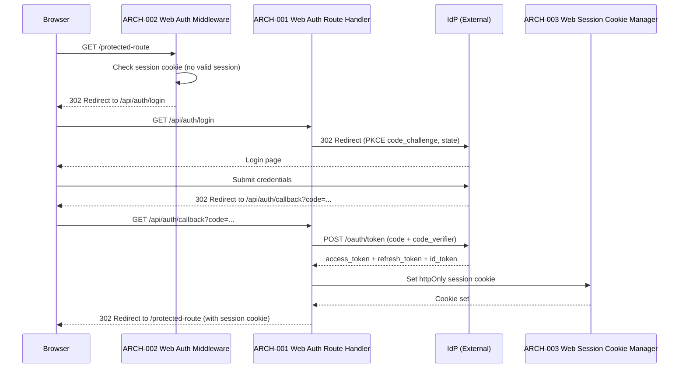
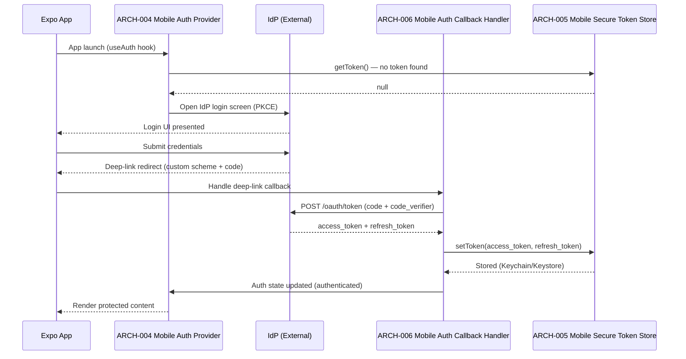
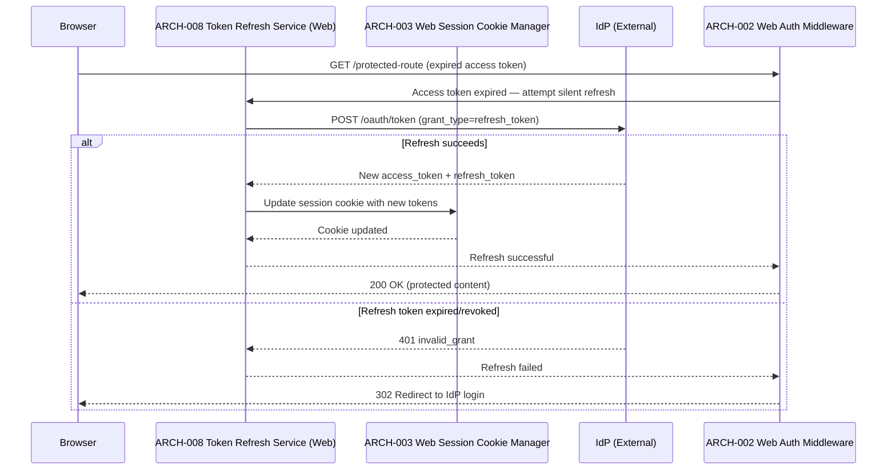
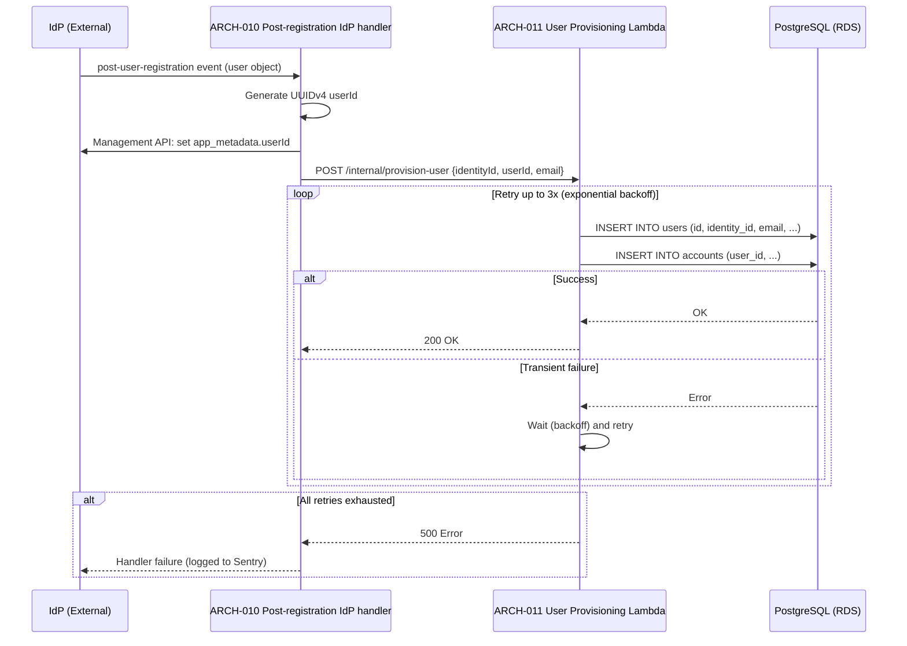
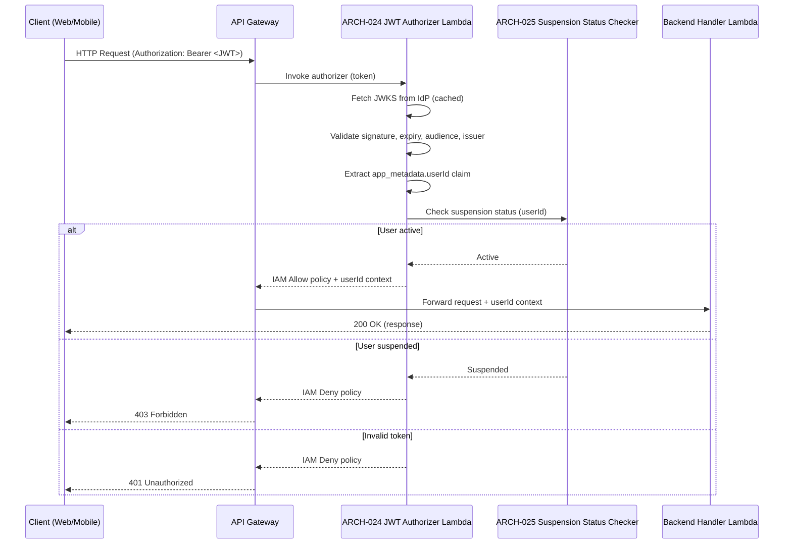

# Architecture Design: User Authentication

**Feature Branch**: `002-user-auth`
**Created**: 2026-05-09
**Status**: Draft
**Source**: `specs/002-user-auth/v-model/system-design.md`

> **Identity-key note (Feature 002 implementation update)**: Architecture details in this draft that mention generated UUID user IDs, `app_metadata.userId`, `identity_id`, `internal_id`, or `legacy_id` are historical and superseded by the implemented sub-keyed model. Current architecture uses IdP `sub` as `users.sub VARCHAR(255) COLLATE "C" PRIMARY KEY`, with M2M-gated post-login upsert and no generated user UUID.

## Overview

The identity provider (IdP) User Authentication architecture decomposes 20 system components into 32 architecture modules organized across four Kruchten 4+1 views. The decomposition separates platform-specific auth clients (web/mobile) from shared backend services, isolates the API Gateway authorizer as a standalone Lambda, and extracts cross-cutting concerns (observability, shared types, CDK infrastructure) into dedicated utility modules. Every SYS-NNN from system-design.md appears as a parent in at least one ARCH-NNN.

## ID Schema

- **Architecture Module**: `ARCH-NNN` — sequential identifier for each module
- **Parent System Components**: Comma-separated `SYS-NNN` list per module (many-to-many)
- **Cross-Cutting Tag**: `[CROSS-CUTTING; rationale: shared infrastructure supports multiple SYS components]` for infrastructure/utility modules not traceable to a specific SYS
- Example: `ARCH-003` with Parent System Components `SYS-001, SYS-004` — module serves both components
- Example: `ARCH-010 [CROSS-CUTTING; rationale: shared infrastructure supports multiple SYS components]` — infrastructure module with rationale

## Logical View — Component Breakdown (IEEE 42010 / Kruchten 4+1)

| ARCH ID  | Name                                 | Description                                                                                                                                                                                                                                                                                                       | Parent System Components | Type      |
| -------- | ------------------------------------ | ----------------------------------------------------------------------------------------------------------------------------------------------------------------------------------------------------------------------------------------------------------------------------------------------------------------- | ------------------------ | --------- |
| ARCH-001 | Web Auth Route Handler               | Next.js App Router middleware powered by `@clerk/nextjs` — `clerkMiddleware()` from `@clerk/nextjs/server`. Handles login redirect to Clerk Hosted UI, post-auth session establishment, and logout. No `/api/auth/[...]` catch-all route is required; Clerk middleware manages redirects directly.                                                                                                                     | SYS-001                  | Component |
| ARCH-002 | Web Auth Middleware Guard            | Next.js middleware that intercepts requests to protected routes, checks for a valid session cookie, and redirects unauthenticated users to the IdP login page.                                                                                                                                                  | SYS-001                  | Component |
| ARCH-003 | Web Session Cookie Manager           | Manages the Clerk `__session` httpOnly cookie written and rotated automatically by the Clerk SDK. Server helpers `auth()` and `currentUser()` from `@clerk/nextjs/server` expose session claims and user data without manual cookie handling.                                                                    | SYS-001                  | Component |
| ARCH-004 | Mobile Auth Provider                 | React context provider using `<ClerkProvider>` from `@clerk/expo` with `tokenCache` backed by `expo-secure-store`. Exposes `useAuth()` and `useUser()` hooks. Detects missing session on app launch and triggers the Clerk Hosted UI login screen automatically.                                                | SYS-002                  | Component |
| ARCH-005 | Mobile Secure Token Store            | Abstraction over `expo-secure-store` for reading/writing access tokens and refresh tokens to iOS Keychain / Android Keystore. Exposes `getToken()`, `setToken()`, `clearTokens()`.                                                                                                                                | SYS-002                  | Component |
| ARCH-006 | Mobile Auth Callback Handler         | Handles the deep-link redirect URI after IdP authorization. Exchanges the authorization code for tokens and stores them via ARCH-005.                                                                                                                                                                           | SYS-002                  | Component |
| ARCH-007 | Social Connection Configurator       | Configures IdP social connections (Google, etc.) in the IdP tenant. Surfaces social login buttons on both web (ARCH-001) and mobile (ARCH-004) login screens.                                                                                                                                                 | SYS-003                  | Component |
| ARCH-008 | Token Refresh Service (Web)          | Clerk issues short-lived JWTs (default 60-second expiry) and refreshes them silently and automatically via the `@clerk/nextjs` SDK — no custom refresh service is required. This module's role is reduced to a session-staleness detector: if `auth()` returns no session after a refresh attempt, it redirects to the Clerk login page.                                                                             | SYS-004, SYS-001         | Service   |
| ARCH-009 | Token Refresh Service (Mobile)       | Clerk issues short-lived JWTs refreshed silently and automatically by the `@clerk/expo` SDK. This module's role is reduced to a session-staleness detector: if `useAuth()` signals a signed-out state after a silent refresh attempt, it clears secure store and triggers re-authentication via `<ClerkProvider>`.                                                                                                 | SYS-004, SYS-002         | Service   |
| ARCH-010 | Post-registration IdP handler        | IdP server-side hook (Node.js 22.x) that fires on `post-user-registration`. Generates UUIDv4, writes it to `app_metadata.userId`, then calls ARCH-011 to provision the Sous Chef user record.                                                                                                                             | SYS-005                  | Service   |
| ARCH-011 | User Provisioning Lambda             | AWS Lambda (Node.js 22.x) that receives calls from ARCH-010. Creates User and Account records in PostgreSQL. Implements retry with exponential backoff (up to 3 attempts).                                                                                                                                        | SYS-005, SYS-006         | Service   |
| ARCH-012 | Reconciliation Lambda                | AWS Lambda (Node.js 22.x) triggered on schedule (EventBridge) or via API endpoint. Fetches IdP user list, compares with Sous Chef DB, and calls ARCH-011 for any missing records.                                                                                                                               | SYS-007                  | Service   |
| ARCH-013 | Profile View Component               | Web + mobile UI component that fetches and displays the authenticated user's display name, email, avatar, and account creation date from the Sous Chef API.                                                                                                                                                       | SYS-008                  | Component |
| ARCH-014 | Account Edit Component               | Web + mobile UI component for editing display name and avatar. Validates non-empty display name client-side. Email field is read-only with a note directing to the IdP.                                                                                                                                             | SYS-009                  | Component |
| ARCH-015 | Account Edit API Handler             | Backend Lambda/NestJS handler for `PATCH /account`. Validates input, persists display name and avatar changes to PostgreSQL.                                                                                                                                                                                      | SYS-009                  | Service   |
| ARCH-016 | Account Deletion Component           | Web + mobile UI component for account deletion. Requires user to type "DELETE" for confirmation before calling the deletion API.                                                                                                                                                                                  | SYS-010                  | Component |
| ARCH-017 | Account Deletion API Handler         | Backend Lambda/NestJS handler for `DELETE /account`. Deletes User/Account records (cascading to user-owned data) from PostgreSQL, then deletes the user from the IdP via Management API.                                                                                                                            | SYS-010                  | Service   |
| ARCH-018 | Password Reset Link Component        | UI component that surfaces a "Forgot Password" link on the login screen. Redirects to the IdP's hosted password reset page. No backend involvement.                                                                                                                                                                 | SYS-011                  | Component |
| ARCH-019 | MFA Enrollment Component             | UI component in account settings that surfaces the IdP's MFA enrollment flow (TOTP). Redirects to the IdP's MFA enrollment page via Management API link.                                                                                                                                                              | SYS-012                  | Component |
| ARCH-020 | Social Account Linking API Handler   | Backend Lambda/NestJS handler for `POST /account/social-link` and `DELETE /account/social-link`. Calls IdP Backend API to link/unlink social providers. Validates at least one provider remains.                                                                                                             | SYS-013                  | Service   |
| ARCH-021 | Social Account Linking Component     | Web + mobile UI component in account settings for linking/unlinking social providers. Displays current linked providers and link/unlink actions.                                                                                                                                                                  | SYS-013                  | Component |
| ARCH-022 | Impersonation Token Exchange Service | Backend service that issues impersonation tokens via IdP token exchange for authorized personnel. Injects impersonation flag and impersonator identity into token claims.                                                                                                                                       | SYS-014                  | Service   |
| ARCH-023 | Impersonation Audit Logger           | Middleware that detects impersonation flag in JWT claims and writes audit log entries (impersonator ID, impersonated user ID, action, timestamp) to CloudWatch Logs.                                                                                                                                              | SYS-014                  | Component |
| ARCH-024 | API Gateway JWT Authorizer Lambda    | AWS Lambda authorizer (Node.js 22.x) using `jwks-rsa` + `jose`. Validates JWT signature, expiry, audience, and issuer. Extracts `app_metadata.userId` custom claim. Returns IAM policy.                                                                                                                           | SYS-015                  | Service   |
| ARCH-025 | Suspension Status Checker            | Module within ARCH-024 that checks the user's suspension status (via IdP `blocked` flag or Sous Chef DB `status` field) and returns a Deny policy for suspended users.                                                                                                                                          | SYS-015, SYS-016         | Component |
| ARCH-026 | User Suspension API Handler          | Backend Lambda/NestJS handler for `POST /admin/users/{id}/suspend` and `POST /admin/users/{id}/reactivate`. Calls IdP Backend API to block/unblock and updates Sous Chef DB `status`.                                                                                                                        | SYS-016                  | Service   |
| ARCH-027 | Structured Logger                    | [CROSS-CUTTING; rationale: shared infrastructure supports multiple SYS components] — Wraps `@aws-lambda-powertools/logger` to emit JSON-structured logs with correlation IDs and ISO 8601 timestamps. Used by all Lambda functions.                                                                               | SYS-017                  | Utility   |
| ARCH-028 | CloudWatch Metrics Emitter           | [CROSS-CUTTING; rationale: shared infrastructure supports multiple SYS components] — Emits custom CloudWatch metrics for auth flow events (login success/failure, token refresh, signup, deletion, reconciliation). Used by all auth backend services.                                                            | SYS-017                  | Utility   |
| ARCH-029 | Sentry Integration Wrapper           | [CROSS-CUTTING; rationale: shared infrastructure supports multiple SYS components] — Wraps `@sentry/aws-serverless` for Lambda error capture and `@sentry/react`/`@sentry/react-native` for client-side breadcrumbs and error events.                                                                             | SYS-017                  | Utility   |
| ARCH-030 | CDK Auth Stack                       | AWS CDK v2 (`aws-cdk-lib`) stack defining all Lambda functions (ARCH-010–ARCH-012, ARCH-015, ARCH-017, ARCH-020, ARCH-022, ARCH-024, ARCH-026), API Gateway, SQS queues, IAM roles, CloudWatch log groups, EventBridge rules, and alarms.                                                                         | SYS-018                  | Utility   |
| ARCH-031 | Shared Auth Types Library            | [CROSS-CUTTING; rationale: shared infrastructure supports multiple SYS components] — TypeScript strict-mode `interface` and `type` definitions for tokens, user records, account records, JWT claims, and API request/response shapes. Shared across all auth workspaces via `@kitchensink/*` path aliases.           | SYS-019                  | Library   |
| ARCH-032 | Custom Auth Error Classes            | [CROSS-CUTTING; rationale: shared infrastructure supports multiple SYS components] — Custom error classes (`AuthSessionExpiredError`, `UserNotFoundError`, `AccountDeletionFailedError`, etc.) extending `Error`, each with a type guard (`isXxxError`). ISO 8601 date fields enforced.                           | SYS-019                  | Library   |
| ARCH-033 | Auth UI Design Tokens Integration    | [CROSS-CUTTING; rationale: shared infrastructure supports multiple SYS components] — Applies shared design system tokens (`--accent-primary`, `--accent-secondary`, semantic status colors) to all auth UI components. Enforces accessible names (`getByRole`/`getByLabel`) and non-color-only status indicators. | SYS-020                  | Library   |

## Process View — Dynamic Behavior (Kruchten 4+1)

### Interaction 1: Web Login Flow (Authorization Code + PKCE)



**Concurrency Model**: Single-threaded Node.js event loop (Next.js serverless function)
**Synchronization Points**: State parameter validated before token exchange to prevent CSRF

---

### Interaction 2: Mobile Login Flow (Authorization Code + PKCE)



**Concurrency Model**: React Native event loop; token storage is async (expo-secure-store)
**Synchronization Points**: Auth state update is atomic via React context dispatch

---

### Interaction 3: Silent Token Refresh (Web)



**Concurrency Model**: Single-threaded serverless; refresh is synchronous within the request lifecycle
**Synchronization Points**: The Clerk `__session` cookie is written atomically by the SDK; no manual lock is required

---

### Interaction 4: Post-Registration User Provisioning



**Concurrency Model**: Post-registration IdP handler runs in isolated Node.js 22.x sandbox; Lambda is single-threaded per invocation
**Synchronization Points**: DB writes are transactional (User + Account in single transaction)

---

### Interaction 5: API Request Authorization



**Concurrency Model**: Lambda per-request; JWKS cached in Lambda memory (warm invocations reuse cache)
**Synchronization Points**: JWKS cache TTL prevents thundering herd on key rotation

## Interface View — API Contracts (Kruchten 4+1)

### ARCH-001: Web Auth Route Handler

| Direction | Name              | Type     | Format                                     | Constraints                                       |
| --------- | ----------------- | -------- | ------------------------------------------ | ------------------------------------------------- |
| Input     | idp route param   | string   | `[...idp]` path segment                    | Must be one of: `login`, `logout`, `callback`     |
| Input     | code              | string   | OAuth 2.0 authorization code (query param) | Required on callback; validated against state     |
| Input     | state             | string   | CSRF state token (query param)             | Required on callback; must match session state    |
| Output    | session cookie    | cookie   | httpOnly, Secure, SameSite=Strict          | Set on successful callback                        |
| Output    | redirect          | HTTP 302 | Location header                            | To app on login success; to IdP on login init   |
| Exception | AuthCallbackError | 400/500  | JSON `{error: string, message: string}`    | On invalid code, state mismatch, or token failure |

### ARCH-002: Web Auth Middleware Guard

| Direction | Name            | Type        | Format                    | Constraints                        |
| --------- | --------------- | ----------- | ------------------------- | ---------------------------------- |
| Input     | request         | NextRequest | HTTP request object       | Inspects cookies for valid session |
| Output    | next()          | void        | Pass-through              | When session is valid              |
| Output    | redirect        | HTTP 302    | Location: /api/auth/login | When no valid session              |
| Exception | MiddlewareError | 500         | Next.js error page        | On unexpected middleware failure   |

### ARCH-003: Web Session Cookie Manager

| Direction | Name            | Type   | Format                               | Constraints                                  |
| --------- | --------------- | ------ | ------------------------------------ | -------------------------------------------- |
| Input     | session data    | object | `{accessToken, refreshToken, user}`  | All fields required; tokens are JWT strings  |
| Output    | getSession()    | object | `{accessToken, refreshToken, user}`  | Returns null if no valid session             |
| Output    | updateSession() | void   | —                                    | Updates cookie in-place                      |
| Exception | SessionError    | Error  | `AuthSessionExpiredError` (ARCH-032) | When session is expired or cookie is invalid |

### ARCH-004: Mobile Auth Provider

| Direction | Name      | Type            | Format                                   | Constraints                              |
| --------- | --------- | --------------- | ---------------------------------------- | ---------------------------------------- |
| Input     | children  | ReactNode       | React component tree                     | Required                                 |
| Output    | useAuth() | object          | `{user, isAuthenticated, login, logout}` | `user` is null when unauthenticated      |
| Output    | login()   | Promise\<void\> | —                                        | Opens IdP login screen                 |
| Output    | logout()  | Promise\<void\> | —                                        | Clears tokens and returns to auth screen |
| Exception | AuthError | Error           | `AuthSessionExpiredError` (ARCH-032)     | On token validation failure              |

### ARCH-005: Mobile Secure Token Store

| Direction | Name             | Type            | Format                               | Constraints                              |
| --------- | ---------------- | --------------- | ------------------------------------ | ---------------------------------------- |
| Input     | key              | string          | Token key identifier                 | One of: `access_token`, `refresh_token`  |
| Input     | value            | string          | JWT string                           | Required for setToken()                  |
| Output    | getToken()       | string \| null  | JWT string or null                   | Returns null if not found                |
| Output    | setToken()       | Promise\<void\> | —                                    | Writes to Keychain/Keystore              |
| Output    | clearTokens()    | Promise\<void\> | —                                    | Clears all auth tokens from secure store |
| Exception | SecureStoreError | Error           | `AuthSessionExpiredError` (ARCH-032) | On Keychain/Keystore access failure      |

### ARCH-006: Mobile Auth Callback Handler

| Direction | Name          | Type   | Format                                        | Constraints                               |
| --------- | ------------- | ------ | --------------------------------------------- | ----------------------------------------- |
| Input     | deep-link URL | string | `sous-chef://auth/callback?code=...`          | Must contain `code` and `state` params    |
| Output    | tokens        | object | `{accessToken: string, refreshToken: string}` | Stored via ARCH-005                       |
| Exception | CallbackError | Error  | `AuthSessionExpiredError` (ARCH-032)          | On invalid code or token exchange failure |

### ARCH-007: Social Connection Configurator

| Direction | Name          | Type   | Format                                      | Constraints                                  |
| --------- | ------------- | ------ | ------------------------------------------- | -------------------------------------------- |
| Input     | provider      | string | `"google"` \| future providers              | Must be a configured IdP social connection |
| Output    | login URL     | string | IdP authorize URL with `connection` param   | Passed to ARCH-001 or ARCH-004               |
| Exception | ProviderError | Error  | JSON `{error: string}`                      | On unsupported or misconfigured provider     |

### ARCH-008: Token Refresh Service (Web)

| Direction | Name         | Type   | Format                                        | Constraints                              |
| --------- | ------------ | ------ | --------------------------------------------- | ---------------------------------------- |
| Input     | session      | object | `{refreshToken: string}`                      | Required; obtained from ARCH-003         |
| Output    | new tokens   | object | `{accessToken: string, refreshToken: string}` | Updated in session cookie via ARCH-003   |
| Exception | RefreshError | Error  | `AuthSessionExpiredError` (ARCH-032)          | When refresh token is expired or revoked |

### ARCH-009: Token Refresh Service (Mobile)

| Direction | Name         | Type   | Format                                        | Constraints                              |
| --------- | ------------ | ------ | --------------------------------------------- | ---------------------------------------- |
| Input     | refreshToken | string | JWT refresh token from ARCH-005               | Required                                 |
| Output    | new tokens   | object | `{accessToken: string, refreshToken: string}` | Stored via ARCH-005                      |
| Exception | RefreshError | Error  | `AuthSessionExpiredError` (ARCH-032)          | When refresh token is expired or revoked |

### ARCH-010: Post-registration IdP handler

| Direction | Name         | Type   | Format                                   | Constraints                               |
| --------- | ------------ | ------ | ---------------------------------------- | ----------------------------------------- |
| Input     | event        | object | IdP `PostUserRegistrationEvent`          | Contains `user.sub`, `user.email`         |
| Input     | api          | object | IdP server-side hook API object          | Used to set `app_metadata`                |
| Output    | app_metadata | object | `{userId: string}` (UUIDv4)              | Written to IdP user profile               |
| Exception | ActionError  | Error  | Logged to Sentry; IdP receives failure   | On provisioning failure after all retries |

### ARCH-011: User Provisioning Lambda

| Direction | Name           | Type     | Format                                                  | Constraints                           |
| --------- | -------------- | -------- | ------------------------------------------------------- | ------------------------------------- |
| Input     | body           | object   | `{identityId: string, userId: string, email: string}`   | All fields required; userId is UUIDv4 |
| Output    | response       | HTTP 200 | `{userId: string}`                                      | On successful User + Account creation |
| Exception | ProvisionError | HTTP 500 | `{error: string}`                                       | After 3 retry attempts exhausted      |

### ARCH-012: Reconciliation Lambda

| Direction | Name           | Type   | Format                                    | Constraints                                      |
| --------- | -------------- | ------ | ----------------------------------------- | ------------------------------------------------ |
| Input     | trigger        | object | EventBridge scheduled event or API call   | Scheduled: cron; API: GET /admin/reconcile       |
| Output    | report         | object | `{repaired: number, failed: number}`      | Emitted to CloudWatch Logs and returned          |
| Exception | ReconcileError | Error  | Logged to Sentry; partial report returned | On IdP API or DB failure during reconciliation |

### ARCH-013: Profile View Component

| Direction | Name         | Type      | Format                                  | Constraints                               |
| --------- | ------------ | --------- | --------------------------------------- | ----------------------------------------- |
| Input     | userId       | string    | UUIDv4 from auth context                | Required; obtained from ARCH-004/ARCH-003 |
| Output    | profile UI   | ReactNode | Displays name, email, avatar, createdAt | All fields sourced from Sous Chef API     |
| Exception | ProfileError | Error     | Error state UI shown                    | On API fetch failure                      |

### ARCH-014: Account Edit Component

| Direction | Name            | Type     | Format                                        | Constraints                     |
| --------- | --------------- | -------- | --------------------------------------------- | ------------------------------- |
| Input     | currentProfile  | object   | `{displayName: string, avatarUrl?: string}`   | Pre-populated from API          |
| Output    | onSave          | function | `(data: {displayName, avatarUrl}) => void`    | Called on valid form submission |
| Exception | ValidationError | Error    | Inline form error: "Display name is required" | When displayName is empty       |

### ARCH-015: Account Edit API Handler

| Direction | Name            | Type     | Format                                      | Constraints                       |
| --------- | --------------- | -------- | ------------------------------------------- | --------------------------------- |
| Input     | body            | object   | `{displayName: string, avatarUrl?: string}` | displayName required, non-empty   |
| Input     | userId          | string   | UUIDv4 from JWT authorizer context          | Injected by ARCH-024              |
| Output    | response        | HTTP 200 | `{displayName: string, avatarUrl?: string}` | Updated account data              |
| Exception | ValidationError | HTTP 400 | `{error: "displayName is required"}`        | When displayName is empty         |
| Exception | NotFoundError   | HTTP 404 | `{error: "Account not found"}`              | When userId has no account record |

### ARCH-016: Account Deletion Component

| Direction | Name         | Type     | Format                                 | Constraints                            |
| --------- | ------------ | -------- | -------------------------------------- | -------------------------------------- |
| Input     | confirmation | string   | User-typed text                        | Must equal `"DELETE"` to enable submit |
| Output    | onConfirm    | function | `() => void`                           | Called when confirmation matches       |
| Exception | ConfirmError | Error    | Inline error: "Type DELETE to confirm" | When confirmation text does not match  |

### ARCH-017: Account Deletion API Handler

| Direction | Name          | Type     | Format                             | Constraints                     |
| --------- | ------------- | -------- | ---------------------------------- | ------------------------------- |
| Input     | userId        | string   | UUIDv4 from JWT authorizer context | Injected by ARCH-024            |
| Output    | response      | HTTP 204 | No content                         | On successful deletion          |
| Exception | DeletionError | HTTP 500 | `{error: string}`                  | On DB or IdP deletion failure |

### ARCH-018: Password Reset Link Component

| Direction | Name | Type      | Format                              | Constraints              |
| --------- | ---- | --------- | ----------------------------------- | ------------------------ |
| Input     | —    | —         | No input required                   | Rendered on login screen |
| Output    | link | ReactNode | Anchor to IdP password reset page   | Opens IdP hosted page    |
| Exception | —    | —         | No exceptions (static link)         | —                        |

### ARCH-019: MFA Enrollment Component

| Direction | Name      | Type      | Format                              | Constraints                               |
| --------- | --------- | --------- | ----------------------------------- | ----------------------------------------- |
| Input     | userId    | string    | UUIDv4 from auth context            | Required to generate MFA enrollment link  |
| Output    | link      | ReactNode | Anchor to IdP MFA enrollment page   | Opens IdP hosted MFA enrollment           |
| Exception | LinkError | Error     | Error state UI shown                | On Management API link generation failure |

### ARCH-020: Social Account Linking API Handler

| Direction | Name              | Type     | Format                                       | Constraints                                     |
| --------- | ----------------- | -------- | -------------------------------------------- | ----------------------------------------------- |
| Input     | body              | object   | `{provider: string, connection: string}`     | Required for link; provider required for unlink |
| Input     | userId            | string   | UUIDv4 from JWT authorizer context           | Injected by ARCH-024                            |
| Output    | response          | HTTP 200 | `{linkedProviders: string[]}`                | Updated list of linked providers                |
| Exception | LastProviderError | HTTP 400 | `{error: "Cannot remove last login method"}` | When unlinking would leave no providers         |

### ARCH-021: Social Account Linking Component

| Direction | Name            | Type     | Format                             | Constraints                    |
| --------- | --------------- | -------- | ---------------------------------- | ------------------------------ |
| Input     | linkedProviders | string[] | List of currently linked providers | Fetched from Sous Chef API     |
| Output    | onLink          | function | `(provider: string) => void`       | Calls ARCH-020 link endpoint   |
| Output    | onUnlink        | function | `(provider: string) => void`       | Calls ARCH-020 unlink endpoint |
| Exception | LinkError       | Error    | Inline error message               | On API failure                 |

### ARCH-022: Impersonation Token Exchange Service

| Direction | Name               | Type     | Format                                                    | Constraints                                    |
| --------- | ------------------ | -------- | --------------------------------------------------------- | ---------------------------------------------- |
| Input     | targetUserId       | string   | UUIDv4 of user to impersonate                             | Required; caller must have impersonation scope |
| Input     | impersonatorId     | string   | UUIDv4 of the impersonating user                          | Required; extracted from caller's JWT          |
| Output    | token              | string   | JWT with `impersonation: true` claim and `impersonatorId` | Valid for one session                          |
| Exception | ImpersonationError | HTTP 403 | `{error: "Impersonation not authorized"}`                 | When caller lacks impersonation scope          |

### ARCH-023: Impersonation Audit Logger

| Direction | Name       | Type   | Format                                                          | Constraints                  |
| --------- | ---------- | ------ | --------------------------------------------------------------- | ---------------------------- |
| Input     | JWT claims | object | `{impersonation: boolean, impersonatorId: string, sub: string}` | Extracted from validated JWT |
| Output    | audit log  | JSON   | `{impersonatorId, impersonatedId, action, timestamp}`           | Written to CloudWatch Logs   |
| Exception | LogError   | Error  | Logged to Sentry; request continues                             | On CloudWatch write failure  |

### ARCH-024: API Gateway JWT Authorizer Lambda

| Direction | Name               | Type        | Format                           | Constraints                                     |
| --------- | ------------------ | ----------- | -------------------------------- | ----------------------------------------------- |
| Input     | authorizationToken | string      | `Bearer <JWT>`                   | Required; extracted from Authorization header   |
| Input     | methodArn          | string      | API Gateway method ARN           | Required for IAM policy generation              |
| Output    | policy             | object      | IAM policy document (Allow/Deny) | Includes `context.userId` on Allow              |
| Exception | AuthorizerError    | Deny policy | IAM Deny returned                | On any validation failure (invalid/expired JWT) |

### ARCH-025: Suspension Status Checker

| Direction | Name        | Type   | Format                             | Constraints                                |
| --------- | ----------- | ------ | ---------------------------------- | ------------------------------------------ |
| Input     | userId      | string | UUIDv4 from JWT claims             | Required                                   |
| Output    | status      | string | `"active"` \| `"suspended"`        | Checked against IdP `blocked` flag or DB |
| Exception | StatusError | Error  | Defaults to Deny on lookup failure | On IdP Backend API or DB failure         |

### ARCH-026: User Suspension API Handler

| Direction | Name          | Type     | Format                             | Constraints                                 |
| --------- | ------------- | -------- | ---------------------------------- | ------------------------------------------- |
| Input     | userId        | string   | UUIDv4 path parameter              | Required                                    |
| Input     | action        | string   | `"suspend"` \| `"reactivate"`      | Required; determines block/unblock in IdP |
| Output    | response      | HTTP 200 | `{userId: string, status: string}` | Updated user status                         |
| Exception | NotFoundError | HTTP 404 | `{error: "User not found"}`        | When userId has no record                   |

### ARCH-027: Structured Logger

| Direction | Name      | Type   | Format                                  | Constraints                                   |
| --------- | --------- | ------ | --------------------------------------- | --------------------------------------------- |
| Input     | message   | string | Log message                             | Required                                      |
| Input     | context   | object | `{correlationId: string, ...metadata}`  | correlationId required; ISO 8601 timestamps   |
| Output    | log entry | JSON   | Structured JSON to CloudWatch Logs      | All fields serialized; no circular references |
| Exception | LogError  | Error  | Silently swallowed; fallback to console | On CloudWatch write failure                   |

### ARCH-028: CloudWatch Metrics Emitter

| Direction | Name        | Type   | Format                                    | Constraints                          |
| --------- | ----------- | ------ | ----------------------------------------- | ------------------------------------ |
| Input     | metricName  | string | e.g., `LoginSuccess`, `TokenRefreshFail`  | Must be a defined metric name        |
| Input     | dimensions  | object | `{environment: string, platform: string}` | Required for all metrics             |
| Output    | metric      | void   | CloudWatch PutMetricData call             | Emitted asynchronously; non-blocking |
| Exception | MetricError | Error  | Logged to ARCH-027; request continues     | On CloudWatch API failure            |

### ARCH-029: Sentry Integration Wrapper

| Direction | Name        | Type   | Format                                    | Constraints                     |
| --------- | ----------- | ------ | ----------------------------------------- | ------------------------------- |
| Input     | error       | Error  | Any Error subclass                        | Required for captureException() |
| Input     | context     | object | `{userId?, correlationId?, breadcrumbs?}` | Optional; enriches Sentry issue |
| Output    | sentryEvent | void   | Sentry issue created                      | Async; non-blocking             |
| Exception | SentryError | Error  | Silently swallowed; logged to console     | On Sentry SDK failure           |

### ARCH-030: CDK Auth Stack

| Direction | Name                    | Type   | Format                                  | Constraints                            |
| --------- | ----------------------- | ------ | --------------------------------------- | -------------------------------------- |
| Input     | env                     | object | `{account: string, region: string}`     | Required for stack synthesis           |
| Input     | config                  | object | IdP domain, client IDs, DB connection   | Sourced from SSM Parameter Store       |
| Output    | CloudFormation template | JSON   | CDK-synthesized CloudFormation stack    | Deployed via `cdk deploy`              |
| Exception | SynthError              | Error  | CDK synthesis failure with stack trace  | On missing config or invalid construct |

### ARCH-031: Shared Auth Types Library

| Direction | Name  | Type                        | Format                                 | Constraints                                   |
| --------- | ----- | --------------------------- | -------------------------------------- | --------------------------------------------- |
| Input     | —     | —                           | TypeScript source (compile-time only)  | No runtime input                              |
| Output    | types | TypeScript interfaces/types | Exported via `@kitchensink/*` path aliases | strict: true; no `any`; ISO 8601 date strings |
| Exception | —     | —                           | TypeScript compile error               | On type violation                             |

### ARCH-032: Custom Auth Error Classes

| Direction | Name           | Type           | Format                          | Constraints                               |
| --------- | -------------- | -------------- | ------------------------------- | ----------------------------------------- |
| Input     | message        | string         | Error message                   | Required                                  |
| Input     | cause?         | Error          | Underlying error                | Optional; for error chaining              |
| Output    | error instance | Error subclass | `{name, message, cause, stack}` | Each class has a corresponding type guard |
| Exception | —              | —              | N/A — these ARE the exceptions  | —                                         |

### ARCH-033: Auth UI Design Tokens Integration

| Direction | Name              | Type      | Format                               | Constraints                                     |
| --------- | ----------------- | --------- | ------------------------------------ | ----------------------------------------------- |
| Input     | —                 | —         | CSS custom properties (compile-time) | No runtime input                                |
| Output    | styled components | ReactNode | Auth UI with design system tokens    | No hard-coded colors; accessible names required |
| Exception | —                 | —         | CSS/lint error                       | On hard-coded color or missing accessible name  |

## Data Flow View — Data Transformation Chains (Kruchten 4+1)

### Flow 1: Web Login — Authorization Code to Session Cookie

```
[IdP] → authorization_code (query param)
  → ARCH-001 (Web Auth Route Handler): code exchange via /oauth/token
  → {access_token: JWT, refresh_token: JWT, id_token: JWT}
  → ARCH-003 (Web Session Cookie Manager): serialize to encrypted cookie
  → httpOnly session cookie (browser)
```

**Intermediate formats**:

- IdP callback: `?code=<string>&state=<string>`
- Token response: `{access_token, refresh_token, id_token, expires_in}`
- Session cookie: encrypted `__session` cookie (managed automatically by `@clerk/nextjs`)

---

### Flow 2: Mobile Login — Authorization Code to Secure Store

```
[IdP] → authorization_code (deep-link URI)
  → ARCH-006 (Mobile Auth Callback Handler): code exchange via /oauth/token
  → {access_token: JWT, refresh_token: JWT}
  → ARCH-005 (Mobile Secure Token Store): write to Keychain/Keystore
  → ARCH-004 (Mobile Auth Provider): update React context (isAuthenticated: true)
```

**Intermediate formats**:

- Deep-link: `sous-chef://auth/callback?code=<string>&state=<string>`
- Token response: `{access_token, refresh_token, expires_in}`
- Secure store: key-value pairs in OS secure storage

---

### Flow 3: Post-Registration — IdP Event to Database Records

```
[IdP post-user-registration event]
  → ARCH-010 (Post-registration IdP handler): generate UUIDv4, set app_metadata
  → {identityId: string, userId: UUIDv4, email: string}
  → ARCH-011 (User Provisioning Lambda): INSERT User + Account
  → PostgreSQL: users table + accounts table
```

**Intermediate formats**:

- IdP server-side hook event: `PostUserRegistrationEvent` (IdP SDK type)
- Provisioning request: `{identityId, userId, email}` (JSON over HTTPS)
- DB records: `users(id, identity_id, email, status, created_at)` + `accounts(id, user_id, ...)`

---

### Flow 4: API Request — JWT to Authorized Handler Context

```
[Client] → Authorization: Bearer <JWT>
  → ARCH-024 (JWT Authorizer Lambda): validate JWT (JWKS)
  → {userId: UUIDv4, sub: string, impersonation?: boolean}
  → ARCH-025 (Suspension Status Checker): check status
  → IAM Allow policy + {userId} context
  → [Backend Handler Lambda]: receives userId in requestContext
```

**Intermediate formats**:

- JWT: Base64url-encoded header.payload.signature
- JWKS: JSON Web Key Set (fetched from IdP, cached in Lambda memory)
- IAM policy: `{principalId, policyDocument: {Statement: [{Effect, Action, Resource}]}, context: {userId}}`

---

### Flow 5: Account Deletion — Confirmation to Full Cascade

```
[User types "DELETE"] → ARCH-016 (Deletion Component): validate confirmation
  → DELETE /account (with Bearer JWT)
  → ARCH-024 (JWT Authorizer): validate + extract userId
  → ARCH-017 (Account Deletion Handler):
      1. DELETE FROM accounts WHERE user_id = userId (cascade to user-owned data)
      2. DELETE FROM users WHERE id = userId
      3. IdP Backend API: DELETE /api/v2/users/{identityId}
  → ARCH-001/ARCH-004: logout (clear session/tokens)
  → [Auth screen]
```

**Intermediate formats**:

- Confirmation: `{confirmation: "DELETE"}` (request body)
- DB cascade: PostgreSQL ON DELETE CASCADE on foreign keys
- IdP deletion: Management API `DELETE /api/v2/users/{identityId}`

---

## SYS↔ARCH Traceability Matrix

| SYS ID  | SYS Name                          | ARCH Modules                 |
| ------- | --------------------------------- | ---------------------------- |
| SYS-001 | Web Auth Client (Next.js)         | ARCH-001, ARCH-002, ARCH-003 |
| SYS-002 | Mobile Auth Client (Expo)         | ARCH-004, ARCH-005, ARCH-006 |
| SYS-003 | Social Login Provider             | ARCH-007                     |
| SYS-004 | Token Refresh Handler             | ARCH-008, ARCH-009           |
| SYS-005 | Post-Registration IdP Handler     | ARCH-010, ARCH-011           |
| SYS-006 | User/Account Provisioning Service | ARCH-011                     |
| SYS-007 | Reconciliation Job                | ARCH-012                     |
| SYS-008 | Profile View                      | ARCH-013                     |
| SYS-009 | Account Edit Handler              | ARCH-014, ARCH-015           |
| SYS-010 | Account Deletion Handler          | ARCH-016, ARCH-017           |
| SYS-011 | Password Reset Flow               | ARCH-018                     |
| SYS-012 | MFA Enrollment Flow               | ARCH-019                     |
| SYS-013 | Social Account Linking            | ARCH-020, ARCH-021           |
| SYS-014 | User Impersonation                | ARCH-022, ARCH-023           |
| SYS-015 | API Gateway JWT Authorizer        | ARCH-024, ARCH-025           |
| SYS-016 | User Suspension/Reactivation      | ARCH-025, ARCH-026           |
| SYS-017 | Observability & Logging           | ARCH-027, ARCH-028, ARCH-029 |
| SYS-018 | CDK Infrastructure Stack          | ARCH-030                     |
| SYS-019 | Shared Auth Types & Error Classes | ARCH-031, ARCH-032           |
| SYS-020 | Auth UI Design System Integration | ARCH-033                     |

---

## Coverage Summary

| Metric                                                                                                       | Count                                                                                                          |
| ------------------------------------------------------------------------------------------------------------ | -------------------------------------------------------------------------------------------------------------- |
| Total Architecture Modules (ARCH)                                                                            | 33                                                                                                             |
| Total System Components (SYS) covered                                                                        | 20 / 20                                                                                                        |
| Cross-cutting modules (`[CROSS-CUTTING; rationale: shared infrastructure supports multiple SYS components]`) | 4 (ARCH-027, ARCH-028, ARCH-029, ARCH-033)                                                                     |
| Derived modules (`[DERIVED MODULE]`)                                                                         | 0                                                                                                              |
| SYS with multiple ARCH children                                                                              | 9 (SYS-001, SYS-002, SYS-004, SYS-005, SYS-009, SYS-010, SYS-013, SYS-014, SYS-015, SYS-016, SYS-017, SYS-019) |
| ARCH with multiple SYS parents                                                                               | 2 (ARCH-011: SYS-005+SYS-006; ARCH-025: SYS-015+SYS-016)                                                       |
| Process View sequence diagrams                                                                               | 5                                                                                                              |
| Data Flow chains                                                                                             | 5                                                                                                              |

## Physical View — Deployment Topology

The feature deploys within the Sous Chef AWS/serverless topology. Client-facing web/mobile modules run in their respective application packages. Backend API, worker, queue, database, cache, storage, observability, and infrastructure modules deploy to the configured AWS account and region. Each ARCH module maps to the runtime described in the Logical View and the package/source paths listed in the Development View.

## Development View — Source Organization

Implementation modules are organized by platform and service boundary: web code under Next.js application packages, mobile code under Expo packages, backend services under API/Lambda packages, shared contracts under shared TypeScript packages, and infrastructure under CDK/IaC packages. This view constrains ownership, build boundaries, and deployment units for every ARCH-NNN module listed above.

## Scenarios — Architecture Validation

Primary scenarios validate the 4+1 architecture: successful request flow through user-facing entrypoints, dependency failure propagation through process boundaries, data persistence and retrieval through storage boundaries, and deployment/change isolation through development-view package ownership. Each scenario traces back to the SYS coverage listed on ARCH rows.
