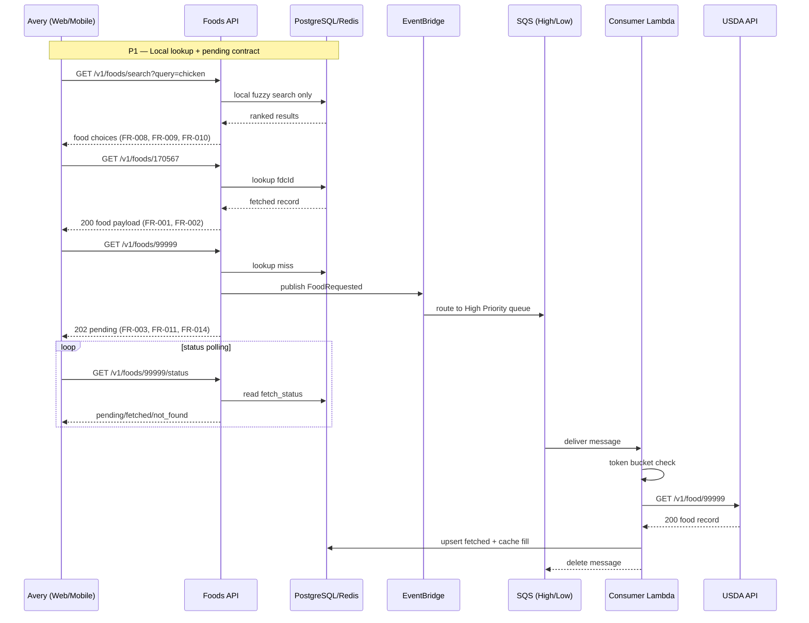
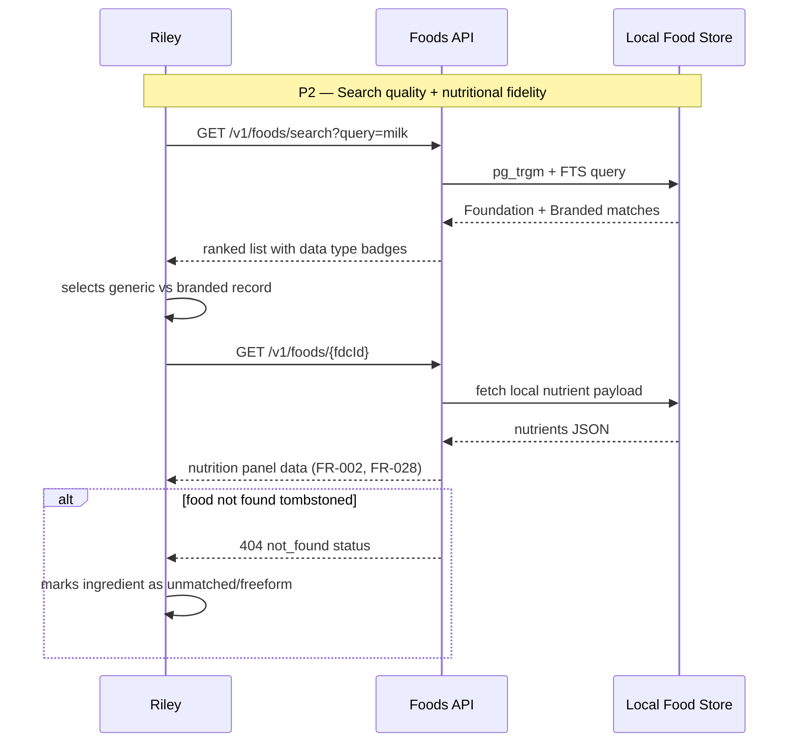
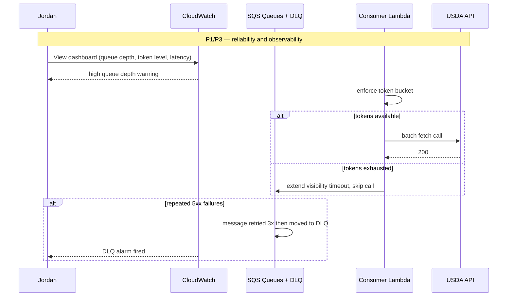

# User Journeys: USDA Food Data Integration

**Branch**: `003-usda-food-data`
**Date**: 2026-05-09
**Status**: Draft
**Source**: [product-spec.md](./product-spec.md), [spec.md](../spec.md)

---

## Journey Notation

Each journey covers one end-to-end flow per persona. Steps reference FR IDs in brackets. P1/P2/P3 markers correspond to story priority from spec.md.

---

## Persona 1: Recipe Author (Avery) — Journey A: Add Ingredient with Mixed Cache State

**Scenario**: Avery creates a recipe with multiple ingredients. Some foods are already fetched locally; some are unknown and must be queued.

---

## Persona 2: Nutrition-Conscious Planner (Riley) — Journey B: Disambiguate and Validate Nutrition

**Scenario**: Riley chooses between branded and generic foods, monitors nutrient values, and handles missing/unavailable records without breaking planning.

---

## Persona 3: Operations Engineer (Jordan) — Journey C: Maintain Pipeline Reliability Under Load

**Scenario**: Jordan monitors queue pressure and USDA constraints during a spike in uncached food requests.

---

## Cross-Persona Flows

### Flow X1: Pending → Fetched Transition

1. Client receives `202 pending` (FR-003).
2. Background consumer fetches/upserts (FR-024).
3. Status endpoint transitions to `fetched` (FR-033).

### Flow X2: Not Found Tombstone

1. USDA returns 404 (FR-025).
2. Local record marked `not_found`.
3. Future lookups return 404 immediately without requeue (FR-005).

### Flow X3: Rate-Limit Delay Handling

1. Token bucket depleted (FR-019..FR-021).
2. Consumer pauses processing and preserves message retry path.
3. UI remains accurate through pending status rather than timeout/failure mislabeling.

---

## Journey Coverage Matrix

| Story                       | Journey A | Journey B | Journey C   | Cross Flows |
| --------------------------- | --------- | --------- | ----------- | ----------- |
| US-001 Cache-hit lookup     | ✅        | ✅        | —           | —           |
| US-002 Async backfill       | ✅        | —         | ✅          | X1          |
| US-003 Rate limiting        | —         | —         | ✅          | X3          |
| US-004 Batch lookup         | ✅        | —         | ✅          | —           |
| US-005 Queue priority + DLQ | ✅        | —         | ✅          | X2/X3       |
| US-006 Local search         | ✅        | ✅        | —           | —           |
| US-007 Stale refresh        | —         | ✅        | ✅          | —           |
| US-008 Polling status       | ✅        | ✅        | —           | X1/X2       |
| US-009 WebSocket (optional) | —         | —         | ⚪ Deferred | —           |
| US-010 Observability        | —         | —         | ✅          | X3          |
