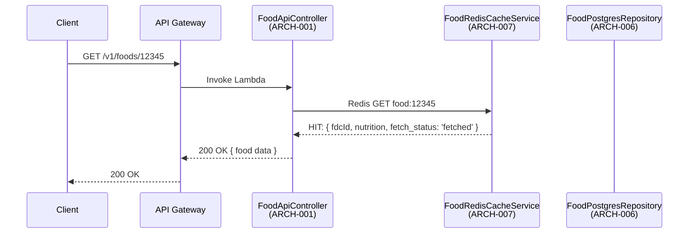
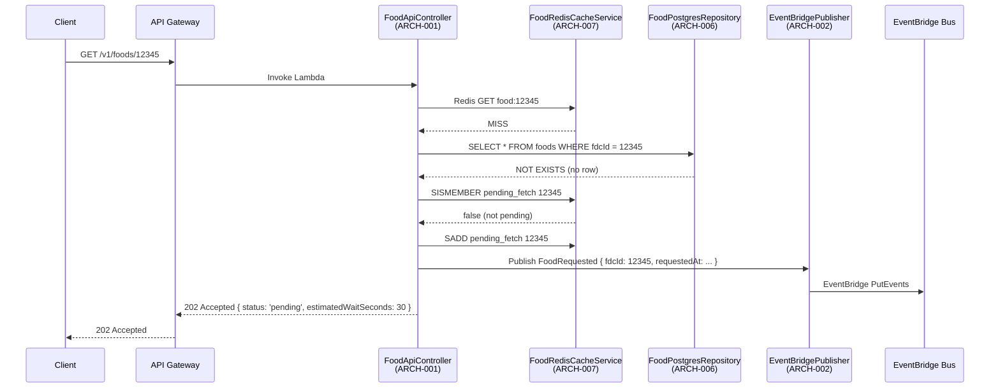
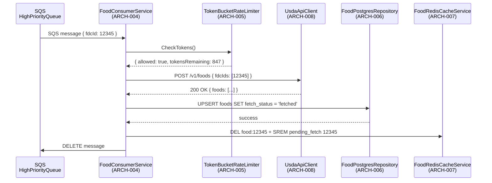
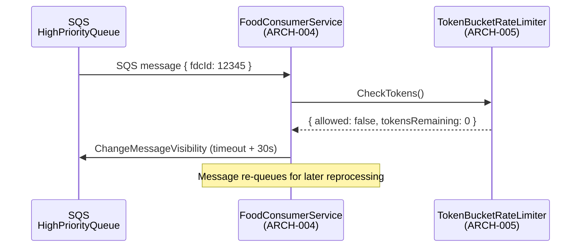
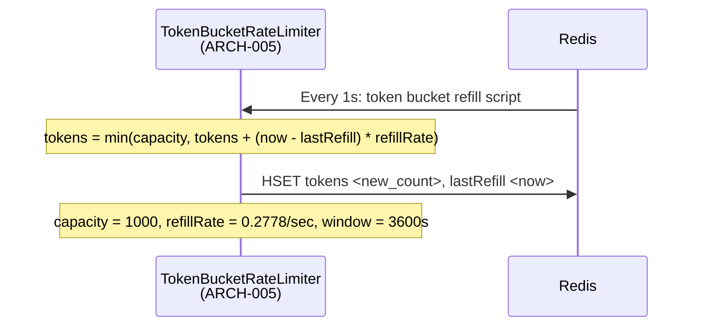

# Architecture Design: USDA Food Data Integration

**Feature Branch**: `003-usda-food-data`
**Created**: 2026-05-09
**Status**: Draft
**Source**: `specs/003-usda-food-data/v-model/system-design.md`

## Overview

The architecture decomposes the USDA food data integration into 11 software modules (ARCH-001 through ARCH-011) mapped to 12 system components. User-facing food lookups are served exclusively from local storage (PostgreSQL + optional Redis) — the USDA API is never called in the request path. Cache misses trigger an event-driven backfill pipeline: API Lambda → EventBridge → SQS (high/low priority) → Consumer Lambda → USDA API → PostgreSQL/Redis. A Redis token-bucket rate-limiter caps USDA API usage at 1,000 calls/hour.

## ID Schema

- **Architecture Module**: `ARCH-NNN` — sequential identifier for each module
- **Parent System Components**: Comma-separated `SYS-NNN` list per module (many-to-many)
- **Cross-Cutting Tag**: `[CROSS-CUTTING; rationale: shared infrastructure supports multiple SYS components]` for infrastructure/utility modules not traceable to a specific SYS
- Example: `ARCH-005 [CROSS-CUTTING; rationale: shared infrastructure supports multiple SYS components]` — infrastructure module (rate limiter) with rationale

## Logical View — Component Breakdown (IEEE 42010 / Kruchten 4+1)

| ARCH ID  | Name                   | Description                                                                                                                                                                                                                               | Parent System Components                                                                   | Type      |
| -------- | ---------------------- | ----------------------------------------------------------------------------------------------------------------------------------------------------------------------------------------------------------------------------------------- | ------------------------------------------------------------------------------------------ | --------- |
| ARCH-001 | FoodApiController      | API Gateway Lambda handler. Validates fdcId, queries local store (Redis then PostgreSQL), returns 200/202/404/400. Emits FoodRequested events to EventBridge on cache miss. Never calls USDA API directly.                                | SYS-001                                                                                    | Component |
| ARCH-002 | EventBridgePublisher   | Publishes FoodRequested and FoodBatchRequested events to EventBridge default bus. Performs input validation on event payload before publish. Routes to correct queue target based on event type.                                          | SYS-002                                                                                    | Component |
| ARCH-003 | SqsQueueRouter         | Internal router module within EventBridge rules. Routes high-priority individual lookups to HighPriorityQueue and batch/periodic events to LowPriorityQueue. Handles DLQ configuration for each queue.                                    | SYS-002, SYS-003, SYS-004                                                                  | Component |
| ARCH-004 | FoodConsumerService    | Lambda function consuming from both SQS queues. Calls USDA API via token-bucket rate limiter, writes results to PostgreSQL, invalidates Redis cache, publishes FoodDataReceived events. Handles retries with exponential backoff.         | SYS-005                                                                                    | Component |
| ARCH-005 | TokenBucketRateLimiter | Redis Lua script implementing atomic token-bucket. Allows exactly 1,000 USDA API calls per hour, atomically checking and decrementing tokens on every Consumer Lambda invocation. Refills tokens continuously (approx 0.2778 per second). | SYS-006 [CROSS-CUTTING; rationale: shared infrastructure supports multiple SYS components] | Utility   |
| ARCH-006 | FoodPostgresRepository | Drizzle ORM repository for foods table. Handles all PostgreSQL operations: lookup by fdcId, upsert on fetch, status updates, search queries with full-text index. Manages fetch_status field lifecycle.                                   | SYS-007                                                                                    | Component |
| ARCH-007 | FoodRedisCacheService  | Redis client for hot cache (food:\* keys, TTL 24h) and pending-fetch deduplication (pending_fetch set). Provides cache-through and cache-invalidate operations. Falls through to PostgreSQL on Redis miss.                                | SYS-008                                                                                    | Component |
| ARCH-008 | UsdaApiClient          | HTTP client for USDA FoodData Central API. Handles authentication (API key from Secrets Manager via env var), batch requests (up to 20 IDs per call), response parsing, and error classification.                                         | SYS-009                                                                                    | Adapter   |
| ARCH-009 | WebSocketNotifier      | EventBridge target for FoodDataReceived events. Lambda that pushes real-time notifications to connected clients via API Gateway WebSocket API. Optional — launch deferred (US-9).                                                         | SYS-010 [CROSS-CUTTING; rationale: shared infrastructure supports multiple SYS components] | Component |
| ARCH-010 | SecretManager          | AWS Secrets Manager integration. Retrieves and caches USDA API key. Handles rotation triggers. Inject as Lambda environment variable — never exposed in logs or responses.                                                                | SYS-011 [CROSS-CUTTING; rationale: shared infrastructure supports multiple SYS components] | Utility   |
| ARCH-011 | MonitoringLogger       | CloudWatch logging + X-Ray tracing for API and Consumer Lambdas. Structured JSON logs with requestId correlation. Metrics: latency histogram, error rate, queue depth, token bucket utilization.                                          | SYS-012 [CROSS-CUTTING; rationale: shared infrastructure supports multiple SYS components] | Utility   |

## Process View — Dynamic Behavior (Kruchten 4+1)

### Interaction 1: Food Lookup (Cache Hit)



### Interaction 2: Food Lookup (Cache Miss → Async Backfill)



### Interaction 3: Consumer Lambda Processing



### Interaction 4: Rate Limiter Block



### Interaction 5: Token Bucket Refill



## Interface View (IEEE 1016 §5.3)

### ARCH-001 (FoodApiController)

| Operation                         | Input                 | Output                                                               | Errors                    |
| --------------------------------- | --------------------- | -------------------------------------------------------------------- | ------------------------- |
| `GET /v1/foods/{fdcId}`           | fdcId (path, numeric) | 200: FoodData, 202: PendingData, 404: NotFound, 400: ValidationError | 400: invalid fdcId format |
| `GET /v1/foods/search?query=`     | query (path, string)  | 200: FoodSearchResult[]                                              | 400: query too short      |
| `GET /v1/foods/{fdcId}/status`    | fdcId (path)          | 200: { status, foodData? }                                           | 400, 404                  |
| `GET /v1/foods/{fdcId}/nutrition` | fdcId (path)          | 200: NutritionData                                                   | 400, 404, 503             |

### ARCH-002 (EventBridgePublisher)

| Operation                           | Input                                       | Output                | Errors                 |
| ----------------------------------- | ------------------------------------------- | --------------------- | ---------------------- |
| `publishFoodRequested(fdcId)`       | `{ fdcId: number, requestedAt: string }`    | `{ eventId: string }` | EventBridge throttling |
| `publishFoodBatchRequested(fdcIds)` | `{ fdcIds: number[], requestedAt: string }` | `{ eventId: string }` | EventBridge throttling |

### ARCH-003 (SqsQueueRouter)

| Operation                           | Input       | Output             | Errors            |
| ----------------------------------- | ----------- | ------------------ | ----------------- |
| `routeToHighPriorityQueue(message)` | SQS message | Delivery confirmed | Queue unavailable |
| `routeToLowPriorityQueue(message)`  | SQS message | Delivery confirmed | Queue unavailable |

### ARCH-004 (FoodConsumerService)

| Operation                         | Input               | Output               | Errors             |
| --------------------------------- | ------------------- | -------------------- | ------------------ |
| `processHighPriorityMessage(msg)` | SQS message         | DELETE on success    | Retry with backoff |
| `processLowPriorityMessage(msg)`  | SQS message         | DELETE on success    | Retry with backoff |
| `fetchFromUsda(fdcIds)`           | `number[]` (max 20) | `USDAFoodResponse[]` | USDA API errors    |

### ARCH-005 (TokenBucketRateLimiter)

| Operation       | Input | Output                                          | Errors            |
| --------------- | ----- | ----------------------------------------------- | ----------------- |
| `checkTokens()` | none  | `{ allowed: boolean, tokensRemaining: number }` | Redis unavailable |
| `getWaitTime()` | none  | `number` (seconds until next token)             | Redis unavailable |

### ARCH-006 (FoodPostgresRepository)

| Operation                          | Input            | Output                 | Errors           |
| ---------------------------------- | ---------------- | ---------------------- | ---------------- |
| `findByFdcId(fdcId)`               | `number`         | `FoodData \| null`     | Connection error |
| `upsertFood(food)`                 | `FoodData`       | `{ success: boolean }` | Connection error |
| `updateFetchStatus(fdcId, status)` | `number, string` | `{ success: boolean }` | Connection error |
| `searchFoods(query)`               | `string`         | `FoodData[]`           | Connection error |

### ARCH-007 (FoodRedisCacheService)

| Operation               | Input                      | Output             | Errors            |
| ----------------------- | -------------------------- | ------------------ | ----------------- |
| `get(fdcId)`            | `number`                   | `FoodData \| null` | Redis unavailable |
| `set(fdcId, data, ttl)` | `number, FoodData, number` | `void`             | Redis unavailable |
| `invalidate(fdcId)`     | `number`                   | `void`             | Redis unavailable |
| `isPending(fdcId)`      | `number`                   | `boolean`          | Redis unavailable |
| `markPending(fdcId)`    | `number`                   | `void`             | Redis unavailable |
| `clearPending(fdcId)`   | `number`                   | `void`             | Redis unavailable |

### ARCH-008 (UsdaApiClient)

| Operation            | Input               | Output               | Errors                                                 |
| -------------------- | ------------------- | -------------------- | ------------------------------------------------------ |
| `fetchFoods(fdcIds)` | `number[]` (max 20) | `USDAFoodResponse[]` | 401: invalid key, 429: rate limited, 500: server error |

### ARCH-009 (WebSocketNotifier)

| Operation                    | Input                                   | Output                    | Errors                                       |
| ---------------------------- | --------------------------------------- | ------------------------- | -------------------------------------------- |
| `notifyClients(fdcId, data)` | `{ fdcId: number, foodData: FoodData }` | `number` clients notified | WebSocket connection error (fire-and-forget) |

### ARCH-010 (SecretManager)

| Operation         | Input | Output                 | Errors           |
| ----------------- | ----- | ---------------------- | ---------------- |
| `getUsdaApiKey()` | none  | `string`               | Secret not found |
| `rotateKey()`     | none  | `{ success: boolean }` | Rotation failed  |

### ARCH-011 (MonitoringLogger)

| Operation                            | Input               | Output            | Errors           |
| ------------------------------------ | ------------------- | ----------------- | ---------------- |
| `logRequest(reqId, event, duration)` | structured JSON     | CloudWatch log    | Logging disabled |
| `incrementMetric(name, value)`       | metric name + value | CloudWatch metric | Metrics disabled |
| `startTrace(reqId)`                  | `string`            | `Segment`         | Tracing disabled |

## Data Flow View (IEEE 1016 §5.4)

### Data Flow 1: Food Lookup → Cache Hit

```
Client Request
    ↓ (API Gateway)
ARCH-001 FoodApiController
    ↓ Redis GET food:{fdcId}
ARCH-007 FoodRedisCacheService [HIT]
    ↓ return food data
ARCH-001 → 200 OK
    ↓
Client Response
```

### Data Flow 2: Food Lookup → Cache Miss → DB Miss → Async Backfill

```
Client Request
    ↓
ARCH-001 (validates fdcId format)
    ↓ Redis MISS
ARCH-007
    ↓ PostgreSQL MISS (no row)
ARCH-006
    ↓ Redis not pending
ARCH-007 SADD pending_fetch
    ↓ EventBridge publish
ARCH-002 EventBridgePublisher → EventBridge Bus
    ↓ route to HighPriorityQueue
ARCH-003 SqsQueueRouter → SQS HighPriorityQueue
    ↓
202 Accepted to Client (polls /status)
```

### Data Flow 3: Consumer Lambda → USDA → PostgreSQL

```
SQS HighPriorityQueue message
    ↓
ARCH-004 FoodConsumerService
    ↓ check rate limit
ARCH-005 TokenBucketRateLimiter [allowed]
    ↓ HTTP POST /v1/foods
ARCH-008 UsdaApiClient → USDA API
    ↓ parse response
ARCH-004
    ↓ UPSERT
ARCH-006 FoodPostgresRepository → PostgreSQL
    ↓ invalidate cache + clear pending
ARCH-007 FoodRedisCacheService
    ↓ publish event
ARCH-002 → EventBridge FoodDataReceived
    ↓
SQS DELETE message
```

### Data Flow 4: Rate Limited (tokens exhausted)

```
SQS message
    ↓
ARCH-004
    ↓ TokenBucket check
ARCH-005 [tokens = 0, not allowed]
    ↓ ChangeMessageVisibility (30s backoff)
SQS queue → re-visibility after backoff
    ↓ (later reprocess when tokens refill)
ARCH-004 resumes
```

## Cross-Cutting Architecture Notes

- **Token bucket**: All USDA API calls from ARCH-004 MUST go through ARCH-005. No direct USDA API calls allowed.
- **No USDA in request path**: ARCH-001 strictly reads from ARCH-007 or ARCH-006. It never calls ARCH-008.
- **Deduplication**: ARCH-007's `pending_fetch` Redis set prevents duplicate SQS messages for the same food under concurrent load.
- **Secret rotation**: ARCH-010 handles rotation; key injected as env var to ARCH-004 and ARCH-008 at cold start.
- **Optional WebSocket**: ARCH-009 is launch-deferred. EventBridge rule for FoodDataReceived targets nothing until US-9 is implemented.

## Physical View — Deployment Topology

The feature deploys within the Commise AWS/serverless topology. Client-facing web/mobile modules run in their respective application packages. Backend API, worker, queue, database, cache, storage, observability, and infrastructure modules deploy to the configured AWS account and region. Each ARCH module maps to the runtime described in the Logical View and the package/source paths listed in the Development View.

## Development View — Source Organization

Implementation modules are organized by platform and service boundary: web code under Next.js application packages, mobile code under Expo packages, backend services under API/Lambda packages, shared contracts under shared TypeScript packages, and infrastructure under CDK/IaC packages. This view constrains ownership, build boundaries, and deployment units for every ARCH-NNN module listed above.

## Scenarios — Architecture Validation

Primary scenarios validate the 4+1 architecture: successful request flow through user-facing entrypoints, dependency failure propagation through process boundaries, data persistence and retrieval through storage boundaries, and deployment/change isolation through development-view package ownership. Each scenario traces back to the SYS coverage listed on ARCH rows.
