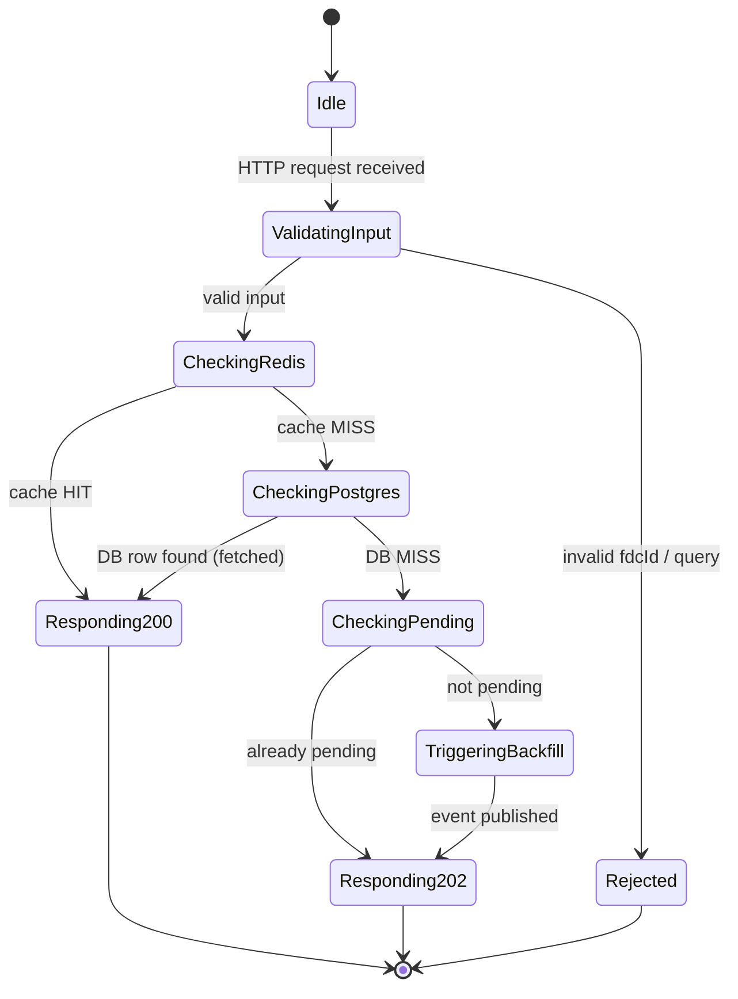
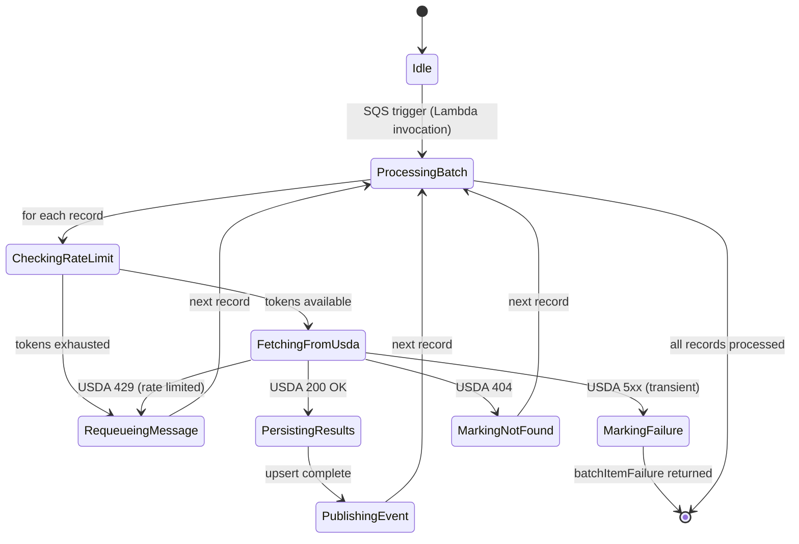
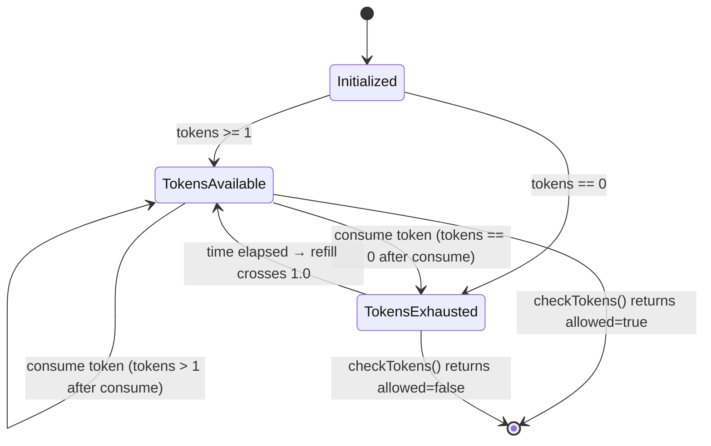
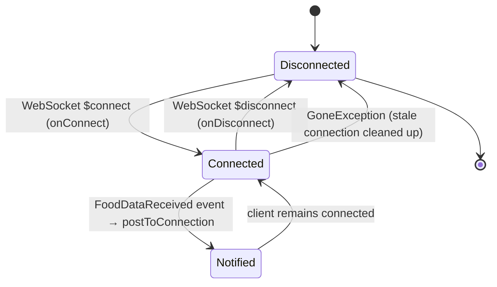
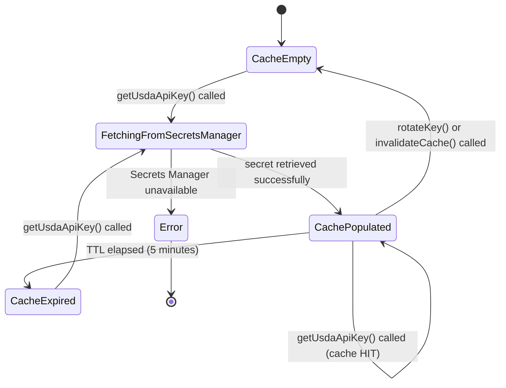

# Module Design: USDA Food Data Integration

**Feature Branch**: `003-usda-food-data`
**Created**: 2026-05-09
**Status**: Draft
**Source**: `specs/003-usda-food-data/v-model/architecture-design.md`
**Standard**: DO-178C / ISO 26262 Low-Level Module Design

---

## Overview

This document decomposes each of the 11 architecture modules (ARCH-001 through ARCH-011) into low-level module designs. Each module is assigned a unique `MOD-NNN` identifier and includes four mandatory views:

1. **Algorithmic / Logic View** — pseudocode describing the module's core logic
2. **State Machine View** — `stateDiagram-v2` (or `N/A Stateless` for pure functions)
3. **Internal Data Structures** — table of key data structures used internally
4. **Error Handling Return Codes** — table of error conditions and responses

---

## ID Schema

- **Module**: `MOD-NNN` — sequential low-level module identifier
- **Parent Architecture Module**: `ARCH-NNN` — the architecture module this MOD decomposes
- **Traceability**: Each MOD traces to one ARCH; each ARCH may have one or more MODs

---

## MOD-001 — FoodApiController (Request Handler)

**Parent ARCH**: ARCH-001
**Type**: Stateful (per-request lifecycle)
**Runtime**: AWS Lambda (Node.js 22.x)

### 1. Algorithmic / Logic View

```
FUNCTION handleGetFood(event):
  fdcId = parsePathParam(event, "fdcId")
  IF NOT isValidFdcId(fdcId):
    RETURN 400 { error: "Invalid fdcId format" }

  // Layer 1: Redis cache
  cached = RedisCacheService.get(fdcId)
  IF cached IS NOT NULL:
    MonitoringLogger.incrementMetric("cache.hit", 1)
    RETURN 200 { food: cached }

  // Layer 2: PostgreSQL
  row = PostgresRepository.findByFdcId(fdcId)
  IF row IS NOT NULL AND row.fetch_status == "fetched":
    RedisCacheService.set(fdcId, row, TTL=3600)
    MonitoringLogger.incrementMetric("db.hit", 1)
    RETURN 200 { food: row }

  // Layer 3: Already pending?
  IF RedisCacheService.isPending(fdcId):
    RETURN 202 { status: "pending", estimatedWaitSeconds: 30 }

  // Layer 4: Trigger async backfill
  RedisCacheService.markPending(fdcId)
  EventBridgePublisher.publishFoodRequested({ fdcId, requestedAt: now() })
  MonitoringLogger.incrementMetric("backfill.triggered", 1)
  RETURN 202 { status: "pending", estimatedWaitSeconds: 30 }

FUNCTION handleSearchFoods(event):
  query = parseQueryParam(event, "query")
  IF length(query) < 2:
    RETURN 400 { error: "Query too short" }
  results = PostgresRepository.searchFoods(query)
  RETURN 200 { foods: results }

FUNCTION handleGetFoodStatus(event):
  fdcId = parsePathParam(event, "fdcId")
  IF NOT isValidFdcId(fdcId):
    RETURN 400 { error: "Invalid fdcId format" }
  row = PostgresRepository.findByFdcId(fdcId)
  IF row IS NULL:
    pending = RedisCacheService.isPending(fdcId)
    IF pending:
      RETURN 200 { status: "pending" }
    RETURN 404 { error: "Not found" }
  RETURN 200 { status: row.fetch_status, foodData: row IF row.fetch_status == "fetched" }

FUNCTION handleGetNutrition(event):
  fdcId = parsePathParam(event, "fdcId")
  IF NOT isValidFdcId(fdcId):
    RETURN 400 { error: "Invalid fdcId format" }
  row = PostgresRepository.findByFdcId(fdcId)
  IF row IS NULL OR row.fetch_status != "fetched":
    RETURN 404 { error: "Nutrition data not available" }
  RETURN 200 { nutrition: row.nutrients }

FUNCTION isValidFdcId(fdcId):
  RETURN fdcId IS integer AND fdcId > 0 AND fdcId <= 9999999
```

### 2. State Machine View



### 3. Internal Data Structures

| Name               | Type                                                                  | Description                                         |
| ------------------ | --------------------------------------------------------------------- | --------------------------------------------------- |
| `RequestContext`   | `{ fdcId: number, requestId: string, startTime: number }`             | Per-request metadata for logging                    |
| `RouteMap`         | `Map<string, HandlerFn>`                                              | Maps HTTP method + path pattern to handler function |
| `ValidationResult` | `{ valid: boolean, error?: string }`                                  | Output of fdcId / query validation                  |
| `CacheLayerResult` | `{ source: 'redis' \| 'postgres' \| 'miss', data: FoodData \| null }` | Unified result from cache lookup chain              |

### 4. Error Handling Return Codes

| Error Condition                                  | HTTP Status | Response Body                                  | Action                                  |
| ------------------------------------------------ | ----------- | ---------------------------------------------- | --------------------------------------- |
| Invalid fdcId format (non-numeric, ≤0, >9999999) | 400         | `{ error: "Invalid fdcId format" }`            | Return immediately, no downstream calls |
| Query string too short (<2 chars)                | 400         | `{ error: "Query too short" }`                 | Return immediately                      |
| Redis unavailable (get)                          | —           | Fallthrough to PostgreSQL                      | Log warning, continue                   |
| PostgreSQL connection error                      | 503         | `{ error: "Service temporarily unavailable" }` | Log error, return 503                   |
| EventBridge publish failure                      | 503         | `{ error: "Failed to queue backfill" }`        | Clear pending flag, return 503          |
| Unknown route                                    | 404         | `{ error: "Not found" }`                       | Return immediately                      |

---

## MOD-002 — EventBridgePublisher (Event Emitter)

**Parent ARCH**: ARCH-002
**Type**: Stateless
**Runtime**: AWS Lambda (Node.js 22.x), called inline from ARCH-001 and ARCH-004

### 1. Algorithmic / Logic View

```
FUNCTION publishFoodRequested(payload: { fdcId, requestedAt }):
  IF NOT isValidFdcId(payload.fdcId):
    THROW ValidationError("Invalid fdcId")
  IF NOT isValidISO8601(payload.requestedAt):
    THROW ValidationError("Invalid requestedAt timestamp")

  entry = {
    Source: "usda-food-data",
    DetailType: "FoodRequested",
    Detail: JSON.stringify({ fdcId: payload.fdcId, requestedAt: payload.requestedAt }),
    EventBusName: ENV.EVENT_BUS_NAME
  }
  response = EventBridgeClient.putEvents({ Entries: [entry] })
  IF response.FailedEntryCount > 0:
    THROW EventBridgeError("PutEvents partial failure", response.Entries[0].ErrorCode)
  RETURN { eventId: response.Entries[0].EventId }

FUNCTION publishFoodBatchRequested(payload: { fdcIds, requestedAt }):
  IF length(payload.fdcIds) == 0 OR length(payload.fdcIds) > 20:
    THROW ValidationError("fdcIds must be 1–20 items")
  FOR EACH fdcId IN payload.fdcIds:
    IF NOT isValidFdcId(fdcId):
      THROW ValidationError("Invalid fdcId: " + fdcId)

  entry = {
    Source: "usda-food-data",
    DetailType: "FoodBatchRequested",
    Detail: JSON.stringify({ fdcIds: payload.fdcIds, requestedAt: payload.requestedAt }),
    EventBusName: ENV.EVENT_BUS_NAME
  }
  response = EventBridgeClient.putEvents({ Entries: [entry] })
  IF response.FailedEntryCount > 0:
    THROW EventBridgeError("PutEvents partial failure")
  RETURN { eventId: response.Entries[0].EventId }

FUNCTION publishFoodDataReceived(payload: { fdcId, foodData }):
  entry = {
    Source: "usda-food-data",
    DetailType: "FoodDataReceived",
    Detail: JSON.stringify({ fdcId: payload.fdcId, foodData: payload.foodData }),
    EventBusName: ENV.EVENT_BUS_NAME
  }
  response = EventBridgeClient.putEvents({ Entries: [entry] })
  // Fire-and-forget: log failure but do not throw
  IF response.FailedEntryCount > 0:
    MonitoringLogger.logRequest("eb-publish-fail", { fdcId: payload.fdcId }, 0)
```

### 2. State Machine View

`N/A Stateless` — EventBridgePublisher is a pure function module. Each call is independent with no retained state between invocations.

### 3. Internal Data Structures

| Name                      | Type                                           | Description                                       |
| ------------------------- | ---------------------------------------------- | ------------------------------------------------- |
| `EventEntry`              | `{ Source, DetailType, Detail, EventBusName }` | AWS EventBridge PutEvents entry shape             |
| `PublishResult`           | `{ eventId: string }`                          | Successful publish response                       |
| `EventBridgeClientConfig` | `{ region: string, endpoint?: string }`        | SDK client configuration (injected at cold start) |

### 4. Error Handling Return Codes

| Error Condition                                       | Error Type         | Response                    | Action                                          |
| ----------------------------------------------------- | ------------------ | --------------------------- | ----------------------------------------------- |
| Invalid fdcId in payload                              | `ValidationError`  | Throw                       | Caller receives error; no EventBridge call made |
| Invalid timestamp format                              | `ValidationError`  | Throw                       | Caller receives error                           |
| fdcIds array empty or >20                             | `ValidationError`  | Throw                       | Caller receives error                           |
| EventBridge `FailedEntryCount > 0`                    | `EventBridgeError` | Throw (FoodRequested/Batch) | Caller handles retry                            |
| EventBridge `FailedEntryCount > 0` (FoodDataReceived) | Log only           | No throw                    | Fire-and-forget; log warning                    |
| AWS SDK network timeout                               | `EventBridgeError` | Throw                       | Caller handles retry                            |

---

## MOD-003 — SqsQueueRouter (EventBridge Rule Router)

**Parent ARCH**: ARCH-003
**Type**: Stateless (EventBridge rule configuration + DLQ setup)
**Runtime**: Infrastructure-level (EventBridge rules, not Lambda code)

### 1. Algorithmic / Logic View

```
// EventBridge Rule: HighPriority
RULE HighPriorityRule:
  EventPattern: { source: ["usda-food-data"], detail-type: ["FoodRequested"] }
  Target: SQS HighPriorityQueue
  InputTransformer: pass-through Detail as message body

// EventBridge Rule: LowPriority
RULE LowPriorityRule:
  EventPattern: { source: ["usda-food-data"], detail-type: ["FoodBatchRequested"] }
  Target: SQS LowPriorityQueue
  InputTransformer: pass-through Detail as message body

// DLQ Configuration (applied at queue level)
FUNCTION configureDlq(queue, dlqArn, maxReceiveCount):
  queue.RedrivePolicy = {
    deadLetterTargetArn: dlqArn,
    maxReceiveCount: maxReceiveCount  // 3 for HighPriority, 5 for LowPriority
  }

// Deduplication (HighPriorityQueue is FIFO with content-based dedup)
FUNCTION deduplicateMessage(fdcId):
  MessageGroupId = "food-" + fdcId
  MessageDeduplicationId = SHA256("FoodRequested:" + fdcId + ":" + floor(now() / 300))
  // 5-minute dedup window prevents duplicate SQS messages for same fdcId
```

### 2. State Machine View

`N/A Stateless` — SqsQueueRouter is implemented as EventBridge rules (infrastructure configuration). No runtime state is maintained; routing decisions are deterministic based on event `detail-type`.

### 3. Internal Data Structures

| Name              | Type                                                                     | Description                            |
| ----------------- | ------------------------------------------------------------------------ | -------------------------------------- |
| `EventBridgeRule` | `{ name, eventPattern, target, inputTransformer }`                       | Rule definition for CDK/CloudFormation |
| `RedrivePolicy`   | `{ deadLetterTargetArn: string, maxReceiveCount: number }`               | DLQ configuration per queue            |
| `QueueConfig`     | `{ url: string, arn: string, fifo: boolean, visibilityTimeout: number }` | Queue metadata used by consumer        |

### 4. Error Handling Return Codes

| Error Condition                                | Handling                      | Action                                                |
| ---------------------------------------------- | ----------------------------- | ----------------------------------------------------- |
| EventBridge rule match failure                 | EventBridge dead-letter       | Event dropped to EventBridge archive (if configured)  |
| SQS queue unavailable                          | EventBridge retry (up to 24h) | EventBridge retries delivery with exponential backoff |
| Message exceeds SQS 256KB limit                | EventBridge rule error        | Log to CloudWatch; event discarded                    |
| DLQ delivery failure                           | CloudWatch alarm              | Alert on-call; manual inspection required             |
| FIFO dedup collision (same fdcId within 5 min) | SQS dedup                     | Duplicate silently dropped — correct behavior         |

---

## MOD-004 — FoodConsumerService (SQS Message Processor)

**Parent ARCH**: ARCH-004
**Type**: Stateful (per-batch Lambda invocation)
**Runtime**: AWS Lambda (Node.js 22.x)

### 1. Algorithmic / Logic View

```
FUNCTION handler(sqsEvent):
  results = []
  FOR EACH record IN sqsEvent.Records:
    result = processRecord(record)
    results.append(result)
  // Return batch item failures for partial batch success
  RETURN { batchItemFailures: results.filter(r => r.failed).map(r => ({ itemIdentifier: r.messageId })) }

FUNCTION processRecord(record):
  message = JSON.parse(record.body)
  fdcId = message.fdcId OR message.fdcIds[0]  // handle single or batch

  // Rate limit check
  tokenResult = TokenBucketRateLimiter.checkTokens()
  IF NOT tokenResult.allowed:
    waitSeconds = TokenBucketRateLimiter.getWaitTime()
    SqsClient.changeMessageVisibility(record.receiptHandle, waitSeconds + 5)
    RETURN { failed: false, messageId: record.messageId }  // not a failure, just re-queue

  // Fetch from USDA
  fdcIds = message.fdcIds OR [message.fdcId]
  TRY:
    foods = UsdaApiClient.fetchFoods(fdcIds)
  CATCH UsdaApiError(status=429):
    // Rate limited by USDA despite our token bucket — back off
    SqsClient.changeMessageVisibility(record.receiptHandle, 60)
    RETURN { failed: false, messageId: record.messageId }
  CATCH UsdaApiError(status=5xx):
    // Transient USDA error — let SQS retry
    RETURN { failed: true, messageId: record.messageId }
  CATCH UsdaApiError(status=404):
    // Food not found in USDA — mark as not_found, delete message
    PostgresRepository.updateFetchStatus(fdcId, "not_found")
    RedisCacheService.clearPending(fdcId)
    RETURN { failed: false, messageId: record.messageId }

  // Persist results
  FOR EACH food IN foods:
    PostgresRepository.upsertFood(food)
    RedisCacheService.invalidate(food.fdcId)
    RedisCacheService.clearPending(food.fdcId)
    EventBridgePublisher.publishFoodDataReceived({ fdcId: food.fdcId, foodData: food })

  MonitoringLogger.incrementMetric("consumer.processed", length(foods))
  RETURN { failed: false, messageId: record.messageId }
```

### 2. State Machine View



### 3. Internal Data Structures

| Name               | Type                                                     | Description                                           |
| ------------------ | -------------------------------------------------------- | ----------------------------------------------------- |
| `SqsRecord`        | `{ messageId, receiptHandle, body: string, attributes }` | Raw SQS record from Lambda event                      |
| `ProcessResult`    | `{ failed: boolean, messageId: string }`                 | Per-record processing outcome                         |
| `BatchItemFailure` | `{ itemIdentifier: string }`                             | SQS partial batch failure response shape              |
| `RetryState`       | `{ attempt: number, lastError: string }`                 | Tracked in message attributes for backoff calculation |

### 4. Error Handling Return Codes

| Error Condition                                | Action                                   | SQS Outcome                                |
| ---------------------------------------------- | ---------------------------------------- | ------------------------------------------ |
| Token bucket exhausted                         | `changeMessageVisibility(waitTime + 5s)` | Message re-appears after wait              |
| USDA API 429                                   | `changeMessageVisibility(60s)`           | Message re-appears after 60s               |
| USDA API 5xx                                   | Return `batchItemFailure`                | SQS retries; after maxReceiveCount → DLQ   |
| USDA API 404                                   | Mark `not_found` in DB, delete message   | Message deleted (success path)             |
| PostgreSQL upsert failure                      | Return `batchItemFailure`                | SQS retries                                |
| Redis invalidation failure                     | Log warning, continue                    | Non-fatal; stale cache will expire via TTL |
| EventBridge publish failure (FoodDataReceived) | Log warning, continue                    | Non-fatal; fire-and-forget                 |

---

## MOD-005 — TokenBucketRateLimiter (Redis Lua Script Rate Limiter)

**Parent ARCH**: ARCH-005
**Type**: Stateful (state stored in Redis)
**Runtime**: Called from ARCH-004 Lambda; state in ElastiCache Redis

### 1. Algorithmic / Logic View

```
// Redis key schema
BUCKET_KEY = "rate_limiter:usda:tokens"
LAST_REFILL_KEY = "rate_limiter:usda:last_refill"
CAPACITY = 1000          // max tokens (1,000 calls/hour)
REFILL_RATE = 1000/3600  // tokens per second ≈ 0.2778

// Atomic Lua script executed via EVAL (single Redis round-trip)
LUA_SCRIPT = """
  local tokens = tonumber(redis.call('GET', KEYS[1])) or ARGV[1]
  local last_refill = tonumber(redis.call('GET', KEYS[2])) or ARGV[3]
  local now = tonumber(ARGV[3])
  local capacity = tonumber(ARGV[1])
  local refill_rate = tonumber(ARGV[2])

  -- Refill tokens based on elapsed time
  local elapsed = now - last_refill
  local new_tokens = math.min(capacity, tokens + elapsed * refill_rate)

  -- Check if we can consume one token
  if new_tokens >= 1 then
    new_tokens = new_tokens - 1
    redis.call('SET', KEYS[1], new_tokens, 'EX', 7200)
    redis.call('SET', KEYS[2], now, 'EX', 7200)
    return { 1, math.floor(new_tokens) }  -- { allowed=true, tokensRemaining }
  else
    redis.call('SET', KEYS[1], new_tokens, 'EX', 7200)
    redis.call('SET', KEYS[2], now, 'EX', 7200)
    return { 0, 0 }  -- { allowed=false, tokensRemaining=0 }
  end
"""

FUNCTION checkTokens():
  now = unixTimestampSeconds()
  result = Redis.eval(LUA_SCRIPT, keys=[BUCKET_KEY, LAST_REFILL_KEY],
                      args=[CAPACITY, REFILL_RATE, now])
  RETURN { allowed: result[0] == 1, tokensRemaining: result[1] }

FUNCTION getWaitTime():
  tokens = Redis.get(BUCKET_KEY) OR 0
  IF tokens >= 1:
    RETURN 0
  deficit = 1 - tokens
  RETURN ceil(deficit / REFILL_RATE)  // seconds until next token available
```

### 2. State Machine View



### 3. Internal Data Structures

| Name                | Type                                                                   | Description                                                         |
| ------------------- | ---------------------------------------------------------------------- | ------------------------------------------------------------------- |
| `BucketState`       | `{ tokens: float, lastRefill: number }`                                | Persisted in Redis; represents current bucket state                 |
| `TokenCheckResult`  | `{ allowed: boolean, tokensRemaining: number }`                        | Return value of `checkTokens()`                                     |
| `LuaScript`         | `string`                                                               | Atomic Lua script loaded via `SCRIPT LOAD` for SHA-based invocation |
| `RateLimiterConfig` | `{ capacity: 1000, refillRatePerSecond: 0.2778, keyTtlSeconds: 7200 }` | Static configuration constants                                      |

### 4. Error Handling Return Codes

| Error Condition                        | Action                                   | Caller Impact                                         |
| -------------------------------------- | ---------------------------------------- | ----------------------------------------------------- |
| Redis unavailable (connection refused) | Throw `RateLimiterError`                 | ARCH-004 treats as "allowed=false"; re-queues message |
| Redis timeout (>100ms)                 | Throw `RateLimiterError`                 | Same as unavailable                                   |
| Lua script execution error             | Throw `RateLimiterError`                 | ARCH-004 re-queues message                            |
| Negative token count (clock skew)      | Clamp to 0 in Lua script                 | Graceful degradation                                  |
| Key expiry (TTL elapsed, bucket reset) | Lua initializes fresh bucket at CAPACITY | Correct behavior; bucket refills                      |

---

## MOD-006 — FoodPostgresRepository (Database Access Layer)

**Parent ARCH**: ARCH-006
**Type**: Stateless (connection pool managed externally via RDS Proxy)
**Runtime**: AWS Lambda (Node.js 22.x), uses `pg` (node-postgres)

### 1. Algorithmic / Logic View

```
FUNCTION findByFdcId(fdcId: number): FoodData | null
  sql = "SELECT * FROM foods WHERE fdc_id = $1 LIMIT 1"
  result = pool.query(sql, [fdcId])
  IF result.rows.length == 0:
    RETURN null
  RETURN mapRowToFoodData(result.rows[0])

FUNCTION upsertFood(food: FoodData): { success: boolean }
  sql = """
    INSERT INTO foods (fdc_id, description, brand_owner, nutrients, fetch_status, fetched_at)
    VALUES ($1, $2, $3, $4, 'fetched', NOW())
    ON CONFLICT (fdc_id) DO UPDATE SET
      description = EXCLUDED.description,
      brand_owner = EXCLUDED.brand_owner,
      nutrients = EXCLUDED.nutrients,
      fetch_status = 'fetched',
      fetched_at = NOW(),
      updated_at = NOW()
  """
  pool.query(sql, [food.fdcId, food.description, food.brandOwner, JSON.stringify(food.nutrients)])
  RETURN { success: true }

FUNCTION updateFetchStatus(fdcId: number, status: string): { success: boolean }
  VALIDATE status IN ["pending", "fetched", "not_found", "error"]
  sql = "UPDATE foods SET fetch_status = $1, updated_at = NOW() WHERE fdc_id = $2"
  pool.query(sql, [status, fdcId])
  RETURN { success: true }

FUNCTION searchFoods(query: string): FoodData[]
  // Use PostgreSQL full-text search with pg_trgm for fuzzy matching
  sql = """
    SELECT *, ts_rank(search_vector, plainto_tsquery('english', $1)) AS rank
    FROM foods
    WHERE search_vector @@ plainto_tsquery('english', $1)
       OR description ILIKE '%' || $1 || '%'
    ORDER BY rank DESC
    LIMIT 50
  """
  result = pool.query(sql, [query])
  RETURN result.rows.map(mapRowToFoodData)

FUNCTION mapRowToFoodData(row): FoodData
  RETURN {
    fdcId: row.fdc_id,
    description: row.description,
    brandOwner: row.brand_owner,
    nutrients: JSON.parse(row.nutrients),
    fetchStatus: row.fetch_status,
    fetchedAt: row.fetched_at
  }
```

### 2. State Machine View

`N/A Stateless` — FoodPostgresRepository is a pure data-access module. Each method executes a discrete SQL query with no retained state between calls. Connection pooling is managed by RDS Proxy, not this module.

### 3. Internal Data Structures

| Name          | Type                                                                                                                            | Description                                         |
| ------------- | ------------------------------------------------------------------------------------------------------------------------------- | --------------------------------------------------- |
| `FoodData`    | `{ fdcId: number, description: string, brandOwner: string, nutrients: NutrientMap, fetchStatus: FetchStatus, fetchedAt: Date }` | Domain model for a food item                        |
| `NutrientMap` | `Record<string, { amount: number, unit: string }>`                                                                              | JSONB column; keyed by nutrient name                |
| `FetchStatus` | `'pending' \| 'fetched' \| 'not_found' \| 'error'`                                                                              | Enum for food fetch lifecycle                       |
| `PoolConfig`  | `{ host, port, database, user, password, max: 10, idleTimeoutMillis: 30000 }`                                                   | pg Pool configuration (password from SecretManager) |

### 4. Error Handling Return Codes

| Error Condition                      | Error Type                | Action                              |
| ------------------------------------ | ------------------------- | ----------------------------------- |
| Connection refused / timeout         | `PostgresConnectionError` | Throw; caller returns 503           |
| Query timeout (>5s)                  | `PostgresQueryTimeout`    | Throw; caller returns 503           |
| Unique constraint violation (upsert) | Handled by `ON CONFLICT`  | No error; upsert succeeds           |
| Invalid fetch_status value           | `ValidationError`         | Throw before query execution        |
| Row not found (`findByFdcId`)        | —                         | Return `null` (not an error)        |
| JSON parse error (nutrients column)  | `DataIntegrityError`      | Log error, return null for that row |

---

## MOD-007 — FoodRedisCacheService (Cache & Pending-Set Manager)

**Parent ARCH**: ARCH-007
**Type**: Stateless (state in Redis)
**Runtime**: AWS Lambda (Node.js 22.x), uses `ioredis`

### 1. Algorithmic / Logic View

```
// Key schema
FOOD_KEY(fdcId) = "food:" + fdcId          // Hash or JSON string; TTL = 3600s
PENDING_SET_KEY = "pending_fetch"           // Redis Set of fdcIds currently being fetched

FUNCTION get(fdcId: number): FoodData | null
  raw = Redis.get(FOOD_KEY(fdcId))
  IF raw IS NULL:
    RETURN null
  RETURN JSON.parse(raw)

FUNCTION set(fdcId: number, data: FoodData, ttl: number): void
  Redis.set(FOOD_KEY(fdcId), JSON.stringify(data), "EX", ttl)

FUNCTION invalidate(fdcId: number): void
  Redis.del(FOOD_KEY(fdcId))

FUNCTION isPending(fdcId: number): boolean
  result = Redis.sismember(PENDING_SET_KEY, fdcId.toString())
  RETURN result == 1

FUNCTION markPending(fdcId: number): void
  Redis.sadd(PENDING_SET_KEY, fdcId.toString())
  // Set expiry on the set member via a separate key to avoid stale pending entries
  Redis.set("pending_ttl:" + fdcId, "1", "EX", 300)  // 5-minute pending TTL

FUNCTION clearPending(fdcId: number): void
  Redis.srem(PENDING_SET_KEY, fdcId.toString())
  Redis.del("pending_ttl:" + fdcId)
```

### 2. State Machine View

`N/A Stateless` — FoodRedisCacheService is a thin wrapper over Redis commands. All state is stored in Redis; the module itself retains no in-process state between Lambda invocations.

### 3. Internal Data Structures

| Name                | Type                                                                              | Description                                                                                |
| ------------------- | --------------------------------------------------------------------------------- | ------------------------------------------------------------------------------------------ |
| `CacheKey`          | `string`                                                                          | `"food:{fdcId}"` — Redis key for cached food data                                          |
| `PendingSetKey`     | `"pending_fetch"`                                                                 | Redis Set key tracking in-flight fdcIds                                                    |
| `PendingTtlKey`     | `string`                                                                          | `"pending_ttl:{fdcId}"` — sentinel key with 5-min TTL to auto-expire stale pending entries |
| `RedisClientConfig` | `{ host, port, password, tls: true, connectTimeout: 2000, commandTimeout: 1000 }` | ioredis client configuration                                                               |

### 4. Error Handling Return Codes

| Error Condition                      | Action                        | Caller Impact                                  |
| ------------------------------------ | ----------------------------- | ---------------------------------------------- |
| Redis connection refused             | Throw `CacheUnavailableError` | ARCH-001 falls through to PostgreSQL           |
| Redis command timeout (>1s)          | Throw `CacheUnavailableError` | ARCH-001 falls through to PostgreSQL           |
| JSON parse error on `get()`          | Log error, return `null`      | Cache treated as miss; PostgreSQL consulted    |
| `sismember` returns unexpected value | Treat as `false`              | Conservative: triggers backfill (safe)         |
| `sadd` failure on `markPending`      | Log warning, continue         | Risk of duplicate SQS messages (dedup handles) |
| `srem` failure on `clearPending`     | Log warning, continue         | Stale pending entry expires via TTL sentinel   |

---

## MOD-008 — UsdaApiClient (HTTP Client for USDA FoodData Central)

**Parent ARCH**: ARCH-008
**Type**: Stateless
**Runtime**: AWS Lambda (Node.js 22.x), uses `node-fetch` or native `fetch`

### 1. Algorithmic / Logic View

```
USDA_BASE_URL = "https://api.nal.usda.gov/fdc/v1"
MAX_BATCH_SIZE = 20
REQUEST_TIMEOUT_MS = 10000

FUNCTION fetchFoods(fdcIds: number[]): USDAFoodResponse[]
  IF length(fdcIds) == 0:
    RETURN []
  IF length(fdcIds) > MAX_BATCH_SIZE:
    THROW ValidationError("Batch size exceeds maximum of 20")

  apiKey = SecretManager.getUsdaApiKey()

  requestBody = {
    fdcIds: fdcIds,
    format: "abridged",
    nutrients: [203, 204, 205, 208, 269, 291]  // protein, fat, carbs, energy, sugars, fiber
  }

  response = HTTP.POST(
    url: USDA_BASE_URL + "/foods",
    headers: { "X-Api-Key": apiKey, "Content-Type": "application/json" },
    body: JSON.stringify(requestBody),
    timeout: REQUEST_TIMEOUT_MS
  )

  IF response.status == 200:
    data = JSON.parse(response.body)
    RETURN data.map(mapUsdaResponseToFoodData)
  ELSE IF response.status == 401:
    THROW UsdaApiError("Invalid API key", 401)
  ELSE IF response.status == 429:
    THROW UsdaApiError("USDA rate limit exceeded", 429)
  ELSE IF response.status >= 500:
    THROW UsdaApiError("USDA server error: " + response.status, response.status)
  ELSE:
    THROW UsdaApiError("Unexpected USDA response: " + response.status, response.status)

FUNCTION mapUsdaResponseToFoodData(usdaItem): FoodData
  RETURN {
    fdcId: usdaItem.fdcId,
    description: usdaItem.description,
    brandOwner: usdaItem.brandOwner OR null,
    nutrients: extractNutrients(usdaItem.foodNutrients),
    fetchStatus: "fetched",
    fetchedAt: new Date()
  }

FUNCTION extractNutrients(foodNutrients): NutrientMap
  result = {}
  FOR EACH n IN foodNutrients:
    result[n.nutrientName] = { amount: n.value, unit: n.unitName }
  RETURN result
```

### 2. State Machine View

`N/A Stateless` — UsdaApiClient is a pure HTTP client. Each call is independent; no connection pooling or session state is maintained between invocations.

### 3. Internal Data Structures

| Name               | Type                                                                                                     | Description                            |
| ------------------ | -------------------------------------------------------------------------------------------------------- | -------------------------------------- |
| `UsdaFoodsRequest` | `{ fdcIds: number[], format: 'abridged', nutrients: number[] }`                                          | POST body for USDA `/foods` endpoint   |
| `UsdaFoodItem`     | `{ fdcId, description, brandOwner?, foodNutrients: UsdaNutrient[] }`                                     | Raw USDA API response item             |
| `UsdaNutrient`     | `{ nutrientId, nutrientName, value, unitName }`                                                          | Individual nutrient from USDA response |
| `UsdaApiError`     | `{ message: string, statusCode: number }`                                                                | Typed error for USDA API failures      |
| `NutrientIdMap`    | `{ 203: 'Protein', 204: 'Total Fat', 205: 'Carbohydrates', 208: 'Energy', 269: 'Sugars', 291: 'Fiber' }` | Mapping of USDA nutrient IDs to names  |

### 4. Error Handling Return Codes

| Error Condition              | Error Type        | Status Code | Action                                                   |
| ---------------------------- | ----------------- | ----------- | -------------------------------------------------------- |
| HTTP 401 Unauthorized        | `UsdaApiError`    | 401         | Throw; ARCH-004 alerts on-call (key rotation needed)     |
| HTTP 429 Too Many Requests   | `UsdaApiError`    | 429         | Throw; ARCH-004 re-queues with 60s visibility delay      |
| HTTP 500–599 Server Error    | `UsdaApiError`    | 5xx         | Throw; ARCH-004 returns `batchItemFailure` for SQS retry |
| HTTP 404 Not Found           | `UsdaApiError`    | 404         | Throw; ARCH-004 marks food as `not_found`                |
| Request timeout (>10s)       | `UsdaApiError`    | 0           | Throw; ARCH-004 returns `batchItemFailure`               |
| JSON parse error on response | `UsdaApiError`    | —           | Throw; ARCH-004 returns `batchItemFailure`               |
| fdcIds array >20             | `ValidationError` | —           | Throw before HTTP call                                   |

---

## MOD-009 — WebSocketNotifier (Real-Time Client Notification)

**Parent ARCH**: ARCH-009
**Type**: Stateless (connection state in API Gateway WebSocket)
**Runtime**: AWS Lambda (Node.js 22.x), uses `@aws-sdk/client-apigatewaymanagementapi`

### 1. Algorithmic / Logic View

```
// NOTE: ARCH-009 is launch-deferred. EventBridge rule for FoodDataReceived
// has no target until US-9 is implemented. This module is scaffolded only.

FUNCTION notifyClients(fdcId: number, foodData: FoodData): number
  // Retrieve active WebSocket connection IDs for clients subscribed to fdcId
  connectionIds = ConnectionStore.getConnectionsForFdcId(fdcId)
  // ConnectionStore is a DynamoDB table: { connectionId PK, fdcId SK, ttl }

  notifiedCount = 0
  FOR EACH connectionId IN connectionIds:
    TRY:
      ApiGatewayManagementClient.postToConnection({
        ConnectionId: connectionId,
        Data: JSON.stringify({ type: "FoodDataReceived", fdcId, foodData })
      })
      notifiedCount++
    CATCH GoneException:
      // Client disconnected; clean up stale connection
      ConnectionStore.deleteConnection(connectionId)
    CATCH Error:
      // Log but continue — fire-and-forget
      MonitoringLogger.logRequest("ws-notify-fail", { connectionId, fdcId }, 0)

  RETURN notifiedCount

FUNCTION onConnect(connectionId: string, fdcId: number): void
  ConnectionStore.putConnection({ connectionId, fdcId, ttl: now() + 3600 })

FUNCTION onDisconnect(connectionId: string): void
  ConnectionStore.deleteConnection(connectionId)
```

### 2. State Machine View



### 3. Internal Data Structures

| Name               | Type                                                              | Description                                                  |
| ------------------ | ----------------------------------------------------------------- | ------------------------------------------------------------ |
| `ConnectionRecord` | `{ connectionId: string, fdcId: number, ttl: number }`            | DynamoDB item tracking active WebSocket subscriptions        |
| `WsMessage`        | `{ type: 'FoodDataReceived', fdcId: number, foodData: FoodData }` | JSON payload sent to WebSocket clients                       |
| `ApiGwMgmtConfig`  | `{ endpoint: string }`                                            | API Gateway Management API endpoint (wss://.../@connections) |

### 4. Error Handling Return Codes

| Error Condition                           | Action                          | Impact                                                 |
| ----------------------------------------- | ------------------------------- | ------------------------------------------------------ |
| `GoneException` (stale connection)        | Delete connection from DynamoDB | Stale entry cleaned up; no client impact               |
| `ForbiddenException`                      | Log warning, skip               | Connection not owned by this API; skip                 |
| DynamoDB `getConnectionsForFdcId` failure | Log error, return 0             | No clients notified; non-fatal                         |
| `postToConnection` timeout                | Log warning, continue           | Client misses notification; will see data on next poll |
| No connections for fdcId                  | Return 0                        | Normal case; no clients subscribed                     |

---

## MOD-010 — SecretManager (AWS Secrets Manager Wrapper)

**Parent ARCH**: ARCH-010
**Type**: Stateful (in-memory cache with TTL)
**Runtime**: AWS Lambda (Node.js 22.x), uses `@aws-sdk/client-secrets-manager`

### 1. Algorithmic / Logic View

```
// In-memory cache to avoid Secrets Manager API calls on every Lambda invocation
SECRET_CACHE = {}  // { secretName: { value: string, expiresAt: number } }
CACHE_TTL_MS = 300000  // 5 minutes

FUNCTION getUsdaApiKey(): string
  secretName = ENV.USDA_API_KEY_SECRET_NAME
  cached = SECRET_CACHE[secretName]
  IF cached IS NOT NULL AND cached.expiresAt > now():
    RETURN cached.value

  // Fetch from Secrets Manager
  response = SecretsManagerClient.getSecretValue({ SecretId: secretName })
  secret = JSON.parse(response.SecretString)
  apiKey = secret.apiKey

  // Cache the result
  SECRET_CACHE[secretName] = { value: apiKey, expiresAt: now() + CACHE_TTL_MS }
  RETURN apiKey

FUNCTION rotateKey(): { success: boolean }
  secretName = ENV.USDA_API_KEY_SECRET_NAME
  // Trigger rotation via Secrets Manager rotation Lambda
  SecretsManagerClient.rotateSecret({ SecretId: secretName })
  // Invalidate local cache
  DELETE SECRET_CACHE[secretName]
  RETURN { success: true }

FUNCTION invalidateCache(): void
  SECRET_CACHE = {}
```

### 2. State Machine View



### 3. Internal Data Structures

| Name                   | Type                                                   | Description                                          |
| ---------------------- | ------------------------------------------------------ | ---------------------------------------------------- |
| `SecretCache`          | `Record<string, { value: string, expiresAt: number }>` | In-memory cache; lives for Lambda container lifetime |
| `SecretValue`          | `{ apiKey: string }`                                   | JSON structure stored in Secrets Manager             |
| `SecretsManagerConfig` | `{ region: string }`                                   | SDK client configuration                             |

### 4. Error Handling Return Codes

| Error Condition                                | Error Type            | Action                                         |
| ---------------------------------------------- | --------------------- | ---------------------------------------------- |
| Secret not found (`ResourceNotFoundException`) | `SecretNotFoundError` | Throw; ARCH-004/ARCH-008 cannot proceed        |
| Access denied (`AccessDeniedException`)        | `SecretAccessError`   | Throw; alert on-call (IAM misconfiguration)    |
| Secrets Manager throttling                     | `SecretThrottleError` | Retry with exponential backoff (3 attempts)    |
| JSON parse error on secret value               | `SecretFormatError`   | Throw; alert on-call (secret format corrupted) |
| Rotation already in progress                   | Log warning           | Return `{ success: false }`; do not throw      |

---

## MOD-011 — MonitoringLogger (Structured Logging & Metrics)

**Parent ARCH**: ARCH-011
**Type**: Stateless
**Runtime**: AWS Lambda (Node.js 22.x), uses `@aws-lambda-powertools/logger` + CloudWatch SDK

### 1. Algorithmic / Logic View

```
// Structured logger backed by @aws-lambda-powertools/logger
logger = new Logger({ serviceName: "usda-food-data", logLevel: ENV.LOG_LEVEL || "INFO" })

FUNCTION logRequest(requestId: string, event: object, durationMs: number): void
  logger.info("request", {
    requestId,
    event,
    durationMs,
    timestamp: ISO8601Now(),
    lambdaContext: { functionName, memoryLimitInMB, remainingTimeInMillis }
  })

FUNCTION logError(requestId: string, error: Error, context: object): void
  logger.error("error", {
    requestId,
    errorName: error.name,
    errorMessage: error.message,
    stackTrace: error.stack,
    context,
    timestamp: ISO8601Now()
  })

FUNCTION incrementMetric(name: string, value: number): void
  // Emit CloudWatch EMF (Embedded Metrics Format) via logger
  // EMF is parsed by CloudWatch Logs and creates metrics automatically
  logger.info("metric", {
    _aws: {
      Timestamp: unixTimestampMs(),
      CloudWatchMetrics: [{
        Namespace: "UsdaFoodData",
        Dimensions: [["service"]],
        Metrics: [{ Name: name, Unit: "Count" }]
      }]
    },
    service: "usda-food-data",
    [name]: value
  })

FUNCTION startTrace(requestId: string): Segment
  // AWS X-Ray tracing via @aws-lambda-powertools/tracer
  segment = Tracer.getSegment()
  subsegment = segment.addNewSubsegment(requestId)
  RETURN subsegment
```

### 2. State Machine View

`N/A Stateless` — MonitoringLogger is a pure utility module. Each call emits a log entry or metric independently. No state is retained between calls.

### 3. Internal Data Structures

| Name           | Type                                                                        | Description                                   |
| -------------- | --------------------------------------------------------------------------- | --------------------------------------------- |
| `LogEntry`     | `{ requestId, event, durationMs, timestamp, lambdaContext }`                | Structured log payload                        |
| `EmfMetric`    | `{ _aws: { Timestamp, CloudWatchMetrics }, service, [metricName]: number }` | CloudWatch Embedded Metrics Format payload    |
| `LoggerConfig` | `{ serviceName: string, logLevel: 'DEBUG' \| 'INFO' \| 'WARN' \| 'ERROR' }` | Logger initialization config                  |
| `Segment`      | X-Ray `Subsegment`                                                          | X-Ray tracing segment for distributed tracing |

### 4. Error Handling Return Codes

| Error Condition                  | Action                                         | Impact                            |
| -------------------------------- | ---------------------------------------------- | --------------------------------- |
| CloudWatch Logs delivery failure | Swallow error (Lambda runtime handles)         | Log may be lost; non-fatal        |
| EMF metric parse error           | Log raw JSON; CloudWatch may not create metric | Metric lost; non-fatal            |
| X-Ray tracing disabled           | Return no-op Segment                           | Tracing unavailable; non-fatal    |
| Invalid log level in ENV         | Default to `INFO`                              | Degraded observability; non-fatal |

---

## ARCH ↔ MOD Traceability Matrix

This matrix maps each Architecture Module (ARCH) to its corresponding low-level Module Design (MOD), and traces both back to parent System Components (SYS).

| ARCH ID  | ARCH Name              | MOD ID  | MOD Name                                               | Parent SYS                | Notes                                                          |
| -------- | ---------------------- | ------- | ------------------------------------------------------ | ------------------------- | -------------------------------------------------------------- |
| ARCH-001 | FoodApiController      | MOD-001 | FoodApiController (Request Handler)                    | SYS-001                   | API Gateway Lambda; 4-layer cache lookup chain                 |
| ARCH-002 | EventBridgePublisher   | MOD-002 | EventBridgePublisher (Event Emitter)                   | SYS-002                   | Publishes FoodRequested, FoodBatchRequested, FoodDataReceived  |
| ARCH-003 | SqsQueueRouter         | MOD-003 | SqsQueueRouter (EventBridge Rule Router)               | SYS-002, SYS-003, SYS-004 | Infrastructure-level routing; FIFO dedup for HighPriorityQueue |
| ARCH-004 | FoodConsumerService    | MOD-004 | FoodConsumerService (SQS Message Processor)            | SYS-005                   | Partial batch failure support; exponential backoff             |
| ARCH-005 | TokenBucketRateLimiter | MOD-005 | TokenBucketRateLimiter (Redis Lua Script Rate Limiter) | [CROSS-CUTTING]           | Atomic Lua script; 1,000 calls/hour cap                        |
| ARCH-006 | FoodPostgresRepository | MOD-006 | FoodPostgresRepository (Database Access Layer)         | SYS-006                   | pg_trgm FTS; JSONB nutrients; RDS Proxy pooling                |
| ARCH-007 | FoodRedisCacheService  | MOD-007 | FoodRedisCacheService (Cache & Pending-Set Manager)    | SYS-007                   | Redis Set for pending dedup; TTL sentinel for stale pending    |
| ARCH-008 | UsdaApiClient          | MOD-008 | UsdaApiClient (HTTP Client for USDA FoodData Central)  | SYS-008                   | Abridged format; 6 nutrient IDs; 10s timeout                   |
| ARCH-009 | WebSocketNotifier      | MOD-009 | WebSocketNotifier (Real-Time Client Notification)      | SYS-009                   | Launch-deferred; DynamoDB connection store                     |
| ARCH-010 | SecretManager          | MOD-010 | SecretManager (AWS Secrets Manager Wrapper)            | [CROSS-CUTTING]           | 5-min in-memory cache; rotation support                        |
| ARCH-011 | MonitoringLogger       | MOD-011 | MonitoringLogger (Structured Logging & Metrics)        | [CROSS-CUTTING]           | EMF metrics; X-Ray tracing; Powertools logger                  |

### Coverage Summary

| Metric                                   | Count                                           |
| ---------------------------------------- | ----------------------------------------------- |
| Total ARCH modules                       | 11                                              |
| Total MOD modules                        | 11                                              |
| ARCH modules with full MOD coverage      | 11 / 11 (100%)                                  |
| MOD modules with Stateful state machine  | 4 (MOD-001, MOD-004, MOD-005, MOD-010)          |
| MOD modules marked N/A Stateless         | 5 (MOD-002, MOD-006, MOD-007, MOD-008, MOD-011) |
| MOD modules with WebSocket state machine | 1 (MOD-009)                                     |
| MOD modules with SQS state machine       | 1 (MOD-003 — infrastructure, N/A Stateless)     |

---

_End of Module Design — 003-usda-food-data_
