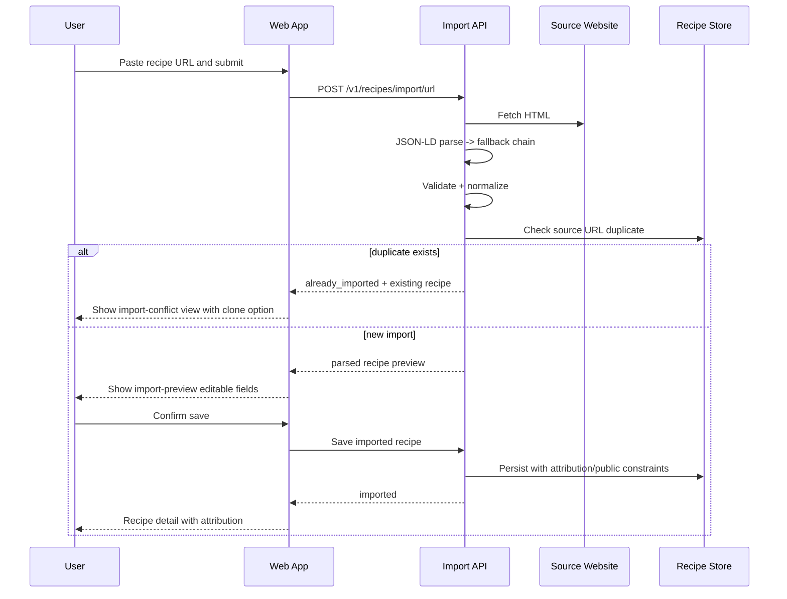

# User Journeys: Recipe Importing

**Branch**: `004-recipe-importing`
**Date**: 2026-05-09
**Status**: Draft
**Source**: [product-spec.md](./product-spec.md), [spec.md](../spec.md), [plan.md](../plan.md)

---

## Journey Notation

Each journey is end-to-end and references FR IDs in brackets.

---

## Journey A: URL Import → Parse Confirm → Save

**Persona**: Fast Importer (Riley)

**FR coverage**: `FR-008`, `FR-010`, `FR-011`

---

## Journey B: Instagram Import with Unsupported Caption Case

**Persona**: Fast Importer (Riley)

1. User submits Instagram URL.
2. System fetches oEmbed/caption metadata.
3. If caption has recipe text, flow continues to preview and save.
4. If caption lacks recipe text (video-only/image-only), system returns explicit unsupported message and recovery actions.

**FR coverage**: `FR-009`, `FR-010`, `FR-014` (error messaging behavior pattern)

---

## Journey C: Manual Paste Recovery After Parse Failure

**Persona**: Methodical Planner (Casey)

1. URL import fails due to parse incompleteness.
2. User chooses “Paste Manually” recovery action.
3. User pastes ingredient/instruction text into structured template.
4. System parses into editable fields and opens preview.
5. User edits and saves.

**FR coverage**: `FR-008` (import capability), `FR-010` (if source available), `FR-013` (private behavior for unattributed/physical-like paths)

---

## Journey D: Paywalled Source Rejection

**Persona**: Compliance-Conscious User (Morgan)

1. User submits known paywalled source URL.
2. System rejects import with clear paywall explanation.
3. User is offered policy-aware alternatives (manual personal note flow, non-public handling guidance).

**FR coverage**: `FR-014`

---

## Journey E: OCR-Backed Physical Copy Import (Phased)

**Persona**: Methodical Planner (Casey)

1. User captures/uploads photo of physical recipe card.
2. OCR extracts candidate text.
3. System opens preview for user correction.
4. Saved recipe defaults to private due to no public source URL.

**FR coverage**: `FR-012`, `FR-013`

---

## Journey F: Duplicate Conflict to Clone Path

**Persona**: Fast Importer (Riley)

1. User imports URL that already exists in system.
2. Conflict screen shows canonical recipe and clone CTA.
3. User clones recipe to their workspace.
4. Clone retains attribution and visibility rules.

**FR coverage**: `FR-008`, `FR-011`

---

## Coverage Matrix

| Journey | FR-008 | FR-009 | FR-010 | FR-011 | FR-012 | FR-013 | FR-014 | FR-014a |
| ------- | ------ | ------ | ------ | ------ | ------ | ------ | ------ | ------- |
| A       | ✅     |        | ✅     | ✅     |        |        |        |         |
| B       |        | ✅     | ✅     |        |        |        | ✅     |         |
| C       | ✅     |        | ✅     |        |        | ✅     |        |         |
| D       |        |        |        |        |        |        | ✅     |         |
| E       |        |        |        |        | ✅     | ✅     |        |         |
| F       | ✅     |        |        | ✅     |        |        |        |         |

`FR-014a` remains policy-open and is therefore tracked in product-spec/metrics and verify warnings rather than represented as a deterministic user journey.
