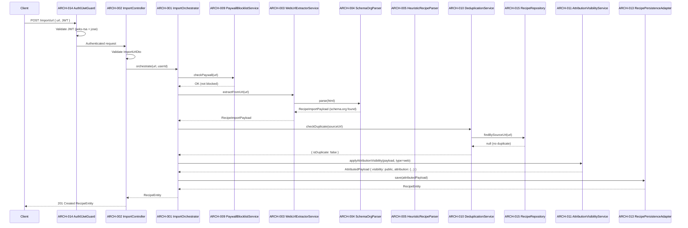
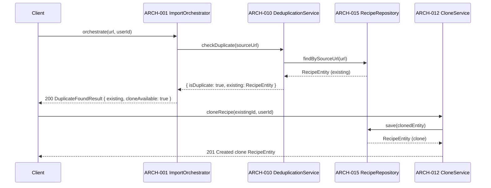
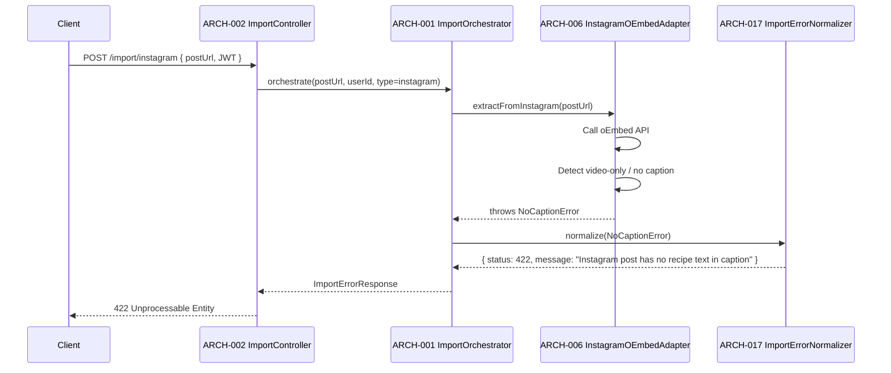
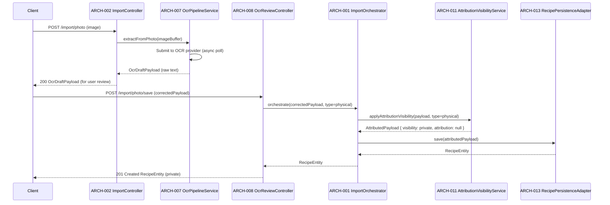

# Architecture Design: Recipe Importing

**Feature Branch**: `004-recipe-importing`
**Created**: 2026-05-09
**Status**: Draft
**Source**: `specs/004-recipe-importing/v-model/system-design.md`

## Overview

The Recipe Importing architecture decomposes nine system components (SYS-001–SYS-009) into 18 architecture modules (ARCH-001–ARCH-018) organised across four Kruchten 4+1 views. The decomposition separates extraction adapters (web, Instagram, OCR) from shared enforcement logic (paywall, deduplication, attribution/visibility), and isolates the persistence boundary behind a typed adapter. Cross-cutting modules handle authentication middleware, error normalisation, and TypeScript type definitions shared across all import paths.

## ID Schema

- **Architecture Module**: `ARCH-NNN` — sequential identifier for each module
- **Parent System Components**: Comma-separated `SYS-NNN` list per module (many-to-many)
- **Cross-Cutting Tag**: `[CROSS-CUTTING; rationale: shared infrastructure supports multiple SYS components]` for infrastructure/utility modules not traceable to a specific SYS
- Example: `ARCH-003` with Parent System Components `SYS-001, SYS-004` — module serves both components
- Example: `ARCH-010 [CROSS-CUTTING; rationale: shared infrastructure supports multiple SYS components]` — infrastructure module (e.g., Logger, Thread Pool) with rationale

## Logical View — Component Breakdown (IEEE 42010 / Kruchten 4+1)

| ARCH ID  | Name                         | Description                                                                                                                                                                                                                                                                                                                                                 | Parent System Components                                                                                                                                                 | Type      |
| -------- | ---------------------------- | ----------------------------------------------------------------------------------------------------------------------------------------------------------------------------------------------------------------------------------------------------------------------------------------------------------------------------------------------------------- | ------------------------------------------------------------------------------------------------------------------------------------------------------------------------ | --------- | ------- |
| ARCH-001 | ImportOrchestrator           | NestJS service that routes incoming import requests to the correct extractor module, sequences paywall check → deduplication → attribution/visibility → persistence, and returns a unified result to the API layer. Owns the top-level try/catch and delegates error normalisation to ARCH-017.                                                             | SYS-009                                                                                                                                                                  | Service   |
| ARCH-002 | ImportController             | NestJS REST controller exposing four endpoints: `POST /import/url`, `POST /import/instagram`, `POST /import/photo`, `POST /import/photo/save`. Validates incoming DTOs with `class-validator`, delegates to ARCH-001, and maps domain errors to HTTP status codes.                                                                                          | SYS-009                                                                                                                                                                  | Component |
| ARCH-003 | WebUrlExtractorService       | Fetches the target URL via `node-fetch`, parses `application/ld+json` schema.org/Recipe markup as the primary extraction strategy, falls back to heuristic CSS-selector parsing for title/ingredients/instructions, and returns a `RecipeImportPayload`. Throws `UrlUnreachableError` on 4xx/5xx or network timeout.                                        | SYS-001                                                                                                                                                                  | Service   |
| ARCH-004 | SchemaOrgParser              | Stateless utility that accepts raw HTML and extracts a `RecipeImportPayload` from embedded `application/ld+json` `Recipe` objects. Returns `null` when no valid schema is found, signalling ARCH-003 to invoke the heuristic fallback.                                                                                                                      | SYS-001                                                                                                                                                                  | Library   |
| ARCH-005 | HeuristicRecipeParser        | Stateless utility that applies CSS-selector heuristics (common recipe blog patterns) to extract title, ingredient list, and instruction steps from raw HTML when schema.org markup is absent. Returns a partial `RecipeImportPayload` with a confidence score.                                                                                              | SYS-001                                                                                                                                                                  | Library   |
| ARCH-006 | InstagramOEmbedAdapter       | Calls the Instagram public oEmbed endpoint (`https://graph.facebook.com/v18.0/instagram_oembed`) with the post URL, validates the response, checks that caption text contains recipe content (non-empty, not video-only), and returns a `RecipeImportPayload`. Throws `NoCaptionError` for video-only or image-only posts; `OEmbedApiError` on API failure. | SYS-002                                                                                                                                                                  | Adapter   |
| ARCH-007 | OcrPipelineService           | Accepts a `Buffer` (uploaded photo), submits it to the configured OCR provider (AWS Textract or equivalent), polls for completion, and returns raw extracted text as an `OcrDraftPayload`. Throws `OcrServiceError` on provider failure or timeout.                                                                                                         | SYS-003                                                                                                                                                                  | Service   |
| ARCH-008 | OcrReviewController          | NestJS controller endpoint (`POST /import/photo/save`) that accepts a user-corrected `OcrDraftPayload`, validates it, and passes it to ARCH-001 for the attribution/visibility/persistence pipeline. Distinct from ARCH-002 to isolate the two-step OCR flow.                                                                                               | SYS-003                                                                                                                                                                  | Component |
| ARCH-009 | PaywallBlocklistService      | Loads a domain blocklist from environment configuration at startup. Exposes `checkPaywall(url: string): void` — throws `PaywallBlockedError` synchronously if the URL's domain matches a blocked entry. Also exposes `flagManualEntry(payload): void` to mark manually entered paid-source recipes, preventing public visibility.                           | SYS-006                                                                                                                                                                  | Service   |
| ARCH-010 | DeduplicationService         | Queries the Recipe repository (via ARCH-015) for an existing record with the same `sourceUrl`. Returns a `DuplicateCheckResult` containing the existing `RecipeEntity` when found, or `null` when the URL is new. Exposes `findBySourceUrl(url: string)`.                                                                                                   | SYS-005                                                                                                                                                                  | Service   |
| ARCH-011 | AttributionVisibilityService | Applies attribution metadata (sourceUrl, originalAuthor, platform) to a `RecipeImportPayload` and enforces visibility rules: web/Instagram imports → public; physical copy imports → private. Enforces the clone-and-substantive-edit rule for premium users attempting to make an imported recipe private. Returns an `AttributedPayload`.                 | SYS-004                                                                                                                                                                  | Service   |
| ARCH-012 | CloneService                 | Creates a copy of an existing `RecipeEntity` for a given user, retaining source attribution on the clone. Enforces that the clone remains public until a premium user makes a substantive edit (determined by diff against the original). Delegates persistence to ARCH-015.                                                                                | SYS-004                                                                                                                                                                  | Service   |
| ARCH-013 | RecipePersistenceAdapter     | Wraps the Drizzle ORM `recipes` table. Exposes `save(payload: AttributedPayload): RecipeEntity`, `findBySourceUrl(url: string): RecipeEntity                                                                                                                                                                                                                | null`, and `updateAttributionNote(recipeId, note): void` (used when an Instagram source is deleted). Conforms to the 001-commise-recipe-app schema.                    | SYS-007   | Adapter |
| ARCH-014 | Auth0JwtGuard                | NestJS `CanActivate` guard applied globally to all import endpoints. Validates the Auth0 JWT from the `Authorization: Bearer` header using `jwks-rsa` + `jose`. Rejects unauthenticated requests with HTTP 401 before any import logic executes.                                                                                                            | SYS-008                                                                                                                                                                  | Component |
| ARCH-015 | RecipeRepository             | Drizzle ORM repository providing typed query methods over the `recipes` PostgreSQL table. Used by ARCH-010 (deduplication reads), ARCH-012 (clone writes), and ARCH-013 (import persistence). Centralises all DB access for the import feature.                                                                                                             | SYS-005, SYS-007                                                                                                                                                         | Library   |
| ARCH-016 | ImportDtoTypes               | Shared TypeScript interfaces and `class-validator` DTOs: `ImportUrlDto`, `ImportInstagramDto`, `ImportPhotoSaveDto`, `RecipeImportPayload`, `OcrDraftPayload`, `AttributedPayload`, `DuplicateCheckResult`. Compiled with `strict: true`; no `any`. Consumed by all other ARCH modules.                                                                     | [CROSS-CUTTING; rationale: shared infrastructure supports multiple SYS components] — shared type contracts consumed by all import modules; not traceable to a single SYS | Library   |
| ARCH-017 | ImportErrorNormalizer        | Maps domain-specific errors (`UrlUnreachableError`, `NoCaptionError`, `PaywallBlockedError`, `OcrServiceError`, `PersistenceError`, etc.) to structured `ImportErrorResponse` objects with HTTP status codes and user-facing messages. Used by ARCH-002 and ARCH-008.                                                                                       | [CROSS-CUTTING; rationale: shared infrastructure supports multiple SYS components] — error handling spans all import paths; not traceable to a single SYS                | Utility   |
| ARCH-018 | ImportLogger                 | Structured logger (wrapping `@aws-lambda-powertools/logger` or NestJS Logger) that emits import lifecycle events (import started, extractor invoked, paywall blocked, duplicate found, persisted) with correlation IDs. Used by ARCH-001 for observability.                                                                                                 | [CROSS-CUTTING; rationale: shared infrastructure supports multiple SYS components] — observability spans all import paths; not traceable to a single SYS                 | Utility   |

## Process View — Dynamic Behavior (Kruchten 4+1)

### Interaction 1: Web URL Import — Happy Path



**Concurrency Model**: Single async/await chain per request; NestJS event loop (Node.js single-threaded). No shared mutable state between requests.
**Synchronization Points**: All DB calls are awaited sequentially within the orchestrator. Paywall check is synchronous (in-memory blocklist).

---

### Interaction 2: Duplicate URL Detected — Clone Offered



**Concurrency Model**: Clone operation is a separate request; no locking required (Postgres row-level isolation handles concurrent clones).
**Synchronization Points**: None — clone is an independent write.

---

### Interaction 3: Instagram Import — No Caption Rejection



**Concurrency Model**: Single async/await chain; oEmbed API call is awaited.
**Synchronization Points**: None.

---

### Interaction 4: Physical Copy OCR — Two-Step Flow



**Concurrency Model**: Two separate HTTP requests; OCR polling is internal to ARCH-007 (async/await with retry). No shared state between step 1 and step 2 beyond the `OcrDraftPayload` returned to the client.
**Synchronization Points**: OCR provider polling uses exponential backoff with a configurable max-wait timeout.

## Interface View — API Contracts (Kruchten 4+1)

### ARCH-001: ImportOrchestrator

| Direction | Name                | Type                                                      | Format              | Constraints                                               |
| --------- | ------------------- | --------------------------------------------------------- | ------------------- | --------------------------------------------------------- |
| Input     | url / postUrl       | `string`                                                  | Valid URL           | Required for web/Instagram paths                          |
| Input     | imageBuffer         | `Buffer`                                                  | Binary image        | Required for physical copy path; max 10 MB                |
| Input     | correctedPayload    | `OcrDraftPayload`                                         | JSON                | Required for photo/save path                              |
| Input     | userId              | `string`                                                  | Auth0 sub claim     | Required; injected by ARCH-014                            |
| Input     | importType          | `'web' \| 'instagram' \| 'physical'`                      | Enum                | Required; determines routing                              |
| Output    | result              | `RecipeEntity \| DuplicateFoundResult \| OcrDraftPayload` | JSON                | Discriminated union based on import type and dedup result |
| Exception | UrlUnreachableError | `ImportError`                                             | `{ code, message }` | Thrown when target URL returns 4xx/5xx or times out       |
| Exception | PaywallBlockedError | `ImportError`                                             | `{ code, message }` | Thrown when domain is on blocklist                        |
| Exception | NoCaptionError      | `ImportError`                                             | `{ code, message }` | Thrown when Instagram post has no recipe caption          |
| Exception | OcrServiceError     | `ImportError`                                             | `{ code, message }` | Thrown when OCR provider fails or times out               |
| Exception | PersistenceError    | `ImportError`                                             | `{ code, message }` | Thrown when DB write fails                                |

### ARCH-002: ImportController

| Direction | Name               | Type                   | Format    | Constraints                                             |
| --------- | ------------------ | ---------------------- | --------- | ------------------------------------------------------- |
| Input     | ImportUrlDto       | `{ url: string }`      | JSON body | `url` must be a valid URL; validated by class-validator |
| Input     | ImportInstagramDto | `{ postUrl: string }`  | JSON body | `postUrl` must be an instagram.com URL                  |
| Input     | image              | `multipart/form-data`  | Binary    | MIME type must be image/\*; max 10 MB                   |
| Input     | ImportPhotoSaveDto | `OcrDraftPayload`      | JSON body | All fields required; validated by class-validator       |
| Output    | 201 Created        | `RecipeEntity`         | JSON      | On successful import or clone save                      |
| Output    | 200 OK             | `DuplicateFoundResult` | JSON      | When duplicate URL detected                             |
| Output    | 200 OK             | `OcrDraftPayload`      | JSON      | After OCR extraction, before user review                |
| Exception | 400                | `ValidationError`      | JSON      | DTO validation failure                                  |
| Exception | 401                | `UnauthorizedError`    | JSON      | JWT missing or invalid (from ARCH-014)                  |
| Exception | 422                | `ImportErrorResponse`  | JSON      | Paywall blocked, no caption, URL unreachable            |
| Exception | 500                | `ImportErrorResponse`  | JSON      | Unexpected persistence or OCR failure                   |

### ARCH-003: WebUrlExtractorService

| Direction | Name                | Type                  | Format       | Constraints                                                |
| --------- | ------------------- | --------------------- | ------------ | ---------------------------------------------------------- |
| Input     | url                 | `string`              | Valid URL    | Must be reachable; HTTPS preferred                         |
| Output    | RecipeImportPayload | `RecipeImportPayload` | Typed object | title, ingredients[], instructions[], photos[], sourceUrl  |
| Exception | UrlUnreachableError | `ImportError`         | Error object | HTTP 4xx/5xx or network timeout (10 s default)             |
| Exception | ExtractionError     | `ImportError`         | Error object | Neither schema.org nor heuristic parser yields usable data |

### ARCH-004: SchemaOrgParser

| Direction | Name                | Type                          | Format       | Constraints                                  |
| --------- | ------------------- | ----------------------------- | ------------ | -------------------------------------------- |
| Input     | html                | `string`                      | Raw HTML     | Must be non-empty                            |
| Output    | RecipeImportPayload | `RecipeImportPayload \| null` | Typed object | `null` when no valid schema.org Recipe found |

### ARCH-005: HeuristicRecipeParser

| Direction | Name                | Type                  | Format       | Constraints                                          |
| --------- | ------------------- | --------------------- | ------------ | ---------------------------------------------------- |
| Input     | html                | `string`              | Raw HTML     | Must be non-empty                                    |
| Output    | RecipeImportPayload | `RecipeImportPayload` | Typed object | Partial payload with `confidenceScore: number (0–1)` |

### ARCH-006: InstagramOEmbedAdapter

| Direction | Name                | Type                  | Format        | Constraints                                                  |
| --------- | ------------------- | --------------------- | ------------- | ------------------------------------------------------------ |
| Input     | postUrl             | `string`              | Instagram URL | Must match `instagram.com/p/` pattern                        |
| Output    | RecipeImportPayload | `RecipeImportPayload` | Typed object  | Populated from oEmbed caption; sourceUrl = postUrl           |
| Exception | NoCaptionError      | `ImportError`         | Error object  | Post is video-only or image-only without recipe caption text |
| Exception | OEmbedApiError      | `ImportError`         | Error object  | oEmbed API returns non-200 or malformed response             |

### ARCH-007: OcrPipelineService

| Direction | Name            | Type              | Format       | Constraints                                          |
| --------- | --------------- | ----------------- | ------------ | ---------------------------------------------------- |
| Input     | imageBuffer     | `Buffer`          | Binary image | Max 10 MB; MIME type image/\*                        |
| Output    | OcrDraftPayload | `OcrDraftPayload` | Typed object | `{ rawText: string, confidence: number }`            |
| Exception | OcrServiceError | `ImportError`     | Error object | Provider failure, timeout, or unsupported image type |

### ARCH-008: OcrReviewController

| Direction | Name               | Type                | Format    | Constraints                                       |
| --------- | ------------------ | ------------------- | --------- | ------------------------------------------------- |
| Input     | ImportPhotoSaveDto | `OcrDraftPayload`   | JSON body | All fields required; validated by class-validator |
| Output    | 201 Created        | `RecipeEntity`      | JSON      | Private recipe entity                             |
| Exception | 400                | `ValidationError`   | JSON      | DTO validation failure                            |
| Exception | 401                | `UnauthorizedError` | JSON      | JWT missing or invalid                            |

### ARCH-009: PaywallBlocklistService

| Direction | Name                | Type          | Format       | Constraints                                              |
| --------- | ------------------- | ------------- | ------------ | -------------------------------------------------------- |
| Input     | url                 | `string`      | Valid URL    | Domain extracted and matched against blocklist           |
| Output    | void                | —             | —            | Returns void when URL is not blocked                     |
| Exception | PaywallBlockedError | `ImportError` | Error object | Thrown synchronously when domain matches blocklist entry |

### ARCH-010: DeduplicationService

| Direction | Name                 | Type                   | Format       | Constraints                                         |
| --------- | -------------------- | ---------------------- | ------------ | --------------------------------------------------- |
| Input     | sourceUrl            | `string`               | Valid URL    | Used as deduplication key                           |
| Output    | DuplicateCheckResult | `DuplicateCheckResult` | Typed object | `{ isDuplicate: boolean, existing?: RecipeEntity }` |
| Exception | DatabaseError        | `ImportError`          | Error object | DB query failure                                    |

### ARCH-011: AttributionVisibilityService

| Direction | Name              | Type                                 | Format       | Constraints                                                         |
| --------- | ----------------- | ------------------------------------ | ------------ | ------------------------------------------------------------------- |
| Input     | payload           | `RecipeImportPayload`                | Typed object | Must include sourceUrl for web/Instagram; null for physical         |
| Input     | importType        | `'web' \| 'instagram' \| 'physical'` | Enum         | Determines visibility and attribution rules                         |
| Input     | userId            | `string`                             | Auth0 sub    | Used for premium-tier check on clone-and-edit rule                  |
| Output    | AttributedPayload | `AttributedPayload`                  | Typed object | Includes `visibility`, `attribution`, `isPremiumEditAllowed`        |
| Exception | AttributionError  | `ImportError`                        | Error object | Thrown when attribution rules cannot be applied (e.g., missing URL) |

### ARCH-012: CloneService

| Direction | Name             | Type           | Format       | Constraints                                                  |
| --------- | ---------------- | -------------- | ------------ | ------------------------------------------------------------ |
| Input     | existingId       | `string`       | UUID         | ID of the recipe to clone                                    |
| Input     | userId           | `string`       | Auth0 sub    | Owner of the new clone                                       |
| Output    | RecipeEntity     | `RecipeEntity` | Typed object | Clone retains sourceUrl and attribution; visibility = public |
| Exception | NotFoundError    | `ImportError`  | Error object | Source recipe not found                                      |
| Exception | PersistenceError | `ImportError`  | Error object | DB write failure                                             |

### ARCH-013: RecipePersistenceAdapter

| Direction | Name              | Type                | Format       | Constraints                                 |
| --------- | ----------------- | ------------------- | ------------ | ------------------------------------------- |
| Input     | attributedPayload | `AttributedPayload` | Typed object | All required Recipe fields populated        |
| Output    | RecipeEntity      | `RecipeEntity`      | Typed object | Conforms to 001-commise-recipe-app schema |
| Exception | PersistenceError  | `ImportError`       | Error object | Drizzle ORM / PostgreSQL write failure      |

### ARCH-014: Auth0JwtGuard

| Direction | Name                  | Type     | Format         | Constraints                                |
| --------- | --------------------- | -------- | -------------- | ------------------------------------------ |
| Input     | Authorization         | `string` | `Bearer <JWT>` | Required on all import endpoints           |
| Output    | boolean               | `true`   | —              | Allows request to proceed                  |
| Exception | UnauthorizedException | HTTP 401 | JSON           | JWT missing, expired, or invalid signature |

### ARCH-015: RecipeRepository

| Direction | Name          | Type                   | Format       | Constraints                            |
| --------- | ------------- | ---------------------- | ------------ | -------------------------------------- |
| Input     | payload       | `AttributedPayload`    | Typed object | For save operations                    |
| Input     | url           | `string`               | Valid URL    | For findBySourceUrl                    |
| Input     | recipeId      | `string`               | UUID         | For updateAttributionNote              |
| Output    | RecipeEntity  | `RecipeEntity \| null` | Typed object | null when not found                    |
| Exception | DatabaseError | `ImportError`          | Error object | PostgreSQL connection or query failure |

### ARCH-016: ImportDtoTypes

| Direction | Name           | Type                  | Format  | Constraints                            |
| --------- | -------------- | --------------------- | ------- | -------------------------------------- |
| Output    | (type exports) | TypeScript interfaces | `.d.ts` | Compiled with `strict: true`; no `any` |

### ARCH-017: ImportErrorNormalizer

| Direction | Name                | Type                  | Format       | Constraints                               |
| --------- | ------------------- | --------------------- | ------------ | ----------------------------------------- |
| Input     | error               | `ImportError`         | Error object | Any domain error thrown by import modules |
| Output    | ImportErrorResponse | `{ status, message }` | Typed object | HTTP status code + user-facing message    |

### ARCH-018: ImportLogger

| Direction | Name    | Type     | Format                                    | Constraints                     |
| --------- | ------- | -------- | ----------------------------------------- | ------------------------------- |
| Input     | event   | `string` | Log event name                            | Required                        |
| Input     | context | `object` | Structured metadata (correlationId, etc.) | Optional; merged into log entry |
| Output    | void    | —        | Structured JSON log line                  | Emitted to stdout / CloudWatch  |

## Data Flow View — Data Transformation Chains (Kruchten 4+1)

### Flow 1: Web URL Import — Data Transformation

```text
[Client: { url }]
      │
      ▼
ARCH-002 ImportController
  → validates ImportUrlDto
  → passes raw url string
      │
      ▼
ARCH-003 WebUrlExtractorService
  → fetches HTML from url
  → passes html string to ARCH-004
      │
      ▼
ARCH-004 SchemaOrgParser
  → parses application/ld+json
  → returns RecipeImportPayload { title, ingredients[], instructions[], photos[], sourceUrl }
  (or null → ARCH-005 HeuristicRecipeParser produces partial RecipeImportPayload)
      │
      ▼
ARCH-011 AttributionVisibilityService
  → adds attribution { sourceUrl, originalAuthor, platform }
  → sets visibility = 'public'
  → returns AttributedPayload
      │
      ▼
ARCH-013 RecipePersistenceAdapter
  → maps AttributedPayload → Drizzle insert
  → returns RecipeEntity (PostgreSQL row)
      │
      ▼
[Client: RecipeEntity JSON]
```

**Intermediate Formats**:

- Raw URL string → HTML string (HTTP fetch)
- HTML string → `RecipeImportPayload` (schema.org or heuristic parse)
- `RecipeImportPayload` → `AttributedPayload` (attribution/visibility enrichment)
- `AttributedPayload` → `RecipeEntity` (DB persistence)

---

### Flow 2: Instagram Import — Data Transformation

```text
[Client: { postUrl }]
      │
      ▼
ARCH-006 InstagramOEmbedAdapter
  → calls oEmbed API
  → extracts caption text
  → validates recipe content present
  → returns RecipeImportPayload { title?, ingredients?, instructions?, sourceUrl: postUrl, platform: 'instagram' }
      │
      ▼
ARCH-011 AttributionVisibilityService
  → sets visibility = 'public', attribution.platform = 'instagram'
  → returns AttributedPayload
      │
      ▼
ARCH-013 RecipePersistenceAdapter → RecipeEntity
```

---

### Flow 3: Physical Copy OCR — Data Transformation

```text
[Client: image Buffer]
      │
      ▼
ARCH-007 OcrPipelineService
  → submits to OCR provider
  → returns OcrDraftPayload { rawText, confidence }
      │
      ▼
[Client: reviews and corrects OcrDraftPayload]
      │
      ▼
ARCH-008 OcrReviewController
  → validates corrected OcrDraftPayload
      │
      ▼
ARCH-011 AttributionVisibilityService
  → sets visibility = 'private', attribution = null
  → returns AttributedPayload
      │
      ▼
ARCH-013 RecipePersistenceAdapter → RecipeEntity (private)
```

---

### Flow 4: Deduplication — Short-Circuit Path

```text
[sourceUrl from any extractor]
      │
      ▼
ARCH-010 DeduplicationService
  → ARCH-015 RecipeRepository.findBySourceUrl(url)
  → returns DuplicateCheckResult { isDuplicate: true, existing: RecipeEntity }
      │
      ▼
ARCH-001 ImportOrchestrator
  → short-circuits persistence pipeline
  → returns DuplicateFoundResult { existing, cloneAvailable: true }
      │
      ▼
[Client: offered clone option]
```

---

## SYS↔ARCH Traceability Matrix

| SYS ID  | SYS Name                                                                           | ARCH Modules                                            |
| ------- | ---------------------------------------------------------------------------------- | ------------------------------------------------------- |
| SYS-001 | Web URL Extractor                                                                  | ARCH-003, ARCH-004, ARCH-005                            |
| SYS-002 | Instagram oEmbed Adapter                                                           | ARCH-006                                                |
| SYS-003 | OCR Physical Copy Pipeline                                                         | ARCH-007, ARCH-008                                      |
| SYS-004 | Attribution & Visibility Gate                                                      | ARCH-011, ARCH-012                                      |
| SYS-005 | Deduplication Guard                                                                | ARCH-010, ARCH-015                                      |
| SYS-006 | Paywall Blocklist Enforcer                                                         | ARCH-009                                                |
| SYS-007 | Recipe Persistence Adapter                                                         | ARCH-013, ARCH-015                                      |
| SYS-008 | Auth Enforcement Middleware                                                        | ARCH-014                                                |
| SYS-009 | Import Orchestrator                                                                | ARCH-001, ARCH-002                                      |
| —       | [CROSS-CUTTING; rationale: shared infrastructure supports multiple SYS components] | ARCH-016 (types), ARCH-017 (errors), ARCH-018 (logging) |

---

## Coverage Summary

| Metric                                       | Count |
| -------------------------------------------- | ----- |
| Total Architecture Modules (ARCH)            | 18    |
| Modules traceable to SYS (non-cross-cutting) | 15    |
| Cross-Cutting Modules                        | 3     |
| Total System Components covered (SYS)        | 9 / 9 |
| Derived Modules (not in system-design)       | 0     |
| Modules without Interface contracts          | 0     |

## Physical View — Deployment Topology

The feature deploys within the Commise AWS/serverless topology. Client-facing web/mobile modules run in their respective application packages. Backend API, worker, queue, database, cache, storage, observability, and infrastructure modules deploy to the configured AWS account and region. Each ARCH module maps to the runtime described in the Logical View and the package/source paths listed in the Development View.

## Development View — Source Organization

Implementation modules are organized by platform and service boundary: web code under Next.js application packages, mobile code under Expo packages, backend services under API/Lambda packages, shared contracts under shared TypeScript packages, and infrastructure under CDK/IaC packages. This view constrains ownership, build boundaries, and deployment units for every ARCH-NNN module listed above.

## Scenarios — Architecture Validation

Primary scenarios validate the 4+1 architecture: successful request flow through user-facing entrypoints, dependency failure propagation through process boundaries, data persistence and retrieval through storage boundaries, and deployment/change isolation through development-view package ownership. Each scenario traces back to the SYS coverage listed on ARCH rows.
