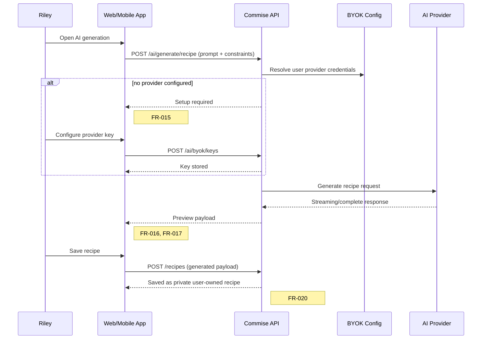
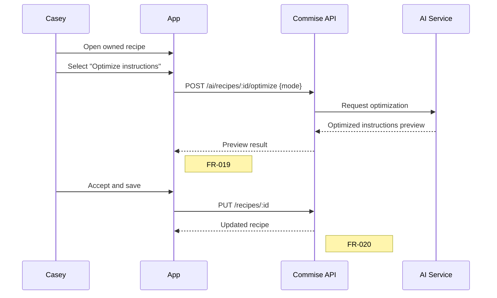
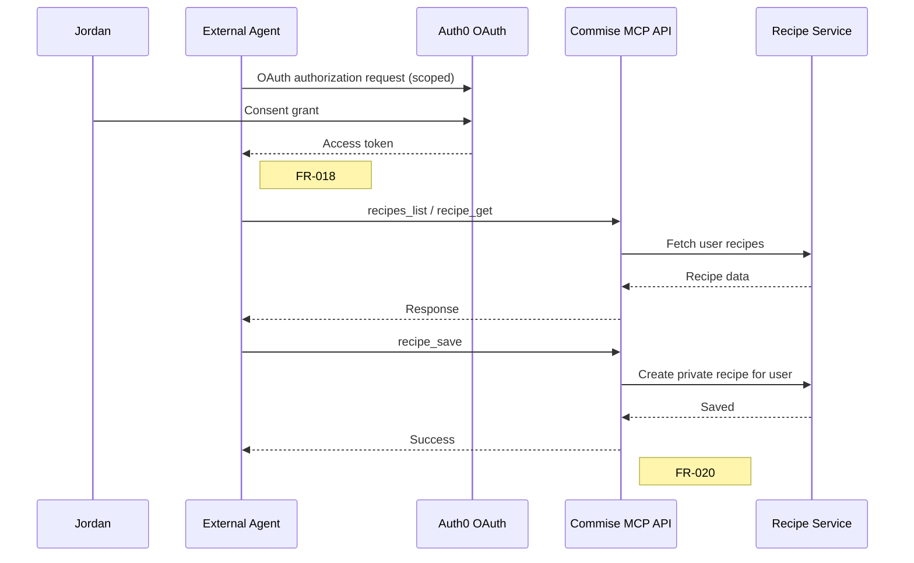

# User Journeys: AI Integration

**Branch**: `005-ai-integration`
**Date**: 2026-05-09
**Status**: Draft
**Source**: [product-spec.md](./product-spec.md), [spec.md](../spec.md)

---

## Journey Notation

Each journey covers one end-to-end flow per persona. Steps reference FR IDs in brackets.

---

## Persona 1: AI Home Cook (Riley) — Journey A: Generate and Save a Recipe In-App

**Scenario**: Riley wants a low-carb Italian dinner for four and uses in-app AI generation.

---

## Persona 2: Premium Optimizer (Casey) — Journey B: Optimize Recipe Instructions

**Scenario**: Casey opens an existing recipe and asks AI to streamline instructions.

---

## Persona 3: External-Agent Integrator (Jordan) — Journey C: Authorize Agent, Read Collection, Save Recipe

**Scenario**: Jordan authorizes an external agent (e.g., ChatGPT/Gemini-side integration) to query and save recipes.

---

## Cross-Persona Flows

### Flow X1: Low Confidence / Hallucination Guard Fallback

1. Generation returns low-confidence indicators.
2. UI highlights issues and blocks blind save.
3. User chooses: regenerate, adjust prompt, or manual fallback.

**FR linkage**: [FR-016](../spec.md#fr-016), [FR-017](../spec.md#fr-017), [FR-020](../spec.md#fr-020)

### Flow X2: External Agent Revocation

1. User opens account integrations.
2. User revokes agent access.
3. Subsequent MCP requests with revoked grant fail authorization.

**FR linkage**: [FR-021](../spec.md#fr-021)

---

## Journey Coverage Matrix

| Journey                           | FR-015 | FR-016 | FR-017 | FR-018 | FR-019 | FR-020 | FR-021 |
| --------------------------------- | -----: | -----: | -----: | -----: | -----: | -----: | -----: |
| Journey A (In-app generate/save)  |     ✅ |     ✅ |     ✅ |      — |      — |     ✅ |      — |
| Journey B (Optimize instructions) |      — |      — |     ✅ |      — |     ✅ |     ✅ |      — |
| Journey C (External agent OAuth)  |      — |      — |      — |     ✅ |      — |     ✅ |     ✅ |
| Flow X1 (Confidence fallback)     |      — |     ✅ |     ✅ |      — |      — |     ✅ |      — |
| Flow X2 (Revocation)              |      — |      — |      — |     ✅ |      — |      — |     ✅ |
