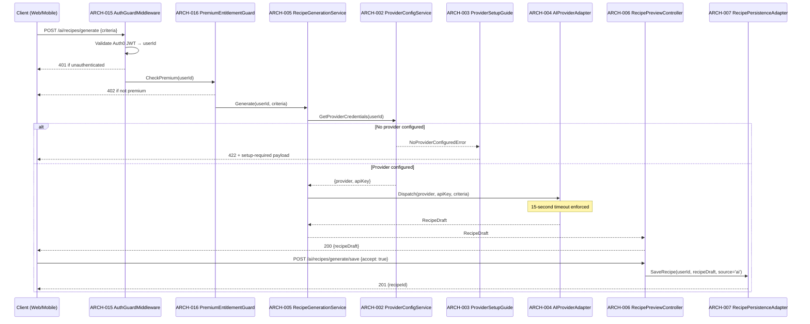
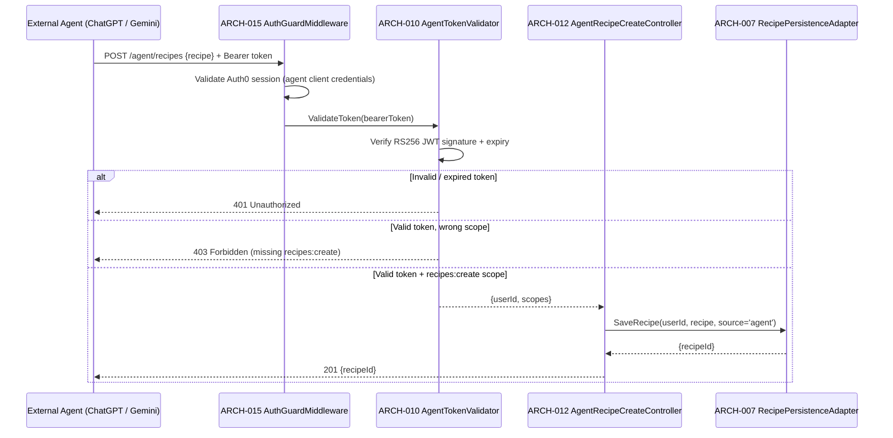
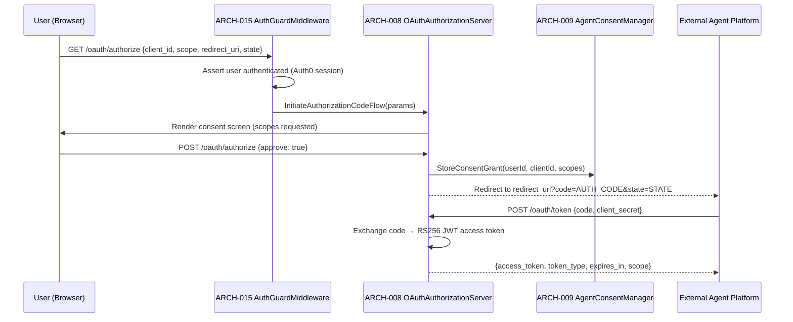

# Architecture Design: AI Integration

**Feature Branch**: `005-ai-integration`
**Created**: 2026-05-09
**Status**: Draft
**Source**: `specs/005-ai-integration/v-model/system-design.md`

## Overview

The AI Integration architecture decomposes eight system components into seventeen architecture modules organized across four Kruchten 4+1 views. The Logical View separates credential management, provider dispatch, recipe lifecycle, OAuth authorization, external agent API, instruction optimization, and cross-cutting infrastructure into discrete, independently testable modules. The Process View captures the two critical runtime paths: in-app BYOK recipe generation and external agent recipe creation. The Interface View defines explicit contracts for every module. The Data Flow View traces credential lookup, AI dispatch, and recipe persistence chains.

## ID Schema

- **Architecture Module**: `ARCH-NNN` — sequential identifier for each module
- **Parent System Components**: Comma-separated `SYS-NNN` list per module (many-to-many)
- **Cross-Cutting Tag**: `[CROSS-CUTTING; rationale: shared infrastructure supports multiple SYS components]` for infrastructure/utility modules not traceable to a specific SYS
- Example: `ARCH-003` with Parent System Components `SYS-001, SYS-004` — module serves both components
- Example: `ARCH-010 [CROSS-CUTTING; rationale: shared infrastructure supports multiple SYS components]` — infrastructure module with rationale

## Logical View — Component Breakdown (IEEE 42010 / Kruchten 4+1)

| ARCH ID  | Name                         | Description                                                                                                                                                                                                                                                                                                                            | Parent System Components  | Type      |
| -------- | ---------------------------- | -------------------------------------------------------------------------------------------------------------------------------------------------------------------------------------------------------------------------------------------------------------------------------------------------------------------------------------- | ------------------------- | --------- |
| ARCH-001 | ProviderConfigRepository     | Reads, writes, and deletes AI provider credential records in PostgreSQL. Applies AES-256 encryption to `apiKey` before persistence and decrypts on retrieval.                                                                                                                                                                          | SYS-001                   | Service   |
| ARCH-002 | ProviderConfigService        | Orchestrates BYOK credential lifecycle: validates provider type, delegates persistence to ARCH-001, masks keys for API responses, and emits `NoProviderConfiguredError` when no key is set.                                                                                                                                            | SYS-001                   | Component |
| ARCH-003 | ProviderSetupGuide           | Detects missing provider configuration and returns a structured setup-required response that the UI renders as an onboarding flow. Invoked by ARCH-005 before dispatching generation.                                                                                                                                                  | SYS-001                   | Component |
| ARCH-004 | AIProviderAdapter            | Abstracts external AI provider HTTP calls (OpenAI, Gemini, Anthropic). Accepts a normalized `GenerationRequest`, maps to provider-specific payload, enforces 15-second timeout, returns `RecipeDraft`.                                                                                                                                 | SYS-002                   | Adapter   |
| ARCH-005 | RecipeGenerationService      | Orchestrates in-app recipe generation: retrieves credentials via ARCH-002, checks premium entitlement via ARCH-016, dispatches to ARCH-004, and returns `RecipeDraft` to ARCH-006.                                                                                                                                                     | SYS-002                   | Component |
| ARCH-006 | RecipePreviewController      | Manages the preview-and-save flow: presents `RecipeDraft` to the user, routes accept to ARCH-007, routes decline to discard (no persistence). Ensures no recipe is saved without explicit user action.                                                                                                                                 | SYS-003                   | Component |
| ARCH-007 | RecipePersistenceAdapter     | Saves accepted AI-generated recipes as private, user-owned Recipe entities via the `001-sous-chef-recipe-app` Recipe repository. Sets `ownerId`, `isPrivate: true`, and `source: 'ai'`.                                                                                                                                                | SYS-003, SYS-005          | Adapter   |
| ARCH-008 | OAuthAuthorizationServer     | Implements OAuth 2.0 authorization code flow: issues authorization codes, exchanges codes for access tokens (RS256 JWT), validates `redirect_uri`, enforces `recipes:read` / `recipes:create` scopes.                                                                                                                                  | SYS-004                   | Service   |
| ARCH-009 | AgentConsentManager          | Stores and retrieves user consent grants (agent platform, granted scopes, grant date). Exposes revocation endpoint that invalidates all tokens for a given agent authorization.                                                                                                                                                        | SYS-004                   | Component |
| ARCH-010 | AgentTokenValidator          | Validates Bearer tokens on external agent API requests: verifies RS256 JWT signature, checks expiry, extracts `userId` and `scopes[]`. Returns `UnauthorizedError` on failure.                                                                                                                                                         | SYS-004, SYS-005          | Library   |
| ARCH-011 | AgentRecipeReadController    | Handles `GET /agent/recipes` requests from authorized external agents. Validates token scope (`recipes:read`) via ARCH-010, fetches user's recipe collection, returns structured JSON.                                                                                                                                                 | SYS-005                   | Component |
| ARCH-012 | AgentRecipeCreateController  | Handles `POST /agent/recipes` requests from authorized external agents. Validates token scope (`recipes:create`) via ARCH-010, delegates persistence to ARCH-007, returns created `recipeId`.                                                                                                                                          | SYS-005                   | Component |
| ARCH-013 | InstructionOptimizerService  | Orchestrates AI instruction optimization: validates recipe ownership, checks premium entitlement via ARCH-016, retrieves credentials via ARCH-002, dispatches to ARCH-004 with optimization mode, returns `optimizedInstructions[]`.                                                                                                   | SYS-006                   | Component |
| ARCH-014 | OptimizationReviewController | Presents optimized instructions to the user for accept/reject. Routes accept to ARCH-007 (patch recipe instructions), routes reject to discard. Ensures no changes applied without user confirmation.                                                                                                                                  | SYS-006                   | Component |
| ARCH-015 | AuthGuardMiddleware          | [CROSS-CUTTING; rationale: shared infrastructure supports multiple SYS components] — Enforces authentication on all AI and agent endpoints by delegating to `002-auth0-user-auth`. Attaches `userId` to request context. Returns 401 for unauthenticated requests.                                                                     | SYS-007                   | Utility   |
| ARCH-016 | PremiumEntitlementGuard      | [CROSS-CUTTING; rationale: shared infrastructure supports multiple SYS components] — Checks whether the authenticated user holds an active premium subscription (via `010-subscriptions` integration). Returns 402 if not premium for gated features (generation, optimization).                                                       | SYS-002, SYS-006, SYS-008 | Utility   |
| ARCH-017 | TypeSafetyAndA11yEnforcer    | [CROSS-CUTTING; rationale: shared infrastructure supports multiple SYS components] — Compile-time and lint-time enforcement layer: TypeScript `strict: true` compiler config, ESLint rules for `no-any` and JSDoc coverage, Playwright accessible-name assertions for all AI UI components, color-independent state indicator linting. | SYS-008                   | Utility   |

## Process View — Dynamic Behavior (Kruchten 4+1)

### Interaction: In-App BYOK Recipe Generation

**Concurrency Model**: Event loop (Node.js async/await). Each generation request is a single async chain; no shared mutable state between requests.
**Synchronization Points**: AI provider HTTP call is awaited with a 15-second `AbortController` timeout. Recipe persistence is awaited before returning `recipeId`.

---

### Interaction: External Agent Recipe Creation

**Concurrency Model**: Event loop (Node.js async/await). Token validation is synchronous (in-memory JWT verification); persistence is async.
**Synchronization Points**: JWT verification completes before any database write. Persistence is awaited before returning `recipeId`.

---

### Interaction: OAuth 2.0 Agent Authorization Flow

**Concurrency Model**: Event loop. Authorization code exchange is stateless (code stored in short-lived cache, TTL 60 seconds).
**Synchronization Points**: Consent grant is persisted before authorization code is issued. Token exchange is atomic.

## Interface View — API Contracts (Kruchten 4+1)

### ARCH-001: ProviderConfigRepository

| Direction | Name     | Type                                                             | Format    | Constraints                                          |
| --------- | -------- | ---------------------------------------------------------------- | --------- | ---------------------------------------------------- |
| Input     | userId   | `string`                                                         | UUID      | Required; must match authenticated user              |
| Input     | provider | `'openai' \| 'gemini' \| 'anthropic'`                            | Enum      | Required on write                                    |
| Input     | apiKey   | `string`                                                         | Plaintext | Required on write; encrypted before storage          |
| Output    | config   | `{ providerId: string, provider: string, encryptedKey: Buffer }` | Object    | Null if not found                                    |
| Exception | DBError  | `DatabaseError`                                                  | Error     | Thrown on connection failure or constraint violation |

### ARCH-002: ProviderConfigService

| Direction | Name                      | Type                                                      | Format | Constraints                                       |
| --------- | ------------------------- | --------------------------------------------------------- | ------ | ------------------------------------------------- |
| Input     | userId                    | `string`                                                  | UUID   | Required                                          |
| Output    | config                    | `{ provider: string, apiKey: string, maskedKey: string }` | Object | `apiKey` decrypted; `maskedKey` for API responses |
| Exception | NoProviderConfiguredError | `NoProviderConfiguredError`                               | Error  | Thrown when no config exists for userId           |

### ARCH-003: ProviderSetupGuide

| Direction | Name         | Type                                                    | Format | Constraints                          |
| --------- | ------------ | ------------------------------------------------------- | ------ | ------------------------------------ |
| Input     | userId       | `string`                                                | UUID   | Required                             |
| Output    | setupPayload | `{ setupRequired: true, supportedProviders: string[] }` | JSON   | Returned as 422 response body        |
| Exception | None         | —                                                       | —      | Always returns a valid setup payload |

### ARCH-004: AIProviderAdapter

| Direction | Name                 | Type                                                                                  | Format | Constraints                                          |
| --------- | -------------------- | ------------------------------------------------------------------------------------- | ------ | ---------------------------------------------------- |
| Input     | provider             | `'openai' \| 'gemini' \| 'anthropic'`                                                 | Enum   | Required                                             |
| Input     | apiKey               | `string`                                                                              | String | Required; passed as Authorization header to provider |
| Input     | request              | `GenerationRequest { ingredients[], dietaryRestrictions[], cuisine, calorieTarget? }` | Object | Required; mapped to provider-specific payload        |
| Output    | recipeDraft          | `RecipeDraft { title, ingredients[], instructions[], estimatedCalories? }`            | Object | Returned within 15 seconds                           |
| Exception | ProviderTimeoutError | `ProviderTimeoutError`                                                                | Error  | Thrown after 15-second AbortController timeout       |
| Exception | ProviderAPIError     | `ProviderAPIError { statusCode, message }`                                            | Error  | Thrown on non-2xx provider response                  |

### ARCH-005: RecipeGenerationService

| Direction | Name                      | Type                        | Format | Constraints                                           |
| --------- | ------------------------- | --------------------------- | ------ | ----------------------------------------------------- |
| Input     | userId                    | `string`                    | UUID   | Required; authenticated user                          |
| Input     | criteria                  | `GenerationRequest`         | Object | Required                                              |
| Output    | recipeDraft               | `RecipeDraft`               | Object | Returned within 15 seconds end-to-end                 |
| Exception | NoProviderConfiguredError | `NoProviderConfiguredError` | Error  | Propagated from ARCH-002                              |
| Exception | NotPremiumError           | `NotPremiumError`           | Error  | Thrown by ARCH-016 if user lacks premium subscription |
| Exception | ProviderTimeoutError      | `ProviderTimeoutError`      | Error  | Propagated from ARCH-004                              |

### ARCH-006: RecipePreviewController

| Direction | Name        | Type                    | Format | Constraints                                               |
| --------- | ----------- | ----------------------- | ------ | --------------------------------------------------------- |
| Input     | recipeDraft | `RecipeDraft`           | Object | Required; from ARCH-005                                   |
| Input     | userAction  | `'accept' \| 'decline'` | Enum   | Required on save decision                                 |
| Output    | recipeId    | `string \| null`        | UUID   | Non-null only on accept; null on decline (no persistence) |
| Exception | None        | —                       | —      | Decline path is always a no-op; no error thrown           |

### ARCH-007: RecipePersistenceAdapter

| Direction | Name        | Type              | Format | Constraints                       |
| --------- | ----------- | ----------------- | ------ | --------------------------------- |
| Input     | userId      | `string`          | UUID   | Required; becomes `ownerId`       |
| Input     | recipeDraft | `RecipeDraft`     | Object | Required                          |
| Input     | source      | `'ai' \| 'agent'` | Enum   | Required; stored on Recipe entity |
| Output    | recipeId    | `string`          | UUID   | ID of persisted Recipe entity     |
| Exception | DBError     | `DatabaseError`   | Error  | Thrown on persistence failure     |

### ARCH-008: OAuthAuthorizationServer

| Direction | Name               | Type                                     | Format          | Constraints                                     |
| --------- | ------------------ | ---------------------------------------- | --------------- | ----------------------------------------------- |
| Input     | client_id          | `string`                                 | String          | Required; must match registered agent client    |
| Input     | redirect_uri       | `string`                                 | URL             | Required; must match pre-registered URI         |
| Input     | scope              | `string`                                 | Space-delimited | Must be subset of `recipes:read recipes:create` |
| Input     | state              | `string`                                 | Opaque          | Required; echoed back to prevent CSRF           |
| Output    | authorizationCode  | `string`                                 | Opaque          | Short-lived (60 s); exchanged for access token  |
| Output    | accessToken        | `string`                                 | RS256 JWT       | 1-hour TTL; contains `userId`, `scopes`, `exp`  |
| Exception | InvalidClientError | `OAuthError { error: 'invalid_client' }` | JSON            | Thrown on unknown `client_id`                   |
| Exception | AccessDeniedError  | `OAuthError { error: 'access_denied' }`  | JSON            | Thrown when user rejects consent                |

### ARCH-009: AgentConsentManager

| Direction | Name               | Type                                                                       | Format | Constraints                                              |
| --------- | ------------------ | -------------------------------------------------------------------------- | ------ | -------------------------------------------------------- |
| Input     | userId             | `string`                                                                   | UUID   | Required                                                 |
| Input     | clientId           | `string`                                                                   | String | Required                                                 |
| Input     | scopes             | `string[]`                                                                 | Array  | Required; subset of `['recipes:read', 'recipes:create']` |
| Output    | grant              | `{ grantId: string, grantedAt: Date, scopes: string[], revoked: boolean }` | Object | Null if no grant exists                                  |
| Exception | GrantNotFoundError | `GrantNotFoundError`                                                       | Error  | Thrown on revocation of non-existent grant               |

### ARCH-010: AgentTokenValidator

| Direction | Name              | Type                                                | Format    | Constraints                                                  |
| --------- | ----------------- | --------------------------------------------------- | --------- | ------------------------------------------------------------ |
| Input     | bearerToken       | `string`                                            | RS256 JWT | Required; from Authorization header                          |
| Output    | claims            | `{ userId: string, scopes: string[], exp: number }` | Object    | Returned on valid token                                      |
| Exception | UnauthorizedError | `UnauthorizedError`                                 | Error     | Thrown on invalid signature, expired token, or missing token |
| Exception | ForbiddenError    | `ForbiddenError { requiredScope: string }`          | Error     | Thrown when token lacks required scope                       |

### ARCH-011: AgentRecipeReadController

| Direction | Name              | Type                | Format | Constraints                                  |
| --------- | ----------------- | ------------------- | ------ | -------------------------------------------- |
| Input     | bearerToken       | `string`            | JWT    | Required; must have `recipes:read` scope     |
| Output    | recipes           | `Recipe[]`          | JSON   | Structured array of user's recipe collection |
| Exception | UnauthorizedError | `UnauthorizedError` | Error  | Propagated from ARCH-010                     |
| Exception | ForbiddenError    | `ForbiddenError`    | Error  | Propagated from ARCH-010 (wrong scope)       |

### ARCH-012: AgentRecipeCreateController

| Direction | Name              | Type                | Format | Constraints                                |
| --------- | ----------------- | ------------------- | ------ | ------------------------------------------ |
| Input     | bearerToken       | `string`            | JWT    | Required; must have `recipes:create` scope |
| Input     | recipe            | `RecipeDraft`       | JSON   | Required; validated before persistence     |
| Output    | recipeId          | `string`            | UUID   | ID of created Recipe entity                |
| Exception | UnauthorizedError | `UnauthorizedError` | Error  | Propagated from ARCH-010                   |
| Exception | ForbiddenError    | `ForbiddenError`    | Error  | Propagated from ARCH-010 (wrong scope)     |
| Exception | ValidationError   | `ValidationError`   | Error  | Thrown on malformed `RecipeDraft`          |

### ARCH-013: InstructionOptimizerService

| Direction | Name                  | Type                         | Format | Constraints                                           |
| --------- | --------------------- | ---------------------------- | ------ | ----------------------------------------------------- |
| Input     | userId                | `string`                     | UUID   | Required; must be recipe owner                        |
| Input     | recipeId              | `string`                     | UUID   | Required                                              |
| Input     | mode                  | `'simplify' \| 'streamline'` | Enum   | Required                                              |
| Output    | optimizedInstructions | `string[]`                   | Array  | Returned within 15 seconds                            |
| Exception | NotOwnerError         | `NotOwnerError`              | Error  | Thrown if userId does not own recipeId                |
| Exception | NotPremiumError       | `NotPremiumError`            | Error  | Thrown by ARCH-016 if user lacks premium subscription |
| Exception | ProviderTimeoutError  | `ProviderTimeoutError`       | Error  | Propagated from ARCH-004                              |

### ARCH-014: OptimizationReviewController

| Direction | Name                  | Type                    | Format | Constraints                                           |
| --------- | --------------------- | ----------------------- | ------ | ----------------------------------------------------- |
| Input     | optimizedInstructions | `string[]`              | Array  | Required; from ARCH-013                               |
| Input     | userAction            | `'accept' \| 'decline'` | Enum   | Required on review decision                           |
| Output    | recipeId              | `string \| null`        | UUID   | Non-null only on accept (recipe instructions patched) |
| Exception | None                  | —                       | —      | Decline path is always a no-op                        |

### ARCH-015: AuthGuardMiddleware

| Direction | Name              | Type                | Format | Constraints                                       |
| --------- | ----------------- | ------------------- | ------ | ------------------------------------------------- |
| Input     | httpRequest       | `Request`           | HTTP   | Required; inspects Authorization / session cookie |
| Output    | userId            | `string`            | UUID   | Attached to request context on success            |
| Exception | UnauthorizedError | `UnauthorizedError` | Error  | Returns HTTP 401; request processing halted       |

### ARCH-016: PremiumEntitlementGuard

| Direction | Name            | Type              | Format | Constraints                                         |
| --------- | --------------- | ----------------- | ------ | --------------------------------------------------- |
| Input     | userId          | `string`          | UUID   | Required                                            |
| Output    | isPremium       | `boolean`         | Bool   | `true` if active premium subscription               |
| Exception | NotPremiumError | `NotPremiumError` | Error  | Returns HTTP 402; thrown when `isPremium === false` |

### ARCH-017: TypeSafetyAndA11yEnforcer

| Direction | Name          | Type                      | Format       | Constraints                                          |
| --------- | ------------- | ------------------------- | ------------ | ---------------------------------------------------- |
| Input     | sourceFiles   | `TypeScript source files` | `.ts / .tsx` | Compile-time; enforced by `tsc --strict`             |
| Output    | compileResult | `{ errors: TSError[] }`   | Compile      | Zero errors required; CI gate                        |
| Exception | CompileError  | `TSError`                 | Error        | Build fails on any `strict` violation or `any` usage |

## Data Flow View — Data Transformation Chains (Kruchten 4+1)

### Data Flow: BYOK Recipe Generation

| Stage | Module                            | Input Format                                               | Transformation                                       | Output Format                                          |
| ----- | --------------------------------- | ---------------------------------------------------------- | ---------------------------------------------------- | ------------------------------------------------------ |
| 1     | ARCH-015 AuthGuardMiddleware      | HTTP request + Auth0 JWT                                   | Validate JWT → extract `userId`                      | Request context `{ userId }`                           |
| 2     | ARCH-016 PremiumEntitlementGuard  | `{ userId }`                                               | Query 010-subscriptions → check active premium       | `{ isPremium: true }` or 402                           |
| 3     | ARCH-005 RecipeGenerationService  | `{ userId, criteria: GenerationRequest }`                  | Orchestrate credential fetch + provider dispatch     | `RecipeDraft`                                          |
| 4     | ARCH-002 ProviderConfigService    | `{ userId }`                                               | Decrypt stored API key from ARCH-001                 | `{ provider, apiKey }`                                 |
| 5     | ARCH-004 AIProviderAdapter        | `{ provider, apiKey, criteria }`                           | Map to provider payload → HTTP call → parse response | `RecipeDraft { title, ingredients[], instructions[] }` |
| 6     | ARCH-006 RecipePreviewController  | `RecipeDraft`                                              | Present to user → await accept/decline               | `{ userAction: 'accept' \| 'decline' }`                |
| 7     | ARCH-007 RecipePersistenceAdapter | `{ userId, recipeDraft, source: 'ai' }` (accept path only) | Map to Recipe entity → persist to PostgreSQL         | `{ recipeId: UUID }`                                   |

### Data Flow: External Agent Recipe Creation

| Stage | Module                               | Input Format                               | Transformation                                          | Output Format                            |
| ----- | ------------------------------------ | ------------------------------------------ | ------------------------------------------------------- | ---------------------------------------- |
| 1     | ARCH-015 AuthGuardMiddleware         | HTTP request + agent client credentials    | Validate agent client session                           | Request context (agent identity)         |
| 2     | ARCH-010 AgentTokenValidator         | Bearer token (RS256 JWT)                   | Verify signature + expiry → extract `userId`, `scopes`  | `{ userId, scopes: ['recipes:create'] }` |
| 3     | ARCH-012 AgentRecipeCreateController | `{ userId, recipe: RecipeDraft }`          | Validate `RecipeDraft` schema → delegate to persistence | Validated `RecipeDraft`                  |
| 4     | ARCH-007 RecipePersistenceAdapter    | `{ userId, recipeDraft, source: 'agent' }` | Map to Recipe entity → persist to PostgreSQL            | `{ recipeId: UUID }`                     |

### Data Flow: AI Provider Credential Storage

| Stage | Module                            | Input Format                               | Transformation                                  | Output Format                         |
| ----- | --------------------------------- | ------------------------------------------ | ----------------------------------------------- | ------------------------------------- |
| 1     | ARCH-015 AuthGuardMiddleware      | HTTP request + Auth0 JWT                   | Validate JWT → extract `userId`                 | Request context `{ userId }`          |
| 2     | ARCH-002 ProviderConfigService    | `{ userId, provider, apiKey }`             | Validate provider enum → delegate to ARCH-001   | Validated config object               |
| 3     | ARCH-001 ProviderConfigRepository | `{ userId, provider, apiKey (plaintext) }` | AES-256 encrypt `apiKey` → upsert to PostgreSQL | `{ providerId, provider, maskedKey }` |

---

## Coverage Summary

| Metric                                 | Count                                                                                                                                                                                                             |
| -------------------------------------- | ----------------------------------------------------------------------------------------------------------------------------------------------------------------------------------------------------------------- |
| Total Architecture Modules (ARCH)      | 17                                                                                                                                                                                                                |
| Cross-Cutting Modules                  | 3 (ARCH-015, ARCH-016, ARCH-017)                                                                                                                                                                                  |
| Total Parent System Components Covered | 8 / 8 (100%)                                                                                                                                                                                                      |
| Modules per Type                       | Component: 8 \| Service: 3 \| Adapter: 2 \| Library: 1 \| Utility: 3                                                                                                                                              |
| **Forward Coverage (SYS→ARCH)**        | **100%** — SYS-001 → ARCH-001,002,003; SYS-002 → ARCH-004,005; SYS-003 → ARCH-006,007; SYS-004 → ARCH-008,009,010; SYS-005 → ARCH-010,011,012; SYS-006 → ARCH-013,014; SYS-007 → ARCH-015; SYS-008 → ARCH-016,017 |

## Derived Modules

None — all modules trace to existing system components.

## Physical View — Deployment Topology

The feature deploys within the Sous Chef AWS/serverless topology. Client-facing web/mobile modules run in their respective application packages. Backend API, worker, queue, database, cache, storage, observability, and infrastructure modules deploy to the configured AWS account and region. Each ARCH module maps to the runtime described in the Logical View and the package/source paths listed in the Development View.

## Development View — Source Organization

Implementation modules are organized by platform and service boundary: web code under Next.js application packages, mobile code under Expo packages, backend services under API/Lambda packages, shared contracts under shared TypeScript packages, and infrastructure under CDK/IaC packages. This view constrains ownership, build boundaries, and deployment units for every ARCH-NNN module listed above.

## Scenarios — Architecture Validation

Primary scenarios validate the 4+1 architecture: successful request flow through user-facing entrypoints, dependency failure propagation through process boundaries, data persistence and retrieval through storage boundaries, and deployment/change isolation through development-view package ownership. Each scenario traces back to the SYS coverage listed on ARCH rows.
