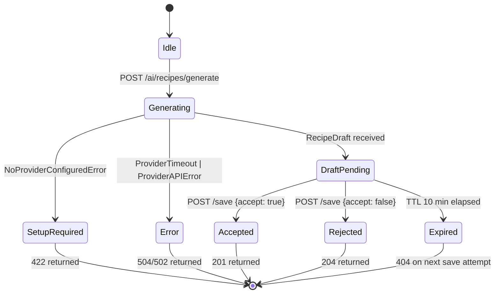
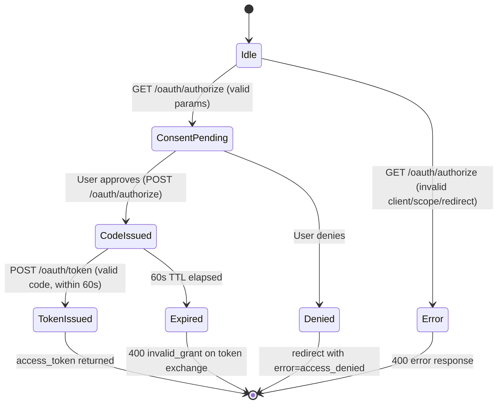
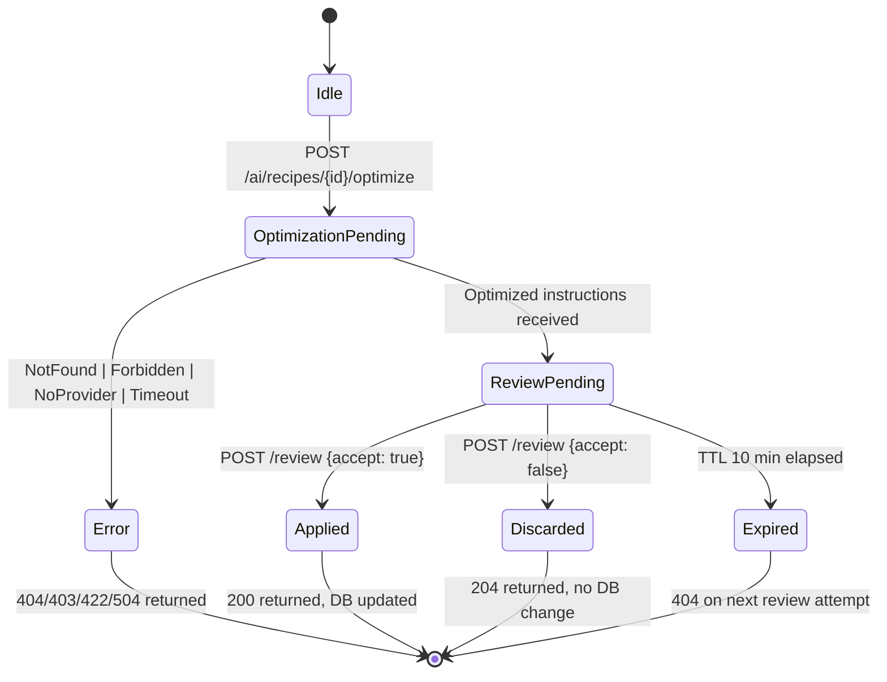

# Module Design: AI Integration

**Feature Branch**: `005-ai-integration`
**Created**: 2026-05-09
**Status**: Draft
**Source**: `specs/005-ai-integration/v-model/architecture-design.md`

## Overview

The AI Integration module design decomposes seventeen architecture modules (`ARCH-001` through `ARCH-017`) into twenty low-level module specifications (`MOD-001` through `MOD-020`). Complex orchestration modules (ARCH-002, ARCH-005, ARCH-008) are split into focused sub-modules to keep each MOD a single-responsibility unit. Every module is specified with four mandatory views — Algorithmic/Logic, State Machine, Internal Data Structures, and Error Handling — at a level of detail where writing the actual TypeScript source code is a direct translation exercise requiring no further design decisions.

## ID Schema

- **Module Design**: `MOD-NNN` — sequential identifier for each module (3-digit zero-padded)
- **Parent Architecture Modules**: Comma-separated `ARCH-NNN` list per module (many-to-many, authoritative for traceability)
- **Target Source File(s)**: Comma-separated file paths mapping to the repository codebase
- Example: `MOD-003` with Parent Architecture Modules `ARCH-001, ARCH-004` — module serves both architecture components
- Example: `MOD-007 [EXTERNAL]` — third-party library wrapper, documents interface only

## Module Designs

---

### Module: MOD-001 (ProviderConfigRepository — CRUD Operations)

**Parent Architecture Modules**: ARCH-001
**Target Source File(s)**: `src/ai/provider-config/provider-config.repository.ts`

#### Algorithmic / Logic View

```pseudocode
FUNCTION upsertProviderConfig(userId: string, provider: ProviderEnum, apiKey: string) -> ProviderConfigRecord:
    // Step 1: Validate inputs
    IF userId IS NULL OR userId IS EMPTY:
        THROW ValidationError("userId required")
    IF provider NOT IN ['openai', 'gemini', 'anthropic']:
        THROW ValidationError("Invalid provider")
    IF apiKey IS NULL OR apiKey IS EMPTY:
        THROW ValidationError("apiKey required")

    // Step 2: Encrypt apiKey using AES-256-GCM
    iv = crypto.randomBytes(12)                          // 96-bit IV
    cipher = createCipheriv('aes-256-gcm', AES_KEY, iv)
    encryptedKey = cipher.update(apiKey, 'utf8', 'hex') + cipher.final('hex')
    authTag = cipher.getAuthTag().toString('hex')
    encryptedPayload = iv.hex + ':' + authTag + ':' + encryptedKey

    // Step 3: Upsert into provider_configs table
    record = db.query(
        "INSERT INTO provider_configs (user_id, provider, encrypted_api_key, updated_at)
         VALUES ($1, $2, $3, NOW())
         ON CONFLICT (user_id, provider) DO UPDATE
         SET encrypted_api_key = EXCLUDED.encrypted_api_key, updated_at = NOW()
         RETURNING *",
        [userId, provider, encryptedPayload]
    )
    RETURN record

FUNCTION getProviderConfig(userId: string, provider: ProviderEnum) -> ProviderConfigRecord | NULL:
    // Step 1: Query database
    row = db.query(
        "SELECT * FROM provider_configs WHERE user_id = $1 AND provider = $2",
        [userId, provider]
    )
    IF row IS NULL:
        RETURN NULL

    // Step 2: Decrypt apiKey
    [ivHex, authTagHex, encryptedKey] = row.encrypted_api_key.split(':')
    iv = Buffer.from(ivHex, 'hex')
    authTag = Buffer.from(authTagHex, 'hex')
    decipher = createDecipheriv('aes-256-gcm', AES_KEY, iv)
    decipher.setAuthTag(authTag)
    decryptedKey = decipher.update(encryptedKey, 'hex', 'utf8') + decipher.final('utf8')
    RETURN { ...row, apiKey: decryptedKey }

FUNCTION deleteProviderConfig(userId: string, provider: ProviderEnum) -> void:
    db.query(
        "DELETE FROM provider_configs WHERE user_id = $1 AND provider = $2",
        [userId, provider]
    )
    // No error if row does not exist (idempotent delete)

FUNCTION listProviderConfigs(userId: string) -> ProviderConfigRecord[]:
    rows = db.query(
        "SELECT user_id, provider, updated_at FROM provider_configs WHERE user_id = $1",
        [userId]
    )
    // NOTE: apiKey is NOT decrypted in list — masked at service layer
    RETURN rows
```

#### State Machine View

N/A — Stateless (each function is a discrete database operation with no retained state between calls)

#### Internal Data Structures

| Name                 | Type                                                         | Size/Constraints              | Initialization                              | Description                                     |
| -------------------- | ------------------------------------------------------------ | ----------------------------- | ------------------------------------------- | ----------------------------------------------- |
| AES_KEY              | `Buffer`                                                     | 32 bytes (256-bit)            | From env `AI_ENCRYPTION_KEY` at module load | AES-256-GCM symmetric key for apiKey encryption |
| iv                   | `Buffer`                                                     | 12 bytes (96-bit)             | `crypto.randomBytes(12)` per write          | GCM initialization vector; unique per upsert    |
| encryptedPayload     | `string`                                                     | `ivHex:authTagHex:ciphertext` | Constructed per upsert                      | Stored in `encrypted_api_key` column            |
| ProviderEnum         | `'openai' \| 'gemini' \| 'anthropic'`                        | 3 values                      | Compile-time constant                       | Valid provider identifiers                      |
| ProviderConfigRecord | `{ userId, provider, encryptedApiKey?, apiKey?, updatedAt }` | —                             | Returned from DB query                      | Row shape from `provider_configs` table         |

#### Error Handling & Return Codes

| Error Condition                  | Error Code / Exception | Architecture Contract                  | Recovery                                  |
| -------------------------------- | ---------------------- | -------------------------------------- | ----------------------------------------- |
| `userId` null or empty           | `ValidationError`      | ARCH-001 Input constraint              | Caller receives 400; no DB operation      |
| Invalid provider enum value      | `ValidationError`      | ARCH-001 Input constraint              | Caller receives 400; no DB operation      |
| AES key missing from env         | `ConfigurationError`   | ARCH-001 — module fails to initialize  | Process exits at startup; not recoverable |
| GCM auth tag mismatch on decrypt | `DecryptionError`      | ARCH-001 — data integrity violation    | Re-throw; caller receives 500             |
| DB connection failure            | `DatabaseError`        | ARCH-001 — propagated to service layer | Re-throw; caller receives 503             |

---

### Module: MOD-002 (ProviderConfigService — Credential Lifecycle Orchestrator)

**Parent Architecture Modules**: ARCH-002
**Target Source File(s)**: `src/ai/provider-config/provider-config.service.ts`

#### Algorithmic / Logic View

```pseudocode
FUNCTION saveProviderCredentials(userId: string, provider: ProviderEnum, apiKey: string) -> MaskedProviderConfig:
    // Step 1: Validate provider type
    IF provider NOT IN SUPPORTED_PROVIDERS:
        THROW ValidationError("Unsupported provider: " + provider)

    // Step 2: Delegate persistence to repository
    record = ProviderConfigRepository.upsertProviderConfig(userId, provider, apiKey)

    // Step 3: Return masked response (never expose raw key)
    RETURN {
        userId: record.userId,
        provider: record.provider,
        apiKeyMasked: '****' + apiKey.slice(-4),
        updatedAt: record.updatedAt
    }

FUNCTION getProviderCredentials(userId: string) -> { provider: ProviderEnum, apiKey: string }:
    // Step 1: Find first configured provider (priority: openai > gemini > anthropic)
    FOR provider IN ['openai', 'gemini', 'anthropic']:
        record = ProviderConfigRepository.getProviderConfig(userId, provider)
        IF record IS NOT NULL:
            RETURN { provider: record.provider, apiKey: record.apiKey }

    // Step 2: No provider found
    THROW NoProviderConfiguredError("No AI provider configured for user: " + userId)

FUNCTION deleteProviderCredentials(userId: string, provider: ProviderEnum) -> void:
    ProviderConfigRepository.deleteProviderConfig(userId, provider)

FUNCTION listProviderCredentials(userId: string) -> MaskedProviderConfig[]:
    records = ProviderConfigRepository.listProviderConfigs(userId)
    RETURN records.map(r => {
        userId: r.userId,
        provider: r.provider,
        apiKeyMasked: '****',
        updatedAt: r.updatedAt
    })
```

#### State Machine View

N/A — Stateless

#### Internal Data Structures

| Name                 | Type                                            | Size/Constraints | Initialization                      | Description                                 |
| -------------------- | ----------------------------------------------- | ---------------- | ----------------------------------- | ------------------------------------------- |
| SUPPORTED_PROVIDERS  | `string[]`                                      | 3 elements       | `['openai', 'gemini', 'anthropic']` | Compile-time constant; valid provider list  |
| MaskedProviderConfig | `{ userId, provider, apiKeyMasked, updatedAt }` | —                | Constructed per call                | Safe response shape; never includes raw key |

#### Error Handling & Return Codes

| Error Condition                 | Error Code / Exception      | Architecture Contract                        | Recovery                                  |
| ------------------------------- | --------------------------- | -------------------------------------------- | ----------------------------------------- |
| Unsupported provider value      | `ValidationError`           | ARCH-002 — 400 to caller                     | Caught at controller; 400 response        |
| No provider configured for user | `NoProviderConfiguredError` | ARCH-002 Interface — triggers ARCH-003 guide | Caught by ARCH-005; routes to setup guide |
| Repository throws DatabaseError | `DatabaseError`             | ARCH-002 — propagated                        | Re-throw; controller returns 503          |

---

### Module: MOD-003 (ProviderSetupGuide — Setup Payload Generator)

**Parent Architecture Modules**: ARCH-003
**Target Source File(s)**: `src/ai/provider-config/provider-setup-guide.service.ts`

#### Algorithmic / Logic View

```pseudocode
FUNCTION generateSetupPayload(userId: string) -> SetupPayload:
    // Step 1: Build supported providers list from compile-time constant
    supportedProviders = ['openai', 'gemini', 'anthropic']

    // Step 2: Build setup links map
    setupLinks = {
        openai: 'https://platform.openai.com/api-keys',
        gemini: 'https://aistudio.google.com/app/apikey',
        anthropic: 'https://console.anthropic.com/settings/keys'
    }

    // Step 3: Return structured payload (always succeeds — no exceptions)
    RETURN {
        setupRequired: true,
        supportedProviders: supportedProviders,
        setupLinks: setupLinks,
        message: 'Configure an AI provider to enable recipe generation.'
    }
```

#### State Machine View

N/A — Stateless

#### Internal Data Structures

| Name               | Type                                                                                                        | Size/Constraints | Initialization        | Description                   |
| ------------------ | ----------------------------------------------------------------------------------------------------------- | ---------------- | --------------------- | ----------------------------- |
| SetupPayload       | `{ setupRequired: true, supportedProviders: string[], setupLinks: Record<string,string>, message: string }` | —                | Constructed per call  | 422 response body shape       |
| supportedProviders | `string[]`                                                                                                  | 3 elements       | Compile-time constant | Providers users can configure |
| setupLinks         | `Record<string, string>`                                                                                    | 3 keys           | Compile-time constant | Provider API key console URLs |

#### Error Handling & Return Codes

| Error Condition | Error Code / Exception | Architecture Contract                   | Recovery                |
| --------------- | ---------------------- | --------------------------------------- | ----------------------- |
| None            | —                      | ARCH-003 — always returns valid payload | N/A — function is total |

---

### Module: MOD-004 (AIProviderAdapter — Provider Dispatch & Response Normalization)

**Parent Architecture Modules**: ARCH-004
**Target Source File(s)**: `src/ai/provider/ai-provider.adapter.ts`

#### Algorithmic / Logic View

```pseudocode
FUNCTION dispatch(provider: ProviderEnum, apiKey: string, request: GenerationRequest) -> RecipeDraft:
    // Step 1: Map GenerationRequest to provider-specific payload
    payload = buildProviderPayload(provider, request)

    // Step 2: Set up AbortController for 15-second timeout
    controller = new AbortController()
    timeoutHandle = setTimeout(() => controller.abort(), 15_000)

    // Step 3: Execute HTTP call to provider API
    TRY:
        response = await fetch(PROVIDER_ENDPOINTS[provider], {
            method: 'POST',
            headers: {
                'Authorization': 'Bearer ' + apiKey,
                'Content-Type': 'application/json'
            },
            body: JSON.stringify(payload),
            signal: controller.signal
        })
        clearTimeout(timeoutHandle)
    CATCH AbortError:
        THROW ProviderTimeoutError("Provider did not respond within 15 seconds")

    // Step 4: Check HTTP status
    IF response.status NOT IN [200, 201]:
        body = await response.json()
        THROW ProviderAPIError({ statusCode: response.status, message: body.error?.message ?? 'Unknown error' })

    // Step 5: Parse and normalize response to RecipeDraft
    raw = await response.json()
    RETURN normalizeResponse(provider, raw)

FUNCTION buildProviderPayload(provider: ProviderEnum, request: GenerationRequest) -> object:
    base = {
        ingredients: request.ingredients,
        dietaryRestrictions: request.dietaryRestrictions,
        cuisine: request.cuisine,
        calorieTarget: request.calorieTarget ?? null
    }
    SWITCH provider:
        CASE 'openai':
            RETURN {
                model: 'gpt-4o',
                messages: [{ role: 'user', content: buildOpenAIPrompt(base) }],
                response_format: { type: 'json_object' }
            }
        CASE 'gemini':
            RETURN {
                contents: [{ parts: [{ text: buildGeminiPrompt(base) }] }],
                generationConfig: { responseMimeType: 'application/json' }
            }
        CASE 'anthropic':
            RETURN {
                model: 'claude-3-5-sonnet-20241022',
                max_tokens: 2048,
                messages: [{ role: 'user', content: buildAnthropicPrompt(base) }]
            }

FUNCTION normalizeResponse(provider: ProviderEnum, raw: object) -> RecipeDraft:
    SWITCH provider:
        CASE 'openai':
            parsed = JSON.parse(raw.choices[0].message.content)
        CASE 'gemini':
            parsed = JSON.parse(raw.candidates[0].content.parts[0].text)
        CASE 'anthropic':
            parsed = JSON.parse(raw.content[0].text)
    RETURN {
        title: parsed.title,
        ingredients: parsed.ingredients,       // string[]
        instructions: parsed.instructions,     // string[]
        estimatedCalories: parsed.estimatedCalories ?? null
    }
```

#### State Machine View

N/A — Stateless

#### Internal Data Structures

| Name               | Type                                                                                                | Size/Constraints | Initialization                     | Description                                       |
| ------------------ | --------------------------------------------------------------------------------------------------- | ---------------- | ---------------------------------- | ------------------------------------------------- |
| PROVIDER_ENDPOINTS | `Record<ProviderEnum, string>`                                                                      | 3 keys           | Compile-time constant              | Base URLs for each provider's chat completion API |
| GenerationRequest  | `{ ingredients: string[], dietaryRestrictions: string[], cuisine: string, calorieTarget?: number }` | —                | Input from caller                  | Normalized generation criteria                    |
| RecipeDraft        | `{ title: string, ingredients: string[], instructions: string[], estimatedCalories?: number }`      | —                | Constructed from provider response | Normalized output shape                           |
| controller         | `AbortController`                                                                                   | 1 per call       | `new AbortController()`            | Enforces 15-second timeout                        |
| timeoutHandle      | `NodeJS.Timeout`                                                                                    | 1 per call       | `setTimeout(..., 15_000)`          | Cleared on success; fires abort on timeout        |

#### Error Handling & Return Codes

| Error Condition                  | Error Code / Exception                     | Architecture Contract                       | Recovery                     |
| -------------------------------- | ------------------------------------------ | ------------------------------------------- | ---------------------------- |
| Provider no response in 15s      | `ProviderTimeoutError`                     | ARCH-004 Interface — propagated to ARCH-005 | Re-throw; caller returns 504 |
| Provider returns non-2xx         | `ProviderAPIError { statusCode, message }` | ARCH-004 Interface — propagated to ARCH-005 | Re-throw; caller returns 502 |
| Response JSON parse failure      | `ProviderParseError`                       | ARCH-004 — normalization failure            | Re-throw; caller returns 502 |
| Missing required fields in draft | `ProviderParseError`                       | ARCH-004 — incomplete response              | Re-throw; caller returns 502 |

---

### Module: MOD-005 (RecipeGenerationService — Generation Orchestrator)

**Parent Architecture Modules**: ARCH-005
**Target Source File(s)**: `src/ai/generation/recipe-generation.service.ts`

#### Algorithmic / Logic View

```pseudocode
FUNCTION generateRecipe(userId: string, criteria: GenerationRequest) -> RecipeDraft:
    // Step 1: Retrieve provider credentials (throws NoProviderConfiguredError if none)
    credentials = ProviderConfigService.getProviderCredentials(userId)

    // Step 2: Dispatch to AI provider adapter
    recipeDraft = AIProviderAdapter.dispatch(
        credentials.provider,
        credentials.apiKey,
        criteria
    )

    // Step 3: Return draft (not persisted yet — user must accept)
    RETURN recipeDraft
```

#### State Machine View

N/A — Stateless

#### Internal Data Structures

| Name        | Type                                         | Size/Constraints | Initialization | Description                                 |
| ----------- | -------------------------------------------- | ---------------- | -------------- | ------------------------------------------- |
| credentials | `{ provider: ProviderEnum, apiKey: string }` | —                | From ARCH-002  | Decrypted provider credentials for dispatch |

#### Error Handling & Return Codes

| Error Condition        | Error Code / Exception      | Architecture Contract                     | Recovery                                  |
| ---------------------- | --------------------------- | ----------------------------------------- | ----------------------------------------- |
| No provider configured | `NoProviderConfiguredError` | ARCH-005 — routes to ARCH-003 setup guide | Caught at controller; 422 + setup payload |
| Provider timeout       | `ProviderTimeoutError`      | ARCH-005 — propagated                     | Re-throw; controller returns 504          |
| Provider API error     | `ProviderAPIError`          | ARCH-005 — propagated                     | Re-throw; controller returns 502          |

---

### Module: MOD-006 (RecipePreviewController — Preview & Accept/Reject Handler)

**Parent Architecture Modules**: ARCH-006
**Target Source File(s)**: `src/ai/generation/recipe-preview.controller.ts`

#### Algorithmic / Logic View

```pseudocode
FUNCTION handleGenerateRequest(userId: string, criteria: GenerationRequest) -> HTTP 200 | 422 | 502 | 504:
    // Step 1: Delegate to generation service
    TRY:
        recipeDraft = RecipeGenerationService.generateRecipe(userId, criteria)
        // Step 2: Store draft in session cache (TTL 10 minutes)
        draftKey = 'draft:' + userId + ':' + uuid()
        SessionCache.set(draftKey, recipeDraft, TTL_10_MIN)
        RETURN HTTP 200 { recipeDraft, draftKey }
    CATCH NoProviderConfiguredError:
        setupPayload = ProviderSetupGuide.generateSetupPayload(userId)
        RETURN HTTP 422 setupPayload
    CATCH ProviderTimeoutError:
        RETURN HTTP 504 { error: 'AI provider timed out' }
    CATCH ProviderAPIError as e:
        RETURN HTTP 502 { error: e.message }

FUNCTION handleSaveRequest(userId: string, draftKey: string, accept: boolean) -> HTTP 201 | 204 | 404:
    // Step 1: Retrieve draft from session cache
    recipeDraft = SessionCache.get(draftKey)
    IF recipeDraft IS NULL:
        RETURN HTTP 404 { error: 'Draft not found or expired' }

    // Step 2: Branch on user decision
    IF accept IS TRUE:
        recipe = RecipePersistenceAdapter.saveRecipe(userId, recipeDraft, source='ai')
        SessionCache.delete(draftKey)
        RETURN HTTP 201 { recipeId: recipe.id }
    ELSE:
        // Reject: discard draft, no persistence
        SessionCache.delete(draftKey)
        RETURN HTTP 204
```

#### State Machine View



#### Internal Data Structures

| Name         | Type                                                | Size/Constraints          | Initialization         | Description                             |
| ------------ | --------------------------------------------------- | ------------------------- | ---------------------- | --------------------------------------- |
| draftKey     | `string`                                            | `'draft:{userId}:{uuid}'` | Generated per request  | Cache key for pending recipe draft      |
| TTL_10_MIN   | `number`                                            | `600` (seconds)           | Compile-time constant  | Draft expiry in session cache           |
| SessionCache | `Map<string, RecipeDraft>` (or Redis in production) | Bounded by TTL            | Module-level singleton | Temporary storage for unaccepted drafts |

#### Error Handling & Return Codes

| Error Condition              | Error Code / Exception      | Architecture Contract          | Recovery                            |
| ---------------------------- | --------------------------- | ------------------------------ | ----------------------------------- |
| Draft key not found in cache | —                           | ARCH-006 — 404 response        | Return 404; client must re-generate |
| NoProviderConfiguredError    | `NoProviderConfiguredError` | ARCH-006 — 422 + setup payload | Caught; delegate to ARCH-003        |
| ProviderTimeoutError         | `ProviderTimeoutError`      | ARCH-006 — 504 response        | Caught; return 504                  |
| ProviderAPIError             | `ProviderAPIError`          | ARCH-006 — 502 response        | Caught; return 502                  |

---

### Module: MOD-007 (RecipePersistenceAdapter — AI Recipe Save)

**Parent Architecture Modules**: ARCH-007
**Target Source File(s)**: `src/ai/generation/recipe-persistence.adapter.ts`

#### Algorithmic / Logic View

```pseudocode
FUNCTION saveRecipe(userId: string, recipeDraft: RecipeDraft, source: 'ai' | 'agent') -> Recipe:
    // Step 1: Build Recipe entity
    recipe = {
        ownerId: userId,
        title: recipeDraft.title,
        ingredients: recipeDraft.ingredients,
        instructions: recipeDraft.instructions,
        estimatedCalories: recipeDraft.estimatedCalories ?? null,
        isPrivate: true,                    // Always private for AI-generated recipes
        source: source,                     // 'ai' or 'agent'
        createdAt: NOW()
    }

    // Step 2: Delegate to 001-commise-recipe-app Recipe repository
    savedRecipe = RecipeRepository.create(recipe)

    // Step 3: Return persisted entity with generated ID
    RETURN savedRecipe
```

#### State Machine View

N/A — Stateless

#### Internal Data Structures

| Name   | Type                                                                                                      | Size/Constraints | Initialization       | Description                   |
| ------ | --------------------------------------------------------------------------------------------------------- | ---------------- | -------------------- | ----------------------------- |
| Recipe | `{ id, ownerId, title, ingredients[], instructions[], estimatedCalories?, isPrivate, source, createdAt }` | —                | Constructed per call | Persisted recipe entity shape |

#### Error Handling & Return Codes

| Error Condition              | Error Code / Exception | Architecture Contract           | Recovery                     |
| ---------------------------- | ---------------------- | ------------------------------- | ---------------------------- |
| RecipeRepository write fails | `DatabaseError`        | ARCH-007 — propagated to caller | Re-throw; caller returns 503 |
| Invalid recipe shape         | `ValidationError`      | ARCH-007 — data integrity       | Re-throw; caller returns 400 |

---

### Module: MOD-008 (OAuthAuthorizationServer — Authorization Code Flow)

**Parent Architecture Modules**: ARCH-008
**Target Source File(s)**: `src/ai/oauth/oauth-authorization.server.ts`

#### Algorithmic / Logic View

```pseudocode
FUNCTION initiateAuthorizationCodeFlow(params: OAuthAuthorizeParams) -> void (renders consent screen):
    // Step 1: Validate client_id
    client = OAuthClientRegistry.findById(params.clientId)
    IF client IS NULL:
        THROW OAuthError('invalid_client')

    // Step 2: Validate redirect_uri (exact match against registered URIs)
    IF params.redirectUri NOT IN client.registeredRedirectUris:
        THROW OAuthError('invalid_redirect_uri')

    // Step 3: Validate requested scopes
    invalidScopes = params.scopes.filter(s => s NOT IN ['recipes:read', 'recipes:create'])
    IF invalidScopes.length > 0:
        THROW OAuthError('invalid_scope')

    // Step 4: Render consent screen (delegated to view layer)
    RENDER ConsentScreen({ clientName: client.name, scopes: params.scopes, state: params.state })

FUNCTION approveAuthorization(userId: string, clientId: string, scopes: string[], state: string, redirectUri: string) -> RedirectResponse:
    // Step 1: Generate authorization code (cryptographically random, 32 bytes)
    authCode = crypto.randomBytes(32).toString('hex')

    // Step 2: Store code in short-lived cache (TTL 60 seconds)
    AuthCodeCache.set(authCode, { userId, clientId, scopes, redirectUri, expiresAt: NOW() + 60s })

    // Step 3: Persist consent grant
    AgentConsentManager.storeConsentGrant(userId, clientId, scopes)

    // Step 4: Redirect to redirect_uri with code and state
    RETURN Redirect(redirectUri + '?code=' + authCode + '&state=' + state)

FUNCTION exchangeCodeForToken(code: string, clientId: string, clientSecret: string, redirectUri: string) -> TokenResponse:
    // Step 1: Retrieve and validate code from cache
    grant = AuthCodeCache.get(code)
    IF grant IS NULL:
        THROW OAuthError('invalid_grant')
    IF grant.expiresAt < NOW():
        AuthCodeCache.delete(code)
        THROW OAuthError('invalid_grant', 'Authorization code expired')
    IF grant.clientId != clientId:
        THROW OAuthError('invalid_client')
    IF grant.redirectUri != redirectUri:
        THROW OAuthError('invalid_grant', 'redirect_uri mismatch')

    // Step 2: Validate client secret
    client = OAuthClientRegistry.findById(clientId)
    IF NOT bcrypt.compare(clientSecret, client.hashedSecret):
        THROW OAuthError('invalid_client')

    // Step 3: Delete code (single-use)
    AuthCodeCache.delete(code)

    // Step 4: Issue RS256 JWT access token
    token = jwt.sign(
        { sub: grant.userId, scopes: grant.scopes, iss: 'commise', aud: clientId },
        RS256_PRIVATE_KEY,
        { algorithm: 'RS256', expiresIn: '1h' }
    )
    RETURN { access_token: token, token_type: 'Bearer', expires_in: 3600, scope: grant.scopes.join(' ') }
```

#### State Machine View



#### Internal Data Structures

| Name                 | Type                                                                      | Size/Constraints   | Initialization                     | Description                               |
| -------------------- | ------------------------------------------------------------------------- | ------------------ | ---------------------------------- | ----------------------------------------- |
| AuthCodeCache        | `Map<string, AuthCodeGrant>`                                              | Bounded by TTL 60s | Module-level singleton (or Redis)  | Short-lived authorization code store      |
| AuthCodeGrant        | `{ userId, clientId, scopes, redirectUri, expiresAt }`                    | —                  | Constructed per approval           | Payload stored with each auth code        |
| RS256_PRIVATE_KEY    | `string` (PEM)                                                            | 2048-bit RSA       | From env `OAUTH_RS256_PRIVATE_KEY` | Signs JWT access tokens                   |
| OAuthAuthorizeParams | `{ clientId, redirectUri, scopes: string[], state: string }`              | —                  | From HTTP query params             | Incoming authorization request parameters |
| TokenResponse        | `{ access_token, token_type: 'Bearer', expires_in: 3600, scope: string }` | —                  | Constructed per exchange           | OAuth 2.0 token response body             |

#### Error Handling & Return Codes

| Error Condition                | Error Code / Exception               | Architecture Contract   | Recovery                    |
| ------------------------------ | ------------------------------------ | ----------------------- | --------------------------- |
| Unknown client_id              | `OAuthError('invalid_client')`       | ARCH-008 — 400 response | Return 400 with error JSON  |
| redirect_uri not registered    | `OAuthError('invalid_redirect_uri')` | ARCH-008 — 400 response | Return 400; do NOT redirect |
| Invalid scope requested        | `OAuthError('invalid_scope')`        | ARCH-008 — 400 response | Return 400 with error JSON  |
| Auth code not found or expired | `OAuthError('invalid_grant')`        | ARCH-008 — 400 response | Return 400; code is deleted |
| Client secret mismatch         | `OAuthError('invalid_client')`       | ARCH-008 — 401 response | Return 401                  |

---

### Module: MOD-009 (AgentConsentManager — Consent Grant Storage & Revocation)

**Parent Architecture Modules**: ARCH-009
**Target Source File(s)**: `src/ai/oauth/agent-consent.manager.ts`

#### Algorithmic / Logic View

```pseudocode
FUNCTION storeConsentGrant(userId: string, clientId: string, scopes: string[]) -> ConsentGrant:
    grant = {
        userId: userId,
        clientId: clientId,
        scopes: scopes,
        grantedAt: NOW()
    }
    // Upsert: replace existing grant for same userId+clientId
    saved = db.query(
        "INSERT INTO agent_consent_grants (user_id, client_id, scopes, granted_at)
         VALUES ($1, $2, $3, NOW())
         ON CONFLICT (user_id, client_id) DO UPDATE
         SET scopes = EXCLUDED.scopes, granted_at = NOW()
         RETURNING *",
        [userId, clientId, JSON.stringify(scopes)]
    )
    RETURN saved

FUNCTION getConsentGrant(userId: string, clientId: string) -> ConsentGrant | NULL:
    row = db.query(
        "SELECT * FROM agent_consent_grants WHERE user_id = $1 AND client_id = $2",
        [userId, clientId]
    )
    RETURN row ?? NULL

FUNCTION revokeConsentGrant(userId: string, clientId: string) -> void:
    // Step 1: Delete consent grant
    db.query(
        "DELETE FROM agent_consent_grants WHERE user_id = $1 AND client_id = $2",
        [userId, clientId]
    )
    // Step 2: Invalidate all active tokens for this agent authorization
    // (Tokens are short-lived JWTs; revocation is tracked via a denylist)
    TokenDenylist.addEntry(userId, clientId, expiresAt=NOW() + 1h)
```

#### State Machine View

N/A — Stateless (each function is a discrete database operation)

#### Internal Data Structures

| Name          | Type                                                      | Size/Constraints | Initialization | Description                                        |
| ------------- | --------------------------------------------------------- | ---------------- | -------------- | -------------------------------------------------- |
| ConsentGrant  | `{ userId, clientId, scopes: string[], grantedAt: Date }` | —                | From DB row    | Persisted consent record                           |
| TokenDenylist | `Set<{ userId, clientId, expiresAt }>` (or Redis set)     | Bounded by TTL   | Module-level   | Tracks revoked authorizations for token validation |

#### Error Handling & Return Codes

| Error Condition               | Error Code / Exception | Architecture Contract                 | Recovery                         |
| ----------------------------- | ---------------------- | ------------------------------------- | -------------------------------- |
| DB write fails                | `DatabaseError`        | ARCH-009 — propagated to OAuth server | Re-throw; OAuth flow returns 503 |
| Revoke for non-existent grant | —                      | ARCH-009 — idempotent; no error       | No-op; return success            |

---

### Module: MOD-010 (AgentTokenValidator — RS256 JWT Verification)

**Parent Architecture Modules**: ARCH-010
**Target Source File(s)**: `src/ai/oauth/agent-token.validator.ts`

#### Algorithmic / Logic View

```pseudocode
FUNCTION validateToken(bearerToken: string) -> { userId: string, scopes: string[] }:
    // Step 1: Extract token from Authorization header
    IF bearerToken IS NULL OR NOT bearerToken.startsWith('Bearer '):
        THROW UnauthorizedError('Missing or malformed Authorization header')
    token = bearerToken.slice(7)

    // Step 2: Verify RS256 signature and standard claims
    TRY:
        payload = jwt.verify(token, RS256_PUBLIC_KEY, {
            algorithms: ['RS256'],
            issuer: 'commise'
        })
    CATCH JsonWebTokenError:
        THROW UnauthorizedError('Invalid token signature')
    CATCH TokenExpiredError:
        THROW UnauthorizedError('Token expired')

    // Step 3: Check token denylist (revoked consent)
    IF TokenDenylist.contains(payload.sub, payload.aud):
        THROW UnauthorizedError('Token revoked')

    // Step 4: Return extracted claims
    RETURN { userId: payload.sub, scopes: payload.scopes }
```

#### State Machine View

N/A — Stateless

#### Internal Data Structures

| Name             | Type                        | Size/Constraints | Initialization                    | Description                           |
| ---------------- | --------------------------- | ---------------- | --------------------------------- | ------------------------------------- |
| RS256_PUBLIC_KEY | `string` (PEM)              | 2048-bit RSA     | From env `OAUTH_RS256_PUBLIC_KEY` | Verifies JWT signatures from ARCH-008 |
| TokenDenylist    | `Set` (shared with MOD-009) | Bounded by TTL   | Module-level reference            | Revoked authorization lookup          |

#### Error Handling & Return Codes

| Error Condition                 | Error Code / Exception | Architecture Contract          | Recovery                           |
| ------------------------------- | ---------------------- | ------------------------------ | ---------------------------------- |
| Missing/malformed Authorization | `UnauthorizedError`    | ARCH-010 — 401 to agent caller | Caught at controller; 401 response |
| Invalid JWT signature           | `UnauthorizedError`    | ARCH-010 — 401 to agent caller | Caught at controller; 401 response |
| Expired JWT                     | `UnauthorizedError`    | ARCH-010 — 401 to agent caller | Caught at controller; 401 response |
| Token in denylist (revoked)     | `UnauthorizedError`    | ARCH-010 — 401 to agent caller | Caught at controller; 401 response |

---

### Module: MOD-011 (AgentRecipeReadController — GET /agent/recipes)

**Parent Architecture Modules**: ARCH-011
**Target Source File(s)**: `src/ai/agent/agent-recipe-read.controller.ts`

#### Algorithmic / Logic View

```pseudocode
FUNCTION handleGetRecipes(authorizationHeader: string) -> HTTP 200 | 401 | 403:
    // Step 1: Validate token and extract claims
    TRY:
        claims = AgentTokenValidator.validateToken(authorizationHeader)
    CATCH UnauthorizedError as e:
        RETURN HTTP 401 { error: e.message }

    // Step 2: Check scope
    IF 'recipes:read' NOT IN claims.scopes:
        RETURN HTTP 403 { error: 'Insufficient scope: recipes:read required' }

    // Step 3: Fetch user's recipe collection
    recipes = RecipeRepository.findByOwner(claims.userId, { isPrivate: null })  // all recipes

    // Step 4: Return structured JSON
    RETURN HTTP 200 {
        recipes: recipes.map(r => ({
            id: r.id,
            title: r.title,
            ingredients: r.ingredients,
            instructions: r.instructions,
            source: r.source,
            createdAt: r.createdAt
        }))
    }
```

#### State Machine View

N/A — Stateless

#### Internal Data Structures

| Name    | Type                                   | Size/Constraints | Initialization | Description                   |
| ------- | -------------------------------------- | ---------------- | -------------- | ----------------------------- |
| claims  | `{ userId: string, scopes: string[] }` | —                | From MOD-010   | Validated JWT claims          |
| recipes | `Recipe[]`                             | Unbounded        | From DB query  | User's full recipe collection |

#### Error Handling & Return Codes

| Error Condition            | Error Code / Exception | Architecture Contract   | Recovery                    |
| -------------------------- | ---------------------- | ----------------------- | --------------------------- |
| Token invalid/expired      | `UnauthorizedError`    | ARCH-011 — 401 response | Caught; return 401          |
| Missing recipes:read scope | —                      | ARCH-011 — 403 response | Return 403 with scope error |
| DB query fails             | `DatabaseError`        | ARCH-011 — propagated   | Re-throw; return 503        |

---

### Module: MOD-012 (AgentRecipeCreateController — POST /agent/recipes)

**Parent Architecture Modules**: ARCH-012
**Target Source File(s)**: `src/ai/agent/agent-recipe-create.controller.ts`

#### Algorithmic / Logic View

```pseudocode
FUNCTION handleCreateRecipe(authorizationHeader: string, body: AgentRecipeCreateBody) -> HTTP 201 | 401 | 403 | 422:
    // Step 1: Validate token and extract claims
    TRY:
        claims = AgentTokenValidator.validateToken(authorizationHeader)
    CATCH UnauthorizedError as e:
        RETURN HTTP 401 { error: e.message }

    // Step 2: Check scope
    IF 'recipes:create' NOT IN claims.scopes:
        RETURN HTTP 403 { error: 'Insufficient scope: recipes:create required' }

    // Step 3: Validate request body
    IF body.title IS NULL OR body.ingredients IS EMPTY OR body.instructions IS EMPTY:
        RETURN HTTP 422 { error: 'title, ingredients, and instructions are required' }

    // Step 4: Build RecipeDraft from agent body
    recipeDraft = {
        title: body.title,
        ingredients: body.ingredients,
        instructions: body.instructions,
        estimatedCalories: body.estimatedCalories ?? null
    }

    // Step 5: Persist via adapter
    recipe = RecipePersistenceAdapter.saveRecipe(claims.userId, recipeDraft, source='agent')

    RETURN HTTP 201 { recipeId: recipe.id }
```

#### State Machine View

N/A — Stateless

#### Internal Data Structures

| Name                  | Type                                                                                           | Size/Constraints | Initialization | Description                |
| --------------------- | ---------------------------------------------------------------------------------------------- | ---------------- | -------------- | -------------------------- |
| AgentRecipeCreateBody | `{ title: string, ingredients: string[], instructions: string[], estimatedCalories?: number }` | —                | From HTTP body | Agent-supplied recipe data |
| claims                | `{ userId: string, scopes: string[] }`                                                         | —                | From MOD-010   | Validated JWT claims       |

#### Error Handling & Return Codes

| Error Condition              | Error Code / Exception | Architecture Contract   | Recovery                    |
| ---------------------------- | ---------------------- | ----------------------- | --------------------------- |
| Token invalid/expired        | `UnauthorizedError`    | ARCH-012 — 401 response | Caught; return 401          |
| Missing recipes:create scope | —                      | ARCH-012 — 403 response | Return 403 with scope error |
| Missing required body fields | —                      | ARCH-012 — 422 response | Return 422 with field error |
| Persistence failure          | `DatabaseError`        | ARCH-012 — propagated   | Re-throw; return 503        |

---

### Module: MOD-013 (InstructionOptimizerService — Optimization Orchestrator)

**Parent Architecture Modules**: ARCH-013
**Target Source File(s)**: `src/ai/optimization/instruction-optimizer.service.ts`

#### Algorithmic / Logic View

```pseudocode
FUNCTION optimizeInstructions(userId: string, recipeId: string) -> OptimizedInstructions:
    // Step 1: Validate recipe ownership
    recipe = RecipeRepository.findById(recipeId)
    IF recipe IS NULL:
        THROW NotFoundError('Recipe not found')
    IF recipe.ownerId != userId:
        THROW ForbiddenError('Recipe does not belong to user')

    // Step 2: Check premium entitlement (delegated to ARCH-016)
    // (PremiumEntitlementGuard is middleware — already enforced before this call)

    // Step 3: Retrieve provider credentials
    credentials = ProviderConfigService.getProviderCredentials(userId)

    // Step 4: Build optimization request
    optimizationRequest = {
        ingredients: recipe.ingredients,
        dietaryRestrictions: [],
        cuisine: recipe.cuisine ?? 'any',
        calorieTarget: recipe.estimatedCalories ?? null,
        mode: 'optimize',
        existingInstructions: recipe.instructions
    }

    // Step 5: Dispatch to AI provider adapter
    result = AIProviderAdapter.dispatch(
        credentials.provider,
        credentials.apiKey,
        optimizationRequest
    )

    // Step 6: Return optimized instructions array
    RETURN { optimizedInstructions: result.instructions }
```

#### State Machine View

N/A — Stateless

#### Internal Data Structures

| Name                  | Type                                                                       | Size/Constraints | Initialization       | Description                                |
| --------------------- | -------------------------------------------------------------------------- | ---------------- | -------------------- | ------------------------------------------ |
| OptimizedInstructions | `{ optimizedInstructions: string[] }`                                      | —                | From adapter         | Returned optimization result               |
| optimizationRequest   | `GenerationRequest & { mode: 'optimize', existingInstructions: string[] }` | —                | Constructed per call | Extended request with optimization context |

#### Error Handling & Return Codes

| Error Condition          | Error Code / Exception      | Architecture Contract          | Recovery                         |
| ------------------------ | --------------------------- | ------------------------------ | -------------------------------- |
| Recipe not found         | `NotFoundError`             | ARCH-013 — 404 response        | Caught at controller; 404        |
| Recipe not owned by user | `ForbiddenError`            | ARCH-013 — 403 response        | Caught at controller; 403        |
| No provider configured   | `NoProviderConfiguredError` | ARCH-013 — 422 + setup payload | Caught at controller; 422        |
| Provider timeout         | `ProviderTimeoutError`      | ARCH-013 — propagated          | Re-throw; controller returns 504 |

---

### Module: MOD-014 (OptimizationReviewController — Accept/Reject Optimized Instructions)

**Parent Architecture Modules**: ARCH-014
**Target Source File(s)**: `src/ai/optimization/optimization-review.controller.ts`

#### Algorithmic / Logic View

```pseudocode
FUNCTION handleOptimizeRequest(userId: string, recipeId: string) -> HTTP 200 | 404 | 403 | 422 | 504:
    TRY:
        result = InstructionOptimizerService.optimizeInstructions(userId, recipeId)
        // Store optimized instructions in session cache (TTL 10 minutes)
        reviewKey = 'optreview:' + userId + ':' + recipeId
        SessionCache.set(reviewKey, { recipeId, optimizedInstructions: result.optimizedInstructions }, TTL_10_MIN)
        RETURN HTTP 200 { optimizedInstructions: result.optimizedInstructions, reviewKey }
    CATCH NotFoundError:
        RETURN HTTP 404 { error: 'Recipe not found' }
    CATCH ForbiddenError:
        RETURN HTTP 403 { error: 'Access denied' }
    CATCH NoProviderConfiguredError:
        setupPayload = ProviderSetupGuide.generateSetupPayload(userId)
        RETURN HTTP 422 setupPayload
    CATCH ProviderTimeoutError:
        RETURN HTTP 504 { error: 'AI provider timed out' }

FUNCTION handleReviewDecision(userId: string, reviewKey: string, accept: boolean) -> HTTP 200 | 204 | 404:
    // Step 1: Retrieve pending review from cache
    review = SessionCache.get(reviewKey)
    IF review IS NULL:
        RETURN HTTP 404 { error: 'Review session not found or expired' }

    IF accept IS TRUE:
        // Step 2a: Patch recipe instructions in DB
        RecipeRepository.updateInstructions(review.recipeId, review.optimizedInstructions)
        SessionCache.delete(reviewKey)
        RETURN HTTP 200 { message: 'Instructions updated' }
    ELSE:
        // Step 2b: Discard — no DB changes
        SessionCache.delete(reviewKey)
        RETURN HTTP 204
```

#### State Machine View



#### Internal Data Structures

| Name       | Type     | Size/Constraints                  | Initialization        | Description                               |
| ---------- | -------- | --------------------------------- | --------------------- | ----------------------------------------- |
| reviewKey  | `string` | `'optreview:{userId}:{recipeId}'` | Generated per request | Cache key for pending optimization review |
| TTL_10_MIN | `number` | `600` (seconds)                   | Compile-time constant | Review session expiry                     |

#### Error Handling & Return Codes

| Error Condition         | Error Code / Exception | Architecture Contract   | Recovery                            |
| ----------------------- | ---------------------- | ----------------------- | ----------------------------------- |
| Review key not in cache | —                      | ARCH-014 — 404 response | Return 404; client must re-optimize |
| DB update fails         | `DatabaseError`        | ARCH-014 — propagated   | Re-throw; return 503                |

---

### Module: MOD-015 (AuthGuardMiddleware — Auth0 JWT Enforcement) [CROSS-CUTTING]

**Parent Architecture Modules**: ARCH-015
**Target Source File(s)**: `src/common/middleware/auth-guard.middleware.ts`

#### Algorithmic / Logic View

```pseudocode
FUNCTION enforce(request: HttpRequest, next: NextFunction) -> void | HTTP 401:
    // Step 1: Extract Authorization header
    authHeader = request.headers['authorization']
    IF authHeader IS NULL OR NOT authHeader.startsWith('Bearer '):
        RETURN HTTP 401 { error: 'Authentication required' }

    token = authHeader.slice(7)

    // Step 2: Verify Auth0 JWT (using 002-user-auth integration)
    TRY:
        payload = Auth0JWTVerifier.verify(token)
    CATCH TokenExpiredError:
        RETURN HTTP 401 { error: 'Token expired' }
    CATCH JsonWebTokenError:
        RETURN HTTP 401 { error: 'Invalid token' }

    // Step 3: Attach userId to request context
    request.context.userId = payload.sub

    // Step 4: Pass to next handler
    next()
```

#### State Machine View

N/A — Stateless

#### Internal Data Structures

| Name             | Type                 | Size/Constraints | Initialization             | Description                         |
| ---------------- | -------------------- | ---------------- | -------------------------- | ----------------------------------- |
| Auth0JWTVerifier | External module ref  | —                | From `002-user-auth` | Verifies Auth0-issued JWTs          |
| request.context  | `{ userId: string }` | —                | Attached per request       | Carries authenticated user identity |

#### Error Handling & Return Codes

| Error Condition              | Error Code / Exception | Architecture Contract   | Recovery                          |
| ---------------------------- | ---------------------- | ----------------------- | --------------------------------- |
| Missing Authorization header | —                      | ARCH-015 — 401 response | Return 401; request not forwarded |
| Expired Auth0 JWT            | `TokenExpiredError`    | ARCH-015 — 401 response | Return 401; request not forwarded |
| Invalid Auth0 JWT            | `JsonWebTokenError`    | ARCH-015 — 401 response | Return 401; request not forwarded |

---

### Module: MOD-016 (PremiumEntitlementGuard — Subscription Check) [CROSS-CUTTING]

**Parent Architecture Modules**: ARCH-016
**Target Source File(s)**: `src/common/guards/premium-entitlement.guard.ts`

#### Algorithmic / Logic View

```pseudocode
FUNCTION checkPremium(userId: string, next: NextFunction) -> void | HTTP 402:
    // Step 1: Query 010-subscriptions integration for active premium status
    subscription = SubscriptionsClient.getActiveSubscription(userId)

    // Step 2: Evaluate entitlement
    IF subscription IS NULL OR subscription.status != 'active':
        RETURN HTTP 402 {
            error: 'Premium subscription required',
            upgradeUrl: '/subscriptions/upgrade'
        }

    // Step 3: User is premium — pass to next handler
    next()
```

#### State Machine View

N/A — Stateless

#### Internal Data Structures

| Name                | Type                                         | Size/Constraints | Initialization             | Description                 |
| ------------------- | -------------------------------------------- | ---------------- | -------------------------- | --------------------------- |
| SubscriptionsClient | External module ref                          | —                | From `010-subscriptions`   | Queries subscription status |
| subscription        | `{ status: 'active' \| 'inactive' \| null }` | —                | From subscriptions service | Current subscription state  |

#### Error Handling & Return Codes

| Error Condition                   | Error Code / Exception    | Architecture Contract   | Recovery                           |
| --------------------------------- | ------------------------- | ----------------------- | ---------------------------------- |
| No active subscription            | —                         | ARCH-016 — 402 response | Return 402 with upgrade URL        |
| Subscriptions service unavailable | `ServiceUnavailableError` | ARCH-016 — propagated   | Re-throw; return 503 (fail closed) |

---

### Module: MOD-017 (TypeSafetyAndA11yEnforcer — Compile-Time & Lint-Time Enforcement) [CROSS-CUTTING]

**Parent Architecture Modules**: ARCH-017
**Target Source File(s)**: `tsconfig.json`, `.eslintrc.js`, `playwright.config.ts`

#### Algorithmic / Logic View

```pseudocode
// This module is a CONFIGURATION module — no runtime logic.
// Enforcement is compile-time (tsc) and lint-time (ESLint).

CONFIGURATION tsconfig.json:
    compilerOptions.strict = true
    compilerOptions.noImplicitAny = true
    compilerOptions.strictNullChecks = true
    compilerOptions.noUncheckedIndexedAccess = true

CONFIGURATION .eslintrc.js:
    rules['@typescript-eslint/no-explicit-any'] = 'error'
    rules['valid-jsdoc'] = 'warn'                          // JSDoc coverage
    rules['jsdoc/require-jsdoc'] = ['warn', { publicOnly: true }]

CONFIGURATION playwright.config.ts (a11y assertions):
    // All AI UI components MUST have accessible names
    // Enforced via @axe-core/playwright in test suite
    // Color-independent state indicators enforced via custom lint rule
    // Rule: no state communicated by color alone (WCAG 1.4.1)
```

#### State Machine View

N/A — Stateless (compile-time configuration; no runtime state)

#### Internal Data Structures

| Name            | Type                      | Size/Constraints | Initialization    | Description                                       |
| --------------- | ------------------------- | ---------------- | ----------------- | ------------------------------------------------- |
| TSError         | `{ file, line, message }` | —                | Emitted by tsc    | TypeScript compile error; CI gate fails on any    |
| ESLintViolation | `{ rule, file, line }`    | —                | Emitted by ESLint | Lint violation; CI gate fails on `error` severity |

#### Error Handling & Return Codes

| Error Condition                | Error Code / Exception | Architecture Contract     | Recovery                           |
| ------------------------------ | ---------------------- | ------------------------- | ---------------------------------- |
| `strict` TypeScript violation  | `TSError`              | ARCH-017 — CI build fails | Developer must fix before merge    |
| `no-explicit-any` ESLint error | `ESLintViolation`      | ARCH-017 — CI lint fails  | Developer must fix before merge    |
| Missing accessible name (a11y) | Playwright assertion   | ARCH-017 — CI test fails  | Developer must add aria-label/role |

---

### Module: MOD-018 (OAuthClientRegistry — Client Registration Store)

**Parent Architecture Modules**: ARCH-008
**Target Source File(s)**: `src/ai/oauth/oauth-client.registry.ts`

> [DERIVED MODULE: OAuthAuthorizationServer (ARCH-008) requires client lookup and secret validation; extracted as a separate module for single-responsibility and testability]

#### Algorithmic / Logic View

```pseudocode
FUNCTION findById(clientId: string) -> OAuthClient | NULL:
    row = db.query(
        "SELECT * FROM oauth_clients WHERE client_id = $1 AND is_active = true",
        [clientId]
    )
    RETURN row ?? NULL

FUNCTION registerClient(name: string, redirectUris: string[], scopes: string[]) -> OAuthClient:
    clientId = uuid()
    rawSecret = crypto.randomBytes(32).toString('hex')
    hashedSecret = bcrypt.hash(rawSecret, BCRYPT_ROUNDS)
    client = db.query(
        "INSERT INTO oauth_clients (client_id, name, hashed_secret, redirect_uris, allowed_scopes, is_active)
         VALUES ($1, $2, $3, $4, $5, true) RETURNING *",
        [clientId, name, hashedSecret, JSON.stringify(redirectUris), JSON.stringify(scopes)]
    )
    // Return raw secret ONCE — not stored in plaintext
    RETURN { ...client, clientSecret: rawSecret }
```

#### State Machine View

N/A — Stateless

#### Internal Data Structures

| Name          | Type                                                                                                   | Size/Constraints | Initialization        | Description                           |
| ------------- | ------------------------------------------------------------------------------------------------------ | ---------------- | --------------------- | ------------------------------------- |
| OAuthClient   | `{ clientId, name, hashedSecret, redirectUris: string[], allowedScopes: string[], isActive: boolean }` | —                | From DB row           | Registered OAuth client record        |
| BCRYPT_ROUNDS | `number`                                                                                               | `12`             | Compile-time constant | bcrypt work factor for secret hashing |

#### Error Handling & Return Codes

| Error Condition    | Error Code / Exception | Architecture Contract                     | Recovery                         |
| ------------------ | ---------------------- | ----------------------------------------- | -------------------------------- |
| DB query fails     | `DatabaseError`        | ARCH-008 — propagated to OAuth server     | Re-throw; OAuth flow returns 503 |
| clientId not found | Returns `NULL`         | ARCH-008 — caller throws `invalid_client` | Caller handles null check        |

---

### Module: MOD-019 (ProviderConfigController — HTTP Endpoint Handler)

**Parent Architecture Modules**: ARCH-002
**Target Source File(s)**: `src/ai/provider-config/provider-config.controller.ts`

> [DERIVED MODULE: ARCH-002 describes the service layer; a controller is required to expose HTTP endpoints for credential CRUD operations]

#### Algorithmic / Logic View

```pseudocode
FUNCTION handleSaveCredentials(userId: string, body: SaveCredentialsBody) -> HTTP 200 | 400 | 401:
    // userId injected by ARCH-015 AuthGuardMiddleware
    TRY:
        result = ProviderConfigService.saveProviderCredentials(userId, body.provider, body.apiKey)
        RETURN HTTP 200 result
    CATCH ValidationError as e:
        RETURN HTTP 400 { error: e.message }

FUNCTION handleListCredentials(userId: string) -> HTTP 200 | 401:
    configs = ProviderConfigService.listProviderCredentials(userId)
    RETURN HTTP 200 { providers: configs }

FUNCTION handleDeleteCredentials(userId: string, provider: ProviderEnum) -> HTTP 204 | 400 | 401:
    IF provider NOT IN ['openai', 'gemini', 'anthropic']:
        RETURN HTTP 400 { error: 'Invalid provider' }
    ProviderConfigService.deleteProviderCredentials(userId, provider)
    RETURN HTTP 204
```

#### State Machine View

N/A — Stateless

#### Internal Data Structures

| Name                | Type                                         | Size/Constraints | Initialization | Description                      |
| ------------------- | -------------------------------------------- | ---------------- | -------------- | -------------------------------- |
| SaveCredentialsBody | `{ provider: ProviderEnum, apiKey: string }` | —                | From HTTP body | Incoming credential save request |

#### Error Handling & Return Codes

| Error Condition              | Error Code / Exception | Architecture Contract                     | Recovery                                  |
| ---------------------------- | ---------------------- | ----------------------------------------- | ----------------------------------------- |
| ValidationError from service | `ValidationError`      | ARCH-002 — 400 response                   | Caught; return 400                        |
| Unauthenticated request      | —                      | ARCH-015 — 401 before reaching controller | Handled by middleware; never reaches here |

---

### Module: MOD-020 (TokenDenylist — Revocation Store) [CROSS-CUTTING]

**Parent Architecture Modules**: ARCH-009, ARCH-010
**Target Source File(s)**: `src/ai/oauth/token-denylist.ts`

> [DERIVED MODULE: Both AgentConsentManager (ARCH-009) and AgentTokenValidator (ARCH-010) require a shared revocation store; extracted as a dedicated module to avoid circular dependency]

#### Algorithmic / Logic View

```pseudocode
FUNCTION addEntry(userId: string, clientId: string, expiresAt: Date) -> void:
    key = userId + ':' + clientId
    DenylistStore.set(key, expiresAt)

FUNCTION contains(userId: string, clientId: string) -> boolean:
    key = userId + ':' + clientId
    entry = DenylistStore.get(key)
    IF entry IS NULL:
        RETURN false
    IF entry < NOW():
        // Entry expired — clean up and return false
        DenylistStore.delete(key)
        RETURN false
    RETURN true

FUNCTION cleanup() -> void:
    // Periodic cleanup of expired entries (called by scheduler every 5 minutes)
    FOR key IN DenylistStore.keys():
        IF DenylistStore.get(key) < NOW():
            DenylistStore.delete(key)
```

#### State Machine View

N/A — Stateless (store operations are discrete; no retained state machine)

#### Internal Data Structures

| Name          | Type                                | Size/Constraints | Initialization         | Description                               |
| ------------- | ----------------------------------- | ---------------- | ---------------------- | ----------------------------------------- |
| DenylistStore | `Map<string, Date>` (or Redis hash) | Bounded by TTL   | Module-level singleton | Maps `userId:clientId` → expiry timestamp |

#### Error Handling & Return Codes

| Error Condition           | Error Code / Exception    | Architecture Contract           | Recovery                               |
| ------------------------- | ------------------------- | ------------------------------- | -------------------------------------- |
| Store unavailable (Redis) | `ServiceUnavailableError` | ARCH-009/ARCH-010 — fail closed | Re-throw; token validation returns 503 |

---

## ARCH ↔ MOD Traceability Matrix

| ARCH ID  | Architecture Module Name                  | MOD ID(s)        |
| -------- | ----------------------------------------- | ---------------- |
| ARCH-001 | ProviderConfigRepository                  | MOD-001          |
| ARCH-002 | ProviderConfigService                     | MOD-002, MOD-019 |
| ARCH-003 | ProviderSetupGuide                        | MOD-003          |
| ARCH-004 | AIProviderAdapter                         | MOD-004          |
| ARCH-005 | RecipeGenerationService                   | MOD-005          |
| ARCH-006 | RecipePreviewController                   | MOD-006          |
| ARCH-007 | RecipePersistenceAdapter                  | MOD-007          |
| ARCH-008 | OAuthAuthorizationServer                  | MOD-008, MOD-018 |
| ARCH-009 | AgentConsentManager                       | MOD-009, MOD-020 |
| ARCH-010 | AgentTokenValidator                       | MOD-010, MOD-020 |
| ARCH-011 | AgentRecipeReadController                 | MOD-011          |
| ARCH-012 | AgentRecipeCreateController               | MOD-012          |
| ARCH-013 | InstructionOptimizerService               | MOD-013          |
| ARCH-014 | OptimizationReviewController              | MOD-014          |
| ARCH-015 | AuthGuardMiddleware [CROSS-CUTTING]       | MOD-015          |
| ARCH-016 | PremiumEntitlementGuard [CROSS-CUTTING]   | MOD-016          |
| ARCH-017 | TypeSafetyAndA11yEnforcer [CROSS-CUTTING] | MOD-017          |

**Coverage**: 17 / 17 ARCH modules covered ✅
**Total MOD count**: 20
