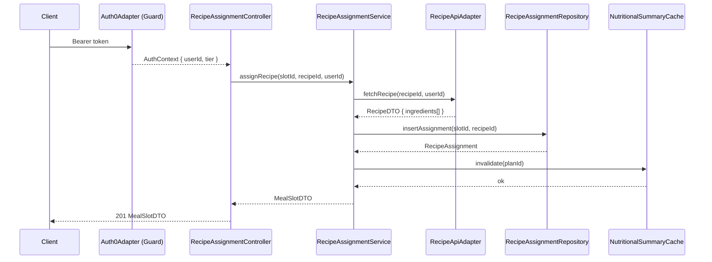
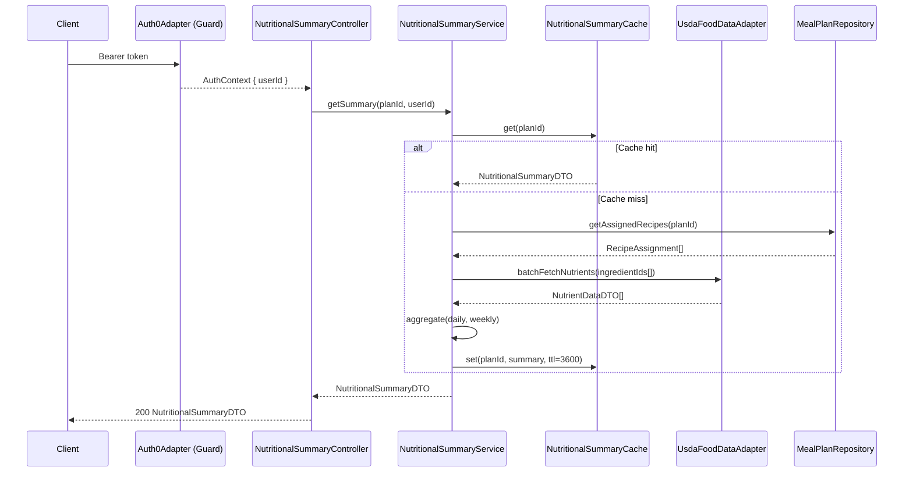
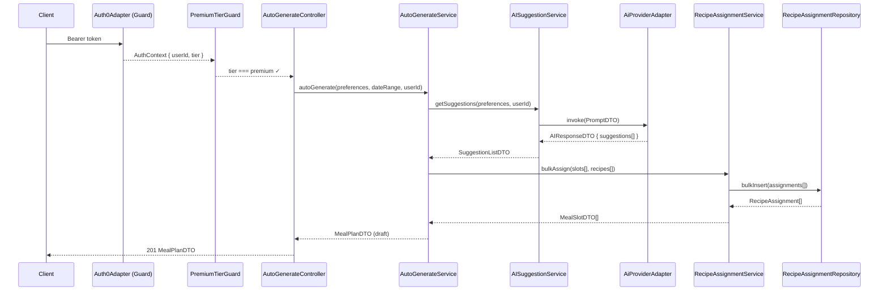
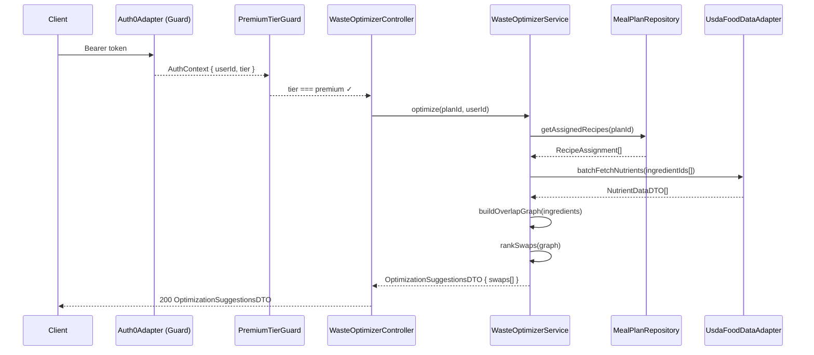

# Architecture Design: Meal Planning

**Feature Branch**: `006-meal-planning`
**Created**: 2026-05-09
**Status**: Draft
**Source**: `specs/006-meal-planning/v-model/system-design.md`

## Overview

The Meal Planning architecture decomposes eight system components into twenty-two architecture modules organized across four Kruchten 4+1 views. The decomposition follows a NestJS layered pattern consistent with the existing Commise backend: REST controllers handle HTTP concerns, domain services enforce business rules, repository modules abstract persistence, and adapter modules encapsulate external service boundaries. Cross-cutting modules address authentication middleware, caching, error handling, and TypeScript/accessibility compliance. Every SYS-NNN from system-design.md maps to at least one ARCH-NNN; infrastructure modules are tagged `[CROSS-CUTTING; rationale: shared infrastructure supports multiple SYS components]`.

## ID Schema

- **Architecture Module**: `ARCH-NNN` — sequential identifier for each module
- **Parent System Components**: Comma-separated `SYS-NNN` list per module (many-to-many)
- **Cross-Cutting Tag**: `[CROSS-CUTTING; rationale: shared infrastructure supports multiple SYS components]` for infrastructure/utility modules not traceable to a specific SYS
- Example: `ARCH-003` with Parent System Components `SYS-001, SYS-004` — module serves both components
- Example: `ARCH-010 [CROSS-CUTTING; rationale: shared infrastructure supports multiple SYS components]` — infrastructure module (e.g., Logger, Cache) with rationale

## Logical View — Component Breakdown (IEEE 42010 / Kruchten 4+1)

| ARCH ID  | Name                         | Description                                                                                                                                                                                                                                                                                                                                 | Parent System Components  | Type      |
| -------- | ---------------------------- | ------------------------------------------------------------------------------------------------------------------------------------------------------------------------------------------------------------------------------------------------------------------------------------------------------------------------------------------- | ------------------------- | --------- |
| ARCH-001 | MealPlanController           | NestJS REST controller exposing CRUD endpoints for meal plans (`POST /meal-plans`, `GET /meal-plans/:id`, `PATCH /meal-plans/:id`, `DELETE /meal-plans/:id`).                                                                                                                                                                               | SYS-001                   | Component |
| ARCH-002 | MealPlanService              | Domain service enforcing meal plan business rules: date-range validation, slot configuration, 30-day scalability constraints, and plan lifecycle state transitions.                                                                                                                                                                         | SYS-001                   | Service   |
| ARCH-003 | MealPlanRepository           | Drizzle ORM repository for `meal_plans` and `meal_slots` tables. Implements row-level security scoping by `userId`. Handles pagination for large (30+ day) plans.                                                                                                                                                                           | SYS-001                   | Component |
| ARCH-004 | RecipeAssignmentController   | NestJS REST controller exposing assignment endpoints (`POST /meal-plans/:id/slots/:slotId/recipes`, `DELETE /meal-plans/:id/slots/:slotId/recipes/:recipeId`).                                                                                                                                                                              | SYS-002                   | Component |
| ARCH-005 | RecipeAssignmentService      | Domain service managing recipe-to-slot assignment logic. Validates slot existence, delegates recipe ownership check to RecipeApiAdapter, and persists assignments.                                                                                                                                                                          | SYS-002                   | Service   |
| ARCH-006 | RecipeAssignmentRepository   | Drizzle ORM repository for `recipe_assignments` table. Supports bulk insert for auto-generated plans and cascade delete with meal slots.                                                                                                                                                                                                    | SYS-002, SYS-005          | Component |
| ARCH-007 | NutritionalSummaryController | NestJS REST controller exposing nutritional summary endpoints (`GET /meal-plans/:id/nutrition/daily`, `GET /meal-plans/:id/nutrition/weekly`).                                                                                                                                                                                              | SYS-003                   | Component |
| ARCH-008 | NutritionalSummaryService    | Orchestrates nutritional computation: fetches assigned recipes, retrieves ingredient nutrient data via UsdaFoodDataAdapter, aggregates daily and weekly totals.                                                                                                                                                                             | SYS-003                   | Service   |
| ARCH-009 | NutritionalSummaryCache      | Redis-backed cache for computed nutritional summaries. TTL of 1 hour; invalidated on any plan mutation. Prevents redundant USDA API calls within the 10-minute workflow SLA.                                                                                                                                                                | SYS-003                   | Utility   |
| ARCH-010 | AISuggestionController       | NestJS REST controller exposing AI suggestion endpoint (`POST /meal-plans/:id/suggestions`). Enforces premium-tier gate before delegating to AISuggestionService.                                                                                                                                                                           | SYS-004                   | Component |
| ARCH-011 | AISuggestionService          | Constructs AI prompts from user dietary preferences and available recipe collection, invokes AiProviderAdapter, parses and ranks returned suggestions.                                                                                                                                                                                      | SYS-004                   | Service   |
| ARCH-012 | AutoGenerateController       | NestJS REST controller exposing auto-generation endpoint (`POST /meal-plans/auto-generate`). Enforces premium-tier gate and returns a draft `MealPlanDTO`.                                                                                                                                                                                  | SYS-005                   | Component |
| ARCH-013 | AutoGenerateService          | Orchestrates full plan generation: invokes AISuggestionService for ranked recipes, calls RecipeAssignmentService for bulk slot population, returns reviewable draft plan.                                                                                                                                                                   | SYS-005                   | Service   |
| ARCH-014 | WasteOptimizerController     | NestJS REST controller exposing waste optimization endpoint (`POST /meal-plans/:id/optimize`). Enforces premium-tier gate.                                                                                                                                                                                                                  | SYS-006                   | Component |
| ARCH-015 | WasteOptimizerService        | Analyzes ingredient overlap across all assigned recipes in a plan using an in-memory graph algorithm. Produces ranked swap/rearrangement suggestions.                                                                                                                                                                                       | SYS-006                   | Service   |
| ARCH-016 | RecipeApiAdapter             | HTTP adapter wrapping the Recipe API from feature 001. Fetches recipe details and validates ownership for the authenticated user. Implements retry with exponential backoff.                                                                                                                                                                | SYS-007                   | Adapter   |
| ARCH-017 | UsdaFoodDataAdapter          | HTTP adapter wrapping the USDA food data service from feature 003. Batch-fetches nutrient data for ingredient lists. Implements circuit breaker for resilience.                                                                                                                                                                             | SYS-007                   | Adapter   |
| ARCH-018 | Auth0Adapter                 | JWT validation adapter integrating with Auth0 from feature 002. Extracts `userId` and subscription `tier` from validated tokens. Used as NestJS guard.                                                                                                                                                                                      | SYS-007                   | Adapter   |
| ARCH-019 | AiProviderAdapter            | HTTP adapter wrapping the AI provider configuration from feature 005. Sends structured prompts and parses AI responses into typed `AIResponseDTO` objects.                                                                                                                                                                                  | SYS-007                   | Adapter   |
| ARCH-020 | MealPlanPublicApiAdapter     | Outbound adapter exposing `MealPlanDTO` in a format consumable by downstream features 007 (grocery lists) and 009 (nutrition planning). Implements versioned serialization.                                                                                                                                                                 | SYS-007                   | Adapter   |
| ARCH-021 | PremiumTierGuard             | NestJS guard enforcing premium subscription checks for AI suggestions, auto-generation, and waste optimization endpoints. Reads `tier` from `AuthContext`.                                                                                                                                                                                  | SYS-004, SYS-005, SYS-006 | Component |
| ARCH-022 | QualityComplianceModule      | `[CROSS-CUTTING; rationale: shared infrastructure supports multiple SYS components]` — Enforces TypeScript strict-mode compilation (tsconfig), JSDoc linting (eslint-plugin-jsdoc), accessible component contracts (aria-label rules), and color-state accessibility rules. No runtime behavior; build-time and lint-time enforcement only. | SYS-008                   | Utility   |

## Process View — Dynamic Behavior (Kruchten 4+1)

### Interaction 1: Manual Recipe Assignment to Meal Slot

**Concurrency Model**: NestJS event loop (single-threaded async I/O); all I/O operations are non-blocking Promises.
**Synchronization Points**: Cache invalidation is fire-and-forget (no await); recipe validation is awaited before persistence.

---

### Interaction 2: Nutritional Summary Computation

**Concurrency Model**: Event loop; USDA batch fetch uses `Promise.all` for parallel ingredient lookups.
**Synchronization Points**: Cache read precedes USDA call; cache write is awaited before response.

---

### Interaction 3: AI-Powered Auto-Generation (Premium)

**Concurrency Model**: Sequential orchestration; AI invocation is a single awaited HTTP call.
**Synchronization Points**: Bulk assignment uses a database transaction; partial failure triggers full rollback.

---

### Interaction 4: Food Waste Optimization (Premium)

**Concurrency Model**: Event loop; overlap graph computation is synchronous CPU-bound work (in-memory, bounded by plan size).
**Synchronization Points**: No shared mutable state; result is ephemeral and request-scoped.

## Interface View — API Contracts (Kruchten 4+1)

### ARCH-001: MealPlanController

| Direction | Name              | Type             | Format                                                                        | Constraints                                 |
| --------- | ----------------- | ---------------- | ----------------------------------------------------------------------------- | ------------------------------------------- |
| Input     | CreateMealPlanDTO | object           | `{ name: string, startDate: ISO8601, endDate: ISO8601, slots: SlotConfig[] }` | startDate < endDate; max 365 days range     |
| Input     | UpdateMealPlanDTO | object (partial) | `{ name?: string, endDate?: ISO8601 }`                                        | endDate must not precede existing startDate |
| Output    | MealPlanDTO       | object           | `{ id, name, startDate, endDate, slots[], createdAt }`                        | Always includes slot array (may be empty)   |
| Exception | ValidationError   | HTTP 400         | `{ message, errors[] }`                                                       | On DTO constraint violation                 |
| Exception | UnauthorizedError | HTTP 401         | `{ message }`                                                                 | On missing/invalid Auth0 token              |
| Exception | NotFoundError     | HTTP 404         | `{ message }`                                                                 | On unknown planId for authenticated user    |

### ARCH-002: MealPlanService

| Direction | Name             | Type   | Format                                             | Constraints                             |
| --------- | ---------------- | ------ | -------------------------------------------------- | --------------------------------------- |
| Input     | createPlan       | method | `(dto: CreateMealPlanDTO, userId: string)`         | userId must be non-empty string         |
| Input     | updatePlan       | method | `(planId: string, dto: UpdateMealPlanDTO, userId)` | planId must exist and belong to userId  |
| Output    | MealPlan         | domain | `MealPlan` entity                                  | Validated date range; slots initialized |
| Exception | InvalidDateRange | domain | `InvalidDateRangeException`                        | Thrown when endDate ≤ startDate         |
| Exception | PlanNotFound     | domain | `PlanNotFoundException`                            | Thrown when planId not found for userId |

### ARCH-003: MealPlanRepository

| Direction | Name          | Type   | Format                                            | Constraints                                   |
| --------- | ------------- | ------ | ------------------------------------------------- | --------------------------------------------- |
| Input     | findById      | method | `(planId: string, userId: string)`                | Row-level security enforced via userId filter |
| Input     | findAll       | method | `(userId: string, pagination: PaginationDTO)`     | Default page size 20; max 100                 |
| Output    | MealPlanRow   | object | Drizzle `meal_plans` row with joined `meal_slots` | Null if not found                             |
| Exception | DatabaseError | infra  | `DatabaseException`                               | On connection failure or constraint violation |

### ARCH-004: RecipeAssignmentController

| Direction | Name                | Type     | Format                                  | Constraints                               |
| --------- | ------------------- | -------- | --------------------------------------- | ----------------------------------------- |
| Input     | AssignRecipeDTO     | object   | `{ recipeId: string }`                  | recipeId must be non-empty UUID           |
| Input     | slotId (path param) | string   | UUID                                    | Must reference existing slot in plan      |
| Output    | MealSlotDTO         | object   | `{ slotId, date, mealType, recipes[] }` | recipes array updated with new assignment |
| Exception | NotFoundError       | HTTP 404 | `{ message }`                           | On unknown slotId or recipeId             |
| Exception | UnauthorizedError   | HTTP 401 | `{ message }`                           | On missing/invalid token                  |

### ARCH-005: RecipeAssignmentService

| Direction | Name           | Type   | Format                                     | Constraints                                |
| --------- | -------------- | ------ | ------------------------------------------ | ------------------------------------------ |
| Input     | assignRecipe   | method | `(slotId, recipeId, userId)`               | Validates slot belongs to user's plan      |
| Input     | bulkAssign     | method | `(assignments: AssignRecipeDTO[], userId)` | Transactional; all-or-nothing              |
| Output    | MealSlot       | domain | Updated `MealSlot` entity                  | Includes full recipe list after assignment |
| Exception | RecipeNotFound | domain | `RecipeNotFoundException`                  | When RecipeApiAdapter returns 404          |
| Exception | SlotNotFound   | domain | `SlotNotFoundException`                    | When slotId not found for userId           |

### ARCH-006: RecipeAssignmentRepository

| Direction | Name             | Type   | Format                                  | Constraints                           |
| --------- | ---------------- | ------ | --------------------------------------- | ------------------------------------- |
| Input     | insert           | method | `(slotId: string, recipeId: string)`    | FK constraint on slotId and recipeId  |
| Input     | bulkInsert       | method | `(assignments: { slotId, recipeId }[])` | Wrapped in DB transaction             |
| Output    | RecipeAssignment | object | `{ id, slotId, recipeId, assignedAt }`  | —                                     |
| Exception | DatabaseError    | infra  | `DatabaseException`                     | On FK violation or connection failure |

### ARCH-007: NutritionalSummaryController

| Direction | Name                  | Type     | Format                                             | Constraints                           |
| --------- | --------------------- | -------- | -------------------------------------------------- | ------------------------------------- |
| Input     | planId (path param)   | string   | UUID                                               | Must reference existing plan for user |
| Output    | NutritionalSummaryDTO | object   | `{ daily: DayNutrition[], weekly: WeekNutrition }` | daily array length = plan day count   |
| Exception | NotFoundError         | HTTP 404 | `{ message }`                                      | On unknown planId                     |
| Exception | ServiceUnavailable    | HTTP 503 | `{ message }`                                      | When USDA adapter unavailable         |

### ARCH-008: NutritionalSummaryService

| Direction | Name                | Type   | Format                                                | Constraints                                     |
| --------- | ------------------- | ------ | ----------------------------------------------------- | ----------------------------------------------- |
| Input     | getSummary          | method | `(planId: string, userId: string)`                    | Checks cache first; falls back to computation   |
| Output    | NutritionalSummary  | domain | `{ daily[], weekly }` with macro/micronutrient totals | Aggregated from all assigned recipe ingredients |
| Exception | NutrientUnavailable | domain | `NutrientDataUnavailableException`                    | When USDA adapter fails                         |

### ARCH-009: NutritionalSummaryCache

| Direction | Name                          | Type   | Format                           | Constraints                                    |
| --------- | ----------------------------- | ------ | -------------------------------- | ---------------------------------------------- |
| Input     | get                           | method | `(planId: string)`               | Returns null on miss                           |
| Input     | set                           | method | `(planId, summary, ttl: number)` | TTL default 3600 seconds                       |
| Input     | invalidate                    | method | `(planId: string)`               | Fire-and-forget; no error propagation          |
| Output    | NutritionalSummaryDTO \| null | object | Cached DTO or null               | —                                              |
| Exception | CacheError                    | infra  | `CacheException` (swallowed)     | Cache failures degrade gracefully to recompute |

### ARCH-010: AISuggestionController

| Direction | Name                 | Type     | Format                                                | Constraints                               |
| --------- | -------------------- | -------- | ----------------------------------------------------- | ----------------------------------------- |
| Input     | SuggestionRequestDTO | object   | `{ preferences: DietaryPreferences, planId: string }` | Requires premium tier (enforced by guard) |
| Output    | SuggestionListDTO    | object   | `{ recipes: RecipeSuggestion[] }`                     | Ordered by AI confidence score            |
| Exception | PaymentRequired      | HTTP 402 | `{ message }`                                         | On non-premium user                       |
| Exception | ServiceUnavailable   | HTTP 503 | `{ message }`                                         | When AI provider unavailable              |

### ARCH-011: AISuggestionService

| Direction | Name              | Type   | Format                                              | Constraints                                      |
| --------- | ----------------- | ------ | --------------------------------------------------- | ------------------------------------------------ |
| Input     | getSuggestions    | method | `(preferences: DietaryPreferences, userId: string)` | Constructs prompt from preferences + recipe list |
| Output    | SuggestionListDTO | domain | `{ recipes: RecipeSuggestion[] }`                   | Parsed from AI provider response                 |
| Exception | AIProviderError   | domain | `AIProviderException`                               | On provider timeout or malformed response        |

### ARCH-012: AutoGenerateController

| Direction | Name               | Type     | Format                                             | Constraints                                  |
| --------- | ------------------ | -------- | -------------------------------------------------- | -------------------------------------------- |
| Input     | AutoGenerateDTO    | object   | `{ preferences, startDate, endDate, slotsPerDay }` | Requires premium tier; date range ≤ 365 days |
| Output    | MealPlanDTO        | object   | Draft plan with all slots populated                | Status = "draft"; user can modify            |
| Exception | PaymentRequired    | HTTP 402 | `{ message }`                                      | On non-premium user                          |
| Exception | ServiceUnavailable | HTTP 503 | `{ message }`                                      | When AI provider unavailable                 |

### ARCH-013: AutoGenerateService

| Direction | Name            | Type   | Format                                   | Constraints                                   |
| --------- | --------------- | ------ | ---------------------------------------- | --------------------------------------------- |
| Input     | autoGenerate    | method | `(dto: AutoGenerateDTO, userId: string)` | Orchestrates AISuggestionService + bulkAssign |
| Output    | MealPlanDTO     | domain | Fully populated draft plan               | Transactional; rollback on partial failure    |
| Exception | AIProviderError | domain | `AIProviderException`                    | Propagated from AISuggestionService           |
| Exception | BulkAssignError | domain | `BulkAssignException`                    | On DB transaction failure; plan rolled back   |

### ARCH-014: WasteOptimizerController

| Direction | Name                       | Type     | Format                        | Constraints                      |
| --------- | -------------------------- | -------- | ----------------------------- | -------------------------------- |
| Input     | planId (path param)        | string   | UUID                          | Requires premium tier            |
| Output    | OptimizationSuggestionsDTO | object   | `{ swaps: SwapSuggestion[] }` | Ordered by waste reduction score |
| Exception | PaymentRequired            | HTTP 402 | `{ message }`                 | On non-premium user              |
| Exception | NotFoundError              | HTTP 404 | `{ message }`                 | On unknown planId                |

### ARCH-015: WasteOptimizerService

| Direction | Name                       | Type   | Format                                | Constraints                                     |
| --------- | -------------------------- | ------ | ------------------------------------- | ----------------------------------------------- |
| Input     | optimize                   | method | `(planId: string, userId: string)`    | Reads plan from repository; ephemeral result    |
| Output    | OptimizationSuggestionsDTO | domain | `{ swaps[] }` ranked by overlap score | In-memory computation; not persisted            |
| Exception | NutrientUnavailable        | domain | `NutrientDataUnavailableException`    | When USDA adapter fails during ingredient fetch |

### ARCH-016: RecipeApiAdapter

| Direction | Name           | Type   | Format                                    | Constraints                               |
| --------- | -------------- | ------ | ----------------------------------------- | ----------------------------------------- |
| Input     | fetchRecipe    | method | `(recipeId: string, userId: string)`      | Adds auth header; validates ownership     |
| Output    | RecipeDTO      | object | `{ id, name, ingredients: Ingredient[] }` | Typed response; throws on 404             |
| Exception | RecipeNotFound | infra  | `RecipeNotFoundException`                 | On 404 from Recipe API                    |
| Exception | AdapterError   | infra  | `ExternalAdapterException`                | On network failure; retries up to 3 times |

### ARCH-017: UsdaFoodDataAdapter

| Direction | Name                | Type   | Format                                      | Constraints                                     |
| --------- | ------------------- | ------ | ------------------------------------------- | ----------------------------------------------- |
| Input     | batchFetchNutrients | method | `(ingredientIds: string[])`                 | Max batch size 50; splits into chunks if needed |
| Output    | NutrientDataDTO[]   | object | `{ ingredientId, nutrients: Nutrient[] }[]` | Parallel fetch via `Promise.all`                |
| Exception | NutrientUnavailable | infra  | `NutrientDataUnavailableException`          | On circuit breaker open or 5xx response         |

### ARCH-018: Auth0Adapter

| Direction | Name                  | Type   | Format                                          | Constraints                               |
| --------- | --------------------- | ------ | ----------------------------------------------- | ----------------------------------------- |
| Input     | validateToken         | method | `(bearerToken: string)`                         | Validates JWT signature via JWKS endpoint |
| Output    | AuthContext           | object | `{ userId: string, tier: 'free' \| 'premium' }` | Extracted from validated JWT claims       |
| Exception | UnauthorizedException | infra  | `UnauthorizedException`                         | On invalid/expired token                  |

### ARCH-019: AiProviderAdapter

| Direction | Name                | Type   | Format                      | Constraints                                    |
| --------- | ------------------- | ------ | --------------------------- | ---------------------------------------------- |
| Input     | invoke              | method | `(prompt: PromptDTO)`       | Uses AI provider config from feature 005       |
| Output    | AIResponseDTO       | object | `{ suggestions: string[] }` | Raw AI response; parsed by AISuggestionService |
| Exception | AIProviderException | infra  | `AIProviderException`       | On timeout (30s), 5xx, or malformed response   |

### ARCH-020: MealPlanPublicApiAdapter

| Direction | Name               | Type   | Format                                   | Constraints                                   |
| --------- | ------------------ | ------ | ---------------------------------------- | --------------------------------------------- |
| Input     | serialize          | method | `(plan: MealPlan, version: 'v1')`        | Versioned serialization for downstream compat |
| Output    | PublicMealPlanDTO  | object | `{ planId, slots[], nutritionSummary? }` | Consumed by features 007 and 009              |
| Exception | SerializationError | infra  | `SerializationException`                 | On unknown version or missing required fields |

### ARCH-021: PremiumTierGuard

| Direction | Name                     | Type   | Format                           | Constraints                           |
| --------- | ------------------------ | ------ | -------------------------------- | ------------------------------------- |
| Input     | canActivate              | method | `(context: ExecutionContext)`    | Reads `AuthContext.tier` from request |
| Output    | boolean                  | bool   | `true` if premium; throws if not | —                                     |
| Exception | PaymentRequiredException | infra  | HTTP 402                         | When `tier !== 'premium'`             |

### ARCH-022: QualityComplianceModule

| Direction | Name                | Type   | Format                                  | Constraints                                    |
| --------- | ------------------- | ------ | --------------------------------------- | ---------------------------------------------- |
| Input     | tsconfig.json       | config | `{ strict: true, noImplicitAny: true }` | Build-time enforcement; CI fails on violation  |
| Input     | eslint config       | config | `eslint-plugin-jsdoc`, `jsx-a11y` rules | Lint-time enforcement; CI fails on violation   |
| Output    | Compliance report   | build  | CI pass/fail                            | No runtime artifact                            |
| Exception | ComplianceViolation | build  | Build/lint failure                      | Blocks merge; must be resolved before PR merge |

## Data Flow View — Data Transformation Chains (Kruchten 4+1)

### Data Flow 1: Recipe Assignment → Nutritional Summary

| Stage | Module                   | Input Format            | Transformation                               | Output Format                  |
| ----- | ------------------------ | ----------------------- | -------------------------------------------- | ------------------------------ |
| 1     | ARCH-004 (Controller)    | HTTP POST body          | Parse + validate `AssignRecipeDTO`           | `AssignRecipeDTO`              |
| 2     | ARCH-005 (Service)       | `AssignRecipeDTO`       | Validate slot ownership; fetch recipe        | `RecipeDTO { ingredients[] }`  |
| 3     | ARCH-016 (RecipeAdapter) | `recipeId`              | HTTP GET to Recipe API; deserialize          | `RecipeDTO`                    |
| 4     | ARCH-006 (Repository)    | `{ slotId, recipeId }`  | INSERT into `recipe_assignments`             | `RecipeAssignment`             |
| 5     | ARCH-009 (Cache)         | `planId`                | Invalidate cached nutritional summary        | Cache miss on next read        |
| 6     | ARCH-008 (NutritionSvc)  | `planId`                | Fetch all assignments; batch-fetch nutrients | `NutritionalSummaryDTO`        |
| 7     | ARCH-017 (UsdaAdapter)   | `ingredientIds[]`       | HTTP GET to USDA API; deserialize            | `NutrientDataDTO[]`            |
| 8     | ARCH-008 (NutritionSvc)  | `NutrientDataDTO[]`     | Aggregate daily/weekly totals                | `NutritionalSummaryDTO`        |
| 9     | ARCH-009 (Cache)         | `NutritionalSummaryDTO` | Store with TTL=3600                          | Cached `NutritionalSummaryDTO` |

### Data Flow 2: Auto-Generation → Draft Meal Plan

| Stage | Module                  | Input Format             | Transformation                               | Output Format            |
| ----- | ----------------------- | ------------------------ | -------------------------------------------- | ------------------------ |
| 1     | ARCH-012 (Controller)   | HTTP POST body           | Parse + validate `AutoGenerateDTO`           | `AutoGenerateDTO`        |
| 2     | ARCH-021 (PremiumGuard) | `AuthContext`            | Check `tier === 'premium'`                   | Pass-through or HTTP 402 |
| 3     | ARCH-013 (AutoGenSvc)   | `AutoGenerateDTO`        | Orchestrate AI suggestions + bulk assignment | `MealPlanDTO` (draft)    |
| 4     | ARCH-011 (AISuggSvc)    | `DietaryPreferences`     | Build prompt; invoke AI provider             | `SuggestionListDTO`      |
| 5     | ARCH-019 (AiAdapter)    | `PromptDTO`              | HTTP POST to AI provider; parse response     | `AIResponseDTO`          |
| 6     | ARCH-005 (AssignSvc)    | `AssignRecipeDTO[]`      | Bulk assign recipes to slots (transactional) | `MealSlotDTO[]`          |
| 7     | ARCH-006 (Repository)   | `{ slotId, recipeId }[]` | Bulk INSERT in DB transaction                | `RecipeAssignment[]`     |
| 8     | ARCH-012 (Controller)   | `MealPlanDTO`            | Serialize draft plan                         | HTTP 201 `MealPlanDTO`   |

### Data Flow 3: Meal Plan → Downstream Consumers (007, 009)

| Stage | Module                   | Input Format        | Transformation                                      | Output Format            |
| ----- | ------------------------ | ------------------- | --------------------------------------------------- | ------------------------ |
| 1     | ARCH-003 (Repository)    | `planId`            | SELECT plan + slots + assignments                   | `MealPlan` domain entity |
| 2     | ARCH-020 (PublicAdapter) | `MealPlan`          | Versioned serialization (v1)                        | `PublicMealPlanDTO`      |
| 3     | Feature 007              | `PublicMealPlanDTO` | Extract ingredient lists for grocery list           | `GroceryListDTO`         |
| 4     | Feature 009              | `PublicMealPlanDTO` | Link plan to nutrition plan for compliance tracking | `NutritionPlanLinkDTO`   |

---

## SYS↔ARCH Traceability Matrix

| SYS ID  | SYS Name                      | ARCH Modules                                     |
| ------- | ----------------------------- | ------------------------------------------------ |
| SYS-001 | Meal Plan Manager             | ARCH-001, ARCH-002, ARCH-003                     |
| SYS-002 | Recipe Assignment Service     | ARCH-004, ARCH-005, ARCH-006                     |
| SYS-003 | Nutritional Summary Engine    | ARCH-007, ARCH-008, ARCH-009                     |
| SYS-004 | AI Meal Suggestion Service    | ARCH-010, ARCH-011, ARCH-021                     |
| SYS-005 | Meal Plan Auto-Generator      | ARCH-012, ARCH-013, ARCH-006 (shared)            |
| SYS-006 | Food Waste Optimizer          | ARCH-014, ARCH-015, ARCH-021 (shared)            |
| SYS-007 | External Integration Adapters | ARCH-016, ARCH-017, ARCH-018, ARCH-019, ARCH-020 |
| SYS-008 | Quality & Compliance Layer    | ARCH-022                                         |

---

## Coverage Summary

| Metric                            | Count                                                  |
| --------------------------------- | ------------------------------------------------------ |
| Total Architecture Modules (ARCH) | 22                                                     |
| Total Parent SYS Covered          | 8 / 8 (100%)                                           |
| Modules per Type                  | Component: 8 \| Service: 7 \| Adapter: 5 \| Utility: 2 |
| Cross-Cutting Modules             | 1 (ARCH-022)                                           |
| Derived Modules                   | 0                                                      |
| **Forward Coverage (SYS→ARCH)**   | **100%**                                               |

## Derived Modules

None — all architecture modules trace to system components from system-design.md.

## Glossary

| Term                 | Definition                                                                                                                                               |
| -------------------- | -------------------------------------------------------------------------------------------------------------------------------------------------------- |
| ARCH-NNN             | Sequential architecture module identifier; never renumbered                                                                                              |
| Cross-Cutting Module | Infrastructure/utility module serving all system components; tagged `[CROSS-CUTTING; rationale: shared infrastructure supports multiple SYS components]` |
| NestJS Guard         | Interceptor that runs before a route handler; used for auth and premium-tier enforcement                                                                 |
| Drizzle ORM          | TypeScript-first ORM used for type-safe PostgreSQL queries                                                                                               |
| Circuit Breaker      | Resilience pattern that stops calls to a failing external service after a threshold of failures                                                          |
| Row-Level Security   | PostgreSQL feature restricting data access to rows matching a `userId` predicate                                                                         |
| TTL                  | Time-to-live; duration after which a cache entry is automatically invalidated                                                                            |

## Physical View — Deployment Topology

The feature deploys within the Commise AWS/serverless topology. Client-facing web/mobile modules run in their respective application packages. Backend API, worker, queue, database, cache, storage, observability, and infrastructure modules deploy to the configured AWS account and region. Each ARCH module maps to the runtime described in the Logical View and the package/source paths listed in the Development View.

## Development View — Source Organization

Implementation modules are organized by platform and service boundary: web code under Next.js application packages, mobile code under Expo packages, backend services under API/Lambda packages, shared contracts under shared TypeScript packages, and infrastructure under CDK/IaC packages. This view constrains ownership, build boundaries, and deployment units for every ARCH-NNN module listed above.

## Scenarios — Architecture Validation

Primary scenarios validate the 4+1 architecture: successful request flow through user-facing entrypoints, dependency failure propagation through process boundaries, data persistence and retrieval through storage boundaries, and deployment/change isolation through development-view package ownership. Each scenario traces back to the SYS coverage listed on ARCH rows.
