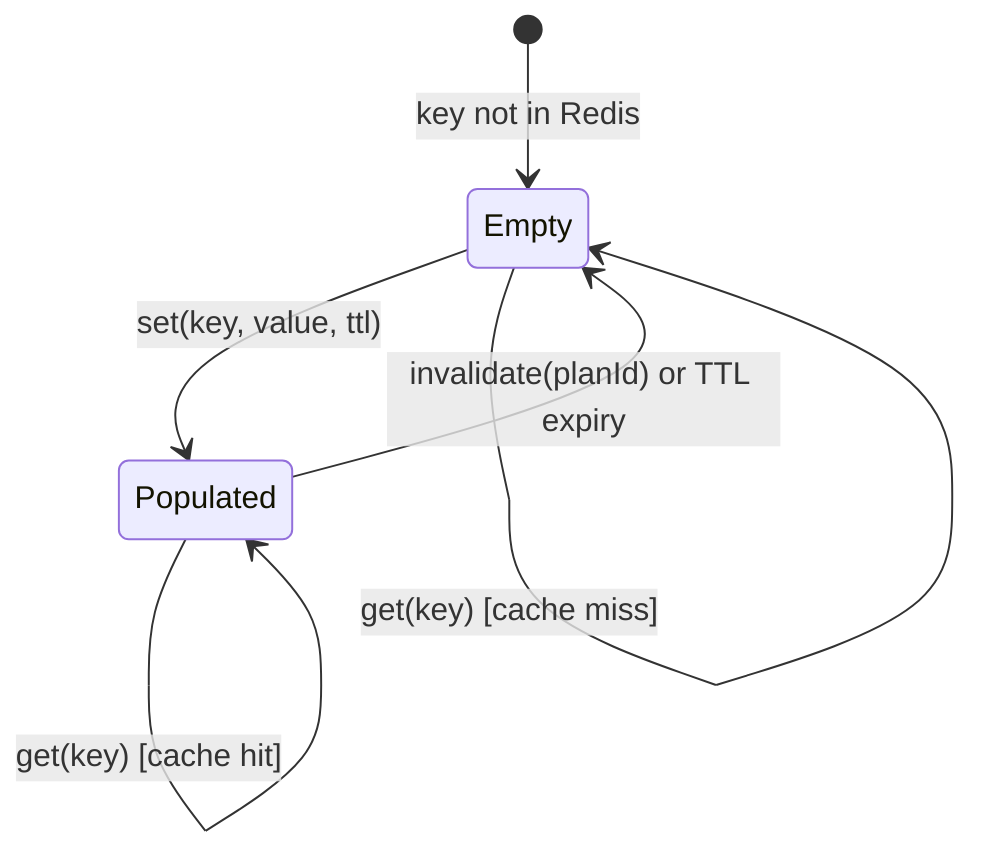
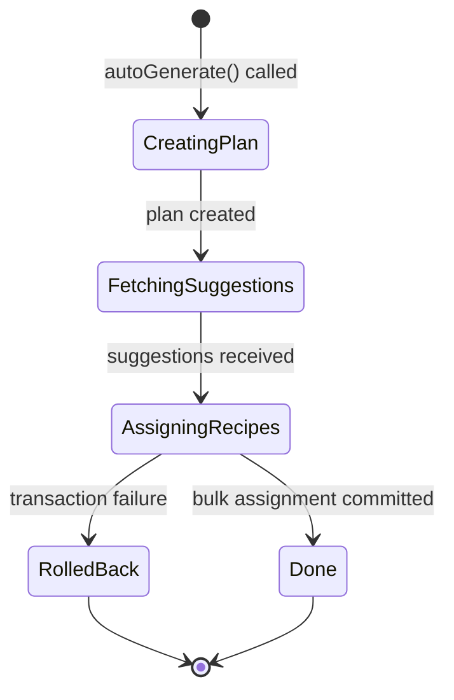
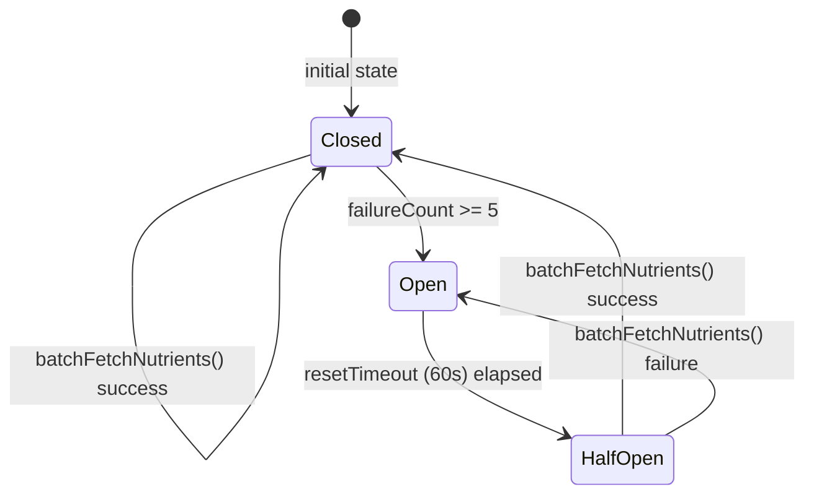

```mermaid
stateDiagram-v2
    [*] --> Draft : createPlan()
    Draft --> Active : (implicit — no explicit activation; plan is usable immediately)
    Active --> Active : updatePlan()
    Active --> Deleted : deletePlan()
    Deleted --> [*]
```

# Module Design: Meal Planning

**Feature Branch**: `006-meal-planning`
**Created**: 2026-05-09
**Status**: Draft
**Source**: `specs/006-meal-planning/v-model/architecture-design.md`

## Overview

Twenty-two architecture modules (ARCH-001 through ARCH-022) are decomposed into twenty-two low-level module designs (MOD-001 through MOD-022), one per ARCH. Controllers are stateless request-dispatch modules; services contain the core algorithmic logic with explicit state transitions where applicable; repositories encapsulate SQL generation; adapters wrap external HTTP calls; guards enforce authorization predicates; and the quality-compliance module is a build-time-only utility. Every MOD is specified at a level of detail where writing the source code is a direct translation exercise.

## ID Schema

- **Module Design**: `MOD-NNN` — sequential identifier (3-digit zero-padded)
- **Parent Architecture Modules**: Comma-separated `ARCH-NNN` list (authoritative for traceability)
- **Target Source File(s)**: Comma-separated file paths relative to repository root
- Example: `MOD-003` with Parent Architecture Modules `ARCH-003` — one-to-one mapping
- Example: `MOD-021 [CROSS-CUTTING]` — inherits cross-cutting tag from parent ARCH

## Module Designs

---

### Module: MOD-001 (MealPlanController)

**Parent Architecture Modules**: ARCH-001
**Target Source File(s)**: `src/meal-planning/controllers/meal-plan.controller.ts`

#### Algorithmic / Logic View

```pseudocode
// NestJS REST controller — pure HTTP dispatch, no business logic

FUNCTION createMealPlan(body: CreateMealPlanDTO, authContext: AuthContext) -> MealPlanDTO:
    // @Post('/meal-plans')  @UseGuards(Auth0Guard)
    userId = authContext.userId
    result = AWAIT mealPlanService.createPlan(body, userId)
    RETURN result  // HTTP 201

FUNCTION getMealPlan(planId: string, authContext: AuthContext) -> MealPlanDTO:
    // @Get('/meal-plans/:id')  @UseGuards(Auth0Guard)
    userId = authContext.userId
    result = AWAIT mealPlanService.getPlan(planId, userId)
    IF result IS NULL:
        THROW NotFoundException("Plan not found")
    RETURN result  // HTTP 200

FUNCTION updateMealPlan(planId: string, body: UpdateMealPlanDTO, authContext: AuthContext) -> MealPlanDTO:
    // @Patch('/meal-plans/:id')  @UseGuards(Auth0Guard)
    userId = authContext.userId
    result = AWAIT mealPlanService.updatePlan(planId, body, userId)
    RETURN result  // HTTP 200

FUNCTION deleteMealPlan(planId: string, authContext: AuthContext) -> void:
    // @Delete('/meal-plans/:id')  @UseGuards(Auth0Guard)
    userId = authContext.userId
    AWAIT mealPlanService.deletePlan(planId, userId)
    RETURN  // HTTP 204
```

#### State Machine View

N/A — Stateless request dispatcher; all state lives in MealPlanService and MealPlanRepository.

#### Internal Data Structures

| Name        | Type          | Size/Constraints | Initialization | Description                       |
| ----------- | ------------- | ---------------- | -------------- | --------------------------------- |
| authContext | AuthContext   | object           | Injected guard | Contains userId and tier from JWT |
| planId      | string (UUID) | 36 chars         | Route param    | Identifies the target meal plan   |

#### Error Handling & Return Codes

| Error Condition             | Error Code / Exception      | Architecture Contract                      | Recovery                  |
| --------------------------- | --------------------------- | ------------------------------------------ | ------------------------- |
| Plan not found for userId   | NotFoundException (404)     | ARCH-001 Interface View: NotFoundError     | Return 404 JSON to client |
| Invalid DTO fields          | ValidationPipe (400)        | ARCH-001 Interface View: ValidationError   | Return 400 with errors[]  |
| Missing/invalid Auth0 token | UnauthorizedException (401) | ARCH-001 Interface View: UnauthorizedError | Return 401 JSON           |

---

### Module: MOD-002 (MealPlanService)

**Parent Architecture Modules**: ARCH-002
**Target Source File(s)**: `src/meal-planning/services/meal-plan.service.ts`

#### Algorithmic / Logic View

```pseudocode
FUNCTION createPlan(dto: CreateMealPlanDTO, userId: string) -> MealPlan:
    // Validate date range
    startDate = parseISO(dto.startDate)
    endDate   = parseISO(dto.endDate)
    IF endDate <= startDate:
        THROW InvalidDateRangeException("endDate must be after startDate")
    dayCount = differenceInDays(endDate, startDate)
    IF dayCount > 365:
        THROW InvalidDateRangeException("Plan may not exceed 365 days")

    // Validate slot configuration
    FOR EACH slot IN dto.slots:
        IF slot.dayOffset < 0 OR slot.dayOffset >= dayCount:
            THROW InvalidSlotException("dayOffset out of range")
        IF slot.mealType NOT IN [BREAKFAST, LUNCH, DINNER, SNACK]:
            THROW InvalidSlotException("Unknown mealType")

    // Persist
    plan = AWAIT mealPlanRepository.insert({ userId, ...dto })
    RETURN plan

FUNCTION getPlan(planId: string, userId: string) -> MealPlan | null:
    plan = AWAIT mealPlanRepository.findByIdAndUser(planId, userId)
    RETURN plan  // null if not found (controller throws 404)

FUNCTION updatePlan(planId: string, dto: UpdateMealPlanDTO, userId: string) -> MealPlan:
    existing = AWAIT mealPlanRepository.findByIdAndUser(planId, userId)
    IF existing IS NULL:
        THROW PlanNotFoundException(planId)
    IF dto.endDate IS NOT NULL:
        newEnd = parseISO(dto.endDate)
        IF newEnd <= existing.startDate:
            THROW InvalidDateRangeException("endDate must be after existing startDate")
    updated = AWAIT mealPlanRepository.update(planId, dto)
    RETURN updated

FUNCTION deletePlan(planId: string, userId: string) -> void:
    existing = AWAIT mealPlanRepository.findByIdAndUser(planId, userId)
    IF existing IS NULL:
        THROW PlanNotFoundException(planId)
    AWAIT mealPlanRepository.delete(planId)
```

#### State Machine View



#### Internal Data Structures

| Name      | Type       | Size/Constraints     | Initialization | Description                   |
| --------- | ---------- | -------------------- | -------------- | ----------------------------- |
| startDate | Date       | ISO8601              | From DTO       | Parsed plan start date        |
| endDate   | Date       | ISO8601, > startDate | From DTO       | Parsed plan end date          |
| dayCount  | number     | 1–365                | Computed       | Number of days in plan range  |
| slot      | SlotConfig | object               | From DTO array | dayOffset + mealType per slot |

#### Error Handling & Return Codes

| Error Condition             | Error Code / Exception    | Architecture Contract                     | Recovery                |
| --------------------------- | ------------------------- | ----------------------------------------- | ----------------------- |
| endDate ≤ startDate         | InvalidDateRangeException | ARCH-002 Interface View: InvalidDateRange | Propagate to controller |
| Plan exceeds 365 days       | InvalidDateRangeException | ARCH-002 Interface View: InvalidDateRange | Propagate to controller |
| Plan not found for userId   | PlanNotFoundException     | ARCH-002 Interface View: PlanNotFound     | Propagate to controller |
| Invalid slot dayOffset/type | InvalidSlotException      | ARCH-002 Interface View: ValidationError  | Propagate to controller |

---

### Module: MOD-003 (MealPlanRepository)

**Parent Architecture Modules**: ARCH-003
**Target Source File(s)**: `src/meal-planning/repositories/meal-plan.repository.ts`

#### Algorithmic / Logic View

```pseudocode
FUNCTION insert(data: NewMealPlan) -> MealPlan:
    // Drizzle ORM insert with returning
    rows = AWAIT db.insert(mealPlansTable).values({
        id: generateUUID(),
        userId: data.userId,
        name: data.name,
        startDate: data.startDate,
        endDate: data.endDate,
        createdAt: NOW()
    }).returning()
    plan = rows[0]

    // Insert slots in bulk
    IF data.slots.length > 0:
        slotRows = data.slots.map(s => ({
            id: generateUUID(),
            planId: plan.id,
            dayOffset: s.dayOffset,
            mealType: s.mealType
        }))
        AWAIT db.insert(mealSlotsTable).values(slotRows)

    RETURN plan

FUNCTION findByIdAndUser(planId: string, userId: string) -> MealPlan | null:
    // Row-level security: always filter by userId
    rows = AWAIT db.select().from(mealPlansTable)
        .where(AND(eq(mealPlansTable.id, planId), eq(mealPlansTable.userId, userId)))
        .limit(1)
    RETURN rows[0] ?? null

FUNCTION update(planId: string, dto: UpdateMealPlanDTO) -> MealPlan:
    rows = AWAIT db.update(mealPlansTable)
        .set({ ...dto, updatedAt: NOW() })
        .where(eq(mealPlansTable.id, planId))
        .returning()
    RETURN rows[0]

FUNCTION delete(planId: string) -> void:
    // Cascade deletes meal_slots via FK constraint
    AWAIT db.delete(mealPlansTable).where(eq(mealPlansTable.id, planId))
```

#### State Machine View

N/A — Stateless; each method is an independent database operation.

#### Internal Data Structures

| Name           | Type          | Size/Constraints | Initialization | Description                         |
| -------------- | ------------- | ---------------- | -------------- | ----------------------------------- |
| mealPlansTable | DrizzleTable  | schema-defined   | Module import  | Drizzle schema for meal_plans table |
| mealSlotsTable | DrizzleTable  | schema-defined   | Module import  | Drizzle schema for meal_slots table |
| db             | DrizzleClient | singleton        | DI injection   | Postgres connection pool            |

#### Error Handling & Return Codes

| Error Condition             | Error Code / Exception    | Architecture Contract                  | Recovery                      |
| --------------------------- | ------------------------- | -------------------------------------- | ----------------------------- |
| DB connection failure       | DatabaseException         | ARCH-003 Interface View: DatabaseError | Propagate; NestJS 500 handler |
| Unique constraint violation | UniqueConstraintException | ARCH-003 Interface View: ConflictError | Propagate to service          |
| FK constraint violation     | ForeignKeyException       | ARCH-003 Interface View: DatabaseError | Propagate to service          |

---

### Module: MOD-004 (RecipeAssignmentController)

**Parent Architecture Modules**: ARCH-004
**Target Source File(s)**: `src/meal-planning/controllers/recipe-assignment.controller.ts`

#### Algorithmic / Logic View

```pseudocode
// @Controller('/meal-plans/:planId/slots/:slotId')  @UseGuards(Auth0Guard)

FUNCTION assignRecipe(planId: string, slotId: string, body: AssignRecipeDTO, authContext: AuthContext) -> RecipeAssignmentDTO:
    // @Post('/recipe')
    userId = authContext.userId
    result = AWAIT recipeAssignmentService.assignRecipe(slotId, body.recipeId, userId)
    RETURN result  // HTTP 201

FUNCTION removeAssignment(planId: string, slotId: string, authContext: AuthContext) -> void:
    // @Delete('/recipe')
    userId = authContext.userId
    AWAIT recipeAssignmentService.removeAssignment(slotId, userId)
    RETURN  // HTTP 204

FUNCTION getSlotAssignments(planId: string, authContext: AuthContext) -> RecipeAssignmentDTO[]:
    // @Get('/')  (on /meal-plans/:planId/slots)
    userId = authContext.userId
    result = AWAIT recipeAssignmentService.getAssignmentsForPlan(planId, userId)
    RETURN result  // HTTP 200
```

#### State Machine View

N/A — Stateless request dispatcher.

#### Internal Data Structures

| Name        | Type          | Size/Constraints | Initialization | Description                 |
| ----------- | ------------- | ---------------- | -------------- | --------------------------- |
| planId      | string (UUID) | 36 chars         | Route param    | Parent meal plan identifier |
| slotId      | string (UUID) | 36 chars         | Route param    | Target meal slot identifier |
| authContext | AuthContext   | object           | Injected guard | userId and tier from JWT    |

#### Error Handling & Return Codes

| Error Condition       | Error Code / Exception      | Architecture Contract                      | Recovery             |
| --------------------- | --------------------------- | ------------------------------------------ | -------------------- |
| Slot not found        | NotFoundException (404)     | ARCH-004 Interface View: NotFoundError     | Return 404 to client |
| Recipe not accessible | ForbiddenException (403)    | ARCH-004 Interface View: ForbiddenError    | Return 403 to client |
| Invalid Auth0 token   | UnauthorizedException (401) | ARCH-004 Interface View: UnauthorizedError | Return 401           |

---

### Module: MOD-005 (RecipeAssignmentService)

**Parent Architecture Modules**: ARCH-005
**Target Source File(s)**: `src/meal-planning/services/recipe-assignment.service.ts`

#### Algorithmic / Logic View

```pseudocode
FUNCTION assignRecipe(slotId: string, recipeId: string, userId: string) -> RecipeAssignment:
    // Verify slot belongs to a plan owned by userId
    slot = AWAIT recipeAssignmentRepository.findSlotByIdAndUser(slotId, userId)
    IF slot IS NULL:
        THROW SlotNotFoundException(slotId)

    // Verify recipe exists and is accessible to userId
    recipe = AWAIT recipeApiAdapter.fetchRecipe(recipeId, userId)
    IF recipe IS NULL:
        THROW RecipeNotFoundException(recipeId)

    // Upsert assignment (one recipe per slot)
    assignment = AWAIT recipeAssignmentRepository.upsertAssignment(slotId, recipeId)

    // Invalidate nutritional cache for the parent plan
    AWAIT nutritionalSummaryCache.invalidate(slot.planId)

    RETURN assignment

FUNCTION removeAssignment(slotId: string, userId: string) -> void:
    slot = AWAIT recipeAssignmentRepository.findSlotByIdAndUser(slotId, userId)
    IF slot IS NULL:
        THROW SlotNotFoundException(slotId)
    AWAIT recipeAssignmentRepository.deleteAssignment(slotId)
    AWAIT nutritionalSummaryCache.invalidate(slot.planId)

FUNCTION getAssignmentsForPlan(planId: string, userId: string) -> RecipeAssignment[]:
    // Verify plan ownership
    plan = AWAIT mealPlanRepository.findByIdAndUser(planId, userId)
    IF plan IS NULL:
        THROW PlanNotFoundException(planId)
    assignments = AWAIT recipeAssignmentRepository.findByPlanId(planId)
    RETURN assignments

FUNCTION bulkAssign(slots: MealSlot[], recipes: RecipeDTO[]) -> RecipeAssignment[]:
    // Used by AutoGenerateService — slots and recipes are pre-validated
    // Zip slots with ranked recipes (round-robin if fewer recipes than slots)
    pairs = slots.map((slot, i) => ({ slotId: slot.id, recipeId: recipes[i % recipes.length].id }))
    assignments = AWAIT recipeAssignmentRepository.bulkInsert(pairs)
    RETURN assignments
```

#### State Machine View

N/A — Stateless; state is persisted in the repository.

#### Internal Data Structures

| Name   | Type             | Size/Constraints | Initialization | Description                           |
| ------ | ---------------- | ---------------- | -------------- | ------------------------------------- |
| slot   | MealSlot         | object           | DB fetch       | Slot record with planId for cache key |
| recipe | RecipeDTO        | object           | API fetch      | Validated recipe from Recipe API      |
| pairs  | AssignmentPair[] | array            | Computed       | slotId+recipeId pairs for bulk insert |

#### Error Handling & Return Codes

| Error Condition             | Error Code / Exception     | Architecture Contract                      | Recovery                  |
| --------------------------- | -------------------------- | ------------------------------------------ | ------------------------- |
| Slot not found for userId   | SlotNotFoundException      | ARCH-005 Interface View: NotFoundError     | Propagate to controller   |
| Recipe not found/accessible | RecipeNotFoundException    | ARCH-005 Interface View: NotFoundError     | Propagate to controller   |
| Cache invalidation failure  | CacheException (non-fatal) | ARCH-005 Interface View: (logged, ignored) | Log warning; continue     |
| Bulk insert partial failure | DatabaseException          | ARCH-005 Interface View: DatabaseError     | Full transaction rollback |

---

### Module: MOD-006 (RecipeAssignmentRepository)

**Parent Architecture Modules**: ARCH-006
**Target Source File(s)**: `src/meal-planning/repositories/recipe-assignment.repository.ts`

#### Algorithmic / Logic View

```pseudocode
FUNCTION findSlotByIdAndUser(slotId: string, userId: string) -> MealSlot | null:
    // Join meal_slots → meal_plans to enforce ownership
    rows = AWAIT db.select().from(mealSlotsTable)
        .innerJoin(mealPlansTable, eq(mealSlotsTable.planId, mealPlansTable.id))
        .where(AND(eq(mealSlotsTable.id, slotId), eq(mealPlansTable.userId, userId)))
        .limit(1)
    RETURN rows[0]?.meal_slots ?? null

FUNCTION upsertAssignment(slotId: string, recipeId: string) -> RecipeAssignment:
    rows = AWAIT db.insert(recipeAssignmentsTable)
        .values({ slotId, recipeId, assignedAt: NOW() })
        .onConflictDoUpdate({ target: recipeAssignmentsTable.slotId, set: { recipeId, assignedAt: NOW() } })
        .returning()
    RETURN rows[0]

FUNCTION deleteAssignment(slotId: string) -> void:
    AWAIT db.delete(recipeAssignmentsTable).where(eq(recipeAssignmentsTable.slotId, slotId))

FUNCTION findByPlanId(planId: string) -> RecipeAssignment[]:
    rows = AWAIT db.select().from(recipeAssignmentsTable)
        .innerJoin(mealSlotsTable, eq(recipeAssignmentsTable.slotId, mealSlotsTable.id))
        .where(eq(mealSlotsTable.planId, planId))
    RETURN rows.map(r => r.recipe_assignments)

FUNCTION bulkInsert(pairs: AssignmentPair[]) -> RecipeAssignment[]:
    // Wrapped in a database transaction
    rows = AWAIT db.transaction(async (tx) => {
        inserted = AWAIT tx.insert(recipeAssignmentsTable)
            .values(pairs.map(p => ({ slotId: p.slotId, recipeId: p.recipeId, assignedAt: NOW() })))
            .returning()
        RETURN inserted
    })
    RETURN rows
```

#### State Machine View

N/A — Stateless; each method is an independent database operation.

#### Internal Data Structures

| Name                   | Type         | Size/Constraints | Initialization | Description                           |
| ---------------------- | ------------ | ---------------- | -------------- | ------------------------------------- |
| recipeAssignmentsTable | DrizzleTable | schema-defined   | Module import  | Drizzle schema for recipe_assignments |
| mealSlotsTable         | DrizzleTable | schema-defined   | Module import  | Drizzle schema for meal_slots         |
| mealPlansTable         | DrizzleTable | schema-defined   | Module import  | Drizzle schema for meal_plans         |

#### Error Handling & Return Codes

| Error Condition       | Error Code / Exception | Architecture Contract                  | Recovery                      |
| --------------------- | ---------------------- | -------------------------------------- | ----------------------------- |
| DB connection failure | DatabaseException      | ARCH-006 Interface View: DatabaseError | Propagate; NestJS 500 handler |
| Transaction rollback  | TransactionException   | ARCH-006 Interface View: DatabaseError | Propagate to service          |

---

### Module: MOD-007 (NutritionalSummaryController)

**Parent Architecture Modules**: ARCH-007
**Target Source File(s)**: `src/meal-planning/controllers/nutritional-summary.controller.ts`

#### Algorithmic / Logic View

```pseudocode
// @Controller('/meal-plans/:planId/nutrition')  @UseGuards(Auth0Guard)

FUNCTION getDailySummary(planId: string, authContext: AuthContext) -> NutritionalSummaryDTO:
    // @Get('/daily')
    userId = authContext.userId
    result = AWAIT nutritionalSummaryService.getDailySummary(planId, userId)
    RETURN result  // HTTP 200

FUNCTION getWeeklySummary(planId: string, authContext: AuthContext) -> NutritionalSummaryDTO:
    // @Get('/weekly')
    userId = authContext.userId
    result = AWAIT nutritionalSummaryService.getWeeklySummary(planId, userId)
    RETURN result  // HTTP 200
```

#### State Machine View

N/A — Stateless request dispatcher.

#### Internal Data Structures

| Name        | Type          | Size/Constraints | Initialization | Description                 |
| ----------- | ------------- | ---------------- | -------------- | --------------------------- |
| planId      | string (UUID) | 36 chars         | Route param    | Target meal plan identifier |
| authContext | AuthContext   | object           | Injected guard | userId and tier from JWT    |

#### Error Handling & Return Codes

| Error Condition          | Error Code / Exception            | Architecture Contract                      | Recovery             |
| ------------------------ | --------------------------------- | ------------------------------------------ | -------------------- |
| Plan not found           | NotFoundException (404)           | ARCH-007 Interface View: NotFoundError     | Return 404 to client |
| USDA service unavailable | ServiceUnavailableException (503) | ARCH-007 Interface View: ServiceError      | Return 503           |
| Invalid Auth0 token      | UnauthorizedException (401)       | ARCH-007 Interface View: UnauthorizedError | Return 401           |

---

### Module: MOD-008 (NutritionalSummaryService)

**Parent Architecture Modules**: ARCH-008
**Target Source File(s)**: `src/meal-planning/services/nutritional-summary.service.ts`

#### Algorithmic / Logic View

```pseudocode
FUNCTION getDailySummary(planId: string, userId: string) -> NutritionalSummaryDTO:
    RETURN AWAIT computeSummary(planId, userId, granularity="daily")

FUNCTION getWeeklySummary(planId: string, userId: string) -> NutritionalSummaryDTO:
    RETURN AWAIT computeSummary(planId, userId, granularity="weekly")

FUNCTION computeSummary(planId: string, userId: string, granularity: "daily"|"weekly") -> NutritionalSummaryDTO:
    // Check cache first
    cacheKey = `nutrition:${planId}:${granularity}`
    cached = AWAIT nutritionalSummaryCache.get(cacheKey)
    IF cached IS NOT NULL:
        RETURN cached

    // Verify plan ownership
    plan = AWAIT mealPlanRepository.findByIdAndUser(planId, userId)
    IF plan IS NULL:
        THROW PlanNotFoundException(planId)

    // Fetch all recipe assignments for the plan
    assignments = AWAIT recipeAssignmentRepository.findByPlanId(planId)

    // Collect all ingredient IDs across all assigned recipes
    allIngredientIds = []
    FOR EACH assignment IN assignments:
        recipe = AWAIT recipeApiAdapter.fetchRecipe(assignment.recipeId, userId)
        allIngredientIds.push(...recipe.ingredients.map(i => i.id))

    // Batch-fetch nutrient data in parallel
    uniqueIngredientIds = deduplicate(allIngredientIds)
    nutrientData = AWAIT usdaFoodDataAdapter.batchFetchNutrients(uniqueIngredientIds)

    // Aggregate by granularity
    IF granularity == "daily":
        summary = aggregateByDay(assignments, nutrientData)
    ELSE:
        summary = aggregateByWeek(assignments, nutrientData)

    // Cache result with 1-hour TTL
    AWAIT nutritionalSummaryCache.set(cacheKey, summary, ttl=3600)
    RETURN summary

FUNCTION aggregateByDay(assignments: RecipeAssignment[], nutrients: NutrientDataDTO[]) -> DailySummary[]:
    // Group assignments by dayOffset; sum calories, protein, carbs, fat per day
    dayMap = new Map<number, NutrientTotals>()
    FOR EACH assignment IN assignments:
        day = assignment.slot.dayOffset
        totals = dayMap.get(day) ?? { calories: 0, protein: 0, carbs: 0, fat: 0 }
        ingredientNutrients = nutrients.filter(n => assignment.recipe.ingredients.includes(n.id))
        FOR EACH n IN ingredientNutrients:
            totals.calories += n.calories
            totals.protein  += n.protein
            totals.carbs    += n.carbs
            totals.fat      += n.fat
        dayMap.set(day, totals)
    RETURN Array.from(dayMap.entries()).map(([day, totals]) => ({ day, ...totals }))

FUNCTION aggregateByWeek(assignments: RecipeAssignment[], nutrients: NutrientDataDTO[]) -> WeeklySummary:
    dailySummaries = aggregateByDay(assignments, nutrients)
    weeklyTotals = dailySummaries.reduce((acc, d) => ({
        calories: acc.calories + d.calories,
        protein:  acc.protein  + d.protein,
        carbs:    acc.carbs    + d.carbs,
        fat:      acc.fat      + d.fat
    }), { calories: 0, protein: 0, carbs: 0, fat: 0 })
    RETURN { weeklyTotals, dailyBreakdown: dailySummaries }
```

#### State Machine View

N/A — Stateless; cache is managed by NutritionalSummaryCache (MOD-009).

#### Internal Data Structures

| Name                | Type                        | Size/Constraints     | Initialization | Description                           |
| ------------------- | --------------------------- | -------------------- | -------------- | ------------------------------------- |
| cacheKey            | string                      | `nutrition:{id}:{g}` | Computed       | Redis key for cached summary          |
| allIngredientIds    | string[]                    | unbounded            | Computed       | All ingredient IDs across assignments |
| uniqueIngredientIds | string[]                    | deduplicated         | Computed       | Deduped IDs for USDA batch fetch      |
| dayMap              | Map<number, NutrientTotals> | 1–365 entries        | Computed       | Per-day nutrient accumulator          |

#### Error Handling & Return Codes

| Error Condition           | Error Code / Exception      | Architecture Contract                      | Recovery                    |
| ------------------------- | --------------------------- | ------------------------------------------ | --------------------------- |
| Plan not found for userId | PlanNotFoundException       | ARCH-008 Interface View: NotFoundError     | Propagate to controller     |
| USDA adapter circuit open | ServiceUnavailableException | ARCH-008 Interface View: ServiceError      | Propagate 503 to controller |
| Recipe API unavailable    | ServiceUnavailableException | ARCH-008 Interface View: ServiceError      | Propagate 503 to controller |
| Cache read/write failure  | CacheException (non-fatal)  | ARCH-008 Interface View: (logged, ignored) | Bypass cache; compute live  |

---

### Module: MOD-009 (NutritionalSummaryCache)

**Parent Architecture Modules**: ARCH-009
**Target Source File(s)**: `src/meal-planning/cache/nutritional-summary.cache.ts`

#### Algorithmic / Logic View

```pseudocode
FUNCTION get(key: string) -> NutritionalSummaryDTO | null:
    raw = AWAIT redisClient.get(key)
    IF raw IS NULL:
        RETURN null
    RETURN JSON.parse(raw) as NutritionalSummaryDTO

FUNCTION set(key: string, value: NutritionalSummaryDTO, ttl: number) -> void:
    serialized = JSON.stringify(value)
    AWAIT redisClient.set(key, serialized, "EX", ttl)

FUNCTION invalidate(planId: string) -> void:
    // Invalidate both daily and weekly keys for the plan
    dailyKey  = `nutrition:${planId}:daily`
    weeklyKey = `nutrition:${planId}:weekly`
    AWAIT redisClient.del(dailyKey, weeklyKey)
```

#### State Machine View



#### Internal Data Structures

| Name        | Type        | Size/Constraints | Initialization  | Description                       |
| ----------- | ----------- | ---------------- | --------------- | --------------------------------- |
| redisClient | RedisClient | singleton        | DI injection    | ioredis client connected to Redis |
| ttl         | number      | 3600 (seconds)   | Caller-provided | Cache entry time-to-live          |

#### Error Handling & Return Codes

| Error Condition          | Error Code / Exception | Architecture Contract               | Recovery                          |
| ------------------------ | ---------------------- | ----------------------------------- | --------------------------------- |
| Redis connection failure | CacheException         | ARCH-009 Interface View: CacheError | Log error; caller bypasses cache  |
| JSON parse error         | ParseException         | ARCH-009 Interface View: CacheError | Return null (treat as cache miss) |

---

### Module: MOD-010 (AISuggestionController)

**Parent Architecture Modules**: ARCH-010
**Target Source File(s)**: `src/meal-planning/controllers/ai-suggestion.controller.ts`

#### Algorithmic / Logic View

```pseudocode
// @Controller('/meal-plans/:planId/suggestions')
// @UseGuards(Auth0Guard, PremiumTierGuard)

FUNCTION getSuggestions(planId: string, body: SuggestionRequestDTO, authContext: AuthContext) -> SuggestionListDTO:
    // @Post('/')
    // PremiumTierGuard has already verified tier === 'premium'
    userId = authContext.userId
    result = AWAIT aiSuggestionService.getSuggestions(body.preferences, userId)
    RETURN result  // HTTP 200
```

#### State Machine View

N/A — Stateless request dispatcher.

#### Internal Data Structures

| Name        | Type          | Size/Constraints | Initialization | Description                 |
| ----------- | ------------- | ---------------- | -------------- | --------------------------- |
| planId      | string (UUID) | 36 chars         | Route param    | Target meal plan identifier |
| authContext | AuthContext   | object           | Injected guard | userId and tier from JWT    |

#### Error Handling & Return Codes

| Error Condition         | Error Code / Exception      | Architecture Contract                      | Recovery             |
| ----------------------- | --------------------------- | ------------------------------------------ | -------------------- |
| Non-premium tier        | ForbiddenException (403)    | ARCH-010 Interface View: ForbiddenError    | Return 403 to client |
| AI provider unavailable | ServiceUnavailableException | ARCH-010 Interface View: ServiceError      | Return 503 to client |
| Invalid Auth0 token     | UnauthorizedException (401) | ARCH-010 Interface View: UnauthorizedError | Return 401 to client |

---

### Module: MOD-011 (AISuggestionService)

**Parent Architecture Modules**: ARCH-011
**Target Source File(s)**: `src/meal-planning/services/ai-suggestion.service.ts`

#### Algorithmic / Logic View

```pseudocode
FUNCTION getSuggestions(preferences: DietaryPreferences, userId: string) -> SuggestionListDTO:
    // Fetch user's available recipe collection
    recipes = AWAIT recipeApiAdapter.fetchUserRecipes(userId)
    IF recipes.length == 0:
        RETURN { suggestions: [] }

    // Build structured prompt
    prompt = buildPrompt(preferences, recipes)

    // Invoke AI provider
    aiResponse = AWAIT aiProviderAdapter.invoke(prompt)

    // Parse and rank suggestions
    suggestions = parseAIResponse(aiResponse)
    ranked = rankSuggestions(suggestions, preferences)

    RETURN { suggestions: ranked }

FUNCTION buildPrompt(preferences: DietaryPreferences, recipes: RecipeDTO[]) -> PromptDTO:
    recipeList = recipes.map(r => `${r.name}: ${r.tags.join(", ")}`).join("\n")
    promptText = `
        User dietary preferences: ${JSON.stringify(preferences)}
        Available recipes:
        ${recipeList}
        Suggest the top 5 recipes that best match the preferences.
        Return JSON array: [{ recipeId, recipeName, score, reason }]
    `
    RETURN { text: promptText, maxTokens: 1000, temperature: 0.3 }

FUNCTION parseAIResponse(response: AIResponseDTO) -> SuggestionItem[]:
    raw = response.content
    parsed = JSON.parse(raw)  // May throw ParseException
    IF NOT Array.isArray(parsed):
        THROW ParseException("AI response is not an array")
    RETURN parsed.map(item => ({
        recipeId: item.recipeId,
        recipeName: item.recipeName,
        score: clamp(item.score, 0, 1),
        reason: item.reason
    }))

FUNCTION rankSuggestions(suggestions: SuggestionItem[], preferences: DietaryPreferences) -> SuggestionItem[]:
    // Sort descending by score; secondary sort by preference tag overlap
    RETURN suggestions.sort((a, b) => b.score - a.score).slice(0, 5)
```

#### State Machine View

N/A — Stateless; each invocation is independent.

#### Internal Data Structures

| Name        | Type             | Size/Constraints | Initialization | Description                             |
| ----------- | ---------------- | ---------------- | -------------- | --------------------------------------- |
| recipes     | RecipeDTO[]      | 0–1000           | API fetch      | User's available recipe collection      |
| prompt      | PromptDTO        | object           | Computed       | Structured AI prompt with text + params |
| aiResponse  | AIResponseDTO    | object           | AI call        | Raw AI provider response                |
| suggestions | SuggestionItem[] | 0–5              | Parsed         | Ranked suggestion list                  |

#### Error Handling & Return Codes

| Error Condition           | Error Code / Exception      | Architecture Contract                 | Recovery                 |
| ------------------------- | --------------------------- | ------------------------------------- | ------------------------ |
| AI provider HTTP error    | ServiceUnavailableException | ARCH-011 Interface View: ServiceError | Propagate to controller  |
| AI response parse failure | ParseException              | ARCH-011 Interface View: ParseError   | Return empty suggestions |
| Recipe API unavailable    | ServiceUnavailableException | ARCH-011 Interface View: ServiceError | Propagate to controller  |

---

### Module: MOD-012 (AutoGenerateController)

**Parent Architecture Modules**: ARCH-012
**Target Source File(s)**: `src/meal-planning/controllers/auto-generate.controller.ts`

#### Algorithmic / Logic View

```pseudocode
// @Controller('/meal-plans/auto-generate')
// @UseGuards(Auth0Guard, PremiumTierGuard)

FUNCTION autoGenerate(body: AutoGenerateRequestDTO, authContext: AuthContext) -> MealPlanDTO:
    // @Post('/')
    // PremiumTierGuard has already verified tier === 'premium'
    userId = authContext.userId
    result = AWAIT autoGenerateService.autoGenerate(body.preferences, body.dateRange, userId)
    RETURN result  // HTTP 201
```

#### State Machine View

N/A — Stateless request dispatcher.

#### Internal Data Structures

| Name        | Type                   | Size/Constraints | Initialization | Description              |
| ----------- | ---------------------- | ---------------- | -------------- | ------------------------ |
| authContext | AuthContext            | object           | Injected guard | userId and tier from JWT |
| body        | AutoGenerateRequestDTO | object           | Request body   | preferences + dateRange  |

#### Error Handling & Return Codes

| Error Condition         | Error Code / Exception      | Architecture Contract                      | Recovery             |
| ----------------------- | --------------------------- | ------------------------------------------ | -------------------- |
| Non-premium tier        | ForbiddenException (403)    | ARCH-012 Interface View: ForbiddenError    | Return 403 to client |
| AI provider unavailable | ServiceUnavailableException | ARCH-012 Interface View: ServiceError      | Return 503 to client |
| Invalid Auth0 token     | UnauthorizedException (401) | ARCH-012 Interface View: UnauthorizedError | Return 401 to client |

---

### Module: MOD-013 (AutoGenerateService)

**Parent Architecture Modules**: ARCH-013
**Target Source File(s)**: `src/meal-planning/services/auto-generate.service.ts`

#### Algorithmic / Logic View

```pseudocode
FUNCTION autoGenerate(preferences: DietaryPreferences, dateRange: DateRange, userId: string) -> MealPlanDTO:
    // Step 1: Create a draft meal plan with empty slots
    startDate = parseISO(dateRange.startDate)
    endDate   = parseISO(dateRange.endDate)
    dayCount  = differenceInDays(endDate, startDate)

    // Generate default slots: BREAKFAST, LUNCH, DINNER for each day
    slots = []
    FOR day IN 0..dayCount-1:
        FOR mealType IN [BREAKFAST, LUNCH, DINNER]:
            slots.push({ dayOffset: day, mealType })

    plan = AWAIT mealPlanService.createPlan({
        name: `Auto-generated plan ${formatDate(startDate)}`,
        startDate: dateRange.startDate,
        endDate: dateRange.endDate,
        slots
    }, userId)

    // Step 2: Get AI suggestions
    suggestions = AWAIT aiSuggestionService.getSuggestions(preferences, userId)
    rankedRecipes = suggestions.suggestions.map(s => ({ id: s.recipeId }))

    // Step 3: Bulk assign recipes to slots
    planSlots = plan.slots
    assignments = AWAIT recipeAssignmentService.bulkAssign(planSlots, rankedRecipes)

    // Step 4: Return draft plan with assignments
    draftPlan = { ...plan, slots: planSlots.map((s, i) => ({ ...s, assignment: assignments[i] })) }
    RETURN draftPlan
```

#### State Machine View



#### Internal Data Structures

| Name          | Type         | Size/Constraints | Initialization | Description                         |
| ------------- | ------------ | ---------------- | -------------- | ----------------------------------- |
| slots         | SlotConfig[] | dayCount × 3     | Computed       | Default 3-meal-per-day slot configs |
| rankedRecipes | RecipeRef[]  | 0–5              | From AI        | Recipe IDs from AI suggestions      |
| planSlots     | MealSlot[]   | dayCount × 3     | From DB        | Persisted slot records with IDs     |

#### Error Handling & Return Codes

| Error Condition         | Error Code / Exception | Architecture Contract                  | Recovery                    |
| ----------------------- | ---------------------- | -------------------------------------- | --------------------------- |
| Plan creation failure   | DatabaseException      | ARCH-013 Interface View: DatabaseError | Propagate to controller     |
| AI suggestions empty    | (handled gracefully)   | ARCH-013 Interface View: (empty plan)  | Return plan with no recipes |
| Bulk assignment failure | DatabaseException      | ARCH-013 Interface View: DatabaseError | Full transaction rollback   |

---

### Module: MOD-014 (WasteOptimizerController)

**Parent Architecture Modules**: ARCH-014
**Target Source File(s)**: `src/meal-planning/controllers/waste-optimizer.controller.ts`

#### Algorithmic / Logic View

```pseudocode
// @Controller('/meal-plans/:planId/optimize')
// @UseGuards(Auth0Guard, PremiumTierGuard)

FUNCTION optimize(planId: string, authContext: AuthContext) -> OptimizationSuggestionsDTO:
    // @Post('/')
    // PremiumTierGuard has already verified tier === 'premium'
    userId = authContext.userId
    result = AWAIT wasteOptimizerService.optimize(planId, userId)
    RETURN result  // HTTP 200
```

#### State Machine View

N/A — Stateless request dispatcher.

#### Internal Data Structures

| Name        | Type          | Size/Constraints | Initialization | Description                 |
| ----------- | ------------- | ---------------- | -------------- | --------------------------- |
| planId      | string (UUID) | 36 chars         | Route param    | Target meal plan identifier |
| authContext | AuthContext   | object           | Injected guard | userId and tier from JWT    |

#### Error Handling & Return Codes

| Error Condition     | Error Code / Exception      | Architecture Contract                      | Recovery             |
| ------------------- | --------------------------- | ------------------------------------------ | -------------------- |
| Non-premium tier    | ForbiddenException (403)    | ARCH-014 Interface View: ForbiddenError    | Return 403 to client |
| Plan not found      | NotFoundException (404)     | ARCH-014 Interface View: NotFoundError     | Return 404 to client |
| Invalid Auth0 token | UnauthorizedException (401) | ARCH-014 Interface View: UnauthorizedError | Return 401 to client |

---

### Module: MOD-015 (WasteOptimizerService)

**Parent Architecture Modules**: ARCH-015
**Target Source File(s)**: `src/meal-planning/services/waste-optimizer.service.ts`

#### Algorithmic / Logic View

```pseudocode
FUNCTION optimize(planId: string, userId: string) -> OptimizationSuggestionsDTO:
    // Verify plan ownership
    plan = AWAIT mealPlanRepository.findByIdAndUser(planId, userId)
    IF plan IS NULL:
        THROW PlanNotFoundException(planId)

    // Fetch all assignments with recipe details
    assignments = AWAIT recipeAssignmentRepository.findByPlanId(planId)
    recipeDetails = AWAIT Promise.all(
        assignments.map(a => recipeApiAdapter.fetchRecipe(a.recipeId, userId))
    )

    // Fetch ingredient nutrient data for overlap analysis
    allIngredientIds = deduplicate(recipeDetails.flatMap(r => r.ingredients.map(i => i.id)))
    ingredientData = AWAIT usdaFoodDataAdapter.batchFetchNutrients(allIngredientIds)

    // Build ingredient overlap graph
    // Nodes = recipes; edges = shared ingredients (weighted by count)
    graph = buildOverlapGraph(recipeDetails)

    // Rank swap suggestions: pairs with low overlap score are candidates for swapping
    swaps = rankSwaps(graph, recipeDetails)

    RETURN { swaps }

FUNCTION buildOverlapGraph(recipes: RecipeDTO[]) -> OverlapGraph:
    graph = new Map<string, Map<string, number>>()  // recipeId → { recipeId → sharedIngredientCount }
    FOR i IN 0..recipes.length-1:
        FOR j IN i+1..recipes.length-1:
            sharedCount = countSharedIngredients(recipes[i], recipes[j])
            graph.get(recipes[i].id)?.set(recipes[j].id, sharedCount)
            graph.get(recipes[j].id)?.set(recipes[i].id, sharedCount)
    RETURN graph

FUNCTION countSharedIngredients(a: RecipeDTO, b: RecipeDTO) -> number:
    setA = new Set(a.ingredients.map(i => i.id))
    RETURN b.ingredients.filter(i => setA.has(i.id)).length

FUNCTION rankSwaps(graph: OverlapGraph, recipes: RecipeDTO[]) -> SwapSuggestion[]:
    // Recipes with zero or low ingredient overlap with others are swap candidates
    scores = recipes.map(r => {
        totalOverlap = sum(graph.get(r.id)?.values() ?? [])
        RETURN { recipeId: r.id, recipeName: r.name, overlapScore: totalOverlap }
    })
    // Sort ascending by overlapScore (least shared = most wasteful = best swap candidate)
    sorted = scores.sort((a, b) => a.overlapScore - b.overlapScore)
    RETURN sorted.slice(0, 5).map(s => ({
        currentRecipeId: s.recipeId,
        currentRecipeName: s.recipeName,
        reason: `Low ingredient overlap (score: ${s.overlapScore})`
    }))
```

#### State Machine View

N/A — Stateless; all computation is request-scoped in-memory.

#### Internal Data Structures

| Name             | Type                             | Size/Constraints | Initialization | Description                          |
| ---------------- | -------------------------------- | ---------------- | -------------- | ------------------------------------ |
| graph            | Map<string, Map<string, number>> | O(n²) edges      | Computed       | Ingredient overlap adjacency matrix  |
| allIngredientIds | string[]                         | deduplicated     | Computed       | All unique ingredient IDs in plan    |
| scores           | OverlapScore[]                   | = recipe count   | Computed       | Per-recipe overlap score for ranking |

#### Error Handling & Return Codes

| Error Condition           | Error Code / Exception      | Architecture Contract                  | Recovery                    |
| ------------------------- | --------------------------- | -------------------------------------- | --------------------------- |
| Plan not found for userId | PlanNotFoundException       | ARCH-015 Interface View: NotFoundError | Propagate to controller     |
| USDA adapter circuit open | ServiceUnavailableException | ARCH-015 Interface View: ServiceError  | Propagate 503 to controller |
| Recipe API unavailable    | ServiceUnavailableException | ARCH-015 Interface View: ServiceError  | Propagate 503 to controller |

---

### Module: MOD-016 (RecipeApiAdapter)

**Parent Architecture Modules**: ARCH-016
**Target Source File(s)**: `src/meal-planning/adapters/recipe-api.adapter.ts`

#### Algorithmic / Logic View

```pseudocode
FUNCTION fetchRecipe(recipeId: string, userId: string) -> RecipeDTO | null:
    url = `${RECIPE_API_BASE_URL}/recipes/${recipeId}`
    headers = { Authorization: `Bearer ${getServiceToken()}`, "X-User-Id": userId }
    response = AWAIT httpClient.get(url, { headers, timeout: 5000 })
    IF response.status == 404:
        RETURN null
    IF response.status != 200:
        THROW ServiceUnavailableException(`Recipe API error: ${response.status}`)
    RETURN response.data as RecipeDTO

FUNCTION fetchUserRecipes(userId: string) -> RecipeDTO[]:
    url = `${RECIPE_API_BASE_URL}/recipes?userId=${userId}`
    headers = { Authorization: `Bearer ${getServiceToken()}` }
    response = AWAIT httpClient.get(url, { headers, timeout: 5000 })
    IF response.status != 200:
        THROW ServiceUnavailableException(`Recipe API error: ${response.status}`)
    RETURN response.data as RecipeDTO[]
```

#### State Machine View

N/A — Stateless HTTP adapter; no internal state.

#### Internal Data Structures

| Name                | Type          | Size/Constraints | Initialization | Description                       |
| ------------------- | ------------- | ---------------- | -------------- | --------------------------------- |
| RECIPE_API_BASE_URL | string        | URL              | Config/env     | Base URL for the Recipe API (001) |
| httpClient          | AxiosInstance | singleton        | DI injection   | Configured Axios HTTP client      |

#### Error Handling & Return Codes

| Error Condition              | Error Code / Exception      | Architecture Contract                  | Recovery             |
| ---------------------------- | --------------------------- | -------------------------------------- | -------------------- |
| HTTP 404 from Recipe API     | (returns null)              | ARCH-016 Interface View: NotFoundError | Caller handles null  |
| HTTP 4xx/5xx from Recipe API | ServiceUnavailableException | ARCH-016 Interface View: ServiceError  | Propagate to service |
| Network timeout              | ServiceUnavailableException | ARCH-016 Interface View: ServiceError  | Propagate to service |

---

### Module: MOD-017 (UsdaFoodDataAdapter)

**Parent Architecture Modules**: ARCH-017
**Target Source File(s)**: `src/meal-planning/adapters/usda-food-data.adapter.ts`

#### Algorithmic / Logic View

```pseudocode
// Circuit breaker state: CLOSED (normal), OPEN (failing), HALF-OPEN (testing)

FUNCTION batchFetchNutrients(ingredientIds: string[]) -> NutrientDataDTO[]:
    IF circuitBreaker.state == OPEN:
        THROW ServiceUnavailableException("USDA circuit breaker open")

    // Batch into chunks of 50 (USDA API limit)
    chunks = chunkArray(ingredientIds, 50)
    results = []
    FOR EACH chunk IN chunks:
        TRY:
            url = `${USDA_API_BASE_URL}/foods/list`
            body = { fdcIds: chunk, format: "abridged", nutrients: [203, 204, 205, 208] }
            response = AWAIT httpClient.post(url, body, { timeout: 10000 })
            IF response.status != 200:
                THROW ServiceUnavailableException(`USDA API error: ${response.status}`)
            results.push(...mapUsdaResponse(response.data))
            circuitBreaker.recordSuccess()
        CATCH error:
            circuitBreaker.recordFailure()
            IF circuitBreaker.failureCount >= 5:
                circuitBreaker.open(resetTimeout=60000)
            THROW error
    RETURN results

FUNCTION mapUsdaResponse(raw: UsdaApiResponse[]) -> NutrientDataDTO[]:
    RETURN raw.map(item => ({
        ingredientId: item.fdcId.toString(),
        calories: extractNutrient(item, nutrientId=208),
        protein:  extractNutrient(item, nutrientId=203),
        carbs:    extractNutrient(item, nutrientId=205),
        fat:      extractNutrient(item, nutrientId=204)
    }))

FUNCTION extractNutrient(item: UsdaApiResponse, nutrientId: number) -> number:
    nutrient = item.foodNutrients.find(n => n.nutrientId == nutrientId)
    RETURN nutrient?.value ?? 0
```

#### State Machine View



#### Internal Data Structures

| Name           | Type           | Size/Constraints | Initialization | Description                                  |
| -------------- | -------------- | ---------------- | -------------- | -------------------------------------------- |
| circuitBreaker | CircuitBreaker | object           | Module init    | Tracks failure count and state               |
| failureCount   | number         | 0–∞              | 0              | Consecutive failure counter                  |
| resetTimeout   | number         | 60000 ms         | Constant       | Time before circuit transitions to HALF-OPEN |
| CHUNK_SIZE     | number         | 50               | Constant       | Max ingredient IDs per USDA API request      |

#### Error Handling & Return Codes

| Error Condition      | Error Code / Exception      | Architecture Contract                     | Recovery                  |
| -------------------- | --------------------------- | ----------------------------------------- | ------------------------- |
| Circuit breaker OPEN | ServiceUnavailableException | ARCH-017 Interface View: CircuitOpenError | Propagate to service      |
| USDA API HTTP error  | ServiceUnavailableException | ARCH-017 Interface View: ServiceError     | Record failure; propagate |
| Network timeout      | ServiceUnavailableException | ARCH-017 Interface View: ServiceError     | Record failure; propagate |

---

### Module: MOD-018 (Auth0Adapter)

**Parent Architecture Modules**: ARCH-018
**Target Source File(s)**: `src/meal-planning/guards/auth0.guard.ts`

#### Algorithmic / Logic View

```pseudocode
// NestJS CanActivate guard

FUNCTION canActivate(context: ExecutionContext) -> boolean:
    request = context.switchToHttp().getRequest()
    authHeader = request.headers["authorization"]
    IF authHeader IS NULL OR NOT authHeader.startsWith("Bearer "):
        THROW UnauthorizedException("Missing Bearer token")

    token = authHeader.slice(7)

    // Verify JWT using Auth0 JWKS
    TRY:
        payload = AWAIT jwtVerifier.verify(token, {
            issuer: AUTH0_ISSUER,
            audience: AUTH0_AUDIENCE
        })
    CATCH JwtExpiredError:
        THROW UnauthorizedException("Token expired")
    CATCH JwtInvalidError:
        THROW UnauthorizedException("Invalid token")

    // Extract claims
    userId = payload.sub
    tier   = payload["https://commise.app/tier"] ?? "free"

    // Attach AuthContext to request
    request.authContext = { userId, tier }
    RETURN true
```

#### State Machine View

N/A — Stateless; each request is independently verified.

#### Internal Data Structures

| Name           | Type        | Size/Constraints | Initialization | Description                      |
| -------------- | ----------- | ---------------- | -------------- | -------------------------------- |
| jwtVerifier    | JwtVerifier | singleton        | DI injection   | jose/jwks-rsa JWT verifier       |
| AUTH0_ISSUER   | string      | URL              | Config/env     | Auth0 tenant issuer URL          |
| AUTH0_AUDIENCE | string      | string           | Config/env     | Auth0 API audience identifier    |
| authContext    | AuthContext | object           | Computed       | { userId: string, tier: string } |

#### Error Handling & Return Codes

| Error Condition              | Error Code / Exception      | Architecture Contract                      | Recovery             |
| ---------------------------- | --------------------------- | ------------------------------------------ | -------------------- |
| Missing Authorization header | UnauthorizedException (401) | ARCH-018 Interface View: UnauthorizedError | Return 401 to client |
| Expired JWT                  | UnauthorizedException (401) | ARCH-018 Interface View: UnauthorizedError | Return 401 to client |
| Invalid JWT signature        | UnauthorizedException (401) | ARCH-018 Interface View: UnauthorizedError | Return 401 to client |
| JWKS fetch failure           | ServiceUnavailableException | ARCH-018 Interface View: ServiceError      | Return 503 to client |

---

### Module: MOD-019 (AiProviderAdapter)

**Parent Architecture Modules**: ARCH-019
**Target Source File(s)**: `src/meal-planning/adapters/ai-provider.adapter.ts`

#### Algorithmic / Logic View

```pseudocode
FUNCTION invoke(prompt: PromptDTO) -> AIResponseDTO:
    url = `${AI_PROVIDER_BASE_URL}/completions`
    headers = {
        Authorization: `Bearer ${AI_PROVIDER_API_KEY}`,
        "Content-Type": "application/json"
    }
    body = {
        model: AI_MODEL_ID,
        messages: [{ role: "user", content: prompt.text }],
        max_tokens: prompt.maxTokens ?? 1000,
        temperature: prompt.temperature ?? 0.3
    }
    response = AWAIT httpClient.post(url, body, { headers, timeout: 30000 })
    IF response.status != 200:
        THROW ServiceUnavailableException(`AI provider error: ${response.status}`)

    // Extract content from provider response format
    content = response.data.choices[0]?.message?.content
    IF content IS NULL:
        THROW ParseException("AI provider returned empty content")

    RETURN { content } as AIResponseDTO
```

#### State Machine View

N/A — Stateless HTTP adapter; no internal state.

#### Internal Data Structures

| Name                 | Type          | Size/Constraints | Initialization | Description                         |
| -------------------- | ------------- | ---------------- | -------------- | ----------------------------------- |
| AI_PROVIDER_BASE_URL | string        | URL              | Config/env     | AI provider API base URL (from 005) |
| AI_PROVIDER_API_KEY  | string        | secret           | Config/env     | API key for AI provider             |
| AI_MODEL_ID          | string        | model identifier | Config/env     | Specific model to invoke            |
| httpClient           | AxiosInstance | singleton        | DI injection   | Configured Axios HTTP client        |

#### Error Handling & Return Codes

| Error Condition           | Error Code / Exception      | Architecture Contract                 | Recovery             |
| ------------------------- | --------------------------- | ------------------------------------- | -------------------- |
| AI provider HTTP error    | ServiceUnavailableException | ARCH-019 Interface View: ServiceError | Propagate to service |
| Empty content in response | ParseException              | ARCH-019 Interface View: ParseError   | Propagate to service |
| Network timeout (30s)     | ServiceUnavailableException | ARCH-019 Interface View: ServiceError | Propagate to service |

---

### Module: MOD-020 (MealPlanPublicApiAdapter)

**Parent Architecture Modules**: ARCH-020
**Target Source File(s)**: `src/meal-planning/adapters/meal-plan-public-api.adapter.ts`

#### Algorithmic / Logic View

```pseudocode
// Outbound adapter — serializes MealPlan domain objects for downstream consumers

FUNCTION serializeMealPlan(plan: MealPlan, version: "v1" | "v2" = "v1") -> MealPlanPublicDTO:
    IF version == "v1":
        RETURN serializeV1(plan)
    ELSE IF version == "v2":
        RETURN serializeV2(plan)
    ELSE:
        THROW UnsupportedVersionException(`Unknown version: ${version}`)

FUNCTION serializeV1(plan: MealPlan) -> MealPlanPublicDTOv1:
    RETURN {
        id: plan.id,
        name: plan.name,
        startDate: plan.startDate.toISOString(),
        endDate: plan.endDate.toISOString(),
        slots: plan.slots.map(s => ({
            id: s.id,
            dayOffset: s.dayOffset,
            mealType: s.mealType,
            recipeId: s.assignment?.recipeId ?? null
        })),
        createdAt: plan.createdAt.toISOString()
    }

FUNCTION serializeV2(plan: MealPlan) -> MealPlanPublicDTOv2:
    // v2 adds nutritional summary stub for downstream consumers (007, 009)
    v1 = serializeV1(plan)
    RETURN { ...v1, nutritionSummaryUrl: `/meal-plans/${plan.id}/nutrition/weekly` }
```

#### State Machine View

N/A — Stateless serialization adapter.

#### Internal Data Structures

| Name    | Type   | Size/Constraints | Initialization  | Description                          |
| ------- | ------ | ---------------- | --------------- | ------------------------------------ |
| version | string | "v1" or "v2"     | Caller-provided | Serialization version for downstream |

#### Error Handling & Return Codes

| Error Condition        | Error Code / Exception      | Architecture Contract                    | Recovery            |
| ---------------------- | --------------------------- | ---------------------------------------- | ------------------- |
| Unknown version string | UnsupportedVersionException | ARCH-020 Interface View: VersionError    | Propagate to caller |
| Null plan input        | ValidationException         | ARCH-020 Interface View: ValidationError | Propagate to caller |

---

### Module: MOD-021 (PremiumTierGuard)

**Parent Architecture Modules**: ARCH-021
**Target Source File(s)**: `src/meal-planning/guards/premium-tier.guard.ts`

#### Algorithmic / Logic View

```pseudocode
// NestJS CanActivate guard — runs AFTER Auth0Guard (authContext already set)

FUNCTION canActivate(context: ExecutionContext) -> boolean:
    request = context.switchToHttp().getRequest()
    authContext = request.authContext
    IF authContext IS NULL:
        THROW UnauthorizedException("AuthContext missing — Auth0Guard must run first")

    tier = authContext.tier
    IF tier != "premium":
        THROW ForbiddenException("Premium subscription required")

    RETURN true
```

#### State Machine View

N/A — Stateless predicate; no internal state.

#### Internal Data Structures

| Name        | Type        | Size/Constraints | Initialization | Description                      |
| ----------- | ----------- | ---------------- | -------------- | -------------------------------- | ------------------------------------ |
| authContext | AuthContext | object           | From request   | Set by Auth0Guard; contains tier |
| tier        | string      | "free"           | "premium"      | From JWT claim                   | Subscription tier extracted by guard |

#### Error Handling & Return Codes

| Error Condition     | Error Code / Exception      | Architecture Contract                      | Recovery             |
| ------------------- | --------------------------- | ------------------------------------------ | -------------------- |
| AuthContext not set | UnauthorizedException (401) | ARCH-021 Interface View: UnauthorizedError | Return 401 to client |
| tier != "premium"   | ForbiddenException (403)    | ARCH-021 Interface View: ForbiddenError    | Return 403 to client |

---

### Module: MOD-022 (QualityComplianceModule) [CROSS-CUTTING]

**Parent Architecture Modules**: ARCH-022
**Target Source File(s)**: `tsconfig.json`, `.eslintrc.js`, `src/meal-planning/**/*.ts`

#### Algorithmic / Logic View

```pseudocode
// Build-time and lint-time enforcement only — no runtime behavior

// tsconfig.json strict-mode settings:
ENFORCE strict: true
ENFORCE noImplicitAny: true
ENFORCE strictNullChecks: true
ENFORCE noUncheckedIndexedAccess: true

// ESLint JSDoc rules (eslint-plugin-jsdoc):
ENFORCE jsdoc/require-jsdoc ON exported functions, classes, interfaces
ENFORCE jsdoc/require-param ON all function parameters
ENFORCE jsdoc/require-returns ON non-void functions

// Accessibility lint rules:
ENFORCE jsx-a11y/aria-label ON interactive elements (if any React components exist)
ENFORCE color-state rules: no color-only state indicators (must include text/icon)

// CI gate:
IF tsc --noEmit exits non-zero:
    FAIL build
IF eslint exits non-zero:
    FAIL build
```

#### State Machine View

N/A — Stateless build-time utility; no runtime state.

#### Internal Data Structures

| Name          | Type        | Size/Constraints | Initialization | Description                         |
| ------------- | ----------- | ---------------- | -------------- | ----------------------------------- |
| tsconfig.json | JSON config | file             | Static         | TypeScript compiler options         |
| .eslintrc.js  | JS config   | file             | Static         | ESLint rules including jsdoc + a11y |

#### Error Handling & Return Codes

| Error Condition       | Error Code / Exception | Architecture Contract            | Recovery                        |
| --------------------- | ---------------------- | -------------------------------- | ------------------------------- |
| TypeScript type error | tsc compile error      | ARCH-022: Build-time enforcement | Developer must fix before merge |
| ESLint rule violation | eslint error           | ARCH-022: Lint-time enforcement  | Developer must fix before merge |

---

## ARCH↔MOD Traceability Matrix

| ARCH ID  | ARCH Name                    | MOD ID  | MOD Name                     |
| -------- | ---------------------------- | ------- | ---------------------------- |
| ARCH-001 | MealPlanController           | MOD-001 | MealPlanController           |
| ARCH-002 | MealPlanService              | MOD-002 | MealPlanService              |
| ARCH-003 | MealPlanRepository           | MOD-003 | MealPlanRepository           |
| ARCH-004 | RecipeAssignmentController   | MOD-004 | RecipeAssignmentController   |
| ARCH-005 | RecipeAssignmentService      | MOD-005 | RecipeAssignmentService      |
| ARCH-006 | RecipeAssignmentRepository   | MOD-006 | RecipeAssignmentRepository   |
| ARCH-007 | NutritionalSummaryController | MOD-007 | NutritionalSummaryController |
| ARCH-008 | NutritionalSummaryService    | MOD-008 | NutritionalSummaryService    |
| ARCH-009 | NutritionalSummaryCache      | MOD-009 | NutritionalSummaryCache      |
| ARCH-010 | AISuggestionController       | MOD-010 | AISuggestionController       |
| ARCH-011 | AISuggestionService          | MOD-011 | AISuggestionService          |
| ARCH-012 | AutoGenerateController       | MOD-012 | AutoGenerateController       |
| ARCH-013 | AutoGenerateService          | MOD-013 | AutoGenerateService          |
| ARCH-014 | WasteOptimizerController     | MOD-014 | WasteOptimizerController     |
| ARCH-015 | WasteOptimizerService        | MOD-015 | WasteOptimizerService        |
| ARCH-016 | RecipeApiAdapter             | MOD-016 | RecipeApiAdapter             |
| ARCH-017 | UsdaFoodDataAdapter          | MOD-017 | UsdaFoodDataAdapter          |
| ARCH-018 | Auth0Adapter                 | MOD-018 | Auth0Adapter                 |
| ARCH-019 | AiProviderAdapter            | MOD-019 | AiProviderAdapter            |
| ARCH-020 | MealPlanPublicApiAdapter     | MOD-020 | MealPlanPublicApiAdapter     |
| ARCH-021 | PremiumTierGuard             | MOD-021 | PremiumTierGuard             |
| ARCH-022 | QualityComplianceModule      | MOD-022 | QualityComplianceModule      |

**Coverage**: 22 ARCH modules → 22 MOD modules (100% coverage, 1:1 mapping)
