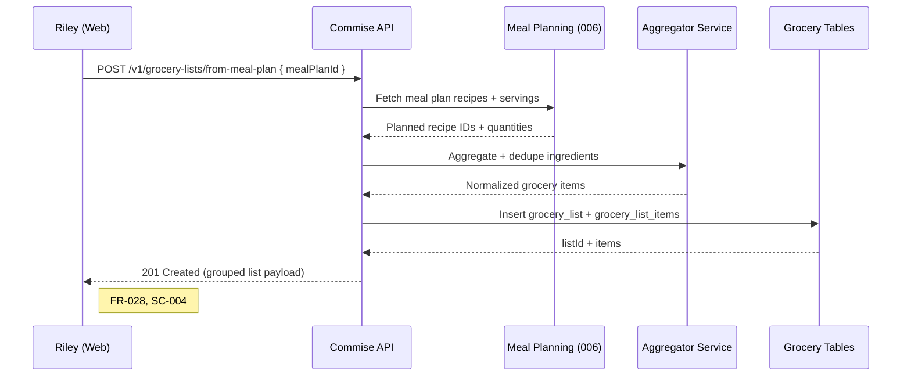
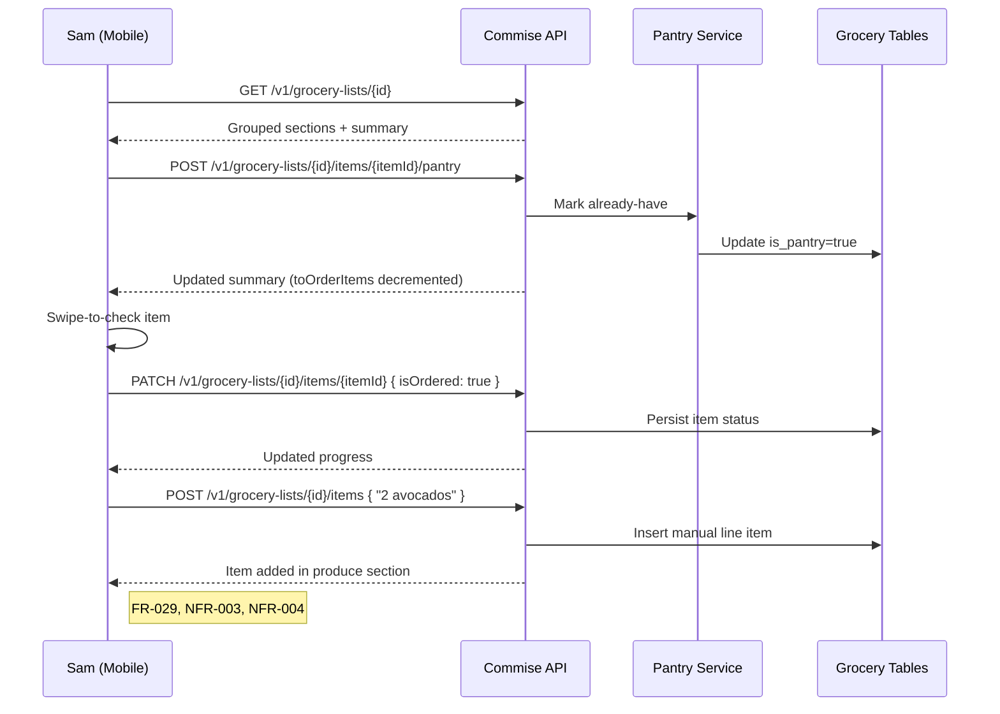
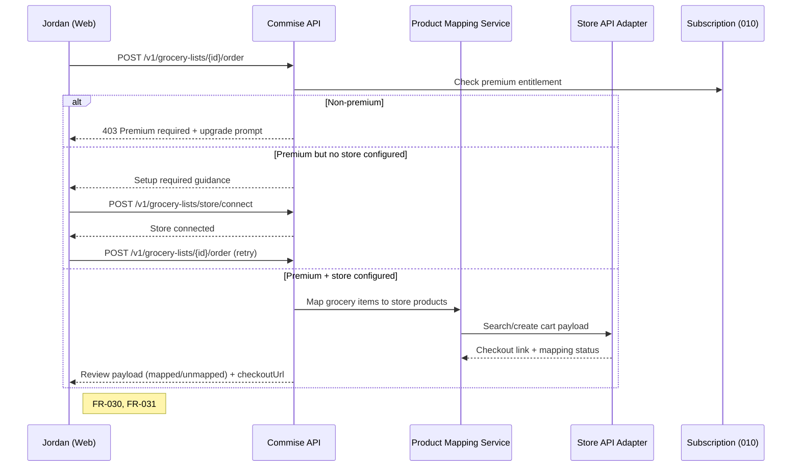
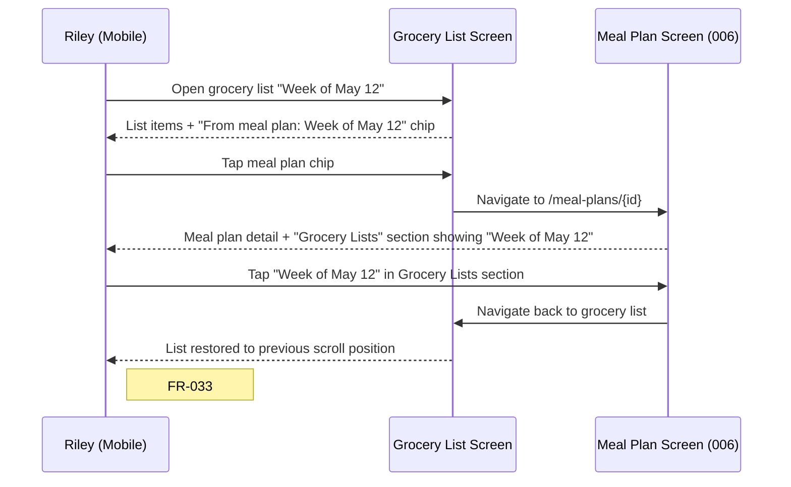

# User Journeys: Grocery Lists & Online Ordering

**Branch**: `007-grocery-lists`
**Date**: 2026-05-09
**Last Updated**: 2026-05-10 (added Journey D: dedicated Shopping Lists page; Journey E: cross-link navigation)
**Status**: Pre-handoff
**Source**: [product-spec.md](./product-spec.md), [spec.md](../spec.md)

---

## Journey Notation

Each journey covers one end-to-end flow per persona. Steps reference FR IDs in brackets.

---

## Persona 1: Weekly Planner (Riley) — Journey A: Plan to Generated Grocery List

**Scenario**: Riley completes a 7-day meal plan and generates a grocery list, expecting deduplicated ingredients and usable quantities.



---

## Persona 2: Household Shopper (Sam) — Journey B: In-Store Execution with Pantry + Check-Off

**Scenario**: Sam uses aisle-grouped view while shopping, marks pantry items, checks off acquired items, and adds one missing item manually.



---

## Persona 3: Premium Optimizer (Jordan) — Journey C: Store Setup and Order Handoff

**Scenario**: Jordan attempts to order groceries. The app guides setup if needed, then provides mapped-item review and checkout handoff.



---

## Edge Journey: Unmapped Items During Ordering

1. User reaches pre-order review.
2. Some items are `unmapped`.
3. User keeps unmapped items as manual in-store follow-up.
4. Order handoff proceeds for mapped subset.

This preserves flow continuity without silently dropping unknown items.

**FR linkage**: FR-031.

---

## Journey D: Dedicated Shopping Lists Page — Create List Without a Meal Plan

**Persona**: P8 Alex — Commise Power User
**Scenario**: Alex wants to add a few items for a weekend shop without building a full meal plan. They navigate directly to the Shopping Lists page and create a standalone list.

```mermaid
sequenceDiagram
    participant U as Alex (Web or Mobile)
    participant NAV as Main Navigation
    participant API as Commise API
    participant DB as Grocery Tables

    U->>NAV: Tap "Shopping Lists" in main nav
    NAV-->>U: /shopping-lists page (all lists, paginated)

    U->>U: Tap "New List"
    U->>U: Enter list name; leave meal plan picker empty
    U->>API: POST /v1/grocery-lists { name: "Weekend shop", mealPlanId: null }
    API->>DB: Insert grocery_list (meal_plan_id = NULL)
    DB-->>API: listId
    API-->>U: 201 Created (empty list)

    U->>API: POST /v1/grocery-lists/{id}/items { displayName: "Avocados", quantity: "2" }
    API->>DB: Insert manual item
    API-->>U: Item added

    Note right of U: FR-032, SC-009
```

**Also covered**: User can alternatively pick a meal plan from the dropdown on the same "New List" form, which triggers `POST /v1/grocery-lists { mealPlanId: "mp_xyz" }` and generates a full aggregated list.

---

## Journey E: Cross-Link Navigation Between Meal Plan and Grocery List

**Persona**: P3 Riley — Family Meal Planner
**Scenario**: Riley generated a grocery list from a meal plan last week. She wants to check the meal plan again while shopping, then return to the list.



**Edge case**: If the meal plan was deleted after the list was generated, the chip shows "Meal plan no longer available" and is not tappable. The list itself is unaffected.

---

## Coverage Matrix

| Journey                                  | FR-028 | FR-029 | FR-030 | FR-031 | FR-032 | FR-033 |
| ---------------------------------------- | ------ | ------ | ------ | ------ | ------ | ------ |
| Journey A: Plan → List                   | ✅     | ○      | ○      | ○      | ○      | ○      |
| Journey B: In-store execution            | ✅     | ✅     | ○      | ○      | ○      | ○      |
| Journey C: Premium order handoff         | ○      | ○      | ✅     | ✅     | ○      | ○      |
| Journey D: Dedicated Shopping Lists page | ✅     | ○      | ○      | ○      | ✅     | ○      |
| Journey E: Cross-link navigation         | ○      | ○      | ○      | ○      | ○      | ✅     |
| Edge: Unmapped item handling             | ○      | ○      | ○      | ✅     | ○      | ○      |

Legend: ✅ directly exercised, ○ not primary focus.
