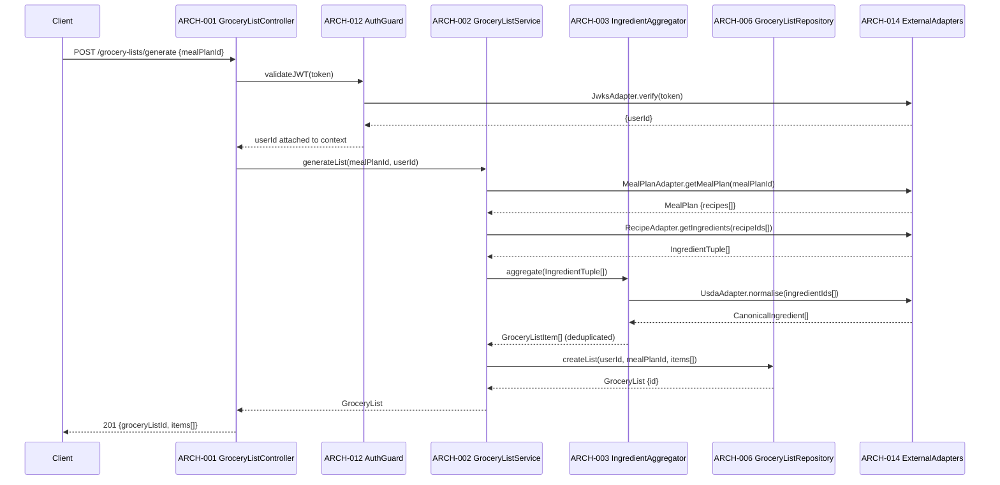
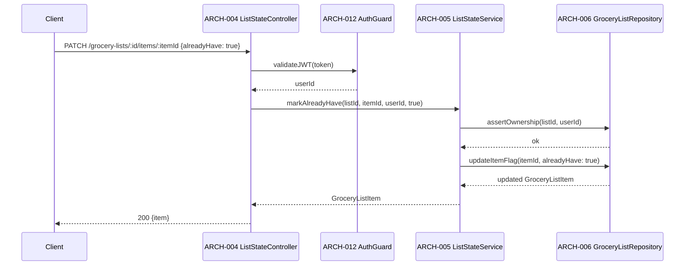
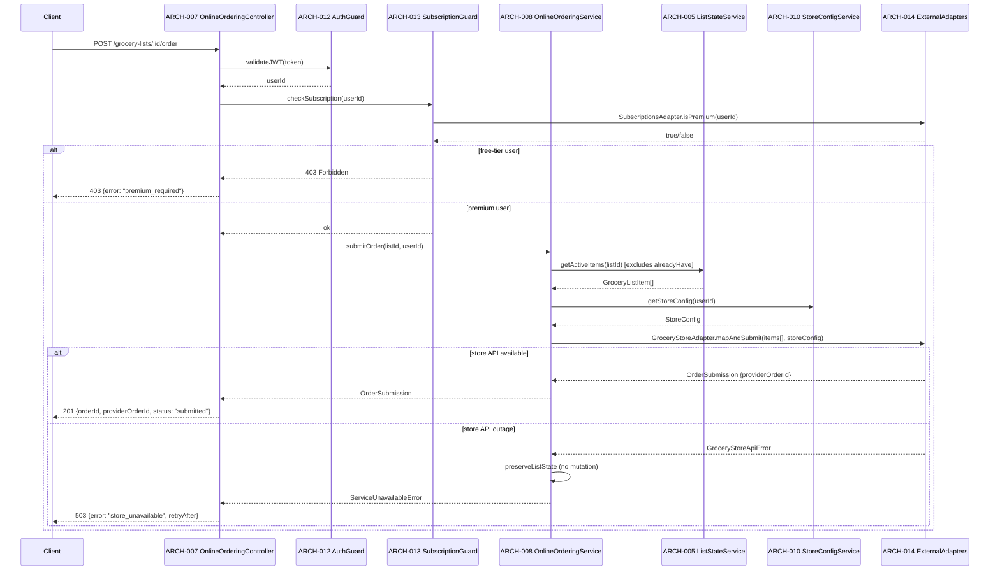

# Architecture Design: Grocery Lists & Online Ordering

**Feature Branch**: `007-grocery-lists`
**Created**: 2026-05-09
**Status**: Draft
**Source**: `specs/007-grocery-lists/v-model/system-design.md`

## Overview

The Grocery Lists & Online Ordering architecture decomposes six system components (SYS-001–SYS-006) into fourteen architecture modules (ARCH-001–ARCH-014). The decomposition follows a NestJS layered pattern: HTTP controllers → domain services → repository/adapter layer. Cross-cutting concerns (authentication guard, subscription guard, error handling, logging) are extracted as shared modules to avoid duplication across the three primary domain flows (list generation, list state management, online ordering).

## ID Schema

- **Architecture Module**: `ARCH-NNN` — sequential identifier for each module
- **Parent System Components**: Comma-separated `SYS-NNN` list per module (many-to-many)
- **Cross-Cutting Tag**: `[CROSS-CUTTING; rationale: shared infrastructure supports multiple SYS components]` for infrastructure/utility modules not traceable to a specific SYS
- Example: `ARCH-003` with Parent System Components `SYS-001, SYS-004` — module serves both components
- Example: `ARCH-010 [CROSS-CUTTING; rationale: shared infrastructure supports multiple SYS components]` — infrastructure module (e.g., Logger, Thread Pool) with rationale

## Logical View — Component Breakdown (IEEE 42010 / Kruchten 4+1)

| ARCH ID  | Name                     | Description                                                                                                                                                                                                                                                                                                                    | Parent System Components | Type      |
| -------- | ------------------------ | ------------------------------------------------------------------------------------------------------------------------------------------------------------------------------------------------------------------------------------------------------------------------------------------------------------------------------ | ------------------------ | --------- |
| ARCH-001 | GroceryListController    | NestJS REST controller exposing `POST /grocery-lists/generate`, `GET /grocery-lists/:id`, and `DELETE /grocery-lists/:id`. Validates DTOs, delegates to GroceryListService, and serialises responses. Applies AuthGuard and rate-limit decorators.                                                                             | SYS-001, SYS-002         | Component |
| ARCH-002 | GroceryListService       | Domain service orchestrating list generation: fetches meal plan via MealPlanAdapter, fetches recipe ingredients via RecipeAdapter, invokes IngredientAggregator, persists result via GroceryListRepository. Enforces 5-second timeout (REQ-003).                                                                               | SYS-001                  | Service   |
| ARCH-003 | IngredientAggregator     | Pure domain module: accepts a flat array of `{ingredientId, quantity, unit}` tuples, invokes UsdaAdapter for canonical identity and unit normalisation, deduplicates by canonical ingredient ID, sums quantities, and returns `GroceryListItem[]`.                                                                             | SYS-001                  | Component |
| ARCH-004 | ListStateController      | NestJS REST controller exposing `PATCH /grocery-lists/:id/items/:itemId` (mark already-have), `GET /grocery-lists/:id/items` (filtered view). Applies AuthGuard. Delegates to ListStateService.                                                                                                                                | SYS-002                  | Component |
| ARCH-005 | ListStateService         | Domain service managing grocery list item state: reads/writes `alreadyHave` flag, enforces exclusion of flagged items from shopping view and order submission queries. Delegates persistence to GroceryListRepository.                                                                                                         | SYS-002                  | Service   |
| ARCH-006 | GroceryListRepository    | Drizzle ORM repository for `grocery_lists` and `grocery_list_items` tables. Provides typed CRUD operations, optimistic locking for concurrent flag updates, and query methods that filter `alreadyHave = true` items.                                                                                                          | SYS-001, SYS-002         | Component |
| ARCH-007 | OnlineOrderingController | NestJS REST controller exposing `POST /grocery-lists/:id/order`. Applies AuthGuard and SubscriptionGuard (premium gate). Delegates to OnlineOrderingService. Returns order status and provider order ID.                                                                                                                       | SYS-003, SYS-004         | Component |
| ARCH-008 | OnlineOrderingService    | Domain service orchestrating order submission: reads active list items (excluding `alreadyHave`) via ListStateService, resolves store config via StoreConfigService, maps ingredients to provider SKUs via IngredientMappingRepository, submits via GroceryStoreAdapter. Handles API outage with retry + graceful degradation. | SYS-003                  | Service   |
| ARCH-009 | StoreConfigController    | NestJS REST controller exposing `GET /store-configs`, `POST /store-configs`, `DELETE /store-configs/:id`. Applies AuthGuard. Delegates to StoreConfigService. Returns setup guidance when no config exists.                                                                                                                    | SYS-004                  | Component |
| ARCH-010 | StoreConfigService       | Domain service managing grocery store integration configurations: validates provider credentials, persists encrypted store configs, and provides lookup by userId. Returns setup guidance payload when no config is found (REQ-007).                                                                                           | SYS-004                  | Service   |
| ARCH-011 | StoreConfigRepository    | Drizzle ORM repository for `store_configs` table. Stores encrypted provider credentials (AES-256-GCM via AWS KMS). Provides lookup by userId and provider enum.                                                                                                                                                                | SYS-004                  | Component |
| ARCH-012 | AuthGuard                | NestJS guard applied to all grocery list and ordering endpoints. Extracts Bearer token from `Authorization` header, validates JWT signature against Auth0 JWKS via JwksAdapter, and attaches decoded `userId` to request context. Rejects on invalid/missing token.                                                            | SYS-005                  | Utility   |
| ARCH-013 | SubscriptionGuard        | NestJS guard applied to online ordering endpoints only. Reads `userId` from request context (set by AuthGuard), calls SubscriptionsAdapter to verify active premium tier, and rejects with 403 if free-tier. Depends on AuthGuard executing first.                                                                             | SYS-005                  | Utility   |
| ARCH-014 | ExternalAdapters         | Collection of typed adapter classes wrapping all external dependencies: `MealPlanAdapter` (006), `RecipeAdapter` (001), `UsdaAdapter` (003), `JwksAdapter` (002), `SubscriptionsAdapter` (010), `GroceryStoreAdapter` (provider-specific implementations). Each adapter implements a domain interface for testability.         | SYS-006                  | Library   |

## Process View — Dynamic Behavior (Kruchten 4+1)

### Interaction: Grocery List Generation



**Concurrency Model**: NestJS event loop (single-threaded async/await). External adapter calls are parallelised with `Promise.all` where independent (recipe ingredient fetches per recipe).
**Synchronization Points**: `Promise.all` barrier after parallel recipe fetches; sequential USDA normalisation batch call; single DB write transaction for list + items.

---

### Interaction: Mark Item as Already Have



**Concurrency Model**: Optimistic locking on `grocery_list_items.version` column; retry on conflict (max 3 attempts).
**Synchronization Points**: Ownership assertion and flag update in a single DB transaction.

---

### Interaction: Online Order Submission



**Concurrency Model**: NestJS event loop; store API call is a single async operation with 10-second timeout and exponential backoff (max 2 retries).
**Synchronization Points**: Guards execute sequentially (AuthGuard → SubscriptionGuard) before service invocation; list state read is non-mutating (no lock required).

## Interface View — API Contracts (Kruchten 4+1)

### ARCH-001: GroceryListController

| Direction | Name          | Type              | Format                              | Constraints                                  |
| --------- | ------------- | ----------------- | ----------------------------------- | -------------------------------------------- |
| Input     | mealPlanId    | string (UUID)     | `POST /grocery-lists/generate` body | Required; must reference existing meal plan  |
| Input     | Authorization | string            | `Bearer <jwt>` header               | Required; validated by AuthGuard             |
| Output    | GroceryList   | object            | `{id, userId, mealPlanId, items[]}` | 201 on success                               |
| Exception | 400           | ValidationError   | `{statusCode, message, errors[]}`   | Invalid DTO                                  |
| Exception | 401           | UnauthorizedError | `{statusCode, message}`             | Missing or invalid JWT                       |
| Exception | 504           | TimeoutError      | `{statusCode, message}`             | Generation exceeded 5-second limit (REQ-003) |

### ARCH-002: GroceryListService

| Direction | Name           | Type          | Format                         | Constraints                                    |
| --------- | -------------- | ------------- | ------------------------------ | ---------------------------------------------- |
| Input     | mealPlanId     | string (UUID) | function parameter             | Required                                       |
| Input     | userId         | string        | function parameter             | Required; from JWT context                     |
| Output    | GroceryList    | GroceryList   | domain entity                  | Guaranteed non-empty items[] or EmptyPlanError |
| Exception | EmptyPlanError | Error         | `{code: "EMPTY_PLAN"}`         | Meal plan has no recipes (REQ-009)             |
| Exception | TimeoutError   | Error         | `{code: "GENERATION_TIMEOUT"}` | Upstream calls exceeded 5-second budget        |

### ARCH-003: IngredientAggregator

| Direction | Name                 | Type                  | Format                                            | Constraints                                      |
| --------- | -------------------- | --------------------- | ------------------------------------------------- | ------------------------------------------------ |
| Input     | ingredients          | IngredientTuple[]     | `{ingredientId, quantity, unit}[]`                | Required; min length 1                           |
| Input     | canonicalIngredients | CanonicalIngredient[] | USDA-normalised identity + unit mappings          | Required; provided by UsdaAdapter                |
| Output    | GroceryListItem[]    | GroceryListItem[]     | `{ingredientId, canonicalName, quantity, unit}[]` | Deduplicated; quantities summed per canonical ID |
| Exception | NormalisationError   | Error                 | `{code: "USDA_NORMALISATION_FAILED"}`             | USDA adapter returned incomplete mapping         |

### ARCH-004: ListStateController

| Direction | Name            | Type           | Format                                 | Constraints                              |
| --------- | --------------- | -------------- | -------------------------------------- | ---------------------------------------- |
| Input     | listId          | string (UUID)  | path parameter                         | Required                                 |
| Input     | itemId          | string (UUID)  | path parameter                         | Required                                 |
| Input     | alreadyHave     | boolean        | `PATCH` body `{alreadyHave: boolean}`  | Required                                 |
| Output    | GroceryListItem | object         | `{id, ingredientId, alreadyHave, ...}` | 200 on success                           |
| Exception | 403             | ForbiddenError | `{statusCode, message}`                | userId does not own listId               |
| Exception | 404             | NotFoundError  | `{statusCode, message}`                | listId or itemId not found               |
| Exception | 409             | ConflictError  | `{statusCode, message}`                | Optimistic lock conflict after 3 retries |

### ARCH-005: ListStateService

| Direction | Name            | Type          | Format                               | Constraints                        |
| --------- | --------------- | ------------- | ------------------------------------ | ---------------------------------- |
| Input     | listId          | string (UUID) | function parameter                   | Required                           |
| Input     | itemId          | string (UUID) | function parameter                   | Required                           |
| Input     | userId          | string        | function parameter                   | Required; ownership enforced       |
| Input     | alreadyHave     | boolean       | function parameter                   | Required                           |
| Output    | GroceryListItem | domain entity | updated item                         | Reflects new alreadyHave state     |
| Exception | OwnershipError  | Error         | `{code: "NOT_OWNER"}`                | userId does not own list           |
| Exception | ConflictError   | Error         | `{code: "OPTIMISTIC_LOCK_CONFLICT"}` | Version mismatch after max retries |

### ARCH-006: GroceryListRepository

| Direction | Name            | Type          | Format                           | Constraints                                    |
| --------- | --------------- | ------------- | -------------------------------- | ---------------------------------------------- |
| Input     | createList      | CreateListDTO | `{userId, mealPlanId, items[]}`  | Transactional; items inserted atomically       |
| Input     | updateItemFlag  | UpdateFlagDTO | `{itemId, alreadyHave, version}` | Optimistic lock on version column              |
| Output    | GroceryList     | domain entity | full list with items[]           | items[] filtered by alreadyHave when requested |
| Exception | DatabaseError   | Error         | `{code: "DB_ERROR"}`             | Connection or constraint failure               |
| Exception | VersionConflict | Error         | `{code: "VERSION_CONFLICT"}`     | Optimistic lock mismatch                       |

### ARCH-007: OnlineOrderingController

| Direction | Name            | Type               | Format                                      | Constraints                             |
| --------- | --------------- | ------------------ | ------------------------------------------- | --------------------------------------- |
| Input     | listId          | string (UUID)      | path parameter                              | Required                                |
| Input     | Authorization   | string             | `Bearer <jwt>` header                       | Required; AuthGuard + SubscriptionGuard |
| Output    | OrderSubmission | object             | `{orderId, providerOrderId, status}`        | 201 on success                          |
| Exception | 403             | ForbiddenError     | `{statusCode, message: "premium_required"}` | Free-tier user (REQ-CN-002)             |
| Exception | 503             | ServiceUnavailable | `{statusCode, error, retryAfter}`           | Grocery store API outage (REQ-010)      |

### ARCH-008: OnlineOrderingService

| Direction | Name               | Type          | Format                            | Constraints                               |
| --------- | ------------------ | ------------- | --------------------------------- | ----------------------------------------- |
| Input     | listId             | string (UUID) | function parameter                | Required                                  |
| Input     | userId             | string        | function parameter                | Required                                  |
| Output    | OrderSubmission    | domain entity | `{id, providerOrderId, status}`   | status = "submitted" on success           |
| Exception | NoStoreConfigError | Error         | `{code: "NO_STORE_CONFIG"}`       | No configured store for userId            |
| Exception | StoreApiError      | Error         | `{code: "STORE_API_UNAVAILABLE"}` | Provider API outage; list state preserved |

### ARCH-009: StoreConfigController

| Direction | Name        | Type            | Format                                | Constraints                              |
| --------- | ----------- | --------------- | ------------------------------------- | ---------------------------------------- |
| Input     | provider    | string (enum)   | `POST /store-configs` body            | Required; must be supported provider     |
| Input     | credentials | object          | provider-specific credential shape    | Required; validated per provider schema  |
| Output    | StoreConfig | object          | `{id, provider, active, setupGuide?}` | setupGuide present when no config exists |
| Exception | 400         | ValidationError | `{statusCode, message}`               | Invalid provider or credential shape     |
| Exception | 409         | ConflictError   | `{statusCode, message}`               | Config already exists for provider       |

### ARCH-010: StoreConfigService

| Direction | Name               | Type          | Format                           | Constraints                                     |
| --------- | ------------------ | ------------- | -------------------------------- | ----------------------------------------------- |
| Input     | userId             | string        | function parameter               | Required                                        |
| Input     | provider           | ProviderEnum  | function parameter               | Required for create                             |
| Input     | credentials        | object        | provider-specific                | Encrypted before persistence                    |
| Output    | StoreConfig        | domain entity | config or setup guidance payload | Returns guidance when no config found (REQ-007) |
| Exception | InvalidCredentials | Error         | `{code: "INVALID_CREDENTIALS"}`  | Provider credential validation failed           |

### ARCH-011: StoreConfigRepository

| Direction | Name          | Type            | Format                               | Constraints                               |
| --------- | ------------- | --------------- | ------------------------------------ | ----------------------------------------- |
| Input     | createConfig  | CreateConfigDTO | `{userId, provider, encryptedCreds}` | Credentials AES-256-GCM encrypted via KMS |
| Input     | getByUserId   | string (userId) | function parameter                   | Returns all configs for user              |
| Output    | StoreConfig[] | domain entity[] | decrypted credential shape           | Decryption on read                        |
| Exception | DatabaseError | Error           | `{code: "DB_ERROR"}`                 | Connection or constraint failure          |

### ARCH-012: AuthGuard

| Direction | Name   | Type              | Format                            | Constraints                          |
| --------- | ------ | ----------------- | --------------------------------- | ------------------------------------ |
| Input     | token  | string            | `Bearer <jwt>` from Authorization | Required on all protected routes     |
| Output    | userId | string            | attached to `request.user.id`     | Decoded from validated JWT sub claim |
| Exception | 401    | UnauthorizedError | `{statusCode, message}`           | Missing, expired, or invalid JWT     |

### ARCH-013: SubscriptionGuard

| Direction | Name         | Type           | Format                                      | Constraints                            |
| --------- | ------------ | -------------- | ------------------------------------------- | -------------------------------------- |
| Input     | userId       | string         | from `request.user.id` (AuthGuard)          | Required; AuthGuard must execute first |
| Input     | requiredTier | string         | decorator metadata `"premium"`              | Hardcoded for online ordering routes   |
| Output    | void         | —              | passes through on success                   | No output; throws on failure           |
| Exception | 403          | ForbiddenError | `{statusCode, message: "premium_required"}` | User not on premium tier               |

### ARCH-014: ExternalAdapters

| Direction | Name                             | Type             | Format                            | Constraints                                     |
| --------- | -------------------------------- | ---------------- | --------------------------------- | ----------------------------------------------- |
| Input     | MealPlanAdapter.get              | string (UUID)    | mealPlanId                        | Calls 006 REST API; 5-second timeout            |
| Input     | RecipeAdapter.getIngredients     | UUID[]           | recipeIds[]                       | Parallel calls; 5-second timeout per call       |
| Input     | UsdaAdapter.normalise            | string[]         | ingredientIds[]                   | Batch call; 3-second timeout                    |
| Input     | JwksAdapter.verify               | string           | JWT token                         | JWKS cached with 10-minute TTL                  |
| Input     | SubscriptionsAdapter.isPremium   | string           | userId                            | Calls 010 REST API; 2-second timeout            |
| Input     | GroceryStoreAdapter.mapAndSubmit | object           | `{items[], storeConfig}`          | Provider-specific; 10-second timeout, 2 retries |
| Output    | (per adapter)                    | typed domain obj | per adapter contract              | All adapters implement domain interface         |
| Exception | AdapterError                     | Error            | `{code, upstreamStatus, message}` | Wraps all upstream HTTP errors                  |

## Data Flow View — Data Transformation Chains (Kruchten 4+1)

### Flow 1: Meal Plan → Consolidated Grocery List

```text
[MealPlan API (006)]
        │ MealPlan {recipes[{recipeId}]}
        ▼
ARCH-014 MealPlanAdapter
        │ MealPlan domain object
        ▼
ARCH-002 GroceryListService
        │ recipeIds[]
        ▼
ARCH-014 RecipeAdapter (parallel per recipe)
        │ IngredientTuple[] {ingredientId, quantity, unit}
        ▼
ARCH-003 IngredientAggregator
        │ ingredientIds[] (for normalisation)
        ▼
ARCH-014 UsdaAdapter
        │ CanonicalIngredient[] {canonicalId, canonicalName, unitFactor}
        ▼
ARCH-003 IngredientAggregator (dedup + sum)
        │ GroceryListItem[] {canonicalName, quantity, unit, alreadyHave: false}
        ▼
ARCH-006 GroceryListRepository
        │ persisted GroceryList {id, items[]}
        ▼
ARCH-001 GroceryListController
        │ 201 JSON response
        ▼
[Client]
```

### Flow 2: Grocery List → Online Order

```text
[Client: POST /grocery-lists/:id/order]
        │ JWT token
        ▼
ARCH-012 AuthGuard → ARCH-014 JwksAdapter
        │ userId
        ▼
ARCH-013 SubscriptionGuard → ARCH-014 SubscriptionsAdapter
        │ premium confirmed
        ▼
ARCH-008 OnlineOrderingService
        │ listId
        ▼
ARCH-005 ListStateService → ARCH-006 GroceryListRepository
        │ GroceryListItem[] (alreadyHave=false only)
        ▼
ARCH-010 StoreConfigService → ARCH-011 StoreConfigRepository
        │ StoreConfig {provider, decryptedCredentials}
        ▼
ARCH-014 GroceryStoreAdapter
        │ {items[], storeConfig} → provider API mapping + submission
        ▼
ARCH-008 OnlineOrderingService
        │ OrderSubmission {providerOrderId, status}
        ▼
ARCH-007 OnlineOrderingController
        │ 201 JSON response
        ▼
[Client]
```

### Flow 3: Item Flag Update

```text
[Client: PATCH /grocery-lists/:id/items/:itemId]
        │ {alreadyHave: boolean}
        ▼
ARCH-012 AuthGuard
        │ userId
        ▼
ARCH-004 ListStateController
        │ {listId, itemId, userId, alreadyHave}
        ▼
ARCH-005 ListStateService
        │ ownership check + flag update
        ▼
ARCH-006 GroceryListRepository (optimistic lock)
        │ updated GroceryListItem
        ▼
ARCH-004 ListStateController
        │ 200 JSON response
        ▼
[Client]
```

## SYS↔ARCH Traceability Matrix

| SYS ID  | SYS Name                     | ARCH Modules                           | Coverage |
| ------- | ---------------------------- | -------------------------------------- | -------- |
| SYS-001 | Grocery List Generator       | ARCH-001, ARCH-002, ARCH-003, ARCH-006 | ✅ Full  |
| SYS-002 | List State Manager           | ARCH-001, ARCH-004, ARCH-005, ARCH-006 | ✅ Full  |
| SYS-003 | Online Ordering Orchestrator | ARCH-007, ARCH-008                     | ✅ Full  |
| SYS-004 | Store Configuration Manager  | ARCH-007, ARCH-009, ARCH-010, ARCH-011 | ✅ Full  |
| SYS-005 | Auth & Subscription Enforcer | ARCH-012, ARCH-013                     | ✅ Full  |
| SYS-006 | External Dependency Adapters | ARCH-014                               | ✅ Full  |

**Coverage**: All 6 SYS components are covered. All 14 ARCH modules have at least one SYS parent. No `[DERIVED MODULE]` flags required.

## Physical View — Deployment Topology

The feature deploys within the Sous Chef AWS/serverless topology. Client-facing web/mobile modules run in their respective application packages. Backend API, worker, queue, database, cache, storage, observability, and infrastructure modules deploy to the configured AWS account and region. Each ARCH module maps to the runtime described in the Logical View and the package/source paths listed in the Development View.

## Development View — Source Organization

Implementation modules are organized by platform and service boundary: web code under Next.js application packages, mobile code under Expo packages, backend services under API/Lambda packages, shared contracts under shared TypeScript packages, and infrastructure under CDK/IaC packages. This view constrains ownership, build boundaries, and deployment units for every ARCH-NNN module listed above.

## Scenarios — Architecture Validation

Primary scenarios validate the 4+1 architecture: successful request flow through user-facing entrypoints, dependency failure propagation through process boundaries, data persistence and retrieval through storage boundaries, and deployment/change isolation through development-view package ownership. Each scenario traces back to the SYS coverage listed on ARCH rows.
