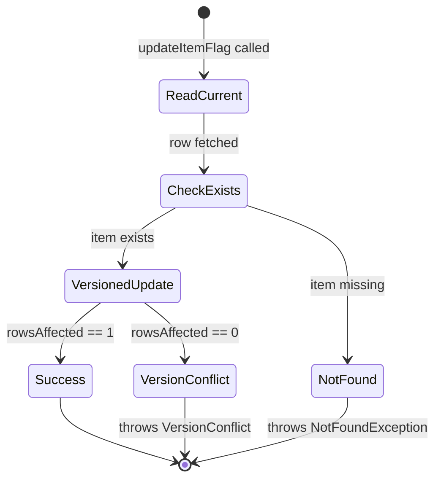
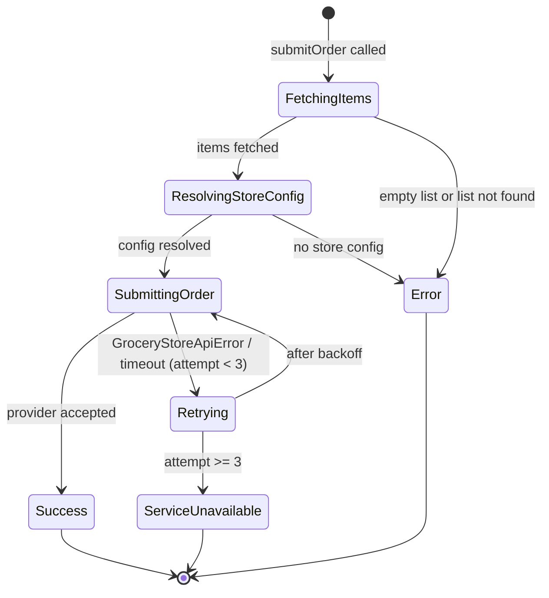
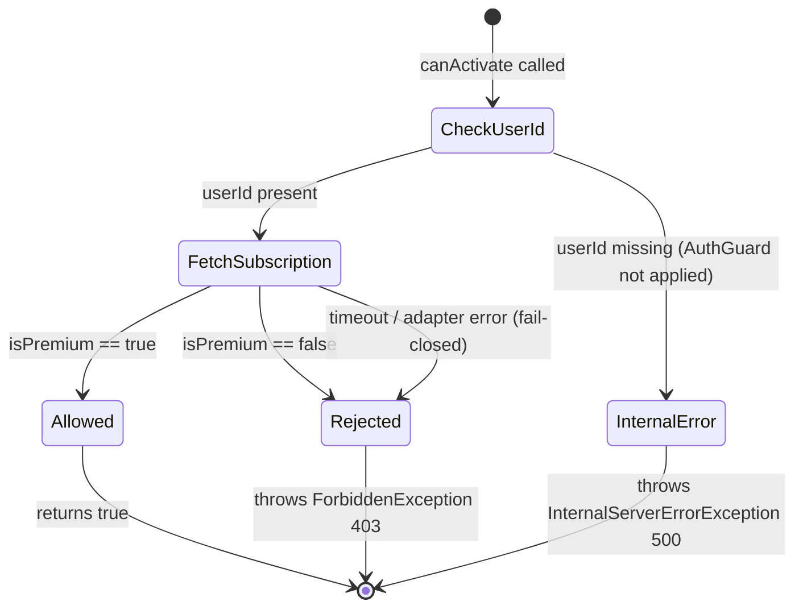

```mermaid
stateDiagram-v2
    [*] --> ExtractToken : canActivate called
    ExtractToken --> ValidateJWT : token present
    ExtractToken --> Rejected : missing/malformed header
    ValidateJWT --> Attached : JWT valid, sub present
    ValidateJWT --> Rejected : invalid/expired JWT
    Attached --> [*] : returns true; request.user set
    Rejected --> [*] : throws UnauthorizedException 401
```

# Module Design: Grocery Lists & Online Ordering

**Feature Branch**: `007-grocery-lists`
**Created**: 2026-05-09
**Status**: Draft
**Source**: `specs/007-grocery-lists/v-model/architecture-design.md`

## Overview

The Grocery Lists & Online Ordering module design decomposes fourteen architecture modules (ARCH-001–ARCH-014) into eighteen low-level module specifications (MOD-001–MOD-018). The decomposition follows the NestJS layered pattern established in the architecture design: controllers are split into request-parsing and response-serialisation concerns; services are split by orchestration flow; the repository is split by table/entity; and the ExternalAdapters collection is decomposed into one module per external dependency. Cross-cutting guards (AuthGuard, SubscriptionGuard) each receive a single module. At this level every branch, state transition, data structure, and error code is specified — writing source code is a translation exercise.

## ID Schema

- **Module Design**: `MOD-NNN` — sequential identifier for each module (3-digit zero-padded)
- **Parent Architecture Modules**: Comma-separated `ARCH-NNN` list per module (many-to-many, authoritative for traceability)
- **Target Source File(s)**: Comma-separated file paths mapping to the repository codebase
- Example: `MOD-003` with Parent Architecture Modules `ARCH-001, ARCH-004` — module serves both architecture components
- Example: `MOD-015 [EXTERNAL]` — third-party library wrapper, documents interface only

## Module Designs

---

### Module: MOD-001 (GroceryListController)

**Parent Architecture Modules**: ARCH-001
**Target Source File(s)**: `src/grocery-lists/grocery-list.controller.ts`

#### Algorithmic / Logic View

```pseudocode
// POST /grocery-lists/generate
FUNCTION handleGenerate(req: AuthenticatedRequest, body: GenerateGroceryListDTO) -> GroceryList:
    // AuthGuard has already validated JWT and attached req.user.id
    userId = req.user.id
    VALIDATE body.mealPlanId IS valid UUID format
    IF validation fails:
        THROW ValidationError(400, errors[])

    result = AWAIT groceryListService.generateList(body.mealPlanId, userId)
    // Service throws TimeoutError if > 5 seconds (REQ-003)
    RETURN HTTP 201, result

// GET /grocery-lists/:id
FUNCTION handleGet(req: AuthenticatedRequest, params: {id: UUID}) -> GroceryList:
    userId = req.user.id
    VALIDATE params.id IS valid UUID
    IF validation fails:
        THROW ValidationError(400, errors[])

    result = AWAIT groceryListService.getList(params.id, userId)
    RETURN HTTP 200, result

// DELETE /grocery-lists/:id
FUNCTION handleDelete(req: AuthenticatedRequest, params: {id: UUID}) -> void:
    userId = req.user.id
    VALIDATE params.id IS valid UUID
    IF validation fails:
        THROW ValidationError(400, errors[])

    AWAIT groceryListService.deleteList(params.id, userId)
    RETURN HTTP 204
```

#### State Machine View

N/A — Stateless; controller delegates all state to GroceryListService.

#### Internal Data Structures

| Name                   | Type   | Size/Constraints       | Initialization | Description                                      |
| ---------------------- | ------ | ---------------------- | -------------- | ------------------------------------------------ |
| GenerateGroceryListDTO | class  | `{mealPlanId: string}` | per-request    | Validated DTO for POST body; `@IsUUID()` applied |
| userId                 | string | UUID, non-empty        | from JWT sub   | Extracted from `req.user.id` set by AuthGuard    |

#### Error Handling & Return Codes

| Error Condition              | Error Code / Exception  | Architecture Contract (ARCH-001 Interface View) | Recovery                          |
| ---------------------------- | ----------------------- | ----------------------------------------------- | --------------------------------- |
| Invalid DTO fields           | `ValidationError` 400   | `{statusCode: 400, message, errors[]}`          | Return immediately; no retry      |
| Missing/invalid JWT          | `UnauthorizedError` 401 | `{statusCode: 401, message}`                    | AuthGuard throws before handler   |
| List not found or not owned  | `NotFoundException` 404 | `{statusCode: 404, message}`                    | Propagated from service           |
| Generation timeout (REQ-003) | `TimeoutError` 504      | `{statusCode: 504, message}`                    | Propagated from service; no retry |

---

### Module: MOD-002 (GroceryListService — generateList)

**Parent Architecture Modules**: ARCH-002
**Target Source File(s)**: `src/grocery-lists/grocery-list.service.ts`

#### Algorithmic / Logic View

```pseudocode
FUNCTION generateList(mealPlanId: UUID, userId: string) -> GroceryList:
    // Wrap entire operation in 5-second timeout (REQ-003)
    START timer(5000ms)

    // Step 1: Fetch meal plan from 006 service
    mealPlan = AWAIT mealPlanAdapter.getMealPlan(mealPlanId)
    IF mealPlan IS NULL:
        THROW NotFoundException("meal_plan_not_found")
    recipeIds = mealPlan.recipes.map(r => r.recipeId)

    // Step 2: Fetch ingredients for all recipes in parallel
    ingredientTuples = AWAIT Promise.all(
        recipeIds.map(id => recipeAdapter.getIngredients(id))
    )
    flatTuples = ingredientTuples.flat()  // IngredientTuple[]

    // Step 3: Aggregate and deduplicate
    groceryItems = AWAIT ingredientAggregator.aggregate(flatTuples)

    // Step 4: Persist
    groceryList = AWAIT groceryListRepository.createList(userId, mealPlanId, groceryItems)

    IF timer.elapsed > 5000ms:
        THROW TimeoutError("generation_timeout")

    RETURN groceryList

FUNCTION getList(listId: UUID, userId: string) -> GroceryList:
    list = AWAIT groceryListRepository.findById(listId)
    IF list IS NULL:
        THROW NotFoundException("list_not_found")
    IF list.userId != userId:
        THROW ForbiddenException("not_owner")
    RETURN list

FUNCTION deleteList(listId: UUID, userId: string) -> void:
    list = AWAIT groceryListRepository.findById(listId)
    IF list IS NULL:
        THROW NotFoundException("list_not_found")
    IF list.userId != userId:
        THROW ForbiddenException("not_owner")
    AWAIT groceryListRepository.deleteList(listId)
```

#### State Machine View

N/A — Stateless; each invocation is an independent async operation.

#### Internal Data Structures

| Name             | Type              | Size/Constraints              | Initialization  | Description                                             |
| ---------------- | ----------------- | ----------------------------- | --------------- | ------------------------------------------------------- |
| mealPlan         | MealPlan          | `{recipes[{recipeId}]}`       | per-call        | Domain object returned by MealPlanAdapter               |
| recipeIds        | string[]          | 1–21 UUIDs (7-day plan max)   | derived         | Extracted from mealPlan.recipes                         |
| ingredientTuples | IngredientTuple[] | unbounded; typically < 200    | per-call        | Flat array after Promise.all + flat()                   |
| groceryItems     | GroceryListItem[] | deduplicated; typically < 100 | from aggregator | Output of IngredientAggregator                          |
| TIMEOUT_MS       | const number      | 5000                          | module-level    | Hard limit for REQ-003; throws TimeoutError if exceeded |

#### Error Handling & Return Codes

| Error Condition            | Error Code / Exception | Architecture Contract (ARCH-002 Interface View) | Recovery                                 |
| -------------------------- | ---------------------- | ----------------------------------------------- | ---------------------------------------- |
| Meal plan not found        | `NotFoundException`    | `{code: "MEAL_PLAN_NOT_FOUND"}`                 | Propagated to controller → 404           |
| Recipe adapter failure     | `AdapterError`         | `{code, upstreamStatus, message}`               | Propagated; Promise.all rejects on first |
| Aggregation error          | `AggregationError`     | `{code: "AGGREGATION_FAILED"}`                  | Propagated to controller → 500           |
| DB write failure           | `DatabaseError`        | `{code: "DB_ERROR"}`                            | Propagated to controller → 500           |
| 5-second timeout (REQ-003) | `TimeoutError`         | `{statusCode: 504, message}`                    | Propagated to controller → 504           |

---

### Module: MOD-003 (IngredientAggregator)

**Parent Architecture Modules**: ARCH-003
**Target Source File(s)**: `src/grocery-lists/ingredient-aggregator.ts`

#### Algorithmic / Logic View

```pseudocode
FUNCTION aggregate(tuples: IngredientTuple[]) -> GroceryListItem[]:
    // Step 1: Collect unique ingredientIds for USDA normalisation
    ingredientIds = UNIQUE(tuples.map(t => t.ingredientId))

    // Step 2: Batch-fetch canonical identities from USDA adapter
    canonicalMap = AWAIT usdaAdapter.normalise(ingredientIds)
    // canonicalMap: Map<ingredientId, CanonicalIngredient>

    // Step 3: Deduplicate and sum by canonicalId
    accumulator = Map<canonicalId, {canonicalName, quantity, unit}>()

    FOR EACH tuple IN tuples:
        canonical = canonicalMap.get(tuple.ingredientId)
        IF canonical IS NULL:
            // Unknown ingredient — pass through with original name
            canonical = {canonicalId: tuple.ingredientId, canonicalName: tuple.ingredientId, unitFactor: 1}

        normalised_qty = tuple.quantity * canonical.unitFactor

        IF accumulator.has(canonical.canonicalId):
            existing = accumulator.get(canonical.canonicalId)
            existing.quantity += normalised_qty
        ELSE:
            accumulator.set(canonical.canonicalId, {
                canonicalName: canonical.canonicalName,
                quantity: normalised_qty,
                unit: canonical.baseUnit
            })

    // Step 4: Convert to GroceryListItem[]
    items = []
    FOR EACH [canonicalId, data] IN accumulator:
        items.push({
            ingredientId: canonicalId,
            name: data.canonicalName,
            quantity: ROUND(data.quantity, 2),
            unit: data.unit,
            alreadyHave: false
        })

    RETURN items
```

#### State Machine View

N/A — Stateless pure function; no persistent state between calls.

#### Internal Data Structures

| Name          | Type                                           | Size/Constraints           | Initialization | Description                                       |
| ------------- | ---------------------------------------------- | -------------------------- | -------------- | ------------------------------------------------- |
| ingredientIds | string[]                                       | deduplicated; ≤ 200        | derived        | Unique IDs extracted from input tuples            |
| canonicalMap  | Map\<string, CanonicalIngredient\>             | same size as ingredientIds | per-call       | USDA lookup result keyed by original ingredientId |
| accumulator   | Map\<string, {canonicalName, quantity, unit}\> | ≤ ingredientIds.length     | empty Map      | Running sum keyed by canonicalId                  |
| unitFactor    | number                                         | > 0; float                 | from USDA      | Conversion factor to base unit (e.g., oz → g)     |

#### Error Handling & Return Codes

| Error Condition      | Error Code / Exception | Architecture Contract (ARCH-003 Interface View) | Recovery                                   |
| -------------------- | ---------------------- | ----------------------------------------------- | ------------------------------------------ |
| USDA adapter failure | `AdapterError`         | `{code, upstreamStatus, message}`               | Propagated to GroceryListService → 500/504 |
| Unknown ingredientId | none (graceful)        | pass-through with original name                 | Log warning; continue aggregation          |
| Empty tuples array   | returns `[]`           | empty GroceryListItem[]                         | Valid; empty list persisted                |

---

### Module: MOD-004 (ListStateController)

**Parent Architecture Modules**: ARCH-004
**Target Source File(s)**: `src/grocery-lists/list-state.controller.ts`

#### Algorithmic / Logic View

```pseudocode
// PATCH /grocery-lists/:id/items/:itemId
FUNCTION handleMarkAlreadyHave(
    req: AuthenticatedRequest,
    params: {id: UUID, itemId: UUID},
    body: MarkAlreadyHaveDTO
) -> GroceryListItem:
    userId = req.user.id
    VALIDATE params.id, params.itemId ARE valid UUIDs
    VALIDATE body.alreadyHave IS boolean
    IF validation fails:
        THROW ValidationError(400, errors[])

    result = AWAIT listStateService.markAlreadyHave(
        params.id, params.itemId, userId, body.alreadyHave
    )
    RETURN HTTP 200, result

// GET /grocery-lists/:id/items
FUNCTION handleGetItems(
    req: AuthenticatedRequest,
    params: {id: UUID},
    query: {filter?: "active" | "all"}
) -> GroceryListItem[]:
    userId = req.user.id
    VALIDATE params.id IS valid UUID
    IF validation fails:
        THROW ValidationError(400, errors[])

    filter = query.filter ?? "active"  // default excludes alreadyHave items
    items = AWAIT listStateService.getItems(params.id, userId, filter)
    RETURN HTTP 200, items
```

#### State Machine View

N/A — Stateless; delegates all state to ListStateService.

#### Internal Data Structures

| Name               | Type              | Size/Constraints         | Initialization | Description                             |
| ------------------ | ----------------- | ------------------------ | -------------- | --------------------------------------- |
| MarkAlreadyHaveDTO | class             | `{alreadyHave: boolean}` | per-request    | Validated DTO; `@IsBoolean()` applied   |
| filter             | "active" \| "all" | enum                     | "active"       | Query param controlling item visibility |

#### Error Handling & Return Codes

| Error Condition           | Error Code / Exception   | Architecture Contract (ARCH-004 Interface View) | Recovery                        |
| ------------------------- | ------------------------ | ----------------------------------------------- | ------------------------------- |
| Invalid DTO / path params | `ValidationError` 400    | `{statusCode: 400, message, errors[]}`          | Return immediately              |
| Missing/invalid JWT       | `UnauthorizedError` 401  | `{statusCode: 401, message}`                    | AuthGuard throws before handler |
| Item not found            | `NotFoundException` 404  | `{statusCode: 404, message}`                    | Propagated from service         |
| Ownership violation       | `ForbiddenException` 403 | `{statusCode: 403, message}`                    | Propagated from service         |
| Optimistic lock conflict  | `ConflictError` 409      | `{statusCode: 409, message}`                    | Propagated from service         |

---

### Module: MOD-005 (ListStateService)

**Parent Architecture Modules**: ARCH-005
**Target Source File(s)**: `src/grocery-lists/list-state.service.ts`

#### Algorithmic / Logic View

```pseudocode
FUNCTION markAlreadyHave(
    listId: UUID, itemId: UUID, userId: string, alreadyHave: boolean
) -> GroceryListItem:
    // Step 1: Assert ownership
    AWAIT groceryListRepository.assertOwnership(listId, userId)
    // Throws OwnershipError if userId != list.userId

    // Step 2: Update flag with optimistic locking (max 3 retries)
    attempt = 0
    LOOP:
        attempt += 1
        TRY:
            updated = AWAIT groceryListRepository.updateItemFlag(itemId, alreadyHave)
            RETURN updated
        CATCH VersionConflict:
            IF attempt >= 3:
                THROW ConflictError("optimistic_lock_max_retries")
            CONTINUE LOOP

FUNCTION getItems(listId: UUID, userId: string, filter: "active" | "all") -> GroceryListItem[]:
    // Step 1: Assert ownership
    AWAIT groceryListRepository.assertOwnership(listId, userId)

    // Step 2: Fetch items with optional filter
    IF filter == "active":
        items = AWAIT groceryListRepository.findItems(listId, {alreadyHave: false})
    ELSE:
        items = AWAIT groceryListRepository.findItems(listId, {})

    RETURN items
```

#### State Machine View

N/A — Stateless service; optimistic lock retry is a local loop, not persistent state.

#### Internal Data Structures

| Name        | Type         | Size/Constraints | Initialization | Description                                |
| ----------- | ------------ | ---------------- | -------------- | ------------------------------------------ |
| attempt     | number       | 1–3              | 1 per call     | Retry counter for optimistic lock conflict |
| MAX_RETRIES | const number | 3                | module-level   | Maximum optimistic lock retry attempts     |

#### Error Handling & Return Codes

| Error Condition             | Error Code / Exception | Architecture Contract (ARCH-005 Interface View) | Recovery                       |
| --------------------------- | ---------------------- | ----------------------------------------------- | ------------------------------ |
| Ownership violation         | `OwnershipError`       | `{code: "NOT_OWNER"}`                           | Propagated to controller → 403 |
| Optimistic lock max retries | `ConflictError`        | `{code: "OPTIMISTIC_LOCK_CONFLICT"}`            | Propagated to controller → 409 |
| DB read/write failure       | `DatabaseError`        | `{code: "DB_ERROR"}`                            | Propagated to controller → 500 |

---

### Module: MOD-006 (GroceryListRepository — grocery_lists table)

**Parent Architecture Modules**: ARCH-006
**Target Source File(s)**: `src/grocery-lists/grocery-list.repository.ts`

#### Algorithmic / Logic View

```pseudocode
FUNCTION createList(userId: string, mealPlanId: UUID, items: GroceryListItem[]) -> GroceryList:
    // Single DB transaction: insert list + all items atomically
    BEGIN TRANSACTION
        listRow = INSERT INTO grocery_lists (id, userId, mealPlanId, createdAt)
                  VALUES (uuid(), userId, mealPlanId, now())
        FOR EACH item IN items:
            INSERT INTO grocery_list_items
                (id, listId, ingredientId, name, quantity, unit, alreadyHave, version)
            VALUES (uuid(), listRow.id, item.ingredientId, item.name,
                    item.quantity, item.unit, false, 0)
    COMMIT
    RETURN mapToGroceryList(listRow, items)

FUNCTION findById(listId: UUID) -> GroceryList | null:
    row = SELECT * FROM grocery_lists WHERE id = listId
    IF row IS NULL: RETURN null
    items = SELECT * FROM grocery_list_items WHERE listId = listId
    RETURN mapToGroceryList(row, items)

FUNCTION deleteList(listId: UUID) -> void:
    DELETE FROM grocery_list_items WHERE listId = listId
    DELETE FROM grocery_lists WHERE id = listId

FUNCTION assertOwnership(listId: UUID, userId: string) -> void:
    row = SELECT userId FROM grocery_lists WHERE id = listId
    IF row IS NULL: THROW NotFoundException("list_not_found")
    IF row.userId != userId: THROW OwnershipError("NOT_OWNER")

FUNCTION findItems(listId: UUID, filter: {alreadyHave?: boolean}) -> GroceryListItem[]:
    query = SELECT * FROM grocery_list_items WHERE listId = listId
    IF filter.alreadyHave IS DEFINED:
        query += AND alreadyHave = filter.alreadyHave
    RETURN query.map(mapToGroceryListItem)
```

#### State Machine View

N/A — Stateless repository; DB manages persistence state.

#### Internal Data Structures

| Name     | Type     | Size/Constraints          | Initialization | Description                         |
| -------- | -------- | ------------------------- | -------------- | ----------------------------------- |
| listRow  | DB row   | grocery_lists schema      | per-insert     | Raw DB row before domain mapping    |
| itemRows | DB row[] | grocery_list_items schema | per-query      | Raw item rows before domain mapping |

#### Error Handling & Return Codes

| Error Condition       | Error Code / Exception | Architecture Contract (ARCH-006 Interface View) | Recovery                      |
| --------------------- | ---------------------- | ----------------------------------------------- | ----------------------------- |
| DB connection failure | `DatabaseError`        | `{code: "DB_ERROR"}`                            | Propagated to service → 500   |
| Constraint violation  | `DatabaseError`        | `{code: "DB_ERROR"}`                            | Propagated to service → 500   |
| List not found        | `NotFoundException`    | null return or thrown                           | Caller checks null or catches |
| Ownership violation   | `OwnershipError`       | `{code: "NOT_OWNER"}`                           | Propagated to service → 403   |

---

### Module: MOD-007 (GroceryListRepository — updateItemFlag with optimistic lock)

**Parent Architecture Modules**: ARCH-006
**Target Source File(s)**: `src/grocery-lists/grocery-list.repository.ts`

#### Algorithmic / Logic View

```pseudocode
FUNCTION updateItemFlag(itemId: UUID, alreadyHave: boolean) -> GroceryListItem:
    // Read current version
    current = SELECT * FROM grocery_list_items WHERE id = itemId
    IF current IS NULL: THROW NotFoundException("item_not_found")

    // Optimistic lock: update only if version matches
    rowsAffected = UPDATE grocery_list_items
        SET alreadyHave = alreadyHave, version = current.version + 1
        WHERE id = itemId AND version = current.version

    IF rowsAffected == 0:
        THROW VersionConflict("VERSION_CONFLICT")

    updated = SELECT * FROM grocery_list_items WHERE id = itemId
    RETURN mapToGroceryListItem(updated)
```

#### State Machine View



#### Internal Data Structures

| Name         | Type   | Size/Constraints | Initialization | Description                                      |
| ------------ | ------ | ---------------- | -------------- | ------------------------------------------------ |
| current      | DB row | item schema      | per-call       | Current item row including version column        |
| rowsAffected | number | 0 or 1           | from UPDATE    | 0 = version mismatch (concurrent write detected) |
| version      | number | ≥ 0; integer     | 0 on insert    | Monotonically increasing optimistic lock counter |

#### Error Handling & Return Codes

| Error Condition  | Error Code / Exception | Architecture Contract (ARCH-006 Interface View) | Recovery                               |
| ---------------- | ---------------------- | ----------------------------------------------- | -------------------------------------- |
| Item not found   | `NotFoundException`    | null / thrown                                   | Propagated to ListStateService         |
| Version mismatch | `VersionConflict`      | `{code: "VERSION_CONFLICT"}`                    | ListStateService retries up to 3 times |
| DB failure       | `DatabaseError`        | `{code: "DB_ERROR"}`                            | Propagated to service → 500            |

---

### Module: MOD-008 (OnlineOrderingController)

**Parent Architecture Modules**: ARCH-007
**Target Source File(s)**: `src/online-ordering/online-ordering.controller.ts`

#### Algorithmic / Logic View

```pseudocode
// POST /grocery-lists/:id/order
FUNCTION handleSubmitOrder(
    req: AuthenticatedRequest,
    params: {id: UUID}
) -> OrderSubmission:
    // AuthGuard + SubscriptionGuard have already validated JWT and premium tier
    userId = req.user.id
    VALIDATE params.id IS valid UUID
    IF validation fails:
        THROW ValidationError(400, errors[])

    result = AWAIT onlineOrderingService.submitOrder(params.id, userId)
    RETURN HTTP 201, {
        orderId: result.orderId,
        providerOrderId: result.providerOrderId,
        status: result.status
    }
```

#### State Machine View

N/A — Stateless; delegates all state to OnlineOrderingService.

#### Internal Data Structures

| Name   | Type   | Size/Constraints | Initialization | Description                                   |
| ------ | ------ | ---------------- | -------------- | --------------------------------------------- |
| listId | string | UUID             | from path      | Grocery list to submit as an order            |
| userId | string | non-empty        | from JWT sub   | Extracted from `req.user.id` set by AuthGuard |

#### Error Handling & Return Codes

| Error Condition     | Error Code / Exception        | Architecture Contract (ARCH-007 Interface View)             | Recovery                        |
| ------------------- | ----------------------------- | ----------------------------------------------------------- | ------------------------------- |
| Invalid path param  | `ValidationError` 400         | `{statusCode: 400, message, errors[]}`                      | Return immediately              |
| Missing/invalid JWT | `UnauthorizedError` 401       | `{statusCode: 401, message}`                                | AuthGuard throws before handler |
| Free-tier user      | `ForbiddenError` 403          | `{statusCode: 403, message: "premium_required"}`            | SubscriptionGuard throws        |
| Store API outage    | `ServiceUnavailableError` 503 | `{statusCode: 503, error: "store_unavailable", retryAfter}` | Propagated from service         |

---

### Module: MOD-009 (OnlineOrderingService)

**Parent Architecture Modules**: ARCH-008
**Target Source File(s)**: `src/online-ordering/online-ordering.service.ts`

#### Algorithmic / Logic View

```pseudocode
FUNCTION submitOrder(listId: UUID, userId: string) -> OrderSubmission:
    // Step 1: Get active items (excludes alreadyHave)
    items = AWAIT listStateService.getItems(listId, userId, "active")
    IF items.length == 0:
        THROW BadRequestException("empty_order")

    // Step 2: Resolve store config
    storeConfig = AWAIT storeConfigService.getStoreConfig(userId)
    IF storeConfig IS NULL:
        THROW BadRequestException("no_store_config")

    // Step 3: Map ingredients to provider SKUs and submit
    // Retry with exponential backoff: max 2 retries, 10-second timeout per attempt
    attempt = 0
    backoffMs = 1000
    LOOP:
        attempt += 1
        TRY:
            WITH timeout(10000ms):
                submission = AWAIT groceryStoreAdapter.mapAndSubmit(items, storeConfig)
            RETURN {
                orderId: uuid(),
                providerOrderId: submission.providerOrderId,
                status: "submitted"
            }
        CATCH GroceryStoreApiError:
            IF attempt >= 3:
                THROW ServiceUnavailableError("store_unavailable", retryAfter: now() + 60s)
            AWAIT sleep(backoffMs)
            backoffMs *= 2  // exponential backoff
            CONTINUE LOOP
        CATCH TimeoutError:
            IF attempt >= 3:
                THROW ServiceUnavailableError("store_unavailable", retryAfter: now() + 60s)
            CONTINUE LOOP
```

#### State Machine View



#### Internal Data Structures

| Name        | Type              | Size/Constraints | Initialization | Description                                         |
| ----------- | ----------------- | ---------------- | -------------- | --------------------------------------------------- |
| items       | GroceryListItem[] | ≥ 1 (validated)  | per-call       | Active items (alreadyHave=false) for the list       |
| storeConfig | StoreConfig       | non-null         | per-call       | Resolved provider config with decrypted credentials |
| attempt     | number            | 1–3              | 1              | Retry counter for store API calls                   |
| backoffMs   | number            | 1000, 2000, 4000 | 1000           | Exponential backoff delay in milliseconds           |
| MAX_RETRIES | const number      | 3                | module-level   | Maximum store API retry attempts                    |
| TIMEOUT_MS  | const number      | 10000            | module-level   | Per-attempt timeout for store API call              |

#### Error Handling & Return Codes

| Error Condition              | Error Code / Exception    | Architecture Contract (ARCH-008 Interface View) | Recovery                       |
| ---------------------------- | ------------------------- | ----------------------------------------------- | ------------------------------ |
| Empty active items           | `BadRequestException`     | `{code: "EMPTY_ORDER"}`                         | Propagated to controller → 400 |
| No store config              | `BadRequestException`     | `{code: "NO_STORE_CONFIG"}`                     | Propagated to controller → 400 |
| Store API outage (max retry) | `ServiceUnavailableError` | `{statusCode: 503, retryAfter}`                 | Propagated to controller → 503 |
| List state read failure      | `DatabaseError`           | `{code: "DB_ERROR"}`                            | Propagated to controller → 500 |

---

### Module: MOD-010 (StoreConfigController)

**Parent Architecture Modules**: ARCH-009
**Target Source File(s)**: `src/store-config/store-config.controller.ts`

#### Algorithmic / Logic View

```pseudocode
// GET /store-configs
FUNCTION handleList(req: AuthenticatedRequest) -> StoreConfig[] | SetupGuidance:
    userId = req.user.id
    result = AWAIT storeConfigService.listConfigs(userId)
    IF result.configs.length == 0:
        RETURN HTTP 200, result.setupGuidance  // REQ-007
    RETURN HTTP 200, result.configs

// POST /store-configs
FUNCTION handleCreate(req: AuthenticatedRequest, body: CreateStoreConfigDTO) -> StoreConfig:
    userId = req.user.id
    VALIDATE body.provider IS valid enum value
    VALIDATE body.credentials IS non-empty object
    IF validation fails:
        THROW ValidationError(400, errors[])

    config = AWAIT storeConfigService.createConfig(userId, body)
    RETURN HTTP 201, config

// DELETE /store-configs/:id
FUNCTION handleDelete(req: AuthenticatedRequest, params: {id: UUID}) -> void:
    userId = req.user.id
    VALIDATE params.id IS valid UUID
    IF validation fails:
        THROW ValidationError(400, errors[])

    AWAIT storeConfigService.deleteConfig(params.id, userId)
    RETURN HTTP 204
```

#### State Machine View

N/A — Stateless; delegates all state to StoreConfigService.

#### Internal Data Structures

| Name                 | Type   | Size/Constraints                                | Initialization | Description                              |
| -------------------- | ------ | ----------------------------------------------- | -------------- | ---------------------------------------- |
| CreateStoreConfigDTO | class  | `{provider: ProviderEnum, credentials: object}` | per-request    | Validated DTO                            |
| SetupGuidance        | object | `{message, supportedProviders[]}`               | from service   | Returned when no configs exist (REQ-007) |

#### Error Handling & Return Codes

| Error Condition     | Error Code / Exception   | Architecture Contract (ARCH-009 Interface View) | Recovery                        |
| ------------------- | ------------------------ | ----------------------------------------------- | ------------------------------- |
| Invalid DTO         | `ValidationError` 400    | `{statusCode: 400, message, errors[]}`          | Return immediately              |
| Missing/invalid JWT | `UnauthorizedError` 401  | `{statusCode: 401, message}`                    | AuthGuard throws before handler |
| Config not found    | `NotFoundException` 404  | `{statusCode: 404, message}`                    | Propagated from service         |
| Ownership violation | `ForbiddenException` 403 | `{statusCode: 403, message}`                    | Propagated from service         |

---

### Module: MOD-011 (StoreConfigService)

**Parent Architecture Modules**: ARCH-010
**Target Source File(s)**: `src/store-config/store-config.service.ts`

#### Algorithmic / Logic View

```pseudocode
FUNCTION listConfigs(userId: string) -> {configs: StoreConfig[], setupGuidance: SetupGuidance}:
    configs = AWAIT storeConfigRepository.findByUserId(userId)
    IF configs.length == 0:
        RETURN {
            configs: [],
            setupGuidance: {
                message: "No grocery store connected. Add a store to enable online ordering.",
                supportedProviders: ["KROGER", "WALMART", "INSTACART"]
            }
        }
    RETURN {configs, setupGuidance: null}

FUNCTION createConfig(userId: string, dto: CreateStoreConfigDTO) -> StoreConfig:
    // Validate provider credentials format
    VALIDATE dto.credentials MATCHES provider schema for dto.provider
    IF invalid:
        THROW ValidationError("invalid_credentials_format")

    // Encrypt credentials via AWS KMS (AES-256-GCM)
    encryptedCreds = AWAIT kmsEncrypt(dto.credentials)

    config = AWAIT storeConfigRepository.create({
        userId,
        provider: dto.provider,
        encryptedCredentials: encryptedCreds
    })
    RETURN config

FUNCTION getStoreConfig(userId: string) -> StoreConfig | null:
    configs = AWAIT storeConfigRepository.findByUserId(userId)
    IF configs.length == 0: RETURN null
    RETURN configs[0]  // Primary config; future: provider selection

FUNCTION deleteConfig(configId: UUID, userId: string) -> void:
    config = AWAIT storeConfigRepository.findById(configId)
    IF config IS NULL: THROW NotFoundException("config_not_found")
    IF config.userId != userId: THROW ForbiddenException("not_owner")
    AWAIT storeConfigRepository.delete(configId)
```

#### State Machine View

N/A — Stateless service; KMS and DB manage state.

#### Internal Data Structures

| Name                | Type     | Size/Constraints                  | Initialization | Description                              |
| ------------------- | -------- | --------------------------------- | -------------- | ---------------------------------------- |
| encryptedCreds      | Buffer   | AES-256-GCM ciphertext            | per-call       | KMS-encrypted provider credentials       |
| SetupGuidance       | object   | `{message, supportedProviders[]}` | static         | Returned when no configs exist (REQ-007) |
| SUPPORTED_PROVIDERS | string[] | ["KROGER","WALMART","INSTACART"]  | module-level   | Valid provider enum values               |

#### Error Handling & Return Codes

| Error Condition            | Error Code / Exception | Architecture Contract (ARCH-010 Interface View) | Recovery                       |
| -------------------------- | ---------------------- | ----------------------------------------------- | ------------------------------ |
| Invalid credentials format | `ValidationError`      | `{code: "INVALID_CREDENTIALS"}`                 | Propagated to controller → 400 |
| KMS encryption failure     | `KmsError`             | `{code: "KMS_FAILURE"}`                         | Propagated to controller → 500 |
| DB failure                 | `DatabaseError`        | `{code: "DB_ERROR"}`                            | Propagated to controller → 500 |
| Config not found           | `NotFoundException`    | `{code: "CONFIG_NOT_FOUND"}`                    | Propagated to controller → 404 |
| Ownership violation        | `ForbiddenException`   | `{code: "NOT_OWNER"}`                           | Propagated to controller → 403 |

---

### Module: MOD-012 (StoreConfigRepository)

**Parent Architecture Modules**: ARCH-011
**Target Source File(s)**: `src/store-config/store-config.repository.ts`

#### Algorithmic / Logic View

```pseudocode
FUNCTION create(dto: {userId, provider, encryptedCredentials}) -> StoreConfig:
    row = INSERT INTO store_configs (id, userId, provider, encryptedCredentials, createdAt)
          VALUES (uuid(), dto.userId, dto.provider, dto.encryptedCredentials, now())
    RETURN mapToStoreConfig(row)

FUNCTION findByUserId(userId: string) -> StoreConfig[]:
    rows = SELECT * FROM store_configs WHERE userId = userId ORDER BY createdAt ASC
    RETURN rows.map(mapToStoreConfig)

FUNCTION findById(configId: UUID) -> StoreConfig | null:
    row = SELECT * FROM store_configs WHERE id = configId
    IF row IS NULL: RETURN null
    RETURN mapToStoreConfig(row)

FUNCTION delete(configId: UUID) -> void:
    DELETE FROM store_configs WHERE id = configId

FUNCTION mapToStoreConfig(row: DBRow) -> StoreConfig:
    // Decrypt credentials on read via KMS
    decryptedCreds = AWAIT kmsDecrypt(row.encryptedCredentials)
    RETURN {
        id: row.id,
        userId: row.userId,
        provider: row.provider,
        credentials: decryptedCreds,
        createdAt: row.createdAt
    }
```

#### State Machine View

N/A — Stateless repository; DB manages persistence state.

#### Internal Data Structures

| Name                 | Type   | Size/Constraints               | Initialization | Description                             |
| -------------------- | ------ | ------------------------------ | -------------- | --------------------------------------- |
| encryptedCredentials | Buffer | AES-256-GCM ciphertext         | from KMS       | Stored encrypted; decrypted on read     |
| ProviderEnum         | enum   | KROGER \| WALMART \| INSTACART | module-level   | Valid provider values for DB constraint |

#### Error Handling & Return Codes

| Error Condition       | Error Code / Exception | Architecture Contract (ARCH-011 Interface View) | Recovery                    |
| --------------------- | ---------------------- | ----------------------------------------------- | --------------------------- |
| DB connection failure | `DatabaseError`        | `{code: "DB_ERROR"}`                            | Propagated to service → 500 |
| KMS decrypt failure   | `KmsError`             | `{code: "KMS_FAILURE"}`                         | Propagated to service → 500 |
| Constraint violation  | `DatabaseError`        | `{code: "DB_ERROR"}`                            | Propagated to service → 500 |

---

### Module: MOD-013 (AuthGuard)

**Parent Architecture Modules**: ARCH-012
**Target Source File(s)**: `src/auth/auth.guard.ts`

#### Algorithmic / Logic View

```pseudocode
FUNCTION canActivate(context: ExecutionContext) -> boolean:
    request = context.switchToHttp().getRequest()

    // Step 1: Extract Bearer token
    authHeader = request.headers["authorization"]
    IF authHeader IS NULL OR NOT authHeader.startsWith("Bearer "):
        THROW UnauthorizedException("missing_token")

    token = authHeader.slice(7)  // strip "Bearer "

    // Step 2: Validate JWT against Auth0 JWKS
    // JWKS cached with 10-minute TTL
    decoded = AWAIT jwksAdapter.verify(token)
    IF decoded IS NULL OR decoded.sub IS NULL:
        THROW UnauthorizedException("invalid_token")

    // Step 3: Attach userId to request context
    request.user = {id: decoded.sub}

    RETURN true
```

#### State Machine View



#### Internal Data Structures

| Name     | Type         | Size/Constraints     | Initialization   | Description                         |
| -------- | ------------ | -------------------- | ---------------- | ----------------------------------- |
| token    | string       | non-empty JWT        | per-request      | Extracted from Authorization header |
| decoded  | object       | `{sub: string, ...}` | from JWKS verify | Decoded JWT payload                 |
| JWKS_TTL | const number | 600000 (10 min)      | module-level     | JWKS cache TTL in milliseconds      |

#### Error Handling & Return Codes

| Error Condition              | Error Code / Exception  | Architecture Contract (ARCH-012 Interface View) | Recovery                              |
| ---------------------------- | ----------------------- | ----------------------------------------------- | ------------------------------------- |
| Missing Authorization header | `UnauthorizedException` | `{statusCode: 401, message}`                    | Request rejected immediately          |
| Malformed Bearer token       | `UnauthorizedException` | `{statusCode: 401, message}`                    | Request rejected immediately          |
| Expired JWT                  | `UnauthorizedException` | `{statusCode: 401, message}`                    | Request rejected; client must refresh |
| JWKS fetch failure           | `UnauthorizedException` | `{statusCode: 401, message}`                    | Fail-closed; reject request           |

---

### Module: MOD-014 (SubscriptionGuard)

**Parent Architecture Modules**: ARCH-013
**Target Source File(s)**: `src/auth/subscription.guard.ts`

#### Algorithmic / Logic View

```pseudocode
FUNCTION canActivate(context: ExecutionContext) -> boolean:
    request = context.switchToHttp().getRequest()

    // AuthGuard MUST have executed first; userId is on request.user.id
    userId = request.user?.id
    IF userId IS NULL:
        THROW InternalServerErrorException("auth_guard_not_applied")

    // Read required tier from decorator metadata (hardcoded "premium" for ordering routes)
    requiredTier = reflector.get("requiredTier", context.getHandler()) ?? "premium"

    // Check subscription via 010 REST API (2-second timeout)
    WITH timeout(2000ms):
        isPremium = AWAIT subscriptionsAdapter.isPremium(userId)

    IF NOT isPremium:
        THROW ForbiddenException("premium_required")

    RETURN true
```

#### State Machine View



#### Internal Data Structures

| Name         | Type         | Size/Constraints | Initialization | Description                             |
| ------------ | ------------ | ---------------- | -------------- | --------------------------------------- |
| userId       | string       | non-empty        | from request   | Set by AuthGuard; guard fails if absent |
| requiredTier | string       | "premium"        | from decorator | Tier required to access the route       |
| isPremium    | boolean      | true \| false    | from adapter   | Result of subscription check            |
| TIMEOUT_MS   | const number | 2000             | module-level   | Timeout for subscriptions adapter call  |

#### Error Handling & Return Codes

| Error Condition               | Error Code / Exception         | Architecture Contract (ARCH-013 Interface View)  | Recovery                         |
| ----------------------------- | ------------------------------ | ------------------------------------------------ | -------------------------------- |
| userId missing                | `InternalServerErrorException` | `{statusCode: 500}`                              | Configuration error; fail loudly |
| Free-tier user                | `ForbiddenException`           | `{statusCode: 403, message: "premium_required"}` | Request rejected                 |
| Subscriptions adapter timeout | `ForbiddenException`           | `{statusCode: 403, message: "premium_required"}` | Fail-closed; reject request      |
| Subscriptions adapter error   | `ForbiddenException`           | `{statusCode: 403, message: "premium_required"}` | Fail-closed; reject request      |

---

### Module: MOD-015 [EXTERNAL] (MealPlanAdapter)

**Parent Architecture Modules**: ARCH-014
**Target Source File(s)**: `src/adapters/meal-plan.adapter.ts`

#### Algorithmic / Logic View

```pseudocode
// Wrapper configuration — no library internals documented
FUNCTION getMealPlan(mealPlanId: UUID) -> MealPlan:
    // HTTP GET to 006 service REST API
    // Base URL from env: MEAL_PLAN_SERVICE_URL
    // Timeout: 5000ms
    // Auth: service-to-service JWT from env: SERVICE_JWT
    response = AWAIT httpClient.get(
        url: `${MEAL_PLAN_SERVICE_URL}/meal-plans/${mealPlanId}`,
        headers: {Authorization: `Bearer ${SERVICE_JWT}`},
        timeout: 5000
    )
    IF response.status == 404: THROW NotFoundException("meal_plan_not_found")
    IF response.status != 200: THROW AdapterError(response.status, response.body)
    RETURN mapToMealPlan(response.body)
```

#### State Machine View

N/A — Stateless HTTP adapter wrapper.

#### Internal Data Structures

| Name                  | Type   | Size/Constraints | Initialization | Description                             |
| --------------------- | ------ | ---------------- | -------------- | --------------------------------------- |
| MEAL_PLAN_SERVICE_URL | string | non-empty URL    | from env       | Base URL for 006 meal plan service      |
| SERVICE_JWT           | string | valid JWT        | from env       | Service-to-service authentication token |

#### Error Handling & Return Codes

| Error Condition       | Error Code / Exception | Architecture Contract (ARCH-014 Interface View) | Recovery                         |
| --------------------- | ---------------------- | ----------------------------------------------- | -------------------------------- |
| 404 from upstream     | `NotFoundException`    | `{code, upstreamStatus: 404, message}`          | Propagated to GroceryListService |
| Non-200 from upstream | `AdapterError`         | `{code, upstreamStatus, message}`               | Propagated to GroceryListService |
| Timeout               | `AdapterError`         | `{code: "TIMEOUT", upstreamStatus: null}`       | Propagated to GroceryListService |

---

### Module: MOD-016 [EXTERNAL] (RecipeAdapter)

**Parent Architecture Modules**: ARCH-014
**Target Source File(s)**: `src/adapters/recipe.adapter.ts`

#### Algorithmic / Logic View

```pseudocode
// Wrapper configuration — no library internals documented
FUNCTION getIngredients(recipeId: UUID) -> IngredientTuple[]:
    // HTTP GET to 001 recipe service REST API
    // Base URL from env: RECIPE_SERVICE_URL
    // Timeout: 5000ms (shared with overall generation timeout)
    response = AWAIT httpClient.get(
        url: `${RECIPE_SERVICE_URL}/recipes/${recipeId}/ingredients`,
        headers: {Authorization: `Bearer ${SERVICE_JWT}`},
        timeout: 5000
    )
    IF response.status != 200: THROW AdapterError(response.status, response.body)
    RETURN response.body.ingredients.map(mapToIngredientTuple)
```

#### State Machine View

N/A — Stateless HTTP adapter wrapper.

#### Internal Data Structures

| Name               | Type   | Size/Constraints | Initialization | Description                             |
| ------------------ | ------ | ---------------- | -------------- | --------------------------------------- |
| RECIPE_SERVICE_URL | string | non-empty URL    | from env       | Base URL for 001 recipe service         |
| SERVICE_JWT        | string | valid JWT        | from env       | Service-to-service authentication token |

#### Error Handling & Return Codes

| Error Condition       | Error Code / Exception | Architecture Contract (ARCH-014 Interface View) | Recovery                        |
| --------------------- | ---------------------- | ----------------------------------------------- | ------------------------------- |
| Non-200 from upstream | `AdapterError`         | `{code, upstreamStatus, message}`               | Promise.all rejects; propagated |
| Timeout               | `AdapterError`         | `{code: "TIMEOUT"}`                             | Promise.all rejects; propagated |

---

### Module: MOD-017 [EXTERNAL] (UsdaAdapter + JwksAdapter + SubscriptionsAdapter)

**Parent Architecture Modules**: ARCH-014
**Target Source File(s)**: `src/adapters/usda.adapter.ts`, `src/adapters/jwks.adapter.ts`, `src/adapters/subscriptions.adapter.ts`

#### Algorithmic / Logic View

```pseudocode
// UsdaAdapter — wrapper configuration only
FUNCTION normalise(ingredientIds: string[]) -> Map<string, CanonicalIngredient>:
    // HTTP POST to USDA FoodData Central API (batch endpoint)
    // Base URL from env: USDA_API_URL; API key from env: USDA_API_KEY
    // Timeout: 5000ms
    response = AWAIT httpClient.post(
        url: `${USDA_API_URL}/foods/search/batch`,
        body: {ids: ingredientIds},
        headers: {api_key: USDA_API_KEY},
        timeout: 5000
    )
    IF response.status != 200: THROW AdapterError(response.status, response.body)
    RETURN buildCanonicalMap(response.body.foods)

// JwksAdapter — wrapper configuration only
FUNCTION verify(token: string) -> DecodedJWT:
    // Uses jwks-rsa library with 10-minute cache
    // JWKS URI from env: AUTH0_JWKS_URI
    decoded = AWAIT jwksClient.verify(token, {cache: true, cacheTTL: 600})
    RETURN decoded

// SubscriptionsAdapter — wrapper configuration only
FUNCTION isPremium(userId: string) -> boolean:
    // HTTP GET to 010 subscriptions service
    // Base URL from env: SUBSCRIPTIONS_SERVICE_URL
    // Timeout: 2000ms
    response = AWAIT httpClient.get(
        url: `${SUBSCRIPTIONS_SERVICE_URL}/subscriptions/${userId}/tier`,
        headers: {Authorization: `Bearer ${SERVICE_JWT}`},
        timeout: 2000
    )
    IF response.status != 200: THROW AdapterError(response.status, response.body)
    RETURN response.body.tier == "premium"
```

#### State Machine View

N/A — Stateless HTTP adapter wrappers; JWKS cache is managed by jwks-rsa library internals.

#### Internal Data Structures

| Name                      | Type         | Size/Constraints | Initialization | Description                            |
| ------------------------- | ------------ | ---------------- | -------------- | -------------------------------------- |
| USDA_API_URL              | string       | non-empty URL    | from env       | USDA FoodData Central base URL         |
| USDA_API_KEY              | string       | non-empty        | from env       | USDA API key                           |
| AUTH0_JWKS_URI            | string       | non-empty URL    | from env       | Auth0 JWKS endpoint URI                |
| SUBSCRIPTIONS_SERVICE_URL | string       | non-empty URL    | from env       | Base URL for 010 subscriptions service |
| JWKS_CACHE_TTL            | const number | 600 (seconds)    | module-level   | jwks-rsa cache TTL                     |

#### Error Handling & Return Codes

| Error Condition                 | Error Code / Exception | Architecture Contract (ARCH-014 Interface View) | Recovery                           |
| ------------------------------- | ---------------------- | ----------------------------------------------- | ---------------------------------- |
| USDA non-200 / timeout          | `AdapterError`         | `{code, upstreamStatus, message}`               | Propagated to IngredientAggregator |
| JWKS verify failure             | `AdapterError`         | `{code, upstreamStatus, message}`               | AuthGuard throws 401               |
| Subscriptions non-200 / timeout | `AdapterError`         | `{code, upstreamStatus, message}`               | SubscriptionGuard fails-closed 403 |

---

### Module: MOD-018 [EXTERNAL] (GroceryStoreAdapter)

**Parent Architecture Modules**: ARCH-014
**Target Source File(s)**: `src/adapters/grocery-store.adapter.ts`

#### Algorithmic / Logic View

```pseudocode
// Wrapper configuration — no library internals documented
FUNCTION mapAndSubmit(items: GroceryListItem[], storeConfig: StoreConfig) -> OrderSubmission:
    // Step 1: Map canonical ingredient IDs to provider-specific SKUs
    // Uses IngredientMappingRepository (internal lookup, not an external call)
    skuMappings = AWAIT ingredientMappingRepository.findSkus(
        items.map(i => i.ingredientId),
        storeConfig.provider
    )

    // Step 2: Build provider-specific order payload
    providerPayload = buildProviderPayload(items, skuMappings, storeConfig.provider)

    // Step 3: Submit to provider API
    // Provider base URL and auth from storeConfig.credentials (decrypted)
    // Timeout: 10000ms (enforced by OnlineOrderingService caller)
    response = AWAIT httpClient.post(
        url: providerEndpoint(storeConfig.provider),
        body: providerPayload,
        headers: buildProviderAuthHeaders(storeConfig.credentials),
    )
    IF response.status == 503 OR response.status == 502:
        THROW GroceryStoreApiError(response.status, "store_unavailable")
    IF response.status != 201:
        THROW GroceryStoreApiError(response.status, response.body)
    RETURN {providerOrderId: response.body.orderId}
```

#### State Machine View

N/A — Stateless HTTP adapter wrapper; retry logic is in OnlineOrderingService (MOD-009).

#### Internal Data Structures

| Name               | Type                        | Size/Constraints         | Initialization | Description                     |
| ------------------ | --------------------------- | ------------------------ | -------------- | ------------------------------- |
| skuMappings        | Map\<string, string\>       | per provider             | per-call       | Maps canonicalId → provider SKU |
| providerPayload    | object                      | provider-specific schema | per-call       | Built from items + SKU mappings |
| PROVIDER_ENDPOINTS | Map\<ProviderEnum, string\> | static                   | module-level   | Base URLs per provider          |

#### Error Handling & Return Codes

| Error Condition       | Error Code / Exception | Architecture Contract (ARCH-014 Interface View) | Recovery                                  |
| --------------------- | ---------------------- | ----------------------------------------------- | ----------------------------------------- |
| Provider 502/503      | `GroceryStoreApiError` | `{code, upstreamStatus, message}`               | OnlineOrderingService retries (max 2)     |
| Provider non-201      | `GroceryStoreApiError` | `{code, upstreamStatus, message}`               | Propagated to OnlineOrderingService       |
| SKU mapping not found | `MappingError`         | `{code: "SKU_NOT_FOUND"}`                       | Propagated to OnlineOrderingService → 400 |

---

## ARCH ↔ MOD Traceability Matrix

| ARCH ID  | ARCH Name                | MOD ID(s)                          |
| -------- | ------------------------ | ---------------------------------- |
| ARCH-001 | GroceryListController    | MOD-001                            |
| ARCH-002 | GroceryListService       | MOD-002                            |
| ARCH-003 | IngredientAggregator     | MOD-003                            |
| ARCH-004 | ListStateController      | MOD-004                            |
| ARCH-005 | ListStateService         | MOD-005                            |
| ARCH-006 | GroceryListRepository    | MOD-006, MOD-007                   |
| ARCH-007 | OnlineOrderingController | MOD-008                            |
| ARCH-008 | OnlineOrderingService    | MOD-009                            |
| ARCH-009 | StoreConfigController    | MOD-010                            |
| ARCH-010 | StoreConfigService       | MOD-011                            |
| ARCH-011 | StoreConfigRepository    | MOD-012                            |
| ARCH-012 | AuthGuard                | MOD-013                            |
| ARCH-013 | SubscriptionGuard        | MOD-014                            |
| ARCH-014 | ExternalAdapters         | MOD-015, MOD-016, MOD-017, MOD-018 |

**Coverage**: 14 / 14 ARCH modules covered (100%). Total MOD count: **18**.
