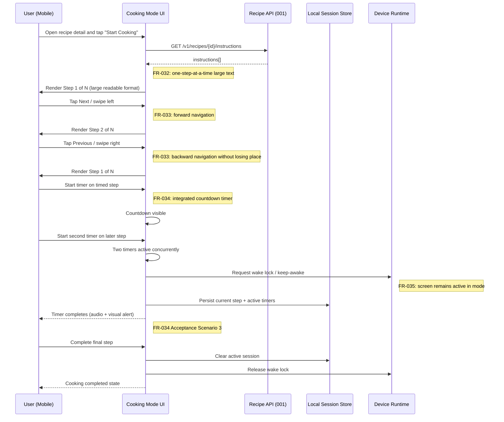

# User Journeys: Cooking Mode

**Branch**: `008-cooking-mode`
**Date**: 2026-05-09
**Status**: Draft
**Source**: [product-spec.md](./product-spec.md), [spec.md](../spec.md), [plan.md](../plan.md)

---

## Journey Notation

This document captures the primary end-to-end cooking flow and edge-case subflows. Steps reference FR IDs in brackets where canonical mapping exists.

---

## Persona 1: Active Home Cook — Journey A: Execute a Recipe in Cooking Mode

**Scenario**: User selects an existing recipe, enters cooking mode, progresses through steps, runs two timers, and completes the recipe without the screen sleeping.

---

## Edge Flow 1: Connectivity Loss Mid-Session

1. User enters cooking mode while online and recipe data loads.
2. Connectivity drops during step progression.
3. App continues local navigation/timers from loaded state.
4. User completes flow without additional network requests.

**Coverage**: Edge case in `spec.md`, REQ-011.

---

## Edge Flow 2: App Interruption and Resume Prompt

1. User leaves app while timers are active.
2. Session state is persisted with step index + timers.
3. On return (within configured window), app offers resume prompt.
4. User resumes at previous step and timer state.

**Coverage**: Plan session-resume model; mapped to US-007 (Should Have).

---

## Edge Flow 3: Voice Command Attempt (Phase 2)

1. User enables voice control.
2. App listens for bounded command grammar (`next`, `back`, `start timer`).
3. Recognized command advances or adjusts state.
4. Unrecognized input yields clear retry feedback.

**Coverage**: Should Have candidate; not a canonical standalone FR.

---

## Journey Coverage Matrix

| Persona          | Journey                        | Must Have | Should Have | Could Have | FRs covered                          |
| ---------------- | ------------------------------ | --------- | ----------- | ---------- | ------------------------------------ |
| Active Home Cook | Execute recipe in cooking mode | Yes       | Partial     | No         | FR-032, FR-033, FR-034, FR-035       |
| Active Home Cook | Connectivity loss continuation | Yes       | No          | No         | FR-032, FR-033, FR-034 (via REQ-011) |
| Active Home Cook | Interruption/resume            | No        | Yes         | No         | FR-033, FR-035                       |
| Active Home Cook | Voice command operation        | No        | Yes         | No         | FR-033, FR-034 (candidate mapping)   |
| Active Home Cook | Ingredient checkoff + scaling  | No        | No          | Yes        | Candidate scope warning only         |
