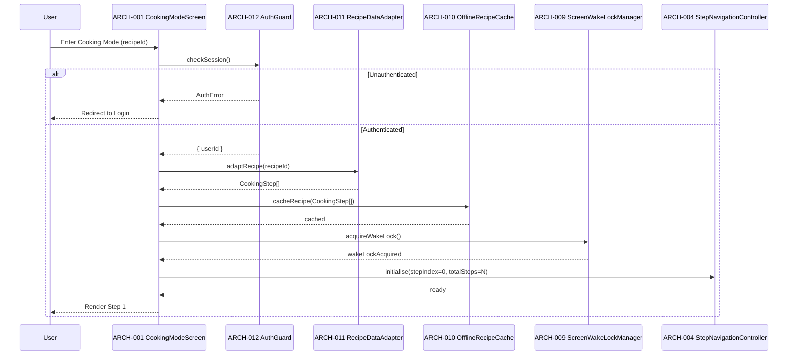
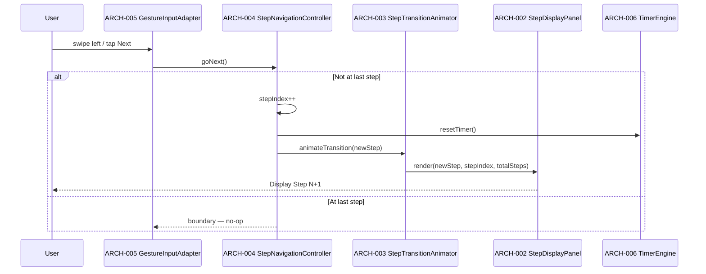
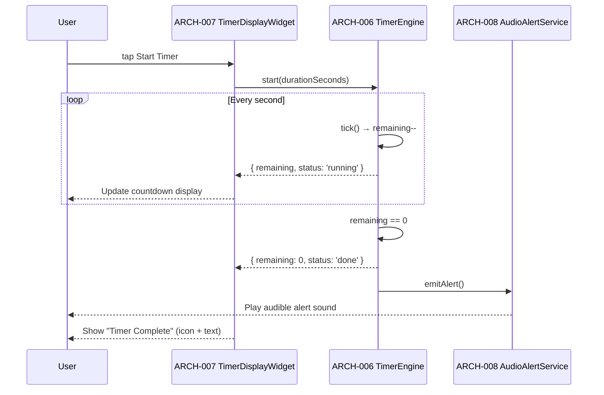
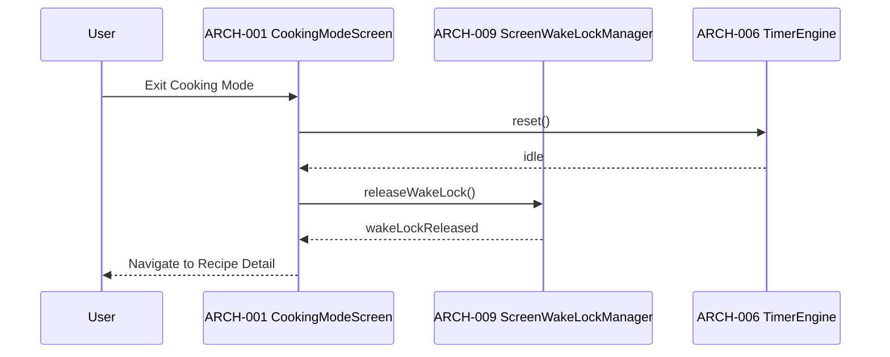
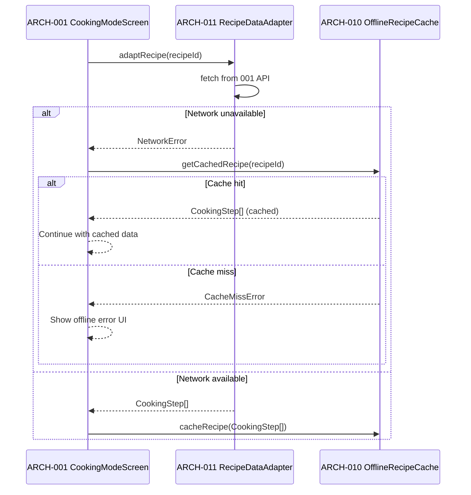

# Architecture Design: Cooking Mode

**Feature Branch**: `008-cooking-mode`
**Created**: 2026-05-09
**Status**: Draft
**Source**: `specs/008-cooking-mode/v-model/system-design.md`

## Overview

Cooking Mode is decomposed into 14 architecture modules organized across four Kruchten 4+1 views. The Logical View maps each system component to one or more focused software modules — separating UI rendering, state management, navigation logic, timer mechanics, audio, wake lock, offline caching, recipe adaptation, and auth guarding into independently testable units. Three cross-cutting modules address logging/error reporting, TypeScript quality enforcement, and accessibility compliance. The Process View documents the critical runtime interaction paths using Mermaid sequence diagrams. Every SYS-NNN from the System Design is covered by at least one ARCH-NNN.

## ID Schema

- **Architecture Module**: `ARCH-NNN` — sequential identifier for each module
- **Parent System Components**: Comma-separated `SYS-NNN` list per module (many-to-many)
- **Cross-Cutting Tag**: `[CROSS-CUTTING; rationale: shared infrastructure supports multiple SYS components]` for infrastructure/utility modules not traceable to a specific SYS
- Example: `ARCH-003` with Parent System Components `SYS-001, SYS-004` — module serves both components
- Example: `ARCH-010 [CROSS-CUTTING; rationale: shared infrastructure supports multiple SYS components]` — infrastructure module (e.g., Logger, Thread Pool) with rationale

## Logical View — Component Breakdown (IEEE 42010 / Kruchten 4+1)

| ARCH ID  | Name                         | Description                                                                                                                                                                                                                                                                                                        | Parent System Components                                                                                                           | Type      |
| -------- | ---------------------------- | ------------------------------------------------------------------------------------------------------------------------------------------------------------------------------------------------------------------------------------------------------------------------------------------------------------------ | ---------------------------------------------------------------------------------------------------------------------------------- | --------- |
| ARCH-001 | CookingModeScreen            | Top-level React Native screen component. Orchestrates entry into Cooking Mode: triggers auth guard, loads recipe via adapter, initialises wake lock, and renders the step display. Owns the Cooking Mode session lifecycle.                                                                                        | SYS-001, SYS-004, SYS-006, SYS-007                                                                                                 | Component |
| ARCH-002 | StepDisplayPanel             | Presentational component that renders the current recipe step in large, accessible typography. Receives `step`, `stepIndex`, and `totalSteps` as props. Applies minimum font size for 3-foot legibility. Exposes accessible role/label.                                                                            | SYS-001                                                                                                                            | Component |
| ARCH-003 | StepTransitionAnimator       | Handles animated transitions between steps (slide or fade). Wraps `StepDisplayPanel` and drives the animation on `stepIndex` change. Keeps transitions under 300 ms to avoid cognitive disruption.                                                                                                                 | SYS-001                                                                                                                            | Component |
| ARCH-004 | StepNavigationController     | Manages current step index state. Exposes `goNext()` and `goPrev()` actions with boundary clamping. Publishes `onStepChange` events consumed by `StepDisplayPanel` and `TimerEngine`.                                                                                                                              | SYS-002                                                                                                                            | Component |
| ARCH-005 | GestureInputAdapter          | Translates swipe gestures and tap events into `goNext` / `goPrev` calls on `StepNavigationController`. Abstracts platform gesture APIs (React Native `PanResponder` / `react-native-gesture-handler`).                                                                                                             | SYS-002                                                                                                                            | Adapter   |
| ARCH-006 | TimerEngine                  | State-machine service managing countdown lifecycle (idle → running → paused → done). Parses `durationSeconds` from step data, ticks via `setInterval`, and emits a `timerComplete` event on expiry. Exposes `{ remaining, status }` state.                                                                         | SYS-003                                                                                                                            | Service   |
| ARCH-007 | TimerDisplayWidget           | Presentational component showing the active countdown (MM:SS format) and a start/pause/reset control. Subscribes to `TimerEngine` state. Uses icon + text label pairing so color is never the sole state indicator.                                                                                                | SYS-003                                                                                                                            | Component |
| ARCH-008 | AudioAlertService            | Plays the audible alert sound when `TimerEngine` emits `timerComplete`. Uses `expo-av` (or Web Audio API on web). Degrades gracefully with a visual fallback if audio permission is denied.                                                                                                                        | SYS-003                                                                                                                            | Service   |
| ARCH-009 | ScreenWakeLockManager        | Acquires the platform wake lock on Cooking Mode entry and releases it on exit. Abstracts `expo-keep-awake` (mobile) and the Web Wake Lock API (web). Logs a warning and degrades gracefully on unsupported platforms.                                                                                              | SYS-004                                                                                                                            | Utility   |
| ARCH-010 | OfflineRecipeCache           | Persists the full `Recipe` entity to `AsyncStorage` when Cooking Mode is entered. Serves cached data on subsequent step loads if the network is unavailable. Invalidates cache on recipe update or explicit user action.                                                                                           | SYS-005                                                                                                                            | Service   |
| ARCH-011 | RecipeDataAdapter            | Transforms the `Recipe` entity from feature 001's API contract into the Cooking Mode internal `CookingStep[]` model. Read-only; never mutates source data. Validates shape with Zod before use.                                                                                                                    | SYS-006                                                                                                                            | Adapter   |
| ARCH-012 | AuthGuard                    | Checks for a valid Auth0 session before allowing Cooking Mode entry. Calls `getSession()` from `@auth0/nextjs-auth0` (web) or `react-native-auth0` (mobile). Redirects unauthenticated users to the login screen.                                                                                                  | SYS-007                                                                                                                            | Service   |
| ARCH-013 | ErrorBoundaryAndLogger       | [CROSS-CUTTING; rationale: shared infrastructure supports multiple SYS components] — React error boundary wrapping `CookingModeScreen`. Catches render errors, logs structured events via `@aws-lambda-powertools/logger` pattern, and displays a user-friendly fallback UI. Covers all components.                | [CROSS-CUTTING; rationale: shared infrastructure supports multiple SYS components] — infrastructure error handling for all SYS     | Utility   |
| ARCH-014 | AccessibilityAndQualityGuard | [CROSS-CUTTING; rationale: shared infrastructure supports multiple SYS components] — Compile-time and lint-time enforcement layer: TypeScript `strict: true` config, ESLint rules prohibiting `any`, JSDoc enforcement, and accessibility lint rules (`eslint-plugin-jsx-a11y`). Applies to all Cooking Mode code. | [CROSS-CUTTING; rationale: shared infrastructure supports multiple SYS components] — quality/accessibility enforcement for all SYS | Utility   |

## Process View — Dynamic Behavior (Kruchten 4+1)

### Interaction 1: Cooking Mode Entry



### Interaction 2: Step Navigation (Forward)



### Interaction 3: Timer Start and Completion



### Interaction 4: Cooking Mode Exit



### Interaction 5: Offline Step Load



## Interface View — Module Contracts (IEEE 42010)

### External-Facing Module Interfaces

| ARCH ID  | Interface Name              | Exposed To       | Protocol / API                        | Input                                     | Output                                     | Error Contract                                             |
| -------- | --------------------------- | ---------------- | ------------------------------------- | ----------------------------------------- | ------------------------------------------ | ---------------------------------------------------------- |
| ARCH-001 | `CookingModeScreen`         | React Navigation | React component props                 | `{ recipeId: string }`                    | Rendered screen                            | Error boundary catches render failures                     |
| ARCH-012 | `AuthGuard.checkSession()`  | ARCH-001         | Auth0 SDK                             | None (reads session context)              | `{ userId: string }` or throws `AuthError` | Redirect to login on `AuthError`                           |
| ARCH-011 | `RecipeDataAdapter.adapt()` | ARCH-001         | REST (001 API) + Zod validation       | `recipeId: string`                        | `CookingStep[]`                            | Throws `RecipeNotFoundError` or `ValidationError`          |
| ARCH-009 | `ScreenWakeLockManager`     | ARCH-001         | `expo-keep-awake` / Web Wake Lock API | `acquire()` / `release()` calls           | `void`                                     | Logs warning; degrades gracefully on unsupported platforms |
| ARCH-008 | `AudioAlertService.play()`  | ARCH-006         | `expo-av` / Web Audio API             | None (triggered by `timerComplete` event) | `void`                                     | Logs warning; shows visual fallback if audio denied        |

### Internal Module Interfaces

| ARCH ID  | Interface Name                 | Consumed By        | Protocol                   | Input                                                                    | Output                                                         | Error Contract                                               |
| -------- | ------------------------------ | ------------------ | -------------------------- | ------------------------------------------------------------------------ | -------------------------------------------------------------- | ------------------------------------------------------------ |
| ARCH-004 | `StepNavigationController`     | ARCH-001, ARCH-005 | React state / callbacks    | `goNext()`, `goPrev()`, `initialise(stepIndex, totalSteps)`              | `{ stepIndex: number, totalSteps: number, onStepChange: fn }`  | Clamps to [0, totalSteps-1]; no-op at boundaries             |
| ARCH-005 | `GestureInputAdapter`          | ARCH-004           | Platform gesture events    | Swipe / tap events                                                       | Calls `goNext()` or `goPrev()` on controller                   | Ignores unrecognised gestures                                |
| ARCH-003 | `StepTransitionAnimator`       | ARCH-001, ARCH-004 | React animation props      | `{ step: CookingStep, stepIndex: number }`                               | Animated render of `StepDisplayPanel`                          | Falls back to instant render if animation fails              |
| ARCH-002 | `StepDisplayPanel`             | ARCH-003           | React props                | `{ step: CookingStep, stepIndex: number, totalSteps: number }`           | Rendered step UI with accessible role/label                    | Shows placeholder on missing step data                       |
| ARCH-006 | `TimerEngine`                  | ARCH-007, ARCH-004 | State machine / events     | `start(durationSeconds)`, `pause()`, `reset()`                           | `{ remaining: number, status: 'idle' \| 'running' \| 'done' }` | Resets on invalid duration; emits `timerComplete` on done    |
| ARCH-007 | `TimerDisplayWidget`           | ARCH-001           | React props / subscription | `{ timerState: TimerState, onStart: fn, onPause: fn, onReset: fn }`      | Rendered countdown UI (MM:SS + controls)                       | Shows "—" when no timer is active                            |
| ARCH-010 | `OfflineRecipeCache`           | ARCH-001, ARCH-011 | AsyncStorage               | `cacheRecipe(steps: CookingStep[])`, `getCachedRecipe(recipeId: string)` | `void` / `CookingStep[]`                                       | Logs error on write failure; throws `CacheMissError` on miss |
| ARCH-013 | `ErrorBoundaryAndLogger`       | All components     | React error boundary       | Render errors from child components                                      | Fallback UI + structured log event                             | Always renders fallback; never re-throws to root             |
| ARCH-014 | `AccessibilityAndQualityGuard` | Build pipeline     | TypeScript / ESLint config | Source files                                                             | Compile errors / lint warnings                                 | CI fails on any `strict` violation or `any` usage            |

## Data Flow View (Kruchten 4+1)

```text
[001 Recipe API]
      │ REST (recipeId)
      ▼
[ARCH-011 RecipeDataAdapter] ──Zod validate──► CookingStep[]
      │
      ├──► [ARCH-010 OfflineRecipeCache] ──AsyncStorage──► persisted CookingStep[]
      │
      └──► [ARCH-001 CookingModeScreen]
                │
                ├──► [ARCH-004 StepNavigationController]
                │           │ stepIndex
                │           ▼
                │    [ARCH-003 StepTransitionAnimator]
                │           │ step + stepIndex
                │           ▼
                │    [ARCH-002 StepDisplayPanel] ──► User (rendered step)
                │
                ├──► [ARCH-006 TimerEngine]
                │           │ { remaining, status }
                │           ├──► [ARCH-007 TimerDisplayWidget] ──► User (countdown)
                │           └──► [ARCH-008 AudioAlertService] ──► User (alert sound)
                │
                ├──► [ARCH-009 ScreenWakeLockManager] ──► Platform (wake lock)
                └──► [ARCH-012 AuthGuard] ──► Auth0 (session check)

[ARCH-005 GestureInputAdapter] ──► [ARCH-004 StepNavigationController]
[ARCH-013 ErrorBoundaryAndLogger] ── wraps ──► all components
[ARCH-014 AccessibilityAndQualityGuard] ── enforces ──► build pipeline
```

## SYS↔ARCH Traceability Matrix

| SYS ID  | SYS Name                | ARCH Modules                                                    |
| ------- | ----------------------- | --------------------------------------------------------------- |
| SYS-001 | Step Display            | ARCH-001 (lifecycle), ARCH-002 (render), ARCH-003 (animation)   |
| SYS-002 | Step Navigation         | ARCH-004 (controller), ARCH-005 (gesture input)                 |
| SYS-003 | Timer Engine            | ARCH-006 (engine), ARCH-007 (display), ARCH-008 (audio alert)   |
| SYS-004 | Screen Wake Lock        | ARCH-009 (wake lock manager)                                    |
| SYS-005 | Offline Recipe Cache    | ARCH-010 (cache service)                                        |
| SYS-006 | Recipe Data Adapter     | ARCH-011 (adapter), ARCH-001 (consumer)                         |
| SYS-007 | Auth Guard              | ARCH-012 (auth guard), ARCH-001 (consumer)                      |
| SYS-008 | Quality & Accessibility | ARCH-013 (error boundary/logger), ARCH-014 (quality/a11y guard) |

**Coverage**: All 8 SYS components are covered. No SYS is orphaned.

## ARCH Module Summary

| Count  | Category              | ARCH IDs                                                                   |
| ------ | --------------------- | -------------------------------------------------------------------------- |
| 12     | Feature modules       | ARCH-001 through ARCH-012                                                  |
| 2      | Cross-cutting modules | ARCH-013 (ErrorBoundaryAndLogger), ARCH-014 (AccessibilityAndQualityGuard) |
| **14** | **Total**             |                                                                            |

## Derived Modules

None. All 14 ARCH modules are directly traceable to SYS components or are explicitly tagged `[CROSS-CUTTING; rationale: shared infrastructure supports multiple SYS components]` with rationale.

## Physical View — Deployment Topology

The feature deploys within the Sous Chef AWS/serverless topology. Client-facing web/mobile modules run in their respective application packages. Backend API, worker, queue, database, cache, storage, observability, and infrastructure modules deploy to the configured AWS account and region. Each ARCH module maps to the runtime described in the Logical View and the package/source paths listed in the Development View.

## Development View — Source Organization

Implementation modules are organized by platform and service boundary: web code under Next.js application packages, mobile code under Expo packages, backend services under API/Lambda packages, shared contracts under shared TypeScript packages, and infrastructure under CDK/IaC packages. This view constrains ownership, build boundaries, and deployment units for every ARCH-NNN module listed above.

## Scenarios — Architecture Validation

Primary scenarios validate the 4+1 architecture: successful request flow through user-facing entrypoints, dependency failure propagation through process boundaries, data persistence and retrieval through storage boundaries, and deployment/change isolation through development-view package ownership. Each scenario traces back to the SYS coverage listed on ARCH rows.
