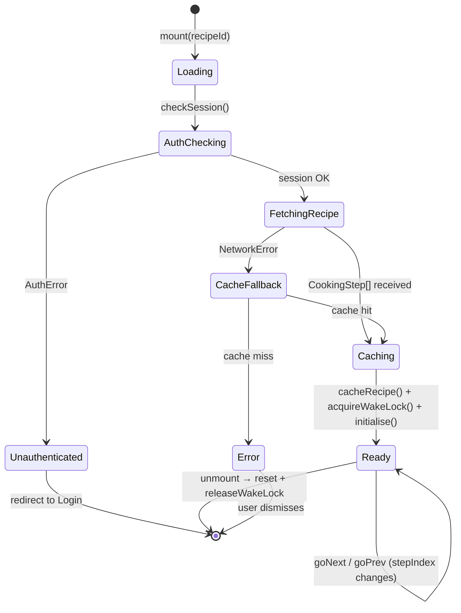
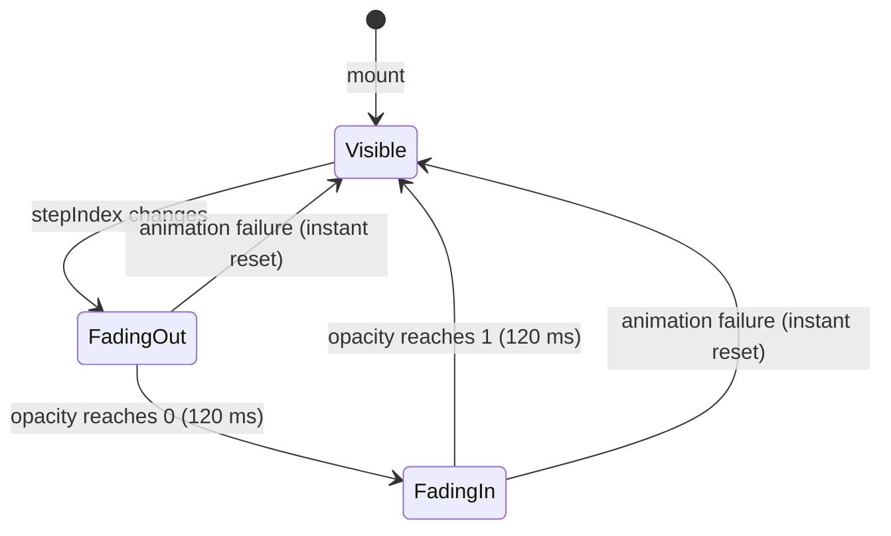
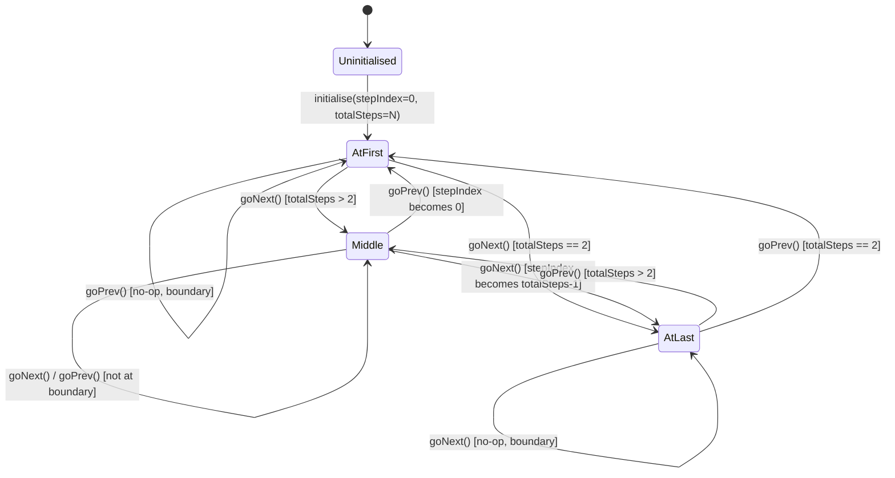
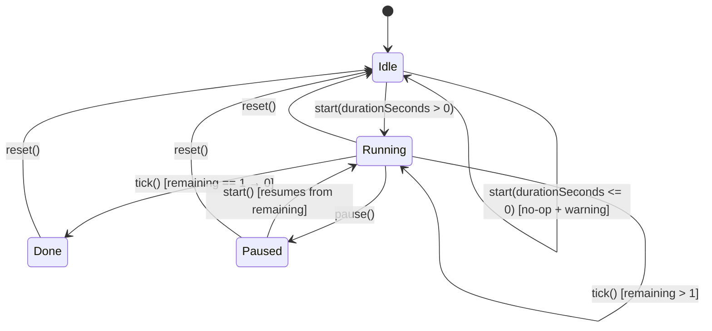
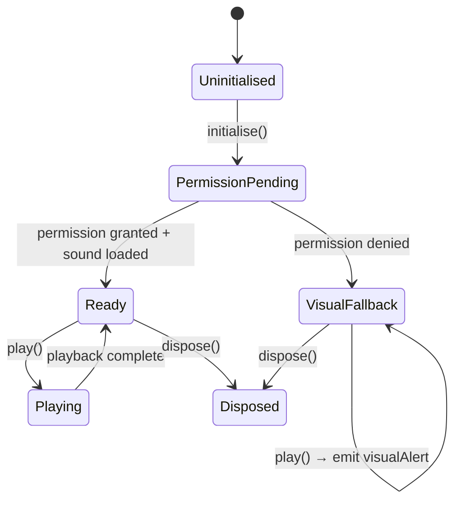
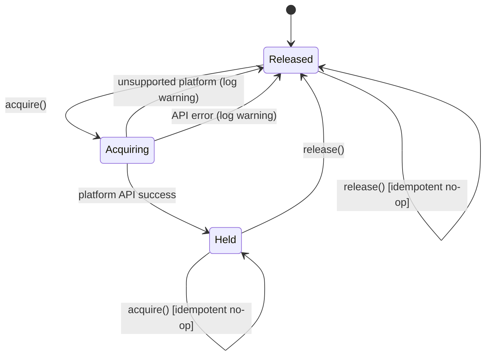
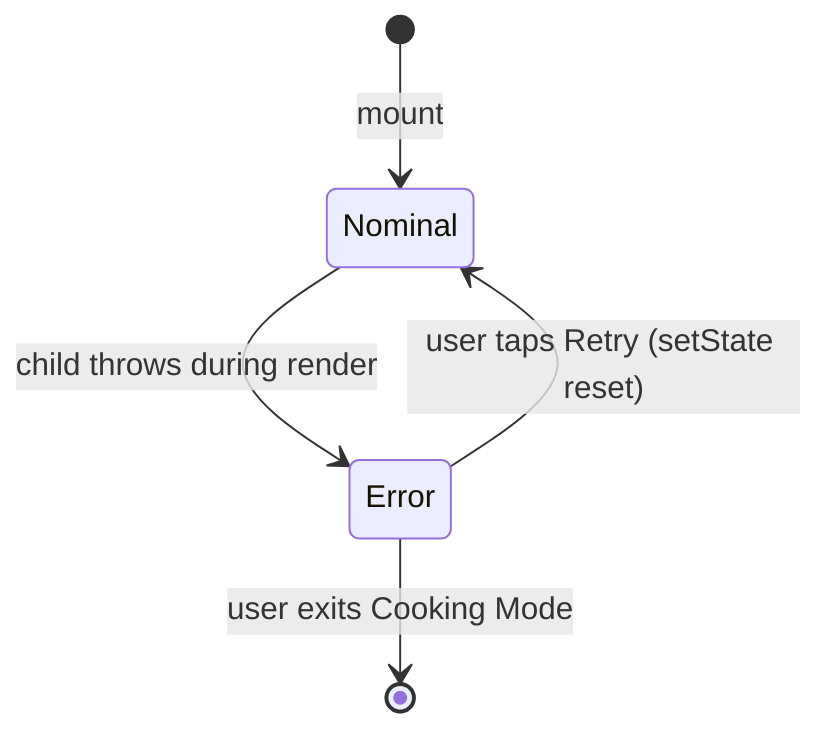

# Module Design: Cooking Mode

**Feature Branch**: `008-cooking-mode`
**Created**: 2026-05-09
**Status**: Draft
**Source**: `specs/008-cooking-mode/v-model/architecture-design.md`

## Overview

Cooking Mode's 14 architecture modules (ARCH-001 through ARCH-014) are decomposed into 18 low-level module designs (MOD-001 through MOD-018). Complex architecture modules with distinct stateful and presentational concerns are split into separate MODs to keep each unit independently testable. Every MOD is specified with four mandatory views — Algorithmic/Logic, State Machine, Internal Data Structures, and Error Handling — at a level of detail where writing the actual TypeScript/React Native source code is a direct translation exercise requiring no further design decisions.

## ID Schema

- **Module Design**: `MOD-NNN` — sequential identifier for each module (3-digit zero-padded)
- **Parent Architecture Modules**: Comma-separated `ARCH-NNN` list per module (many-to-many, authoritative for traceability)
- **Target Source File(s)**: Comma-separated file paths mapping to the repository codebase
- Example: `MOD-003` with Parent Architecture Modules `ARCH-001, ARCH-004` — module serves both architecture components
- Example: `MOD-007 [EXTERNAL]` — third-party library wrapper, documents interface only

## ARCH → MOD Coverage Table

| ARCH ID  | ARCH Name                    | MOD(s)                             |
| -------- | ---------------------------- | ---------------------------------- |
| ARCH-001 | CookingModeScreen            | MOD-001                            |
| ARCH-002 | StepDisplayPanel             | MOD-002                            |
| ARCH-003 | StepTransitionAnimator       | MOD-003                            |
| ARCH-004 | StepNavigationController     | MOD-004                            |
| ARCH-005 | GestureInputAdapter          | MOD-005                            |
| ARCH-006 | TimerEngine                  | MOD-006                            |
| ARCH-007 | TimerDisplayWidget           | MOD-007                            |
| ARCH-008 | AudioAlertService            | MOD-008                            |
| ARCH-009 | ScreenWakeLockManager        | MOD-009                            |
| ARCH-010 | OfflineRecipeCache           | MOD-010                            |
| ARCH-011 | RecipeDataAdapter            | MOD-011                            |
| ARCH-012 | AuthGuard                    | MOD-012                            |
| ARCH-013 | ErrorBoundaryAndLogger       | MOD-013, MOD-014                   |
| ARCH-014 | AccessibilityAndQualityGuard | MOD-015, MOD-016, MOD-017, MOD-018 |

## Module Designs

---

### Module: MOD-001 (CookingModeScreen)

**Parent Architecture Modules**: ARCH-001
**Target Source File(s)**: `src/features/cooking-mode/screens/CookingModeScreen.tsx`

#### Algorithmic / Logic View

```pseudocode
COMPONENT CookingModeScreen(props: { recipeId: string }) -> ReactElement:

  // Mount phase
  ON_MOUNT:
    session = AWAIT AuthGuard.checkSession()
    IF session IS AuthError:
      navigate("Login")
      RETURN

    steps = AWAIT RecipeDataAdapter.adapt(props.recipeId)
    IF steps IS RecipeNotFoundError OR ValidationError:
      OfflineRecipeCache.getCachedRecipe(props.recipeId)
        IF cache hit:
          steps = cachedSteps
        ELSE:
          SET state.error = "Recipe unavailable offline"
          RETURN

    OfflineRecipeCache.cacheRecipe(steps)
    ScreenWakeLockManager.acquire()
    StepNavigationController.initialise(stepIndex=0, totalSteps=steps.length)
    SET state.steps = steps
    SET state.ready = true

  // Render
  IF state.error IS NOT NULL:
    RETURN <ErrorFallbackUI message=state.error />

  IF NOT state.ready:
    RETURN <LoadingSpinner />

  currentStep = state.steps[state.stepIndex]
  RETURN:
    <ErrorBoundaryAndLogger>
      <StepTransitionAnimator step=currentStep stepIndex=state.stepIndex>
        <StepDisplayPanel step=currentStep stepIndex=state.stepIndex totalSteps=state.totalSteps />
      </StepTransitionAnimator>
      IF currentStep.durationSeconds IS NOT NULL:
        <TimerDisplayWidget durationSeconds=currentStep.durationSeconds />
      <NavigationControls onNext=goNext onPrev=goPrev />
    </ErrorBoundaryAndLogger>

  // Unmount phase
  ON_UNMOUNT:
    TimerEngine.reset()
    ScreenWakeLockManager.release()

FUNCTION goNext():
  StepNavigationController.goNext()
  SET state.stepIndex = StepNavigationController.stepIndex

FUNCTION goPrev():
  StepNavigationController.goPrev()
  SET state.stepIndex = StepNavigationController.stepIndex
```

#### State Machine View



#### Internal Data Structures

| Name         | Type             | Size/Constraints        | Initialization | Description                                     |
| ------------ | ---------------- | ----------------------- | -------------- | ----------------------------------------------- |
| `steps`      | `CookingStep[]`  | 1–200 elements          | `[]`           | Adapted recipe steps for the current session    |
| `stepIndex`  | `number`         | `[0, steps.length - 1]` | `0`            | Index of the currently displayed step           |
| `totalSteps` | `number`         | `>= 1`                  | `0`            | Total number of steps; set on initialise        |
| `ready`      | `boolean`        | —                       | `false`        | True once recipe loaded and wake lock acquired  |
| `error`      | `string \| null` | max 256 chars           | `null`         | Non-null when session/recipe load fails fatally |

#### Error Handling & Return Codes

| Error Condition             | Error Code / Exception | Architecture Contract                            | Recovery                                    |
| --------------------------- | ---------------------- | ------------------------------------------------ | ------------------------------------------- |
| Auth session missing        | `AuthError`            | ARCH-012 Interface: throws `AuthError`           | Navigate to Login screen                    |
| Recipe not found            | `RecipeNotFoundError`  | ARCH-011 Interface: throws `RecipeNotFoundError` | Attempt cache fallback via ARCH-010         |
| Recipe validation failure   | `ValidationError`      | ARCH-011 Interface: throws `ValidationError`     | Attempt cache fallback via ARCH-010         |
| Cache miss on offline load  | `CacheMissError`       | ARCH-010 Interface: throws `CacheMissError`      | Set `state.error`; render `ErrorFallbackUI` |
| Render error (child throws) | React render exception | ARCH-013 ErrorBoundary catches                   | ErrorBoundary renders fallback UI           |

---

### Module: MOD-002 (StepDisplayPanel)

**Parent Architecture Modules**: ARCH-002
**Target Source File(s)**: `src/features/cooking-mode/components/StepDisplayPanel.tsx`

#### Algorithmic / Logic View

```pseudocode
COMPONENT StepDisplayPanel(props: {
  step: CookingStep,
  stepIndex: number,
  totalSteps: number
}) -> ReactElement:

  // Validate props
  IF props.step IS NULL OR UNDEFINED:
    RETURN <PlaceholderText text="Loading step…" />

  progressLabel = "Step " + (props.stepIndex + 1) + " of " + props.totalSteps

  RETURN:
    <View accessibilityRole="region" accessibilityLabel=progressLabel>
      <Text style={{ fontSize: MAX(24, DEVICE_FONT_SCALE * 24) }}>
        props.step.instruction
      </Text>
      IF props.step.note IS NOT NULL:
        <Text style={{ fontSize: MAX(18, DEVICE_FONT_SCALE * 18) }}>
          props.step.note
        </Text>
      <Text accessibilityLabel=progressLabel style={styles.progress}>
        progressLabel
      </Text>
    </View>
```

#### State Machine View

N/A — Stateless pure presentational component; all state is owned by ARCH-004.

#### Internal Data Structures

| Name            | Type     | Size/Constraints | Initialization | Description                                      |
| --------------- | -------- | ---------------- | -------------- | ------------------------------------------------ |
| `progressLabel` | `string` | max 32 chars     | computed       | Human-readable "Step N of M" accessibility label |

#### Error Handling & Return Codes

| Error Condition               | Error Code / Exception        | Architecture Contract                 | Recovery                            |
| ----------------------------- | ----------------------------- | ------------------------------------- | ----------------------------------- |
| `step` prop is null/undefined | `PropsMissingError` (runtime) | ARCH-002 Interface: shows placeholder | Render `<PlaceholderText>` fallback |

---

### Module: MOD-003 (StepTransitionAnimator)

**Parent Architecture Modules**: ARCH-003
**Target Source File(s)**: `src/features/cooking-mode/components/StepTransitionAnimator.tsx`

#### Algorithmic / Logic View

```pseudocode
COMPONENT StepTransitionAnimator(props: {
  step: CookingStep,
  stepIndex: number,
  children: ReactElement
}) -> ReactElement:

  animatedValue = USE_ANIMATED_VALUE(initial=1.0)
  prevStepIndex = USE_REF(props.stepIndex)

  ON_EFFECT([props.stepIndex]):
    IF props.stepIndex != prevStepIndex.current:
      // Fade out → update → fade in, total ≤ 300 ms
      Animated.sequence([
        Animated.timing(animatedValue, { toValue: 0, duration: 120, useNativeDriver: true }),
        Animated.timing(animatedValue, { toValue: 1, duration: 120, useNativeDriver: true })
      ]).start(onComplete: () =>
        IF animation failed:
          animatedValue.setValue(1)  // instant fallback
      )
      prevStepIndex.current = props.stepIndex

  RETURN:
    <Animated.View style={{ opacity: animatedValue }}>
      props.children
    </Animated.View>
```

#### State Machine View



#### Internal Data Structures

| Name            | Type                             | Size/Constraints | Initialization    | Description                            |
| --------------- | -------------------------------- | ---------------- | ----------------- | -------------------------------------- |
| `animatedValue` | `Animated.Value`                 | `[0.0, 1.0]`     | `1.0`             | Drives opacity of the animated wrapper |
| `prevStepIndex` | `React.MutableRefObject<number>` | integer          | `props.stepIndex` | Tracks previous step to detect changes |

#### Error Handling & Return Codes

| Error Condition         | Error Code / Exception | Architecture Contract                            | Recovery                                        |
| ----------------------- | ---------------------- | ------------------------------------------------ | ----------------------------------------------- |
| Animation start failure | `AnimationError`       | ARCH-003 Interface: falls back to instant render | `animatedValue.setValue(1)` — no visible glitch |

---

### Module: MOD-004 (StepNavigationController)

**Parent Architecture Modules**: ARCH-004
**Target Source File(s)**: `src/features/cooking-mode/controllers/StepNavigationController.ts`

#### Algorithmic / Logic View

```pseudocode
CLASS StepNavigationController:

  PRIVATE stepIndex: number = 0
  PRIVATE totalSteps: number = 0
  PRIVATE onStepChangeCallbacks: Array<(index: number) => void> = []

  FUNCTION initialise(stepIndex: number, totalSteps: number) -> void:
    IF totalSteps < 1:
      THROW Error("totalSteps must be >= 1")
    this.stepIndex = CLAMP(stepIndex, 0, totalSteps - 1)
    this.totalSteps = totalSteps
    NOTIFY_ALL(this.stepIndex)

  FUNCTION goNext() -> void:
    IF this.stepIndex >= this.totalSteps - 1:
      RETURN  // boundary clamp — no-op at last step
    this.stepIndex = this.stepIndex + 1
    NOTIFY_ALL(this.stepIndex)

  FUNCTION goPrev() -> void:
    IF this.stepIndex <= 0:
      RETURN  // boundary clamp — no-op at first step
    this.stepIndex = this.stepIndex - 1
    NOTIFY_ALL(this.stepIndex)

  FUNCTION getState() -> { stepIndex: number, totalSteps: number }:
    RETURN { stepIndex: this.stepIndex, totalSteps: this.totalSteps }

  FUNCTION onStepChange(callback: (index: number) => void) -> UnsubscribeFn:
    this.onStepChangeCallbacks.push(callback)
    RETURN () => REMOVE(callback FROM this.onStepChangeCallbacks)

  PRIVATE FUNCTION NOTIFY_ALL(index: number) -> void:
    FOR EACH callback IN this.onStepChangeCallbacks:
      callback(index)
```

#### State Machine View



#### Internal Data Structures

| Name                    | Type                             | Size/Constraints      | Initialization | Description                         |
| ----------------------- | -------------------------------- | --------------------- | -------------- | ----------------------------------- |
| `stepIndex`             | `number`                         | `[0, totalSteps - 1]` | `0`            | Current step index                  |
| `totalSteps`            | `number`                         | `>= 1`                | `0`            | Total number of steps in the recipe |
| `onStepChangeCallbacks` | `Array<(index: number) => void>` | max 10 subscribers    | `[]`           | Registered step-change listeners    |

#### Error Handling & Return Codes

| Error Condition        | Error Code / Exception             | Architecture Contract                      | Recovery                                       |
| ---------------------- | ---------------------------------- | ------------------------------------------ | ---------------------------------------------- |
| `totalSteps < 1`       | `Error("totalSteps must be >= 1")` | ARCH-004 Interface: throws on invalid init | Caller (ARCH-001) must validate before calling |
| `goNext` at last step  | No-op (silent)                     | ARCH-004 Interface: boundary clamp         | No state change; no notification emitted       |
| `goPrev` at first step | No-op (silent)                     | ARCH-004 Interface: boundary clamp         | No state change; no notification emitted       |

---

### Module: MOD-005 (GestureInputAdapter)

**Parent Architecture Modules**: ARCH-005
**Target Source File(s)**: `src/features/cooking-mode/adapters/GestureInputAdapter.tsx`

#### Algorithmic / Logic View

```pseudocode
COMPONENT GestureInputAdapter(props: {
  onNext: () => void,
  onPrev: () => void,
  children: ReactElement
}) -> ReactElement:

  // PanResponder for swipe detection
  panResponder = USE_MEMO(() =>
    PanResponder.create({
      onStartShouldSetPanResponder: () => true,
      onMoveShouldSetPanResponder: (_, gestureState) =>
        ABS(gestureState.dx) > ABS(gestureState.dy)  // horizontal swipe

      onPanResponderRelease: (_, gestureState) ->
        SWIPE_THRESHOLD = 50  // px
        IF gestureState.dx < -SWIPE_THRESHOLD:
          props.onNext()   // swipe left → next
        ELSE IF gestureState.dx > SWIPE_THRESHOLD:
          props.onPrev()   // swipe right → prev
        // else: ignore — below threshold
    })
  , [props.onNext, props.onPrev])

  RETURN:
    <View {...panResponder.panHandlers} style={{ flex: 1 }}>
      props.children
    </View>
```

#### State Machine View

N/A — Stateless gesture adapter; delegates all state to StepNavigationController.

#### Internal Data Structures

| Name              | Type                   | Size/Constraints | Initialization | Description                                    |
| ----------------- | ---------------------- | ---------------- | -------------- | ---------------------------------------------- |
| `SWIPE_THRESHOLD` | `number` (constant)    | `50` px          | `50`           | Minimum horizontal displacement to trigger nav |
| `panResponder`    | `PanResponderInstance` | —                | `USE_MEMO`     | Memoised gesture handler instance              |

#### Error Handling & Return Codes

| Error Condition                    | Error Code / Exception | Architecture Contract                             | Recovery                                    |
| ---------------------------------- | ---------------------- | ------------------------------------------------- | ------------------------------------------- |
| Unrecognised gesture (< threshold) | None                   | ARCH-005 Interface: ignores unrecognised gestures | No-op; gesture event discarded              |
| `onNext`/`onPrev` callback throws  | Propagated exception   | ARCH-004 Interface                                | Caller (ARCH-001) handles via ErrorBoundary |

---

### Module: MOD-006 (TimerEngine)

**Parent Architecture Modules**: ARCH-006
**Target Source File(s)**: `src/features/cooking-mode/services/TimerEngine.ts`

#### Algorithmic / Logic View

```pseudocode
CLASS TimerEngine:

  PRIVATE status: 'idle' | 'running' | 'paused' | 'done' = 'idle'
  PRIVATE remaining: number = 0
  PRIVATE durationSeconds: number = 0
  PRIVATE intervalId: NodeJS.Timeout | null = null
  PRIVATE listeners: Array<(state: TimerState) => void> = []

  FUNCTION start(durationSeconds: number) -> void:
    IF durationSeconds <= 0:
      LOG_WARNING("Invalid durationSeconds; timer not started")
      RETURN
    IF this.status == 'running':
      RETURN  // already running — no-op
    this.durationSeconds = durationSeconds
    IF this.status != 'paused':
      this.remaining = durationSeconds
    this.status = 'running'
    this.intervalId = SET_INTERVAL(() => this.tick(), 1000)
    EMIT_STATE()

  FUNCTION pause() -> void:
    IF this.status != 'running':
      RETURN
    CLEAR_INTERVAL(this.intervalId)
    this.intervalId = null
    this.status = 'paused'
    EMIT_STATE()

  FUNCTION reset() -> void:
    CLEAR_INTERVAL(this.intervalId)
    this.intervalId = null
    this.remaining = 0
    this.status = 'idle'
    EMIT_STATE()

  PRIVATE FUNCTION tick() -> void:
    this.remaining = this.remaining - 1
    IF this.remaining <= 0:
      this.remaining = 0
      this.status = 'done'
      CLEAR_INTERVAL(this.intervalId)
      this.intervalId = null
      EMIT_STATE()
      EMIT_EVENT('timerComplete')
    ELSE:
      EMIT_STATE()

  FUNCTION subscribe(listener: (state: TimerState) => void) -> UnsubscribeFn:
    this.listeners.push(listener)
    RETURN () => REMOVE(listener FROM this.listeners)

  PRIVATE FUNCTION EMIT_STATE() -> void:
    state = { remaining: this.remaining, status: this.status }
    FOR EACH listener IN this.listeners:
      listener(state)
```

#### State Machine View



#### Internal Data Structures

| Name              | Type                                        | Size/Constraints       | Initialization | Description                               |
| ----------------- | ------------------------------------------- | ---------------------- | -------------- | ----------------------------------------- |
| `status`          | `'idle' \| 'running' \| 'paused' \| 'done'` | enum                   | `'idle'`       | Current timer lifecycle state             |
| `remaining`       | `number`                                    | `[0, durationSeconds]` | `0`            | Seconds remaining in the countdown        |
| `durationSeconds` | `number`                                    | `> 0`                  | `0`            | Total duration set on last `start()` call |
| `intervalId`      | `NodeJS.Timeout \| null`                    | —                      | `null`         | Handle for the active `setInterval`       |
| `listeners`       | `Array<(state: TimerState) => void>`        | max 5 subscribers      | `[]`           | State-change subscribers                  |

#### Error Handling & Return Codes

| Error Condition                   | Error Code / Exception | Architecture Contract                          | Recovery                               |
| --------------------------------- | ---------------------- | ---------------------------------------------- | -------------------------------------- |
| `durationSeconds <= 0`            | LOG_WARNING (no throw) | ARCH-006 Interface: resets on invalid duration | Log warning; timer stays in `idle`     |
| `start()` called while running    | No-op (silent)         | ARCH-006 Interface                             | Ignore duplicate start                 |
| `pause()` called when not running | No-op (silent)         | ARCH-006 Interface                             | Ignore                                 |
| Interval cleared unexpectedly     | `IntervalError`        | ARCH-006 Interface                             | `reset()` to return to idle; log error |

---

### Module: MOD-007 (TimerDisplayWidget)

**Parent Architecture Modules**: ARCH-007
**Target Source File(s)**: `src/features/cooking-mode/components/TimerDisplayWidget.tsx`

#### Algorithmic / Logic View

```pseudocode
COMPONENT TimerDisplayWidget(props: {
  timerState: TimerState,
  onStart: (durationSeconds: number) => void,
  onPause: () => void,
  onReset: () => void
}) -> ReactElement:

  // Format remaining seconds as MM:SS
  FUNCTION formatTime(seconds: number) -> string:
    IF seconds <= 0:
      RETURN "00:00"
    minutes = FLOOR(seconds / 60)
    secs = seconds MOD 60
    RETURN PAD(minutes, 2) + ":" + PAD(secs, 2)

  displayTime = formatTime(props.timerState.remaining)
  status = props.timerState.status

  // Determine control button state
  IF status == 'idle' OR status == 'paused':
    primaryAction = { label: "Start", icon: PlayIcon, onPress: props.onStart }
  ELSE IF status == 'running':
    primaryAction = { label: "Pause", icon: PauseIcon, onPress: props.onPause }
  ELSE:  // 'done'
    primaryAction = { label: "Reset", icon: ResetIcon, onPress: props.onReset }

  statusLabel = SWITCH status:
    'idle'    -> "Timer ready"
    'running' -> "Timer running"
    'paused'  -> "Timer paused"
    'done'    -> "Timer complete"

  RETURN:
    <View accessibilityRole="timer" accessibilityLabel=statusLabel>
      IF status == 'done':
        <Text>Timer Complete</Text>
        <Icon name=CheckIcon />
      ELSE:
        <Text accessibilityLabel=(displayTime + " remaining")>
          displayTime
        </Text>
      <TouchableOpacity
        onPress=primaryAction.onPress
        accessibilityLabel=primaryAction.label>
        <Icon name=primaryAction.icon />
        <Text>primaryAction.label</Text>
      </TouchableOpacity>
      IF status != 'idle':
        <TouchableOpacity onPress=props.onReset accessibilityLabel="Reset timer">
          <Icon name=ResetIcon />
          <Text>Reset</Text>
        </TouchableOpacity>
    </View>
```

#### State Machine View

N/A — Stateless presentational component; all timer state is owned by ARCH-006 (TimerEngine).

#### Internal Data Structures

| Name          | Type     | Size/Constraints | Initialization | Description                                   |
| ------------- | -------- | ---------------- | -------------- | --------------------------------------------- |
| `displayTime` | `string` | 5 chars (MM:SS)  | computed       | Formatted countdown string for display        |
| `statusLabel` | `string` | max 20 chars     | computed       | Accessibility label describing current status |

#### Error Handling & Return Codes

| Error Condition                | Error Code / Exception | Architecture Contract                       | Recovery                           |
| ------------------------------ | ---------------------- | ------------------------------------------- | ---------------------------------- |
| `timerState` is null/undefined | `PropsMissingError`    | ARCH-007 Interface: shows "—" when no timer | Render `"—"` placeholder; no crash |
| `remaining` is negative        | None (defensive)       | ARCH-007 Interface                          | `formatTime` clamps to `"00:00"`   |

---

### Module: MOD-008 (AudioAlertService)

**Parent Architecture Modules**: ARCH-008
**Target Source File(s)**: `src/features/cooking-mode/services/AudioAlertService.ts`

#### Algorithmic / Logic View

```pseudocode
CLASS AudioAlertService:

  PRIVATE sound: Audio.Sound | null = null
  PRIVATE permissionGranted: boolean = false

  ASYNC FUNCTION initialise() -> void:
    permission = AWAIT Audio.requestPermissionsAsync()
    IF permission.status == 'granted':
      this.permissionGranted = true
      this.sound = AWAIT Audio.Sound.createAsync(ALERT_SOUND_ASSET)
    ELSE:
      LOG_WARNING("Audio permission denied; visual fallback active")
      this.permissionGranted = false

  ASYNC FUNCTION play() -> void:
    IF this.permissionGranted AND this.sound IS NOT NULL:
      AWAIT this.sound.replayAsync()
    ELSE:
      // Visual fallback: emit 'visualAlert' event for UI to handle
      EMIT_EVENT('visualAlert')

  ASYNC FUNCTION dispose() -> void:
    IF this.sound IS NOT NULL:
      AWAIT this.sound.unloadAsync()
      this.sound = null
```

#### State Machine View



#### Internal Data Structures

| Name                | Type                  | Size/Constraints | Initialization | Description                          |
| ------------------- | --------------------- | ---------------- | -------------- | ------------------------------------ |
| `sound`             | `Audio.Sound \| null` | —                | `null`         | Loaded expo-av sound object          |
| `permissionGranted` | `boolean`             | —                | `false`        | Whether audio permission was granted |
| `ALERT_SOUND_ASSET` | `Asset` (constant)    | ≤ 100 KB         | static import  | Bundled alert sound file reference   |

#### Error Handling & Return Codes

| Error Condition                | Error Code / Exception | Architecture Contract                               | Recovery                                          |
| ------------------------------ | ---------------------- | --------------------------------------------------- | ------------------------------------------------- |
| Audio permission denied        | `PermissionError`      | ARCH-008 Interface: visual fallback if audio denied | Set `permissionGranted=false`; emit `visualAlert` |
| Sound load failure             | `AVError`              | ARCH-008 Interface                                  | Log warning; degrade to visual fallback           |
| `play()` before `initialise()` | No-op + LOG_WARNING    | ARCH-008 Interface                                  | Emit `visualAlert` as fallback                    |

---

### Module: MOD-009 (ScreenWakeLockManager)

**Parent Architecture Modules**: ARCH-009
**Target Source File(s)**: `src/features/cooking-mode/services/ScreenWakeLockManager.ts`

#### Algorithmic / Logic View

```pseudocode
CLASS ScreenWakeLockManager:

  PRIVATE wakeLockSentinel: WakeLockSentinel | null = null  // web
  PRIVATE isAcquired: boolean = false

  ASYNC FUNCTION acquire() -> void:
    IF this.isAcquired:
      RETURN  // idempotent

    IF PLATFORM == 'ios' OR PLATFORM == 'android':
      activateKeepAwakeAsync()  // expo-keep-awake
      this.isAcquired = true
    ELSE IF PLATFORM == 'web' AND 'wakeLock' IN navigator:
      TRY:
        this.wakeLockSentinel = AWAIT navigator.wakeLock.request('screen')
        this.isAcquired = true
      CATCH error:
        LOG_WARNING("Wake lock unavailable: " + error.message)
    ELSE:
      LOG_WARNING("Wake lock not supported on this platform")

  ASYNC FUNCTION release() -> void:
    IF NOT this.isAcquired:
      RETURN  // idempotent

    IF PLATFORM == 'ios' OR PLATFORM == 'android':
      deactivateKeepAwake()
    ELSE IF this.wakeLockSentinel IS NOT NULL:
      AWAIT this.wakeLockSentinel.release()
      this.wakeLockSentinel = null

    this.isAcquired = false
```

#### State Machine View



#### Internal Data Structures

| Name               | Type                       | Size/Constraints | Initialization | Description                             |
| ------------------ | -------------------------- | ---------------- | -------------- | --------------------------------------- |
| `wakeLockSentinel` | `WakeLockSentinel \| null` | —                | `null`         | Web Wake Lock API sentinel object       |
| `isAcquired`       | `boolean`                  | —                | `false`        | Whether the wake lock is currently held |

#### Error Handling & Return Codes

| Error Condition                     | Error Code / Exception | Architecture Contract                                 | Recovery                                |
| ----------------------------------- | ---------------------- | ----------------------------------------------------- | --------------------------------------- |
| Platform does not support wake lock | None (LOG_WARNING)     | ARCH-009 Interface: logs warning; degrades gracefully | Continue without wake lock; no crash    |
| Web Wake Lock API throws            | `DOMException`         | ARCH-009 Interface: logs warning; degrades gracefully | Log warning; `isAcquired` stays `false` |
| `acquire()` called when held        | No-op (idempotent)     | ARCH-009 Interface                                    | Return immediately                      |

---

### Module: MOD-010 (OfflineRecipeCache)

**Parent Architecture Modules**: ARCH-010
**Target Source File(s)**: `src/features/cooking-mode/services/OfflineRecipeCache.ts`

#### Algorithmic / Logic View

```pseudocode
CLASS OfflineRecipeCache:

  PRIVATE CACHE_KEY_PREFIX = "cooking_mode_cache_"
  PRIVATE CACHE_VERSION = 1

  ASYNC FUNCTION cacheRecipe(recipeId: string, steps: CookingStep[]) -> void:
    IF recipeId IS NULL OR steps IS EMPTY:
      THROW Error("Invalid cache input")
    key = CACHE_KEY_PREFIX + recipeId
    payload = JSON.stringify({
      version: CACHE_VERSION,
      cachedAt: Date.now(),
      steps: steps
    })
    AWAIT AsyncStorage.setItem(key, payload)

  ASYNC FUNCTION getCachedRecipe(recipeId: string) -> CookingStep[]:
    key = CACHE_KEY_PREFIX + recipeId
    raw = AWAIT AsyncStorage.getItem(key)
    IF raw IS NULL:
      THROW CacheMissError("No cache for recipeId: " + recipeId)
    parsed = JSON.parse(raw)
    IF parsed.version != CACHE_VERSION:
      AWAIT AsyncStorage.removeItem(key)
      THROW CacheMissError("Cache version mismatch; invalidated")
    RETURN parsed.steps

  ASYNC FUNCTION invalidate(recipeId: string) -> void:
    key = CACHE_KEY_PREFIX + recipeId
    AWAIT AsyncStorage.removeItem(key)
```

#### State Machine View

N/A — Stateless service; all persistence is delegated to AsyncStorage.

#### Internal Data Structures

| Name               | Type     | Size/Constraints                    | Initialization          | Description                            |
| ------------------ | -------- | ----------------------------------- | ----------------------- | -------------------------------------- |
| `CACHE_KEY_PREFIX` | `string` | constant                            | `"cooking_mode_cache_"` | Namespace prefix for AsyncStorage keys |
| `CACHE_VERSION`    | `number` | integer, increment on schema change | `1`                     | Cache schema version for invalidation  |

#### Error Handling & Return Codes

| Error Condition                | Error Code / Exception         | Architecture Contract                       | Recovery                                       |
| ------------------------------ | ------------------------------ | ------------------------------------------- | ---------------------------------------------- |
| Cache miss (key not found)     | `CacheMissError`               | ARCH-010 Interface: throws `CacheMissError` | Caller (ARCH-001) shows offline error UI       |
| Cache version mismatch         | `CacheMissError`               | ARCH-010 Interface: invalidates stale entry | Remove stale entry; throw `CacheMissError`     |
| `AsyncStorage.setItem` fails   | `StorageError`                 | ARCH-010 Interface                          | Log error; do not crash — cache is best-effort |
| Invalid input to `cacheRecipe` | `Error("Invalid cache input")` | ARCH-010 Interface                          | Throw; caller must validate before calling     |

---

### Module: MOD-011 (RecipeDataAdapter)

**Parent Architecture Modules**: ARCH-011
**Target Source File(s)**: `src/features/cooking-mode/adapters/RecipeDataAdapter.ts`

#### Algorithmic / Logic View

```pseudocode
// Zod schema for CookingStep
CookingStepSchema = z.object({
  id: z.string().uuid(),
  instruction: z.string().min(1).max(2000),
  note: z.string().max(500).optional(),
  durationSeconds: z.number().int().positive().optional()
})

CookingStepsSchema = z.array(CookingStepSchema).min(1).max(200)

ASYNC FUNCTION adapt(recipeId: string) -> CookingStep[]:
  IF recipeId IS NULL OR EMPTY:
    THROW ValidationError("recipeId is required")

  // Fetch from feature 001 API
  response = AWAIT fetch(RECIPE_API_BASE_URL + "/recipes/" + recipeId, {
    headers: { Authorization: "Bearer " + AUTH_TOKEN }
  })

  IF response.status == 404:
    THROW RecipeNotFoundError("Recipe not found: " + recipeId)
  IF NOT response.ok:
    THROW NetworkError("API error: " + response.status)

  raw = AWAIT response.json()

  // Extract steps from 001 API contract
  rawSteps = raw.steps ?? []

  // Map to CookingStep internal model (read-only; never mutate source)
  mapped = rawSteps.map(s => ({
    id: s.id,
    instruction: s.description,
    note: s.chefNote ?? null,
    durationSeconds: s.timerSeconds ?? null
  }))

  // Validate with Zod
  result = CookingStepsSchema.safeParse(mapped)
  IF NOT result.success:
    THROW ValidationError("Recipe data invalid: " + result.error.message)

  RETURN result.data
```

#### State Machine View

N/A — Stateless adapter; pure function with no retained state.

#### Internal Data Structures

| Name                  | Type        | Size/Constraints | Initialization | Description                         |
| --------------------- | ----------- | ---------------- | -------------- | ----------------------------------- |
| `CookingStepSchema`   | `ZodObject` | constant         | static         | Zod schema for a single step        |
| `CookingStepsSchema`  | `ZodArray`  | 1–200 elements   | static         | Zod schema for the full steps array |
| `RECIPE_API_BASE_URL` | `string`    | env var          | from config    | Base URL for feature 001 recipe API |

#### Error Handling & Return Codes

| Error Condition        | Error Code / Exception | Architecture Contract                            | Recovery                                          |
| ---------------------- | ---------------------- | ------------------------------------------------ | ------------------------------------------------- |
| `recipeId` null/empty  | `ValidationError`      | ARCH-011 Interface: throws `ValidationError`     | Caller (ARCH-001) handles; attempt cache fallback |
| HTTP 404 from API      | `RecipeNotFoundError`  | ARCH-011 Interface: throws `RecipeNotFoundError` | Caller (ARCH-001) handles; attempt cache fallback |
| Non-404 HTTP error     | `NetworkError`         | ARCH-011 Interface                               | Caller (ARCH-001) handles; attempt cache fallback |
| Zod validation failure | `ValidationError`      | ARCH-011 Interface: throws `ValidationError`     | Caller (ARCH-001) handles; attempt cache fallback |

---

### Module: MOD-012 (AuthGuard)

**Parent Architecture Modules**: ARCH-012
**Target Source File(s)**: `src/features/cooking-mode/guards/AuthGuard.ts`

#### Algorithmic / Logic View

```pseudocode
ASYNC FUNCTION checkSession() -> { userId: string }:
  IF PLATFORM == 'web':
    session = AWAIT getSession()  // @auth0/nextjs-auth0
  ELSE:  // mobile
    credentials = AWAIT auth0Client.getCredentials()  // react-native-auth0
    IF credentials IS NULL OR credentials.accessToken IS EXPIRED:
      THROW AuthError("Session expired or missing")
    session = { user: { sub: credentials.idToken.sub } }

  IF session IS NULL OR session.user IS NULL:
    THROW AuthError("No active session")

  userId = session.user.sub
  IF userId IS NULL OR EMPTY:
    THROW AuthError("Invalid session: missing userId")

  RETURN { userId }
```

#### State Machine View

N/A — Stateless guard; reads session on each call with no retained state.

#### Internal Data Structures

| Name      | Type             | Size/Constraints | Initialization | Description                        |
| --------- | ---------------- | ---------------- | -------------- | ---------------------------------- |
| `session` | `object \| null` | —                | per-call       | Auth0 session object from SDK      |
| `userId`  | `string`         | UUID format      | per-call       | Extracted `sub` claim from session |

#### Error Handling & Return Codes

| Error Condition             | Error Code / Exception | Architecture Contract                  | Recovery                             |
| --------------------------- | ---------------------- | -------------------------------------- | ------------------------------------ |
| No active session           | `AuthError`            | ARCH-012 Interface: throws `AuthError` | Caller (ARCH-001) redirects to Login |
| Session expired (mobile)    | `AuthError`            | ARCH-012 Interface: throws `AuthError` | Caller (ARCH-001) redirects to Login |
| Missing `userId` in session | `AuthError`            | ARCH-012 Interface: throws `AuthError` | Caller (ARCH-001) redirects to Login |

---

### Module: MOD-013 (ErrorBoundary) [CROSS-CUTTING]

**Parent Architecture Modules**: ARCH-013
**Target Source File(s)**: `src/features/cooking-mode/components/ErrorBoundary.tsx`

#### Algorithmic / Logic View

```pseudocode
CLASS ErrorBoundary EXTENDS React.Component:

  STATE: { hasError: boolean, errorMessage: string | null } = { hasError: false, errorMessage: null }

  STATIC FUNCTION getDerivedStateFromError(error: Error) -> State:
    RETURN { hasError: true, errorMessage: error.message }

  FUNCTION componentDidCatch(error: Error, info: ErrorInfo) -> void:
    Logger.error({
      message: "CookingMode render error",
      error: error.message,
      stack: error.stack,
      componentStack: info.componentStack,
      timestamp: Date.now()
    })

  FUNCTION render() -> ReactElement:
    IF this.state.hasError:
      RETURN:
        <View accessibilityRole="alert">
          <Text>Something went wrong. Please exit and try again.</Text>
          <TouchableOpacity onPress=() => this.setState({ hasError: false, errorMessage: null })>
            <Text>Retry</Text>
          </TouchableOpacity>
        </View>
    RETURN this.props.children
```

#### State Machine View



#### Internal Data Structures

| Name           | Type             | Size/Constraints | Initialization | Description                             |
| -------------- | ---------------- | ---------------- | -------------- | --------------------------------------- |
| `hasError`     | `boolean`        | —                | `false`        | Whether a render error has been caught  |
| `errorMessage` | `string \| null` | max 512 chars    | `null`         | Error message from the caught exception |

#### Error Handling & Return Codes

| Error Condition               | Error Code / Exception | Architecture Contract                         | Recovery                                   |
| ----------------------------- | ---------------------- | --------------------------------------------- | ------------------------------------------ |
| Child component render throws | Any `Error`            | ARCH-013 Interface: catches all render errors | Log via Logger; render fallback UI         |
| Logger.error throws           | `LoggerError`          | ARCH-013 Interface                            | Silently swallow; still render fallback UI |

---

### Module: MOD-014 (StructuredLogger) [CROSS-CUTTING]

**Parent Architecture Modules**: ARCH-013
**Target Source File(s)**: `src/features/cooking-mode/utils/Logger.ts`

#### Algorithmic / Logic View

```pseudocode
// Singleton logger following @aws-lambda-powertools/logger pattern
CLASS Logger:

  PRIVATE serviceName: string = "cooking-mode"
  PRIVATE logLevel: 'DEBUG' | 'INFO' | 'WARN' | 'ERROR' = 'INFO'

  FUNCTION info(payload: LogPayload) -> void:
    IF logLevel ALLOWS 'INFO':
      WRITE_STRUCTURED_LOG({ level: 'INFO', service: this.serviceName, ...payload, timestamp: ISO_NOW() })

  FUNCTION warn(payload: LogPayload) -> void:
    IF logLevel ALLOWS 'WARN':
      WRITE_STRUCTURED_LOG({ level: 'WARN', service: this.serviceName, ...payload, timestamp: ISO_NOW() })

  FUNCTION error(payload: LogPayload) -> void:
    // Always log errors regardless of level
    WRITE_STRUCTURED_LOG({ level: 'ERROR', service: this.serviceName, ...payload, timestamp: ISO_NOW() })

  PRIVATE FUNCTION WRITE_STRUCTURED_LOG(entry: LogEntry) -> void:
    // In Lambda: console.log(JSON.stringify(entry))
    // In RN dev: console.log(entry)
    // In RN prod: send to CloudWatch via API
    console.log(JSON.stringify(entry))
```

#### State Machine View

N/A — Stateless utility; no retained state between calls.

#### Internal Data Structures

| Name          | Type                                     | Size/Constraints | Initialization   | Description                          |
| ------------- | ---------------------------------------- | ---------------- | ---------------- | ------------------------------------ |
| `serviceName` | `string`                                 | constant         | `"cooking-mode"` | Service name tag for all log entries |
| `logLevel`    | `'DEBUG' \| 'INFO' \| 'WARN' \| 'ERROR'` | enum             | `'INFO'`         | Minimum level for log output         |

#### Error Handling & Return Codes

| Error Condition      | Error Code / Exception | Architecture Contract | Recovery                                       |
| -------------------- | ---------------------- | --------------------- | ---------------------------------------------- |
| `console.log` throws | None (swallowed)       | ARCH-013 Interface    | Silently swallow; logging must never crash app |

---

### Module: MOD-015 (TypeScriptStrictConfig) [CROSS-CUTTING]

**Parent Architecture Modules**: ARCH-014
**Target Source File(s)**: `src/features/cooking-mode/tsconfig.json`

#### Algorithmic / Logic View

```pseudocode
// [EXTERNAL] — compile-time configuration artifact, not runtime code
// Documents the TypeScript strict configuration applied to all Cooking Mode source files

CONFIGURATION tsconfig.json:
  compilerOptions:
    strict: true              // enables strictNullChecks, noImplicitAny, strictFunctionTypes, etc.
    noImplicitAny: true       // explicit — belt-and-suspenders
    strictNullChecks: true    // explicit
    noUncheckedIndexedAccess: true  // array access returns T | undefined
    exactOptionalPropertyTypes: true
    target: "ES2022"
    module: "ESNext"
    moduleResolution: "bundler"
    jsx: "react-native"
  include: ["src/features/cooking-mode/**/*"]
  exclude: ["node_modules", "**/*.test.ts", "**/*.spec.ts"]
```

#### State Machine View

N/A — Stateless compile-time configuration artifact.

#### Internal Data Structures

| Name                         | Type      | Size/Constraints | Initialization | Description                                   |
| ---------------------------- | --------- | ---------------- | -------------- | --------------------------------------------- |
| `strict`                     | `boolean` | `true`           | static         | Enables all strict type checks                |
| `noUncheckedIndexedAccess`   | `boolean` | `true`           | static         | Array index access returns `T \| undefined`   |
| `exactOptionalPropertyTypes` | `boolean` | `true`           | static         | Optional props must be explicitly `undefined` |

#### Error Handling & Return Codes

| Error Condition              | Error Code / Exception   | Architecture Contract                        | Recovery                                    |
| ---------------------------- | ------------------------ | -------------------------------------------- | ------------------------------------------- |
| TypeScript compilation error | `tsc` error (build-time) | ARCH-014 Interface: compile-time enforcement | Fix source code; CI blocks merge on failure |

---

### Module: MOD-016 (ESLintNoAnyRule) [CROSS-CUTTING]

**Parent Architecture Modules**: ARCH-014
**Target Source File(s)**: `src/features/cooking-mode/.eslintrc.json`

#### Algorithmic / Logic View

```pseudocode
// [EXTERNAL] — lint-time configuration artifact
// Documents ESLint rules prohibiting `any` and enforcing JSDoc in Cooking Mode

CONFIGURATION .eslintrc.json:
  extends: ["@typescript-eslint/recommended-type-checked"]
  rules:
    "@typescript-eslint/no-explicit-any": "error"
    "@typescript-eslint/no-unsafe-assignment": "error"
    "@typescript-eslint/no-unsafe-call": "error"
    "@typescript-eslint/no-unsafe-member-access": "error"
    "@typescript-eslint/no-unsafe-return": "error"
    "valid-jsdoc": ["warn", { requireReturn: false }]
    "require-jsdoc": ["warn", { require: { FunctionDeclaration: true, MethodDefinition: true } }]
  parserOptions:
    project: "./tsconfig.json"
```

#### State Machine View

N/A — Stateless lint-time configuration artifact.

#### Internal Data Structures

| Name                | Type      | Size/Constraints | Initialization | Description                                |
| ------------------- | --------- | ---------------- | -------------- | ------------------------------------------ |
| `no-explicit-any`   | `"error"` | constant         | static         | Prohibits `any` type usage                 |
| `no-unsafe-*` rules | `"error"` | constant         | static         | Prohibits unsafe type operations           |
| `require-jsdoc`     | `"warn"`  | constant         | static         | Enforces JSDoc on public functions/methods |

#### Error Handling & Return Codes

| Error Condition       | Error Code / Exception | Architecture Contract                     | Recovery                                    |
| --------------------- | ---------------------- | ----------------------------------------- | ------------------------------------------- |
| ESLint rule violation | Lint error (CI)        | ARCH-014 Interface: lint-time enforcement | Fix source code; CI blocks merge on failure |

---

### Module: MOD-017 (AccessibilityLintRules) [CROSS-CUTTING]

**Parent Architecture Modules**: ARCH-014
**Target Source File(s)**: `src/features/cooking-mode/.eslintrc.json`

#### Algorithmic / Logic View

```pseudocode
// [EXTERNAL] — lint-time configuration artifact
// Documents eslint-plugin-jsx-a11y rules applied to all Cooking Mode JSX

CONFIGURATION .eslintrc.json (accessibility section):
  plugins: ["jsx-a11y"]
  extends: ["plugin:jsx-a11y/recommended"]
  rules:
    "jsx-a11y/no-static-element-interactions": "error"
    "jsx-a11y/interactive-supports-focus": "error"
    "jsx-a11y/accessible-emoji": "warn"
    // React Native specific — mapped via eslint-plugin-react-native-a11y
    "react-native-a11y/has-accessibility-props": "error"
    "react-native-a11y/has-valid-accessibility-role": "error"
    "react-native-a11y/no-nested-touchables": "warn"
```

#### State Machine View

N/A — Stateless lint-time configuration artifact.

#### Internal Data Structures

| Name                                        | Type      | Size/Constraints | Initialization | Description                                              |
| ------------------------------------------- | --------- | ---------------- | -------------- | -------------------------------------------------------- |
| `jsx-a11y/recommended`                      | ruleset   | constant         | static         | Standard web accessibility lint rules                    |
| `react-native-a11y/has-accessibility-props` | `"error"` | constant         | static         | Enforces `accessibilityLabel` on interactive RN elements |

#### Error Handling & Return Codes

| Error Condition              | Error Code / Exception | Architecture Contract                     | Recovery                            |
| ---------------------------- | ---------------------- | ----------------------------------------- | ----------------------------------- |
| Accessibility lint violation | Lint error (CI)        | ARCH-014 Interface: lint-time enforcement | Fix JSX; CI blocks merge on failure |

---

### Module: MOD-018 (AccessibilityRuntimeChecks) [CROSS-CUTTING]

**Parent Architecture Modules**: ARCH-014
**Target Source File(s)**: `src/features/cooking-mode/utils/a11yChecks.ts`

#### Algorithmic / Logic View

```pseudocode
// Runtime accessibility validation helpers used in development builds only

FUNCTION assertAccessibilityLabel(element: ReactElement, context: string) -> void:
  IF __DEV__:
    IF element.props.accessibilityLabel IS NULL OR EMPTY:
      console.warn("[a11y] Missing accessibilityLabel on " + context)

FUNCTION assertMinFontSize(fontSize: number, minSize: number, context: string) -> void:
  IF __DEV__:
    IF fontSize < minSize:
      console.warn("[a11y] Font size " + fontSize + " below minimum " + minSize + " in " + context)

FUNCTION assertColorNotSoleIndicator(hasIcon: boolean, hasText: boolean, context: string) -> void:
  IF __DEV__:
    IF NOT hasIcon AND NOT hasText:
      console.warn("[a11y] Color may be sole state indicator in " + context)
```

#### State Machine View

N/A — Stateless utility functions; no retained state.

#### Internal Data Structures

| Name      | Type      | Size/Constraints    | Initialization | Description                                     |
| --------- | --------- | ------------------- | -------------- | ----------------------------------------------- |
| `__DEV__` | `boolean` | React Native global | runtime        | True in development builds; false in production |

#### Error Handling & Return Codes

| Error Condition                  | Error Code / Exception    | Architecture Contract | Recovery                                        |
| -------------------------------- | ------------------------- | --------------------- | ----------------------------------------------- |
| Accessibility violation detected | `console.warn` (dev only) | ARCH-014 Interface    | Developer fixes before shipping; no prod impact |

---

## ARCH → MOD Traceability Matrix

| ARCH ID  | ARCH Name                    | MOD ID(s)                          | Coverage |
| -------- | ---------------------------- | ---------------------------------- | -------- |
| ARCH-001 | CookingModeScreen            | MOD-001                            | ✅       |
| ARCH-002 | StepDisplayPanel             | MOD-002                            | ✅       |
| ARCH-003 | StepTransitionAnimator       | MOD-003                            | ✅       |
| ARCH-004 | StepNavigationController     | MOD-004                            | ✅       |
| ARCH-005 | GestureInputAdapter          | MOD-005                            | ✅       |
| ARCH-006 | TimerEngine                  | MOD-006                            | ✅       |
| ARCH-007 | TimerDisplayWidget           | MOD-007                            | ✅       |
| ARCH-008 | AudioAlertService            | MOD-008                            | ✅       |
| ARCH-009 | ScreenWakeLockManager        | MOD-009                            | ✅       |
| ARCH-010 | OfflineRecipeCache           | MOD-010                            | ✅       |
| ARCH-011 | RecipeDataAdapter            | MOD-011                            | ✅       |
| ARCH-012 | AuthGuard                    | MOD-012                            | ✅       |
| ARCH-013 | ErrorBoundaryAndLogger       | MOD-013, MOD-014                   | ✅       |
| ARCH-014 | AccessibilityAndQualityGuard | MOD-015, MOD-016, MOD-017, MOD-018 | ✅       |

**Total ARCH modules**: 14
**Total MOD modules**: 18
**Coverage**: 14/14 ARCH modules covered (100%)
