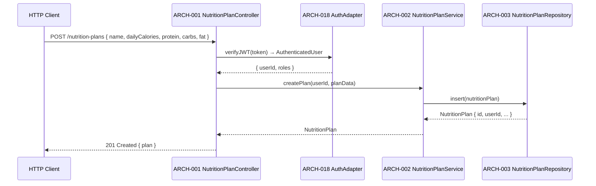
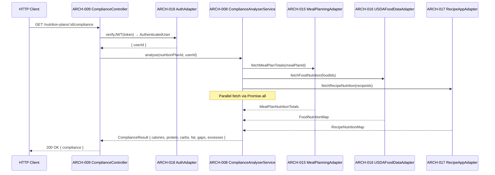
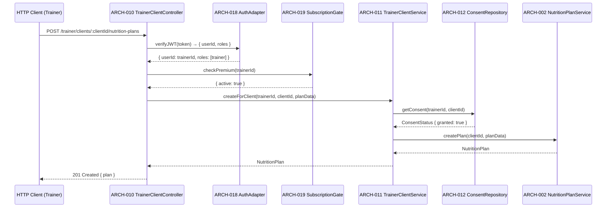
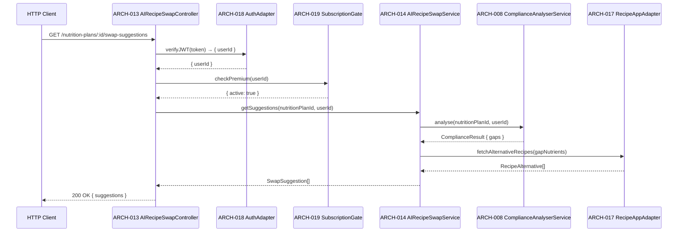

# Architecture Design: Nutrition Planning

**Feature Branch**: `009-nutrition-planning`
**Created**: 2026-05-09
**Status**: Draft
**Source**: `specs/009-nutrition-planning/v-model/system-design.md`

## Overview

The Nutrition Planning architecture decomposes 14 system components (SYS-001–SYS-014) into 20 architecture modules across four Kruchten 4+1 views. The decomposition follows a layered approach: REST API controllers at the boundary, domain services for business logic, integration adapters for external dependencies, and cross-cutting utilities for auth, subscription gating, type safety, and accessibility. Every SYS-NNN is covered by at least one ARCH-NNN.

## ID Schema

- **Architecture Module**: `ARCH-NNN` — sequential identifier for each module
- **Parent System Components**: Comma-separated `SYS-NNN` list per module (many-to-many)
- **Cross-Cutting Tag**: `[CROSS-CUTTING; rationale: shared infrastructure supports multiple SYS components]` for infrastructure/utility modules not traceable to a specific SYS
- Example: `ARCH-003` with Parent System Components `SYS-001, SYS-004` — module serves both components
- Example: `ARCH-019 [CROSS-CUTTING; rationale: shared infrastructure supports multiple SYS components]` — infrastructure module with rationale

## Logical View — Component Breakdown (IEEE 42010 / Kruchten 4+1)

| ARCH ID  | Name                      | Description                                                                                                                                                                                                                                             | Parent System Components | Type      |
| -------- | ------------------------- | ------------------------------------------------------------------------------------------------------------------------------------------------------------------------------------------------------------------------------------------------------- | ------------------------ | --------- |
| ARCH-001 | NutritionPlanController   | REST API controller exposing CRUD endpoints for nutrition plans. Validates incoming DTOs, delegates to NutritionPlanService, and serialises responses.                                                                                                  | SYS-001                  | Component |
| ARCH-002 | NutritionPlanService      | Domain service implementing plan creation, retrieval, update, and deletion. Enforces ownership rules and coordinates with the auth adapter.                                                                                                             | SYS-001                  | Service   |
| ARCH-003 | NutritionPlanRepository   | Drizzle ORM repository for `nutrition_plans` table. Provides typed CRUD operations with row-level security enforcement.                                                                                                                                 | SYS-001                  | Component |
| ARCH-004 | DashboardController       | REST API controller exposing the user's nutrition plan listing endpoint. Delegates to NutritionPlanService for plan retrieval and ordering.                                                                                                             | SYS-004                  | Component |
| ARCH-005 | MealPlanLinkerController  | REST API controller exposing link/unlink endpoints for associating meal plans with nutrition plans. Validates request DTOs and delegates to MealPlanLinkerService.                                                                                      | SYS-002                  | Component |
| ARCH-006 | MealPlanLinkerService     | Domain service managing the meal-plan ↔ nutrition-plan link lifecycle. Validates existence of both plans via the Meal Planning adapter before persisting the link.                                                                                      | SYS-002                  | Service   |
| ARCH-007 | MealPlanLinkRepository    | Drizzle ORM repository for `meal_plan_links` table. Provides typed link CRUD with RLS enforcement.                                                                                                                                                      | SYS-002                  | Component |
| ARCH-008 | ComplianceAnalyserService | Domain service computing gap/excess between a linked meal plan's nutritional totals and the nutrition plan's targets. Aggregates data from Meal Planning, USDA, and Recipe adapters.                                                                    | SYS-003                  | Service   |
| ARCH-009 | ComplianceController      | REST API controller exposing the compliance analysis endpoint. Delegates to ComplianceAnalyserService and serialises `ComplianceResult`.                                                                                                                | SYS-003                  | Component |
| ARCH-010 | TrainerClientController   | REST API controller exposing trainer-specific plan creation and client plan viewing endpoints. Enforces trainer role via auth adapter before delegating to TrainerClientService.                                                                        | SYS-005, SYS-006         | Component |
| ARCH-011 | TrainerClientService      | Domain service orchestrating trainer-on-behalf-of-client plan creation. Checks consent via ConsentRepository, verifies premium subscription, then delegates to NutritionPlanService.                                                                    | SYS-005, SYS-006         | Service   |
| ARCH-012 | ConsentRepository         | Drizzle ORM repository for `trainer_client_consents` table. Provides consent grant/revoke/query operations with RLS.                                                                                                                                    | SYS-006                  | Component |
| ARCH-013 | AIRecipeSwapController    | REST API controller exposing the recipe swap suggestion endpoint. Validates premium subscription and delegates to AIRecipeSwapService.                                                                                                                  | SYS-007                  | Component |
| ARCH-014 | AIRecipeSwapService       | Domain service generating recipe swap suggestions by reading compliance gaps and querying the Recipe App adapter for alternative recipes.                                                                                                               | SYS-007                  | Service   |
| ARCH-015 | MealPlanningAdapter       | HTTP adapter wrapping the 006-meal-planning internal API. Fetches meal plan nutritional totals for compliance analysis and link validation.                                                                                                             | SYS-008                  | Adapter   |
| ARCH-016 | USDAFoodDataAdapter       | HTTP adapter wrapping the 003-usda-food-data internal API. Fetches per-food nutritional values for compliance calculations.                                                                                                                             | SYS-009                  | Adapter   |
| ARCH-017 | RecipeAppAdapter          | HTTP adapter wrapping the 001-sous-chef-recipe-app internal API. Fetches recipe-level nutritional data and alternative recipes for swap suggestions.                                                                                                    | SYS-010                  | Adapter   |
| ARCH-018 | AuthAdapter               | Wraps the 002-user-auth JWT verification and user-relationship resolution. Used by all controllers and services requiring identity or role information.                                                                                           | SYS-011                  | Adapter   |
| ARCH-019 | SubscriptionGate          | Module checking active premium subscription status via the 010-subscriptions API. Used by TrainerClientService and AIRecipeSwapService to gate premium operations.                                                                                      | SYS-012                  | Component |
| ARCH-020 | TypeSafetyAndDocsEnforcer | [CROSS-CUTTING; rationale: shared infrastructure supports multiple SYS components] — ESLint + TypeScript compiler configuration enforcing `strict: true`, no `any`, and JSDoc on all exports. Also enforces accessible UI component naming conventions. | SYS-013, SYS-014         | Utility   |

## Process View — Dynamic Behavior (Kruchten 4+1)

### Interaction: Create Nutrition Plan

**Concurrency Model**: NestJS event loop (single-threaded async I/O); all DB calls are async/await.
**Synchronization Points**: None required — each request is independent.

---

### Interaction: Compliance Analysis

**Concurrency Model**: `Promise.all` for parallel adapter calls within a single event-loop tick.
**Synchronization Points**: All three adapter responses must resolve before compliance is computed.

---

### Interaction: Trainer Creates Plan for Client

**Concurrency Model**: Sequential — consent must be verified before plan creation.
**Synchronization Points**: Consent check is a hard gate; failure throws `ConsentNotGrantedError`.

---

### Interaction: AI Recipe Swap Suggestions

**Concurrency Model**: Sequential — compliance gap must be known before querying alternatives.
**Synchronization Points**: ComplianceResult is a prerequisite for recipe alternative lookup.

## Interface View — API Contracts (Kruchten 4+1)

### ARCH-001: NutritionPlanController

| Direction | Name              | Type                     | Format                                                                                                            | Constraints                         |
| --------- | ----------------- | ------------------------ | ----------------------------------------------------------------------------------------------------------------- | ----------------------------------- |
| Input     | CreatePlanDto     | `CreateNutritionPlanDto` | `{ name: string, dailyCalories: number, protein: number, carbs: number, fat: number, period: 'daily'\|'weekly' }` | All fields required; calories > 0   |
| Input     | Authorization     | `string`                 | Bearer JWT                                                                                                        | Required; validated by ARCH-018     |
| Output    | NutritionPlan     | `NutritionPlan`          | JSON                                                                                                              | Includes `id`, `userId`, timestamps |
| Exception | ValidationError   | 400                      | `{ message, errors[] }`                                                                                           | On DTO validation failure           |
| Exception | UnauthorizedError | 401                      | `{ message }`                                                                                                     | On missing/invalid JWT              |

### ARCH-002: NutritionPlanService

| Direction | Name              | Type                     | Format              | Constraints                             |
| --------- | ----------------- | ------------------------ | ------------------- | --------------------------------------- |
| Input     | userId            | `string`                 | UUID                | Required; must match authenticated user |
| Input     | planData          | `CreateNutritionPlanDto` | Typed DTO           | Required                                |
| Output    | NutritionPlan     | `NutritionPlan`          | Typed domain object | Guaranteed non-null on success          |
| Exception | UnauthorizedError | `UnauthorizedError`      | Typed error         | When userId does not own the plan       |

### ARCH-003: NutritionPlanRepository

| Direction | Name          | Type               | Format                | Constraints                           |
| --------- | ------------- | ------------------ | --------------------- | ------------------------------------- |
| Input     | nutritionPlan | `NewNutritionPlan` | Drizzle insert schema | Required; all non-nullable fields     |
| Output    | NutritionPlan | `NutritionPlan`    | Drizzle select schema | Guaranteed non-null on insert success |
| Exception | DatabaseError | `DatabaseError`    | Typed error           | On constraint violation or DB failure |

### ARCH-004: DashboardController

| Direction | Name              | Type              | Format        | Constraints                       |
| --------- | ----------------- | ----------------- | ------------- | --------------------------------- |
| Input     | Authorization     | `string`          | Bearer JWT    | Required                          |
| Output    | NutritionPlan[]   | `NutritionPlan[]` | JSON array    | Ordered by `createdAt` descending |
| Exception | UnauthorizedError | 401               | `{ message }` | On missing/invalid JWT            |

### ARCH-005: MealPlanLinkerController

| Direction | Name          | Type              | Format                                            | Constraints                    |
| --------- | ------------- | ----------------- | ------------------------------------------------- | ------------------------------ |
| Input     | LinkDto       | `LinkMealPlanDto` | `{ nutritionPlanId: string, mealPlanId: string }` | Both IDs required; UUID format |
| Input     | Authorization | `string`          | Bearer JWT                                        | Required                       |
| Output    | NutritionPlan | `NutritionPlan`   | JSON with linked meal plan reference              | Updated plan                   |
| Exception | NotFoundError | 404               | `{ message }`                                     | If either plan not found       |
| Exception | ConflictError | 409               | `{ message }`                                     | If already linked              |

### ARCH-006: MealPlanLinkerService

| Direction | Name                  | Type                    | Format              | Constraints                   |
| --------- | --------------------- | ----------------------- | ------------------- | ----------------------------- |
| Input     | nutritionPlanId       | `string`                | UUID                | Required                      |
| Input     | mealPlanId            | `string`                | UUID                | Required                      |
| Output    | NutritionPlan         | `NutritionPlan`         | Typed domain object | Updated with link             |
| Exception | MealPlanNotFoundError | `MealPlanNotFoundError` | Typed error         | When meal plan does not exist |
| Exception | AlreadyLinkedError    | `AlreadyLinkedError`    | Typed error         | When link already exists      |

### ARCH-007: MealPlanLinkRepository

| Direction | Name          | Type              | Format                | Constraints             |
| --------- | ------------- | ----------------- | --------------------- | ----------------------- |
| Input     | link          | `NewMealPlanLink` | Drizzle insert schema | Required                |
| Output    | MealPlanLink  | `MealPlanLink`    | Drizzle select schema | Non-null on success     |
| Exception | DatabaseError | `DatabaseError`   | Typed error           | On constraint violation |

### ARCH-008: ComplianceAnalyserService

| Direction | Name                       | Type                         | Format                                              | Constraints                                    |
| --------- | -------------------------- | ---------------------------- | --------------------------------------------------- | ---------------------------------------------- |
| Input     | nutritionPlanId            | `string`                     | UUID                                                | Required; plan must have linked meal plan      |
| Input     | userId                     | `string`                     | UUID                                                | Required; for ownership check                  |
| Output    | ComplianceResult           | `ComplianceResult`           | `{ calories, protein, carbs, fat, gaps, excesses }` | All fields present; values within ±5% accuracy |
| Exception | NoLinkedMealPlanError      | `NoLinkedMealPlanError`      | Typed error                                         | When no meal plan is linked                    |
| Exception | ComplianceUnavailableError | `ComplianceUnavailableError` | Typed error                                         | When adapter data is unavailable               |

### ARCH-009: ComplianceController

| Direction | Name             | Type               | Format          | Constraints                 |
| --------- | ---------------- | ------------------ | --------------- | --------------------------- |
| Input     | nutritionPlanId  | `string`           | UUID path param | Required                    |
| Input     | Authorization    | `string`           | Bearer JWT      | Required                    |
| Output    | ComplianceResult | `ComplianceResult` | JSON            | All nutrient fields present |
| Exception | NotFoundError    | 404                | `{ message }`   | When no linked meal plan    |

### ARCH-010: TrainerClientController

| Direction | Name                 | Type                     | Format                    | Constraints                       |
| --------- | -------------------- | ------------------------ | ------------------------- | --------------------------------- |
| Input     | clientId             | `string`                 | UUID path param           | Required                          |
| Input     | CreatePlanDto        | `CreateNutritionPlanDto` | JSON body                 | Required                          |
| Input     | Authorization        | `string`                 | Bearer JWT (trainer role) | Required; must have trainer role  |
| Output    | NutritionPlan        | `NutritionPlan`          | JSON                      | Owned by client                   |
| Exception | ForbiddenError       | 403                      | `{ message }`             | If not trainer role or no consent |
| Exception | PaymentRequiredError | 402                      | `{ message }`             | If not premium subscriber         |

### ARCH-011: TrainerClientService

| Direction | Name                      | Type                        | Format              | Constraints                             |
| --------- | ------------------------- | --------------------------- | ------------------- | --------------------------------------- |
| Input     | trainerId                 | `string`                    | UUID                | Required                                |
| Input     | clientId                  | `string`                    | UUID                | Required                                |
| Input     | planData                  | `CreateNutritionPlanDto`    | Typed DTO           | Required                                |
| Output    | NutritionPlan             | `NutritionPlan`             | Typed domain object | Owned by clientId                       |
| Exception | ConsentNotGrantedError    | `ConsentNotGrantedError`    | Typed error         | When client has not granted consent     |
| Exception | SubscriptionRequiredError | `SubscriptionRequiredError` | Typed error         | When trainer lacks premium subscription |

### ARCH-012: ConsentRepository

| Direction | Name          | Type            | Format                                   | Constraints   |
| --------- | ------------- | --------------- | ---------------------------------------- | ------------- |
| Input     | trainerId     | `string`        | UUID                                     | Required      |
| Input     | clientId      | `string`        | UUID                                     | Required      |
| Output    | ConsentStatus | `ConsentStatus` | `{ granted: boolean, grantedAt?: Date }` | Non-null      |
| Exception | DatabaseError | `DatabaseError` | Typed error                              | On DB failure |

### ARCH-013: AIRecipeSwapController

| Direction | Name                 | Type               | Format          | Constraints                |
| --------- | -------------------- | ------------------ | --------------- | -------------------------- |
| Input     | nutritionPlanId      | `string`           | UUID path param | Required                   |
| Input     | Authorization        | `string`           | Bearer JWT      | Required; must be premium  |
| Output    | SwapSuggestion[]     | `SwapSuggestion[]` | JSON array      | May be empty if no gaps    |
| Exception | PaymentRequiredError | 402                | `{ message }`   | If not premium             |
| Exception | NotFoundError        | 404                | `{ message }`   | If no compliance gap found |

### ARCH-014: AIRecipeSwapService

| Direction | Name                       | Type                         | Format      | Constraints                      |
| --------- | -------------------------- | ---------------------------- | ----------- | -------------------------------- |
| Input     | nutritionPlanId            | `string`                     | UUID        | Required                         |
| Input     | userId                     | `string`                     | UUID        | Required                         |
| Output    | SwapSuggestion[]           | `SwapSuggestion[]`           | Typed array | May be empty                     |
| Exception | ComplianceUnavailableError | `ComplianceUnavailableError` | Typed error | When compliance data unavailable |

### ARCH-015: MealPlanningAdapter

| Direction | Name                    | Type                      | Format       | Constraints                          |
| --------- | ----------------------- | ------------------------- | ------------ | ------------------------------------ |
| Input     | mealPlanId              | `string`                  | UUID         | Required                             |
| Output    | MealPlanNutritionTotals | `MealPlanNutritionTotals` | Typed object | All nutrient fields present          |
| Exception | MealPlanNotFoundError   | `MealPlanNotFoundError`   | Typed error  | When meal plan does not exist in 006 |

### ARCH-016: USDAFoodDataAdapter

| Direction | Name                     | Type                       | Format                          | Constraints                        |
| --------- | ------------------------ | -------------------------- | ------------------------------- | ---------------------------------- |
| Input     | foodIds                  | `string[]`                 | UUID array                      | Required; non-empty                |
| Output    | FoodNutritionMap         | `FoodNutritionMap`         | `Record<string, FoodNutrition>` | All requested IDs present or error |
| Exception | FoodDataUnavailableError | `FoodDataUnavailableError` | Typed error                     | When USDA service unavailable      |

### ARCH-017: RecipeAppAdapter

| Direction | Name                       | Type                         | Format                            | Constraints                         |
| --------- | -------------------------- | ---------------------------- | --------------------------------- | ----------------------------------- |
| Input     | recipeIds                  | `string[]`                   | UUID array                        | Required; non-empty                 |
| Output    | RecipeNutritionMap         | `RecipeNutritionMap`         | `Record<string, RecipeNutrition>` | All requested IDs present or error  |
| Exception | RecipeDataUnavailableError | `RecipeDataUnavailableError` | Typed error                       | When recipe app service unavailable |

### ARCH-018: AuthAdapter

| Direction | Name              | Type                | Format                     | Constraints                       |
| --------- | ----------------- | ------------------- | -------------------------- | --------------------------------- |
| Input     | jwt               | `string`            | Bearer token               | Required; must be valid Auth0 JWT |
| Output    | AuthenticatedUser | `AuthenticatedUser` | `{ userId, roles, email }` | Non-null on success               |
| Exception | UnauthorizedError | `UnauthorizedError` | Typed error                | On invalid/expired JWT            |

### ARCH-019: SubscriptionGate

| Direction | Name                      | Type                        | Format                              | Constraints                             |
| --------- | ------------------------- | --------------------------- | ----------------------------------- | --------------------------------------- |
| Input     | userId                    | `string`                    | UUID                                | Required                                |
| Output    | SubscriptionStatus        | `SubscriptionStatus`        | `{ active: boolean, tier: string }` | Cached with 60s TTL                     |
| Exception | SubscriptionRequiredError | `SubscriptionRequiredError` | Typed error                         | When subscription is not active/premium |

### ARCH-020: TypeSafetyAndDocsEnforcer

| Direction | Name            | Type          | Format          | Constraints                     |
| --------- | --------------- | ------------- | --------------- | ------------------------------- |
| Input     | Source files    | TypeScript    | `.ts` / `.tsx`  | All files in feature scope      |
| Output    | Compiler result | `void`        | Build pass/fail | Zero errors with `strict: true` |
| Exception | CompilerError   | Build failure | TSC diagnostic  | On `any` usage or missing JSDoc |

## Data Flow View — Data Transformation Chains (Kruchten 4+1)

### Data Flow: Nutrition Plan Creation

| Stage | Module                           | Input Format                      | Transformation                                     | Output Format                     |
| ----- | -------------------------------- | --------------------------------- | -------------------------------------------------- | --------------------------------- |
| 1     | ARCH-001 NutritionPlanController | HTTP request body (JSON)          | DTO validation + auth extraction                   | `CreateNutritionPlanDto` + userId |
| 2     | ARCH-002 NutritionPlanService    | `CreateNutritionPlanDto` + userId | Business rule enforcement + domain object creation | `NewNutritionPlan`                |
| 3     | ARCH-003 NutritionPlanRepository | `NewNutritionPlan`                | Drizzle ORM insert                                 | `NutritionPlan` (persisted)       |
| 4     | ARCH-001 NutritionPlanController | `NutritionPlan`                   | JSON serialisation                                 | HTTP 201 response                 |

---

### Data Flow: Compliance Analysis

| Stage | Module                             | Input Format                        | Transformation                           | Output Format                    |
| ----- | ---------------------------------- | ----------------------------------- | ---------------------------------------- | -------------------------------- |
| 1     | ARCH-009 ComplianceController      | HTTP request (nutritionPlanId, JWT) | Auth + plan ownership validation         | `nutritionPlanId`, `userId`      |
| 2     | ARCH-008 ComplianceAnalyserService | `nutritionPlanId`, `userId`         | Parallel fetch from adapters             | Raw nutrition totals (3 sources) |
| 3     | ARCH-015 MealPlanningAdapter       | `mealPlanId`                        | HTTP call to 006-meal-planning           | `MealPlanNutritionTotals`        |
| 4     | ARCH-016 USDAFoodDataAdapter       | `foodIds[]`                         | HTTP call to 003-usda-food-data          | `FoodNutritionMap`               |
| 5     | ARCH-017 RecipeAppAdapter          | `recipeIds[]`                       | HTTP call to 001-sous-chef-recipe-app    | `RecipeNutritionMap`             |
| 6     | ARCH-008 ComplianceAnalyserService | Aggregated nutrition data           | Gap/excess calculation (target − actual) | `ComplianceResult`               |
| 7     | ARCH-009 ComplianceController      | `ComplianceResult`                  | JSON serialisation                       | HTTP 200 response                |

---

### Data Flow: AI Recipe Swap Suggestions

| Stage | Module                          | Input Format                        | Transformation                                     | Output Format               |
| ----- | ------------------------------- | ----------------------------------- | -------------------------------------------------- | --------------------------- |
| 1     | ARCH-013 AIRecipeSwapController | HTTP request (nutritionPlanId, JWT) | Auth + premium subscription check                  | `nutritionPlanId`, `userId` |
| 2     | ARCH-014 AIRecipeSwapService    | `nutritionPlanId`, `userId`         | Compliance gap retrieval                           | `ComplianceResult { gaps }` |
| 3     | ARCH-017 RecipeAppAdapter       | Gap nutrient profile                | HTTP call to 001-sous-chef-recipe-app alternatives | `RecipeAlternative[]`       |
| 4     | ARCH-014 AIRecipeSwapService    | `RecipeAlternative[]` + gap data    | Swap suggestion ranking and formatting             | `SwapSuggestion[]`          |
| 5     | ARCH-013 AIRecipeSwapController | `SwapSuggestion[]`                  | JSON serialisation                                 | HTTP 200 response           |

---

## Coverage Summary

| Metric                                 | Count                                                                |
| -------------------------------------- | -------------------------------------------------------------------- |
| Total Architecture Modules (ARCH)      | 20                                                                   |
| Cross-Cutting Modules                  | 1 (ARCH-020)                                                         |
| Total Parent System Components Covered | 14 / 14 (100%)                                                       |
| Modules per Type                       | Component: 8 \| Service: 5 \| Adapter: 4 \| Utility: 1 \| Library: 0 |
| **Forward Coverage (SYS→ARCH)**        | **100%**                                                             |

### SYS → ARCH Mapping

| SYS ID  | Mapped ARCH Modules          |
| ------- | ---------------------------- |
| SYS-001 | ARCH-001, ARCH-002, ARCH-003 |
| SYS-002 | ARCH-005, ARCH-006, ARCH-007 |
| SYS-003 | ARCH-008, ARCH-009           |
| SYS-004 | ARCH-004                     |
| SYS-005 | ARCH-010, ARCH-011           |
| SYS-006 | ARCH-010, ARCH-011, ARCH-012 |
| SYS-007 | ARCH-013, ARCH-014           |
| SYS-008 | ARCH-015                     |
| SYS-009 | ARCH-016                     |
| SYS-010 | ARCH-017                     |
| SYS-011 | ARCH-018                     |
| SYS-012 | ARCH-019                     |
| SYS-013 | ARCH-020                     |
| SYS-014 | ARCH-020                     |

## Derived Modules

None — all modules trace to existing system components.

## Physical View — Deployment Topology

The feature deploys within the Sous Chef AWS/serverless topology. Client-facing web/mobile modules run in their respective application packages. Backend API, worker, queue, database, cache, storage, observability, and infrastructure modules deploy to the configured AWS account and region. Each ARCH module maps to the runtime described in the Logical View and the package/source paths listed in the Development View.

## Development View — Source Organization

Implementation modules are organized by platform and service boundary: web code under Next.js application packages, mobile code under Expo packages, backend services under API/Lambda packages, shared contracts under shared TypeScript packages, and infrastructure under CDK/IaC packages. This view constrains ownership, build boundaries, and deployment units for every ARCH-NNN module listed above.

## Scenarios — Architecture Validation

Primary scenarios validate the 4+1 architecture: successful request flow through user-facing entrypoints, dependency failure propagation through process boundaries, data persistence and retrieval through storage boundaries, and deployment/change isolation through development-view package ownership. Each scenario traces back to the SYS coverage listed on ARCH rows.
