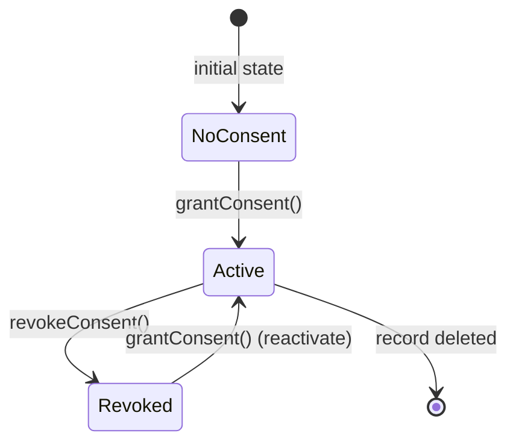
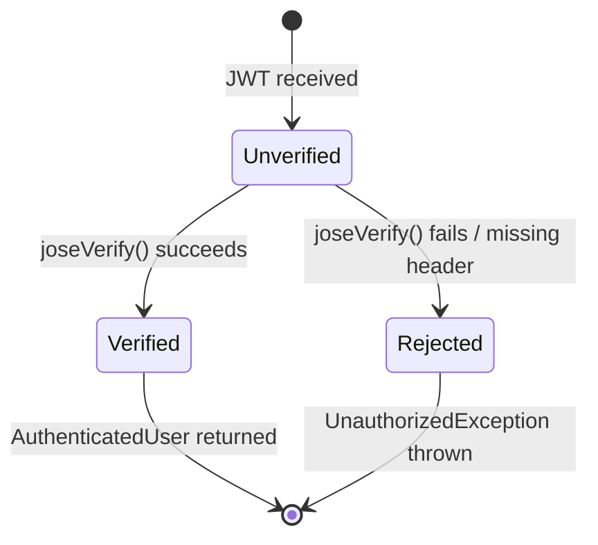

# Module Design: Nutrition Planning

**Feature Branch**: `009-nutrition-planning`
**Created**: 2026-05-09
**Status**: Draft
**Source**: `specs/009-nutrition-planning/v-model/architecture-design.md`

## Overview

The Nutrition Planning module design decomposes all 20 architecture modules (ARCH-001–ARCH-020) into 20 low-level module specifications (MOD-001–MOD-020). Each module is specified with sufficient internal detail — pseudocode logic, state machines, data structures, and error contracts — that writing the actual TypeScript/NestJS source code is a direct translation exercise requiring no further design decisions. The decomposition follows the layered architecture: REST controllers (MOD-001, MOD-004, MOD-005, MOD-009, MOD-010, MOD-013) → domain services (MOD-002, MOD-006, MOD-008, MOD-011, MOD-014) → repositories (MOD-003, MOD-007, MOD-012) → adapters (MOD-015–MOD-018) → cross-cutting utilities (MOD-019, MOD-020).

## ID Schema

- **Module Design**: `MOD-NNN` — sequential identifier for each module (3-digit zero-padded)
- **Parent Architecture Modules**: Comma-separated `ARCH-NNN` list per module (many-to-many, authoritative for traceability)
- **Target Source File(s)**: Comma-separated file paths mapping to the repository codebase
- Example: `MOD-003` with Parent Architecture Modules `ARCH-003` — module serves one architecture component
- Example: `MOD-020 [CROSS-CUTTING]` — cross-cutting utility module

## Module Designs

---

### Module: MOD-001 (NutritionPlanController)

**Parent Architecture Modules**: ARCH-001
**Target Source File(s)**: `src/nutrition-planning/nutrition-plan.controller.ts`

#### Algorithmic / Logic View

```pseudocode
// POST /nutrition-plans
FUNCTION createPlan(req: Request, body: CreateNutritionPlanDto) -> NutritionPlanResponseDto:
    user = AuthAdapter.verifyJWT(req.headers.authorization)  // throws 401 if invalid
    IF user IS NULL:
        THROW UnauthorizedException("Valid JWT required")
    plan = NutritionPlanService.createPlan(user.userId, body)
    RETURN HTTP 201 { plan: toResponseDto(plan) }

// GET /nutrition-plans/:id
FUNCTION getPlan(req: Request, id: string) -> NutritionPlanResponseDto:
    user = AuthAdapter.verifyJWT(req.headers.authorization)
    IF NOT isValidUUID(id):
        THROW BadRequestException("Invalid plan ID format")
    plan = NutritionPlanService.getPlan(id, user.userId)
    IF plan IS NULL:
        THROW NotFoundException("Nutrition plan not found")
    RETURN HTTP 200 { plan: toResponseDto(plan) }

// PATCH /nutrition-plans/:id
FUNCTION updatePlan(req: Request, id: string, body: UpdateNutritionPlanDto) -> NutritionPlanResponseDto:
    user = AuthAdapter.verifyJWT(req.headers.authorization)
    IF NOT isValidUUID(id):
        THROW BadRequestException("Invalid plan ID format")
    plan = NutritionPlanService.updatePlan(id, user.userId, body)
    IF plan IS NULL:
        THROW NotFoundException("Nutrition plan not found or not owned by user")
    RETURN HTTP 200 { plan: toResponseDto(plan) }

// DELETE /nutrition-plans/:id
FUNCTION deletePlan(req: Request, id: string) -> void:
    user = AuthAdapter.verifyJWT(req.headers.authorization)
    IF NOT isValidUUID(id):
        THROW BadRequestException("Invalid plan ID format")
    deleted = NutritionPlanService.deletePlan(id, user.userId)
    IF NOT deleted:
        THROW NotFoundException("Nutrition plan not found or not owned by user")
    RETURN HTTP 204 No Content

FUNCTION toResponseDto(plan: NutritionPlan) -> NutritionPlanResponseDto:
    RETURN {
        id: plan.id,
        name: plan.name,
        dailyCalories: plan.dailyCalories,
        proteinGrams: plan.proteinGrams,
        carbsGrams: plan.carbsGrams,
        fatGrams: plan.fatGrams,
        createdAt: plan.createdAt.toISOString(),
        updatedAt: plan.updatedAt.toISOString()
    }
```

#### State Machine View

N/A — Stateless (each HTTP request is independently handled; no persistent controller state)

#### Internal Data Structures

| Name                       | Type              | Size/Constraints    | Initialization | Description                                                                                                                                      |
| -------------------------- | ----------------- | ------------------- | -------------- | ------------------------------------------------------------------------------------------------------------------------------------------------ |
| `CreateNutritionPlanDto`   | DTO class         | —                   | Per-request    | Validated body: name (string, 1–100), dailyCalories (int, 1–10000), proteinGrams (int, 0–1000), carbsGrams (int, 0–1000), fatGrams (int, 0–1000) |
| `UpdateNutritionPlanDto`   | Partial DTO class | All fields optional | Per-request    | Partial update body; same field constraints as Create                                                                                            |
| `NutritionPlanResponseDto` | Plain object      | —                   | Per-response   | Serialised plan returned to client                                                                                                               |

#### Error Handling & Return Codes

| Error Condition                 | Error Code / Exception      | Architecture Contract                       | Recovery                       |
| ------------------------------- | --------------------------- | ------------------------------------------- | ------------------------------ |
| Missing / invalid JWT           | `401 UnauthorizedException` | ARCH-001 Interface: 401 on auth failure     | Client must re-authenticate    |
| Invalid UUID path param         | `400 BadRequestException`   | ARCH-001 Interface: 400 on validation error | Client corrects request        |
| Plan not found / not owned      | `404 NotFoundException`     | ARCH-001 Interface: 404 on missing resource | Client verifies plan ID        |
| Service throws unexpected error | `500 InternalServerError`   | ARCH-001 Interface: 500 on unhandled error  | NestJS global exception filter |

---

### Module: MOD-002 (NutritionPlanService)

**Parent Architecture Modules**: ARCH-002
**Target Source File(s)**: `src/nutrition-planning/nutrition-plan.service.ts`

#### Algorithmic / Logic View

```pseudocode
FUNCTION createPlan(userId: string, dto: CreateNutritionPlanDto) -> NutritionPlan:
    plan = {
        id: generateUUID(),
        userId: userId,
        name: dto.name,
        dailyCalories: dto.dailyCalories,
        proteinGrams: dto.proteinGrams,
        carbsGrams: dto.carbsGrams,
        fatGrams: dto.fatGrams,
        createdAt: NOW(),
        updatedAt: NOW()
    }
    RETURN NutritionPlanRepository.insert(plan)

FUNCTION getPlan(planId: string, requestingUserId: string) -> NutritionPlan | null:
    plan = NutritionPlanRepository.findById(planId)
    IF plan IS NULL:
        RETURN null
    IF plan.userId != requestingUserId:
        RETURN null  // ownership enforcement — treat as not found
    RETURN plan

FUNCTION updatePlan(planId: string, userId: string, dto: UpdateNutritionPlanDto) -> NutritionPlan | null:
    plan = NutritionPlanRepository.findById(planId)
    IF plan IS NULL OR plan.userId != userId:
        RETURN null
    updates = {}
    IF dto.name IS NOT NULL: updates.name = dto.name
    IF dto.dailyCalories IS NOT NULL: updates.dailyCalories = dto.dailyCalories
    IF dto.proteinGrams IS NOT NULL: updates.proteinGrams = dto.proteinGrams
    IF dto.carbsGrams IS NOT NULL: updates.carbsGrams = dto.carbsGrams
    IF dto.fatGrams IS NOT NULL: updates.fatGrams = dto.fatGrams
    updates.updatedAt = NOW()
    RETURN NutritionPlanRepository.update(planId, updates)

FUNCTION deletePlan(planId: string, userId: string) -> boolean:
    plan = NutritionPlanRepository.findById(planId)
    IF plan IS NULL OR plan.userId != userId:
        RETURN false
    NutritionPlanRepository.delete(planId)
    RETURN true

FUNCTION listPlansByUser(userId: string) -> NutritionPlan[]:
    RETURN NutritionPlanRepository.findByUserId(userId)
        .sortedBy(plan => plan.updatedAt, DESCENDING)
```

#### State Machine View

N/A — Stateless (pure domain logic; no persistent service-level state between calls)

#### Internal Data Structures

| Name      | Type                     | Size/Constraints    | Initialization | Description                               |
| --------- | ------------------------ | ------------------- | -------------- | ----------------------------------------- |
| `plan`    | `NutritionPlan`          | —                   | Per-call       | Assembled plan entity before persistence  |
| `updates` | `Partial<NutritionPlan>` | Only changed fields | Per-call       | Sparse update object passed to repository |

#### Error Handling & Return Codes

| Error Condition                     | Error Code / Exception       | Architecture Contract                            | Recovery                            |
| ----------------------------------- | ---------------------------- | ------------------------------------------------ | ----------------------------------- |
| Repository throws DB error          | Re-throw `DatabaseException` | ARCH-002 Interface: propagate to controller      | Controller maps to 500              |
| Plan not found / ownership mismatch | Return `null`                | ARCH-002 Interface: null → controller throws 404 | Controller throws NotFoundException |

---

### Module: MOD-003 (NutritionPlanRepository)

**Parent Architecture Modules**: ARCH-003
**Target Source File(s)**: `src/nutrition-planning/nutrition-plan.repository.ts`

#### Algorithmic / Logic View

```pseudocode
FUNCTION insert(plan: NutritionPlan) -> NutritionPlan:
    result = db.insert(nutritionPlansTable).values(plan).returning()
    RETURN result[0]

FUNCTION findById(planId: string) -> NutritionPlan | null:
    result = db.select().from(nutritionPlansTable)
        .where(eq(nutritionPlansTable.id, planId))
        .limit(1)
    IF result.length == 0: RETURN null
    RETURN result[0]

FUNCTION findByUserId(userId: string) -> NutritionPlan[]:
    RETURN db.select().from(nutritionPlansTable)
        .where(eq(nutritionPlansTable.userId, userId))
        .orderBy(desc(nutritionPlansTable.updatedAt))

FUNCTION update(planId: string, updates: Partial<NutritionPlan>) -> NutritionPlan | null:
    result = db.update(nutritionPlansTable)
        .set(updates)
        .where(eq(nutritionPlansTable.id, planId))
        .returning()
    IF result.length == 0: RETURN null
    RETURN result[0]

FUNCTION delete(planId: string) -> void:
    db.delete(nutritionPlansTable)
        .where(eq(nutritionPlansTable.id, planId))
```

#### State Machine View

N/A — Stateless (each method is an independent DB transaction; no repository-level state)

#### Internal Data Structures

| Name                  | Type                 | Size/Constraints | Initialization | Description                                        |
| --------------------- | -------------------- | ---------------- | -------------- | -------------------------------------------------- |
| `nutritionPlansTable` | Drizzle table schema | —                | Module load    | Drizzle ORM table definition for `nutrition_plans` |
| `db`                  | `DrizzleDB`          | —                | DI injection   | Injected Drizzle database client                   |

#### Error Handling & Return Codes

| Error Condition                | Error Code / Exception      | Architecture Contract                    | Recovery                          |
| ------------------------------ | --------------------------- | ---------------------------------------- | --------------------------------- |
| DB connection failure          | `DatabaseException`         | ARCH-003 Interface: propagate to service | Service propagates to controller  |
| Unique constraint violation    | `DatabaseException` (23505) | ARCH-003 Interface: propagate to service | Service maps to 409 if applicable |
| Row not found on update/delete | Return `null` / no-op       | ARCH-003 Interface: null return on miss  | Service handles null              |

---

### Module: MOD-004 (DashboardController)

**Parent Architecture Modules**: ARCH-004
**Target Source File(s)**: `src/nutrition-planning/dashboard.controller.ts`

#### Algorithmic / Logic View

```pseudocode
// GET /nutrition-plans (user dashboard listing)
FUNCTION listPlans(req: Request) -> NutritionPlanListResponseDto:
    user = AuthAdapter.verifyJWT(req.headers.authorization)
    IF user IS NULL:
        THROW UnauthorizedException("Valid JWT required")
    plans = NutritionPlanService.listPlansByUser(user.userId)
    RETURN HTTP 200 {
        plans: plans.map(toSummaryDto),
        total: plans.length
    }

FUNCTION toSummaryDto(plan: NutritionPlan) -> NutritionPlanSummaryDto:
    RETURN {
        id: plan.id,
        name: plan.name,
        dailyCalories: plan.dailyCalories,
        updatedAt: plan.updatedAt.toISOString()
    }
```

#### State Machine View

N/A — Stateless

#### Internal Data Structures

| Name                           | Type                        | Size/Constraints | Initialization | Description                             |
| ------------------------------ | --------------------------- | ---------------- | -------------- | --------------------------------------- |
| `NutritionPlanSummaryDto`      | Plain object                | —                | Per-response   | Lightweight plan summary for list views |
| `NutritionPlanListResponseDto` | `{ plans: [], total: int }` | —                | Per-response   | Paginated-ready list wrapper            |

#### Error Handling & Return Codes

| Error Condition       | Error Code / Exception      | Architecture Contract                      | Recovery                |
| --------------------- | --------------------------- | ------------------------------------------ | ----------------------- |
| Missing / invalid JWT | `401 UnauthorizedException` | ARCH-004 Interface: 401 on auth failure    | Client re-authenticates |
| Service DB error      | `500 InternalServerError`   | ARCH-004 Interface: 500 on unhandled error | Global exception filter |

---

### Module: MOD-005 (MealPlanLinkerController)

**Parent Architecture Modules**: ARCH-005
**Target Source File(s)**: `src/nutrition-planning/meal-plan-linker.controller.ts`

#### Algorithmic / Logic View

```pseudocode
// POST /nutrition-plans/:id/meal-plans/:mealPlanId
FUNCTION linkMealPlan(req: Request, planId: string, mealPlanId: string) -> LinkResponseDto:
    user = AuthAdapter.verifyJWT(req.headers.authorization)
    IF NOT isValidUUID(planId) OR NOT isValidUUID(mealPlanId):
        THROW BadRequestException("Invalid ID format")
    result = MealPlanLinkerService.link(planId, mealPlanId, user.userId)
    IF result.error == "PLAN_NOT_FOUND":
        THROW NotFoundException("Nutrition plan not found")
    IF result.error == "MEAL_PLAN_NOT_FOUND":
        THROW NotFoundException("Meal plan not found")
    IF result.error == "ALREADY_LINKED":
        THROW ConflictException("Meal plan already linked to this nutrition plan")
    RETURN HTTP 201 { link: toLinkDto(result.link) }

// DELETE /nutrition-plans/:id/meal-plans/:mealPlanId
FUNCTION unlinkMealPlan(req: Request, planId: string, mealPlanId: string) -> void:
    user = AuthAdapter.verifyJWT(req.headers.authorization)
    IF NOT isValidUUID(planId) OR NOT isValidUUID(mealPlanId):
        THROW BadRequestException("Invalid ID format")
    deleted = MealPlanLinkerService.unlink(planId, mealPlanId, user.userId)
    IF NOT deleted:
        THROW NotFoundException("Link not found")
    RETURN HTTP 204 No Content

FUNCTION toLinkDto(link: MealPlanLink) -> LinkResponseDto:
    RETURN { nutritionPlanId: link.nutritionPlanId, mealPlanId: link.mealPlanId, linkedAt: link.createdAt.toISOString() }
```

#### State Machine View

N/A — Stateless

#### Internal Data Structures

| Name              | Type         | Size/Constraints | Initialization | Description                        |
| ----------------- | ------------ | ---------------- | -------------- | ---------------------------------- |
| `LinkResponseDto` | Plain object | —                | Per-response   | Serialised link returned to client |

#### Error Handling & Return Codes

| Error Condition             | Error Code / Exception      | Architecture Contract                       | Recovery                    |
| --------------------------- | --------------------------- | ------------------------------------------- | --------------------------- |
| Missing / invalid JWT       | `401 UnauthorizedException` | ARCH-005 Interface: 401 on auth failure     | Client re-authenticates     |
| Invalid UUID                | `400 BadRequestException`   | ARCH-005 Interface: 400 on validation error | Client corrects request     |
| Plan or meal plan not found | `404 NotFoundException`     | ARCH-005 Interface: 404 on missing resource | Client verifies IDs         |
| Duplicate link              | `409 ConflictException`     | ARCH-005 Interface: 409 on conflict         | Client checks existing link |

---

### Module: MOD-006 (MealPlanLinkerService)

**Parent Architecture Modules**: ARCH-006
**Target Source File(s)**: `src/nutrition-planning/meal-plan-linker.service.ts`

#### Algorithmic / Logic View

```pseudocode
FUNCTION link(nutritionPlanId: string, mealPlanId: string, userId: string) -> LinkResult:
    // Verify nutrition plan ownership
    plan = NutritionPlanRepository.findById(nutritionPlanId)
    IF plan IS NULL OR plan.userId != userId:
        RETURN { error: "PLAN_NOT_FOUND" }

    // Verify meal plan exists via adapter
    mealPlanExists = MealPlanningAdapter.mealPlanExists(mealPlanId, userId)
    IF NOT mealPlanExists:
        RETURN { error: "MEAL_PLAN_NOT_FOUND" }

    // Check for existing link
    existing = MealPlanLinkRepository.findLink(nutritionPlanId, mealPlanId)
    IF existing IS NOT NULL:
        RETURN { error: "ALREADY_LINKED" }

    // Persist link
    link = MealPlanLinkRepository.insert({
        nutritionPlanId: nutritionPlanId,
        mealPlanId: mealPlanId,
        createdAt: NOW()
    })
    RETURN { link: link }

FUNCTION unlink(nutritionPlanId: string, mealPlanId: string, userId: string) -> boolean:
    plan = NutritionPlanRepository.findById(nutritionPlanId)
    IF plan IS NULL OR plan.userId != userId:
        RETURN false
    deleted = MealPlanLinkRepository.delete(nutritionPlanId, mealPlanId)
    RETURN deleted
```

#### State Machine View

N/A — Stateless

#### Internal Data Structures

| Name         | Type                                      | Size/Constraints | Initialization | Description                             |
| ------------ | ----------------------------------------- | ---------------- | -------------- | --------------------------------------- |
| `LinkResult` | `{ link?: MealPlanLink; error?: string }` | —                | Per-call       | Discriminated union result from link op |

#### Error Handling & Return Codes

| Error Condition         | Error Code / Exception       | Architecture Contract                         | Recovery                   |
| ----------------------- | ---------------------------- | --------------------------------------------- | -------------------------- |
| Adapter HTTP failure    | Re-throw `AdapterException`  | ARCH-006 Interface: propagate to controller   | Controller maps to 502     |
| Repository DB error     | Re-throw `DatabaseException` | ARCH-006 Interface: propagate to controller   | Controller maps to 500     |
| Business rule violation | Return `{ error: string }`   | ARCH-006 Interface: error string → controller | Controller maps to 404/409 |

---

### Module: MOD-007 (MealPlanLinkRepository)

**Parent Architecture Modules**: ARCH-007
**Target Source File(s)**: `src/nutrition-planning/meal-plan-link.repository.ts`

#### Algorithmic / Logic View

```pseudocode
FUNCTION insert(link: MealPlanLink) -> MealPlanLink:
    result = db.insert(mealPlanLinksTable).values(link).returning()
    RETURN result[0]

FUNCTION findLink(nutritionPlanId: string, mealPlanId: string) -> MealPlanLink | null:
    result = db.select().from(mealPlanLinksTable)
        .where(
            and(
                eq(mealPlanLinksTable.nutritionPlanId, nutritionPlanId),
                eq(mealPlanLinksTable.mealPlanId, mealPlanId)
            )
        ).limit(1)
    IF result.length == 0: RETURN null
    RETURN result[0]

FUNCTION findByNutritionPlanId(nutritionPlanId: string) -> MealPlanLink[]:
    RETURN db.select().from(mealPlanLinksTable)
        .where(eq(mealPlanLinksTable.nutritionPlanId, nutritionPlanId))

FUNCTION delete(nutritionPlanId: string, mealPlanId: string) -> boolean:
    result = db.delete(mealPlanLinksTable)
        .where(
            and(
                eq(mealPlanLinksTable.nutritionPlanId, nutritionPlanId),
                eq(mealPlanLinksTable.mealPlanId, mealPlanId)
            )
        ).returning()
    RETURN result.length > 0
```

#### State Machine View

N/A — Stateless

#### Internal Data Structures

| Name                 | Type                 | Size/Constraints | Initialization | Description                                        |
| -------------------- | -------------------- | ---------------- | -------------- | -------------------------------------------------- |
| `mealPlanLinksTable` | Drizzle table schema | —                | Module load    | Drizzle ORM table definition for `meal_plan_links` |
| `db`                 | `DrizzleDB`          | —                | DI injection   | Injected Drizzle database client                   |

#### Error Handling & Return Codes

| Error Condition             | Error Code / Exception      | Architecture Contract                    | Recovery                         |
| --------------------------- | --------------------------- | ---------------------------------------- | -------------------------------- |
| DB connection failure       | `DatabaseException`         | ARCH-007 Interface: propagate to service | Service propagates to controller |
| Unique constraint violation | `DatabaseException` (23505) | ARCH-007 Interface: propagate to service | Service maps to 409              |

---

### Module: MOD-008 (ComplianceAnalyserService)

**Parent Architecture Modules**: ARCH-008
**Target Source File(s)**: `src/nutrition-planning/compliance-analyser.service.ts`

#### Algorithmic / Logic View

```pseudocode
FUNCTION analyse(nutritionPlanId: string, userId: string) -> ComplianceResult:
    // 1. Load nutrition plan (ownership check)
    plan = NutritionPlanRepository.findById(nutritionPlanId)
    IF plan IS NULL OR plan.userId != userId:
        THROW NotFoundException("Nutrition plan not found")

    // 2. Load linked meal plans
    links = MealPlanLinkRepository.findByNutritionPlanId(nutritionPlanId)
    IF links.length == 0:
        RETURN { status: "NO_MEAL_PLAN_LINKED", gaps: [], excesses: [] }

    // 3. Fetch nutritional totals in parallel
    [mealTotals, usdaData, recipeData] = await Promise.all([
        MealPlanningAdapter.fetchMealPlanTotals(links[0].mealPlanId),
        USDAFoodDataAdapter.fetchFoodNutrition(mealTotals.foodIds),
        RecipeAppAdapter.fetchRecipeNutrition(mealTotals.recipeIds)
    ])

    // 4. Aggregate actual nutrition
    actual = aggregateNutrition(mealTotals, usdaData, recipeData)

    // 5. Compute gaps and excesses
    gaps = []
    excesses = []
    FOR EACH nutrient IN [calories, protein, carbs, fat]:
        target = plan[nutrient + "Target"]
        actualValue = actual[nutrient]
        delta = actualValue - target
        IF delta < -TOLERANCE:
            gaps.push({ nutrient, target, actual: actualValue, delta })
        ELSE IF delta > TOLERANCE:
            excesses.push({ nutrient, target, actual: actualValue, delta })

    RETURN { status: "ANALYSED", gaps, excesses, actual, targets: extractTargets(plan) }

FUNCTION aggregateNutrition(mealTotals, usdaData, recipeData) -> NutritionTotals:
    total = { calories: 0, proteinGrams: 0, carbsGrams: 0, fatGrams: 0 }
    FOR EACH food IN usdaData:
        total.calories += food.calories * food.quantity
        total.proteinGrams += food.protein * food.quantity
        total.carbsGrams += food.carbs * food.quantity
        total.fatGrams += food.fat * food.quantity
    FOR EACH recipe IN recipeData:
        total.calories += recipe.totalCalories
        total.proteinGrams += recipe.totalProtein
        total.carbsGrams += recipe.totalCarbs
        total.fatGrams += recipe.totalFat
    RETURN total

CONSTANT TOLERANCE = 5  // kcal or grams — within 5 units is considered compliant
```

#### State Machine View

N/A — Stateless (pure computation per request; no persistent service state)

#### Internal Data Structures

| Name               | Type                                                                            | Size/Constraints | Initialization | Description                                     |
| ------------------ | ------------------------------------------------------------------------------- | ---------------- | -------------- | ----------------------------------------------- |
| `ComplianceResult` | `{ status, gaps: NutrientDelta[], excesses: NutrientDelta[], actual, targets }` | —                | Per-call       | Full compliance analysis result                 |
| `NutrientDelta`    | `{ nutrient: string, target: number, actual: number, delta: number }`           | —                | Per-call       | Single nutrient gap or excess entry             |
| `NutritionTotals`  | `{ calories, proteinGrams, carbsGrams, fatGrams: number }`                      | —                | Per-call       | Aggregated actual nutrition from all sources    |
| `TOLERANCE`        | `number`                                                                        | Constant = 5     | Module load    | Acceptable deviation before flagging gap/excess |

#### Error Handling & Return Codes

| Error Condition            | Error Code / Exception              | Architecture Contract                       | Recovery                           |
| -------------------------- | ----------------------------------- | ------------------------------------------- | ---------------------------------- |
| Plan not found / not owned | `NotFoundException`                 | ARCH-008 Interface: propagate to controller | Controller returns 404             |
| Adapter HTTP failure (any) | Re-throw `AdapterException`         | ARCH-008 Interface: propagate to controller | Controller returns 502             |
| No meal plan linked        | Return `NO_MEAL_PLAN_LINKED` status | ARCH-008 Interface: partial result          | Controller returns 200 with status |

---

### Module: MOD-009 (ComplianceController)

**Parent Architecture Modules**: ARCH-009
**Target Source File(s)**: `src/nutrition-planning/compliance.controller.ts`

#### Algorithmic / Logic View

```pseudocode
// GET /nutrition-plans/:id/compliance
FUNCTION getCompliance(req: Request, planId: string) -> ComplianceResponseDto:
    user = AuthAdapter.verifyJWT(req.headers.authorization)
    IF NOT isValidUUID(planId):
        THROW BadRequestException("Invalid plan ID format")
    result = ComplianceAnalyserService.analyse(planId, user.userId)
    RETURN HTTP 200 { compliance: toComplianceDto(result) }

FUNCTION toComplianceDto(result: ComplianceResult) -> ComplianceResponseDto:
    RETURN {
        status: result.status,
        targets: result.targets,
        actual: result.actual,
        gaps: result.gaps,
        excesses: result.excesses
    }
```

#### State Machine View

N/A — Stateless

#### Internal Data Structures

| Name                    | Type         | Size/Constraints | Initialization | Description                                     |
| ----------------------- | ------------ | ---------------- | -------------- | ----------------------------------------------- |
| `ComplianceResponseDto` | Plain object | —                | Per-response   | Serialised compliance result returned to client |

#### Error Handling & Return Codes

| Error Condition       | Error Code / Exception      | Architecture Contract                       | Recovery                    |
| --------------------- | --------------------------- | ------------------------------------------- | --------------------------- |
| Missing / invalid JWT | `401 UnauthorizedException` | ARCH-009 Interface: 401 on auth failure     | Client re-authenticates     |
| Invalid UUID          | `400 BadRequestException`   | ARCH-009 Interface: 400 on validation error | Client corrects request     |
| Plan not found        | `404 NotFoundException`     | ARCH-009 Interface: 404 on missing resource | Client verifies plan ID     |
| Adapter failure       | `502 BadGatewayException`   | ARCH-009 Interface: 502 on upstream failure | Retry or degrade gracefully |

---

### Module: MOD-010 (TrainerClientController)

**Parent Architecture Modules**: ARCH-010
**Target Source File(s)**: `src/nutrition-planning/trainer-client.controller.ts`

#### Algorithmic / Logic View

```pseudocode
// POST /trainer/nutrition-plans (trainer creates plan for client)
FUNCTION createClientPlan(req: Request, body: CreateClientPlanDto) -> NutritionPlanResponseDto:
    user = AuthAdapter.verifyJWT(req.headers.authorization)
    IF NOT user.roles.includes("trainer"):
        THROW ForbiddenException("Trainer role required")
    IF NOT isValidUUID(body.clientId):
        THROW BadRequestException("Invalid client ID")
    plan = TrainerClientService.createPlanForClient(user.userId, body.clientId, body.planData)
    IF plan.error == "CONSENT_NOT_GRANTED":
        THROW ForbiddenException("Client has not granted consent")
    IF plan.error == "SUBSCRIPTION_REQUIRED":
        THROW PaymentRequiredException("Premium subscription required")
    RETURN HTTP 201 { plan: toResponseDto(plan.plan) }

// GET /trainer/clients/:clientId/nutrition-plans (trainer views client plans)
FUNCTION getClientPlans(req: Request, clientId: string) -> NutritionPlanListResponseDto:
    user = AuthAdapter.verifyJWT(req.headers.authorization)
    IF NOT user.roles.includes("trainer"):
        THROW ForbiddenException("Trainer role required")
    IF NOT isValidUUID(clientId):
        THROW BadRequestException("Invalid client ID")
    result = TrainerClientService.getClientPlans(user.userId, clientId)
    IF result.error == "CONSENT_NOT_GRANTED":
        THROW ForbiddenException("Client has not granted consent")
    RETURN HTTP 200 { plans: result.plans.map(toResponseDto), total: result.plans.length }

FUNCTION toResponseDto(plan: NutritionPlan) -> NutritionPlanResponseDto:
    // Same as MOD-001 toResponseDto
    RETURN { id, name, dailyCalories, proteinGrams, carbsGrams, fatGrams, createdAt, updatedAt }
```

#### State Machine View

N/A — Stateless

#### Internal Data Structures

| Name                  | Type      | Size/Constraints                                   | Initialization | Description                              |
| --------------------- | --------- | -------------------------------------------------- | -------------- | ---------------------------------------- |
| `CreateClientPlanDto` | DTO class | clientId (UUID), planData (CreateNutritionPlanDto) | Per-request    | Trainer creates plan on behalf of client |

#### Error Handling & Return Codes

| Error Condition       | Error Code / Exception         | Architecture Contract                      | Recovery                   |
| --------------------- | ------------------------------ | ------------------------------------------ | -------------------------- |
| Missing / invalid JWT | `401 UnauthorizedException`    | ARCH-010 Interface: 401 on auth failure    | Client re-authenticates    |
| Non-trainer role      | `403 ForbiddenException`       | ARCH-010 Interface: 403 on role mismatch   | Client checks role         |
| Consent not granted   | `403 ForbiddenException`       | ARCH-010 Interface: 403 on consent failure | Trainer requests consent   |
| Subscription required | `402 PaymentRequiredException` | ARCH-010 Interface: 402 on premium gate    | User upgrades subscription |

---

### Module: MOD-011 (TrainerClientService)

**Parent Architecture Modules**: ARCH-011
**Target Source File(s)**: `src/nutrition-planning/trainer-client.service.ts`

#### Algorithmic / Logic View

```pseudocode
FUNCTION createPlanForClient(trainerId: string, clientId: string, planData: CreateNutritionPlanDto) -> TrainerPlanResult:
    // 1. Check consent
    consent = ConsentRepository.findConsent(trainerId, clientId)
    IF consent IS NULL OR NOT consent.isActive:
        RETURN { error: "CONSENT_NOT_GRANTED" }

    // 2. Check premium subscription
    hasPremium = SubscriptionGate.checkPremium(trainerId)
    IF NOT hasPremium:
        RETURN { error: "SUBSCRIPTION_REQUIRED" }

    // 3. Delegate to NutritionPlanService (creates plan owned by clientId)
    plan = NutritionPlanService.createPlan(clientId, planData)
    RETURN { plan: plan }

FUNCTION getClientPlans(trainerId: string, clientId: string) -> TrainerPlanListResult:
    // 1. Check consent
    consent = ConsentRepository.findConsent(trainerId, clientId)
    IF consent IS NULL OR NOT consent.isActive:
        RETURN { error: "CONSENT_NOT_GRANTED" }

    // 2. Retrieve client's plans
    plans = NutritionPlanService.listPlansByUser(clientId)
    RETURN { plans: plans }
```

#### State Machine View

N/A — Stateless

#### Internal Data Structures

| Name                    | Type                                          | Size/Constraints | Initialization | Description                                     |
| ----------------------- | --------------------------------------------- | ---------------- | -------------- | ----------------------------------------------- |
| `TrainerPlanResult`     | `{ plan?: NutritionPlan; error?: string }`    | —                | Per-call       | Discriminated union result from trainer plan op |
| `TrainerPlanListResult` | `{ plans?: NutritionPlan[]; error?: string }` | —                | Per-call       | Discriminated union result from list op         |

#### Error Handling & Return Codes

| Error Condition               | Error Code / Exception                      | Architecture Contract                         | Recovery               |
| ----------------------------- | ------------------------------------------- | --------------------------------------------- | ---------------------- |
| Consent not granted           | Return `{ error: "CONSENT_NOT_GRANTED" }`   | ARCH-011 Interface: error string → controller | Controller throws 403  |
| Subscription not active       | Return `{ error: "SUBSCRIPTION_REQUIRED" }` | ARCH-011 Interface: error string → controller | Controller throws 402  |
| Repository / service DB error | Re-throw `DatabaseException`                | ARCH-011 Interface: propagate to controller   | Controller maps to 500 |

---

### Module: MOD-012 (ConsentRepository)

**Parent Architecture Modules**: ARCH-012
**Target Source File(s)**: `src/nutrition-planning/consent.repository.ts`

#### Algorithmic / Logic View

```pseudocode
FUNCTION findConsent(trainerId: string, clientId: string) -> TrainerClientConsent | null:
    result = db.select().from(trainerClientConsentsTable)
        .where(
            and(
                eq(trainerClientConsentsTable.trainerId, trainerId),
                eq(trainerClientConsentsTable.clientId, clientId)
            )
        ).limit(1)
    IF result.length == 0: RETURN null
    RETURN result[0]

FUNCTION grantConsent(trainerId: string, clientId: string) -> TrainerClientConsent:
    existing = findConsent(trainerId, clientId)
    IF existing IS NOT NULL:
        // Reactivate if previously revoked
        RETURN db.update(trainerClientConsentsTable)
            .set({ isActive: true, updatedAt: NOW() })
            .where(eq(trainerClientConsentsTable.id, existing.id))
            .returning()[0]
    RETURN db.insert(trainerClientConsentsTable)
        .values({ trainerId, clientId, isActive: true, createdAt: NOW(), updatedAt: NOW() })
        .returning()[0]

FUNCTION revokeConsent(trainerId: string, clientId: string) -> boolean:
    result = db.update(trainerClientConsentsTable)
        .set({ isActive: false, updatedAt: NOW() })
        .where(
            and(
                eq(trainerClientConsentsTable.trainerId, trainerId),
                eq(trainerClientConsentsTable.clientId, clientId)
            )
        ).returning()
    RETURN result.length > 0
```

#### State Machine View



#### Internal Data Structures

| Name                         | Type                 | Size/Constraints | Initialization | Description                                                   |
| ---------------------------- | -------------------- | ---------------- | -------------- | ------------------------------------------------------------- |
| `trainerClientConsentsTable` | Drizzle table schema | —                | Module load    | Drizzle ORM table for `trainer_client_consents`               |
| `TrainerClientConsent`       | Entity type          | —                | Per-query      | `{ id, trainerId, clientId, isActive, createdAt, updatedAt }` |

#### Error Handling & Return Codes

| Error Condition       | Error Code / Exception | Architecture Contract                     | Recovery                         |
| --------------------- | ---------------------- | ----------------------------------------- | -------------------------------- |
| DB connection failure | `DatabaseException`    | ARCH-012 Interface: propagate to service  | Service propagates to controller |
| Consent not found     | Return `null`          | ARCH-012 Interface: null → service checks | Service returns consent error    |

---

### Module: MOD-013 (AIRecipeSwapController)

**Parent Architecture Modules**: ARCH-013
**Target Source File(s)**: `src/nutrition-planning/ai-recipe-swap.controller.ts`

#### Algorithmic / Logic View

```pseudocode
// POST /nutrition-plans/:id/recipe-swap
FUNCTION suggestSwap(req: Request, planId: string, body: RecipeSwapRequestDto) -> RecipeSwapResponseDto:
    user = AuthAdapter.verifyJWT(req.headers.authorization)
    IF NOT isValidUUID(planId):
        THROW BadRequestException("Invalid plan ID format")
    result = AIRecipeSwapService.suggestSwap(planId, user.userId, body.currentRecipeId)
    IF result.error == "SUBSCRIPTION_REQUIRED":
        THROW PaymentRequiredException("Premium subscription required for AI recipe swap")
    IF result.error == "PLAN_NOT_FOUND":
        THROW NotFoundException("Nutrition plan not found")
    IF result.error == "NO_COMPLIANCE_DATA":
        THROW UnprocessableEntityException("No compliance data available — link a meal plan first")
    RETURN HTTP 200 { suggestions: result.suggestions }
```

#### State Machine View

N/A — Stateless

#### Internal Data Structures

| Name                    | Type         | Size/Constraints       | Initialization | Description                            |
| ----------------------- | ------------ | ---------------------- | -------------- | -------------------------------------- |
| `RecipeSwapRequestDto`  | DTO class    | currentRecipeId (UUID) | Per-request    | Recipe to be swapped                   |
| `RecipeSwapResponseDto` | Plain object | suggestions: array     | Per-response   | List of alternative recipe suggestions |

#### Error Handling & Return Codes

| Error Condition       | Error Code / Exception             | Architecture Contract                        | Recovery                     |
| --------------------- | ---------------------------------- | -------------------------------------------- | ---------------------------- |
| Missing / invalid JWT | `401 UnauthorizedException`        | ARCH-013 Interface: 401 on auth failure      | Client re-authenticates      |
| Subscription required | `402 PaymentRequiredException`     | ARCH-013 Interface: 402 on premium gate      | User upgrades subscription   |
| Plan not found        | `404 NotFoundException`            | ARCH-013 Interface: 404 on missing resource  | Client verifies plan ID      |
| No compliance data    | `422 UnprocessableEntityException` | ARCH-013 Interface: 422 on precondition fail | Client links meal plan first |

---

### Module: MOD-014 (AIRecipeSwapService)

**Parent Architecture Modules**: ARCH-014
**Target Source File(s)**: `src/nutrition-planning/ai-recipe-swap.service.ts`

#### Algorithmic / Logic View

```pseudocode
FUNCTION suggestSwap(nutritionPlanId: string, userId: string, currentRecipeId: string) -> SwapResult:
    // 1. Check premium subscription
    hasPremium = SubscriptionGate.checkPremium(userId)
    IF NOT hasPremium:
        RETURN { error: "SUBSCRIPTION_REQUIRED" }

    // 2. Load nutrition plan
    plan = NutritionPlanRepository.findById(nutritionPlanId)
    IF plan IS NULL OR plan.userId != userId:
        RETURN { error: "PLAN_NOT_FOUND" }

    // 3. Get compliance gaps
    complianceResult = ComplianceAnalyserService.analyse(nutritionPlanId, userId)
    IF complianceResult.status == "NO_MEAL_PLAN_LINKED":
        RETURN { error: "NO_COMPLIANCE_DATA" }

    // 4. Build swap criteria from gaps
    criteria = buildSwapCriteria(complianceResult.gaps, complianceResult.excesses)

    // 5. Fetch alternative recipes from Recipe App adapter
    alternatives = RecipeAppAdapter.fetchAlternativeRecipes(currentRecipeId, criteria)

    // 6. Rank alternatives by compliance improvement
    ranked = rankByCriteria(alternatives, criteria)
        .slice(0, MAX_SUGGESTIONS)

    RETURN { suggestions: ranked }

FUNCTION buildSwapCriteria(gaps: NutrientDelta[], excesses: NutrientDelta[]) -> SwapCriteria:
    criteria = { preferHigher: [], preferLower: [] }
    FOR EACH gap IN gaps:
        criteria.preferHigher.push(gap.nutrient)
    FOR EACH excess IN excesses:
        criteria.preferLower.push(excess.nutrient)
    RETURN criteria

FUNCTION rankByCriteria(recipes: Recipe[], criteria: SwapCriteria) -> Recipe[]:
    FOR EACH recipe IN recipes:
        score = 0
        FOR EACH nutrient IN criteria.preferHigher:
            score += recipe.nutrition[nutrient]  // higher is better
        FOR EACH nutrient IN criteria.preferLower:
            score -= recipe.nutrition[nutrient]  // lower is better
        recipe.score = score
    RETURN recipes.sortedBy(r => r.score, DESCENDING)

CONSTANT MAX_SUGGESTIONS = 5
```

#### State Machine View

N/A — Stateless

#### Internal Data Structures

| Name              | Type                                                | Size/Constraints | Initialization | Description                                       |
| ----------------- | --------------------------------------------------- | ---------------- | -------------- | ------------------------------------------------- |
| `SwapResult`      | `{ suggestions?: Recipe[]; error?: string }`        | —                | Per-call       | Discriminated union result from swap op           |
| `SwapCriteria`    | `{ preferHigher: string[]; preferLower: string[] }` | —                | Per-call       | Nutrient preferences derived from compliance gaps |
| `MAX_SUGGESTIONS` | `number`                                            | Constant = 5     | Module load    | Maximum number of swap suggestions returned       |

#### Error Handling & Return Codes

| Error Condition         | Error Code / Exception                      | Architecture Contract                       | Recovery               |
| ----------------------- | ------------------------------------------- | ------------------------------------------- | ---------------------- |
| Subscription not active | Return `{ error: "SUBSCRIPTION_REQUIRED" }` | ARCH-014 Interface: error → controller      | Controller throws 402  |
| Plan not found          | Return `{ error: "PLAN_NOT_FOUND" }`        | ARCH-014 Interface: error → controller      | Controller throws 404  |
| No compliance data      | Return `{ error: "NO_COMPLIANCE_DATA" }`    | ARCH-014 Interface: error → controller      | Controller throws 422  |
| Adapter HTTP failure    | Re-throw `AdapterException`                 | ARCH-014 Interface: propagate to controller | Controller maps to 502 |

---

### Module: MOD-015 (MealPlanningAdapter)

**Parent Architecture Modules**: ARCH-015
**Target Source File(s)**: `src/nutrition-planning/adapters/meal-planning.adapter.ts`

#### Algorithmic / Logic View

```pseudocode
FUNCTION fetchMealPlanTotals(mealPlanId: string) -> MealPlanNutritionTotals:
    url = MEAL_PLANNING_BASE_URL + "/meal-plans/" + mealPlanId + "/nutrition-totals"
    response = httpClient.get(url, {
        headers: { "X-Internal-Service-Key": INTERNAL_SERVICE_KEY },
        timeout: 5000
    })
    IF response.status == 404:
        THROW AdapterException("Meal plan not found", 404)
    IF response.status != 200:
        THROW AdapterException("Meal planning service error", response.status)
    RETURN parseNutritionTotals(response.body)

FUNCTION mealPlanExists(mealPlanId: string, userId: string) -> boolean:
    url = MEAL_PLANNING_BASE_URL + "/meal-plans/" + mealPlanId
    response = httpClient.get(url, {
        headers: { "X-Internal-Service-Key": INTERNAL_SERVICE_KEY, "X-User-Id": userId },
        timeout: 3000
    })
    RETURN response.status == 200

FUNCTION parseNutritionTotals(body: object) -> MealPlanNutritionTotals:
    RETURN {
        mealPlanId: body.id,
        foodIds: body.foodIds ?? [],
        recipeIds: body.recipeIds ?? [],
        totalCalories: body.totalCalories ?? 0,
        totalProtein: body.totalProtein ?? 0,
        totalCarbs: body.totalCarbs ?? 0,
        totalFat: body.totalFat ?? 0
    }
```

#### State Machine View

N/A — Stateless

#### Internal Data Structures

| Name                      | Type         | Size/Constraints | Initialization | Description                                        |
| ------------------------- | ------------ | ---------------- | -------------- | -------------------------------------------------- |
| `MEAL_PLANNING_BASE_URL`  | `string`     | URL              | Config/env     | Base URL of the 006-meal-planning internal API     |
| `INTERNAL_SERVICE_KEY`    | `string`     | Secret           | Config/env     | Shared secret for internal service authentication  |
| `MealPlanNutritionTotals` | Plain object | —                | Per-call       | Parsed nutrition totals from meal planning service |

#### Error Handling & Return Codes

| Error Condition        | Error Code / Exception      | Architecture Contract                    | Recovery                    |
| ---------------------- | --------------------------- | ---------------------------------------- | --------------------------- |
| HTTP 404 from upstream | `AdapterException(404)`     | ARCH-015 Interface: propagate to service | Service maps to "not found" |
| HTTP 5xx from upstream | `AdapterException(5xx)`     | ARCH-015 Interface: propagate to service | Service maps to 502         |
| Network timeout        | `AdapterException(timeout)` | ARCH-015 Interface: propagate to service | Service maps to 504         |

---

### Module: MOD-016 (USDAFoodDataAdapter)

**Parent Architecture Modules**: ARCH-016
**Target Source File(s)**: `src/nutrition-planning/adapters/usda-food-data.adapter.ts`

#### Algorithmic / Logic View

```pseudocode
FUNCTION fetchFoodNutrition(foodIds: string[]) -> FoodNutritionData[]:
    IF foodIds.length == 0:
        RETURN []
    url = USDA_BASE_URL + "/foods/batch"
    response = httpClient.post(url, {
        body: { foodIds: foodIds },
        headers: { "X-Internal-Service-Key": INTERNAL_SERVICE_KEY },
        timeout: 8000
    })
    IF response.status != 200:
        THROW AdapterException("USDA food data service error", response.status)
    RETURN response.body.foods.map(parseFoodNutrition)

FUNCTION parseFoodNutrition(food: object) -> FoodNutritionData:
    RETURN {
        foodId: food.id,
        calories: food.nutrients.calories ?? 0,
        protein: food.nutrients.protein ?? 0,
        carbs: food.nutrients.carbs ?? 0,
        fat: food.nutrients.fat ?? 0,
        quantity: food.quantity ?? 1
    }
```

#### State Machine View

N/A — Stateless

#### Internal Data Structures

| Name                   | Type         | Size/Constraints | Initialization | Description                                       |
| ---------------------- | ------------ | ---------------- | -------------- | ------------------------------------------------- |
| `USDA_BASE_URL`        | `string`     | URL              | Config/env     | Base URL of the 003-usda-food-data internal API   |
| `INTERNAL_SERVICE_KEY` | `string`     | Secret           | Config/env     | Shared secret for internal service authentication |
| `FoodNutritionData`    | Plain object | —                | Per-call       | Parsed per-food nutrition values                  |

#### Error Handling & Return Codes

| Error Condition        | Error Code / Exception      | Architecture Contract                    | Recovery                        |
| ---------------------- | --------------------------- | ---------------------------------------- | ------------------------------- |
| HTTP 5xx from upstream | `AdapterException(5xx)`     | ARCH-016 Interface: propagate to service | Service maps to 502             |
| Network timeout        | `AdapterException(timeout)` | ARCH-016 Interface: propagate to service | Service maps to 504             |
| Empty foodIds          | Return `[]`                 | ARCH-016 Interface: empty array is valid | No error; service handles empty |

---

### Module: MOD-017 (RecipeAppAdapter)

**Parent Architecture Modules**: ARCH-017
**Target Source File(s)**: `src/nutrition-planning/adapters/recipe-app.adapter.ts`

#### Algorithmic / Logic View

```pseudocode
FUNCTION fetchRecipeNutrition(recipeIds: string[]) -> RecipeNutritionData[]:
    IF recipeIds.length == 0:
        RETURN []
    url = RECIPE_APP_BASE_URL + "/recipes/nutrition/batch"
    response = httpClient.post(url, {
        body: { recipeIds: recipeIds },
        headers: { "X-Internal-Service-Key": INTERNAL_SERVICE_KEY },
        timeout: 8000
    })
    IF response.status != 200:
        THROW AdapterException("Recipe app service error", response.status)
    RETURN response.body.recipes.map(parseRecipeNutrition)

FUNCTION fetchAlternativeRecipes(currentRecipeId: string, criteria: SwapCriteria) -> Recipe[]:
    url = RECIPE_APP_BASE_URL + "/recipes/" + currentRecipeId + "/alternatives"
    response = httpClient.post(url, {
        body: { criteria: criteria },
        headers: { "X-Internal-Service-Key": INTERNAL_SERVICE_KEY },
        timeout: 10000
    })
    IF response.status == 404:
        RETURN []  // No alternatives found is not an error
    IF response.status != 200:
        THROW AdapterException("Recipe app service error", response.status)
    RETURN response.body.alternatives.map(parseRecipe)

FUNCTION parseRecipeNutrition(recipe: object) -> RecipeNutritionData:
    RETURN {
        recipeId: recipe.id,
        totalCalories: recipe.nutrition.calories ?? 0,
        totalProtein: recipe.nutrition.protein ?? 0,
        totalCarbs: recipe.nutrition.carbs ?? 0,
        totalFat: recipe.nutrition.fat ?? 0
    }

FUNCTION parseRecipe(recipe: object) -> Recipe:
    RETURN {
        id: recipe.id,
        name: recipe.name,
        nutrition: parseRecipeNutrition(recipe)
    }
```

#### State Machine View

N/A — Stateless

#### Internal Data Structures

| Name                   | Type         | Size/Constraints | Initialization | Description                                           |
| ---------------------- | ------------ | ---------------- | -------------- | ----------------------------------------------------- |
| `RECIPE_APP_BASE_URL`  | `string`     | URL              | Config/env     | Base URL of the 001-sous-chef-recipe-app internal API |
| `INTERNAL_SERVICE_KEY` | `string`     | Secret           | Config/env     | Shared secret for internal service authentication     |
| `RecipeNutritionData`  | Plain object | —                | Per-call       | Parsed per-recipe nutrition totals                    |
| `Recipe`               | Plain object | —                | Per-call       | Full recipe with nutrition for swap suggestions       |

#### Error Handling & Return Codes

| Error Condition        | Error Code / Exception      | Architecture Contract                    | Recovery                          |
| ---------------------- | --------------------------- | ---------------------------------------- | --------------------------------- |
| HTTP 5xx from upstream | `AdapterException(5xx)`     | ARCH-017 Interface: propagate to service | Service maps to 502               |
| Network timeout        | `AdapterException(timeout)` | ARCH-017 Interface: propagate to service | Service maps to 504               |
| No alternatives (404)  | Return `[]`                 | ARCH-017 Interface: empty array is valid | Service returns empty suggestions |

---

### Module: MOD-018 (AuthAdapter)

**Parent Architecture Modules**: ARCH-018
**Target Source File(s)**: `src/nutrition-planning/adapters/auth.adapter.ts`

#### Algorithmic / Logic View

```pseudocode
FUNCTION verifyJWT(authorizationHeader: string) -> AuthenticatedUser:
    IF authorizationHeader IS NULL OR NOT startsWith("Bearer "):
        THROW UnauthorizedException("Missing or malformed Authorization header")
    token = authorizationHeader.slice(7)  // strip "Bearer "

    // Verify signature using JWKS from Auth0
    decoded = joseVerify(token, jwksClient, {
        issuer: AUTH0_ISSUER,
        audience: AUTH0_AUDIENCE
    })
    IF decoded IS NULL OR decoded.sub IS NULL:
        THROW UnauthorizedException("Invalid JWT")

    roles = decoded["https://app.example.com/roles"] ?? []
    RETURN {
        userId: decoded.sub,
        email: decoded.email,
        roles: roles
    }

FUNCTION resolveUserRelationship(trainerId: string, clientId: string) -> RelationshipStatus:
    // Delegates to Auth0 Management API or internal user service
    url = AUTH_SERVICE_BASE_URL + "/relationships/" + trainerId + "/" + clientId
    response = httpClient.get(url, {
        headers: { "X-Internal-Service-Key": INTERNAL_SERVICE_KEY },
        timeout: 3000
    })
    IF response.status == 200: RETURN "ACTIVE"
    IF response.status == 404: RETURN "NONE"
    THROW AdapterException("Auth service error", response.status)
```

#### State Machine View



#### Internal Data Structures

| Name                    | Type         | Size/Constraints | Initialization | Description                                          |
| ----------------------- | ------------ | ---------------- | -------------- | ---------------------------------------------------- |
| `AUTH0_ISSUER`          | `string`     | URL              | Config/env     | Auth0 tenant issuer URL                              |
| `AUTH0_AUDIENCE`        | `string`     | String           | Config/env     | Auth0 API audience identifier                        |
| `AUTH_SERVICE_BASE_URL` | `string`     | URL              | Config/env     | Base URL of the 002-auth0-user-auth internal API     |
| `jwksClient`            | JWKS client  | —                | Module init    | Cached JWKS client for public key retrieval          |
| `AuthenticatedUser`     | Plain object | —                | Per-call       | `{ userId: string, email: string, roles: string[] }` |

#### Error Handling & Return Codes

| Error Condition              | Error Code / Exception  | Architecture Contract                       | Recovery                         |
| ---------------------------- | ----------------------- | ------------------------------------------- | -------------------------------- |
| Missing Authorization header | `UnauthorizedException` | ARCH-018 Interface: 401 on missing header   | Client adds Authorization header |
| Invalid / expired JWT        | `UnauthorizedException` | ARCH-018 Interface: 401 on invalid token    | Client re-authenticates          |
| JWKS fetch failure           | `AdapterException`      | ARCH-018 Interface: propagate to controller | Controller maps to 503           |
| Auth service HTTP error      | `AdapterException`      | ARCH-018 Interface: propagate to caller     | Caller maps to 502               |

---

### Module: MOD-019 (SubscriptionGate)

**Parent Architecture Modules**: ARCH-019
**Target Source File(s)**: `src/nutrition-planning/subscription-gate.ts`

#### Algorithmic / Logic View

```pseudocode
FUNCTION checkPremium(userId: string) -> boolean:
    url = SUBSCRIPTIONS_BASE_URL + "/subscriptions/" + userId + "/status"
    response = httpClient.get(url, {
        headers: { "X-Internal-Service-Key": INTERNAL_SERVICE_KEY },
        timeout: 3000
    })
    IF response.status == 200:
        RETURN response.body.plan == "premium" AND response.body.isActive == true
    IF response.status == 404:
        RETURN false  // No subscription record = not premium
    THROW AdapterException("Subscriptions service error", response.status)
```

#### State Machine View

N/A — Stateless (pure query; no persistent gate state)

#### Internal Data Structures

| Name                     | Type     | Size/Constraints | Initialization | Description                                       |
| ------------------------ | -------- | ---------------- | -------------- | ------------------------------------------------- |
| `SUBSCRIPTIONS_BASE_URL` | `string` | URL              | Config/env     | Base URL of the 010-subscriptions internal API    |
| `INTERNAL_SERVICE_KEY`   | `string` | Secret           | Config/env     | Shared secret for internal service authentication |

#### Error Handling & Return Codes

| Error Condition        | Error Code / Exception      | Architecture Contract                    | Recovery                     |
| ---------------------- | --------------------------- | ---------------------------------------- | ---------------------------- |
| HTTP 404 (no sub)      | Return `false`              | ARCH-019 Interface: false = not premium  | Caller gates premium feature |
| HTTP 5xx from upstream | `AdapterException(5xx)`     | ARCH-019 Interface: propagate to service | Service maps to 502          |
| Network timeout        | `AdapterException(timeout)` | ARCH-019 Interface: propagate to service | Service maps to 504          |

---

### Module: MOD-020 (TypeSafetyAndDocsEnforcer) [CROSS-CUTTING]

**Parent Architecture Modules**: ARCH-020
**Target Source File(s)**: `tsconfig.json`, `.eslintrc.js`, `src/nutrition-planning/**/*.ts`

#### Algorithmic / Logic View

```pseudocode
// This module is a build-time enforcement configuration, not runtime logic.
// The "algorithm" is the compiler/linter pipeline:

STEP 1 — TypeScript strict mode (tsconfig.json):
    compilerOptions.strict = true
    compilerOptions.noImplicitAny = true
    compilerOptions.strictNullChecks = true
    compilerOptions.noUncheckedIndexedAccess = true

STEP 2 — ESLint rules (.eslintrc.js):
    "@typescript-eslint/no-explicit-any": "error"
    "@typescript-eslint/explicit-function-return-type": "error"
    "@typescript-eslint/explicit-module-boundary-types": "error"
    "jsdoc/require-jsdoc": ["error", { publicOnly: true }]

STEP 3 — Accessible UI component naming (enforced via custom ESLint rule):
    FOR EACH exported React/NativeBase component:
        IF component name does NOT match /^[A-Z][a-zA-Z]+(Button|Input|Label|Heading|Text|Icon|Modal|Alert)$/:
            EMIT lint error "Component name must include accessible role suffix"

STEP 4 — CI gate:
    IF tsc --noEmit exits non-zero: FAIL build
    IF eslint exits non-zero: FAIL build
```

#### State Machine View

N/A — Stateless (build-time static analysis; no runtime state)

#### Internal Data Structures

| Name               | Type             | Size/Constraints | Initialization | Description                                             |
| ------------------ | ---------------- | ---------------- | -------------- | ------------------------------------------------------- |
| `tsconfig.json`    | JSON config file | —                | Build time     | TypeScript compiler configuration with strict settings  |
| `.eslintrc.js`     | JS config file   | —                | Build time     | ESLint rules for type safety and JSDoc enforcement      |
| Custom ESLint rule | ESLint plugin    | —                | Build time     | Enforces accessible naming conventions on UI components |

#### Error Handling & Return Codes

| Error Condition                    | Error Code / Exception       | Architecture Contract              | Recovery                      |
| ---------------------------------- | ---------------------------- | ---------------------------------- | ----------------------------- |
| TypeScript type error              | `tsc` non-zero exit          | ARCH-020 Interface: CI build fails | Developer fixes type error    |
| ESLint `no-explicit-any` violation | ESLint error                 | ARCH-020 Interface: CI build fails | Developer removes `any` usage |
| Missing JSDoc on export            | ESLint `jsdoc/require-jsdoc` | ARCH-020 Interface: CI build fails | Developer adds JSDoc comment  |
| Non-accessible component name      | Custom ESLint error          | ARCH-020 Interface: CI build fails | Developer renames component   |

---

## ARCH↔MOD Traceability Matrix

| ARCH ID  | ARCH Name                 | MOD ID  | MOD Name                  |
| -------- | ------------------------- | ------- | ------------------------- |
| ARCH-001 | NutritionPlanController   | MOD-001 | NutritionPlanController   |
| ARCH-002 | NutritionPlanService      | MOD-002 | NutritionPlanService      |
| ARCH-003 | NutritionPlanRepository   | MOD-003 | NutritionPlanRepository   |
| ARCH-004 | DashboardController       | MOD-004 | DashboardController       |
| ARCH-005 | MealPlanLinkerController  | MOD-005 | MealPlanLinkerController  |
| ARCH-006 | MealPlanLinkerService     | MOD-006 | MealPlanLinkerService     |
| ARCH-007 | MealPlanLinkRepository    | MOD-007 | MealPlanLinkRepository    |
| ARCH-008 | ComplianceAnalyserService | MOD-008 | ComplianceAnalyserService |
| ARCH-009 | ComplianceController      | MOD-009 | ComplianceController      |
| ARCH-010 | TrainerClientController   | MOD-010 | TrainerClientController   |
| ARCH-011 | TrainerClientService      | MOD-011 | TrainerClientService      |
| ARCH-012 | ConsentRepository         | MOD-012 | ConsentRepository         |
| ARCH-013 | AIRecipeSwapController    | MOD-013 | AIRecipeSwapController    |
| ARCH-014 | AIRecipeSwapService       | MOD-014 | AIRecipeSwapService       |
| ARCH-015 | MealPlanningAdapter       | MOD-015 | MealPlanningAdapter       |
| ARCH-016 | USDAFoodDataAdapter       | MOD-016 | USDAFoodDataAdapter       |
| ARCH-017 | RecipeAppAdapter          | MOD-017 | RecipeAppAdapter          |
| ARCH-018 | AuthAdapter               | MOD-018 | AuthAdapter               |
| ARCH-019 | SubscriptionGate          | MOD-019 | SubscriptionGate          |
| ARCH-020 | TypeSafetyAndDocsEnforcer | MOD-020 | TypeSafetyAndDocsEnforcer |

**Coverage**: 20/20 ARCH modules covered (100%) — every ARCH-NNN has at least one MOD-NNN.
