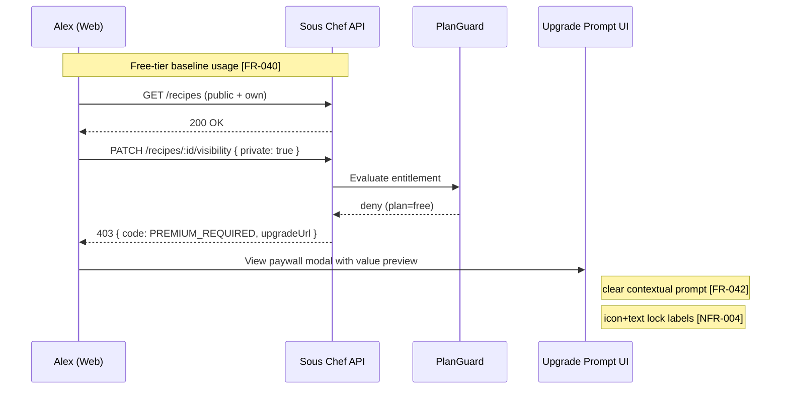
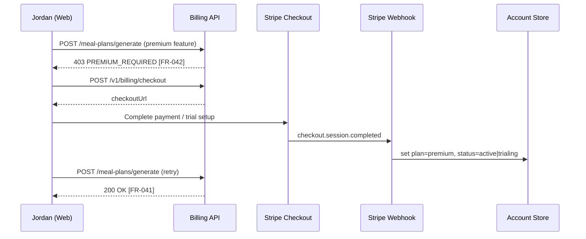
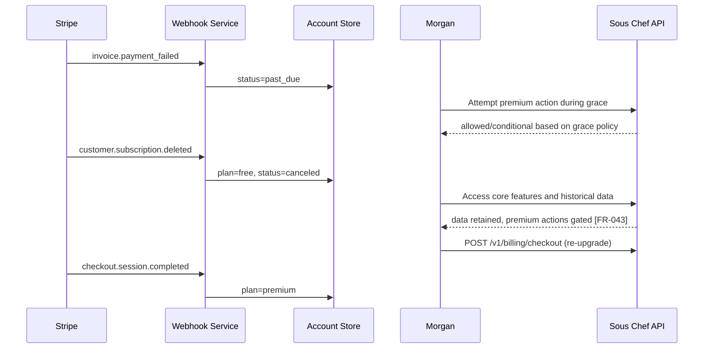

# User Journeys: Subscriptions & Monetization

**Branch**: `010-subscriptions`
**Date**: 2026-05-09
**Status**: Draft
**Source**: [product-spec.md](./product-spec.md), [spec.md](../spec.md), [plan.md](../plan.md)

---

## Journey Notation

Each journey represents an end-to-end user flow. Steps annotate requirement coverage with `[FR-XXX]` or `[NFR-XXX]` where relevant.

---

## Persona 1: Free-First Home Cook (Alex) — Journey A: Hit a Premium Gate and Evaluate Upgrade

**Scenario**: Alex uses free-tier features successfully, then attempts to set a recipe private and encounters a contextual paywall with a clear value explanation.

---

## Persona 2: Power Planner Upgrader (Jordan) — Journey B: Upgrade and Unlock Immediately

**Scenario**: Jordan attempts an AI planning feature, upgrades through Stripe Checkout, and gets immediate premium access.

---

## Persona 3: Returning Subscriber (Morgan) — Journey C: Payment Failure, Grace, Downgrade, Reactivation

**Scenario**: Morgan's renewal fails, enters grace period, downgrades to free behavior without data loss, then reactivates.

---

## Cross-Platform Journey D: Restore Purchase Signal (Mobile)

**Scenario**: User reinstalls app or switches device and invokes restore purchase to resync entitlement state.

1. User opens Billing Settings > Restore Purchase.
2. App calls restore/sync endpoint and refreshes account plan state.
3. App displays resolved entitlement state and available actions.

Coverage:

- Supports continuity expectations tied to `FR-043` trust contract.
- If mobile store billing is added, this flow becomes mandatory parity path (currently future-oriented warning).

---

## Journey-to-Requirement Matrix

| Journey              | FR-040 | FR-041           | FR-042 | FR-043 | NFR-003 | NFR-004 |
| -------------------- | ------ | ---------------- | ------ | ------ | ------- | ------- |
| A: Hit premium gate  | ✅     | ✅ (attempted)   | ✅     | —      | ✅      | ✅      |
| B: Upgrade + unlock  | —      | ✅               | ✅     | —      | ✅      | ✅      |
| C: Lapse + retention | ✅     | ✅ (when active) | ✅     | ✅     | —       | ✅      |
| D: Restore purchase  | ✅     | ✅               | —      | ✅     | ✅      | —       |
