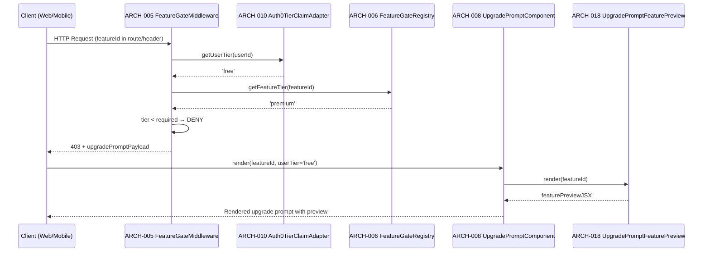
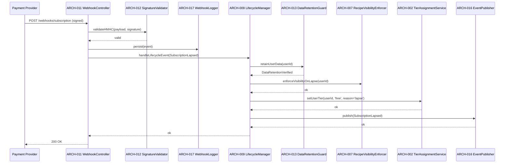
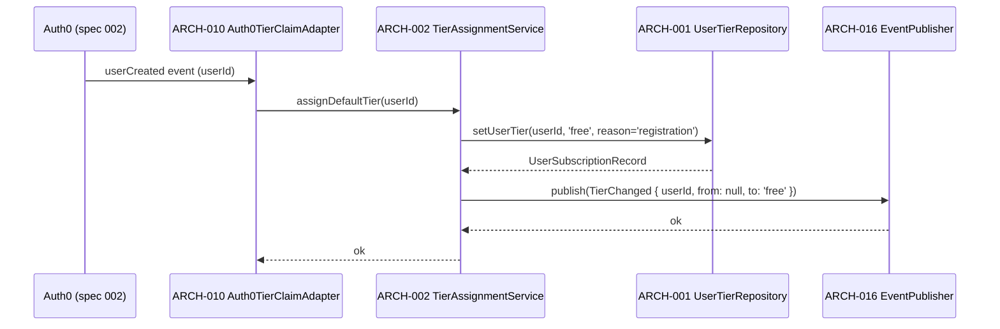

# Architecture Design: Subscriptions & Monetization

**Feature Branch**: `010-subscriptions`
**Created**: 2026-05-09
**Status**: Draft
**Source**: `specs/010-subscriptions/v-model/system-design.md`

## Overview

The Subscriptions & Monetization architecture decomposes 13 system components (SYS-001–SYS-013) into 18 architecture modules across four Kruchten 4+1 views. The design centers on a fail-closed Feature Gate Middleware that intercepts all feature access, resolves tier requirements from a static registry, and either permits access or triggers an accessible upgrade prompt. Subscription lifecycle events flow from a webhook receiver through a lifecycle manager to tier assignment and data retention guards. Cross-cutting modules enforce TypeScript strict compliance and accessibility requirements across all UI components.

## ID Schema

- **Architecture Module**: `ARCH-NNN` — sequential identifier for each module
- **Parent System Components**: Comma-separated `SYS-NNN` list per module (many-to-many)
- **Cross-Cutting Tag**: `[CROSS-CUTTING; rationale: shared infrastructure supports multiple SYS components]` for infrastructure/utility modules not traceable to a specific SYS
- Example: `ARCH-003` with Parent System Components `SYS-001, SYS-004` — module serves both components
- Example: `ARCH-010 [CROSS-CUTTING; rationale: shared infrastructure supports multiple SYS components]` — infrastructure module (e.g., Logger, Thread Pool) with rationale

## Logical View — Component Breakdown (IEEE 42010 / Kruchten 4+1)

| ARCH ID  | Name                             | Description                                                                                                                                                      | Parent System Components  | Type      |
| -------- | -------------------------------- | ---------------------------------------------------------------------------------------------------------------------------------------------------------------- | ------------------------- | --------- |
| ARCH-001 | UserTierRepository               | Persists and retrieves `UserSubscriptionRecord` in PostgreSQL; exposes `getUserTier`, `setUserTier`, and `getTierHistory` operations with row-level security.    | SYS-001, SYS-007, SYS-008 | Component |
| ARCH-002 | TierAssignmentService            | Orchestrates tier state transitions (free→premium, premium→lapsed, lapsed→premium); validates transition legality; emits tier-changed domain events.             | SYS-001, SYS-007          | Service   |
| ARCH-003 | FreeTierEntitlementResolver      | Resolves whether a given feature identifier is permitted under the free tier; reads from the FeatureGateRegistry; returns `EntitlementDecision`.                 | SYS-002, SYS-013          | Component |
| ARCH-004 | PremiumTierEntitlementResolver   | Resolves whether a given feature identifier is permitted under the premium tier; reads from the FeatureGateRegistry; returns `EntitlementDecision`.              | SYS-003, SYS-013          | Component |
| ARCH-005 | FeatureGateMiddleware            | NestJS middleware that intercepts all feature-gated HTTP requests; calls `getUserTier` and `getFeatureTier`; permits or denies; triggers upgrade prompt on deny. | SYS-004                   | Component |
| ARCH-006 | FeatureGateRegistry              | In-memory static registry mapping `featureId → requiredTier`; loaded from config at startup; consumed by ARCH-003, ARCH-004, and ARCH-005.                       | SYS-013                   | Library   |
| ARCH-007 | RecipeVisibilityEnforcer         | Enforces public-by-default for free-tier recipes; blocks free-tier users from setting `visibility=private`; applies lapse-time visibility preservation rules.    | SYS-005                   | Component |
| ARCH-008 | UpgradePromptComponent           | React/React Native UI component that renders a contextual upgrade prompt with feature preview; exposes accessible name via `aria-label`; pairs icon+text label.  | SYS-006                   | Component |
| ARCH-009 | SubscriptionLifecycleManager     | Orchestrates lapse and renewal flows: locks premium features, triggers data retention guard, enforces recipe visibility, updates tier via ARCH-002.              | SYS-007                   | Service   |
| ARCH-010 | Auth0TierClaimAdapter            | Reads Auth0 user session; extracts or injects `subscriptionTier` claim; provides `getUserTier(userId)` to ARCH-005 and ARCH-002.                                 | SYS-008                   | Adapter   |
| ARCH-011 | SubscriptionWebhookController    | NestJS controller that receives signed webhook POST from payment provider; validates HMAC signature; deserializes `SubscriptionEvent`; delegates to ARCH-009.    | SYS-009                   | Component |
| ARCH-012 | WebhookSignatureValidator        | Validates HMAC-SHA256 signature on incoming webhook payloads; rejects unsigned or tampered events; logs validation failures.                                     | SYS-009                   | Library   |
| ARCH-013 | DataRetentionGuard               | Ensures no user data is deleted on subscription lapse; runs pre-lapse data integrity check; emits `DataRetentionVerified` event before tier downgrade proceeds.  | SYS-010                   | Component |
| ARCH-014 | TypeScriptStrictLinter           | Build-time enforcement of `strict: true`; CI gate that fails on `any` usage outside test doubles; JSDoc coverage reporter for exported symbols.                  | SYS-011                   | Utility   |
| ARCH-015 | AccessibilityComplianceValidator | Playwright-based CI check that queries all subscription UI components via `getByRole`/`getByLabel`; validates icon+text pairing for tier status indicators.      | SYS-012                   | Utility   |
| ARCH-016 | SubscriptionEventPublisher       | Publishes internal domain events (`TierChanged`, `SubscriptionLapsed`, `SubscriptionRenewed`) to an in-process event bus; consumed by downstream modules.        | SYS-007, SYS-001          | Component |
| ARCH-017 | SubscriptionWebhookLogger        | Persists all incoming webhook events to `SubscriptionWebhookLog` table with 90-day retention; used for audit and replay.                                         | SYS-009                   | Component |
| ARCH-018 | UpgradePromptFeaturePreview      | Sub-component of the upgrade prompt that renders a teaser/preview of the gated premium feature; receives `featureId` and renders feature-specific preview copy.  | SYS-006                   | Component |

## Process View — Dynamic Behavior (Kruchten 4+1)

### Interaction: Feature Gate Check (Free-Tier User Accessing Premium Feature)

**Concurrency Model**: Event loop (Node.js single-threaded async); all I/O is non-blocking.
**Synchronization Points**: Auth0 claim read and registry lookup are sequential within the middleware; no shared mutable state.

### Interaction: Subscription Lapse Flow

**Concurrency Model**: Event loop; webhook handler is async; all downstream calls are awaited sequentially to preserve data integrity ordering (retain → visibility → tier).
**Synchronization Points**: `DataRetentionVerified` event must complete before `setUserTier` is called; enforced by sequential `await` chain.

### Interaction: User Registration — Free Tier Assignment

**Concurrency Model**: Event-driven; triggered by Auth0 post-registration hook.
**Synchronization Points**: Tier record must be persisted before any feature gate check can succeed for the new user.

## Interface View — API Contracts (Kruchten 4+1)

### ARCH-001: UserTierRepository

| Direction | Name                   | Type                          | Format                                           | Constraints                                   |
| --------- | ---------------------- | ----------------------------- | ------------------------------------------------ | --------------------------------------------- |
| Input     | userId                 | `string`                      | UUID v4                                          | Required; must exist in users table           |
| Input     | tier                   | `'free' \| 'premium'`         | Enum string                                      | Required for write operations                 |
| Input     | reason                 | `string`                      | Free text                                        | Required for audit log                        |
| Output    | UserSubscriptionRecord | `{ userId, tier, updatedAt }` | Typed object                                     | Always returns current record                 |
| Exception | `TierUpdateError`      | `Error`                       | `{ code: 'TIER_UPDATE_FAILED', userId, reason }` | Thrown on DB write failure; triggers rollback |

### ARCH-002: TierAssignmentService

| Direction | Name                         | Type                  | Format                                     | Constraints                        |
| --------- | ---------------------------- | --------------------- | ------------------------------------------ | ---------------------------------- |
| Input     | userId                       | `string`              | UUID v4                                    | Required                           |
| Input     | targetTier                   | `'free' \| 'premium'` | Enum string                                | Required                           |
| Input     | reason                       | `string`              | Free text                                  | Required                           |
| Output    | void                         | —                     | —                                          | Emits `TierChanged` domain event   |
| Exception | `InvalidTierTransitionError` | `Error`               | `{ code: 'INVALID_TRANSITION', from, to }` | Thrown on illegal state transition |

### ARCH-003: FreeTierEntitlementResolver

| Direction | Name                        | Type                                   | Format                                          | Constraints                         |
| --------- | --------------------------- | -------------------------------------- | ----------------------------------------------- | ----------------------------------- |
| Input     | featureId                   | `string`                               | Kebab-case feature identifier                   | Required; must be registered        |
| Output    | EntitlementDecision         | `{ permitted: boolean, tier: 'free' }` | Typed object                                    | Always returns a decision           |
| Exception | `FeatureNotRegisteredError` | `Error`                                | `{ code: 'FEATURE_NOT_REGISTERED', featureId }` | Thrown if featureId not in registry |

### ARCH-004: PremiumTierEntitlementResolver

| Direction | Name                        | Type                                      | Format                                          | Constraints                         |
| --------- | --------------------------- | ----------------------------------------- | ----------------------------------------------- | ----------------------------------- |
| Input     | featureId                   | `string`                                  | Kebab-case feature identifier                   | Required; must be registered        |
| Output    | EntitlementDecision         | `{ permitted: boolean, tier: 'premium' }` | Typed object                                    | Always returns a decision           |
| Exception | `FeatureNotRegisteredError` | `Error`                                   | `{ code: 'FEATURE_NOT_REGISTERED', featureId }` | Thrown if featureId not in registry |

### ARCH-005: FeatureGateMiddleware

| Direction | Name                  | Type                                             | Format                                                         | Constraints                                      |
| --------- | --------------------- | ------------------------------------------------ | -------------------------------------------------------------- | ------------------------------------------------ |
| Input     | request               | `NestJS Request`                                 | HTTP request with `userId` in JWT, `featureId` in route/header | Required                                         |
| Output    | next()                | void                                             | Passes to next handler                                         | Only called when access is permitted             |
| Output    | 403 response          | `{ upgradePromptPayload: UpgradePromptPayload }` | JSON                                                           | Returned when access is denied                   |
| Exception | `TierResolutionError` | `Error`                                          | `{ code: 'TIER_RESOLUTION_FAILED', userId }`                   | Thrown when tier cannot be resolved; fail-closed |

### ARCH-006: FeatureGateRegistry

| Direction | Name                        | Type                  | Format                                          | Constraints                         |
| --------- | --------------------------- | --------------------- | ----------------------------------------------- | ----------------------------------- |
| Input     | featureId                   | `string`              | Kebab-case feature identifier                   | Required                            |
| Output    | requiredTier                | `'free' \| 'premium'` | Enum string                                     | Returns tier requirement            |
| Exception | `FeatureNotRegisteredError` | `Error`               | `{ code: 'FEATURE_NOT_REGISTERED', featureId }` | Thrown if featureId not in registry |

### ARCH-007: RecipeVisibilityEnforcer

| Direction | Name                       | Type                                                    | Format                                               | Constraints                                 |
| --------- | -------------------------- | ------------------------------------------------------- | ---------------------------------------------------- | ------------------------------------------- |
| Input     | userId                     | `string`                                                | UUID v4                                              | Required                                    |
| Input     | recipeId                   | `string`                                                | UUID v4                                              | Required for per-recipe operations          |
| Input     | requestedVisibility        | `'public' \| 'private'`                                 | Enum string                                          | Required for set operations                 |
| Output    | `VisibilityDecision`       | `{ allowed: boolean, enforced: 'public' \| 'private' }` | Typed object                                         | Always returns enforced visibility          |
| Exception | `VisibilityViolationError` | `Error`                                                 | `{ code: 'VISIBILITY_VIOLATION', userId, recipeId }` | Thrown when free-tier user attempts private |

### ARCH-008: UpgradePromptComponent

| Direction | Name        | Type                  | Format                                       | Constraints                                       |
| --------- | ----------- | --------------------- | -------------------------------------------- | ------------------------------------------------- |
| Input     | featureId   | `string`              | Kebab-case feature identifier                | Required                                          |
| Input     | userTier    | `'free' \| 'premium'` | Enum string                                  | Required                                          |
| Output    | JSX.Element | React component       | Rendered upgrade prompt with accessible name | Must have `aria-label`; must pair icon+text       |
| Exception | —           | —                     | —                                            | Renders fallback generic CTA on unknown featureId |

### ARCH-009: SubscriptionLifecycleManager

| Direction | Name                  | Type                | Format                                              | Constraints                             |
| --------- | --------------------- | ------------------- | --------------------------------------------------- | --------------------------------------- |
| Input     | event                 | `SubscriptionEvent` | Typed union: `Lapsed \| Renewed \| Upgraded`        | Required; must be validated before call |
| Output    | void                  | —                   | —                                                   | Emits domain events via ARCH-016        |
| Exception | `LifecycleEventError` | `Error`             | `{ code: 'LIFECYCLE_EVENT_FAILED', event, reason }` | Thrown on failure; event sent to DLQ    |

### ARCH-010: Auth0TierClaimAdapter

| Direction | Name                | Type                  | Format                                     | Constraints                                       |
| --------- | ------------------- | --------------------- | ------------------------------------------ | ------------------------------------------------- |
| Input     | userId              | `string`              | UUID v4 or Auth0 sub                       | Required                                          |
| Output    | tier                | `'free' \| 'premium'` | Enum string                                | Derived from Auth0 custom claim                   |
| Exception | `AuthIdentityError` | `Error`               | `{ code: 'AUTH_IDENTITY_FAILED', userId }` | Thrown when claim cannot be resolved; deny access |

### ARCH-011: SubscriptionWebhookController

| Direction | Name      | Type                 | Format                     | Constraints                                     |
| --------- | --------- | -------------------- | -------------------------- | ----------------------------------------------- |
| Input     | POST body | `Buffer`             | Raw signed webhook payload | Required; must include `X-Signature` header     |
| Output    | 200 OK    | `{ received: true }` | JSON                       | Returned on successful processing               |
| Exception | 400/401   | HTTP error           | `{ error: string }`        | Returned on invalid signature or malformed body |

### ARCH-012: WebhookSignatureValidator

| Direction | Name                       | Type         | Format                                           | Constraints                          |
| --------- | -------------------------- | ------------ | ------------------------------------------------ | ------------------------------------ |
| Input     | payload                    | `Buffer`     | Raw request body                                 | Required                             |
| Input     | signature                  | `string`     | HMAC-SHA256 hex string from `X-Signature` header | Required                             |
| Output    | `{ valid: true }`          | Typed object | —                                                | Returned on valid signature          |
| Exception | `SignatureValidationError` | `Error`      | `{ code: 'INVALID_SIGNATURE' }`                  | Thrown on mismatch; request rejected |

### ARCH-013: DataRetentionGuard

| Direction | Name                    | Type         | Format                                      | Constraints                                     |
| --------- | ----------------------- | ------------ | ------------------------------------------- | ----------------------------------------------- |
| Input     | userId                  | `string`     | UUID v4                                     | Required                                        |
| Output    | `DataRetentionVerified` | Domain event | `{ userId, verifiedAt: Date }`              | Emitted on successful check                     |
| Exception | `DataRetentionError`    | `Error`      | `{ code: 'DATA_RETENTION_FAILED', userId }` | Thrown on failure; triggers alert; blocks lapse |

### ARCH-014: TypeScriptStrictLinter

| Direction | Name              | Type        | Format                                          | Constraints                         |
| --------- | ----------------- | ----------- | ----------------------------------------------- | ----------------------------------- |
| Input     | TypeScript source | File glob   | `src/**/*.ts`                                   | Run at build time and in CI         |
| Output    | Lint report       | JSON/text   | Compiler errors + `any` violations + JSDoc gaps | Zero violations required to pass CI |
| Exception | CI failure        | Exit code 1 | —                                               | Blocks merge on any violation       |

### ARCH-015: AccessibilityComplianceValidator

| Direction | Name                 | Type            | Format                                       | Constraints                                 |
| --------- | -------------------- | --------------- | -------------------------------------------- | ------------------------------------------- |
| Input     | Component under test | Playwright test | Rendered subscription UI components          | Run in CI against test environment          |
| Output    | Accessibility report | JSON/text       | Pass/fail per `getByRole`/`getByLabel` query | Zero failures required to pass CI           |
| Exception | CI failure           | Exit code 1     | —                                            | Blocks merge on any accessibility violation |

### ARCH-016: SubscriptionEventPublisher

| Direction | Name  | Type          | Format                                                                  | Constraints                                   |
| --------- | ----- | ------------- | ----------------------------------------------------------------------- | --------------------------------------------- |
| Input     | event | `DomainEvent` | Typed union: `TierChanged \| SubscriptionLapsed \| SubscriptionRenewed` | Required                                      |
| Output    | void  | —             | —                                                                       | Event delivered to all registered subscribers |
| Exception | —     | —             | —                                                                       | In-process bus; no network failure mode       |

### ARCH-017: SubscriptionWebhookLogger

| Direction | Name              | Type                | Format                                    | Constraints                                   |
| --------- | ----------------- | ------------------- | ----------------------------------------- | --------------------------------------------- |
| Input     | event             | `SubscriptionEvent` | Typed union                               | Required                                      |
| Output    | `WebhookLogEntry` | Typed object        | `{ eventId, type, receivedAt, payload }`  | Persisted to PostgreSQL                       |
| Exception | `WebhookLogError` | `Error`             | `{ code: 'WEBHOOK_LOG_FAILED', eventId }` | Logged and alerted; does not block processing |

### ARCH-018: UpgradePromptFeaturePreview

| Direction | Name        | Type            | Format                                    | Constraints                                        |
| --------- | ----------- | --------------- | ----------------------------------------- | -------------------------------------------------- |
| Input     | featureId   | `string`        | Kebab-case feature identifier             | Required                                           |
| Output    | JSX.Element | React component | Feature-specific preview copy and imagery | Falls back to generic preview on unknown featureId |
| Exception | —           | —               | —                                         | Never throws; renders fallback                     |

## Data Flow View — Data Transformation Chains (Kruchten 4+1)

### Data Flow: Webhook Event → Tier State Update

| Stage | Module                            | Input Format                          | Transformation                         | Output Format                      |
| ----- | --------------------------------- | ------------------------------------- | -------------------------------------- | ---------------------------------- |
| 1     | ARCH-011 WebhookController        | Raw HTTP POST body + signature header | Route to signature validator           | `Buffer` + `string` signature      |
| 2     | ARCH-012 SignatureValidator       | `Buffer` + HMAC signature             | HMAC-SHA256 verification               | `{ valid: true }` or throws        |
| 3     | ARCH-017 WebhookLogger            | Raw `SubscriptionEvent`               | Persist to `SubscriptionWebhookLog`    | `WebhookLogEntry`                  |
| 4     | ARCH-009 LifecycleManager         | `SubscriptionEvent` (typed union)     | Orchestrate lapse/renewal/upgrade flow | Sequence of downstream calls       |
| 5     | ARCH-013 DataRetentionGuard       | `{ userId }`                          | Verify data integrity pre-lapse        | `DataRetentionVerified` event      |
| 6     | ARCH-007 RecipeVisibilityEnforcer | `{ userId }`                          | Apply lapse-time visibility rules      | Visibility state updated in DB     |
| 7     | ARCH-002 TierAssignmentService    | `{ userId, targetTier, reason }`      | Validate transition, write to DB       | `UserSubscriptionRecord` updated   |
| 8     | ARCH-001 UserTierRepository       | `{ userId, tier, reason }`            | Persist tier change with audit log     | Updated `UserSubscriptionRecord`   |
| 9     | ARCH-016 EventPublisher           | `SubscriptionLapsed` domain event     | Broadcast to in-process subscribers    | Event delivered to all subscribers |

### Data Flow: Feature Gate Check

| Stage | Module                          | Input Format                        | Transformation                                | Output Format                            |
| ----- | ------------------------------- | ----------------------------------- | --------------------------------------------- | ---------------------------------------- |
| 1     | ARCH-005 FeatureGateMiddleware  | HTTP request (JWT + featureId)      | Extract userId from JWT, featureId from route | `{ userId, featureId }`                  |
| 2     | ARCH-010 Auth0TierClaimAdapter  | `{ userId }`                        | Read Auth0 custom claim `subscriptionTier`    | `'free' \| 'premium'`                    |
| 3     | ARCH-006 FeatureGateRegistry    | `{ featureId }`                     | Lookup required tier from static config       | `'free' \| 'premium'`                    |
| 4     | ARCH-005 FeatureGateMiddleware  | `{ userTier, requiredTier }`        | Compare tiers; permit or deny                 | `next()` or `403 + upgradePromptPayload` |
| 5     | ARCH-008 UpgradePromptComponent | `{ featureId, userTier }` (on deny) | Render contextual upgrade prompt with preview | Rendered JSX with accessible name        |

### Data Flow: New User Registration → Free Tier Assignment

| Stage | Module                         | Input Format                                             | Transformation                       | Output Format            |
| ----- | ------------------------------ | -------------------------------------------------------- | ------------------------------------ | ------------------------ |
| 1     | ARCH-010 Auth0TierClaimAdapter | Auth0 `userCreated` event                                | Extract userId                       | `{ userId }`             |
| 2     | ARCH-002 TierAssignmentService | `{ userId, targetTier: 'free', reason: 'registration' }` | Validate and initiate assignment     | Calls ARCH-001           |
| 3     | ARCH-001 UserTierRepository    | `{ userId, tier: 'free', reason }`                       | Persist new `UserSubscriptionRecord` | `UserSubscriptionRecord` |
| 4     | ARCH-016 EventPublisher        | `TierChanged { from: null, to: 'free' }`                 | Broadcast to in-process subscribers  | Event delivered          |

---

## Coverage Summary

| Metric                                 | Count                                                                          |
| -------------------------------------- | ------------------------------------------------------------------------------ |
| Total Architecture Modules (ARCH)      | 18                                                                             |
| Cross-Cutting Modules                  | 0 (SYS-011 and SYS-012 are explicitly modeled as ARCH-014 and ARCH-015)        |
| Total Parent System Components Covered | 13 / 13 (100%)                                                                 |
| Modules per Type                       | Component: 10 \| Service: 2 \| Library: 2 \| Utility: 2 \| Adapter: 1 \| — : 1 |
| **Forward Coverage (SYS→ARCH)**        | **100%**                                                                       |

## SYS→ARCH Traceability Matrix

| SYS ID  | ARCH IDs                     |
| ------- | ---------------------------- |
| SYS-001 | ARCH-001, ARCH-002, ARCH-016 |
| SYS-002 | ARCH-003                     |
| SYS-003 | ARCH-004                     |
| SYS-004 | ARCH-005                     |
| SYS-005 | ARCH-007                     |
| SYS-006 | ARCH-008, ARCH-018           |
| SYS-007 | ARCH-009, ARCH-016           |
| SYS-008 | ARCH-001, ARCH-010           |
| SYS-009 | ARCH-011, ARCH-012, ARCH-017 |
| SYS-010 | ARCH-013                     |
| SYS-011 | ARCH-014                     |
| SYS-012 | ARCH-015                     |
| SYS-013 | ARCH-003, ARCH-004, ARCH-006 |

## Derived Modules

None — all modules trace to existing system components.

## Physical View — Deployment Topology

The feature deploys within the Commise AWS/serverless topology. Client-facing web/mobile modules run in their respective application packages. Backend API, worker, queue, database, cache, storage, observability, and infrastructure modules deploy to the configured AWS account and region. Each ARCH module maps to the runtime described in the Logical View and the package/source paths listed in the Development View.

## Development View — Source Organization

Implementation modules are organized by platform and service boundary: web code under Next.js application packages, mobile code under Expo packages, backend services under API/Lambda packages, shared contracts under shared TypeScript packages, and infrastructure under CDK/IaC packages. This view constrains ownership, build boundaries, and deployment units for every ARCH-NNN module listed above.

## Scenarios — Architecture Validation

Primary scenarios validate the 4+1 architecture: successful request flow through user-facing entrypoints, dependency failure propagation through process boundaries, data persistence and retrieval through storage boundaries, and deployment/change isolation through development-view package ownership. Each scenario traces back to the SYS coverage listed on ARCH rows.
