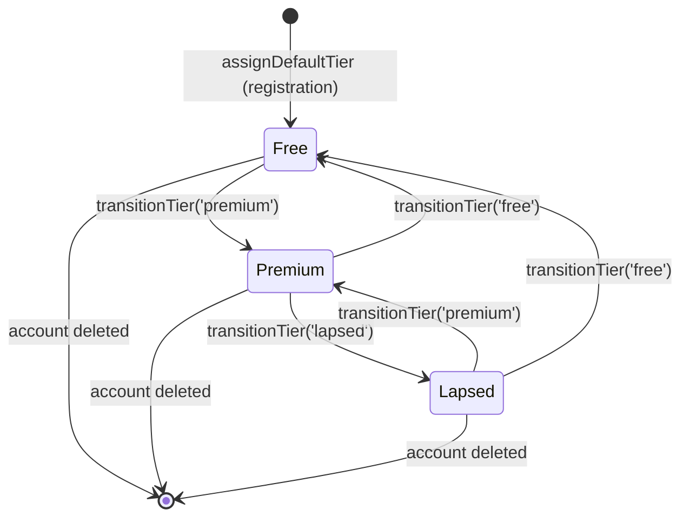
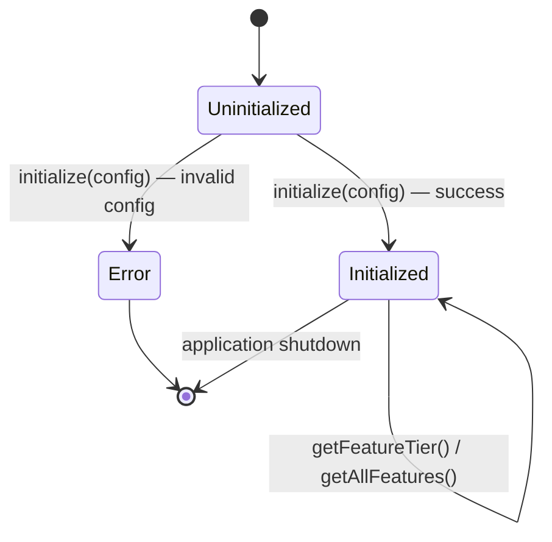
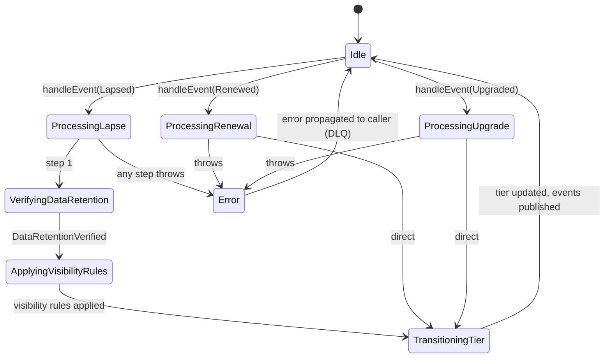
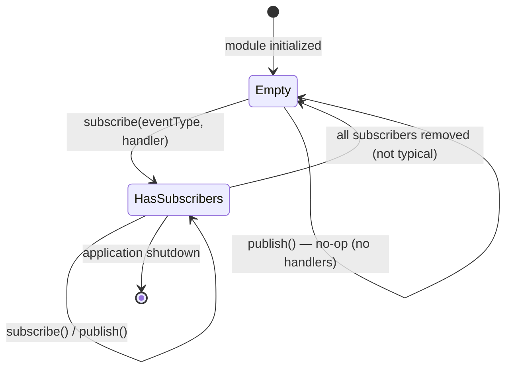

# Module Design: Subscriptions & Monetization

**Feature Branch**: `010-subscriptions`
**Created**: 2026-05-09
**Status**: Draft
**Source**: `specs/010-subscriptions/v-model/architecture-design.md`

## Overview

The Subscriptions & Monetization module design decomposes 18 architecture modules (ARCH-001–ARCH-018) into 18 low-level module specifications (MOD-001–MOD-018). Each module is specified with four mandatory views — Algorithmic/Logic, State Machine, Internal Data Structures, and Error Handling — at a level of detail where writing the actual source code is a direct translation exercise requiring no further design decisions. The design centers on a fail-closed feature gate, a webhook-driven lifecycle manager, and cross-cutting TypeScript/accessibility enforcement utilities.

## ID Schema

- **Module Design**: `MOD-NNN` — sequential identifier for each module (3-digit zero-padded)
- **Parent Architecture Modules**: Comma-separated `ARCH-NNN` list per module (many-to-many, authoritative for traceability)
- **Target Source File(s)**: Comma-separated file paths mapping to the repository codebase
- Example: `MOD-003` with Parent Architecture Modules `ARCH-001, ARCH-004` — module serves both architecture components
- Example: `MOD-007 [EXTERNAL]` — third-party library wrapper, documents interface only

## Module Designs

---

### Module: MOD-001 (UserTierRepository)

**Parent Architecture Modules**: ARCH-001
**Target Source File(s)**: `src/subscriptions/repositories/user-tier.repository.ts`

#### Algorithmic / Logic View

```pseudocode
CLASS UserTierRepository:

  FUNCTION getUserTier(userId: string) -> UserSubscriptionRecord:
    VALIDATE userId IS non-empty UUID v4
    IF invalid: THROW TierUpdateError({ code: 'TIER_UPDATE_FAILED', userId, reason: 'invalid userId' })
    EXECUTE SQL:
      SELECT user_id, tier, updated_at FROM user_subscription_records
      WHERE user_id = $userId
      WITH ROW-LEVEL SECURITY ENFORCED
    IF no row found:
      RETURN { userId, tier: 'free', updatedAt: null }  // default for unregistered
    RETURN { userId, tier, updatedAt }

  FUNCTION setUserTier(userId: string, tier: 'free' | 'premium', reason: string) -> UserSubscriptionRecord:
    VALIDATE userId IS non-empty UUID v4
    VALIDATE tier IN ['free', 'premium']
    VALIDATE reason IS non-empty string
    IF any invalid: THROW TierUpdateError({ code: 'TIER_UPDATE_FAILED', userId, reason: 'validation failed' })
    BEGIN TRANSACTION
      UPSERT INTO user_subscription_records (user_id, tier, updated_at)
        VALUES ($userId, $tier, NOW())
        ON CONFLICT (user_id) DO UPDATE SET tier = $tier, updated_at = NOW()
      INSERT INTO user_tier_audit_log (user_id, tier, reason, changed_at)
        VALUES ($userId, $tier, $reason, NOW())
    COMMIT TRANSACTION
    IF DB error: ROLLBACK; THROW TierUpdateError({ code: 'TIER_UPDATE_FAILED', userId, reason: dbError.message })
    RETURN { userId, tier, updatedAt: NOW() }

  FUNCTION getTierHistory(userId: string) -> TierHistoryEntry[]:
    VALIDATE userId IS non-empty UUID v4
    IF invalid: THROW TierUpdateError({ code: 'TIER_UPDATE_FAILED', userId, reason: 'invalid userId' })
    EXECUTE SQL:
      SELECT user_id, tier, reason, changed_at FROM user_tier_audit_log
      WHERE user_id = $userId
      ORDER BY changed_at DESC
    RETURN rows AS TierHistoryEntry[]
```

#### State Machine View

N/A — Stateless (repository delegates all state to PostgreSQL; no in-memory state retained between calls)

#### Internal Data Structures

| Name                     | Type                                                                 | Size/Constraints | Initialization         | Description                         |
| ------------------------ | -------------------------------------------------------------------- | ---------------- | ---------------------- | ----------------------------------- |
| `UserSubscriptionRecord` | `{ userId: string; tier: 'free'\|'premium'; updatedAt: Date\|null }` | userId: UUID v4  | N/A (returned from DB) | Current tier record for a user      |
| `TierHistoryEntry`       | `{ userId: string; tier: string; reason: string; changedAt: Date }`  | Unbounded rows   | N/A (returned from DB) | Single audit log entry              |
| `TierUpdateError`        | `Error & { code: string; userId: string; reason: string }`           | —                | Thrown on failure      | Typed error for tier write failures |

#### Error Handling & Return Codes

| Error Condition                | Error Code / Exception                           | Architecture Contract                  | Recovery                                    |
| ------------------------------ | ------------------------------------------------ | -------------------------------------- | ------------------------------------------- |
| Invalid userId format          | `TierUpdateError { code: 'TIER_UPDATE_FAILED' }` | ARCH-001 Interface View: Exception row | Caller catches; propagates to service layer |
| DB write failure               | `TierUpdateError { code: 'TIER_UPDATE_FAILED' }` | ARCH-001 Interface View: Exception row | Transaction rolled back; error propagated   |
| Row not found on `getUserTier` | Returns default `{ tier: 'free' }`               | ARCH-001 Interface View: Output row    | No error; safe default                      |

---

### Module: MOD-002 (TierAssignmentService)

**Parent Architecture Modules**: ARCH-002
**Target Source File(s)**: `src/subscriptions/services/tier-assignment.service.ts`

#### Algorithmic / Logic View

```pseudocode
CLASS TierAssignmentService:
  DEPENDS ON: UserTierRepository (MOD-001), SubscriptionEventPublisher (MOD-016)

  CONSTANT VALID_TRANSITIONS = {
    null    → ['free'],
    'free'  → ['premium'],
    'premium' → ['lapsed', 'free'],
    'lapsed'  → ['premium', 'free'],
  }

  FUNCTION assignDefaultTier(userId: string) -> void:
    CALL setUserTier(userId, 'free', reason='registration')

  FUNCTION transitionTier(userId: string, targetTier: 'free' | 'premium' | 'lapsed', reason: string) -> UserSubscriptionRecord:
    currentRecord = CALL getUserTier(userId)
    currentTier = currentRecord.tier  // may be null for brand-new user
    allowedTargets = VALID_TRANSITIONS[currentTier] ?? []
    IF targetTier NOT IN allowedTargets:
      THROW TierTransitionError({ code: 'INVALID_TIER_TRANSITION', userId, from: currentTier, to: targetTier })
    updatedRecord = CALL setUserTier(userId, targetTier, reason)
    CALL publish(TierChanged { userId, from: currentTier, to: targetTier, reason, timestamp: NOW() })
    RETURN updatedRecord
```

#### State Machine View



#### Internal Data Structures

| Name                  | Type                                                                 | Size/Constraints  | Initialization      | Description                         |
| --------------------- | -------------------------------------------------------------------- | ----------------- | ------------------- | ----------------------------------- |
| `VALID_TRANSITIONS`   | `Record<string\|null, string[]>`                                     | 4 entries, static | Module load         | Allowed tier transition map         |
| `TierTransitionError` | `Error & { code: string; userId: string; from: string; to: string }` | —                 | Thrown on violation | Typed error for illegal transitions |

#### Error Handling & Return Codes

| Error Condition            | Error Code / Exception                                    | Architecture Contract                  | Recovery                                     |
| -------------------------- | --------------------------------------------------------- | -------------------------------------- | -------------------------------------------- |
| Illegal tier transition    | `TierTransitionError { code: 'INVALID_TIER_TRANSITION' }` | ARCH-002 Interface View: Exception row | Caller (LifecycleManager) catches; logs; DLQ |
| DB failure from repository | Re-throws `TierUpdateError` from MOD-001                  | ARCH-002 Interface View: Exception row | Propagated to caller                         |

---

### Module: MOD-003 (FreeTierEntitlementResolver)

**Parent Architecture Modules**: ARCH-003
**Target Source File(s)**: `src/subscriptions/resolvers/free-tier-entitlement.resolver.ts`

#### Algorithmic / Logic View

```pseudocode
CLASS FreeTierEntitlementResolver:
  DEPENDS ON: FeatureGateRegistry (MOD-006)

  FUNCTION resolve(featureId: string) -> EntitlementDecision:
    VALIDATE featureId IS non-empty string
    IF invalid: RETURN { permitted: false, reason: 'invalid featureId' }
    requiredTier = CALL FeatureGateRegistry.getFeatureTier(featureId)
    IF requiredTier IS null:
      RETURN { permitted: false, reason: 'unknown feature' }
    IF requiredTier === 'free':
      RETURN { permitted: true, reason: 'free tier entitlement' }
    ELSE:
      RETURN { permitted: false, reason: 'premium feature', requiredTier }
```

#### State Machine View

N/A — Stateless (pure function; reads from static registry; no retained state)

#### Internal Data Structures

| Name                  | Type                                                            | Size/Constraints | Initialization | Description                      |
| --------------------- | --------------------------------------------------------------- | ---------------- | -------------- | -------------------------------- |
| `EntitlementDecision` | `{ permitted: boolean; reason: string; requiredTier?: string }` | —                | Returned       | Result of entitlement resolution |

#### Error Handling & Return Codes

| Error Condition         | Error Code / Exception         | Architecture Contract               | Recovery                         |
| ----------------------- | ------------------------------ | ----------------------------------- | -------------------------------- |
| Unknown featureId       | Returns `{ permitted: false }` | ARCH-003 Interface View: Output row | Fail-closed; no exception thrown |
| Invalid featureId input | Returns `{ permitted: false }` | ARCH-003 Interface View: Output row | Fail-closed; no exception thrown |

---

### Module: MOD-004 (PremiumTierEntitlementResolver)

**Parent Architecture Modules**: ARCH-004
**Target Source File(s)**: `src/subscriptions/resolvers/premium-tier-entitlement.resolver.ts`

#### Algorithmic / Logic View

```pseudocode
CLASS PremiumTierEntitlementResolver:
  DEPENDS ON: FeatureGateRegistry (MOD-006)

  FUNCTION resolve(featureId: string) -> EntitlementDecision:
    VALIDATE featureId IS non-empty string
    IF invalid: RETURN { permitted: false, reason: 'invalid featureId' }
    requiredTier = CALL FeatureGateRegistry.getFeatureTier(featureId)
    IF requiredTier IS null:
      RETURN { permitted: false, reason: 'unknown feature' }
    // Premium tier has access to both 'free' and 'premium' features
    IF requiredTier IN ['free', 'premium']:
      RETURN { permitted: true, reason: 'premium tier entitlement' }
    ELSE:
      RETURN { permitted: false, reason: 'feature not available', requiredTier }
```

#### State Machine View

N/A — Stateless (pure function; reads from static registry; no retained state)

#### Internal Data Structures

| Name                  | Type                                                            | Size/Constraints | Initialization | Description                      |
| --------------------- | --------------------------------------------------------------- | ---------------- | -------------- | -------------------------------- |
| `EntitlementDecision` | `{ permitted: boolean; reason: string; requiredTier?: string }` | —                | Returned       | Result of entitlement resolution |

#### Error Handling & Return Codes

| Error Condition         | Error Code / Exception         | Architecture Contract               | Recovery                         |
| ----------------------- | ------------------------------ | ----------------------------------- | -------------------------------- |
| Unknown featureId       | Returns `{ permitted: false }` | ARCH-004 Interface View: Output row | Fail-closed; no exception thrown |
| Invalid featureId input | Returns `{ permitted: false }` | ARCH-004 Interface View: Output row | Fail-closed; no exception thrown |

---

### Module: MOD-005 (FeatureGateMiddleware)

**Parent Architecture Modules**: ARCH-005
**Target Source File(s)**: `src/subscriptions/middleware/feature-gate.middleware.ts`

#### Algorithmic / Logic View

```pseudocode
CLASS FeatureGateMiddleware IMPLEMENTS NestJS Middleware:
  DEPENDS ON: Auth0TierClaimAdapter (MOD-010), FeatureGateRegistry (MOD-006)

  FUNCTION use(req: Request, res: Response, next: NextFunction) -> void:
    featureId = EXTRACT featureId FROM req.headers['x-feature-id'] OR req.route.meta.featureId
    IF featureId IS null OR empty:
      CALL next()  // no gate required for this route
      RETURN

    userId = EXTRACT userId FROM req.auth.sub  // Auth0 JWT claim
    IF userId IS null:
      RESPOND 401 { error: 'Unauthorized' }
      RETURN

    TRY:
      userTier = CALL Auth0TierClaimAdapter.getUserTier(userId)
    CATCH AuthIdentityError:
      RESPOND 403 { error: 'Cannot resolve user tier' }
      RETURN

    requiredTier = CALL FeatureGateRegistry.getFeatureTier(featureId)
    IF requiredTier IS null:
      RESPOND 403 { error: 'Unknown feature', featureId }
      RETURN

    tierRank = { 'free': 0, 'premium': 1 }
    IF tierRank[userTier] >= tierRank[requiredTier]:
      CALL next()  // permitted
    ELSE:
      upgradePromptPayload = { featureId, requiredTier, currentTier: userTier }
      RESPOND 403 { error: 'Upgrade required', upgradePrompt: upgradePromptPayload }
```

#### State Machine View

N/A — Stateless (each request is independently evaluated; no retained state between requests)

#### Internal Data Structures

| Name                   | Type                                                               | Size/Constraints  | Initialization | Description                      |
| ---------------------- | ------------------------------------------------------------------ | ----------------- | -------------- | -------------------------------- |
| `tierRank`             | `Record<string, number>`                                           | 2 entries, static | Per invocation | Numeric rank for tier comparison |
| `upgradePromptPayload` | `{ featureId: string; requiredTier: string; currentTier: string }` | —                 | Per invocation | Payload sent to client on deny   |

#### Error Handling & Return Codes

| Error Condition                  | Error Code / Exception                                  | Architecture Contract                  | Recovery                                  |
| -------------------------------- | ------------------------------------------------------- | -------------------------------------- | ----------------------------------------- |
| Missing userId in JWT            | HTTP 401 `{ error: 'Unauthorized' }`                    | ARCH-005 Interface View: Exception row | Request rejected; no next() called        |
| `AuthIdentityError` from adapter | HTTP 403 `{ error: 'Cannot resolve user tier' }`        | ARCH-005 Interface View: Exception row | Request rejected; fail-closed             |
| Unknown featureId in registry    | HTTP 403 `{ error: 'Unknown feature' }`                 | ARCH-005 Interface View: Exception row | Request rejected; fail-closed             |
| Tier insufficient                | HTTP 403 `{ error: 'Upgrade required', upgradePrompt }` | ARCH-005 Interface View: Output row    | Upgrade prompt payload returned to client |

---

### Module: MOD-006 (FeatureGateRegistry)

**Parent Architecture Modules**: ARCH-006
**Target Source File(s)**: `src/subscriptions/registry/feature-gate.registry.ts`

#### Algorithmic / Logic View

```pseudocode
CLASS FeatureGateRegistry:
  PRIVATE registry: Map<string, 'free' | 'premium'>

  FUNCTION initialize(config: FeatureGateConfig) -> void:
    // Called once at application startup via NestJS OnModuleInit
    FOR EACH entry IN config.features:
      VALIDATE entry.featureId IS non-empty string
      VALIDATE entry.requiredTier IN ['free', 'premium']
      registry.set(entry.featureId, entry.requiredTier)
    LOG "FeatureGateRegistry initialized with ${registry.size} features"

  FUNCTION getFeatureTier(featureId: string) -> 'free' | 'premium' | null:
    IF registry.has(featureId):
      RETURN registry.get(featureId)
    RETURN null  // unknown feature; caller must treat as denied

  FUNCTION getAllFeatures() -> FeatureGateEntry[]:
    RETURN Array.from(registry.entries()).map(([featureId, requiredTier]) => ({ featureId, requiredTier }))
```

#### State Machine View



#### Internal Data Structures

| Name                | Type                                                          | Size/Constraints                  | Initialization               | Description                          |
| ------------------- | ------------------------------------------------------------- | --------------------------------- | ---------------------------- | ------------------------------------ |
| `registry`          | `Map<string, 'free' \| 'premium'>`                            | Bounded by config; typically <100 | `initialize()` at startup    | In-memory feature→tier mapping       |
| `FeatureGateConfig` | `{ features: { featureId: string; requiredTier: string }[] }` | —                                 | Injected via NestJS config   | Config shape loaded from environment |
| `FeatureGateEntry`  | `{ featureId: string; requiredTier: 'free' \| 'premium' }`    | —                                 | Returned by `getAllFeatures` | Single registry entry                |

#### Error Handling & Return Codes

| Error Condition              | Error Code / Exception                              | Architecture Contract                  | Recovery                                   |
| ---------------------------- | --------------------------------------------------- | -------------------------------------- | ------------------------------------------ |
| Invalid config entry at init | Throws `Error('Invalid feature gate config entry')` | ARCH-006 Interface View: Exception row | Application fails to start; fix config     |
| Unknown featureId on lookup  | Returns `null`                                      | ARCH-006 Interface View: Output row    | Caller treats null as denied (fail-closed) |

---

### Module: MOD-007 (RecipeVisibilityEnforcer)

**Parent Architecture Modules**: ARCH-007
**Target Source File(s)**: `src/subscriptions/enforcers/recipe-visibility.enforcer.ts`

#### Algorithmic / Logic View

```pseudocode
CLASS RecipeVisibilityEnforcer:
  DEPENDS ON: UserTierRepository (MOD-001)

  FUNCTION enforceOnCreate(userId: string, requestedVisibility: 'public' | 'private') -> 'public' | 'private':
    userRecord = CALL getUserTier(userId)
    IF userRecord.tier === 'free' AND requestedVisibility === 'private':
      RETURN 'public'  // silently override; free-tier recipes are always public
    RETURN requestedVisibility

  FUNCTION enforceOnUpdate(userId: string, recipeId: string, requestedVisibility: 'public' | 'private') -> 'public' | 'private':
    userRecord = CALL getUserTier(userId)
    IF userRecord.tier === 'free' AND requestedVisibility === 'private':
      RETURN 'public'  // block attempt to set private
    RETURN requestedVisibility

  FUNCTION applyLapseVisibilityRules(userId: string) -> void:
    // Called when user transitions from premium → lapsed
    // Preserve existing private recipes (do NOT delete or change visibility)
    // Block any NEW private recipe creation going forward (enforced by enforceOnCreate)
    // No DB mutation needed here; enforceOnCreate handles future requests
    LOG "Lapse visibility rules applied for userId=${userId}: existing private recipes preserved"
```

#### State Machine View

N/A — Stateless (visibility decisions are computed per-call from current tier; no retained state)

#### Internal Data Structures

| Name   | Type | Size/Constraints | Initialization | Description                               |
| ------ | ---- | ---------------- | -------------- | ----------------------------------------- |
| (none) | —    | —                | —              | All inputs are parameters; no local state |

#### Error Handling & Return Codes

| Error Condition                   | Error Code / Exception | Architecture Contract                  | Recovery                                 |
| --------------------------------- | ---------------------- | -------------------------------------- | ---------------------------------------- |
| `TierUpdateError` from repository | Re-thrown as-is        | ARCH-007 Interface View: Exception row | Caller handles; recipe operation aborted |
| Unknown userId                    | Re-throws from MOD-001 | ARCH-007 Interface View: Exception row | Caller handles                           |

---

### Module: MOD-008 (UpgradePromptComponent)

**Parent Architecture Modules**: ARCH-008
**Target Source File(s)**: `src/subscriptions/components/UpgradePrompt.tsx`, `src/subscriptions/components/UpgradePrompt.native.tsx`

#### Algorithmic / Logic View

```pseudocode
FUNCTION UpgradePromptComponent(props: UpgradePromptProps) -> JSX.Element:
  // props: { featureId: string; requiredTier: string; currentTier: string; onUpgrade: () => void }

  featureLabel = LOOKUP featureId IN FEATURE_LABEL_MAP ?? 'this feature'
  ariaLabel = `Upgrade to ${requiredTier} to access ${featureLabel}`

  RENDER:
    <Container role="dialog" aria-label={ariaLabel} aria-modal="true">
      <Icon name="lock" aria-hidden="true" />
      <Text>{featureLabel} requires {requiredTier} plan</Text>
      <FeaturePreview featureId={featureId} />  // renders MOD-018
      <Button
        onPress={onUpgrade}
        aria-label={`Upgrade to ${requiredTier}`}
      >
        Upgrade Now
      </Button>
    </Container>

  // Accessibility: icon is aria-hidden; text label always present alongside icon
  // aria-label on container provides accessible name for screen readers
```

#### State Machine View

N/A — Stateless (pure presentational component; no internal state; parent controls visibility)

#### Internal Data Structures

| Name                 | Type                                                                                      | Size/Constraints | Initialization  | Description                              |
| -------------------- | ----------------------------------------------------------------------------------------- | ---------------- | --------------- | ---------------------------------------- |
| `UpgradePromptProps` | `{ featureId: string; requiredTier: string; currentTier: string; onUpgrade: () => void }` | —                | Props injection | Component input contract                 |
| `FEATURE_LABEL_MAP`  | `Record<string, string>`                                                                  | Static, bounded  | Module load     | Maps featureId to human-readable label   |
| `featureLabel`       | `string`                                                                                  | ≤100 chars       | Per render      | Resolved display name for the feature    |
| `ariaLabel`          | `string`                                                                                  | ≤200 chars       | Per render      | Accessible name for the dialog container |

#### Error Handling & Return Codes

| Error Condition   | Error Code / Exception                       | Architecture Contract                  | Recovery                        |
| ----------------- | -------------------------------------------- | -------------------------------------- | ------------------------------- |
| Unknown featureId | Renders with `featureLabel = 'this feature'` | ARCH-008 Interface View: Exception row | Graceful fallback; never throws |

---

### Module: MOD-009 (SubscriptionLifecycleManager)

**Parent Architecture Modules**: ARCH-009
**Target Source File(s)**: `src/subscriptions/services/subscription-lifecycle.manager.ts`

#### Algorithmic / Logic View

```pseudocode
CLASS SubscriptionLifecycleManager:
  DEPENDS ON: DataRetentionGuard (MOD-013), RecipeVisibilityEnforcer (MOD-007),
              TierAssignmentService (MOD-002), SubscriptionEventPublisher (MOD-016)

  FUNCTION handleEvent(event: SubscriptionEvent) -> void:
    TRY:
      MATCH event.type:
        CASE 'Lapsed':
          AWAIT handleLapse(event.userId)
        CASE 'Renewed':
          AWAIT handleRenewal(event.userId)
        CASE 'Upgraded':
          AWAIT handleUpgrade(event.userId, event.targetTier)
        DEFAULT:
          THROW LifecycleEventError({ code: 'LIFECYCLE_EVENT_FAILED', event, reason: 'unknown event type' })
    CATCH error:
      LOG error
      THROW LifecycleEventError({ code: 'LIFECYCLE_EVENT_FAILED', event, reason: error.message })

  PRIVATE FUNCTION handleLapse(userId: string) -> void:
    // Sequential await chain — order is mandatory (retain → visibility → tier)
    AWAIT DataRetentionGuard.verifyDataIntegrity(userId)  // emits DataRetentionVerified
    AWAIT RecipeVisibilityEnforcer.applyLapseVisibilityRules(userId)
    AWAIT TierAssignmentService.transitionTier(userId, 'lapsed', reason='subscription_lapsed')
    // TierAssignmentService internally publishes SubscriptionLapsed via EventPublisher

  PRIVATE FUNCTION handleRenewal(userId: string) -> void:
    AWAIT TierAssignmentService.transitionTier(userId, 'premium', reason='subscription_renewed')

  PRIVATE FUNCTION handleUpgrade(userId: string, targetTier: string) -> void:
    AWAIT TierAssignmentService.transitionTier(userId, targetTier, reason='subscription_upgraded')
```

#### State Machine View



#### Internal Data Structures

| Name                  | Type                                                                             | Size/Constraints | Initialization           | Description                        |
| --------------------- | -------------------------------------------------------------------------------- | ---------------- | ------------------------ | ---------------------------------- |
| `SubscriptionEvent`   | `{ type: 'Lapsed'\|'Renewed'\|'Upgraded'; userId: string; targetTier?: string }` | —                | Received from controller | Typed union of lifecycle events    |
| `LifecycleEventError` | `Error & { code: string; event: SubscriptionEvent; reason: string }`             | —                | Thrown on failure        | Typed error for lifecycle failures |

#### Error Handling & Return Codes

| Error Condition                    | Error Code / Exception                                   | Architecture Contract                  | Recovery                                |
| ---------------------------------- | -------------------------------------------------------- | -------------------------------------- | --------------------------------------- |
| Unknown event type                 | `LifecycleEventError { code: 'LIFECYCLE_EVENT_FAILED' }` | ARCH-009 Interface View: Exception row | Event sent to DLQ by caller             |
| Any step in lapse chain fails      | `LifecycleEventError { code: 'LIFECYCLE_EVENT_FAILED' }` | ARCH-009 Interface View: Exception row | Entire lapse aborted; event sent to DLQ |
| `TierTransitionError` from service | Wrapped in `LifecycleEventError`                         | ARCH-009 Interface View: Exception row | Event sent to DLQ                       |

---

### Module: MOD-010 (Auth0TierClaimAdapter)

**Parent Architecture Modules**: ARCH-010
**Target Source File(s)**: `src/subscriptions/adapters/auth0-tier-claim.adapter.ts`

#### Algorithmic / Logic View

```pseudocode
CLASS Auth0TierClaimAdapter:
  DEPENDS ON: Auth0 session SDK (@auth0/nextjs-auth0 v4.x)

  FUNCTION getUserTier(userId: string) -> 'free' | 'premium':
    VALIDATE userId IS non-empty string
    IF invalid: THROW AuthIdentityError({ code: 'AUTH_IDENTITY_FAILED', userId })

    TRY:
      session = CALL Auth0.getSession()  // reads current Auth0 session
      IF session IS null:
        THROW AuthIdentityError({ code: 'AUTH_IDENTITY_FAILED', userId })
      claims = session.user
      subscriptionTier = claims['https://sous-chef.app/subscriptionTier']
      IF subscriptionTier IS null OR subscriptionTier NOT IN ['free', 'premium']:
        // Claim missing or invalid — default to 'free' (fail-safe)
        RETURN 'free'
      RETURN subscriptionTier
    CATCH Auth0Error:
      THROW AuthIdentityError({ code: 'AUTH_IDENTITY_FAILED', userId })

  FUNCTION injectTierClaim(userId: string, tier: 'free' | 'premium') -> void:
    // Called after tier assignment to update Auth0 custom claim
    // Uses Auth0 Management API to patch user metadata
    TRY:
      CALL Auth0ManagementAPI.updateUserMetadata(userId, { subscriptionTier: tier })
    CATCH error:
      LOG "Failed to inject tier claim for userId=${userId}: ${error.message}"
      // Non-fatal: claim will be refreshed on next login
```

#### State Machine View

N/A — Stateless (reads from Auth0 session per call; no retained state)

#### Internal Data Structures

| Name                | Type                                                  | Size/Constraints | Initialization    | Description                             |
| ------------------- | ----------------------------------------------------- | ---------------- | ----------------- | --------------------------------------- |
| `AuthIdentityError` | `Error & { code: string; userId: string }`            | —                | Thrown on failure | Typed error for Auth0 identity failures |
| `CLAIM_NAMESPACE`   | `string` = `'https://sous-chef.app/subscriptionTier'` | Static constant  | Module load       | Auth0 custom claim namespace key        |

#### Error Handling & Return Codes

| Error Condition                        | Error Code / Exception                               | Architecture Contract                  | Recovery                                    |
| -------------------------------------- | ---------------------------------------------------- | -------------------------------------- | ------------------------------------------- |
| No Auth0 session                       | `AuthIdentityError { code: 'AUTH_IDENTITY_FAILED' }` | ARCH-010 Interface View: Exception row | Caller (FeatureGateMiddleware) responds 403 |
| Missing/invalid tier claim             | Returns `'free'` (fail-safe default)                 | ARCH-010 Interface View: Output row    | User treated as free tier                   |
| Auth0 Management API failure on inject | Logged; non-fatal                                    | ARCH-010 Interface View: Exception row | Claim refreshed on next login               |

---

### Module: MOD-011 (SubscriptionWebhookController)

**Parent Architecture Modules**: ARCH-011
**Target Source File(s)**: `src/subscriptions/controllers/subscription-webhook.controller.ts`

#### Algorithmic / Logic View

```pseudocode
CLASS SubscriptionWebhookController:
  DEPENDS ON: WebhookSignatureValidator (MOD-012), SubscriptionWebhookLogger (MOD-017),
              SubscriptionLifecycleManager (MOD-009)

  @Post('/webhooks/subscription')
  FUNCTION handleWebhook(req: RawRequest) -> { received: true }:
    rawBody = req.rawBody  // Buffer; must be raw (not parsed) for HMAC
    signature = req.headers['x-signature']

    IF signature IS null OR empty:
      RESPOND 400 { error: 'Missing signature header' }
      RETURN

    TRY:
      CALL WebhookSignatureValidator.validate(rawBody, signature)
    CATCH SignatureValidationError:
      RESPOND 401 { error: 'Invalid signature' }
      RETURN

    TRY:
      event = JSON.parse(rawBody.toString('utf8')) AS SubscriptionEvent
      VALIDATE event.type IN ['Lapsed', 'Renewed', 'Upgraded']
      VALIDATE event.userId IS non-empty string
    CATCH parseError:
      RESPOND 400 { error: 'Malformed webhook body' }
      RETURN

    AWAIT SubscriptionWebhookLogger.log(event)  // persist before processing
    AWAIT SubscriptionLifecycleManager.handleEvent(event)

    RESPOND 200 { received: true }
```

#### State Machine View

N/A — Stateless (each HTTP request is independently handled; no retained state between requests)

#### Internal Data Structures

| Name                | Type                                                    | Size/Constraints | Initialization     | Description                               |
| ------------------- | ------------------------------------------------------- | ---------------- | ------------------ | ----------------------------------------- |
| `rawBody`           | `Buffer`                                                | ≤1 MB            | Per request        | Raw webhook payload for HMAC verification |
| `signature`         | `string`                                                | ≤256 chars       | Per request        | HMAC-SHA256 signature from header         |
| `SubscriptionEvent` | `{ type: string; userId: string; targetTier?: string }` | —                | Parsed per request | Deserialized webhook payload              |

#### Error Handling & Return Codes

| Error Condition          | Error Code / Exception                           | Architecture Contract                  | Recovery                               |
| ------------------------ | ------------------------------------------------ | -------------------------------------- | -------------------------------------- |
| Missing signature header | HTTP 400 `{ error: 'Missing signature header' }` | ARCH-011 Interface View: Exception row | Request rejected immediately           |
| Invalid HMAC signature   | HTTP 401 `{ error: 'Invalid signature' }`        | ARCH-011 Interface View: Exception row | Request rejected; logged by validator  |
| Malformed JSON body      | HTTP 400 `{ error: 'Malformed webhook body' }`   | ARCH-011 Interface View: Exception row | Request rejected                       |
| `LifecycleEventError`    | HTTP 500 (unhandled; NestJS default)             | ARCH-011 Interface View: Exception row | Event sent to DLQ by lifecycle manager |

---

### Module: MOD-012 (WebhookSignatureValidator)

**Parent Architecture Modules**: ARCH-012
**Target Source File(s)**: `src/subscriptions/validators/webhook-signature.validator.ts`

#### Algorithmic / Logic View

```pseudocode
CLASS WebhookSignatureValidator:
  PRIVATE webhookSecret: string  // loaded from environment at startup

  FUNCTION validate(payload: Buffer, signature: string) -> void:
    IF payload IS null OR payload.length === 0:
      THROW SignatureValidationError({ code: 'INVALID_SIGNATURE', reason: 'empty payload' })
    IF signature IS null OR empty:
      THROW SignatureValidationError({ code: 'INVALID_SIGNATURE', reason: 'missing signature' })

    expectedSignature = HMAC-SHA256(key=webhookSecret, data=payload).hexdigest()
    // Constant-time comparison to prevent timing attacks
    IF NOT timingSafeEqual(Buffer.from(signature, 'hex'), Buffer.from(expectedSignature, 'hex')):
      LOG_WARN "Webhook signature validation failed"
      THROW SignatureValidationError({ code: 'INVALID_SIGNATURE', reason: 'signature mismatch' })
    // Returns void on success; throws on failure
```

#### State Machine View

N/A — Stateless (pure validation function; no retained state)

#### Internal Data Structures

| Name                       | Type                                       | Size/Constraints | Initialization    | Description                                  |
| -------------------------- | ------------------------------------------ | ---------------- | ----------------- | -------------------------------------------- |
| `webhookSecret`            | `string`                                   | ≥32 chars        | Module init       | HMAC secret loaded from environment variable |
| `SignatureValidationError` | `Error & { code: string; reason: string }` | —                | Thrown on failure | Typed error for signature failures           |

#### Error Handling & Return Codes

| Error Condition    | Error Code / Exception                                   | Architecture Contract                  | Recovery                                |
| ------------------ | -------------------------------------------------------- | -------------------------------------- | --------------------------------------- |
| Empty payload      | `SignatureValidationError { code: 'INVALID_SIGNATURE' }` | ARCH-012 Interface View: Exception row | Controller responds 401                 |
| Missing signature  | `SignatureValidationError { code: 'INVALID_SIGNATURE' }` | ARCH-012 Interface View: Exception row | Controller responds 401                 |
| Signature mismatch | `SignatureValidationError { code: 'INVALID_SIGNATURE' }` | ARCH-012 Interface View: Exception row | Controller responds 401; failure logged |

---

### Module: MOD-013 (DataRetentionGuard)

**Parent Architecture Modules**: ARCH-013
**Target Source File(s)**: `src/subscriptions/guards/data-retention.guard.ts`

#### Algorithmic / Logic View

```pseudocode
CLASS DataRetentionGuard:
  DEPENDS ON: SubscriptionEventPublisher (MOD-016)

  FUNCTION verifyDataIntegrity(userId: string) -> void:
    VALIDATE userId IS non-empty UUID v4
    IF invalid: THROW DataRetentionError({ code: 'DATA_RETENTION_FAILED', userId, reason: 'invalid userId' })

    TRY:
      // Check 1: User has at least one recipe record (data exists)
      recipeCount = EXECUTE SQL: SELECT COUNT(*) FROM recipes WHERE user_id = $userId
      // Check 2: User profile record exists
      profileExists = EXECUTE SQL: SELECT 1 FROM user_profiles WHERE user_id = $userId LIMIT 1
      // Check 3: No pending delete jobs for this user
      pendingDeletes = EXECUTE SQL: SELECT COUNT(*) FROM data_deletion_jobs WHERE user_id = $userId AND status = 'pending'

      IF pendingDeletes > 0:
        THROW DataRetentionError({ code: 'DATA_RETENTION_FAILED', userId, reason: 'pending deletion job exists' })

      // All checks passed — emit verification event
      CALL SubscriptionEventPublisher.publish(DataRetentionVerified { userId, verifiedAt: NOW(), recipeCount })
    CATCH DataRetentionError:
      RE-THROW
    CATCH dbError:
      THROW DataRetentionError({ code: 'DATA_RETENTION_FAILED', userId, reason: dbError.message })
```

#### State Machine View

N/A — Stateless (verification is a point-in-time check; no retained state)

#### Internal Data Structures

| Name                    | Type                                                        | Size/Constraints | Initialization     | Description                              |
| ----------------------- | ----------------------------------------------------------- | ---------------- | ------------------ | ---------------------------------------- |
| `DataRetentionError`    | `Error & { code: string; userId: string; reason: string }`  | —                | Thrown on failure  | Typed error for retention check failures |
| `DataRetentionVerified` | `{ userId: string; verifiedAt: Date; recipeCount: number }` | —                | Emitted on success | Domain event confirming data integrity   |

#### Error Handling & Return Codes

| Error Condition             | Error Code / Exception                                 | Architecture Contract                  | Recovery                                   |
| --------------------------- | ------------------------------------------------------ | -------------------------------------- | ------------------------------------------ |
| Invalid userId              | `DataRetentionError { code: 'DATA_RETENTION_FAILED' }` | ARCH-013 Interface View: Exception row | Lapse flow aborted; event sent to DLQ      |
| Pending deletion job exists | `DataRetentionError { code: 'DATA_RETENTION_FAILED' }` | ARCH-013 Interface View: Exception row | Lapse flow aborted; manual review required |
| DB error during checks      | `DataRetentionError { code: 'DATA_RETENTION_FAILED' }` | ARCH-013 Interface View: Exception row | Lapse flow aborted; event sent to DLQ      |

---

### Module: MOD-014 (TypeScriptStrictLinter)

**Parent Architecture Modules**: ARCH-014
**Target Source File(s)**: `.github/workflows/ts-strict-lint.yml`, `tsconfig.json`, `scripts/check-jsdoc-coverage.ts`

#### Algorithmic / Logic View

```pseudocode
// CI workflow step — not runtime code; build-time enforcement

STEP "TypeScript Strict Check":
  RUN: tsc --noEmit --strict
  IF exit code != 0:
    FAIL CI with "TypeScript strict mode violations found"

STEP "No-Any Gate":
  RUN: eslint --rule '{"@typescript-eslint/no-explicit-any": "error"}' src/**/*.ts
  EXCEPTION: Files matching pattern **/*.test.ts OR **/*.spec.ts (test doubles allowed)
  IF violations found:
    FAIL CI with "Explicit 'any' usage outside test files"

STEP "JSDoc Coverage":
  RUN: scripts/check-jsdoc-coverage.ts
  FOR EACH exported symbol IN src/**/*.ts:
    IF symbol lacks JSDoc comment:
      RECORD violation
  IF violations.length > 0:
    REPORT violations
    FAIL CI with "JSDoc coverage below threshold"
```

#### State Machine View

N/A — Stateless (CI utility; each run is independent; no retained state)

#### Internal Data Structures

| Name   | Type | Size/Constraints | Initialization | Description                                 |
| ------ | ---- | ---------------- | -------------- | ------------------------------------------- |
| (none) | —    | —                | —              | Build-time tool; no runtime data structures |

#### Error Handling & Return Codes

| Error Condition              | Error Code / Exception       | Architecture Contract                  | Recovery                                        |
| ---------------------------- | ---------------------------- | -------------------------------------- | ----------------------------------------------- |
| TypeScript strict violations | CI exit code 1; blocks merge | ARCH-014 Interface View: Exception row | Developer fixes violations before merge         |
| `any` usage in non-test code | CI exit code 1; blocks merge | ARCH-014 Interface View: Exception row | Developer replaces `any` with typed alternative |
| Missing JSDoc on export      | CI exit code 1; blocks merge | ARCH-014 Interface View: Exception row | Developer adds JSDoc comment                    |

---

### Module: MOD-015 (AccessibilityComplianceValidator)

**Parent Architecture Modules**: ARCH-015
**Target Source File(s)**: `tests/accessibility/subscription-ui.a11y.spec.ts`

#### Algorithmic / Logic View

```pseudocode
// Playwright-based CI accessibility test — not runtime code

FUNCTION runAccessibilityChecks():
  FOR EACH component IN [UpgradePromptComponent, TierStatusIndicator, SubscriptionBadge]:
    page = RENDER component IN test environment

    // Check 1: getByRole queries succeed (ARIA roles present)
    element = page.getByRole('dialog')  // for UpgradePromptComponent
    ASSERT element IS visible

    // Check 2: getByLabel queries succeed (accessible labels present)
    button = page.getByLabel(/Upgrade to premium/i)
    ASSERT button IS visible

    // Check 3: Icon+text pairing — icon must be aria-hidden, text must be present
    icons = page.locator('[aria-hidden="true"]')
    FOR EACH icon IN icons:
      siblingText = icon.locator('~ *').first()
      ASSERT siblingText.textContent IS non-empty

    // Check 4: No accessibility violations via axe-core
    results = axe.run(page)
    ASSERT results.violations.length === 0

  IF any assertion fails:
    FAIL CI with violation details
```

#### State Machine View

N/A — Stateless (CI test runner; each run is independent)

#### Internal Data Structures

| Name   | Type | Size/Constraints | Initialization | Description                              |
| ------ | ---- | ---------------- | -------------- | ---------------------------------------- |
| (none) | —    | —                | —              | Test utility; no runtime data structures |

#### Error Handling & Return Codes

| Error Condition          | Error Code / Exception                  | Architecture Contract                  | Recovery                                  |
| ------------------------ | --------------------------------------- | -------------------------------------- | ----------------------------------------- |
| Missing ARIA role        | Playwright assertion failure; CI exit 1 | ARCH-015 Interface View: Exception row | Developer adds correct role to component  |
| Missing accessible label | Playwright assertion failure; CI exit 1 | ARCH-015 Interface View: Exception row | Developer adds aria-label or visible text |
| axe-core violation       | Playwright assertion failure; CI exit 1 | ARCH-015 Interface View: Exception row | Developer fixes accessibility violation   |

---

### Module: MOD-016 (SubscriptionEventPublisher)

**Parent Architecture Modules**: ARCH-016
**Target Source File(s)**: `src/subscriptions/events/subscription-event.publisher.ts`

#### Algorithmic / Logic View

```pseudocode
CLASS SubscriptionEventPublisher:
  PRIVATE subscribers: Map<string, EventHandler[]>  // eventType → handlers

  FUNCTION subscribe(eventType: string, handler: EventHandler) -> void:
    IF NOT subscribers.has(eventType):
      subscribers.set(eventType, [])
    subscribers.get(eventType).push(handler)

  FUNCTION publish(event: DomainEvent) -> void:
    VALIDATE event.type IS non-empty string
    VALIDATE event IS not null
    handlers = subscribers.get(event.type) ?? []
    FOR EACH handler IN handlers:
      TRY:
        handler(event)
      CATCH handlerError:
        LOG_ERROR "Event handler failed for event.type=${event.type}: ${handlerError.message}"
        // Handler errors are isolated; other handlers still execute
    // In-process bus: no network; no failure mode for delivery itself
```

#### State Machine View



#### Internal Data Structures

| Name           | Type                                       | Size/Constraints               | Initialization | Description                        |
| -------------- | ------------------------------------------ | ------------------------------ | -------------- | ---------------------------------- |
| `subscribers`  | `Map<string, EventHandler[]>`              | Bounded by registered handlers | Empty Map      | In-process event handler registry  |
| `DomainEvent`  | `{ type: string; [key: string]: unknown }` | —                              | Per publish    | Base type for all domain events    |
| `EventHandler` | `(event: DomainEvent) => void`             | —                              | Per subscribe  | Synchronous event handler function |

#### Error Handling & Return Codes

| Error Condition               | Error Code / Exception                | Architecture Contract                                          | Recovery                             |
| ----------------------------- | ------------------------------------- | -------------------------------------------------------------- | ------------------------------------ |
| Handler throws during publish | Error logged; other handlers continue | ARCH-016 Interface View: Exception row (none — in-process bus) | Isolated per handler; no propagation |
| No handlers for event type    | No-op; no error                       | ARCH-016 Interface View: Output row                            | Silent; event is dropped             |

---

### Module: MOD-017 (SubscriptionWebhookLogger)

**Parent Architecture Modules**: ARCH-017
**Target Source File(s)**: `src/subscriptions/loggers/subscription-webhook.logger.ts`

#### Algorithmic / Logic View

```pseudocode
CLASS SubscriptionWebhookLogger:
  DEPENDS ON: PostgreSQL connection pool

  FUNCTION log(event: SubscriptionEvent) -> WebhookLogEntry:
    VALIDATE event IS not null
    VALIDATE event.type IS non-empty string
    VALIDATE event.userId IS non-empty string

    eventId = UUID.v4()
    receivedAt = NOW()

    TRY:
      EXECUTE SQL:
        INSERT INTO subscription_webhook_log (event_id, type, user_id, received_at, payload, expires_at)
        VALUES ($eventId, $event.type, $event.userId, $receivedAt, $JSON.stringify(event), $receivedAt + INTERVAL '90 days')
      RETURN { eventId, type: event.type, receivedAt, payload: event }
    CATCH dbError:
      THROW WebhookLogError({ code: 'WEBHOOK_LOG_FAILED', eventId, reason: dbError.message })
      // Note: caller (controller) continues processing even if logging fails
      // Logging failure is non-blocking per ARCH-017 contract
```

#### State Machine View

N/A — Stateless (each log call is independent; no retained state)

#### Internal Data Structures

| Name              | Type                                                                              | Size/Constraints | Initialization      | Description                          |
| ----------------- | --------------------------------------------------------------------------------- | ---------------- | ------------------- | ------------------------------------ |
| `WebhookLogEntry` | `{ eventId: string; type: string; receivedAt: Date; payload: SubscriptionEvent }` | —                | Returned on success | Persisted log record                 |
| `WebhookLogError` | `Error & { code: string; eventId: string; reason: string }`                       | —                | Thrown on failure   | Typed error for log write failures   |
| `eventId`         | `string` (UUID v4)                                                                | 36 chars         | Per call            | Unique identifier for this log entry |

#### Error Handling & Return Codes

| Error Condition     | Error Code / Exception                           | Architecture Contract                  | Recovery                                      |
| ------------------- | ------------------------------------------------ | -------------------------------------- | --------------------------------------------- |
| DB write failure    | `WebhookLogError { code: 'WEBHOOK_LOG_FAILED' }` | ARCH-017 Interface View: Exception row | Logged and alerted; does NOT block processing |
| Invalid event input | `WebhookLogError { code: 'WEBHOOK_LOG_FAILED' }` | ARCH-017 Interface View: Exception row | Logged; caller continues                      |

---

### Module: MOD-018 (UpgradePromptFeaturePreview)

**Parent Architecture Modules**: ARCH-018
**Target Source File(s)**: `src/subscriptions/components/UpgradePromptFeaturePreview.tsx`, `src/subscriptions/components/UpgradePromptFeaturePreview.native.tsx`

#### Algorithmic / Logic View

```pseudocode
FUNCTION UpgradePromptFeaturePreview(props: { featureId: string }) -> JSX.Element:
  previewConfig = LOOKUP featureId IN FEATURE_PREVIEW_REGISTRY
  IF previewConfig IS null:
    // Unknown featureId — render generic fallback; never throw
    RENDER:
      <View>
        <Text>Unlock premium features</Text>
      </View>
    RETURN

  RENDER:
    <View aria-label={`Preview of ${previewConfig.label}`}>
      IF previewConfig.imageUrl IS not null:
        <Image source={previewConfig.imageUrl} aria-hidden="true" />
      <Text>{previewConfig.teaser}</Text>
    </View>

// FEATURE_PREVIEW_REGISTRY is a static map defined at module level:
CONSTANT FEATURE_PREVIEW_REGISTRY: Record<string, FeaturePreviewConfig> = {
  'ai-recipe-generation': { label: 'AI Recipe Generation', teaser: 'Generate recipes from ingredients with AI', imageUrl: '/previews/ai-recipe.png' },
  'private-recipes':      { label: 'Private Recipes', teaser: 'Keep your recipes private', imageUrl: '/previews/private.png' },
  'online-ordering':      { label: 'Online Grocery Ordering', teaser: 'Order groceries directly from your list', imageUrl: null },
  // ... additional features
}
```

#### State Machine View

N/A — Stateless (pure presentational component; no internal state)

#### Internal Data Structures

| Name                       | Type                                                          | Size/Constraints | Initialization | Description                                     |
| -------------------------- | ------------------------------------------------------------- | ---------------- | -------------- | ----------------------------------------------- |
| `FEATURE_PREVIEW_REGISTRY` | `Record<string, FeaturePreviewConfig>`                        | Static, bounded  | Module load    | Maps featureId to preview copy and imagery      |
| `FeaturePreviewConfig`     | `{ label: string; teaser: string; imageUrl: string \| null }` | —                | Static         | Preview content for a single feature            |
| `previewConfig`            | `FeaturePreviewConfig \| null`                                | —                | Per render     | Resolved preview config for the given featureId |

#### Error Handling & Return Codes

| Error Condition   | Error Code / Exception                 | Architecture Contract                  | Recovery                                  |
| ----------------- | -------------------------------------- | -------------------------------------- | ----------------------------------------- |
| Unknown featureId | Renders generic fallback; never throws | ARCH-018 Interface View: Exception row | Graceful degradation; no error propagated |

---

## ARCH↔MOD Traceability Matrix

| ARCH ID  | ARCH Name                        | MOD ID  | MOD Name                         |
| -------- | -------------------------------- | ------- | -------------------------------- |
| ARCH-001 | UserTierRepository               | MOD-001 | UserTierRepository               |
| ARCH-002 | TierAssignmentService            | MOD-002 | TierAssignmentService            |
| ARCH-003 | FreeTierEntitlementResolver      | MOD-003 | FreeTierEntitlementResolver      |
| ARCH-004 | PremiumTierEntitlementResolver   | MOD-004 | PremiumTierEntitlementResolver   |
| ARCH-005 | FeatureGateMiddleware            | MOD-005 | FeatureGateMiddleware            |
| ARCH-006 | FeatureGateRegistry              | MOD-006 | FeatureGateRegistry              |
| ARCH-007 | RecipeVisibilityEnforcer         | MOD-007 | RecipeVisibilityEnforcer         |
| ARCH-008 | UpgradePromptComponent           | MOD-008 | UpgradePromptComponent           |
| ARCH-009 | SubscriptionLifecycleManager     | MOD-009 | SubscriptionLifecycleManager     |
| ARCH-010 | Auth0TierClaimAdapter            | MOD-010 | Auth0TierClaimAdapter            |
| ARCH-011 | SubscriptionWebhookController    | MOD-011 | SubscriptionWebhookController    |
| ARCH-012 | WebhookSignatureValidator        | MOD-012 | WebhookSignatureValidator        |
| ARCH-013 | DataRetentionGuard               | MOD-013 | DataRetentionGuard               |
| ARCH-014 | TypeScriptStrictLinter           | MOD-014 | TypeScriptStrictLinter           |
| ARCH-015 | AccessibilityComplianceValidator | MOD-015 | AccessibilityComplianceValidator |
| ARCH-016 | SubscriptionEventPublisher       | MOD-016 | SubscriptionEventPublisher       |
| ARCH-017 | SubscriptionWebhookLogger        | MOD-017 | SubscriptionWebhookLogger        |
| ARCH-018 | UpgradePromptFeaturePreview      | MOD-018 | UpgradePromptFeaturePreview      |

**Coverage**: 18/18 ARCH modules covered (100%)
