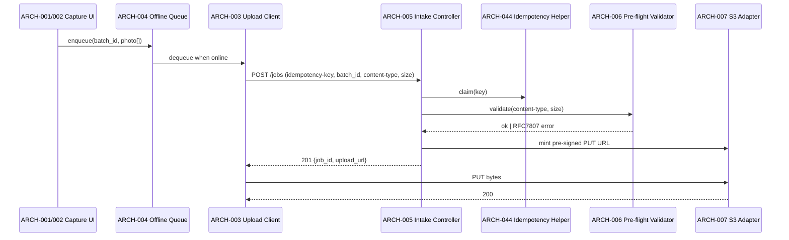
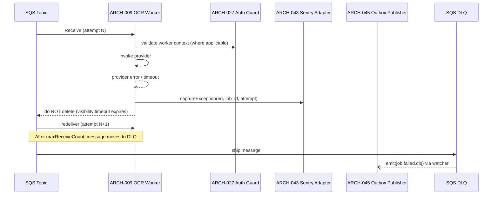
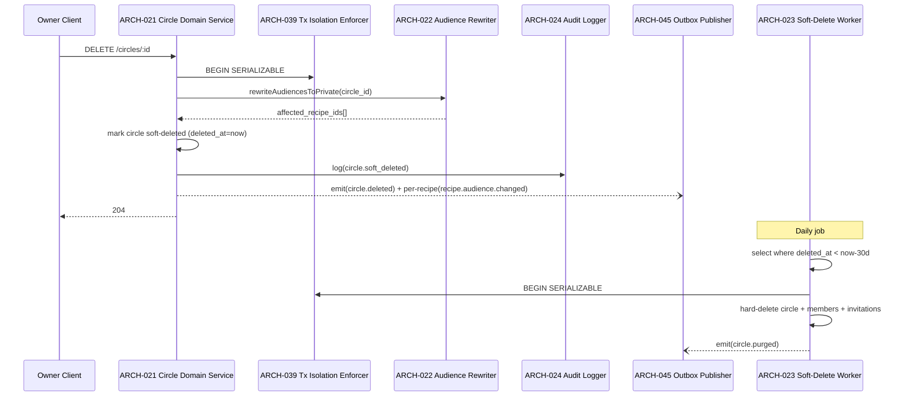

# Architecture Design: Recipe Digitization & Family Circles

**Feature Branch**: `011-recipe-digitization`
**Created**: 2026-05-10
**Status**: Draft
**Source**: `specs/011-recipe-digitization/v-model/system-design.md`

## Overview

Feature 011's architecture decomposes the 32 system components into cohesive, independently testable software modules organized by subsystem boundaries: photo-capture pipeline, OCR worker chain, correction surface, recipe save bridge, circles domain, audience/sharing surface, plus a cross-cutting platform layer (auth, errors, observability, telemetry, governance, CI). Each `ARCH-NNN` is sized for unit + integration testability; subsystems that span both API and UI surface are split into distinct modules to keep interface contracts narrow and to honor monorepo workspace boundaries (`packages/api/*`, `packages/web`, `packages/mobile`, `packages/ui`, `packages/shared/*`). Cross-cutting infrastructure (Auth, error envelope, telemetry, feature flags, governance/CI) is enumerated explicitly with `[CROSS-CUTTING]` parentage so downstream traceability surfaces them as horizontal concerns rather than feature components. All 14 `[FROZEN-PENDING-RESOLUTION]` markers from `system-design.md` are mirrored here as Design Constraints and remain unresolved at this layer.

## ID Schema

- **Architecture Module**: `ARCH-NNN` — sequential identifier for each module, never renumbered.
- **Parent System Components**: comma-separated `SYS-NNN` list per module (many-to-many).
- **Cross-Cutting Tag**: `[CROSS-CUTTING] — <rationale>` for infrastructure/utility modules not traceable to a specific SYS.
- Example: `ARCH-003` with Parent `SYS-001, SYS-009` — module serves both photo capture and correction surfaces.
- Example: `ARCH-027 [CROSS-CUTTING] — request-scoped logger shared by every NestJS handler` — infrastructure module.

## Design Constraints (from FROZEN-PENDING-RESOLUTION markers)

The 14 unresolved markers below are inherited from `requirements.md` via `system-design.md`. Architecture MUST NOT silently resolve them; affected `ARCH-NNN` rows reference the same markers in their descriptions where applicable.

| Frozen ID | Summary                                                                                                                                               |
| --------- | ----------------------------------------------------------------------------------------------------------------------------------------------------- |
| I3        | Auth route-scope wording vs `/api/v1/*` versioning convention conflict — both retained, wording overlap unresolved.                                   |
| G1        | Circle deletion / owner-deletion / soft-delete retention timing semantics unresolved; transactional boundary defined, retention model is a parameter. |
| A1        | Manual OCR quality benchmark formula for canary gates undefined.                                                                                      |
| A2        | OCR p95 cold-start measurement contract preserved; precise cold-start definition open.                                                                |
| I1        | Invitation persistence terminology (`circle_invitations` vs `circle_invites`) MUST be canonicalized before implementation.                            |
| I2        | Invitation persistence naming alias retained pending canonicalization (paired with I1).                                                               |
| C1        | Test file naming convention conflict per Constitution Principle IV — governance owns enforcement once resolved.                                       |
| C2        | Requirement-traceability test header convention conflict per Constitution Principle IV — governance owns enforcement once resolved.                   |
| C3        | Per-PR schema isolation governance unresolved — CI/Infra owns guardrail once resolved.                                                                |
| C4        | `generate:types` ordering governance unresolved — CI/Infra owns ordering once resolved.                                                               |

> Note: `system-design.md` enumerates 10 distinct frozen marker IDs (I1, I2, I3, G1, A1, A2, C1, C2, C3, C4); the "14 markers" count from `requirements.md` reflects per-requirement occurrences. All 10 distinct constraint IDs are listed above and are mirrored on the relevant `ARCH-NNN` descriptions.

## Logical View — Component Breakdown (IEEE 42010 / Kruchten 4+1)

<!--
  Decomposition rules:
  - Every SYS-NNN (001..032) appears as a parent in at least one ARCH-NNN below.
  - Many-to-many is intentional; subsystems span multiple modules and shared modules span multiple subsystems.
  - Cross-cutting modules use [CROSS-CUTTING] — <rationale> instead of SYS parent.
-->

| ARCH ID  | Name                                                    | Description                                                                                                                                                                                                                                           | Parent System Components                                                                                                    | Type      |
| -------- | ------------------------------------------------------- | ----------------------------------------------------------------------------------------------------------------------------------------------------------------------------------------------------------------------------------------------------- | --------------------------------------------------------------------------------------------------------------------------- | --------- |
| ARCH-001 | Capture UI Shell (Web)                                  | Next.js file-picker surface that selects/validates photos client-side, groups into a `batch_id`, and drives upload state.                                                                                                                             | SYS-001                                                                                                                     | Component |
| ARCH-002 | Capture UI Shell (Mobile)                               | Expo camera + library picker surface mirroring web capture flow with native permission handling and offline queue UX.                                                                                                                                 | SYS-001                                                                                                                     | Component |
| ARCH-003 | Pre-signed Upload Client                                | Shared TS client that streams selected photos to S3 PUT URLs returned by the intake API, with retry + idempotency-key handling.                                                                                                                       | SYS-001, SYS-002, SYS-004                                                                                                   | Library   |
| ARCH-004 | Offline Capture Queue                                   | Local-storage / SQLite-backed queue persisting unsent uploads on web and mobile until connectivity returns.                                                                                                                                           | SYS-001                                                                                                                     | Component |
| ARCH-005 | Digitization Job Intake Controller                      | NestJS controller for `POST /api/v1/recipes/digitize/jobs` minting pre-signed URLs, creating `DigitizationJob` rows, and linking `batch_id`. `[FROZEN-PENDING-RESOLUTION: A2]`.                                                                       | SYS-002                                                                                                                     | Service   |
| ARCH-006 | Image Pre-flight Validator                              | Server-side validator enforcing 300×300 px min, 20 MB max, allowed MIME (`jpeg/png/heic`); emits RFC 7807 errors with stable `error_code`.                                                                                                            | SYS-003                                                                                                                     | Module    |
| ARCH-007 | S3 Photo Object Adapter                                 | Per-user-prefixed S3 bucket adapter (write-through pre-signed PUT, CloudFront-fronted GET) honoring 30-day soft-delete retention.                                                                                                                     | SYS-004                                                                                                                     | Adapter   |
| ARCH-008 | OCR Job Dispatcher (SQS Producer)                       | Enqueues digitization jobs onto the OCR SQS topic within 30s of upload commit; supports ≥20 concurrent jobs/user. `[FROZEN-PENDING-RESOLUTION: A2]`.                                                                                                  | SYS-005                                                                                                                     | Service   |
| ARCH-009 | OCR Worker Lambda Runtime                               | Lambda handler consuming SQS messages, invoking the OCR provider, persisting raw + parsed payloads, and emitting completion events; DLQ on sustained failure.                                                                                         | SYS-005                                                                                                                     | Service   |
| ARCH-010 | OcrProvider Interface (`@kitchensink/digitization-ocr`) | Provider-agnostic TS interface defining input shape, token + overall confidence, language code, error taxonomy, and timeout contract.                                                                                                                 | SYS-006                                                                                                                     | Library   |
| ARCH-011 | OCR Provider Adapter (Default)                          | Concrete implementation of `OcrProvider` for the chosen vendor; isolates vendor SDK so future providers can be swapped without touching the worker.                                                                                                   | SYS-006                                                                                                                     | Adapter   |
| ARCH-012 | OCR Parser & Field Normalizer                           | Converts raw provider output into `title`, `ingredients[]`, `steps[]`, `yield`, `prep_time`, `cook_time`; attaches per-token confidence + language code.                                                                                              | SYS-007                                                                                                                     | Module    |
| ARCH-013 | OCR Payload Persistence                                 | Writes `raw_ocr_json` and `parsed_json` to `digitization_jobs` as separate columns; enforces lifetime contract (raw purged at 90d, parsed retained for row lifetime).                                                                                 | SYS-007, SYS-025                                                                                                            | Module    |
| ARCH-014 | Correction API Controller                               | NestJS endpoints `GET/PATCH /api/v1/recipes/digitize/jobs/:id[/correction]` exposing parsed fields and accepting inline edits; transitions state `awaiting-correction → saved`.                                                                       | SYS-008                                                                                                                     | Service   |
| ARCH-015 | Accept-All Eligibility Evaluator                        | Pure function evaluating per-token confidence to determine whether "Accept all" is eligible (no low-confidence tokens) for a given parsed payload.                                                                                                    | SYS-008, SYS-009                                                                                                            | Library   |
| ARCH-016 | Correction UI (Web)                                     | Next.js side-by-side correction surface (photo + parsed fields) with low-confidence token highlighting using icon+label (no color-only signaling).                                                                                                    | SYS-009                                                                                                                     | Component |
| ARCH-017 | Correction UI (Mobile)                                  | Expo side-by-side correction surface mirroring web behavior with native gesture/keyboard support.                                                                                                                                                     | SYS-009                                                                                                                     | Component |
| ARCH-018 | Recipe Save Bridge Controller                           | NestJS endpoint `POST /api/v1/recipes/digitize/jobs/:id/save` creating a `Recipe` and persisting `recipe_id` linkage; transitions job to `saved`.                                                                                                     | SYS-010                                                                                                                     | Service   |
| ARCH-019 | Job Lifecycle Controller                                | NestJS endpoints `DELETE /.../jobs/:id` (soft-delete) and `GET /.../jobs/:id`; surfaces deterministic `job_status` values; honors 30-day soft-delete window.                                                                                          | SYS-011                                                                                                                     | Service   |
| ARCH-020 | Job Listing Controller                                  | NestJS endpoint `GET /api/v1/recipes/digitize/jobs` with cursor pagination (page size 20).                                                                                                                                                            | SYS-012                                                                                                                     | Service   |
| ARCH-021 | Circle Domain Service                                   | NestJS service implementing Circle CRUD, owner-only deletion, owner-deletion ownership-transfer/soft-delete, and 30-day retention/restore. `[FROZEN-PENDING-RESOLUTION: G1, I1, I2]`.                                                                 | SYS-013                                                                                                                     | Service   |
| ARCH-022 | Circle Audience Rewriter                                | Transactional component rewriting matching recipe audiences to `private` during Circle deletion/owner cascade and emitting `circle.deleted` + per-recipe `recipe.audience.changed`. `[FROZEN-PENDING-RESOLUTION: G1]`.                                | SYS-014                                                                                                                     | Module    |
| ARCH-023 | Circle Soft-Delete & Restore Worker                     | Hard-delete worker + restore endpoint implementing 30-day retention path, transition audit events, and owner-deletion fallback when no eligible heir exists. `[FROZEN-PENDING-RESOLUTION: G1]`.                                                       | SYS-015                                                                                                                     | Service   |
| ARCH-024 | Circle Membership Audit Logger                          | Structured-log emitter producing actor/circle/target/action records on every membership state change.                                                                                                                                                 | SYS-016                                                                                                                     | Service   |
| ARCH-025 | Circle Outlier Monitor                                  | Scheduled detection job emitting `circle.size.outlier` warnings when a Circle exceeds 100 members or a user owns ≥25 Circles within 1 hour; no hard caps.                                                                                             | SYS-017                                                                                                                     | Service   |
| ARCH-026 | Circle Invitation Service                               | NestJS endpoints `POST /circles/:id/invitation/rotate` (owner-only) and `POST /circles/join/:token`; one active link per Circle, idempotent redemption, HTTP 410 with `circle.invitation.revoked` on rotation. `[FROZEN-PENDING-RESOLUTION: I1, I2]`. | SYS-018                                                                                                                     | Service   |
| ARCH-027 | Auth0 Bearer Authenticator (NestJS Guard)               | Cross-cutting guard enforcing Auth0 bearer authentication on every 011 API endpoint. `[FROZEN-PENDING-RESOLUTION: I3]`.                                                                                                                               | SYS-019                                                                                                                     | Service   |
| ARCH-028 | RFC 7807 Error Envelope Filter                          | Cross-cutting Nest exception filter returning Problem Details with machine-readable `error_code` for all 4xx/5xx responses.                                                                                                                           | SYS-020                                                                                                                     | Library   |
| ARCH-029 | `@kitchensink/shared-audience` Library                  | Shared TS package exporting `AudienceScope` (`private`, `circle`, `public-profile`, `published-lesson`) and `Audience` (`ref_id?`, `price_cents?`) for downstream features 001/006/007.                                                               | SYS-021                                                                                                                     | Library   |
| ARCH-030 | API Versioning Convention Module                        | `/api/v1/*` routing convention enforced via NestJS global prefix + route-prefix lint; pairs with Node 24.x runtime conformance check. `[FROZEN-PENDING-RESOLUTION: I3]`.                                                                              | SYS-022                                                                                                                     | Module    |
| ARCH-031 | Audience Resolution Fallback                            | Consumer-facing audience resolver excluding `circle` scope when circles service is unavailable; surfaces a temporary-unavailability path without data leakage.                                                                                        | SYS-023                                                                                                                     | Module    |
| ARCH-032 | Invitation Acceptance UI (Accessibility Surface)        | Web + mobile invitation acceptance flow navigable via screen reader and keyboard, conforming to WCAG 2.1 AA.                                                                                                                                          | SYS-024                                                                                                                     | Component |
| ARCH-033 | `raw_ocr_json` Privacy Purge Job                        | Daily scheduled purge deleting `digitization_jobs.raw_ocr_json` values older than 90 days; emits `digitization.raw_ocr.purged.count` when eligible records exist.                                                                                     | SYS-025                                                                                                                     | Service   |
| ARCH-034 | Observability & Telemetry Pipeline                      | Cross-cutting metrics/log/alarm wiring supporting OCR latency p95, queue depth/DLQ alarms, audit sinks, and outlier-monitor outputs. `[FROZEN-PENDING-RESOLUTION: A2]`.                                                                               | SYS-026                                                                                                                     | Service   |
| ARCH-035 | Release Readiness & Canary Gate Controller              | Owns canary promotion ladder (1%→10%→50%→100%) and rollback gates tied to OCR latency, DLQ health, accessibility severity, and manual OCR quality benchmark. `[FROZEN-PENDING-RESOLUTION: A1]`.                                                       | SYS-027                                                                                                                     | Service   |
| ARCH-036 | Feature Flag Gateway Client                             | Flag client gating `digitization.enabled` and `circles.enabled` across APIs and web/mobile entry points; production default OFF, dev/preview default ON.                                                                                              | SYS-028                                                                                                                     | Service   |
| ARCH-037 | Test Convention Governance Linter                       | ESLint/lint plugin enforcing test file naming + requirement-traceability header comments per Constitution Principle IV. `[FROZEN-PENDING-RESOLUTION: C1, C2]`.                                                                                        | SYS-029                                                                                                                     | Module    |
| ARCH-038 | Workspace & CI Guardrails                               | CI checks enforcing workspace registration for `packages/api/*` and `packages/shared/*` (with required TS project references), per-PR schema isolation, and `generate:types` ordering before any test task. `[FROZEN-PENDING-RESOLUTION: C3, C4]`.    | SYS-030                                                                                                                     | Module    |
| ARCH-039 | Transactional Isolation Enforcer                        | Persistence guideline + runtime check that Circle deletion / owner-deletion critical paths run under SERIALIZABLE or REPEATABLE READ + `SELECT ... FOR UPDATE`.                                                                                       | SYS-031                                                                                                                     | Module    |
| ARCH-040 | UI Primitive Reuse Inspection                           | Process artifact + lint inspection ensuring `packages/ui` primitives are evaluated first for frontend tasks T057–T067; new primitives require documented rationale.                                                                                   | SYS-032                                                                                                                     | Module    |
| ARCH-041 | Request-Scoped Logger                                   | Structured logger (`@aws-lambda-powertools/logger`-style) attached per request/job for consistent context propagation across handlers and workers.                                                                                                    | [CROSS-CUTTING] — shared infrastructure used by every NestJS handler, Lambda worker, and scheduled job for log correlation. | Utility   |
| ARCH-042 | Configuration & Secrets Loader                          | `@nestjs/config` + Zod schema loader exposing typed config (S3 bucket, SQS URL, Auth0 audience, flag client keys) to all modules.                                                                                                                     | [CROSS-CUTTING] — shared infrastructure consumed by every API and worker module; not traceable to a specific SYS.           | Utility   |
| ARCH-043 | Sentry Integration Adapter                              | `@sentry/aws-serverless` + Nest adapter capturing unhandled exceptions and performance traces across API, workers, and scheduled jobs.                                                                                                                | [CROSS-CUTTING] — error reporting consumed horizontally; complements SYS-026 telemetry but is not the metrics pipeline.     | Adapter   |
| ARCH-044 | Idempotency Key Helper                                  | Shared helper enforcing idempotency-key semantics on retry-prone POSTs (intake, save, invitation rotation, redemption).                                                                                                                               | [CROSS-CUTTING] — used by multiple controllers (ARCH-005, ARCH-018, ARCH-026); not owned by a single SYS.                   | Library   |
| ARCH-045 | Outbox / Domain Event Publisher                         | Transactional outbox pattern publishing domain events (`circle.deleted`, `recipe.audience.changed`, `circle.invitation.revoked`, `digitization.raw_ocr.purged.count`) atomically with their DB writes.                                                | [CROSS-CUTTING] — event-emission infrastructure used by ARCH-022, ARCH-023, ARCH-026, ARCH-033; not a feature component.    | Service   |
| ARCH-046 | OpenTelemetry Tracing Bootstrap                         | Process-level OTel tracer bootstrap providing distributed-tracing context across API → SQS → Lambda → DB.                                                                                                                                             | [CROSS-CUTTING] — tracing scaffolding consumed by every module; complements SYS-026 metrics without duplicating it.         | Utility   |
| ARCH-047 | Drizzle ORM Persistence Context                         | Shared Drizzle client + transaction helper providing typed access to `digitization_jobs`, `circles`, `circle_members`, `circle_invitations` (alias-pending per I1/I2), and audit tables.                                                              | [CROSS-CUTTING] — persistence infrastructure used by every API service and worker.                                          | Adapter   |

## Process View — Dynamic Behavior (Kruchten 4+1)

This section documents the runtime interaction paths that bind the Logical View modules together. Each diagram lists ARCH-NNN modules as participants and uses `->>` for synchronous calls, `-->>` for asynchronous responses/replies, and `--)` for fire-and-forget event publication.

### Photo Capture → Pre-signed Upload → Job Intake



**Concurrency Model**: Many capture clients in parallel; intake controller is stateless and horizontally scaled; uploads to S3 happen client-direct (no server-side bytes).
**Synchronization Points**: Idempotency-key claim before DB row insert; client MUST receive 201 before initiating S3 PUT.

### OCR Worker Dispatch → Provider Call → Parse → Persist

```mermaid
sequenceDiagram
    participant Disp as ARCH-008 OCR Dispatcher
    participant SQS as SQS Topic
    participant Wrk as ARCH-009 OCR Worker Lambda
    participant Iface as ARCH-010 OcrProvider Interface
    participant Adp as ARCH-011 Provider Adapter
    participant Par as ARCH-012 Parser/Normalizer
    participant Per as ARCH-013 Payload Persistence
    participant Out as ARCH-045 Outbox Publisher
    participant OTel as ARCH-046 OTel Tracer

    Disp->>SQS: SendMessage(job_id)
    SQS->>Wrk: Receive (visibility=300s)
    Wrk->>OTel: start span(job_id)
    Wrk->>Iface: ocr(image_ref)
    Iface->>Adp: invoke vendor SDK
    Adp-->>Iface: raw_ocr_json
    Iface-->>Wrk: raw_ocr_json
    Wrk->>Par: parse(raw_ocr_json)
    Par-->>Wrk: parsed_json + per-token confidence
    Wrk->>Per: persist(raw_ocr_json, parsed_json)
    Per--)Out: emit(job.parsed)
    Wrk-->>SQS: DeleteMessage
```

**Concurrency Model**: SQS fan-out to Lambda with reserved concurrency; ≥20 concurrent jobs/user supported; one message per job, at-least-once delivery.
**Synchronization Points**: Persistence write MUST commit before message delete; outbox emission is co-transactional with persistence row.

### Correction Flow: GET correction → user edits → PATCH → Save Recipe

```mermaid
sequenceDiagram
    participant UI as ARCH-016/017 Correction UI
    participant Corr as ARCH-014 Correction Controller
    participant Eval as ARCH-015 Accept-All Evaluator
    participant Save as ARCH-018 Save Bridge
    participant DB as ARCH-047 Drizzle Context

    UI->>Corr: GET /jobs/:id/correction
    Corr->>DB: select parsed_json + confidence
    DB-->>Corr: payload
    Corr->>Eval: evaluate(payload)
    Eval-->>Corr: accept_all_eligible: bool
    Corr-->>UI: 200 {fields, confidence, accept_all_eligible}
    UI->>Corr: PATCH /jobs/:id/correction (edits)
    Corr->>DB: update parsed_json, state=awaiting-correction
    UI->>Save: POST /jobs/:id/save
    Save->>DB: BEGIN; insert recipe; update job recipe_id, state=saved; COMMIT
    Save-->>UI: 201 {recipe_id}
```

**Concurrency Model**: Single-user-per-job edit session; optimistic concurrency via row version on `digitization_jobs`; recipe creation is per-request transactional.
**Synchronization Points**: PATCH MUST precede save; save transaction commits recipe + job linkage atomically.

### Failure / Retry / DLQ Path



**Concurrency Model**: At-least-once SQS redelivery with exponential backoff; DLQ alarms wired through observability pipeline (ARCH-034).
**Synchronization Points**: Sentry capture happens before message-visibility expiry; DLQ event is emitted by a separate watcher after redrive cap.

### Circle Share / Invite Flow

```mermaid
sequenceDiagram
    participant Owner as Owner Client
    participant Auth as ARCH-027 Auth Guard
    participant Inv as ARCH-026 Invitation Service
    participant Circ as ARCH-021 Circle Domain Service
    participant Aud as ARCH-024 Membership Audit Logger
    participant Invitee as Invitee Client
    participant Acc as ARCH-032 Acceptance UI
    participant Out as ARCH-045 Outbox Publisher

    Owner->>Auth: bearer token
    Auth-->>Owner: ok
    Owner->>Inv: POST /circles/:id/invitation/rotate
    Inv->>Circ: assertOwner(circle_id, user_id)
    Inv->>Inv: revoke prior token; mint new token
    Inv--)Out: emit(circle.invitation.revoked) for prior
    Inv-->>Owner: 200 {invite_url}
    Invitee->>Acc: open invite_url
    Acc->>Inv: POST /circles/join/:token
    Inv->>Circ: addMember(circle_id, user_id)  [idempotent]
    Circ->>Aud: log(actor, circle, target, action=join)
    Inv-->>Acc: 200 {circle_id}
```

**Concurrency Model**: Exactly one active invitation token per Circle (DB unique index); join is idempotent on (circle_id, user_id).
**Synchronization Points**: Token rotation revokes prior atomically with mint; rotated tokens return HTTP 410 `circle.invitation.revoked`.

### Soft-delete + 30-Day Archival Sweep



**Concurrency Model**: Soft-delete and sweep both run under SERIALIZABLE isolation per ARCH-039; sweep is single-instance scheduled (not fanned out).
**Synchronization Points**: Audience rewrite, soft-delete mark, audit log, and outbox emission share one transaction; sweep hard-delete shares one transaction with outbox emission.

### Concurrency & Threading Summary

- **Lambda fan-out**: OCR worker (ARCH-009) scales horizontally via SQS reserved concurrency; per-user concurrency target is ≥20 jobs without head-of-line blocking.
- **SQS visibility & at-least-once**: Workers MUST be idempotent on `job_id`; visibility timeout is sized > p99 OCR latency; DLQ catches messages exceeding `maxReceiveCount`.
- **Idempotency keys**: ARCH-044 protects retry-prone POSTs (job intake, save, invitation rotate/redeem) so client retries are safe regardless of network partition.
- **Transactional outbox**: ARCH-045 co-commits domain events with their writes (Circle delete cascade, raw-OCR purge counts, invitation revocation, recipe audience change), eliminating dual-write inconsistency.
- **Critical-path isolation**: Circle deletion and owner-deletion paths run under SERIALIZABLE (or REPEATABLE READ + `SELECT ... FOR UPDATE`) per ARCH-039 to preserve the audience-rewrite invariant.
- **Tracing & error capture**: ARCH-046 propagates trace context across API → SQS → Lambda → DB; ARCH-043 captures unhandled exceptions in every runtime so retries and DLQ moves are observable end-to-end.

## Interface View — API Contracts (Kruchten 4+1)

This section enumerates the input/output/exception contract for each ARCH module in the range ARCH-001..ARCH-024. Contracts use NestJS DTO conventions, Drizzle entity names from `packages/api/src/schema/*`, S3 object keys, SQS message shapes, REST routes prefixed `/api/v1/*`, and RFC 7807 `application/problem+json` for error envelopes. Frozen markers from `system-design.md` are echoed inline where they affect contract surface.

### ARCH-001: Capture UI Shell (Web)

| Direction | Name              | Type            | Format                                                   | Constraints                             |
| --------- | ----------------- | --------------- | -------------------------------------------------------- | --------------------------------------- |
| Input     | Selected files    | `File[]`        | Browser File API                                         | jpeg/png/heic; ≤20 MB each; ≥300×300 px |
| Input     | Active session    | `Auth0Session`  | `@auth0/nextjs-auth0` cookie                             | Required to render capture surface      |
| Output    | Upload request    | `UploadIntent`  | `{ batch_id: uuid, items: { client_id, mime, size }[] }` | Forwarded to ARCH-003                   |
| Exception | Permission denied | UI banner       | n/a                                                      | File picker cancelled or blocked        |
| Exception | Validation error  | UI inline error | n/a                                                      | Pre-flight client check failed          |

### ARCH-002: Capture UI Shell (Mobile)

| Direction | Name                 | Type                      | Format                     | Constraints                      |
| --------- | -------------------- | ------------------------- | -------------------------- | -------------------------------- |
| Input     | Camera/library asset | `ImagePickerAsset` (Expo) | uri + exif                 | Native permission grant required |
| Input     | Active session       | `Auth0Credentials`        | `react-native-auth0` token | Stored via `expo-secure-store`   |
| Output    | Upload request       | `UploadIntent`            | Same as ARCH-001           | Shared shape across web/mobile   |
| Exception | Permission denied    | Native alert              | n/a                        | OS-level permission rejection    |
| Exception | Asset too large      | UI inline error           | n/a                        | Pre-flight client check failed   |

### ARCH-003: Pre-signed Upload Client

| Direction | Name              | Type            | Format                         | Constraints                                       |
| --------- | ----------------- | --------------- | ------------------------------ | ------------------------------------------------- |
| Input     | UploadIntent      | `UploadIntent`  | TS interface from ARCH-001/002 | Source of truth for batch grouping                |
| Input     | Pre-signed URL    | `string`        | HTTPS S3 PUT URL               | TTL ≤ 15 min                                      |
| Output    | S3 PUT result     | `{ etag, key }` | S3 response headers            | Reported back to capture UI                       |
| Exception | NetworkError      | thrown error    | n/a                            | Retried with exponential backoff (max 5 attempts) |
| Exception | 4xx upload reject | thrown error    | n/a                            | Surfaced to user; no retry                        |

### ARCH-004: Offline Capture Queue

| Direction | Name                 | Type             | Format                              | Constraints                                    |
| --------- | -------------------- | ---------------- | ----------------------------------- | ---------------------------------------------- |
| Input     | Enqueue payload      | `QueuedUpload`   | `{ batch_id, asset_ref, attempts }` | Persisted in IndexedDB (web) / SQLite (mobile) |
| Output    | Drain trigger        | `QueuedUpload[]` | TS array                            | Emitted on connectivity-restored event         |
| Output    | Queue depth          | `number`         | counter                             | Surfaced to capture UI status indicator        |
| Exception | StorageQuotaExceeded | thrown error     | n/a                                 | Drops oldest unsent items; surfaces toast      |

### ARCH-005: Digitization Job Intake Controller

| Direction | Name                     | Type                                 | Format                                                                                    | Constraints                                                                 |
| --------- | ------------------------ | ------------------------------------ | ----------------------------------------------------------------------------------------- | --------------------------------------------------------------------------- |
| Input     | HTTP request             | `POST /api/v1/recipes/digitize/jobs` | `application/json` body `{ batch_id, items: { mime, size }[] }`, header `Idempotency-Key` | Auth0 bearer required; `[FROZEN-PENDING-RESOLUTION: A2]` (latency contract) |
| Input     | Authenticated user       | `RequestUser`                        | NestJS request-scoped DTO                                                                 | Injected via ARCH-027 guard                                                 |
| Output    | 201 response             | `JobIntakeResponse`                  | `{ job_id: uuid, batch_id: uuid, upload_url: string, expires_at: ISO8601 }[]`             | Pre-signed URL TTL ≤ 15 min                                                 |
| Exception | 400 validation           | `Problem`                            | RFC 7807 `application/problem+json` with `error_code`                                     | Delegated to ARCH-006/028                                                   |
| Exception | 401 unauthorized         | `Problem`                            | RFC 7807                                                                                  | Emitted by ARCH-027                                                         |
| Exception | 409 idempotency conflict | `Problem`                            | RFC 7807                                                                                  | Same key, different payload                                                 |

### ARCH-006: Image Pre-flight Validator

| Direction | Name                | Type                                                    | Format                                                | Constraints                          |
| --------- | ------------------- | ------------------------------------------------------- | ----------------------------------------------------- | ------------------------------------ |
| Input     | Item descriptor     | `{ mime: string, size: number, dimensions?: { w, h } }` | TS interface                                          | Called inside ARCH-005 request scope |
| Output    | Validation result   | `ValidationOk \| ValidationError[]`                     | TS discriminated union                                | Synchronous, blocking ≤10ms          |
| Exception | UnsupportedMimeType | `ValidationError`                                       | `error_code: digitization.image.unsupported_mime`     | Allowed: jpeg/png/heic               |
| Exception | FileTooLarge        | `ValidationError`                                       | `error_code: digitization.image.too_large`            | Max 20 MB                            |
| Exception | DimensionsTooSmall  | `ValidationError`                                       | `error_code: digitization.image.dimensions_too_small` | Min 300×300 px                       |

### ARCH-007: S3 Photo Object Adapter

| Direction | Name           | Type           | Format                      | Constraints                                                          |
| --------- | -------------- | -------------- | --------------------------- | -------------------------------------------------------------------- |
| Input     | Mint PUT URL   | `MintPutInput` | `{ user_id, job_id, mime }` | Generates key `users/{user_id}/digitization/{job_id}/original.{ext}` |
| Input     | Get object ref | `S3ObjectKey`  | string                      | Returns CloudFront URL for read                                      |
| Output    | Pre-signed URL | `string`       | HTTPS                       | TTL ≤ 15 min                                                         |
| Output    | CloudFront URL | `string`       | HTTPS                       | Per-user-prefix isolated                                             |
| Exception | S3ServiceError | thrown error   | AWS SDK error               | Bubbles to ARCH-028; intake returns 502                              |

### ARCH-008: OCR Job Dispatcher (SQS Producer)

| Direction | Name              | Type                       | Format                                                      | Constraints                             |
| --------- | ----------------- | -------------------------- | ----------------------------------------------------------- | --------------------------------------- |
| Input     | Job intake commit | DB row event from ARCH-005 | `digitization_jobs.id`, `state=pending`                     | Triggered post-commit                   |
| Output    | SQS message       | `OcrJobMessage`            | JSON `{ job_id, user_id, s3_key, attempt: 1, traceparent }` | Enqueued within 30s of upload commit    |
| Exception | SqsServiceError   | thrown error               | AWS SDK error                                               | Logged via ARCH-041; retried via outbox |

### ARCH-009: OCR Worker Lambda Runtime

| Direction | Name               | Type                           | Format                                                     | Constraints                                 |
| --------- | ------------------ | ------------------------------ | ---------------------------------------------------------- | ------------------------------------------- |
| Input     | SQS event          | `SQSEvent`                     | AWS Lambda event                                           | Visibility timeout > p99 OCR latency        |
| Input     | Image bytes        | `Buffer`                       | binary                                                     | Fetched via ARCH-007                        |
| Output    | Persistence write  | `digitization_jobs` row update | `raw_ocr_json`, `parsed_json`, `state=awaiting-correction` | Co-transactional with outbox                |
| Exception | OcrProviderTimeout | thrown error                   | n/a                                                        | Triggers SQS visibility expiry → redelivery |
| Exception | DLQ shipment       | SQS DLQ message                | original payload + attempt counter                         | After `maxReceiveCount`                     |

### ARCH-010: OcrProvider Interface (`@kitchensink/digitization-ocr`)

| Direction | Name               | Type        | Format                                                                                                 | Constraints                      |
| --------- | ------------------ | ----------- | ------------------------------------------------------------------------------------------------------ | -------------------------------- |
| Input     | OCR request        | `OcrInput`  | `{ image: Buffer, mime: string, hints?: { language?: string } }`                                       | Async, blocking ≤ provider SLA   |
| Output    | OCR result         | `OcrResult` | `{ raw: unknown, tokens: { text, bbox, confidence }[], overall_confidence: number, language: string }` | Confidence in [0..1]             |
| Exception | `OcrProviderError` | typed error | `{ code: 'timeout' \| 'rate_limited' \| 'invalid_image' \| 'service' }`                                | Stable taxonomy across providers |

### ARCH-011: OCR Provider Adapter (Default)

| Direction | Name               | Type                         | Format                  | Constraints                               |
| --------- | ------------------ | ---------------------------- | ----------------------- | ----------------------------------------- |
| Input     | OcrInput           | `OcrInput`                   | inherited from ARCH-010 | Implements `OcrProvider`                  |
| Input     | Vendor credentials | `OcrAdapterConfig`           | injected via ARCH-042   | No credentials in source                  |
| Output    | OcrResult          | `OcrResult`                  | inherited from ARCH-010 | Vendor-specific raw is preserved verbatim |
| Exception | Vendor SDK error   | mapped to `OcrProviderError` | n/a                     | Mapping table maintained in adapter       |

### ARCH-012: OCR Parser & Field Normalizer

| Direction | Name          | Type                                                                                                                      | Format                                       | Constraints                                             |
| --------- | ------------- | ------------------------------------------------------------------------------------------------------------------------- | -------------------------------------------- | ------------------------------------------------------- |
| Input     | OcrResult     | `OcrResult`                                                                                                               | from ARCH-010                                | Pure function, no I/O                                   |
| Output    | ParsedRecipe  | `{ title, ingredients: { text, confidence }[], steps: { text, confidence }[], yield?, prep_time?, cook_time?, language }` | TS interface; per-token confidence preserved |
| Exception | ParseDegraded | partial result + warnings                                                                                                 | n/a                                          | Returned with state `awaiting-correction`; never throws |

### ARCH-013: OCR Payload Persistence

| Direction | Name                     | Type                                                  | Format                      | Constraints                                                          |
| --------- | ------------------------ | ----------------------------------------------------- | --------------------------- | -------------------------------------------------------------------- |
| Input     | Persist payload          | `{ job_id, raw_ocr_json: jsonb, parsed_json: jsonb }` | TS interface                | Drizzle update inside ARCH-009 transaction                           |
| Output    | Updated row              | `DigitizationJob` (Drizzle entity)                    | `state=awaiting-correction` | Lifetime: raw purged at 90d (ARCH-033), parsed kept for row lifetime |
| Exception | UniqueViolation on retry | DB error                                              | n/a                         | Idempotent on `job_id`; second commit no-ops                         |

### ARCH-014: Correction API Controller

| Direction | Name               | Type                                                 | Format                                                                             | Constraints                                        |
| --------- | ------------------ | ---------------------------------------------------- | ---------------------------------------------------------------------------------- | -------------------------------------------------- |
| Input     | GET request        | `GET /api/v1/recipes/digitize/jobs/:id/correction`   | path param `id`                                                                    | Auth0 bearer required                              |
| Input     | PATCH request      | `PATCH /api/v1/recipes/digitize/jobs/:id/correction` | `application/json` `{ fields: ParsedRecipe, accept_all?: boolean }`                | Owner-only; optimistic concurrency via row version |
| Output    | 200 GET response   | `CorrectionView`                                     | `{ job_id, photo_url, fields: ParsedRecipe, accept_all_eligible: boolean, state }` | Combines ARCH-007 + ARCH-013                       |
| Output    | 200 PATCH response | `CorrectionView`                                     | updated state                                                                      | `state=awaiting-correction` until save             |
| Exception | 404 not found      | `Problem`                                            | RFC 7807                                                                           | Job missing or not owned                           |
| Exception | 409 stale row      | `Problem`                                            | RFC 7807                                                                           | Concurrent edit                                    |

### ARCH-015: Accept-All Eligibility Evaluator

| Direction | Name             | Type                               | Format        | Constraints                           |
| --------- | ---------------- | ---------------------------------- | ------------- | ------------------------------------- |
| Input     | ParsedRecipe     | `ParsedRecipe`                     | from ARCH-012 | Pure function, no I/O                 |
| Input     | Threshold config | `{ low_confidence_below: number }` | from ARCH-042 | Default 0.6                           |
| Output    | Eligibility      | `boolean`                          | n/a           | True only if no token below threshold |
| Exception | n/a              | n/a                                | n/a           | Total function — never throws         |

### ARCH-016: Correction UI (Web)

| Direction | Name                | Type                                             | Format            | Constraints                     |
| --------- | ------------------- | ------------------------------------------------ | ----------------- | ------------------------------- |
| Input     | CorrectionView      | `CorrectionView`                                 | from ARCH-014 GET | TanStack Query cached           |
| Output    | PATCH payload       | `{ fields: ParsedRecipe, accept_all?: boolean }` | TS DTO            | Sent to ARCH-014                |
| Output    | Save trigger        | `POST /jobs/:id/save`                            | n/a               | Sent to ARCH-018                |
| Exception | NetworkError        | UI toast                                         | n/a               | Retries via TanStack Query      |
| Exception | Validation conflict | inline error                                     | n/a               | Surfaced from RFC 7807 response |

### ARCH-017: Correction UI (Mobile)

| Direction | Name                | Type             | Format            | Constraints                                |
| --------- | ------------------- | ---------------- | ----------------- | ------------------------------------------ |
| Input     | CorrectionView      | `CorrectionView` | from ARCH-014 GET | Reanimated v4 transitions; gesture support |
| Output    | PATCH payload       | same as ARCH-016 | TS DTO            | Sent to ARCH-014                           |
| Output    | Save trigger        | same as ARCH-016 | n/a               | Sent to ARCH-018                           |
| Exception | NetworkError        | UI snackbar      | n/a               | Offline edits cached locally then retried  |
| Exception | Validation conflict | inline error     | n/a               | Surfaced from RFC 7807 response            |

### ARCH-018: Recipe Save Bridge Controller

| Direction | Name              | Type                                                | Format                               | Constraints                                             |
| --------- | ----------------- | --------------------------------------------------- | ------------------------------------ | ------------------------------------------------------- |
| Input     | HTTP request      | `POST /api/v1/recipes/digitize/jobs/:id/save`       | empty body; header `Idempotency-Key` | Auth0 bearer; owner-only                                |
| Output    | 201 response      | `{ recipe_id: uuid, job_id: uuid, state: 'saved' }` | JSON                                 | Recipe row created + job linkage in one tx              |
| Exception | 404 not found     | `Problem`                                           | RFC 7807                             | Job missing                                             |
| Exception | 409 already saved | `Problem`                                           | RFC 7807                             | `state=saved` already set; returns existing `recipe_id` |
| Exception | 422 not ready     | `Problem`                                           | RFC 7807                             | Job not in `awaiting-correction`                        |

### ARCH-019: Job Lifecycle Controller

| Direction | Name                | Type                                       | Format                                                   | Constraints                                    |
| --------- | ------------------- | ------------------------------------------ | -------------------------------------------------------- | ---------------------------------------------- |
| Input     | DELETE request      | `DELETE /api/v1/recipes/digitize/jobs/:id` | path param                                               | Soft-delete; 30-day retention window           |
| Input     | GET request         | `GET /api/v1/recipes/digitize/jobs/:id`    | path param                                               | Returns deterministic `job_status`             |
| Output    | 204 DELETE response | empty                                      | n/a                                                      | Marks `deleted_at=now`; S3 object retained 30d |
| Output    | 200 GET response    | `JobStatusView`                            | `{ job_id, state, created_at, updated_at, deleted_at? }` | Used by queue UX                               |
| Exception | 404 not found       | `Problem`                                  | RFC 7807                                                 | Owner mismatch or hard-deleted                 |
| Exception | 410 gone            | `Problem`                                  | RFC 7807                                                 | Past 30-day window                             |

### ARCH-020: Job Listing Controller

| Direction | Name               | Type                                               | Format       | Constraints                                                |
| --------- | ------------------ | -------------------------------------------------- | ------------ | ---------------------------------------------------------- |
| Input     | GET request        | `GET /api/v1/recipes/digitize/jobs?cursor=&limit=` | query params | Auth0 bearer; default limit=20                             |
| Output    | 200 response       | `{ items: JobStatusView[], next_cursor?: string }` | JSON         | Cursor-paginated; deterministic order by `created_at desc` |
| Exception | 400 invalid cursor | `Problem`                                          | RFC 7807     | Cursor cannot be decoded                                   |
| Exception | 401 unauthorized   | `Problem`                                          | RFC 7807     | From ARCH-027                                              |

### ARCH-021: Circle Domain Service

| Direction | Name                    | Type                                                 | Format                                                          | Constraints                                                        |
| --------- | ----------------------- | ---------------------------------------------------- | --------------------------------------------------------------- | ------------------------------------------------------------------ |
| Input     | CRUD requests           | `POST/GET/PATCH/DELETE /api/v1/circles[/:id]`        | NestJS DTOs                                                     | Owner-only mutating ops; `[FROZEN-PENDING-RESOLUTION: G1, I1, I2]` |
| Input     | Member ops              | `POST/DELETE /api/v1/circles/:id/members/:user_id`   | DTO                                                             | Owner-only; idempotent                                             |
| Output    | Circle resource         | `CircleView`                                         | `{ id, name, owner_id, member_count, created_at, deleted_at? }` | Derived from `circles` + `circle_members`                          |
| Output    | Domain events           | `circle.created \| circle.updated \| circle.deleted` | via ARCH-045 outbox                                             | Co-transactional                                                   |
| Exception | 403 not owner           | `Problem`                                            | RFC 7807                                                        | Mutating op by non-owner                                           |
| Exception | 404 not found           | `Problem`                                            | RFC 7807                                                        | Circle missing or hard-deleted                                     |
| Exception | 409 invariant violation | `Problem`                                            | RFC 7807                                                        | E.g., last-owner removal without heir                              |

### ARCH-022: Circle Audience Rewriter

| Direction | Name                 | Type                                                             | Format                  | Constraints                                                                           |
| --------- | -------------------- | ---------------------------------------------------------------- | ----------------------- | ------------------------------------------------------------------------------------- |
| Input     | Rewrite request      | `{ circle_id: uuid, tx: DrizzleTx }`                             | TS interface            | Called from ARCH-021/023 within active transaction; `[FROZEN-PENDING-RESOLUTION: G1]` |
| Output    | Affected recipes     | `{ affected_recipe_ids: uuid[] }`                                | TS interface            | Drives event fan-out                                                                  |
| Output    | Domain events        | `recipe.audience.changed` (per recipe) + `circle.deleted` (once) | via ARCH-045            | Same transaction                                                                      |
| Exception | SerializationFailure | DB error                                                         | Postgres SQLSTATE 40001 | Caller retries entire transaction                                                     |

### ARCH-023: Circle Soft-Delete & Restore Worker

| Direction | Name               | Type                               | Format            | Constraints                                                                                |
| --------- | ------------------ | ---------------------------------- | ----------------- | ------------------------------------------------------------------------------------------ |
| Input     | Scheduled trigger  | EventBridge cron                   | daily             | Selects `where deleted_at < now() - interval '30 days'`; `[FROZEN-PENDING-RESOLUTION: G1]` |
| Input     | Restore request    | `POST /api/v1/circles/:id/restore` | empty body        | Owner-only; only valid within retention window                                             |
| Output    | Hard-delete result | `{ purged_count: number }`         | log line + metric | Emits `circle.purged` per circle                                                           |
| Output    | Restore response   | `CircleView`                       | JSON              | Clears `deleted_at`; emits `circle.restored`                                               |
| Exception | 410 gone           | `Problem`                          | RFC 7807          | Restore attempted past retention window                                                    |

### ARCH-024: Circle Membership Audit Logger

| Direction | Name              | Type                                     | Format                                                                                                                                       | Constraints                            |
| --------- | ----------------- | ---------------------------------------- | -------------------------------------------------------------------------------------------------------------------------------------------- | -------------------------------------- |
| Input     | Audit event       | `MembershipAuditEvent`                   | `{ actor_id, circle_id, target_user_id, action: 'join' \| 'leave' \| 'remove' \| 'transfer_ownership' \| 'soft_deleted' \| 'restored', ts }` | Synchronous structured log             |
| Output    | Log record        | JSON line                                | stdout (CloudWatch capture)                                                                                                                  | Schema-stable for downstream ingestion |
| Output    | Metric            | `circle.membership.events.count{action}` | counter                                                                                                                                      | Async fire-and-forget via ARCH-034     |
| Exception | LoggerUnavailable | swallowed + retried in-memory            | n/a                                                                                                                                          | Never blocks calling transaction       |

### ARCH-025: Circle Outlier Monitor

| Direction | Name              | Type                             | Format                                                                                      | Constraints                                        |
| --------- | ----------------- | -------------------------------- | ------------------------------------------------------------------------------------------- | -------------------------------------------------- |
| Input     | Scheduled trigger | EventBridge cron                 | hourly                                                                                      | Reads `circles` + `circle_members` aggregates      |
| Output    | Outlier event     | `circle.size.outlier`            | `{ kind: 'circle_member_count' \| 'user_owned_circles', subject_id, value, threshold, ts }` | Async fire-and-forget via ARCH-045                 |
| Output    | Metric            | `circle.outliers.detected{kind}` | counter                                                                                     | Emitted to ARCH-034                                |
| Exception | DbQueryTimeout    | logged + retried next interval   | n/a                                                                                         | No hard caps enforced — detection is advisory only |

### ARCH-026: Circle Invitation Service

| Direction | Name                | Type                                         | Format                                           | Constraints                                                 |
| --------- | ------------------- | -------------------------------------------- | ------------------------------------------------ | ----------------------------------------------------------- |
| Input     | Rotate request      | `POST /api/v1/circles/:id/invitation/rotate` | empty body; header `Idempotency-Key`             | Owner-only; `[FROZEN-PENDING-RESOLUTION: I1, I2]`           |
| Input     | Redeem request      | `POST /api/v1/circles/join/:token`           | path token                                       | Auth0 bearer required; idempotent on `(circle_id, user_id)` |
| Output    | 200 rotate response | `{ invite_url: string, token_id: uuid }`     | JSON                                             | Exactly one active token per circle (DB unique index)       |
| Output    | 200 redeem response | `{ circle_id: uuid }`                        | JSON                                             | Triggers ARCH-024 audit `action=join`                       |
| Exception | 410 gone            | `Problem`                                    | RFC 7807 `error_code: circle.invitation.revoked` | Token was rotated                                           |
| Exception | 403 not owner       | `Problem`                                    | RFC 7807                                         | Rotate by non-owner                                         |
| Exception | 404 not found       | `Problem`                                    | RFC 7807                                         | Token never existed                                         |

### ARCH-027: Auth0 Bearer Authenticator (NestJS Guard)

| Direction | Name                      | Type               | Format                                              | Constraints                                                        |
| --------- | ------------------------- | ------------------ | --------------------------------------------------- | ------------------------------------------------------------------ |
| Input     | HTTP request              | `Request` (NestJS) | Header `Authorization: Bearer <jwt>`                | Applied globally to `/api/v1/*`; `[FROZEN-PENDING-RESOLUTION: I3]` |
| Input     | JWKS keys                 | `JWKS`             | fetched via `jwks-rsa`                              | Cached per process; rotated on kid miss                            |
| Output    | RequestUser injection     | `RequestUser`      | `{ sub: string, email?: string, scopes: string[] }` | Attached to request scope for downstream handlers                  |
| Exception | 401 missing/invalid token | `Problem`          | RFC 7807 `error_code: auth.token.invalid`           | Verified via `jose`                                                |
| Exception | 401 expired token         | `Problem`          | RFC 7807 `error_code: auth.token.expired`           | Same envelope                                                      |
| Exception | 503 JWKS unavailable      | `Problem`          | RFC 7807                                            | Captured by ARCH-043                                               |

### ARCH-028: RFC 7807 Error Envelope Filter

| Direction | Name             | Type                       | Format                                                                 | Constraints                          |
| --------- | ---------------- | -------------------------- | ---------------------------------------------------------------------- | ------------------------------------ |
| Input     | Thrown exception | `HttpException \| Error`   | NestJS exception filter input                                          | Catches all 4xx/5xx                  |
| Output    | HTTP response    | `application/problem+json` | `{ type, title, status, detail, instance, error_code, ...extensions }` | Stable `error_code` per failure mode |
| Output    | Log record       | structured JSON            | via ARCH-041                                                           | Includes trace context from ARCH-046 |
| Exception | n/a              | n/a                        | n/a                                                                    | Total handler — must never throw     |

### ARCH-029: `@kitchensink/shared-audience` Library

| Direction | Name             | Type                                                                                   | Format                                                                   | Constraints                                                     |
| --------- | ---------------- | -------------------------------------------------------------------------------------- | ------------------------------------------------------------------------ | --------------------------------------------------------------- |
| Input     | Library import   | TS module import                                                                       | `import { AudienceScope, Audience } from '@kitchensink/shared-audience'` | Pure TS; no runtime deps                                        |
| Output    | Type exports     | `type AudienceScope = 'private' \| 'circle' \| 'public-profile' \| 'published-lesson'` | TS union                                                                 | Consumed by features 001/006/007                                |
| Output    | Interface export | `interface Audience { scope: AudienceScope; ref_id?: string; price_cents?: number }`   | TS interface                                                             | `ref_id` required when `scope='circle'` (validated at consumer) |
| Exception | n/a              | n/a                                                                                    | n/a                                                                      | Type-only library — no runtime exceptions                       |

### ARCH-030: API Versioning Convention Module

| Direction | Name             | Type                                      | Format                          | Constraints                                           |
| --------- | ---------------- | ----------------------------------------- | ------------------------------- | ----------------------------------------------------- |
| Input     | NestJS bootstrap | `INestApplication`                        | `app.setGlobalPrefix('api/v1')` | Applied at startup; `[FROZEN-PENDING-RESOLUTION: I3]` |
| Input     | Lint config      | ESLint rule                               | `route-prefix-must-be-v1`       | Enforced in CI                                        |
| Output    | Versioned routes | all controllers mounted under `/api/v1/*` | n/a                             | Runtime contract for clients                          |
| Exception | LintViolation    | CI failure                                | n/a                             | PR blocked until route is prefixed correctly          |

### ARCH-031: Audience Resolution Fallback

| Direction | Name                   | Type                                         | Format                     | Constraints                                                             |
| --------- | ---------------------- | -------------------------------------------- | -------------------------- | ----------------------------------------------------------------------- |
| Input     | Resolve request        | `{ viewer_id: string, audience: Audience }`  | TS interface               | Synchronous; called from feed/recipe-detail consumers                   |
| Input     | Circles service health | `CircleHealthCheck`                          | from ARCH-021 health probe | Cached ≤30s                                                             |
| Output    | Resolution result      | `'allow' \| 'deny' \| 'circles_unavailable'` | TS union                   | When circles down: returns `circles_unavailable` (not silent allow)     |
| Exception | UnknownScope           | thrown error                                 | n/a                        | Only thrown for unknown `AudienceScope` values; consumer treated as bug |

### ARCH-032: Invitation Acceptance UI (Accessibility Surface)

| Direction | Name                  | Type                                    | Format                                           | Constraints                        |
| --------- | --------------------- | --------------------------------------- | ------------------------------------------------ | ---------------------------------- |
| Input     | Deep link             | `string`                                | `/circles/join/:token`                           | Web + mobile route                 |
| Input     | Authenticated session | `Auth0Session \| Auth0Credentials`      | from ARCH-001/002                                | If absent, redirects to login      |
| Output    | Redeem trigger        | `POST /circles/join/:token` to ARCH-026 | n/a                                              | After explicit user confirmation   |
| Output    | Confirmation surface  | accessible UI                           | WCAG 2.1 AA; screen reader + keyboard nav        | Focus-trap + announce live regions |
| Exception | Invalid token         | inline error + retry option             | mapped from RFC 7807 `circle.invitation.revoked` | No silent failure                  |

### ARCH-033: `raw_ocr_json` Privacy Purge Job

| Direction | Name               | Type                                | Format          | Constraints                                                                                            |
| --------- | ------------------ | ----------------------------------- | --------------- | ------------------------------------------------------------------------------------------------------ |
| Input     | Scheduled trigger  | EventBridge cron                    | daily           | Selects `digitization_jobs where raw_ocr_json IS NOT NULL AND created_at < now() - interval '90 days'` |
| Output    | Update result      | `{ purged_count: number }`          | log + metric    | `parsed_json` MUST be retained                                                                         |
| Output    | Domain event       | `digitization.raw_ocr.purged.count` | `{ count, ts }` | Emitted only when `count > 0`, via ARCH-045                                                            |
| Exception | DbStatementTimeout | logged; partial batch committed     | n/a             | Resumes next run                                                                                       |

### ARCH-034: Observability & Telemetry Pipeline

| Direction | Name               | Type                              | Format                                   | Constraints                                                                    |
| --------- | ------------------ | --------------------------------- | ---------------------------------------- | ------------------------------------------------------------------------------ |
| Input     | Metric emit        | `metrics.emit(name, value, dims)` | typed wrapper                            | Async fire-and-forget; `[FROZEN-PENDING-RESOLUTION: A2]` (cold-start contract) |
| Input     | Log emit           | from ARCH-041                     | structured JSON                          | CloudWatch sink                                                                |
| Output    | CloudWatch metrics | EMF or PutMetricData              | namespace `Kitchensink/011`              | Used by SYS-027 canary gates                                                   |
| Output    | Alarm definitions  | CDK alarms                        | queue depth, DLQ count, OCR p95 latency  | Wired to SNS notifications                                                     |
| Exception | EmitFailure        | swallowed + counted               | `metrics.emit_failure_count` self-metric | Never blocks calling path                                                      |

### ARCH-035: Release Readiness & Canary Gate Controller

| Direction | Name               | Type                                                          | Format                                                                            | Constraints                                                              |
| --------- | ------------------ | ------------------------------------------------------------- | --------------------------------------------------------------------------------- | ------------------------------------------------------------------------ |
| Input     | Promotion request  | `POST /internal/canary/promote`                               | `{ feature: 'digitization' \| 'circles', from: '1%' \| '10%' \| '50%', to: ... }` | `[FROZEN-PENDING-RESOLUTION: A1]` (manual OCR quality benchmark formula) |
| Input     | Gate signals       | telemetry from ARCH-034 + accessibility scans                 | aggregated last-N-minutes window                                                  | Read-only                                                                |
| Output    | Promotion verdict  | `{ allowed: boolean, reasons: string[], next_step?: string }` | JSON                                                                              | Surfaced to release tooling                                              |
| Output    | Rollback trigger   | `feature.flag.rollback` event                                 | via ARCH-045                                                                      | When gates fail post-promotion                                           |
| Exception | InsufficientSignal | rejection with `reason: 'insufficient_window'`                | n/a                                                                               | Default-deny when telemetry missing                                      |

### ARCH-036: Feature Flag Gateway Client

| Direction | Name                | Type                                | Format                                                                       | Constraints                                  |
| --------- | ------------------- | ----------------------------------- | ---------------------------------------------------------------------------- | -------------------------------------------- |
| Input     | Flag query          | `flags.isEnabled(name, ctx)`        | `name: 'digitization.enabled' \| 'circles.enabled'`, `ctx: { user_id, env }` | Synchronous; cached ≤30s                     |
| Input     | Flag update event   | provider webhook                    | n/a                                                                          | Invalidates cache                            |
| Output    | Boolean result      | `boolean`                           | n/a                                                                          | Default OFF in production, ON in dev/preview |
| Exception | ProviderUnavailable | falls back to last-known-good cache | swallow + alarm via ARCH-034                                                 | Never throws to callers                      |

### ARCH-037: Test Convention Governance Linter

| Direction | Name          | Type                                | Format                         | Constraints                                           |
| --------- | ------------- | ----------------------------------- | ------------------------------ | ----------------------------------------------------- |
| Input     | Source files  | `*.ts`, `*.test.ts`, `*.spec.ts`    | repo glob                      | Enforced in CI; `[FROZEN-PENDING-RESOLUTION: C1, C2]` |
| Input     | Lint config   | ESLint plugin config                | per-package `eslint.config.ts` | Centralized rule set                                  |
| Output    | Lint result   | exit code + `report.json`           | n/a                            | CI gate fails on violation                            |
| Exception | RuleAmbiguity | warning only (until C1/C2 resolved) | n/a                            | Cannot hard-fail on conflicting conventions yet       |

### ARCH-038: Workspace & CI Guardrails

| Direction | Name                     | Type                                                      | Format            | Constraints                                                |
| --------- | ------------------------ | --------------------------------------------------------- | ----------------- | ---------------------------------------------------------- |
| Input     | Workspace manifests      | `pnpm-workspace.yaml`, `package.json[]`, `tsconfig*.json` | repo files        | `[FROZEN-PENDING-RESOLUTION: C3, C4]`                      |
| Input     | CI pipeline trigger      | GitHub Actions event                                      | PR + push         | Runs guardrail jobs                                        |
| Output    | Guardrail report         | structured CI annotations                                 | n/a               | Blocks merge on violation                                  |
| Output    | Generated types          | `pnpm generate:types` artifacts                           | TS d.ts files     | MUST run before any test task                              |
| Exception | MissingProjectReference  | CI failure                                                | error per package | New `packages/api/*` or `packages/shared/*` not registered |
| Exception | SchemaIsolationViolation | CI failure                                                | error per PR      | Per-PR schema isolation breach                             |

### ARCH-039: Transactional Isolation Enforcer

| Direction | Name                      | Type                          | Format                        | Constraints                           |
| --------- | ------------------------- | ----------------------------- | ----------------------------- | ------------------------------------- |
| Input     | Critical-path transaction | `withSerializable(fn)` helper | TS function wrapper           | Used by ARCH-021/022/023              |
| Input     | Lint check                | AST rule                      | scans circle deletion paths   | Enforces wrapper usage                |
| Output    | Tx result                 | generic `<T>`                 | wrapped function return value | `BEGIN ISOLATION LEVEL SERIALIZABLE`  |
| Exception | SerializationFailure      | retried up to 3x with jitter  | Postgres SQLSTATE 40001       | Exhausted retries propagate to caller |
| Exception | LockTimeout               | propagated                    | Postgres SQLSTATE 55P03       | Caller decides retry policy           |

### ARCH-040: UI Primitive Reuse Inspection

| Direction | Name                 | Type                                 | Format              | Constraints                                                       |
| --------- | -------------------- | ------------------------------------ | ------------------- | ----------------------------------------------------------------- |
| Input     | Frontend task review | manual + lint                        | for tasks T057–T067 | Process gate                                                      |
| Input     | New primitive PR     | git diff in `packages/ui/*`          | n/a                 | Requires rationale doc entry                                      |
| Output    | Inspection record    | entry in `packages/ui/PRIMITIVES.md` | markdown            | One row per new primitive                                         |
| Output    | Lint warning         | ESLint custom rule                   | n/a                 | Flags duplicated primitives in `packages/web` / `packages/mobile` |
| Exception | MissingRationale     | CI warning                           | n/a                 | Resolved by adding doc row                                        |

### ARCH-041: Request-Scoped Logger

| Direction | Name                | Type                                                             | Format                                    | Constraints                                                          |
| --------- | ------------------- | ---------------------------------------------------------------- | ----------------------------------------- | -------------------------------------------------------------------- |
| Input     | Log call            | `logger.info(msg, ctx) \| logger.warn(...) \| logger.error(...)` | TS API                                    | Cross-cutting; bound to request/job scope via ARCH-046 trace context |
| Input     | Bind context        | `logger.bind({ user_id, job_id, circle_id })`                    | TS API                                    | Per request/job                                                      |
| Output    | Structured log line | JSON to stdout                                                   | `{ ts, level, msg, traceparent, ...ctx }` | CloudWatch ingestion                                                 |
| Exception | StdoutBackpressure  | bounded in-memory buffer                                         | n/a                                       | Drops oldest with self-counter when buffer full                      |

### ARCH-042: Configuration & Secrets Loader

| Direction | Name               | Type                        | Format                     | Constraints                                       |
| --------- | ------------------ | --------------------------- | -------------------------- | ------------------------------------------------- |
| Input     | Process env        | `process.env`               | n/a                        | Loaded at boot via `@nestjs/config`               |
| Input     | Secret references  | AWS Secrets Manager ARNs    | n/a                        | Resolved on first use; cached                     |
| Output    | Typed config       | `AppConfig`                 | Zod-validated TS interface | Failures fail-fast at boot                        |
| Output    | Per-module slice   | `ConfigService.get<T>(key)` | typed accessor             | No string-typing leakage                          |
| Exception | ZodValidationError | thrown at boot              | n/a                        | Process exits non-zero — no silent partial config |
| Exception | SecretNotFound     | thrown at first access      | n/a                        | Surfaces actionable error message                 |

### ARCH-043: Sentry Integration Adapter

| Direction | Name                | Type                          | Format                                                          | Constraints                                          |
| --------- | ------------------- | ----------------------------- | --------------------------------------------------------------- | ---------------------------------------------------- |
| Input     | Unhandled exception | `Error`                       | from any runtime (NestJS filter, Lambda handler, scheduled job) | Captured via `@sentry/aws-serverless` + Nest adapter |
| Input     | Performance span    | OTel span (from ARCH-046)     | n/a                                                             | Forwarded for tracing                                |
| Output    | Sentry event        | HTTP POST to Sentry ingest    | n/a                                                             | Async; bounded retries                               |
| Output    | Local log mirror    | via ARCH-041                  | n/a                                                             | Ensures visibility even if Sentry down               |
| Exception | SentryUnavailable   | swallowed; mirrored to logger | n/a                                                             | Never blocks calling path                            |

### ARCH-044: Idempotency Key Helper

| Direction | Name              | Type                                    | Format         | Constraints                                |
| --------- | ----------------- | --------------------------------------- | -------------- | ------------------------------------------ |
| Input     | Run request       | `idempotency.run(key, payloadHash, fn)` | TS API         | Used by ARCH-005, ARCH-018, ARCH-026       |
| Input     | Storage backend   | `idempotency_keys` table                | Drizzle entity | TTL ≤ 24h                                  |
| Output    | First-call result | `T` from `fn`                           | n/a            | Persisted alongside key                    |
| Output    | Replay result     | cached `T`                              | n/a            | Returned for matching `(key, payloadHash)` |
| Exception | KeyConflict       | `409 Conflict` upstream                 | n/a            | Same key, different payloadHash            |
| Exception | StorageFailure    | propagated                              | n/a            | Caller decides retry policy                |

### ARCH-045: Outbox / Domain Event Publisher

| Direction | Name                | Type                              | Format                                          | Constraints                                          |
| --------- | ------------------- | --------------------------------- | ----------------------------------------------- | ---------------------------------------------------- |
| Input     | Publish call        | `outbox.publish(event, tx)`       | TS API; `event: { name, payload, occurred_at }` | MUST be invoked inside an active Drizzle transaction |
| Input     | Drainer trigger     | scheduled (every 5s)              | n/a                                             | Reads `outbox` table where `dispatched_at IS NULL`   |
| Output    | Outbox row          | `outbox` insert                   | Drizzle entity                                  | Co-commits with caller's transaction                 |
| Output    | Downstream emission | SNS/SQS publish                   | per event topic                                 | Marks `dispatched_at` after ack                      |
| Exception | DispatchFailure     | row remains undispatched; retried | exponential backoff                             | Bounded retries before alarm via ARCH-034            |
| Exception | TxRollback          | event NOT emitted                 | n/a                                             | Atomicity preserved by design                        |

### ARCH-046: OpenTelemetry Tracing Bootstrap

| Direction | Name                  | Type                                              | Format            | Constraints                                 |
| --------- | --------------------- | ------------------------------------------------- | ----------------- | ------------------------------------------- |
| Input     | Process bootstrap     | `tracing.init({ serviceName, exporterEndpoint })` | TS API            | Called once at process start (API + worker) |
| Input     | Inbound trace context | `traceparent` HTTP header / SQS message attribute | W3C Trace Context | Propagated across API → SQS → Lambda → DB   |
| Output    | Span data             | OTLP export                                       | gRPC/HTTP         | To collector backend (Sentry / CloudWatch)  |
| Output    | Active context        | `trace.getActiveSpan()`                           | OTel API          | Used by ARCH-041 for log correlation        |
| Exception | ExporterUnavailable   | swallowed; spans buffered then dropped            | self-metric       | Never blocks request path                   |

### ARCH-047: Drizzle ORM Persistence Context

| Direction | Name                    | Type                                | Format                | Constraints                                                                                                                                           |
| --------- | ----------------------- | ----------------------------------- | --------------------- | ----------------------------------------------------------------------------------------------------------------------------------------------------- |
| Input     | Query call              | `db.select().from(...)` etc.        | Drizzle query builder | Typed against schema in `packages/api/src/schema/*`                                                                                                   |
| Input     | Transaction             | `db.transaction(async (tx) => ...)` | Drizzle TX API        | Used by ARCH-005, 014, 018, 021, 022, 023, 044, 045                                                                                                   |
| Output    | Typed rows              | inferred TS row types               | per Drizzle entity    | Includes `digitization_jobs`, `circles`, `circle_members`, `circle_invitations` (alias-pending per I1/I2), audit tables, `outbox`, `idempotency_keys` |
| Output    | Connection metrics      | pool stats                          | via ARCH-034          | Pool size + checkout latency                                                                                                                          |
| Exception | ConnectionPoolExhausted | thrown                              | pg error              | Surfaced as 503 by ARCH-028                                                                                                                           |
| Exception | UniqueViolation         | thrown                              | pg SQLSTATE 23505     | Mapped to RFC 7807 by ARCH-028                                                                                                                        |
| Exception | SerializationFailure    | thrown                              | pg SQLSTATE 40001     | Caught/retried by ARCH-039 wrapper                                                                                                                    |

## Data Flow View — Data Transformation Chains (Kruchten 4+1)

Each flow traces a representative end-to-end transformation across architecture modules. Stages are sequential unless explicitly noted; each stage names the owning `ARCH-NNN` and the format pivot it performs.

### Data Flow: Photo Bytes → S3 Object → DigitizationJob Row

| Stage | Module              | Input Format                                      | Transformation                                                                                                           | Output Format                                                |
| ----- | ------------------- | ------------------------------------------------- | ------------------------------------------------------------------------------------------------------------------------ | ------------------------------------------------------------ |
| 1     | ARCH-001 / ARCH-002 | Raw `File`/`Asset` from picker or camera          | Client-side MIME + size pre-check; group into `batch_id`                                                                 | `{ batch_id, files[]: { name, size, mime, bytes } }`         |
| 2     | ARCH-005            | `POST /api/v1/recipes/digitize/jobs` request body | Mint `job_id` per file; create `digitization_jobs` row (state `awaiting-upload`); request pre-signed PUT URLs            | `{ job_id, upload_url, headers, expires_at }[]`              |
| 3     | ARCH-003            | Pre-signed URL + binary bytes                     | Stream PUT to S3 with `Idempotency-Key` retry envelope                                                                   | S3 object at `s3://photos/<user_id>/<job_id>/original.<ext>` |
| 4     | ARCH-007            | S3 object metadata (post-PUT)                     | Persist object key + content-length + checksum on `digitization_jobs` row; transition state `awaiting-upload → uploaded` | `digitization_jobs` row with `s3_key`, `state='uploaded'`    |

### Data Flow: OCR Raw Provider Response → parsed_json → Recipe Entity

| Stage | Module   | Input Format                               | Transformation                                                                                                 | Output Format                              |
| ----- | -------- | ------------------------------------------ | -------------------------------------------------------------------------------------------------------------- | ------------------------------------------ |
| 1     | ARCH-008 | `digitization_jobs.state='uploaded'` event | Build SQS message `{ job_id, s3_key, user_id, traceparent }`; send to OCR queue                                | SQS message on `ocr-jobs` queue            |
| 2     | ARCH-009 | SQS message batch                          | Fetch S3 object, dispatch to provider via ARCH-010 contract; bound timeout per provider                        | Provider raw JSON payload                  |
| 3     | ARCH-011 | Vendor SDK response                        | Map vendor shape to internal `OcrRawResult` (token list + per-token confidence + language)                     | `raw_ocr_json` (provider-tagged)           |
| 4     | ARCH-012 | `raw_ocr_json`                             | Normalize to `{ title, ingredients[], steps[], yield, prep_time, cook_time }` with confidences + language code | `parsed_json` (canonical)                  |
| 5     | ARCH-013 | `raw_ocr_json` + `parsed_json`             | Persist both columns on `digitization_jobs`; transition state `processing → awaiting-correction`               | `digitization_jobs` row with both payloads |
| 6     | ARCH-014 | `parsed_json` (read on `GET /correction`)  | Project to `CorrectionView` for UI rendering; no mutation                                                      | `CorrectionView` JSON                      |

### Data Flow: User Correction PATCH → Updated parsed_json → Recipe Save

| Stage | Module              | Input Format                                         | Transformation                                                                                                                                         | Output Format                                     |
| ----- | ------------------- | ---------------------------------------------------- | ------------------------------------------------------------------------------------------------------------------------------------------------------ | ------------------------------------------------- |
| 1     | ARCH-016 / ARCH-017 | UI form deltas (web/mobile)                          | Build minimal patch payload `{ field_path, value }[]` per edit                                                                                         | `PATCH` request body                              |
| 2     | ARCH-014            | `PATCH /api/v1/recipes/digitize/jobs/:id/correction` | Validate field paths; merge into `parsed_json`; capture per-field `accepted_at`                                                                        | Updated `parsed_json` on `digitization_jobs`      |
| 3     | ARCH-015            | Updated `parsed_json` + per-field acceptance state   | Evaluate accept-all eligibility (all required fields touched or accepted)                                                                              | `{ eligible: boolean, missing: string[] }`        |
| 4     | ARCH-018            | `POST /api/v1/recipes/digitize/jobs/:id/save`        | Within ARCH-039 transaction: create `recipes` row from `parsed_json`; transition job state `awaiting-correction → saved`; emit save event via ARCH-045 | New `recipes` row + `recipe.created` outbox event |
| 5     | ARCH-047            | Drizzle TX commit                                    | Co-commit `recipes` insert with outbox row                                                                                                             | Persisted recipe + outbox row                     |

### Data Flow: Recipe → CircleShare Event → Recipient Inbox

| Stage | Module                              | Input Format                             | Transformation                                                                            | Output Format                                                      |
| ----- | ----------------------------------- | ---------------------------------------- | ----------------------------------------------------------------------------------------- | ------------------------------------------------------------------ |
| 1     | ARCH-019                            | Audience selection from recipe-detail UI | Build `Audience` per ARCH-029 (`scope='circle'` requires `ref_id`)                        | `{ recipe_id, audience: { scope:'circle', ref_id: <circle_id> } }` |
| 2     | ARCH-020                            | Audience write request                   | Validate viewer is circle member (consults ARCH-031 fallback); persist audience join row  | `recipe_audiences` row                                             |
| 3     | ARCH-045                            | Audience write transaction               | Emit `recipe.shared.to_circle` outbox event co-committed with audience write              | Outbox row → SNS publish                                           |
| 4     | ARCH-024                            | Audience write event                     | Append immutable audit entry `{ actor, action='share', target=circle_id, recipe_id, ts }` | `audit_log` row                                                    |
| 5     | Downstream feed (out of scope here) | `recipe.shared.to_circle` event          | Recipient inbox / feed projection                                                         | (consumer-owned)                                                   |

### Data Flow: Soft-Deleted Recipe → Version-Archive SQS → S3 Archive Prefix

| Stage | Module            | Input Format                        | Transformation                                                                                                      | Output Format                                         |
| ----- | ----------------- | ----------------------------------- | ------------------------------------------------------------------------------------------------------------------- | ----------------------------------------------------- |
| 1     | ARCH-022          | `DELETE /api/v1/recipes/:id` (soft) | Within ARCH-039 transaction: set `recipes.deleted_at = now()`; emit `recipe.version.archive_requested` via ARCH-045 | Outbox row + soft-deleted recipe                      |
| 2     | ARCH-045          | Outbox drain                        | Publish to version-archive SQS queue                                                                                | SQS message `{ recipe_id, version_id, snapshot_uri }` |
| 3     | ARCH-023          | SQS message                         | Serialize recipe snapshot JSON; PUT to `s3://recipes/<user_id>/archive/<recipe_id>/<version_id>.json`               | S3 archive object                                     |
| 4     | ARCH-024          | Archive completion                  | Append audit entry `{ actor='system', action='archive', target=recipe_id, ts }`                                     | `audit_log` row                                       |
| 5     | DLQ (operational) | Failed SQS messages                 | Retried per ARCH-009/045 backoff; sustained failure → DLQ + ARCH-034 alarm                                          | DLQ message + alarm                                   |

### Data Flow: Pre-flight Validation Rejection → RFC 7807 Problem Document

| Stage | Module              | Input Format              | Transformation                                                                                                            | Output Format                                    |
| ----- | ------------------- | ------------------------- | ------------------------------------------------------------------------------------------------------------------------- | ------------------------------------------------ |
| 1     | ARCH-005            | `POST /jobs` request body | Inspect attachment metadata before minting URLs                                                                           | `{ job_intake_request, files_meta[] }`           |
| 2     | ARCH-006            | `files_meta[]`            | Validate dimensions ≥ 300×300 px, size ≤ 20 MB, MIME ∈ {jpeg,png,heic}; throw typed error on first failure                | Throws `PreflightError` with stable `error_code` |
| 3     | ARCH-028            | Thrown `PreflightError`   | Translate into `application/problem+json` envelope with `type`, `title`, `status=400`, `detail`, `instance`, `error_code` | RFC 7807 response body                           |
| 4     | ARCH-041 / ARCH-046 | Error context             | Emit structured log line + active span attribute for failure mode                                                         | CloudWatch log + OTel span                       |

## Coverage Summary

Forward coverage: every `SYS-NNN` in `system-design.md` (SYS-001..SYS-032) is realized by at least one `ARCH-NNN` module below. Reverse coverage: every non-cross-cutting `ARCH` module (ARCH-001..ARCH-040) traces to ≥1 SYS parent; cross-cutting infrastructure (ARCH-041..ARCH-047) is enumerated separately.

| SYS                                                      | Implementing ARCH Modules                                                                                                                          |
| -------------------------------------------------------- | -------------------------------------------------------------------------------------------------------------------------------------------------- |
| SYS-001                                                  | ARCH-001, ARCH-002, ARCH-003, ARCH-004                                                                                                             |
| SYS-002                                                  | ARCH-003, ARCH-005                                                                                                                                 |
| SYS-003                                                  | ARCH-006                                                                                                                                           |
| SYS-004                                                  | ARCH-003, ARCH-007                                                                                                                                 |
| SYS-005                                                  | ARCH-008, ARCH-009                                                                                                                                 |
| SYS-006                                                  | ARCH-010, ARCH-011                                                                                                                                 |
| SYS-007                                                  | ARCH-012, ARCH-013                                                                                                                                 |
| SYS-008                                                  | ARCH-014, ARCH-015                                                                                                                                 |
| SYS-009                                                  | ARCH-015, ARCH-016, ARCH-017                                                                                                                       |
| SYS-010                                                  | ARCH-018                                                                                                                                           |
| SYS-011                                                  | ARCH-019                                                                                                                                           |
| SYS-012                                                  | ARCH-020                                                                                                                                           |
| SYS-013                                                  | ARCH-021                                                                                                                                           |
| SYS-014                                                  | ARCH-022                                                                                                                                           |
| SYS-015                                                  | ARCH-023                                                                                                                                           |
| SYS-016                                                  | ARCH-024                                                                                                                                           |
| SYS-017                                                  | ARCH-025                                                                                                                                           |
| SYS-018                                                  | ARCH-026                                                                                                                                           |
| SYS-019                                                  | ARCH-027                                                                                                                                           |
| SYS-020                                                  | ARCH-028                                                                                                                                           |
| SYS-021                                                  | ARCH-029                                                                                                                                           |
| SYS-022                                                  | ARCH-030                                                                                                                                           |
| SYS-023                                                  | ARCH-031                                                                                                                                           |
| SYS-024                                                  | ARCH-032                                                                                                                                           |
| SYS-025                                                  | ARCH-013, ARCH-033                                                                                                                                 |
| SYS-026                                                  | ARCH-034                                                                                                                                           |
| SYS-027                                                  | ARCH-035                                                                                                                                           |
| SYS-028                                                  | ARCH-036                                                                                                                                           |
| SYS-029                                                  | ARCH-037                                                                                                                                           |
| SYS-030                                                  | ARCH-038                                                                                                                                           |
| SYS-031                                                  | ARCH-039                                                                                                                                           |
| SYS-032                                                  | ARCH-040                                                                                                                                           |
| **Total ARCH modules: 47, Cross-cutting: 7, Derived: 0** | ARCH-041..ARCH-047 are `[CROSS-CUTTING]` infrastructure (logger, config/secrets, Sentry, idempotency, outbox, OpenTelemetry, Drizzle persistence). |

Coverage check: 32/32 SYS rows populated (no `MISSING` entries); 47 ARCH modules total; 7 cross-cutting; 0 derived (untraceable) modules.

## Derived Modules

None — all 47 ARCH modules are traceable to SYS-NNN parents or tagged `[CROSS-CUTTING]` with explicit rationale. No module was introduced without either a SYS parent or a documented horizontal-concern justification, so the derived-module set is empty at this layer. If a future change introduces a module that fits neither category, it MUST be enumerated here and reconciled either by lifting a new SYS into `system-design.md` or by tagging it `[CROSS-CUTTING]`.

## Glossary

| Term                      | Definition                                                                                                                                                                                                                             |
| ------------------------- | -------------------------------------------------------------------------------------------------------------------------------------------------------------------------------------------------------------------------------------- |
| ARCH                      | Architecture module identifier (`ARCH-NNN`); one row in the Logical View, sized for unit/integration testability.                                                                                                                      |
| SYS                       | System component identifier (`SYS-NNN`) from `system-design.md`; the parent layer above ARCH.                                                                                                                                          |
| REQ                       | Functional/non-functional requirement identifier (`REQ-NNN`) from `requirements.md`; the parent layer above SYS.                                                                                                                       |
| Cross-cutting             | Module tagged `[CROSS-CUTTING]` because it provides horizontal infrastructure (logging, config, tracing, persistence, etc.) consumed by many SYS-aligned modules without being owned by any single one.                                |
| Outbox                    | Transactional event-publication pattern (ARCH-045): events are inserted into an `outbox` table inside the same DB transaction as the state change, then drained asynchronously to ensure exactly-one publication per committed change. |
| Idempotency Key           | Client-supplied or server-derived key (ARCH-044) that lets a mutating request be safely retried without producing duplicate side effects; backed by the `idempotency_keys` table.                                                      |
| Pre-signed URL            | Time-bounded, signed S3 URL minted by the API (ARCH-005 / ARCH-007) so clients can PUT photo bytes directly to S3 without proxying through the application server.                                                                     |
| RFC 7807                  | The `application/problem+json` error response envelope (ARCH-028); every 4xx/5xx response uses this shape with a stable `error_code`.                                                                                                  |
| DLQ                       | Dead-letter queue for SQS messages that exceed retry budgets (ARCH-009, ARCH-023, ARCH-045); paired with ARCH-034 alarms.                                                                                                              |
| OcrProvider               | Provider-agnostic TS interface (ARCH-010) defining the OCR contract (input shape, confidences, language code, error taxonomy, timeout) so concrete vendor adapters (ARCH-011) can be swapped without touching the worker runtime.      |
| Side-by-side correction   | UI pattern (ARCH-016 / ARCH-017) showing the source photo alongside the parsed fields so users can correct OCR output in context before saving.                                                                                        |
| Accept-all eligibility    | Server-side rule (ARCH-015) that determines when a job's parsed fields are sufficiently complete to allow a one-click "accept all" save.                                                                                               |
| Audience                  | Typed sharing scope (`@kitchensink/shared-audience`, ARCH-029) describing who can see a recipe: `private`, `circle` (with `ref_id`), `public-profile`, or `published-lesson`.                                                          |
| Soft-delete               | Logical deletion (ARCH-022) that sets `deleted_at` rather than removing the row; combined with version-archive (ARCH-023) and a 30-day retention window.                                                                               |
| Version archive           | S3-based snapshot of a soft-deleted recipe (ARCH-023) written to `s3://recipes/<user_id>/archive/<recipe_id>/<version_id>.json`, durable beyond the live row's lifetime.                                                               |
| FROZEN-PENDING-RESOLUTION | Marker (e.g. `[FROZEN-PENDING-RESOLUTION: I3]`) inherited from `system-design.md` for design questions deferred to implementation; architecture preserves them without resolving.                                                      |
