# System Design: Recipe Digitization & Family Circles

**Feature Branch**: `011-recipe-digitization`
**Created**: 2026-05-10
**Status**: Draft
**Source**: `specs/011-recipe-digitization/v-model/requirements.md`

## Overview

Feature 011 system architecture decomposes into two cohesive product subsystems — Recipe Digitization (photo → OCR → correction → recipe) and Family Circles (sharing/invitations/audience) — supported by a shared cross-cutting platform layer (auth, persistence, storage, observability, governance). Decomposition is driven exclusively by the 65 atomic requirements in `requirements.md`. Components are sized for testability at the system test level: each `SYS-NNN` is independently exercisable through API, queue event, scheduled job, or UI surface.

The architecture preserves the 14 `[FROZEN-PENDING-RESOLUTION]` markers from `requirements.md` as **Design Constraints** below. Every affected SYS row also carries a `[FROZEN-PENDING-RESOLUTION: <id>]` annotation in its description so downstream system test cases inherit the unresolved state and do not silently treat ambiguous requirements as settled.

This is a non-regulated consumer application (`v-model-config.yml` `domain: ''`); safety-critical sections (FFI, Restricted Complexity, ASIL) are intentionally omitted per IEEE 1016 optionality and the project's domain configuration.

## ID Schema

- **System Component**: `SYS-NNN` — sequential identifier, never renumbered.
- **Parent Requirements**: comma-separated `REQ-NNN` list per component (many-to-many).
- A single `SYS-NNN` MAY satisfy multiple `REQ-NNN`; a single `REQ-NNN` MAY be satisfied by multiple `SYS-NNN` (cross-cutting concerns such as auth, audit logging, accessibility, and feature flags fan out across many components).
- Example: `SYS-008` (Correction Service) is parent for `REQ-014, REQ-015, REQ-016, REQ-017, REQ-020`.

## Design Constraints (from FROZEN-PENDING-RESOLUTION markers)

The following requirement-level ambiguities are inherited by the design and MUST NOT be silently resolved at this layer. Each constraint is mirrored on the affected SYS rows.

| Frozen ID | Affected REQs                               | Affected SYS              | Constraint Summary                                                                                                                                                                                                            |
| --------- | ------------------------------------------- | ------------------------- | ----------------------------------------------------------------------------------------------------------------------------------------------------------------------------------------------------------------------------- |
| I3        | REQ-027, REQ-049                            | SYS-019, SYS-022          | Auth route-scope wording vs `/api/v1/*` versioning convention conflict — design retains both Auth0 bearer enforcement and `/api/v1/*` routing without resolving wording overlap.                                              |
| G1        | REQ-033, REQ-035, REQ-042, REQ-058, REQ-060 | SYS-013, SYS-014, SYS-015 | Circle deletion / owner-deletion / soft-delete retention timing semantics remain unresolved; design defines transactional boundary and event emission, but retention/timing model is captured as a parameter, not a decision. |
| A1        | REQ-044                                     | SYS-027                   | Manual OCR quality benchmark formula for canary gates is undefined; release-readiness component carries the gate but not the formula.                                                                                         |
| A2        | REQ-045                                     | SYS-002, SYS-005, SYS-026 | OCR p95 cold-start measurement contract preserved; instrumentation is required, but precise cold-start definition remains an open NFR detail.                                                                                 |
| I1, I2    | REQ-056                                     | SYS-013, SYS-018          | Invitation persistence terminology (`circle_invitations` vs `circle_invites`) MUST be canonicalized before implementation; persistence components hold both names as alias-pending.                                           |
| C1        | REQ-062                                     | SYS-029                   | Test file naming convention conflict per Constitution Principle IV — governance subsystem owns enforcement once resolved.                                                                                                     |
| C2        | REQ-063                                     | SYS-029                   | Requirement-traceability test header convention conflict per Constitution Principle IV — governance subsystem owns enforcement once resolved.                                                                                 |
| C3        | REQ-064                                     | SYS-030                   | Per-PR schema isolation governance unresolved — CI/Infra subsystem owns guardrail once resolved.                                                                                                                              |
| C4        | REQ-065                                     | SYS-030                   | `generate:types` ordering governance unresolved — CI/Infra subsystem owns ordering once resolved.                                                                                                                             |

## Decomposition View (IEEE 1016 §5.1)

| SYS ID  | Name                                       | Description                                                                                                                                                                                                                                                                                                                                  | Parent Requirements                                                                               | Type      |
| ------- | ------------------------------------------ | -------------------------------------------------------------------------------------------------------------------------------------------------------------------------------------------------------------------------------------------------------------------------------------------------------------------------------------------- | ------------------------------------------------------------------------------------------------- | --------- |
| SYS-001 | Photo Capture & Upload Frontend            | Cross-platform (web file-picker, iOS/Android camera) capture surface that streams images to pre-signed S3 PUT URLs, handles batch grouping (`batch_id`), and surfaces queue/offline state.                                                                                                                                                   | REQ-001, REQ-002, REQ-003, REQ-005, REQ-040                                                       | Subsystem |
| SYS-002 | Digitization Job Intake API                | NestJS endpoint `POST /api/v1/recipes/digitize/jobs` that mints pre-signed URLs, validates content-type/size pre-flight, creates `DigitizationJob` rows in `pending`, and links `batch_id`. `[FROZEN-PENDING-RESOLUTION: A2]` (latency contract).                                                                                            | REQ-001, REQ-003, REQ-004, REQ-005, REQ-029, REQ-045, REQ-046                                     | Service   |
| SYS-003 | Image Pre-flight Validator                 | Server-side validator enforcing 300×300 px minimum, 20 MB maximum, allowed MIME (`jpeg/png/heic`) before S3 upload completion is accepted into the queue, returning RFC 7807 errors with stable `error_code`.                                                                                                                                | REQ-001, REQ-004, REQ-030                                                                         | Module    |
| SYS-004 | S3 Photo Object Store                      | Per-user-prefixed S3 bucket holding original uploads and serving them through CloudFront for UI/recipe-detail consumption; retention rules respect 30-day soft-delete window.                                                                                                                                                                | REQ-018, REQ-019, REQ-022, REQ-046                                                                | Service   |
| SYS-005 | OCR Queue & Worker Orchestration           | SQS topic + Lambda dispatcher invoking the OCR worker within 30s of upload, supporting ≥20 concurrent jobs/user, asynchronous response, queue-depth + DLQ alarms. `[FROZEN-PENDING-RESOLUTION: A2]`.                                                                                                                                         | REQ-006, REQ-013, REQ-029, REQ-045, REQ-050                                                       | Subsystem |
| SYS-006 | OcrProvider Interface                      | Provider-agnostic TypeScript interface in `@kitchensink/digitization-ocr` defining input shape, token + overall confidence schema, language output, error taxonomy, and timeout contract; consumed by all current and future OCR adapters.                                                                                                   | REQ-037, REQ-053                                                                                  | Library   |
| SYS-007 | OCR Parser & Normalizer                    | Worker-side module that converts raw OCR provider output into `title`, `ingredients[]`, `steps[]`, `yield`, `prep_time`, `cook_time`, attaches per-token confidence, language code, and persists `raw_ocr_json` + `parsed_json` separately.                                                                                                  | REQ-007, REQ-008, REQ-009, REQ-010, REQ-012, REQ-020, REQ-037                                     | Module    |
| SYS-008 | Correction Service & Persistence           | NestJS endpoints `GET/PATCH /api/v1/recipes/digitize/jobs/:id[/correction]` exposing parsed fields, accepting inline edits, supporting "Accept all" when no low-confidence tokens, transitioning state to `awaiting-correction → saved`.                                                                                                     | REQ-011, REQ-012, REQ-014, REQ-015, REQ-016, REQ-017, REQ-020, REQ-029                            | Service   |
| SYS-009 | Correction UI (Side-by-side)               | Web/mobile correction surface showing original photo and parsed fields simultaneously, highlighting low-confidence tokens with icon+label (no color-only signaling), supporting token-level confirmation and "Accept all" on clean scans.                                                                                                    | REQ-011, REQ-014, REQ-016, REQ-017, REQ-023, REQ-024, REQ-025, REQ-041                            | Subsystem |
| SYS-010 | Recipe Save Bridge                         | `POST /api/v1/recipes/digitize/jobs/:id/save` endpoint that creates a `Recipe` and persists `recipe_id` linkage on the job, transitioning state to `saved`.                                                                                                                                                                                  | REQ-021, REQ-029                                                                                  | Module    |
| SYS-011 | Job Lifecycle & Discard Manager            | Soft-delete endpoint `DELETE /.../jobs/:id`, retains S3 object for 30-day default window, exposes job state through `GET /.../jobs/:id`, and surfaces deterministic `job_status` values.                                                                                                                                                     | REQ-013, REQ-022, REQ-029                                                                         | Module    |
| SYS-012 | Job Listing & Pagination                   | `GET /api/v1/recipes/digitize/jobs` with cursor pagination (page size 20), enforced auth, used by queue UX.                                                                                                                                                                                                                                  | REQ-013, REQ-028, REQ-029                                                                         | Module    |
| SYS-013 | Circle Domain Service                      | NestJS `@kitchensink/circles-api` service implementing Circle CRUD, owner-only deletion (transactional audience-rewrite + event emission), owner-deletion ownership-transfer/soft-delete, and 30-day soft-delete retention/restore. `[FROZEN-PENDING-RESOLUTION: G1]`, `[FROZEN-PENDING-RESOLUTION: I1]`, `[FROZEN-PENDING-RESOLUTION: I2]`. | REQ-033, REQ-034, REQ-035, REQ-042, REQ-047, REQ-051, REQ-053, REQ-054, REQ-058, REQ-059, REQ-060 | Subsystem |
| SYS-014 | Circle Audience Rewriter                   | Transactional component that, during Circle deletion or owner cascade, rewrites all matching recipe audiences to `private` within the same unit and emits one `circle.deleted` plus one `recipe.audience.changed` per affected recipe. `[FROZEN-PENDING-RESOLUTION: G1]`.                                                                    | REQ-033, REQ-035, REQ-039, REQ-047, REQ-058                                                       | Module    |
| SYS-015 | Circle Soft-Delete & Restore Worker        | Hard-delete worker plus restore endpoint implementing the 30-day retention path, transition audit events, and owner-deletion fallback when no eligible heir exists. `[FROZEN-PENDING-RESOLUTION: G1]`.                                                                                                                                       | REQ-035, REQ-042, REQ-047, REQ-060                                                                | Service   |
| SYS-016 | Circle Membership Audit Logger             | Cross-cutting structured-log emitter producing actor/circle/target/action records on every membership state change.                                                                                                                                                                                                                          | REQ-026, REQ-031, REQ-032, REQ-033, REQ-035, REQ-042, REQ-047                                     | Service   |
| SYS-017 | Circle Outlier Monitor                     | Detection job that identifies any Circle exceeding 100 members or any user owning ≥25 Circles within 1 hour and emits `circle.size.outlier` warnings; no hard caps enforced.                                                                                                                                                                 | REQ-034, REQ-051, REQ-059                                                                         | Service   |
| SYS-018 | Circle Invitation Service                  | NestJS endpoints `POST /api/v1/circles/:id/invitation/rotate` (owner-only) and `POST /api/v1/circles/join/:token`; maintains exactly one active link per Circle, idempotent redemption, HTTP 410 with `circle.invitation.revoked` for rotated tokens, no auto-expiry. `[FROZEN-PENDING-RESOLUTION: I1]`, `[FROZEN-PENDING-RESOLUTION: I2]`.  | REQ-031, REQ-032, REQ-056, REQ-057                                                                | Service   |
| SYS-019 | Auth0 Bearer Authenticator                 | Cross-cutting middleware enforcing Auth0 bearer authentication on every 011 API endpoint. `[FROZEN-PENDING-RESOLUTION: I3]`.                                                                                                                                                                                                                 | REQ-027, REQ-031, REQ-032, REQ-049                                                                | Service   |
| SYS-020 | RFC 7807 Error Envelope                    | Cross-cutting error formatter returning Problem Details with machine-readable `error_code` for all 4xx/5xx responses.                                                                                                                                                                                                                        | REQ-004, REQ-030, REQ-032                                                                         | Library   |
| SYS-021 | `@kitchensink/shared-audience` Library     | Shared TypeScript library exporting `AudienceScope` (`private`, `circle`, `public-profile`, `published-lesson`) and `Audience` (`ref_id?`, `price_cents?`) for downstream features 001/006/007.                                                                                                                                              | REQ-053                                                                                           | Library   |
| SYS-022 | API Versioning & Runtime Conformance       | Cross-cutting routing/runtime convention enforcement: all 011 endpoints conform to `/api/v1/*`; runtime targets remain Node 24.x. `[FROZEN-PENDING-RESOLUTION: I3]`.                                                                                                                                                                         | REQ-049                                                                                           | Module    |
| SYS-023 | Audience Resolution Fallback               | Consumer-facing audience resolver that, when circles service is unavailable, excludes `circle` scope and surfaces a temporary unavailability path without data leakage.                                                                                                                                                                      | REQ-054, REQ-055                                                                                  | Module    |
| SYS-024 | Circle Invitation Accessibility Surface    | Accessibility-compliant invitation acceptance flow on web and mobile, navigable via screen reader and keyboard.                                                                                                                                                                                                                              | REQ-024, REQ-026, REQ-048                                                                         | Module    |
| SYS-025 | `raw_ocr_json` Privacy Purge Pipeline      | Daily scheduled purge that deletes all `digitization_jobs.raw_ocr_json` values older than 90 days regardless of state, retains `parsed_json` for row lifetime, and emits `digitization.raw_ocr.purged.count` when eligible records exist.                                                                                                    | REQ-036, REQ-052, REQ-061                                                                         | Service   |
| SYS-026 | Observability & Telemetry                  | Cross-cutting metrics/log/alarm pipeline supporting OCR latency p95 measurement, queue depth/DLQ alarms, audit event sinks, and outlier-monitor outputs. `[FROZEN-PENDING-RESOLUTION: A2]`.                                                                                                                                                  | REQ-045, REQ-047, REQ-050, REQ-051, REQ-052                                                       | Service   |
| SYS-027 | Release Readiness & Canary Gate Controller | Owner of canary promotion ladder (1%→10%→50%→100%) and rollback runbook gates tied to OCR latency, DLQ health, accessibility severity, manual OCR quality benchmark. `[FROZEN-PENDING-RESOLUTION: A1]`.                                                                                                                                      | REQ-044, REQ-048, REQ-050                                                                         | Service   |
| SYS-028 | Feature Flag Gateway                       | Flag service gating `digitization.enabled` and `circles.enabled` across APIs and web/mobile UI entry points; production default OFF, dev/preview default ON.                                                                                                                                                                                 | REQ-043                                                                                           | Service   |
| SYS-029 | Test Convention Governance                 | Governance/lint enforcement for test file naming and requirement-traceability header comments per Constitution Principle IV. `[FROZEN-PENDING-RESOLUTION: C1]`, `[FROZEN-PENDING-RESOLUTION: C2]`.                                                                                                                                           | REQ-062, REQ-063                                                                                  | Module    |
| SYS-030 | Workspace & CI Guardrails                  | CI checks enforcing workspace registration for `packages/api/*` and `packages/shared/*` (with required TS project references), per-PR schema isolation, and ordering of `generate:types` before any test task. `[FROZEN-PENDING-RESOLUTION: C3]`, `[FROZEN-PENDING-RESOLUTION: C4]`.                                                         | REQ-038, REQ-064, REQ-065                                                                         | Module    |
| SYS-031 | Transactional Isolation Enforcer           | Persistence guideline + runtime enforcement that Circle deletion and owner-deletion critical paths use SERIALIZABLE isolation or REPEATABLE READ with `SELECT ... FOR UPDATE` locking.                                                                                                                                                       | REQ-039                                                                                           | Module    |
| SYS-032 | UI Primitive Reuse Process                 | Process control / inspection point for frontend tasks T057–T067 ensuring `packages/ui` primitives are evaluated first and any new primitive is documented with rationale in the index/process artifact.                                                                                                                                      | REQ-041                                                                                           | Module    |

## Dependency View (IEEE 1016 §5.2)

| Source  | Target                  | Relationship                | Failure Impact                                                                                               |
| ------- | ----------------------- | --------------------------- | ------------------------------------------------------------------------------------------------------------ |
| SYS-001 | SYS-002                 | Calls                       | Capture UI cannot create job; offline queue (REQ-040) holds upload locally and retries on reconnect.         |
| SYS-002 | SYS-003                 | Calls                       | Job intake rejects upload with RFC 7807 error before S3 commit.                                              |
| SYS-002 | SYS-004                 | Writes (via pre-signed URL) | Upload cannot complete; client retries via idempotency key.                                                  |
| SYS-002 | SYS-019                 | Uses                        | Unauthenticated requests rejected; no job created.                                                           |
| SYS-002 | SYS-020                 | Uses                        | Validation/error responses lose RFC 7807 envelope (degraded contract).                                       |
| SYS-002 | SYS-022                 | Uses                        | Endpoint inaccessible at versioned path (deployment failure).                                                |
| SYS-002 | SYS-005                 | Subscribes (enqueues)       | Job remains `pending`; queue depth alarm fires (SYS-026).                                                    |
| SYS-005 | SYS-006                 | Uses (via worker)           | Worker cannot dispatch OCR call; job retried; sustained failure → DLQ.                                       |
| SYS-005 | SYS-007                 | Calls                       | Parsed payload missing; job stays `processing`; eventually DLQ.                                              |
| SYS-005 | SYS-026                 | Writes                      | Latency/queue metrics missing; canary gate (SYS-027) loses signal.                                           |
| SYS-007 | SYS-006                 | Uses                        | No provider contract → cannot normalize confidence; parsing fails closed.                                    |
| SYS-007 | SYS-004                 | Reads                       | Worker cannot fetch image; OCR job retried then DLQ.                                                         |
| SYS-008 | SYS-007                 | Reads                       | Correction screen cannot render parsed fields; job blocked at `awaiting-correction`.                         |
| SYS-008 | SYS-019                 | Uses                        | All correction calls rejected.                                                                               |
| SYS-008 | SYS-020                 | Uses                        | Errors lose RFC 7807 envelope.                                                                               |
| SYS-009 | SYS-008                 | Calls                       | UI cannot fetch/persist corrections; user blocked at correction step.                                        |
| SYS-009 | SYS-032                 | Uses (process)              | New primitives may slip in without rationale; UI consistency drift.                                          |
| SYS-010 | SYS-008                 | Reads                       | Save action cannot resolve final corrected payload.                                                          |
| SYS-010 | SYS-019                 | Uses                        | Save rejected for unauthenticated callers.                                                                   |
| SYS-011 | SYS-004                 | Writes (lifecycle)          | S3 retention not honored; archival/recoverability degraded.                                                  |
| SYS-012 | SYS-019                 | Uses                        | Job listing rejected for unauthenticated callers.                                                            |
| SYS-012 | SYS-020                 | Uses                        | Listing errors lose RFC 7807 envelope.                                                                       |
| SYS-013 | SYS-014                 | Calls                       | Circle deletion does not rewrite recipe audiences → data leakage risk.                                       |
| SYS-013 | SYS-015                 | Calls                       | Soft-delete/restore behavior fails; deletion semantics inconsistent.                                         |
| SYS-013 | SYS-016                 | Writes (audit)              | Membership/lifecycle changes not audit-logged → compliance failure.                                          |
| SYS-013 | SYS-019                 | Uses                        | All Circle endpoints rejected.                                                                               |
| SYS-013 | SYS-020                 | Uses                        | Errors lose RFC 7807 envelope.                                                                               |
| SYS-013 | SYS-031                 | Uses                        | Race conditions possible in deletion/owner-cascade flows.                                                    |
| SYS-013 | SYS-022                 | Uses                        | Endpoints inaccessible at versioned path.                                                                    |
| SYS-014 | SYS-016                 | Writes (audit)              | `circle.deleted` / `recipe.audience.changed` events lost; audit trail broken.                                |
| SYS-015 | SYS-016                 | Writes (audit)              | Soft-delete/restore transitions lose audit events.                                                           |
| SYS-017 | SYS-026                 | Writes                      | Outlier warnings unmeasured; soft-cap policy unobservable.                                                   |
| SYS-018 | SYS-019                 | Uses                        | Invitation/join endpoints rejected for unauthenticated callers.                                              |
| SYS-018 | SYS-016                 | Writes (audit)              | Invitation rotation/redemption not audit-logged.                                                             |
| SYS-018 | SYS-024                 | Uses                        | Accessibility regressions in invitation acceptance go unsurfaced.                                            |
| SYS-021 | (consumers 001/006/007) | Provides                    | Consumer features cannot type/check audience data; cross-feature contract break.                             |
| SYS-023 | SYS-013                 | Calls                       | Audience resolution stuck in unavailability path; consumer features lose `circle` scope responses.           |
| SYS-025 | SYS-026                 | Writes                      | Daily purge metric (`digitization.raw_ocr.purged.count`) missing; privacy SLA invisible.                     |
| SYS-026 | (downstream alarms)     | Provides                    | Operational blind-spot; canary gates (SYS-027) cannot evaluate.                                              |
| SYS-027 | SYS-026                 | Reads                       | Promotion ladder cannot evaluate latency/DLQ/quality signals; rollback gates unenforced.                     |
| SYS-027 | SYS-028                 | Calls                       | Canary cannot toggle flags; rollout/rollback inoperable.                                                     |
| SYS-028 | (all 011 surfaces)      | Provides                    | Features cannot be gated; blast-radius safety lost.                                                          |
| SYS-029 | (CI)                    | Provides                    | Test convention governance off; constitutional drift risk.                                                   |
| SYS-030 | (CI)                    | Provides                    | Workspace registration / schema isolation / type-gen ordering drift; orphaned packages or flaky test suites. |

### Dependency Diagram

```mermaid
graph TD
  SYS001[SYS-001 Capture UI] --> SYS002[SYS-002 Intake API]
  SYS002 --> SYS003[SYS-003 Validator]
  SYS002 --> SYS004[SYS-004 S3 Store]
  SYS002 --> SYS005[SYS-005 OCR Queue]
  SYS005 --> SYS006[SYS-006 OcrProvider IF]
  SYS005 --> SYS007[SYS-007 Parser]
  SYS007 --> SYS004
  SYS007 --> SYS006
  SYS008[SYS-008 Correction Svc] --> SYS007
  SYS009[SYS-009 Correction UI] --> SYS008
  SYS010[SYS-010 Save Bridge] --> SYS008
  SYS011[SYS-011 Lifecycle Mgr] --> SYS004
  SYS012[SYS-012 Listing] --> SYS008
  SYS013[SYS-013 Circle Svc] --> SYS014[SYS-014 Audience Rewriter]
  SYS013 --> SYS015[SYS-015 SoftDel/Restore]
  SYS013 --> SYS016[SYS-016 Audit Log]
  SYS013 --> SYS031[SYS-031 Tx Isolation]
  SYS017[SYS-017 Outlier Monitor] --> SYS026[SYS-026 Observability]
  SYS018[SYS-018 Invitation Svc] --> SYS013
  SYS018 --> SYS016
  SYS018 --> SYS024[SYS-024 A11y Invite Surface]
  SYS023[SYS-023 Audience Fallback] --> SYS013
  SYS025[SYS-025 OCR Purge] --> SYS026
  SYS027[SYS-027 Canary Gate] --> SYS026
  SYS027 --> SYS028[SYS-028 Feature Flags]
  SYS019[SYS-019 Auth0]:::cross --> SYS002
  SYS019 --> SYS008
  SYS019 --> SYS010
  SYS019 --> SYS011
  SYS019 --> SYS012
  SYS019 --> SYS013
  SYS019 --> SYS018
  SYS020[SYS-020 RFC7807]:::cross --> SYS002
  SYS020 --> SYS008
  SYS020 --> SYS012
  SYS020 --> SYS013
  SYS022[SYS-022 /api/v1 + Node24]:::cross --> SYS002
  SYS022 --> SYS013
  SYS021[SYS-021 shared-audience]:::cross
  SYS029[SYS-029 Test Conv]:::cross
  SYS030[SYS-030 Workspace/CI]:::cross
  SYS032[SYS-032 UI Primitive Reuse]:::cross --> SYS009
  classDef cross fill:#eef,stroke:#669;
```

## Interface View (IEEE 1016 §5.3)

### External Interfaces

| Component | Interface Name                                       | Protocol                          | Input                                                 | Output                                                          | Error Handling                                                                                         |
| --------- | ---------------------------------------------------- | --------------------------------- | ----------------------------------------------------- | --------------------------------------------------------------- | ------------------------------------------------------------------------------------------------------ | ------- | ---------------------------------------------------------------- |
| SYS-002   | `POST /api/v1/recipes/digitize/jobs`                 | REST/HTTPS, JSON                  | `{ contentType, sizeBytes, batchId? }` + Auth0 bearer | `{ jobId, presignedUrl, expiresAt, jobStatus: 'pending' }`      | RFC 7807 Problem Details via SYS-020; codes include `digitization.image.invalid`, `auth.unauthorized`. |
| SYS-004   | S3 PUT (pre-signed)                                  | HTTPS PUT (S3)                    | Image bytes (`image/jpeg                              | png                                                             | heic`, ≤20 MB, ≥300×300)                                                                               | S3 ETag | S3 native errors; client retries with idempotency key (REQ-040). |
| SYS-008   | `GET /api/v1/recipes/digitize/jobs/:id`              | REST/HTTPS, JSON                  | Path id + Auth0 bearer                                | `{ jobStatus, parsedJson, photoUrl, lowConfidenceTokens[] }`    | RFC 7807; `auth.forbidden` for cross-user, `digitization.job.not-found`.                               |
| SYS-008   | `PATCH /api/v1/recipes/digitize/jobs/:id/correction` | REST/HTTPS, JSON                  | Field/token-level edit payload + Auth0 bearer         | Updated correction snapshot, `jobStatus: 'awaiting-correction'` | RFC 7807; `digitization.correction.invalid`.                                                           |
| SYS-010   | `POST /api/v1/recipes/digitize/jobs/:id/save`        | REST/HTTPS, JSON                  | Auth0 bearer                                          | `{ recipeId, jobStatus: 'saved' }`                              | RFC 7807; `digitization.save.conflict`.                                                                |
| SYS-011   | `DELETE /api/v1/recipes/digitize/jobs/:id`           | REST/HTTPS                        | Auth0 bearer                                          | 204; `jobStatus: 'discarded'`                                   | RFC 7807.                                                                                              |
| SYS-012   | `GET /api/v1/recipes/digitize/jobs?cursor=&limit=20` | REST/HTTPS, JSON                  | Auth0 bearer                                          | `{ items[], nextCursor }`                                       | RFC 7807.                                                                                              |
| SYS-013   | `POST/GET/DELETE /api/v1/circles[/:id]`              | REST/HTTPS, JSON                  | Auth0 bearer + payload                                | Circle entity / 204                                             | RFC 7807; `circle.not-found`, `circle.forbidden`.                                                      |
| SYS-018   | `POST /api/v1/circles/:id/invitation/rotate`         | REST/HTTPS, JSON                  | Auth0 bearer (owner)                                  | `{ token, activeAt }`                                           | RFC 7807; `circle.invitation.forbidden`.                                                               |
| SYS-018   | `POST /api/v1/circles/join/:token`                   | REST/HTTPS, JSON                  | Auth0 bearer                                          | 200 (joined / idempotent) or 410 `circle.invitation.revoked`    | RFC 7807; idempotent for existing members.                                                             |
| SYS-001   | Camera/file-picker capture                           | Browser File API / native camera  | User-selected media                                   | Image blob → SYS-002                                            | UI offline-failure copy, queued-local state, retry on reconnect (REQ-040).                             |
| SYS-009   | Correction UI surface                                | Web (DOM/ARIA) + Mobile (RN/A11y) | OCR parsed fields + photo                             | Edited fields → SYS-008                                         | Inline validation, ARIA-live announcements; relies on SYS-020 envelope upstream.                       |
| SYS-024   | Invitation acceptance UI                             | Web (DOM/ARIA) + Mobile (RN/A11y) | Invitation token                                      | Joined Circle                                                   | Screen-reader and keyboard-only flow; honors WCAG 2.1 AA (REQ-048).                                    |

### Internal Interfaces

| Source  | Target             | Interface Name                                 | Protocol                         | Data Format                                                           | Error Handling                                                                        |
| ------- | ------------------ | ---------------------------------------------- | -------------------------------- | --------------------------------------------------------------------- | ------------------------------------------------------------------------------------- |
| SYS-002 | SYS-003            | `validateImageMeta()`                          | In-process (NestJS)              | `{ contentType, sizeBytes, dims? }` → `Result<void, ValidationError>` | Throws domain error mapped to RFC 7807 by SYS-020.                                    |
| SYS-002 | SYS-005            | SQS message                                    | AWS SQS                          | `{ jobId, s3Bucket, s3Key, batchId?, contentType }`                   | DLQ after N retries; SYS-026 alarms on DLQ depth.                                     |
| SYS-005 | SYS-006            | `OcrProvider.recognize(input)`                 | In-process TS interface (Lambda) | `OcrInput` → `OcrResult` (typed token confidences, language, errors)  | Provider errors normalized to error taxonomy; timeouts respect `timeoutMs`.           |
| SYS-007 | SYS-006            | Provider adapter call                          | In-process                       | `OcrInput` → `OcrResult`                                              | As above.                                                                             |
| SYS-007 | SYS-004            | S3 GetObject                                   | AWS S3 SDK                       | Object stream                                                         | Retried per worker policy; persistent failure → DLQ.                                  |
| SYS-008 | SYS-007            | Persistence read                               | Postgres (Drizzle)               | `digitization_jobs` row (`raw_ocr_json`, `parsed_json` separated)     | DB error mapped to 5xx via SYS-020.                                                   |
| SYS-009 | SYS-008            | Correction REST calls                          | HTTPS in-app                     | JSON                                                                  | RFC 7807.                                                                             |
| SYS-013 | SYS-014            | `rewriteAudiencesToPrivate(circleId)`          | In-process tx                    | Recipe ids + audience scope                                           | Rolled back if any rewrite fails (single transactional unit, REQ-033).                |
| SYS-013 | SYS-015            | `softDelete/restore(circleId)`                 | In-process                       | Lifecycle command                                                     | Audit emit on success; failures logged + retried per worker.                          |
| SYS-013 | SYS-016            | `emitAudit(event)`                             | In-process                       | `{ actor, circle, target, action, ts }`                               | Best-effort write; failure raises observability alarm via SYS-026.                    |
| SYS-013 | SYS-031            | Tx isolation directive                         | DB session                       | `SET TRANSACTION ISOLATION LEVEL ...` / `FOR UPDATE`                  | Failure aborts deletion path.                                                         |
| SYS-018 | SYS-013            | `getCircle / assertOwner`                      | In-process                       | Circle entity                                                         | Forbidden mapped to RFC 7807.                                                         |
| SYS-017 | SYS-026            | Outlier event emit                             | Metric/log sink                  | `circle.size.outlier` event                                           | Best-effort; missed emissions surface via observability gap.                          |
| SYS-025 | SYS-026            | Purge metric emit                              | Metric sink                      | `digitization.raw_ocr.purged.count` (gauge)                           | Missed metric → privacy SLA alarm.                                                    |
| SYS-027 | SYS-026            | Read latency/DLQ/quality signals               | Metric query                     | Time-series                                                           | Missing signal blocks promotion (gate fails closed).                                  |
| SYS-027 | SYS-028            | Toggle flags                                   | In-process / config API          | `{ flag, percent }`                                                   | Failure aborts canary stage; rollback runbook engaged.                                |
| SYS-023 | SYS-013            | `resolveAudience(scope)` (degraded)            | In-process                       | Audience query                                                        | On unavailability, returns scopes minus `circle` with explicit unavailability marker. |
| SYS-021 | (consumers)        | Type exports `AudienceScope`, `Audience`       | TypeScript module                | Static types                                                          | Compile-time consumer break (CI catches).                                             |
| SYS-019 | (all 011 services) | Bearer verifier middleware                     | NestJS guard                     | JWT → identity                                                        | Rejects with 401 via SYS-020.                                                         |
| SYS-020 | (all 011 services) | `toProblemDetails(error)`                      | In-process                       | Error → Problem JSON                                                  | Default 500 envelope with `internal.unhandled` if mapping missing.                    |
| SYS-022 | (all 011 services) | Route convention guard                         | Build/runtime check              | `/api/v1/*` paths                                                     | Build/CI failure on violation.                                                        |
| SYS-029 | (CI)               | Test naming/header lints                       | CI step                          | Lint findings                                                         | CI fails PR on violation.                                                             |
| SYS-030 | (CI)               | Workspace + schema-isolation + ordering checks | CI step                          | Workspace graph + script order                                        | CI fails PR on violation.                                                             |
| SYS-032 | (frontend tasks)   | Primitive reuse audit                          | Process/inspection               | Reviewer checklist                                                    | Inspection finding raised at code-review phase.                                       |

## Data Design View (IEEE 1016 §5.4)

| Entity                                                                                       | Component                          | Storage                                       | Protection at Rest                                                   | Protection in Transit                                               | Retention                                                                                                                                                 |
| -------------------------------------------------------------------------------------------- | ---------------------------------- | --------------------------------------------- | -------------------------------------------------------------------- | ------------------------------------------------------------------- | --------------------------------------------------------------------------------------------------------------------------------------------------------- |
| `digitization_jobs` row (`id`, `user_id`, `batch_id`, `job_status`, `recipe_id`, timestamps) | SYS-002, SYS-008, SYS-011, SYS-012 | Postgres (RDS, KMS-encrypted volume)          | RDS encryption + per-user `user_id` partitioning enforced in queries | TLS to RDS; Auth0-bearer-gated API only                             | Row lifetime; soft-delete window 30 days for discarded jobs (REQ-022).                                                                                    |
| `digitization_jobs.raw_ocr_json`                                                             | SYS-007, SYS-025                   | Postgres JSONB                                | RDS encryption                                                       | TLS                                                                 | **Purged at 90 days regardless of state** via SYS-025 (REQ-036, REQ-052, REQ-061).                                                                        |
| `digitization_jobs.parsed_json` (incl. confidences, language)                                | SYS-007, SYS-008                   | Postgres JSONB                                | RDS encryption                                                       | TLS                                                                 | Retained for row lifetime (REQ-020, REQ-061).                                                                                                             |
| Original photo object                                                                        | SYS-004                            | S3 (per-user prefix)                          | S3 SSE (KMS) + bucket policy restricting prefix to owning user       | Pre-signed URL HTTPS (PUT/GET); CloudFront signed URLs for delivery | Retained on save/discard; 30-day soft-delete window before hard-delete (REQ-018, REQ-019, REQ-022).                                                       |
| `circles` row                                                                                | SYS-013, SYS-015                   | Postgres                                      | RDS encryption                                                       | TLS                                                                 | Active until owner-deleted; 30-day soft-delete retention before hard-delete (REQ-042). `[FROZEN-PENDING-RESOLUTION: G1]`                                  |
| `circle_members` row                                                                         | SYS-013, SYS-016                   | Postgres                                      | RDS encryption                                                       | TLS                                                                 | Lifetime of Circle membership; deletions audit-logged (REQ-047).                                                                                          |
| `circle_invitations` (alias-pending: `circle_invites`)                                       | SYS-018                            | Postgres                                      | RDS encryption                                                       | TLS                                                                 | Exactly one active token per Circle; rotated tokens retained as revoked for HTTP 410 response semantics. `[FROZEN-PENDING-RESOLUTION: I1, I2]` (REQ-056). |
| `recipes.audience` (rewritten on Circle deletion)                                            | SYS-014                            | Postgres                                      | RDS encryption                                                       | TLS                                                                 | Lifetime of recipe; rewrites are transactional with `circle.deleted` event. `[FROZEN-PENDING-RESOLUTION: G1]`                                             |
| Audit log events (membership, deletion, restore, invitation)                                 | SYS-016                            | Structured log sink (CloudWatch / equivalent) | Sink-side encryption                                                 | TLS                                                                 | Per platform retention policy (compliance min).                                                                                                           |
| `circle.size.outlier` events                                                                 | SYS-017, SYS-026                   | Metric/log sink                               | Sink-side encryption                                                 | TLS                                                                 | Per metrics retention; alarm history preserved.                                                                                                           |
| Feature flag state (`digitization.enabled`, `circles.enabled`)                               | SYS-028                            | Config store                                  | Config-store encryption + access control                             | TLS                                                                 | Per environment; production default OFF.                                                                                                                  |
| Pre-signed upload URL                                                                        | SYS-002, SYS-004                   | Ephemeral (signed)                            | Time-limited signature                                               | HTTPS                                                               | Short-lived expiry (minutes).                                                                                                                             |
| OCR provider raw response (in-flight)                                                        | SYS-005, SYS-007                   | In-memory + ephemeral S3/temp (worker scope)  | Worker IAM scoping                                                   | TLS                                                                 | Discarded after persist into `raw_ocr_json` and `parsed_json`.                                                                                            |
| Workspace/TS-project graph (CI artifact)                                                     | SYS-030                            | CI build context                              | CI access control                                                    | TLS                                                                 | Per CI build retention.                                                                                                                                   |

---

## Coverage Summary

| Metric                            | Count                                                                 |
| --------------------------------- | --------------------------------------------------------------------- |
| Total System Components (SYS)     | 32                                                                    |
| Total Parent Requirements Covered | 65 / 65 (100%)                                                        |
| Components per Type               | Subsystem: 5 \| Module: 13 \| Service: 11 \| Library: 3 \| Utility: 0 |
| **Forward Coverage (REQ→SYS)**    | **100%**                                                              |

### REQ → SYS Coverage Index (verifies 100%)

`REQ-001 → SYS-001, SYS-002, SYS-003` · `REQ-002 → SYS-001` · `REQ-003 → SYS-001, SYS-002` · `REQ-004 → SYS-002, SYS-003, SYS-020` · `REQ-005 → SYS-001, SYS-002` · `REQ-006 → SYS-005` · `REQ-007 → SYS-007` · `REQ-008 → SYS-007` · `REQ-009 → SYS-007` · `REQ-010 → SYS-007` · `REQ-011 → SYS-008, SYS-009` · `REQ-012 → SYS-007, SYS-008` · `REQ-013 → SYS-005, SYS-011, SYS-012` · `REQ-014 → SYS-008, SYS-009` · `REQ-015 → SYS-008` · `REQ-016 → SYS-008, SYS-009` · `REQ-017 → SYS-008, SYS-009` · `REQ-018 → SYS-004` · `REQ-019 → SYS-004` · `REQ-020 → SYS-007, SYS-008` · `REQ-021 → SYS-010` · `REQ-022 → SYS-004, SYS-011` · `REQ-023 → SYS-009` · `REQ-024 → SYS-009, SYS-024` · `REQ-025 → SYS-009` · `REQ-026 → SYS-016, SYS-024` · `REQ-027 → SYS-019` · `REQ-028 → SYS-012` · `REQ-029 → SYS-002, SYS-008, SYS-010, SYS-011, SYS-012` · `REQ-030 → SYS-002, SYS-020` · `REQ-031 → SYS-016, SYS-018, SYS-019` · `REQ-032 → SYS-016, SYS-018, SYS-019, SYS-020` · `REQ-033 → SYS-013, SYS-014, SYS-016` · `REQ-034 → SYS-013, SYS-017` · `REQ-035 → SYS-013, SYS-014, SYS-015, SYS-016` · `REQ-036 → SYS-025` · `REQ-037 → SYS-006, SYS-007` · `REQ-038 → SYS-030` · `REQ-039 → SYS-014, SYS-031` · `REQ-040 → SYS-001` · `REQ-041 → SYS-009, SYS-032` · `REQ-042 → SYS-013, SYS-015, SYS-016` · `REQ-043 → SYS-028` · `REQ-044 → SYS-027` · `REQ-045 → SYS-002, SYS-005, SYS-026` · `REQ-046 → SYS-002, SYS-004` · `REQ-047 → SYS-013, SYS-014, SYS-015, SYS-016, SYS-026` · `REQ-048 → SYS-024, SYS-027` · `REQ-049 → SYS-019, SYS-022` · `REQ-050 → SYS-005, SYS-026, SYS-027` · `REQ-051 → SYS-013, SYS-017, SYS-026` · `REQ-052 → SYS-025, SYS-026` · `REQ-053 → SYS-006, SYS-013, SYS-021` · `REQ-054 → SYS-013, SYS-023` · `REQ-055 → SYS-023` · `REQ-056 → SYS-013, SYS-018` · `REQ-057 → SYS-018` · `REQ-058 → SYS-013, SYS-014` · `REQ-059 → SYS-013, SYS-017` · `REQ-060 → SYS-013, SYS-015` · `REQ-061 → SYS-025` · `REQ-062 → SYS-029` · `REQ-063 → SYS-029` · `REQ-064 → SYS-030` · `REQ-065 → SYS-030`.

## Derived Requirements

None — all components trace to existing requirements in `requirements.md`. Architectural concepts that might appear "derived" (e.g., RFC 7807 envelope, Auth0 enforcement, `/api/v1/*` conformance, transactional isolation, observability, feature flags, canary gates, workspace/CI guardrails, test conventions) are explicitly required by REQ-027, REQ-030, REQ-038, REQ-039, REQ-043, REQ-044, REQ-046, REQ-049, REQ-050, REQ-052, REQ-062, REQ-063, REQ-064, REQ-065. The 14 `[FROZEN-PENDING-RESOLUTION]` markers are surfaced in the **Design Constraints** section above and on each affected SYS row; they are not silently resolved at this layer.

## Glossary

| Term                                | Definition                                                                                                                                     |
| ----------------------------------- | ---------------------------------------------------------------------------------------------------------------------------------------------- |
| `DigitizationJob`                   | Persisted unit of work representing one uploaded photo's progression through OCR, correction, and save/discard.                                |
| `batch_id`                          | Shared identifier linking multiple `DigitizationJob` rows submitted together (REQ-005).                                                        |
| `job_status`                        | Deterministic state of a `DigitizationJob`: `pending`, `processing`, `awaiting-correction`, `saved`, `discarded` (REQ-029).                    |
| `OcrProvider`                       | Provider-agnostic TS interface (SYS-006) defining input shape, confidence schema, language output, error taxonomy, timeout contract (REQ-037). |
| `raw_ocr_json`                      | Unmodified provider response persisted on the job; subject to 90-day purge (REQ-036, REQ-052).                                                 |
| `parsed_json`                       | Normalized recipe payload with field decomposition, per-token confidences, language code; retained for row lifetime (REQ-020).                 |
| Circle                              | Owner-controlled sharing primitive; supports invitation links, member lifecycle, deletion cascade.                                             |
| Audience                            | `AudienceScope` ∈ {`private`, `circle`, `public-profile`, `published-lesson`} with optional `ref_id` and `price_cents` (REQ-053).              |
| RFC 7807                            | Standard Problem Details envelope for HTTP errors (REQ-030).                                                                                   |
| `[FROZEN-PENDING-RESOLUTION: <id>]` | Marker inherited from `requirements.md` indicating an unresolved upstream ambiguity that MUST NOT be silently resolved at the design layer.    |
