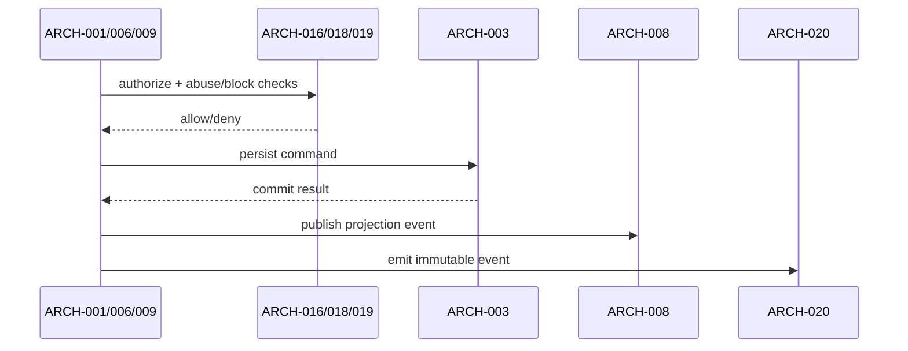

# Architecture Design: Public Creator Profiles

**Feature Branch**: `012-creator-profiles`
**Created**: 2026-05-10
**Status**: Draft
**Source**: `specs/012-creator-profiles/v-model/system-design.md`

## Overview

Architecture splits each system component into cohesive software modules with explicit interfaces for API, scheduler, cache, and workflow boundaries. Cross-cutting observability and governance are represented explicitly so security/compliance behavior is not implicit.

## ID Schema

- **Architecture Module**: `ARCH-NNN` — sequential identifier for each module.
- **Parent System Components**: comma-separated `SYS-NNN` list (many-to-many).
- **Cross-Cutting Tag**: `[CROSS-CUTTING]` for horizontal infrastructure modules.

## Logical View — Component Breakdown (IEEE 42010 / Kruchten 4+1)

| ARCH ID  | Name                            | Description                                                                                    | Parent System Components                                                                | Type      |
| -------- | ------------------------------- | ---------------------------------------------------------------------------------------------- | --------------------------------------------------------------------------------------- | --------- |
| ARCH-001 | Creator Lifecycle Controller    | HTTP handlers for profile create/update/deactivate and handle-change flows.                    | SYS-001                                                                                 | Component |
| ARCH-002 | Handle Policy Validator         | Validates handle syntax, cooldown windows, and reserved-handle constraints.                    | SYS-001, SYS-002                                                                        | Library   |
| ARCH-003 | Creator Profile Repository      | Persistence adapter for `creator_profiles` reads/writes and transactional lifecycle updates.   | SYS-001, SYS-011                                                                        | Adapter   |
| ARCH-004 | Public Profile Query Service    | Composes public profile read model from profile, follow counts, and public recipe references.  | SYS-003                                                                                 | Service   |
| ARCH-005 | SEO Metadata Builder            | Builds canonical URL, title, description, and Open Graph fields for profile SSR.               | SYS-003                                                                                 | Utility   |
| ARCH-006 | Follow Command Handler          | Executes idempotent follow/unfollow commands with ownership and suspension checks.             | SYS-004                                                                                 | Service   |
| ARCH-007 | Follow Counter Projector        | Projects denormalized follower/following counters with optimistic locking and retries.         | SYS-004                                                                                 | Component |
| ARCH-008 | Feed Fanout Adapter             | Publishes follow and creator-publication events to downstream feed integration boundary.       | SYS-005                                                                                 | Adapter   |
| ARCH-009 | Collections API Service         | Owner/public collection endpoints and validation orchestration.                                | SYS-006                                                                                 | Service   |
| ARCH-010 | Collection Ordering Engine      | Maintains stable recipe ordering and validates creator-owned public membership.                | SYS-006                                                                                 | Library   |
| ARCH-011 | Widget Fragment Renderer        | Generates static no-JS embed HTML and emits cache directives.                                  | SYS-007                                                                                 | Component |
| ARCH-012 | Analytics Snapshot Job          | Scheduled aggregation workflow writing daily analytics snapshots.                              | SYS-008                                                                                 | Job       |
| ARCH-013 | Analytics Read Endpoint         | Owner-scoped analytics retrieval with privacy filtering.                                       | SYS-008                                                                                 | Service   |
| ARCH-014 | Moderation & DMCA Orchestrator  | Coordinates suspension lifecycle, creator notifications, appeals, and takedown SLA processing. | SYS-009                                                                                 | Service   |
| ARCH-015 | Monetization Delegation Adapter | Maps tip/premium/paid-follow requests to 010 subscription/payment interfaces.                  | SYS-010                                                                                 | Adapter   |
| ARCH-016 | AuthZ & Session Freshness Guard | Enforces JWT subject checks and fresh-session requirements for sensitive owner mutations.      | SYS-011                                                                                 | Utility   |
| ARCH-017 | Privacy Erasure Orchestrator    | Propagates GDPR erasure across profile row, avatar object, and widget cache invalidation.      | SYS-011                                                                                 | Service   |
| ARCH-018 | Blocked Interaction Filter      | Prevents blocked-user follow/engagement circumvention on creator profile surfaces.             | SYS-011                                                                                 | Component |
| ARCH-019 | Abuse Throttle & Spam Detection | Rate limits profile/follow abuse and flags profile-spam/moderation-evasion patterns.           | SYS-011                                                                                 | Utility   |
| ARCH-020 | Audit Log Publisher             | Emits immutable security/compliance/audience-scope audit events.                               | [CROSS-CUTTING] — shared control logging across moderation, privacy, and security paths | Utility   |

## Process View — Dynamic Behavior (Kruchten 4+1)

## Development View — Package Allocation

| Module(s)                                                  | Target Package/Workspace                   |
| ---------------------------------------------------------- | ------------------------------------------ |
| ARCH-001..ARCH-004, ARCH-006..ARCH-010, ARCH-013..ARCH-019 | `@kitchensink/creator-profiles-api`        |
| ARCH-011                                                   | `@kitchensink/creator-profiles-widget`     |
| ARCH-012                                                   | creator analytics scheduled Lambda package |
| ARCH-020                                                   | shared platform audit/telemetry package    |

## Interface View — Public Contracts

| ARCH ID  | Interface Contract                                                     |
| -------- | ---------------------------------------------------------------------- |
| ARCH-001 | `POST/PUT /api/v1/creators*` lifecycle mutation contracts.             |
| ARCH-004 | Public profile DTO for unauthenticated `GET /api/v1/creators/:handle`. |
| ARCH-006 | Follow/unfollow idempotent command contract and error envelope.        |
| ARCH-009 | Collections CRUD/read contracts with owner/public split.               |
| ARCH-011 | Static HTML fragment contract for widget embeds.                       |
| ARCH-013 | Owner-only analytics payload contract.                                 |
| ARCH-014 | Moderation and DMCA workflow state transition contracts.               |
| ARCH-015 | Delegation contract to 010 payment/subscription APIs.                  |
| ARCH-017 | Erasure orchestration contract with completion evidence.               |
| ARCH-020 | Audit event envelope contract for control-plane actions.               |
