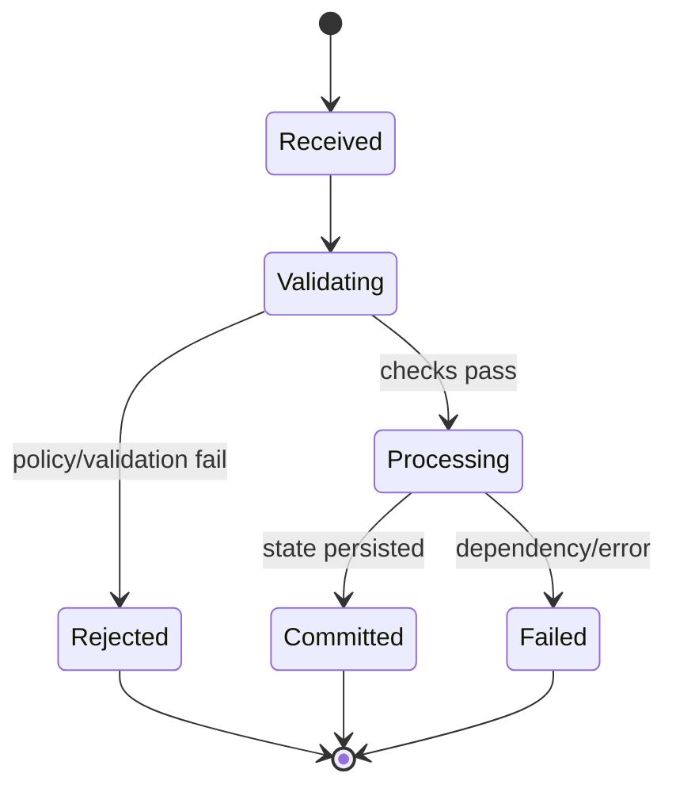

# Module Design: Public Creator Profiles

**Feature Branch**: `012-creator-profiles`
**Created**: 2026-05-10
**Status**: Draft
**Source**: `specs/012-creator-profiles/v-model/architecture-design.md`

## Overview

This module design defines implementable `MOD-NNN` units for every architecture module (`ARCH-001..ARCH-020`). Each module includes the four mandatory views: Algorithmic/Logic, State Machine, Internal Data Structures, and Error Handling.

## ID Schema

- **Module Design**: `MOD-NNN` — sequential identifier.
- **Parent Architecture Modules**: one or more `ARCH-NNN` parents.
- **Target Source File(s)**: intended implementation locations.

## Module Designs

### Module: MOD-001 (creatorLifecycleController.handleCommand)

**Parent Architecture Modules**: ARCH-001
**Target Source File(s)**: `packages/apps/commise/api/src/creator-profiles/controllers/creator-lifecycle.controller.ts`

#### Algorithmic / Logic View

```pseudocode
INPUT request/context for creatorLifecycleController.handleCommand
VALIDATE required fields, auth context, and policy preconditions
IF validation fails THEN return structured domain error
LOAD required state dependencies
IF state conflict detected THEN resolve per idempotency/concurrency contract
APPLY deterministic transformation and produce result payload
PERSIST/EMIT side effects atomically where required
RETURN success result with trace/audit metadata
```

#### State Machine View



#### Internal Data Structures View

- `creatorLifecycleControllerInput`: validated command/query envelope with actor and correlation IDs.
- `creatorLifecycleControllerState`: loaded profile/follow/collection/moderation context needed for decisions.
- `ResultEnvelope`: `{ status, data, error?, auditContext }`.
- Concurrency fields: `version`, `updatedAt`, `idempotencyKey` where applicable.

#### Error Handling View

- Validation errors: deterministic 4xx domain error codes.
- Authorization/policy errors: deny with auditable reason code.
- Dependency/transient errors: retry-safe classification with bounded retries upstream.
- Conflict errors: optimistic-lock or duplicate-key conflict surfaced as idempotent outcome.

---

### Module: MOD-002 (handlePolicyValidator.validate)

**Parent Architecture Modules**: ARCH-002
**Target Source File(s)**: `packages/apps/commise/api/src/creator-profiles/domain/handle-policy.validator.ts`

#### Algorithmic / Logic View

```pseudocode
INPUT request/context for handlePolicyValidator.validate
VALIDATE required fields, auth context, and policy preconditions
IF validation fails THEN return structured domain error
LOAD required state dependencies
IF state conflict detected THEN resolve per idempotency/concurrency contract
APPLY deterministic transformation and produce result payload
PERSIST/EMIT side effects atomically where required
RETURN success result with trace/audit metadata
```

#### State Machine View


#### Internal Data Structures View

- `handlePolicyValidatorInput`: validated command/query envelope with actor and correlation IDs.
- `handlePolicyValidatorState`: loaded profile/follow/collection/moderation context needed for decisions.
- `ResultEnvelope`: `{ status, data, error?, auditContext }`.
- Concurrency fields: `version`, `updatedAt`, `idempotencyKey` where applicable.

#### Error Handling View

- Validation errors: deterministic 4xx domain error codes.
- Authorization/policy errors: deny with auditable reason code.
- Dependency/transient errors: retry-safe classification with bounded retries upstream.
- Conflict errors: optimistic-lock or duplicate-key conflict surfaced as idempotent outcome.

---

### Module: MOD-003 (creatorProfileRepository.saveLifecycle)

**Parent Architecture Modules**: ARCH-003
**Target Source File(s)**: `packages/apps/commise/api/src/creator-profiles/repositories/creator-profile.repository.ts`

#### Algorithmic / Logic View

```pseudocode
INPUT request/context for creatorProfileRepository.saveLifecycle
VALIDATE required fields, auth context, and policy preconditions
IF validation fails THEN return structured domain error
LOAD required state dependencies
IF state conflict detected THEN resolve per idempotency/concurrency contract
APPLY deterministic transformation and produce result payload
PERSIST/EMIT side effects atomically where required
RETURN success result with trace/audit metadata
```

#### State Machine View


#### Internal Data Structures View

- `creatorProfileRepositoryInput`: validated command/query envelope with actor and correlation IDs.
- `creatorProfileRepositoryState`: loaded profile/follow/collection/moderation context needed for decisions.
- `ResultEnvelope`: `{ status, data, error?, auditContext }`.
- Concurrency fields: `version`, `updatedAt`, `idempotencyKey` where applicable.

#### Error Handling View

- Validation errors: deterministic 4xx domain error codes.
- Authorization/policy errors: deny with auditable reason code.
- Dependency/transient errors: retry-safe classification with bounded retries upstream.
- Conflict errors: optimistic-lock or duplicate-key conflict surfaced as idempotent outcome.

---

### Module: MOD-004 (publicProfileQueryService.getByHandle)

**Parent Architecture Modules**: ARCH-004
**Target Source File(s)**: `packages/apps/commise/api/src/creator-profiles/services/public-profile-query.service.ts`

#### Algorithmic / Logic View

```pseudocode
INPUT request/context for publicProfileQueryService.getByHandle
VALIDATE required fields, auth context, and policy preconditions
IF validation fails THEN return structured domain error
LOAD required state dependencies
IF state conflict detected THEN resolve per idempotency/concurrency contract
APPLY deterministic transformation and produce result payload
PERSIST/EMIT side effects atomically where required
RETURN success result with trace/audit metadata
```

#### State Machine View


#### Internal Data Structures View

- `publicProfileQueryServiceInput`: validated command/query envelope with actor and correlation IDs.
- `publicProfileQueryServiceState`: loaded profile/follow/collection/moderation context needed for decisions.
- `ResultEnvelope`: `{ status, data, error?, auditContext }`.
- Concurrency fields: `version`, `updatedAt`, `idempotencyKey` where applicable.

#### Error Handling View

- Validation errors: deterministic 4xx domain error codes.
- Authorization/policy errors: deny with auditable reason code.
- Dependency/transient errors: retry-safe classification with bounded retries upstream.
- Conflict errors: optimistic-lock or duplicate-key conflict surfaced as idempotent outcome.

---

### Module: MOD-005 (seoMetadataBuilder.build)

**Parent Architecture Modules**: ARCH-005
**Target Source File(s)**: `packages/apps/commise/web/src/app/@[handle]/seo-metadata.builder.ts`

#### Algorithmic / Logic View

```pseudocode
INPUT request/context for seoMetadataBuilder.build
VALIDATE required fields, auth context, and policy preconditions
IF validation fails THEN return structured domain error
LOAD required state dependencies
IF state conflict detected THEN resolve per idempotency/concurrency contract
APPLY deterministic transformation and produce result payload
PERSIST/EMIT side effects atomically where required
RETURN success result with trace/audit metadata
```

#### State Machine View


#### Internal Data Structures View

- `seoMetadataBuilderInput`: validated command/query envelope with actor and correlation IDs.
- `seoMetadataBuilderState`: loaded profile/follow/collection/moderation context needed for decisions.
- `ResultEnvelope`: `{ status, data, error?, auditContext }`.
- Concurrency fields: `version`, `updatedAt`, `idempotencyKey` where applicable.

#### Error Handling View

- Validation errors: deterministic 4xx domain error codes.
- Authorization/policy errors: deny with auditable reason code.
- Dependency/transient errors: retry-safe classification with bounded retries upstream.
- Conflict errors: optimistic-lock or duplicate-key conflict surfaced as idempotent outcome.

---

### Module: MOD-006 (followCommandHandler.execute)

**Parent Architecture Modules**: ARCH-006
**Target Source File(s)**: `packages/apps/commise/api/src/creator-profiles/services/follow-command.handler.ts`

#### Algorithmic / Logic View

```pseudocode
INPUT request/context for followCommandHandler.execute
VALIDATE required fields, auth context, and policy preconditions
IF validation fails THEN return structured domain error
LOAD required state dependencies
IF state conflict detected THEN resolve per idempotency/concurrency contract
APPLY deterministic transformation and produce result payload
PERSIST/EMIT side effects atomically where required
RETURN success result with trace/audit metadata
```

#### State Machine View


#### Internal Data Structures View

- `followCommandHandlerInput`: validated command/query envelope with actor and correlation IDs.
- `followCommandHandlerState`: loaded profile/follow/collection/moderation context needed for decisions.
- `ResultEnvelope`: `{ status, data, error?, auditContext }`.
- Concurrency fields: `version`, `updatedAt`, `idempotencyKey` where applicable.

#### Error Handling View

- Validation errors: deterministic 4xx domain error codes.
- Authorization/policy errors: deny with auditable reason code.
- Dependency/transient errors: retry-safe classification with bounded retries upstream.
- Conflict errors: optimistic-lock or duplicate-key conflict surfaced as idempotent outcome.

---

### Module: MOD-007 (followCounterProjector.applyDelta)

**Parent Architecture Modules**: ARCH-007
**Target Source File(s)**: `packages/apps/commise/api/src/creator-profiles/projections/follow-counter.projector.ts`

#### Algorithmic / Logic View

```pseudocode
INPUT request/context for followCounterProjector.applyDelta
VALIDATE required fields, auth context, and policy preconditions
IF validation fails THEN return structured domain error
LOAD required state dependencies
IF state conflict detected THEN resolve per idempotency/concurrency contract
APPLY deterministic transformation and produce result payload
PERSIST/EMIT side effects atomically where required
RETURN success result with trace/audit metadata
```

#### State Machine View


#### Internal Data Structures View

- `followCounterProjectorInput`: validated command/query envelope with actor and correlation IDs.
- `followCounterProjectorState`: loaded profile/follow/collection/moderation context needed for decisions.
- `ResultEnvelope`: `{ status, data, error?, auditContext }`.
- Concurrency fields: `version`, `updatedAt`, `idempotencyKey` where applicable.

#### Error Handling View

- Validation errors: deterministic 4xx domain error codes.
- Authorization/policy errors: deny with auditable reason code.
- Dependency/transient errors: retry-safe classification with bounded retries upstream.
- Conflict errors: optimistic-lock or duplicate-key conflict surfaced as idempotent outcome.

---

### Module: MOD-008 (feedFanoutAdapter.publishFollowEvent)

**Parent Architecture Modules**: ARCH-008
**Target Source File(s)**: `packages/apps/commise/api/src/creator-profiles/adapters/feed-fanout.adapter.ts`

#### Algorithmic / Logic View

```pseudocode
INPUT request/context for feedFanoutAdapter.publishFollowEvent
VALIDATE required fields, auth context, and policy preconditions
IF validation fails THEN return structured domain error
LOAD required state dependencies
IF state conflict detected THEN resolve per idempotency/concurrency contract
APPLY deterministic transformation and produce result payload
PERSIST/EMIT side effects atomically where required
RETURN success result with trace/audit metadata
```

#### State Machine View


#### Internal Data Structures View

- `feedFanoutAdapterInput`: validated command/query envelope with actor and correlation IDs.
- `feedFanoutAdapterState`: loaded profile/follow/collection/moderation context needed for decisions.
- `ResultEnvelope`: `{ status, data, error?, auditContext }`.
- Concurrency fields: `version`, `updatedAt`, `idempotencyKey` where applicable.

#### Error Handling View

- Validation errors: deterministic 4xx domain error codes.
- Authorization/policy errors: deny with auditable reason code.
- Dependency/transient errors: retry-safe classification with bounded retries upstream.
- Conflict errors: optimistic-lock or duplicate-key conflict surfaced as idempotent outcome.

---

### Module: MOD-009 (collectionsApiService.handleRequest)

**Parent Architecture Modules**: ARCH-009
**Target Source File(s)**: `packages/apps/commise/api/src/creator-profiles/services/collections-api.service.ts`

#### Algorithmic / Logic View

```pseudocode
INPUT request/context for collectionsApiService.handleRequest
VALIDATE required fields, auth context, and policy preconditions
IF validation fails THEN return structured domain error
LOAD required state dependencies
IF state conflict detected THEN resolve per idempotency/concurrency contract
APPLY deterministic transformation and produce result payload
PERSIST/EMIT side effects atomically where required
RETURN success result with trace/audit metadata
```

#### State Machine View


#### Internal Data Structures View

- `collectionsApiServiceInput`: validated command/query envelope with actor and correlation IDs.
- `collectionsApiServiceState`: loaded profile/follow/collection/moderation context needed for decisions.
- `ResultEnvelope`: `{ status, data, error?, auditContext }`.
- Concurrency fields: `version`, `updatedAt`, `idempotencyKey` where applicable.

#### Error Handling View

- Validation errors: deterministic 4xx domain error codes.
- Authorization/policy errors: deny with auditable reason code.
- Dependency/transient errors: retry-safe classification with bounded retries upstream.
- Conflict errors: optimistic-lock or duplicate-key conflict surfaced as idempotent outcome.

---

### Module: MOD-010 (collectionOrderingEngine.reorder)

**Parent Architecture Modules**: ARCH-010
**Target Source File(s)**: `packages/apps/commise/api/src/creator-profiles/domain/collection-ordering.engine.ts`

#### Algorithmic / Logic View

```pseudocode
INPUT request/context for collectionOrderingEngine.reorder
VALIDATE required fields, auth context, and policy preconditions
IF validation fails THEN return structured domain error
LOAD required state dependencies
IF state conflict detected THEN resolve per idempotency/concurrency contract
APPLY deterministic transformation and produce result payload
PERSIST/EMIT side effects atomically where required
RETURN success result with trace/audit metadata
```

#### State Machine View


#### Internal Data Structures View

- `collectionOrderingEngineInput`: validated command/query envelope with actor and correlation IDs.
- `collectionOrderingEngineState`: loaded profile/follow/collection/moderation context needed for decisions.
- `ResultEnvelope`: `{ status, data, error?, auditContext }`.
- Concurrency fields: `version`, `updatedAt`, `idempotencyKey` where applicable.

#### Error Handling View

- Validation errors: deterministic 4xx domain error codes.
- Authorization/policy errors: deny with auditable reason code.
- Dependency/transient errors: retry-safe classification with bounded retries upstream.
- Conflict errors: optimistic-lock or duplicate-key conflict surfaced as idempotent outcome.

---

### Module: MOD-011 (widgetFragmentRenderer.render)

**Parent Architecture Modules**: ARCH-011
**Target Source File(s)**: `packages/apps/commise/web/src/app/@[handle]/widget/widget-fragment.renderer.ts`

#### Algorithmic / Logic View

```pseudocode
INPUT request/context for widgetFragmentRenderer.render
VALIDATE required fields, auth context, and policy preconditions
IF validation fails THEN return structured domain error
LOAD required state dependencies
IF state conflict detected THEN resolve per idempotency/concurrency contract
APPLY deterministic transformation and produce result payload
PERSIST/EMIT side effects atomically where required
RETURN success result with trace/audit metadata
```

#### State Machine View


#### Internal Data Structures View

- `widgetFragmentRendererInput`: validated command/query envelope with actor and correlation IDs.
- `widgetFragmentRendererState`: loaded profile/follow/collection/moderation context needed for decisions.
- `ResultEnvelope`: `{ status, data, error?, auditContext }`.
- Concurrency fields: `version`, `updatedAt`, `idempotencyKey` where applicable.

#### Error Handling View

- Validation errors: deterministic 4xx domain error codes.
- Authorization/policy errors: deny with auditable reason code.
- Dependency/transient errors: retry-safe classification with bounded retries upstream.
- Conflict errors: optimistic-lock or duplicate-key conflict surfaced as idempotent outcome.

---

### Module: MOD-012 (analyticsSnapshotJob.runDaily)

**Parent Architecture Modules**: ARCH-012
**Target Source File(s)**: `packages/apps/commise/api/src/creator-profiles/jobs/analytics-snapshot.job.ts`

#### Algorithmic / Logic View

```pseudocode
INPUT request/context for analyticsSnapshotJob.runDaily
VALIDATE required fields, auth context, and policy preconditions
IF validation fails THEN return structured domain error
LOAD required state dependencies
IF state conflict detected THEN resolve per idempotency/concurrency contract
APPLY deterministic transformation and produce result payload
PERSIST/EMIT side effects atomically where required
RETURN success result with trace/audit metadata
```

#### State Machine View


#### Internal Data Structures View

- `analyticsSnapshotJobInput`: validated command/query envelope with actor and correlation IDs.
- `analyticsSnapshotJobState`: loaded profile/follow/collection/moderation context needed for decisions.
- `ResultEnvelope`: `{ status, data, error?, auditContext }`.
- Concurrency fields: `version`, `updatedAt`, `idempotencyKey` where applicable.

#### Error Handling View

- Validation errors: deterministic 4xx domain error codes.
- Authorization/policy errors: deny with auditable reason code.
- Dependency/transient errors: retry-safe classification with bounded retries upstream.
- Conflict errors: optimistic-lock or duplicate-key conflict surfaced as idempotent outcome.

---

### Module: MOD-013 (analyticsReadEndpoint.getOwnerSnapshot)

**Parent Architecture Modules**: ARCH-013
**Target Source File(s)**: `packages/apps/commise/api/src/creator-profiles/controllers/analytics.controller.ts`

#### Algorithmic / Logic View

```pseudocode
INPUT request/context for analyticsReadEndpoint.getOwnerSnapshot
VALIDATE required fields, auth context, and policy preconditions
IF validation fails THEN return structured domain error
LOAD required state dependencies
IF state conflict detected THEN resolve per idempotency/concurrency contract
APPLY deterministic transformation and produce result payload
PERSIST/EMIT side effects atomically where required
RETURN success result with trace/audit metadata
```

#### State Machine View


#### Internal Data Structures View

- `analyticsReadEndpointInput`: validated command/query envelope with actor and correlation IDs.
- `analyticsReadEndpointState`: loaded profile/follow/collection/moderation context needed for decisions.
- `ResultEnvelope`: `{ status, data, error?, auditContext }`.
- Concurrency fields: `version`, `updatedAt`, `idempotencyKey` where applicable.

#### Error Handling View

- Validation errors: deterministic 4xx domain error codes.
- Authorization/policy errors: deny with auditable reason code.
- Dependency/transient errors: retry-safe classification with bounded retries upstream.
- Conflict errors: optimistic-lock or duplicate-key conflict surfaced as idempotent outcome.

---

### Module: MOD-014 (moderationDmcaOrchestrator.transition)

**Parent Architecture Modules**: ARCH-014
**Target Source File(s)**: `packages/apps/commise/api/src/creator-profiles/services/moderation-dmca.orchestrator.ts`

#### Algorithmic / Logic View

```pseudocode
INPUT request/context for moderationDmcaOrchestrator.transition
VALIDATE required fields, auth context, and policy preconditions
IF validation fails THEN return structured domain error
LOAD required state dependencies
IF state conflict detected THEN resolve per idempotency/concurrency contract
APPLY deterministic transformation and produce result payload
PERSIST/EMIT side effects atomically where required
RETURN success result with trace/audit metadata
```

#### State Machine View


#### Internal Data Structures View

- `moderationDmcaOrchestratorInput`: validated command/query envelope with actor and correlation IDs.
- `moderationDmcaOrchestratorState`: loaded profile/follow/collection/moderation context needed for decisions.
- `ResultEnvelope`: `{ status, data, error?, auditContext }`.
- Concurrency fields: `version`, `updatedAt`, `idempotencyKey` where applicable.

#### Error Handling View

- Validation errors: deterministic 4xx domain error codes.
- Authorization/policy errors: deny with auditable reason code.
- Dependency/transient errors: retry-safe classification with bounded retries upstream.
- Conflict errors: optimistic-lock or duplicate-key conflict surfaced as idempotent outcome.

---

### Module: MOD-015 (monetizationDelegationAdapter.forward)

**Parent Architecture Modules**: ARCH-015
**Target Source File(s)**: `packages/apps/commise/api/src/creator-profiles/adapters/monetization-delegation.adapter.ts`

#### Algorithmic / Logic View

```pseudocode
INPUT request/context for monetizationDelegationAdapter.forward
VALIDATE required fields, auth context, and policy preconditions
IF validation fails THEN return structured domain error
LOAD required state dependencies
IF state conflict detected THEN resolve per idempotency/concurrency contract
APPLY deterministic transformation and produce result payload
PERSIST/EMIT side effects atomically where required
RETURN success result with trace/audit metadata
```

#### State Machine View


#### Internal Data Structures View

- `monetizationDelegationAdapterInput`: validated command/query envelope with actor and correlation IDs.
- `monetizationDelegationAdapterState`: loaded profile/follow/collection/moderation context needed for decisions.
- `ResultEnvelope`: `{ status, data, error?, auditContext }`.
- Concurrency fields: `version`, `updatedAt`, `idempotencyKey` where applicable.

#### Error Handling View

- Validation errors: deterministic 4xx domain error codes.
- Authorization/policy errors: deny with auditable reason code.
- Dependency/transient errors: retry-safe classification with bounded retries upstream.
- Conflict errors: optimistic-lock or duplicate-key conflict surfaced as idempotent outcome.

---

### Module: MOD-016 (authzSessionFreshnessGuard.assertOwnerFresh)

**Parent Architecture Modules**: ARCH-016
**Target Source File(s)**: `packages/apps/commise/api/src/creator-profiles/security/authz-session-freshness.guard.ts`

#### Algorithmic / Logic View

```pseudocode
INPUT request/context for authzSessionFreshnessGuard.assertOwnerFresh
VALIDATE required fields, auth context, and policy preconditions
IF validation fails THEN return structured domain error
LOAD required state dependencies
IF state conflict detected THEN resolve per idempotency/concurrency contract
APPLY deterministic transformation and produce result payload
PERSIST/EMIT side effects atomically where required
RETURN success result with trace/audit metadata
```

#### State Machine View


#### Internal Data Structures View

- `authzSessionFreshnessGuardInput`: validated command/query envelope with actor and correlation IDs.
- `authzSessionFreshnessGuardState`: loaded profile/follow/collection/moderation context needed for decisions.
- `ResultEnvelope`: `{ status, data, error?, auditContext }`.
- Concurrency fields: `version`, `updatedAt`, `idempotencyKey` where applicable.

#### Error Handling View

- Validation errors: deterministic 4xx domain error codes.
- Authorization/policy errors: deny with auditable reason code.
- Dependency/transient errors: retry-safe classification with bounded retries upstream.
- Conflict errors: optimistic-lock or duplicate-key conflict surfaced as idempotent outcome.

---

### Module: MOD-017 (privacyErasureOrchestrator.execute)

**Parent Architecture Modules**: ARCH-017
**Target Source File(s)**: `packages/apps/commise/api/src/creator-profiles/privacy/privacy-erasure.orchestrator.ts`

#### Algorithmic / Logic View

```pseudocode
INPUT request/context for privacyErasureOrchestrator.execute
VALIDATE required fields, auth context, and policy preconditions
IF validation fails THEN return structured domain error
LOAD required state dependencies
IF state conflict detected THEN resolve per idempotency/concurrency contract
APPLY deterministic transformation and produce result payload
PERSIST/EMIT side effects atomically where required
RETURN success result with trace/audit metadata
```

#### State Machine View


#### Internal Data Structures View

- `privacyErasureOrchestratorInput`: validated command/query envelope with actor and correlation IDs.
- `privacyErasureOrchestratorState`: loaded profile/follow/collection/moderation context needed for decisions.
- `ResultEnvelope`: `{ status, data, error?, auditContext }`.
- Concurrency fields: `version`, `updatedAt`, `idempotencyKey` where applicable.

#### Error Handling View

- Validation errors: deterministic 4xx domain error codes.
- Authorization/policy errors: deny with auditable reason code.
- Dependency/transient errors: retry-safe classification with bounded retries upstream.
- Conflict errors: optimistic-lock or duplicate-key conflict surfaced as idempotent outcome.

---

### Module: MOD-018 (blockedInteractionFilter.enforce)

**Parent Architecture Modules**: ARCH-018
**Target Source File(s)**: `packages/apps/commise/api/src/creator-profiles/security/blocked-interaction.filter.ts`

#### Algorithmic / Logic View

```pseudocode
INPUT request/context for blockedInteractionFilter.enforce
VALIDATE required fields, auth context, and policy preconditions
IF validation fails THEN return structured domain error
LOAD required state dependencies
IF state conflict detected THEN resolve per idempotency/concurrency contract
APPLY deterministic transformation and produce result payload
PERSIST/EMIT side effects atomically where required
RETURN success result with trace/audit metadata
```

#### State Machine View


#### Internal Data Structures View

- `blockedInteractionFilterInput`: validated command/query envelope with actor and correlation IDs.
- `blockedInteractionFilterState`: loaded profile/follow/collection/moderation context needed for decisions.
- `ResultEnvelope`: `{ status, data, error?, auditContext }`.
- Concurrency fields: `version`, `updatedAt`, `idempotencyKey` where applicable.

#### Error Handling View

- Validation errors: deterministic 4xx domain error codes.
- Authorization/policy errors: deny with auditable reason code.
- Dependency/transient errors: retry-safe classification with bounded retries upstream.
- Conflict errors: optimistic-lock or duplicate-key conflict surfaced as idempotent outcome.

---

### Module: MOD-019 (abuseThrottleSpamDetection.evaluate)

**Parent Architecture Modules**: ARCH-019
**Target Source File(s)**: `packages/apps/commise/api/src/creator-profiles/security/abuse-throttle-spam-detection.ts`

#### Algorithmic / Logic View

```pseudocode
INPUT request/context for abuseThrottleSpamDetection.evaluate
VALIDATE required fields, auth context, and policy preconditions
IF validation fails THEN return structured domain error
LOAD required state dependencies
IF state conflict detected THEN resolve per idempotency/concurrency contract
APPLY deterministic transformation and produce result payload
PERSIST/EMIT side effects atomically where required
RETURN success result with trace/audit metadata
```

#### State Machine View


#### Internal Data Structures View

- `abuseThrottleSpamDetectionInput`: validated command/query envelope with actor and correlation IDs.
- `abuseThrottleSpamDetectionState`: loaded profile/follow/collection/moderation context needed for decisions.
- `ResultEnvelope`: `{ status, data, error?, auditContext }`.
- Concurrency fields: `version`, `updatedAt`, `idempotencyKey` where applicable.

#### Error Handling View

- Validation errors: deterministic 4xx domain error codes.
- Authorization/policy errors: deny with auditable reason code.
- Dependency/transient errors: retry-safe classification with bounded retries upstream.
- Conflict errors: optimistic-lock or duplicate-key conflict surfaced as idempotent outcome.

---

### Module: MOD-020 (auditLogPublisher.emit)

**Parent Architecture Modules**: ARCH-020
**Target Source File(s)**: `packages/shared/observability/src/audit/creator-profile-audit.publisher.ts`

#### Algorithmic / Logic View

```pseudocode
INPUT request/context for auditLogPublisher.emit
VALIDATE required fields, auth context, and policy preconditions
IF validation fails THEN return structured domain error
LOAD required state dependencies
IF state conflict detected THEN resolve per idempotency/concurrency contract
APPLY deterministic transformation and produce result payload
PERSIST/EMIT side effects atomically where required
RETURN success result with trace/audit metadata
```

#### State Machine View


#### Internal Data Structures View

- `auditLogPublisherInput`: validated command/query envelope with actor and correlation IDs.
- `auditLogPublisherState`: loaded profile/follow/collection/moderation context needed for decisions.
- `ResultEnvelope`: `{ status, data, error?, auditContext }`.
- Concurrency fields: `version`, `updatedAt`, `idempotencyKey` where applicable.

#### Error Handling View

- Validation errors: deterministic 4xx domain error codes.
- Authorization/policy errors: deny with auditable reason code.
- Dependency/transient errors: retry-safe classification with bounded retries upstream.
- Conflict errors: optimistic-lock or duplicate-key conflict surfaced as idempotent outcome.

---
