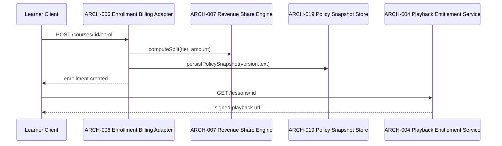
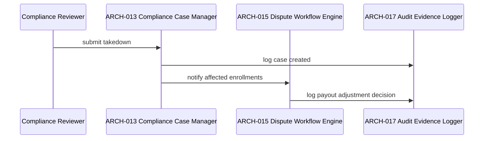

# Architecture Design: Cooking School (Video Learning Platform)

**Feature Branch**: `013-cooking-school`
**Created**: 2026-05-10
**Status**: Draft
**Source**: `specs/013-cooking-school/v-model/system-design.md`

## Overview

Architecture decomposition maps each system component into module-boundary units optimized for integration verification and implementation traceability. Interfaces are explicit for auth, billing, media, policy, and governance concerns.

## ID Schema

- **Architecture Module**: `ARCH-NNN`
- **Parent System Components**: comma-separated `SYS-NNN` list

## Logical View — Component Breakdown (IEEE 42010 / Kruchten 4+1)

| ARCH ID  | Name                         | Description                                                        | Parent System Components | Type      |
| -------- | ---------------------------- | ------------------------------------------------------------------ | ------------------------ | --------- |
| ARCH-001 | Auth Guard Module            | JWT verification and role checks for protected routes.             | SYS-001                  | Service   |
| ARCH-002 | Course Authoring API Module  | Course/lesson create-update-publish command handlers.              | SYS-002                  | Component |
| ARCH-003 | Media Pipeline Orchestrator  | Upload intake to transcode workflow management.                    | SYS-003                  | Service   |
| ARCH-004 | Playback Entitlement Service | Preview vs enrollment URL issuance and token signing.              | SYS-004                  | Service   |
| ARCH-005 | Catalog Query API            | Discovery listing with creator and pricing projections.            | SYS-005                  | Component |
| ARCH-006 | Enrollment Billing Adapter   | Checkout, enrollment snapshot, and billing result handling.        | SYS-006                  | Adapter   |
| ARCH-007 | Revenue Share Engine         | Tier-based split and ledger calculations.                          | SYS-006, SYS-009         | Library   |
| ARCH-008 | Lesson Content Service       | Lesson payload, recipe linkage, and publish state reads/writes.    | SYS-007                  | Service   |
| ARCH-009 | AI Draft Adapter             | Recipe-context callout to AI drafting endpoint with policy checks. | SYS-007                  | Adapter   |
| ARCH-010 | Progress Event Processor     | Progress write path and completion threshold evaluator.            | SYS-008                  | Service   |
| ARCH-011 | Progress Projection Query    | Learner dashboard read model projection.                           | SYS-008                  | Component |
| ARCH-012 | Educator Metrics Aggregator  | Enrollment/completion/revenue dashboard materialization.           | SYS-009                  | Service   |
| ARCH-013 | Compliance Case Manager      | Copyright/policy takedown workflow orchestration.                  | SYS-010                  | Service   |
| ARCH-014 | Age & Safety Policy Filter   | Age restriction and safety disclaimer gating logic.                | SYS-010                  | Library   |
| ARCH-015 | Dispute Workflow Engine      | Refund/access dispute state machine.                               | SYS-011                  | Service   |
| ARCH-016 | Payout Adjustment Adapter    | Dispute outcome projection into payout adjustments.                | SYS-011                  | Adapter   |
| ARCH-017 | Audit Evidence Logger        | Immutable audit events for compliance/refund actions.              | SYS-012                  | Utility   |
| ARCH-018 | Backup Restore Coordinator   | Backup schedule, restore jobs, and integrity verification.         | SYS-012                  | Service   |
| ARCH-019 | Policy Snapshot Store        | Immutable refund policy/version attachment at enrollment time.     | SYS-006, SYS-012         | Component |
| ARCH-020 | Scope Guard Module           | Hard block for out-of-scope live-class/certificate operations.     | SYS-012                  | Utility   |

## Process View — Dynamic Behavior (Kruchten 4+1)

### Sequence: Learner purchase to entitled playback



### Sequence: Compliance takedown and dispute linkage



## Interface View

| Provider Module | Interface                                 | Consumer Module              | Contract                                       |
| --------------- | ----------------------------------------- | ---------------------------- | ---------------------------------------------- |
| ARCH-001        | `verifyJwt(token)`                        | ARCH-002, ARCH-006, ARCH-010 | Validates token and role claims.               |
| ARCH-003        | `enqueueTranscode(lessonId, sourceKey)`   | ARCH-002                     | Starts transcode job and returns job id.       |
| ARCH-004        | `issuePlaybackUrl(lessonId, learnerId)`   | External API                 | Returns preview or signed URL per entitlement. |
| ARCH-009        | `draftLessonScript(lessonId, recipeId)`   | ARCH-008                     | Returns structured lesson outline.             |
| ARCH-016        | `applyPayoutAdjustment(disputeId, cents)` | ARCH-015                     | Persists reversible payout delta.              |
| ARCH-018        | `runRestore(snapshotId)`                  | Ops workflow                 | Restores enrollment/progress records.          |

## Data Flow View

```text
Upload -> ARCH-003 -> HLS assets -> ARCH-004 playback URL
Purchase -> ARCH-006 -> ARCH-007 split -> ARCH-019 snapshot
Playback watch events -> ARCH-010 -> ARCH-011 -> learner dashboard
Compliance/refund events -> ARCH-013/015 -> ARCH-017 -> governance evidence
```

---

**Total ARCH Modules**: 20
**SYS Coverage**: 12/12 (100%)
