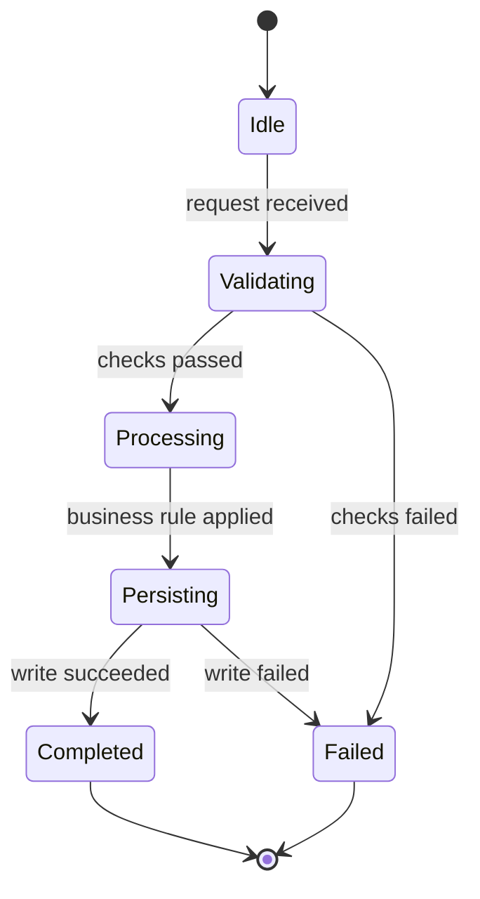

# Module Design: Cooking School (Video Learning Platform)

**Feature Branch**: `013-cooking-school`
**Created**: 2026-05-10
**Status**: Draft
**Source**: `specs/013-cooking-school/v-model/architecture-design.md`

## Overview

This document provides low-level module designs for all architecture modules (`ARCH-001..ARCH-020`). Each module includes the four mandatory views: Algorithmic/Logic, State Machine, Internal Data Structures, and Error Handling.

## ID Schema

- **Module Design**: `MOD-NNN`
- **Parent Architecture Modules**: `ARCH-NNN`
- **Target Source File(s)**: implementation target placeholder paths for traceability only (no code changes in this task).

## Module Designs

### Module: MOD-001 (Auth Guard)

**Parent Architecture Modules**: ARCH-001
**Target Source File(s)**: `specs/013-cooking-school/implementation/auth-guard-module.ts`

#### Algorithmic / Logic View

```pseudocode
INPUT request for Auth Guard
VALIDATE auth/context and required identifiers
LOAD persisted state and policy flags
APPLY module-specific business rules deterministically
PERSIST state transitions and emit required events
RETURN success payload or structured problem response
```

#### State Machine View



#### Internal Data Structures View

| Structure          | Purpose                               | Invariants                                              |
| ------------------ | ------------------------------------- | ------------------------------------------------------- |
| `Auth GuardInput`  | Request contract for module execution | Required IDs non-empty; payload schema-valid.           |
| `Auth GuardState`  | Current persisted/module state        | Version monotonic; ownership and entitlement preserved. |
| `Auth GuardResult` | Deterministic success/failure payload | Exactly one of `success` or `problem` populated.        |

#### Error Handling View

| Error Condition                | Detection Point          | Handling Strategy                               | External Behavior                   |
| ------------------------------ | ------------------------ | ----------------------------------------------- | ----------------------------------- |
| Missing/invalid authentication | Validation               | Fail-fast with structured problem code          | 401/403 response, no state mutation |
| Contract violation             | Schema and policy checks | Reject and record audit event when required     | 400/422 response                    |
| Downstream dependency timeout  | External adapter call    | Retry with bounded attempts; emit failure event | 503 with retry guidance             |
| Persistence conflict           | Write operation          | Idempotent retry or conflict return             | 409/500 with correlation id         |

---

### Module: MOD-002 (Course Authoring API)

**Parent Architecture Modules**: ARCH-002
**Target Source File(s)**: `specs/013-cooking-school/implementation/course-authoring-api-module.ts`

#### Algorithmic / Logic View

```pseudocode
INPUT request for Course Authoring API
VALIDATE auth/context and required identifiers
LOAD persisted state and policy flags
APPLY module-specific business rules deterministically
PERSIST state transitions and emit required events
RETURN success payload or structured problem response
```

#### State Machine View


#### Internal Data Structures View

| Structure                    | Purpose                               | Invariants                                              |
| ---------------------------- | ------------------------------------- | ------------------------------------------------------- |
| `Course Authoring APIInput`  | Request contract for module execution | Required IDs non-empty; payload schema-valid.           |
| `Course Authoring APIState`  | Current persisted/module state        | Version monotonic; ownership and entitlement preserved. |
| `Course Authoring APIResult` | Deterministic success/failure payload | Exactly one of `success` or `problem` populated.        |

#### Error Handling View

| Error Condition                | Detection Point          | Handling Strategy                               | External Behavior                   |
| ------------------------------ | ------------------------ | ----------------------------------------------- | ----------------------------------- |
| Missing/invalid authentication | Validation               | Fail-fast with structured problem code          | 401/403 response, no state mutation |
| Contract violation             | Schema and policy checks | Reject and record audit event when required     | 400/422 response                    |
| Downstream dependency timeout  | External adapter call    | Retry with bounded attempts; emit failure event | 503 with retry guidance             |
| Persistence conflict           | Write operation          | Idempotent retry or conflict return             | 409/500 with correlation id         |

---

### Module: MOD-003 (Media Pipeline Orchestrator)

**Parent Architecture Modules**: ARCH-003
**Target Source File(s)**: `specs/013-cooking-school/implementation/media-pipeline-orchestrator.ts`

#### Algorithmic / Logic View

```pseudocode
INPUT request for Media Pipeline Orchestrator
VALIDATE auth/context and required identifiers
LOAD persisted state and policy flags
APPLY module-specific business rules deterministically
PERSIST state transitions and emit required events
RETURN success payload or structured problem response
```

#### State Machine View


#### Internal Data Structures View

| Structure                           | Purpose                               | Invariants                                              |
| ----------------------------------- | ------------------------------------- | ------------------------------------------------------- |
| `Media Pipeline OrchestratorInput`  | Request contract for module execution | Required IDs non-empty; payload schema-valid.           |
| `Media Pipeline OrchestratorState`  | Current persisted/module state        | Version monotonic; ownership and entitlement preserved. |
| `Media Pipeline OrchestratorResult` | Deterministic success/failure payload | Exactly one of `success` or `problem` populated.        |

#### Error Handling View

| Error Condition                | Detection Point          | Handling Strategy                               | External Behavior                   |
| ------------------------------ | ------------------------ | ----------------------------------------------- | ----------------------------------- |
| Missing/invalid authentication | Validation               | Fail-fast with structured problem code          | 401/403 response, no state mutation |
| Contract violation             | Schema and policy checks | Reject and record audit event when required     | 400/422 response                    |
| Downstream dependency timeout  | External adapter call    | Retry with bounded attempts; emit failure event | 503 with retry guidance             |
| Persistence conflict           | Write operation          | Idempotent retry or conflict return             | 409/500 with correlation id         |

---

### Module: MOD-004 (Playback Entitlement)

**Parent Architecture Modules**: ARCH-004
**Target Source File(s)**: `specs/013-cooking-school/implementation/playback-entitlement-service.ts`

#### Algorithmic / Logic View

```pseudocode
INPUT request for Playback Entitlement
VALIDATE auth/context and required identifiers
LOAD persisted state and policy flags
APPLY module-specific business rules deterministically
PERSIST state transitions and emit required events
RETURN success payload or structured problem response
```

#### State Machine View


#### Internal Data Structures View

| Structure                    | Purpose                               | Invariants                                              |
| ---------------------------- | ------------------------------------- | ------------------------------------------------------- |
| `Playback EntitlementInput`  | Request contract for module execution | Required IDs non-empty; payload schema-valid.           |
| `Playback EntitlementState`  | Current persisted/module state        | Version monotonic; ownership and entitlement preserved. |
| `Playback EntitlementResult` | Deterministic success/failure payload | Exactly one of `success` or `problem` populated.        |

#### Error Handling View

| Error Condition                | Detection Point          | Handling Strategy                               | External Behavior                   |
| ------------------------------ | ------------------------ | ----------------------------------------------- | ----------------------------------- |
| Missing/invalid authentication | Validation               | Fail-fast with structured problem code          | 401/403 response, no state mutation |
| Contract violation             | Schema and policy checks | Reject and record audit event when required     | 400/422 response                    |
| Downstream dependency timeout  | External adapter call    | Retry with bounded attempts; emit failure event | 503 with retry guidance             |
| Persistence conflict           | Write operation          | Idempotent retry or conflict return             | 409/500 with correlation id         |

---

### Module: MOD-005 (Catalog Query API)

**Parent Architecture Modules**: ARCH-005
**Target Source File(s)**: `specs/013-cooking-school/implementation/catalog-query-api.ts`

#### Algorithmic / Logic View

```pseudocode
INPUT request for Catalog Query API
VALIDATE auth/context and required identifiers
LOAD persisted state and policy flags
APPLY module-specific business rules deterministically
PERSIST state transitions and emit required events
RETURN success payload or structured problem response
```

#### State Machine View


#### Internal Data Structures View

| Structure                 | Purpose                               | Invariants                                              |
| ------------------------- | ------------------------------------- | ------------------------------------------------------- |
| `Catalog Query APIInput`  | Request contract for module execution | Required IDs non-empty; payload schema-valid.           |
| `Catalog Query APIState`  | Current persisted/module state        | Version monotonic; ownership and entitlement preserved. |
| `Catalog Query APIResult` | Deterministic success/failure payload | Exactly one of `success` or `problem` populated.        |

#### Error Handling View

| Error Condition                | Detection Point          | Handling Strategy                               | External Behavior                   |
| ------------------------------ | ------------------------ | ----------------------------------------------- | ----------------------------------- |
| Missing/invalid authentication | Validation               | Fail-fast with structured problem code          | 401/403 response, no state mutation |
| Contract violation             | Schema and policy checks | Reject and record audit event when required     | 400/422 response                    |
| Downstream dependency timeout  | External adapter call    | Retry with bounded attempts; emit failure event | 503 with retry guidance             |
| Persistence conflict           | Write operation          | Idempotent retry or conflict return             | 409/500 with correlation id         |

---

### Module: MOD-006 (Enrollment Billing)

**Parent Architecture Modules**: ARCH-006
**Target Source File(s)**: `specs/013-cooking-school/implementation/enrollment-billing-adapter.ts`

#### Algorithmic / Logic View

```pseudocode
INPUT request for Enrollment Billing
VALIDATE auth/context and required identifiers
LOAD persisted state and policy flags
APPLY module-specific business rules deterministically
PERSIST state transitions and emit required events
RETURN success payload or structured problem response
```

#### State Machine View


#### Internal Data Structures View

| Structure                  | Purpose                               | Invariants                                              |
| -------------------------- | ------------------------------------- | ------------------------------------------------------- |
| `Enrollment BillingInput`  | Request contract for module execution | Required IDs non-empty; payload schema-valid.           |
| `Enrollment BillingState`  | Current persisted/module state        | Version monotonic; ownership and entitlement preserved. |
| `Enrollment BillingResult` | Deterministic success/failure payload | Exactly one of `success` or `problem` populated.        |

#### Error Handling View

| Error Condition                | Detection Point          | Handling Strategy                               | External Behavior                   |
| ------------------------------ | ------------------------ | ----------------------------------------------- | ----------------------------------- |
| Missing/invalid authentication | Validation               | Fail-fast with structured problem code          | 401/403 response, no state mutation |
| Contract violation             | Schema and policy checks | Reject and record audit event when required     | 400/422 response                    |
| Downstream dependency timeout  | External adapter call    | Retry with bounded attempts; emit failure event | 503 with retry guidance             |
| Persistence conflict           | Write operation          | Idempotent retry or conflict return             | 409/500 with correlation id         |

---

### Module: MOD-007 (Revenue Share)

**Parent Architecture Modules**: ARCH-007
**Target Source File(s)**: `specs/013-cooking-school/implementation/revenue-share-engine.ts`

#### Algorithmic / Logic View

```pseudocode
INPUT request for Revenue Share
VALIDATE auth/context and required identifiers
LOAD persisted state and policy flags
APPLY module-specific business rules deterministically
PERSIST state transitions and emit required events
RETURN success payload or structured problem response
```

#### State Machine View


#### Internal Data Structures View

| Structure             | Purpose                               | Invariants                                              |
| --------------------- | ------------------------------------- | ------------------------------------------------------- |
| `Revenue ShareInput`  | Request contract for module execution | Required IDs non-empty; payload schema-valid.           |
| `Revenue ShareState`  | Current persisted/module state        | Version monotonic; ownership and entitlement preserved. |
| `Revenue ShareResult` | Deterministic success/failure payload | Exactly one of `success` or `problem` populated.        |

#### Error Handling View

| Error Condition                | Detection Point          | Handling Strategy                               | External Behavior                   |
| ------------------------------ | ------------------------ | ----------------------------------------------- | ----------------------------------- |
| Missing/invalid authentication | Validation               | Fail-fast with structured problem code          | 401/403 response, no state mutation |
| Contract violation             | Schema and policy checks | Reject and record audit event when required     | 400/422 response                    |
| Downstream dependency timeout  | External adapter call    | Retry with bounded attempts; emit failure event | 503 with retry guidance             |
| Persistence conflict           | Write operation          | Idempotent retry or conflict return             | 409/500 with correlation id         |

---

### Module: MOD-008 (Lesson Content)

**Parent Architecture Modules**: ARCH-008
**Target Source File(s)**: `specs/013-cooking-school/implementation/lesson-content-service.ts`

#### Algorithmic / Logic View

```pseudocode
INPUT request for Lesson Content
VALIDATE auth/context and required identifiers
LOAD persisted state and policy flags
APPLY module-specific business rules deterministically
PERSIST state transitions and emit required events
RETURN success payload or structured problem response
```

#### State Machine View


#### Internal Data Structures View

| Structure              | Purpose                               | Invariants                                              |
| ---------------------- | ------------------------------------- | ------------------------------------------------------- |
| `Lesson ContentInput`  | Request contract for module execution | Required IDs non-empty; payload schema-valid.           |
| `Lesson ContentState`  | Current persisted/module state        | Version monotonic; ownership and entitlement preserved. |
| `Lesson ContentResult` | Deterministic success/failure payload | Exactly one of `success` or `problem` populated.        |

#### Error Handling View

| Error Condition                | Detection Point          | Handling Strategy                               | External Behavior                   |
| ------------------------------ | ------------------------ | ----------------------------------------------- | ----------------------------------- |
| Missing/invalid authentication | Validation               | Fail-fast with structured problem code          | 401/403 response, no state mutation |
| Contract violation             | Schema and policy checks | Reject and record audit event when required     | 400/422 response                    |
| Downstream dependency timeout  | External adapter call    | Retry with bounded attempts; emit failure event | 503 with retry guidance             |
| Persistence conflict           | Write operation          | Idempotent retry or conflict return             | 409/500 with correlation id         |

---

### Module: MOD-009 (AI Draft)

**Parent Architecture Modules**: ARCH-009
**Target Source File(s)**: `specs/013-cooking-school/implementation/ai-draft-adapter.ts`

#### Algorithmic / Logic View

```pseudocode
INPUT request for AI Draft
VALIDATE auth/context and required identifiers
LOAD persisted state and policy flags
APPLY module-specific business rules deterministically
PERSIST state transitions and emit required events
RETURN success payload or structured problem response
```

#### State Machine View


#### Internal Data Structures View

| Structure        | Purpose                               | Invariants                                              |
| ---------------- | ------------------------------------- | ------------------------------------------------------- |
| `AI DraftInput`  | Request contract for module execution | Required IDs non-empty; payload schema-valid.           |
| `AI DraftState`  | Current persisted/module state        | Version monotonic; ownership and entitlement preserved. |
| `AI DraftResult` | Deterministic success/failure payload | Exactly one of `success` or `problem` populated.        |

#### Error Handling View

| Error Condition                | Detection Point          | Handling Strategy                               | External Behavior                   |
| ------------------------------ | ------------------------ | ----------------------------------------------- | ----------------------------------- |
| Missing/invalid authentication | Validation               | Fail-fast with structured problem code          | 401/403 response, no state mutation |
| Contract violation             | Schema and policy checks | Reject and record audit event when required     | 400/422 response                    |
| Downstream dependency timeout  | External adapter call    | Retry with bounded attempts; emit failure event | 503 with retry guidance             |
| Persistence conflict           | Write operation          | Idempotent retry or conflict return             | 409/500 with correlation id         |

---

### Module: MOD-010 (Progress Event Processor)

**Parent Architecture Modules**: ARCH-010
**Target Source File(s)**: `specs/013-cooking-school/implementation/progress-event-processor.ts`

#### Algorithmic / Logic View

```pseudocode
INPUT request for Progress Event Processor
VALIDATE auth/context and required identifiers
LOAD persisted state and policy flags
APPLY module-specific business rules deterministically
PERSIST state transitions and emit required events
RETURN success payload or structured problem response
```

#### State Machine View


#### Internal Data Structures View

| Structure                        | Purpose                               | Invariants                                              |
| -------------------------------- | ------------------------------------- | ------------------------------------------------------- |
| `Progress Event ProcessorInput`  | Request contract for module execution | Required IDs non-empty; payload schema-valid.           |
| `Progress Event ProcessorState`  | Current persisted/module state        | Version monotonic; ownership and entitlement preserved. |
| `Progress Event ProcessorResult` | Deterministic success/failure payload | Exactly one of `success` or `problem` populated.        |

#### Error Handling View

| Error Condition                | Detection Point          | Handling Strategy                               | External Behavior                   |
| ------------------------------ | ------------------------ | ----------------------------------------------- | ----------------------------------- |
| Missing/invalid authentication | Validation               | Fail-fast with structured problem code          | 401/403 response, no state mutation |
| Contract violation             | Schema and policy checks | Reject and record audit event when required     | 400/422 response                    |
| Downstream dependency timeout  | External adapter call    | Retry with bounded attempts; emit failure event | 503 with retry guidance             |
| Persistence conflict           | Write operation          | Idempotent retry or conflict return             | 409/500 with correlation id         |

---

### Module: MOD-011 (Progress Projection Query)

**Parent Architecture Modules**: ARCH-011
**Target Source File(s)**: `specs/013-cooking-school/implementation/progress-projection-query.ts`

#### Algorithmic / Logic View

```pseudocode
INPUT request for Progress Projection Query
VALIDATE auth/context and required identifiers
LOAD persisted state and policy flags
APPLY module-specific business rules deterministically
PERSIST state transitions and emit required events
RETURN success payload or structured problem response
```

#### State Machine View


#### Internal Data Structures View

| Structure                         | Purpose                               | Invariants                                              |
| --------------------------------- | ------------------------------------- | ------------------------------------------------------- |
| `Progress Projection QueryInput`  | Request contract for module execution | Required IDs non-empty; payload schema-valid.           |
| `Progress Projection QueryState`  | Current persisted/module state        | Version monotonic; ownership and entitlement preserved. |
| `Progress Projection QueryResult` | Deterministic success/failure payload | Exactly one of `success` or `problem` populated.        |

#### Error Handling View

| Error Condition                | Detection Point          | Handling Strategy                               | External Behavior                   |
| ------------------------------ | ------------------------ | ----------------------------------------------- | ----------------------------------- |
| Missing/invalid authentication | Validation               | Fail-fast with structured problem code          | 401/403 response, no state mutation |
| Contract violation             | Schema and policy checks | Reject and record audit event when required     | 400/422 response                    |
| Downstream dependency timeout  | External adapter call    | Retry with bounded attempts; emit failure event | 503 with retry guidance             |
| Persistence conflict           | Write operation          | Idempotent retry or conflict return             | 409/500 with correlation id         |

---

### Module: MOD-012 (Educator Metrics Aggregator)

**Parent Architecture Modules**: ARCH-012
**Target Source File(s)**: `specs/013-cooking-school/implementation/educator-metrics-aggregator.ts`

#### Algorithmic / Logic View

```pseudocode
INPUT request for Educator Metrics Aggregator
VALIDATE auth/context and required identifiers
LOAD persisted state and policy flags
APPLY module-specific business rules deterministically
PERSIST state transitions and emit required events
RETURN success payload or structured problem response
```

#### State Machine View


#### Internal Data Structures View

| Structure                           | Purpose                               | Invariants                                              |
| ----------------------------------- | ------------------------------------- | ------------------------------------------------------- |
| `Educator Metrics AggregatorInput`  | Request contract for module execution | Required IDs non-empty; payload schema-valid.           |
| `Educator Metrics AggregatorState`  | Current persisted/module state        | Version monotonic; ownership and entitlement preserved. |
| `Educator Metrics AggregatorResult` | Deterministic success/failure payload | Exactly one of `success` or `problem` populated.        |

#### Error Handling View

| Error Condition                | Detection Point          | Handling Strategy                               | External Behavior                   |
| ------------------------------ | ------------------------ | ----------------------------------------------- | ----------------------------------- |
| Missing/invalid authentication | Validation               | Fail-fast with structured problem code          | 401/403 response, no state mutation |
| Contract violation             | Schema and policy checks | Reject and record audit event when required     | 400/422 response                    |
| Downstream dependency timeout  | External adapter call    | Retry with bounded attempts; emit failure event | 503 with retry guidance             |
| Persistence conflict           | Write operation          | Idempotent retry or conflict return             | 409/500 with correlation id         |

---

### Module: MOD-013 (Compliance Case Manager)

**Parent Architecture Modules**: ARCH-013
**Target Source File(s)**: `specs/013-cooking-school/implementation/compliance-case-manager.ts`

#### Algorithmic / Logic View

```pseudocode
INPUT request for Compliance Case Manager
VALIDATE auth/context and required identifiers
LOAD persisted state and policy flags
APPLY module-specific business rules deterministically
PERSIST state transitions and emit required events
RETURN success payload or structured problem response
```

#### State Machine View


#### Internal Data Structures View

| Structure                       | Purpose                               | Invariants                                              |
| ------------------------------- | ------------------------------------- | ------------------------------------------------------- |
| `Compliance Case ManagerInput`  | Request contract for module execution | Required IDs non-empty; payload schema-valid.           |
| `Compliance Case ManagerState`  | Current persisted/module state        | Version monotonic; ownership and entitlement preserved. |
| `Compliance Case ManagerResult` | Deterministic success/failure payload | Exactly one of `success` or `problem` populated.        |

#### Error Handling View

| Error Condition                | Detection Point          | Handling Strategy                               | External Behavior                   |
| ------------------------------ | ------------------------ | ----------------------------------------------- | ----------------------------------- |
| Missing/invalid authentication | Validation               | Fail-fast with structured problem code          | 401/403 response, no state mutation |
| Contract violation             | Schema and policy checks | Reject and record audit event when required     | 400/422 response                    |
| Downstream dependency timeout  | External adapter call    | Retry with bounded attempts; emit failure event | 503 with retry guidance             |
| Persistence conflict           | Write operation          | Idempotent retry or conflict return             | 409/500 with correlation id         |

---

### Module: MOD-014 (Age & Safety Policy Filter)

**Parent Architecture Modules**: ARCH-014
**Target Source File(s)**: `specs/013-cooking-school/implementation/age-&-safety-policy-filter.ts`

#### Algorithmic / Logic View

```pseudocode
INPUT request for Age & Safety Policy Filter
VALIDATE auth/context and required identifiers
LOAD persisted state and policy flags
APPLY module-specific business rules deterministically
PERSIST state transitions and emit required events
RETURN success payload or structured problem response
```

#### State Machine View


#### Internal Data Structures View

| Structure                          | Purpose                               | Invariants                                              |
| ---------------------------------- | ------------------------------------- | ------------------------------------------------------- |
| `Age & Safety Policy FilterInput`  | Request contract for module execution | Required IDs non-empty; payload schema-valid.           |
| `Age & Safety Policy FilterState`  | Current persisted/module state        | Version monotonic; ownership and entitlement preserved. |
| `Age & Safety Policy FilterResult` | Deterministic success/failure payload | Exactly one of `success` or `problem` populated.        |

#### Error Handling View

| Error Condition                | Detection Point          | Handling Strategy                               | External Behavior                   |
| ------------------------------ | ------------------------ | ----------------------------------------------- | ----------------------------------- |
| Missing/invalid authentication | Validation               | Fail-fast with structured problem code          | 401/403 response, no state mutation |
| Contract violation             | Schema and policy checks | Reject and record audit event when required     | 400/422 response                    |
| Downstream dependency timeout  | External adapter call    | Retry with bounded attempts; emit failure event | 503 with retry guidance             |
| Persistence conflict           | Write operation          | Idempotent retry or conflict return             | 409/500 with correlation id         |

---

### Module: MOD-015 (Dispute Workflow)

**Parent Architecture Modules**: ARCH-015
**Target Source File(s)**: `specs/013-cooking-school/implementation/dispute-workflow-engine.ts`

#### Algorithmic / Logic View

```pseudocode
INPUT request for Dispute Workflow
VALIDATE auth/context and required identifiers
LOAD persisted state and policy flags
APPLY module-specific business rules deterministically
PERSIST state transitions and emit required events
RETURN success payload or structured problem response
```

#### State Machine View


#### Internal Data Structures View

| Structure                | Purpose                               | Invariants                                              |
| ------------------------ | ------------------------------------- | ------------------------------------------------------- |
| `Dispute WorkflowInput`  | Request contract for module execution | Required IDs non-empty; payload schema-valid.           |
| `Dispute WorkflowState`  | Current persisted/module state        | Version monotonic; ownership and entitlement preserved. |
| `Dispute WorkflowResult` | Deterministic success/failure payload | Exactly one of `success` or `problem` populated.        |

#### Error Handling View

| Error Condition                | Detection Point          | Handling Strategy                               | External Behavior                   |
| ------------------------------ | ------------------------ | ----------------------------------------------- | ----------------------------------- |
| Missing/invalid authentication | Validation               | Fail-fast with structured problem code          | 401/403 response, no state mutation |
| Contract violation             | Schema and policy checks | Reject and record audit event when required     | 400/422 response                    |
| Downstream dependency timeout  | External adapter call    | Retry with bounded attempts; emit failure event | 503 with retry guidance             |
| Persistence conflict           | Write operation          | Idempotent retry or conflict return             | 409/500 with correlation id         |

---

### Module: MOD-016 (Payout Adjustment)

**Parent Architecture Modules**: ARCH-016
**Target Source File(s)**: `specs/013-cooking-school/implementation/payout-adjustment-adapter.ts`

#### Algorithmic / Logic View

```pseudocode
INPUT request for Payout Adjustment
VALIDATE auth/context and required identifiers
LOAD persisted state and policy flags
APPLY module-specific business rules deterministically
PERSIST state transitions and emit required events
RETURN success payload or structured problem response
```

#### State Machine View


#### Internal Data Structures View

| Structure                 | Purpose                               | Invariants                                              |
| ------------------------- | ------------------------------------- | ------------------------------------------------------- |
| `Payout AdjustmentInput`  | Request contract for module execution | Required IDs non-empty; payload schema-valid.           |
| `Payout AdjustmentState`  | Current persisted/module state        | Version monotonic; ownership and entitlement preserved. |
| `Payout AdjustmentResult` | Deterministic success/failure payload | Exactly one of `success` or `problem` populated.        |

#### Error Handling View

| Error Condition                | Detection Point          | Handling Strategy                               | External Behavior                   |
| ------------------------------ | ------------------------ | ----------------------------------------------- | ----------------------------------- |
| Missing/invalid authentication | Validation               | Fail-fast with structured problem code          | 401/403 response, no state mutation |
| Contract violation             | Schema and policy checks | Reject and record audit event when required     | 400/422 response                    |
| Downstream dependency timeout  | External adapter call    | Retry with bounded attempts; emit failure event | 503 with retry guidance             |
| Persistence conflict           | Write operation          | Idempotent retry or conflict return             | 409/500 with correlation id         |

---

### Module: MOD-017 (Audit Evidence Logger)

**Parent Architecture Modules**: ARCH-017
**Target Source File(s)**: `specs/013-cooking-school/implementation/audit-evidence-logger.ts`

#### Algorithmic / Logic View

```pseudocode
INPUT request for Audit Evidence Logger
VALIDATE auth/context and required identifiers
LOAD persisted state and policy flags
APPLY module-specific business rules deterministically
PERSIST state transitions and emit required events
RETURN success payload or structured problem response
```

#### State Machine View


#### Internal Data Structures View

| Structure                     | Purpose                               | Invariants                                              |
| ----------------------------- | ------------------------------------- | ------------------------------------------------------- |
| `Audit Evidence LoggerInput`  | Request contract for module execution | Required IDs non-empty; payload schema-valid.           |
| `Audit Evidence LoggerState`  | Current persisted/module state        | Version monotonic; ownership and entitlement preserved. |
| `Audit Evidence LoggerResult` | Deterministic success/failure payload | Exactly one of `success` or `problem` populated.        |

#### Error Handling View

| Error Condition                | Detection Point          | Handling Strategy                               | External Behavior                   |
| ------------------------------ | ------------------------ | ----------------------------------------------- | ----------------------------------- |
| Missing/invalid authentication | Validation               | Fail-fast with structured problem code          | 401/403 response, no state mutation |
| Contract violation             | Schema and policy checks | Reject and record audit event when required     | 400/422 response                    |
| Downstream dependency timeout  | External adapter call    | Retry with bounded attempts; emit failure event | 503 with retry guidance             |
| Persistence conflict           | Write operation          | Idempotent retry or conflict return             | 409/500 with correlation id         |

---

### Module: MOD-018 (Backup Restore)

**Parent Architecture Modules**: ARCH-018
**Target Source File(s)**: `specs/013-cooking-school/implementation/backup-restore-coordinator.ts`

#### Algorithmic / Logic View

```pseudocode
INPUT request for Backup Restore
VALIDATE auth/context and required identifiers
LOAD persisted state and policy flags
APPLY module-specific business rules deterministically
PERSIST state transitions and emit required events
RETURN success payload or structured problem response
```

#### State Machine View


#### Internal Data Structures View

| Structure              | Purpose                               | Invariants                                              |
| ---------------------- | ------------------------------------- | ------------------------------------------------------- |
| `Backup RestoreInput`  | Request contract for module execution | Required IDs non-empty; payload schema-valid.           |
| `Backup RestoreState`  | Current persisted/module state        | Version monotonic; ownership and entitlement preserved. |
| `Backup RestoreResult` | Deterministic success/failure payload | Exactly one of `success` or `problem` populated.        |

#### Error Handling View

| Error Condition                | Detection Point          | Handling Strategy                               | External Behavior                   |
| ------------------------------ | ------------------------ | ----------------------------------------------- | ----------------------------------- |
| Missing/invalid authentication | Validation               | Fail-fast with structured problem code          | 401/403 response, no state mutation |
| Contract violation             | Schema and policy checks | Reject and record audit event when required     | 400/422 response                    |
| Downstream dependency timeout  | External adapter call    | Retry with bounded attempts; emit failure event | 503 with retry guidance             |
| Persistence conflict           | Write operation          | Idempotent retry or conflict return             | 409/500 with correlation id         |

---

### Module: MOD-019 (Policy Snapshot Store)

**Parent Architecture Modules**: ARCH-019
**Target Source File(s)**: `specs/013-cooking-school/implementation/policy-snapshot-store.ts`

#### Algorithmic / Logic View

```pseudocode
INPUT request for Policy Snapshot Store
VALIDATE auth/context and required identifiers
LOAD persisted state and policy flags
APPLY module-specific business rules deterministically
PERSIST state transitions and emit required events
RETURN success payload or structured problem response
```

#### State Machine View


#### Internal Data Structures View

| Structure                     | Purpose                               | Invariants                                              |
| ----------------------------- | ------------------------------------- | ------------------------------------------------------- |
| `Policy Snapshot StoreInput`  | Request contract for module execution | Required IDs non-empty; payload schema-valid.           |
| `Policy Snapshot StoreState`  | Current persisted/module state        | Version monotonic; ownership and entitlement preserved. |
| `Policy Snapshot StoreResult` | Deterministic success/failure payload | Exactly one of `success` or `problem` populated.        |

#### Error Handling View

| Error Condition                | Detection Point          | Handling Strategy                               | External Behavior                   |
| ------------------------------ | ------------------------ | ----------------------------------------------- | ----------------------------------- |
| Missing/invalid authentication | Validation               | Fail-fast with structured problem code          | 401/403 response, no state mutation |
| Contract violation             | Schema and policy checks | Reject and record audit event when required     | 400/422 response                    |
| Downstream dependency timeout  | External adapter call    | Retry with bounded attempts; emit failure event | 503 with retry guidance             |
| Persistence conflict           | Write operation          | Idempotent retry or conflict return             | 409/500 with correlation id         |

---

### Module: MOD-020 (Scope Guard)

**Parent Architecture Modules**: ARCH-020
**Target Source File(s)**: `specs/013-cooking-school/implementation/scope-guard-module.ts`

#### Algorithmic / Logic View

```pseudocode
INPUT request for Scope Guard
VALIDATE auth/context and required identifiers
LOAD persisted state and policy flags
APPLY module-specific business rules deterministically
PERSIST state transitions and emit required events
RETURN success payload or structured problem response
```

#### State Machine View


#### Internal Data Structures View

| Structure           | Purpose                               | Invariants                                              |
| ------------------- | ------------------------------------- | ------------------------------------------------------- |
| `Scope GuardInput`  | Request contract for module execution | Required IDs non-empty; payload schema-valid.           |
| `Scope GuardState`  | Current persisted/module state        | Version monotonic; ownership and entitlement preserved. |
| `Scope GuardResult` | Deterministic success/failure payload | Exactly one of `success` or `problem` populated.        |

#### Error Handling View

| Error Condition                | Detection Point          | Handling Strategy                               | External Behavior                   |
| ------------------------------ | ------------------------ | ----------------------------------------------- | ----------------------------------- |
| Missing/invalid authentication | Validation               | Fail-fast with structured problem code          | 401/403 response, no state mutation |
| Contract violation             | Schema and policy checks | Reject and record audit event when required     | 400/422 response                    |
| Downstream dependency timeout  | External adapter call    | Retry with bounded attempts; emit failure event | 503 with retry guidance             |
| Persistence conflict           | Write operation          | Idempotent retry or conflict return             | 409/500 with correlation id         |

---
