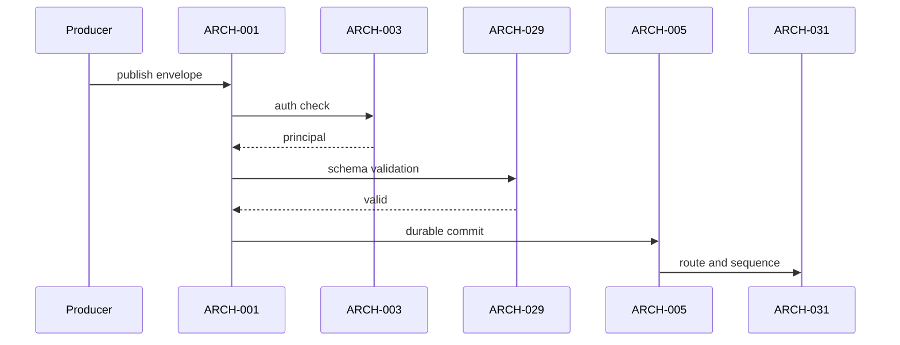
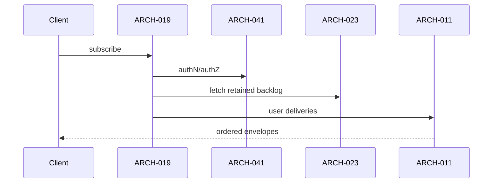

# Architecture Design: Notification Service

**Feature Branch**: `014-notification-service`
**Created**: 2026-05-10
**Status**: Draft
**Source**: `specs/014-notification-service/v-model/system-design.md`

## Overview

Architecture decomposition splits each `SYS-NNN` into ingress/control and runtime/data-path modules. This keeps contracts narrow and enables one-to-many integration test mapping without inventing extra scope.

## ID Schema

- **Architecture Module**: `ARCH-NNN` — sequential identifier, never renumbered.
- **Parent System Components**: comma-separated `SYS-NNN` list (many-to-many).
- **Cross-Cutting Tag**: `[CROSS-CUTTING]` reserved for horizontal concerns; not required for this baseline because all modules trace to SYS scope.

## Design Constraints (from FROZEN-PENDING-RESOLUTION markers)

| Constraint ID | Summary                                               |
| ------------- | ----------------------------------------------------- |
| None          | No frozen markers declared in upstream 014 artifacts. |

## Logical View — Component Breakdown (IEEE 42010 / Kruchten 4+1)

| ARCH ID  | Name                             | Description                                                | Parent System Components | Type      |
| -------- | -------------------------------- | ---------------------------------------------------------- | ------------------------ | --------- |
| ARCH-001 | SYS-001 Contract/Policy Module   | Interface boundary and policy contract for SYS-001.        | SYS-001                  | Service   |
| ARCH-002 | SYS-001 Runtime/Execution Module | Runtime processing path and state transitions for SYS-001. | SYS-001                  | Component |
| ARCH-003 | SYS-002 Contract/Policy Module   | Interface boundary and policy contract for SYS-002.        | SYS-002                  | Service   |
| ARCH-004 | SYS-002 Runtime/Execution Module | Runtime processing path and state transitions for SYS-002. | SYS-002                  | Component |
| ARCH-005 | SYS-003 Contract/Policy Module   | Interface boundary and policy contract for SYS-003.        | SYS-003                  | Service   |
| ARCH-006 | SYS-003 Runtime/Execution Module | Runtime processing path and state transitions for SYS-003. | SYS-003                  | Component |
| ARCH-007 | SYS-004 Contract/Policy Module   | Interface boundary and policy contract for SYS-004.        | SYS-004                  | Service   |
| ARCH-008 | SYS-004 Runtime/Execution Module | Runtime processing path and state transitions for SYS-004. | SYS-004                  | Component |
| ARCH-009 | SYS-005 Contract/Policy Module   | Interface boundary and policy contract for SYS-005.        | SYS-005                  | Service   |
| ARCH-010 | SYS-005 Runtime/Execution Module | Runtime processing path and state transitions for SYS-005. | SYS-005                  | Component |
| ARCH-011 | SYS-006 Contract/Policy Module   | Interface boundary and policy contract for SYS-006.        | SYS-006                  | Service   |
| ARCH-012 | SYS-006 Runtime/Execution Module | Runtime processing path and state transitions for SYS-006. | SYS-006                  | Component |
| ARCH-013 | SYS-007 Contract/Policy Module   | Interface boundary and policy contract for SYS-007.        | SYS-007                  | Service   |
| ARCH-014 | SYS-007 Runtime/Execution Module | Runtime processing path and state transitions for SYS-007. | SYS-007                  | Component |
| ARCH-015 | SYS-008 Contract/Policy Module   | Interface boundary and policy contract for SYS-008.        | SYS-008                  | Service   |
| ARCH-016 | SYS-008 Runtime/Execution Module | Runtime processing path and state transitions for SYS-008. | SYS-008                  | Component |
| ARCH-017 | SYS-009 Contract/Policy Module   | Interface boundary and policy contract for SYS-009.        | SYS-009                  | Service   |
| ARCH-018 | SYS-009 Runtime/Execution Module | Runtime processing path and state transitions for SYS-009. | SYS-009                  | Component |
| ARCH-019 | SYS-010 Contract/Policy Module   | Interface boundary and policy contract for SYS-010.        | SYS-010                  | Service   |
| ARCH-020 | SYS-010 Runtime/Execution Module | Runtime processing path and state transitions for SYS-010. | SYS-010                  | Component |
| ARCH-021 | SYS-011 Contract/Policy Module   | Interface boundary and policy contract for SYS-011.        | SYS-011                  | Service   |
| ARCH-022 | SYS-011 Runtime/Execution Module | Runtime processing path and state transitions for SYS-011. | SYS-011                  | Component |
| ARCH-023 | SYS-012 Contract/Policy Module   | Interface boundary and policy contract for SYS-012.        | SYS-012                  | Service   |
| ARCH-024 | SYS-012 Runtime/Execution Module | Runtime processing path and state transitions for SYS-012. | SYS-012                  | Component |
| ARCH-025 | SYS-013 Contract/Policy Module   | Interface boundary and policy contract for SYS-013.        | SYS-013                  | Service   |
| ARCH-026 | SYS-013 Runtime/Execution Module | Runtime processing path and state transitions for SYS-013. | SYS-013                  | Component |
| ARCH-027 | SYS-014 Contract/Policy Module   | Interface boundary and policy contract for SYS-014.        | SYS-014                  | Service   |
| ARCH-028 | SYS-014 Runtime/Execution Module | Runtime processing path and state transitions for SYS-014. | SYS-014                  | Component |
| ARCH-029 | SYS-015 Contract/Policy Module   | Interface boundary and policy contract for SYS-015.        | SYS-015                  | Service   |
| ARCH-030 | SYS-015 Runtime/Execution Module | Runtime processing path and state transitions for SYS-015. | SYS-015                  | Component |
| ARCH-031 | SYS-016 Contract/Policy Module   | Interface boundary and policy contract for SYS-016.        | SYS-016                  | Service   |
| ARCH-032 | SYS-016 Runtime/Execution Module | Runtime processing path and state transitions for SYS-016. | SYS-016                  | Component |
| ARCH-033 | SYS-017 Contract/Policy Module   | Interface boundary and policy contract for SYS-017.        | SYS-017                  | Service   |
| ARCH-034 | SYS-017 Runtime/Execution Module | Runtime processing path and state transitions for SYS-017. | SYS-017                  | Component |
| ARCH-035 | SYS-018 Contract/Policy Module   | Interface boundary and policy contract for SYS-018.        | SYS-018                  | Service   |
| ARCH-036 | SYS-018 Runtime/Execution Module | Runtime processing path and state transitions for SYS-018. | SYS-018                  | Component |
| ARCH-037 | SYS-019 Contract/Policy Module   | Interface boundary and policy contract for SYS-019.        | SYS-019                  | Service   |
| ARCH-038 | SYS-019 Runtime/Execution Module | Runtime processing path and state transitions for SYS-019. | SYS-019                  | Component |
| ARCH-039 | SYS-020 Contract/Policy Module   | Interface boundary and policy contract for SYS-020.        | SYS-020                  | Service   |
| ARCH-040 | SYS-020 Runtime/Execution Module | Runtime processing path and state transitions for SYS-020. | SYS-020                  | Component |
| ARCH-041 | SYS-021 Contract/Policy Module   | Interface boundary and policy contract for SYS-021.        | SYS-021                  | Service   |
| ARCH-042 | SYS-021 Runtime/Execution Module | Runtime processing path and state transitions for SYS-021. | SYS-021                  | Component |
| ARCH-043 | SYS-022 Contract/Policy Module   | Interface boundary and policy contract for SYS-022.        | SYS-022                  | Service   |
| ARCH-044 | SYS-022 Runtime/Execution Module | Runtime processing path and state transitions for SYS-022. | SYS-022                  | Component |
| ARCH-045 | SYS-023 Contract/Policy Module   | Interface boundary and policy contract for SYS-023.        | SYS-023                  | Service   |
| ARCH-046 | SYS-023 Runtime/Execution Module | Runtime processing path and state transitions for SYS-023. | SYS-023                  | Component |
| ARCH-047 | SYS-024 Contract/Policy Module   | Interface boundary and policy contract for SYS-024.        | SYS-024                  | Service   |
| ARCH-048 | SYS-024 Runtime/Execution Module | Runtime processing path and state transitions for SYS-024. | SYS-024                  | Component |
| ARCH-049 | SYS-025 Contract/Policy Module   | Interface boundary and policy contract for SYS-025.        | SYS-025                  | Service   |
| ARCH-050 | SYS-025 Runtime/Execution Module | Runtime processing path and state transitions for SYS-025. | SYS-025                  | Component |
| ARCH-051 | SYS-026 Contract/Policy Module   | Interface boundary and policy contract for SYS-026.        | SYS-026                  | Service   |
| ARCH-052 | SYS-026 Runtime/Execution Module | Runtime processing path and state transitions for SYS-026. | SYS-026                  | Component |
| ARCH-053 | SYS-027 Contract/Policy Module   | Interface boundary and policy contract for SYS-027.        | SYS-027                  | Service   |
| ARCH-054 | SYS-027 Runtime/Execution Module | Runtime processing path and state transitions for SYS-027. | SYS-027                  | Component |
| ARCH-055 | SYS-028 Contract/Policy Module   | Interface boundary and policy contract for SYS-028.        | SYS-028                  | Service   |
| ARCH-056 | SYS-028 Runtime/Execution Module | Runtime processing path and state transitions for SYS-028. | SYS-028                  | Component |
| ARCH-057 | SYS-029 Contract/Policy Module   | Interface boundary and policy contract for SYS-029.        | SYS-029                  | Service   |
| ARCH-058 | SYS-029 Runtime/Execution Module | Runtime processing path and state transitions for SYS-029. | SYS-029                  | Component |
| ARCH-059 | SYS-030 Contract/Policy Module   | Interface boundary and policy contract for SYS-030.        | SYS-030                  | Service   |
| ARCH-060 | SYS-030 Runtime/Execution Module | Runtime processing path and state transitions for SYS-030. | SYS-030                  | Component |
| ARCH-061 | SYS-031 Contract/Policy Module   | Interface boundary and policy contract for SYS-031.        | SYS-031                  | Service   |
| ARCH-062 | SYS-031 Runtime/Execution Module | Runtime processing path and state transitions for SYS-031. | SYS-031                  | Component |

## Process View — Dynamic Behavior (Kruchten 4+1)

### Producer Publish Path

### Subscriber Delivery + Catch-up

## Interface View — API Contracts (Kruchten 4+1)

### ARCH-001: SYS-001 Contract/Policy Module

- **Parent SYS**: SYS-001
- **Inbound Contract**: Inputs required by ARCH-001 boundary.
- **Outbound Contract**: Outputs/state effects emitted by ARCH-001 boundary.
- **Failure Contract**: Structured error path and no silent failure for ARCH-001.

### ARCH-002: SYS-001 Runtime/Execution Module

- **Parent SYS**: SYS-001
- **Inbound Contract**: Inputs required by ARCH-002 boundary.
- **Outbound Contract**: Outputs/state effects emitted by ARCH-002 boundary.
- **Failure Contract**: Structured error path and no silent failure for ARCH-002.

### ARCH-003: SYS-002 Contract/Policy Module

- **Parent SYS**: SYS-002
- **Inbound Contract**: Inputs required by ARCH-003 boundary.
- **Outbound Contract**: Outputs/state effects emitted by ARCH-003 boundary.
- **Failure Contract**: Structured error path and no silent failure for ARCH-003.

### ARCH-004: SYS-002 Runtime/Execution Module

- **Parent SYS**: SYS-002
- **Inbound Contract**: Inputs required by ARCH-004 boundary.
- **Outbound Contract**: Outputs/state effects emitted by ARCH-004 boundary.
- **Failure Contract**: Structured error path and no silent failure for ARCH-004.

### ARCH-005: SYS-003 Contract/Policy Module

- **Parent SYS**: SYS-003
- **Inbound Contract**: Inputs required by ARCH-005 boundary.
- **Outbound Contract**: Outputs/state effects emitted by ARCH-005 boundary.
- **Failure Contract**: Structured error path and no silent failure for ARCH-005.

### ARCH-006: SYS-003 Runtime/Execution Module

- **Parent SYS**: SYS-003
- **Inbound Contract**: Inputs required by ARCH-006 boundary.
- **Outbound Contract**: Outputs/state effects emitted by ARCH-006 boundary.
- **Failure Contract**: Structured error path and no silent failure for ARCH-006.

### ARCH-007: SYS-004 Contract/Policy Module

- **Parent SYS**: SYS-004
- **Inbound Contract**: Inputs required by ARCH-007 boundary.
- **Outbound Contract**: Outputs/state effects emitted by ARCH-007 boundary.
- **Failure Contract**: Structured error path and no silent failure for ARCH-007.

### ARCH-008: SYS-004 Runtime/Execution Module

- **Parent SYS**: SYS-004
- **Inbound Contract**: Inputs required by ARCH-008 boundary.
- **Outbound Contract**: Outputs/state effects emitted by ARCH-008 boundary.
- **Failure Contract**: Structured error path and no silent failure for ARCH-008.

### ARCH-009: SYS-005 Contract/Policy Module

- **Parent SYS**: SYS-005
- **Inbound Contract**: Inputs required by ARCH-009 boundary.
- **Outbound Contract**: Outputs/state effects emitted by ARCH-009 boundary.
- **Failure Contract**: Structured error path and no silent failure for ARCH-009.

### ARCH-010: SYS-005 Runtime/Execution Module

- **Parent SYS**: SYS-005
- **Inbound Contract**: Inputs required by ARCH-010 boundary.
- **Outbound Contract**: Outputs/state effects emitted by ARCH-010 boundary.
- **Failure Contract**: Structured error path and no silent failure for ARCH-010.

### ARCH-011: SYS-006 Contract/Policy Module

- **Parent SYS**: SYS-006
- **Inbound Contract**: Inputs required by ARCH-011 boundary.
- **Outbound Contract**: Outputs/state effects emitted by ARCH-011 boundary.
- **Failure Contract**: Structured error path and no silent failure for ARCH-011.

### ARCH-012: SYS-006 Runtime/Execution Module

- **Parent SYS**: SYS-006
- **Inbound Contract**: Inputs required by ARCH-012 boundary.
- **Outbound Contract**: Outputs/state effects emitted by ARCH-012 boundary.
- **Failure Contract**: Structured error path and no silent failure for ARCH-012.

### ARCH-013: SYS-007 Contract/Policy Module

- **Parent SYS**: SYS-007
- **Inbound Contract**: Inputs required by ARCH-013 boundary.
- **Outbound Contract**: Outputs/state effects emitted by ARCH-013 boundary.
- **Failure Contract**: Structured error path and no silent failure for ARCH-013.

### ARCH-014: SYS-007 Runtime/Execution Module

- **Parent SYS**: SYS-007
- **Inbound Contract**: Inputs required by ARCH-014 boundary.
- **Outbound Contract**: Outputs/state effects emitted by ARCH-014 boundary.
- **Failure Contract**: Structured error path and no silent failure for ARCH-014.

### ARCH-015: SYS-008 Contract/Policy Module

- **Parent SYS**: SYS-008
- **Inbound Contract**: Inputs required by ARCH-015 boundary.
- **Outbound Contract**: Outputs/state effects emitted by ARCH-015 boundary.
- **Failure Contract**: Structured error path and no silent failure for ARCH-015.

### ARCH-016: SYS-008 Runtime/Execution Module

- **Parent SYS**: SYS-008
- **Inbound Contract**: Inputs required by ARCH-016 boundary.
- **Outbound Contract**: Outputs/state effects emitted by ARCH-016 boundary.
- **Failure Contract**: Structured error path and no silent failure for ARCH-016.

### ARCH-017: SYS-009 Contract/Policy Module

- **Parent SYS**: SYS-009
- **Inbound Contract**: Inputs required by ARCH-017 boundary.
- **Outbound Contract**: Outputs/state effects emitted by ARCH-017 boundary.
- **Failure Contract**: Structured error path and no silent failure for ARCH-017.

### ARCH-018: SYS-009 Runtime/Execution Module

- **Parent SYS**: SYS-009
- **Inbound Contract**: Inputs required by ARCH-018 boundary.
- **Outbound Contract**: Outputs/state effects emitted by ARCH-018 boundary.
- **Failure Contract**: Structured error path and no silent failure for ARCH-018.

### ARCH-019: SYS-010 Contract/Policy Module

- **Parent SYS**: SYS-010
- **Inbound Contract**: Inputs required by ARCH-019 boundary.
- **Outbound Contract**: Outputs/state effects emitted by ARCH-019 boundary.
- **Failure Contract**: Structured error path and no silent failure for ARCH-019.

### ARCH-020: SYS-010 Runtime/Execution Module

- **Parent SYS**: SYS-010
- **Inbound Contract**: Inputs required by ARCH-020 boundary.
- **Outbound Contract**: Outputs/state effects emitted by ARCH-020 boundary.
- **Failure Contract**: Structured error path and no silent failure for ARCH-020.

### ARCH-021: SYS-011 Contract/Policy Module

- **Parent SYS**: SYS-011
- **Inbound Contract**: Inputs required by ARCH-021 boundary.
- **Outbound Contract**: Outputs/state effects emitted by ARCH-021 boundary.
- **Failure Contract**: Structured error path and no silent failure for ARCH-021.

### ARCH-022: SYS-011 Runtime/Execution Module

- **Parent SYS**: SYS-011
- **Inbound Contract**: Inputs required by ARCH-022 boundary.
- **Outbound Contract**: Outputs/state effects emitted by ARCH-022 boundary.
- **Failure Contract**: Structured error path and no silent failure for ARCH-022.

### ARCH-023: SYS-012 Contract/Policy Module

- **Parent SYS**: SYS-012
- **Inbound Contract**: Inputs required by ARCH-023 boundary.
- **Outbound Contract**: Outputs/state effects emitted by ARCH-023 boundary.
- **Failure Contract**: Structured error path and no silent failure for ARCH-023.

### ARCH-024: SYS-012 Runtime/Execution Module

- **Parent SYS**: SYS-012
- **Inbound Contract**: Inputs required by ARCH-024 boundary.
- **Outbound Contract**: Outputs/state effects emitted by ARCH-024 boundary.
- **Failure Contract**: Structured error path and no silent failure for ARCH-024.

### ARCH-025: SYS-013 Contract/Policy Module

- **Parent SYS**: SYS-013
- **Inbound Contract**: Inputs required by ARCH-025 boundary.
- **Outbound Contract**: Outputs/state effects emitted by ARCH-025 boundary.
- **Failure Contract**: Structured error path and no silent failure for ARCH-025.

### ARCH-026: SYS-013 Runtime/Execution Module

- **Parent SYS**: SYS-013
- **Inbound Contract**: Inputs required by ARCH-026 boundary.
- **Outbound Contract**: Outputs/state effects emitted by ARCH-026 boundary.
- **Failure Contract**: Structured error path and no silent failure for ARCH-026.

### ARCH-027: SYS-014 Contract/Policy Module

- **Parent SYS**: SYS-014
- **Inbound Contract**: Inputs required by ARCH-027 boundary.
- **Outbound Contract**: Outputs/state effects emitted by ARCH-027 boundary.
- **Failure Contract**: Structured error path and no silent failure for ARCH-027.

### ARCH-028: SYS-014 Runtime/Execution Module

- **Parent SYS**: SYS-014
- **Inbound Contract**: Inputs required by ARCH-028 boundary.
- **Outbound Contract**: Outputs/state effects emitted by ARCH-028 boundary.
- **Failure Contract**: Structured error path and no silent failure for ARCH-028.

### ARCH-029: SYS-015 Contract/Policy Module

- **Parent SYS**: SYS-015
- **Inbound Contract**: Inputs required by ARCH-029 boundary.
- **Outbound Contract**: Outputs/state effects emitted by ARCH-029 boundary.
- **Failure Contract**: Structured error path and no silent failure for ARCH-029.

### ARCH-030: SYS-015 Runtime/Execution Module

- **Parent SYS**: SYS-015
- **Inbound Contract**: Inputs required by ARCH-030 boundary.
- **Outbound Contract**: Outputs/state effects emitted by ARCH-030 boundary.
- **Failure Contract**: Structured error path and no silent failure for ARCH-030.

### ARCH-031: SYS-016 Contract/Policy Module

- **Parent SYS**: SYS-016
- **Inbound Contract**: Inputs required by ARCH-031 boundary.
- **Outbound Contract**: Outputs/state effects emitted by ARCH-031 boundary.
- **Failure Contract**: Structured error path and no silent failure for ARCH-031.

### ARCH-032: SYS-016 Runtime/Execution Module

- **Parent SYS**: SYS-016
- **Inbound Contract**: Inputs required by ARCH-032 boundary.
- **Outbound Contract**: Outputs/state effects emitted by ARCH-032 boundary.
- **Failure Contract**: Structured error path and no silent failure for ARCH-032.

### ARCH-033: SYS-017 Contract/Policy Module

- **Parent SYS**: SYS-017
- **Inbound Contract**: Inputs required by ARCH-033 boundary.
- **Outbound Contract**: Outputs/state effects emitted by ARCH-033 boundary.
- **Failure Contract**: Structured error path and no silent failure for ARCH-033.

### ARCH-034: SYS-017 Runtime/Execution Module

- **Parent SYS**: SYS-017
- **Inbound Contract**: Inputs required by ARCH-034 boundary.
- **Outbound Contract**: Outputs/state effects emitted by ARCH-034 boundary.
- **Failure Contract**: Structured error path and no silent failure for ARCH-034.

### ARCH-035: SYS-018 Contract/Policy Module

- **Parent SYS**: SYS-018
- **Inbound Contract**: Inputs required by ARCH-035 boundary.
- **Outbound Contract**: Outputs/state effects emitted by ARCH-035 boundary.
- **Failure Contract**: Structured error path and no silent failure for ARCH-035.

### ARCH-036: SYS-018 Runtime/Execution Module

- **Parent SYS**: SYS-018
- **Inbound Contract**: Inputs required by ARCH-036 boundary.
- **Outbound Contract**: Outputs/state effects emitted by ARCH-036 boundary.
- **Failure Contract**: Structured error path and no silent failure for ARCH-036.

### ARCH-037: SYS-019 Contract/Policy Module

- **Parent SYS**: SYS-019
- **Inbound Contract**: Inputs required by ARCH-037 boundary.
- **Outbound Contract**: Outputs/state effects emitted by ARCH-037 boundary.
- **Failure Contract**: Structured error path and no silent failure for ARCH-037.

### ARCH-038: SYS-019 Runtime/Execution Module

- **Parent SYS**: SYS-019
- **Inbound Contract**: Inputs required by ARCH-038 boundary.
- **Outbound Contract**: Outputs/state effects emitted by ARCH-038 boundary.
- **Failure Contract**: Structured error path and no silent failure for ARCH-038.

### ARCH-039: SYS-020 Contract/Policy Module

- **Parent SYS**: SYS-020
- **Inbound Contract**: Inputs required by ARCH-039 boundary.
- **Outbound Contract**: Outputs/state effects emitted by ARCH-039 boundary.
- **Failure Contract**: Structured error path and no silent failure for ARCH-039.

### ARCH-040: SYS-020 Runtime/Execution Module

- **Parent SYS**: SYS-020
- **Inbound Contract**: Inputs required by ARCH-040 boundary.
- **Outbound Contract**: Outputs/state effects emitted by ARCH-040 boundary.
- **Failure Contract**: Structured error path and no silent failure for ARCH-040.

### ARCH-041: SYS-021 Contract/Policy Module

- **Parent SYS**: SYS-021
- **Inbound Contract**: Inputs required by ARCH-041 boundary.
- **Outbound Contract**: Outputs/state effects emitted by ARCH-041 boundary.
- **Failure Contract**: Structured error path and no silent failure for ARCH-041.

### ARCH-042: SYS-021 Runtime/Execution Module

- **Parent SYS**: SYS-021
- **Inbound Contract**: Inputs required by ARCH-042 boundary.
- **Outbound Contract**: Outputs/state effects emitted by ARCH-042 boundary.
- **Failure Contract**: Structured error path and no silent failure for ARCH-042.

### ARCH-043: SYS-022 Contract/Policy Module

- **Parent SYS**: SYS-022
- **Inbound Contract**: Inputs required by ARCH-043 boundary.
- **Outbound Contract**: Outputs/state effects emitted by ARCH-043 boundary.
- **Failure Contract**: Structured error path and no silent failure for ARCH-043.

### ARCH-044: SYS-022 Runtime/Execution Module

- **Parent SYS**: SYS-022
- **Inbound Contract**: Inputs required by ARCH-044 boundary.
- **Outbound Contract**: Outputs/state effects emitted by ARCH-044 boundary.
- **Failure Contract**: Structured error path and no silent failure for ARCH-044.

### ARCH-045: SYS-023 Contract/Policy Module

- **Parent SYS**: SYS-023
- **Inbound Contract**: Inputs required by ARCH-045 boundary.
- **Outbound Contract**: Outputs/state effects emitted by ARCH-045 boundary.
- **Failure Contract**: Structured error path and no silent failure for ARCH-045.

### ARCH-046: SYS-023 Runtime/Execution Module

- **Parent SYS**: SYS-023
- **Inbound Contract**: Inputs required by ARCH-046 boundary.
- **Outbound Contract**: Outputs/state effects emitted by ARCH-046 boundary.
- **Failure Contract**: Structured error path and no silent failure for ARCH-046.

### ARCH-047: SYS-024 Contract/Policy Module

- **Parent SYS**: SYS-024
- **Inbound Contract**: Inputs required by ARCH-047 boundary.
- **Outbound Contract**: Outputs/state effects emitted by ARCH-047 boundary.
- **Failure Contract**: Structured error path and no silent failure for ARCH-047.

### ARCH-048: SYS-024 Runtime/Execution Module

- **Parent SYS**: SYS-024
- **Inbound Contract**: Inputs required by ARCH-048 boundary.
- **Outbound Contract**: Outputs/state effects emitted by ARCH-048 boundary.
- **Failure Contract**: Structured error path and no silent failure for ARCH-048.

### ARCH-049: SYS-025 Contract/Policy Module

- **Parent SYS**: SYS-025
- **Inbound Contract**: Inputs required by ARCH-049 boundary.
- **Outbound Contract**: Outputs/state effects emitted by ARCH-049 boundary.
- **Failure Contract**: Structured error path and no silent failure for ARCH-049.

### ARCH-050: SYS-025 Runtime/Execution Module

- **Parent SYS**: SYS-025
- **Inbound Contract**: Inputs required by ARCH-050 boundary.
- **Outbound Contract**: Outputs/state effects emitted by ARCH-050 boundary.
- **Failure Contract**: Structured error path and no silent failure for ARCH-050.

### ARCH-051: SYS-026 Contract/Policy Module

- **Parent SYS**: SYS-026
- **Inbound Contract**: Inputs required by ARCH-051 boundary.
- **Outbound Contract**: Outputs/state effects emitted by ARCH-051 boundary.
- **Failure Contract**: Structured error path and no silent failure for ARCH-051.

### ARCH-052: SYS-026 Runtime/Execution Module

- **Parent SYS**: SYS-026
- **Inbound Contract**: Inputs required by ARCH-052 boundary.
- **Outbound Contract**: Outputs/state effects emitted by ARCH-052 boundary.
- **Failure Contract**: Structured error path and no silent failure for ARCH-052.

### ARCH-053: SYS-027 Contract/Policy Module

- **Parent SYS**: SYS-027
- **Inbound Contract**: Inputs required by ARCH-053 boundary.
- **Outbound Contract**: Outputs/state effects emitted by ARCH-053 boundary.
- **Failure Contract**: Structured error path and no silent failure for ARCH-053.

### ARCH-054: SYS-027 Runtime/Execution Module

- **Parent SYS**: SYS-027
- **Inbound Contract**: Inputs required by ARCH-054 boundary.
- **Outbound Contract**: Outputs/state effects emitted by ARCH-054 boundary.
- **Failure Contract**: Structured error path and no silent failure for ARCH-054.

### ARCH-055: SYS-028 Contract/Policy Module

- **Parent SYS**: SYS-028
- **Inbound Contract**: Inputs required by ARCH-055 boundary.
- **Outbound Contract**: Outputs/state effects emitted by ARCH-055 boundary.
- **Failure Contract**: Structured error path and no silent failure for ARCH-055.

### ARCH-056: SYS-028 Runtime/Execution Module

- **Parent SYS**: SYS-028
- **Inbound Contract**: Inputs required by ARCH-056 boundary.
- **Outbound Contract**: Outputs/state effects emitted by ARCH-056 boundary.
- **Failure Contract**: Structured error path and no silent failure for ARCH-056.

### ARCH-057: SYS-029 Contract/Policy Module

- **Parent SYS**: SYS-029
- **Inbound Contract**: Inputs required by ARCH-057 boundary.
- **Outbound Contract**: Outputs/state effects emitted by ARCH-057 boundary.
- **Failure Contract**: Structured error path and no silent failure for ARCH-057.

### ARCH-058: SYS-029 Runtime/Execution Module

- **Parent SYS**: SYS-029
- **Inbound Contract**: Inputs required by ARCH-058 boundary.
- **Outbound Contract**: Outputs/state effects emitted by ARCH-058 boundary.
- **Failure Contract**: Structured error path and no silent failure for ARCH-058.

### ARCH-059: SYS-030 Contract/Policy Module

- **Parent SYS**: SYS-030
- **Inbound Contract**: Inputs required by ARCH-059 boundary.
- **Outbound Contract**: Outputs/state effects emitted by ARCH-059 boundary.
- **Failure Contract**: Structured error path and no silent failure for ARCH-059.

### ARCH-060: SYS-030 Runtime/Execution Module

- **Parent SYS**: SYS-030
- **Inbound Contract**: Inputs required by ARCH-060 boundary.
- **Outbound Contract**: Outputs/state effects emitted by ARCH-060 boundary.
- **Failure Contract**: Structured error path and no silent failure for ARCH-060.

### ARCH-061: SYS-031 Contract/Policy Module

- **Parent SYS**: SYS-031
- **Inbound Contract**: Inputs required by ARCH-061 boundary.
- **Outbound Contract**: Outputs/state effects emitted by ARCH-061 boundary.
- **Failure Contract**: Structured error path and no silent failure for ARCH-061.

### ARCH-062: SYS-031 Runtime/Execution Module

- **Parent SYS**: SYS-031
- **Inbound Contract**: Inputs required by ARCH-062 boundary.
- **Outbound Contract**: Outputs/state effects emitted by ARCH-062 boundary.
- **Failure Contract**: Structured error path and no silent failure for ARCH-062.

## Data Flow View — Information Lifecycle (Kruchten 4+1)

| Flow                            | Source Modules               | Sink Modules                 | Data Contract                                                   |
| ------------------------------- | ---------------------------- | ---------------------------- | --------------------------------------------------------------- |
| Publish ingress flow            | ARCH-001, ARCH-003, ARCH-029 | ARCH-005, ARCH-031, ARCH-035 | Validated PublishEnvelope with producer principal context.      |
| Recipient routing flow          | ARCH-031, ARCH-033, ARCH-035 | ARCH-011, ARCH-013, ARCH-015 | Recipient-scoped delivery stream with ordering key.             |
| Subscriber catch-up flow        | ARCH-019, ARCH-041, ARCH-023 | ARCH-011, ARCH-013           | Retained undelivered envelope replay by authenticated identity. |
| Registry and observability flow | ARCH-039, ARCH-041, ARCH-051 | ARCH-053, ARCH-057, ARCH-061 | Registry state, counters, SLO metrics, and readiness evidence.  |

## Coverage Summary

| Metric                     | Value        |
| -------------------------- | ------------ |
| Total System Components    | 31           |
| Total Architecture Modules | 62           |
| SYS → ARCH Coverage        | 31/31 (100%) |
