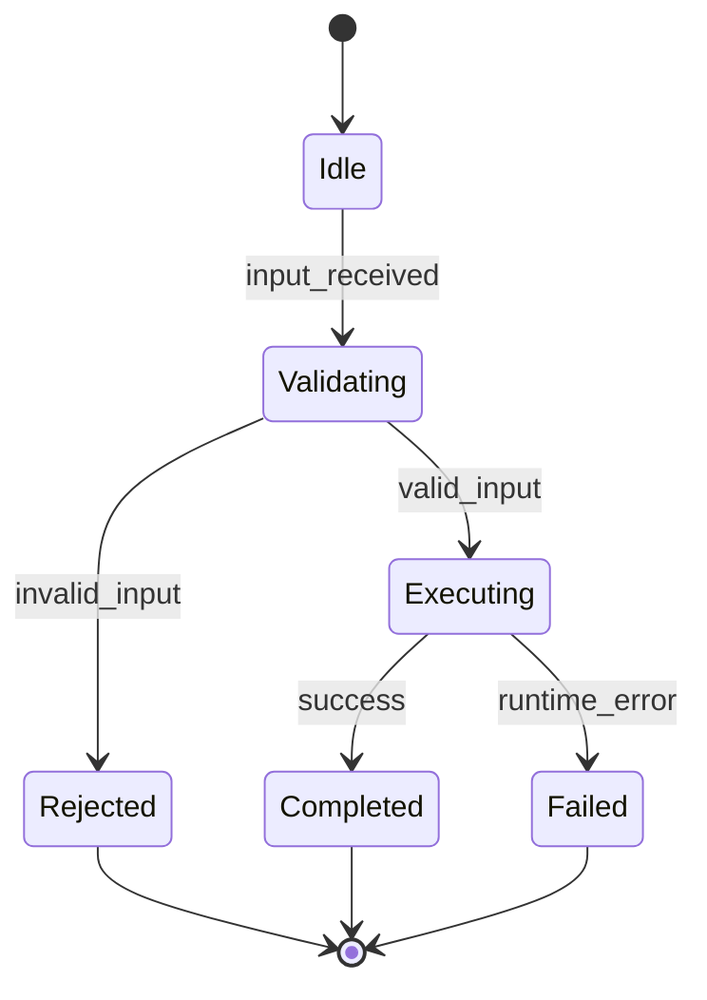

# Module Design: Notification Service

**Feature Branch**: `014-notification-service`
**Created**: 2026-05-10
**Status**: Draft
**Source**: `specs/014-notification-service/v-model/architecture-design.md`

## Overview

Low-level module designs map 1:1 with architecture modules to preserve deterministic lineage (`ARCH-NNN` → `MOD-NNN`). All modules include the four mandatory views.

## ID Schema

- **Module Design**: `MOD-NNN` — sequential 3-digit ID, never renumbered.
- **Parent Architecture Modules**: authoritative traceability field.
- **Target Source File(s)**: planned implementation paths (specification only; no source edits in this task).

## Module Inventory

| MOD ID  | Name                                           | Parent Architecture Modules | Type      |
| ------- | ---------------------------------------------- | --------------------------- | --------- |
| MOD-001 | SYS-001 Contract/Policy Module Module Design   | ARCH-001                    | Service   |
| MOD-002 | SYS-001 Runtime/Execution Module Module Design | ARCH-002                    | Component |
| MOD-003 | SYS-002 Contract/Policy Module Module Design   | ARCH-003                    | Service   |
| MOD-004 | SYS-002 Runtime/Execution Module Module Design | ARCH-004                    | Component |
| MOD-005 | SYS-003 Contract/Policy Module Module Design   | ARCH-005                    | Service   |
| MOD-006 | SYS-003 Runtime/Execution Module Module Design | ARCH-006                    | Component |
| MOD-007 | SYS-004 Contract/Policy Module Module Design   | ARCH-007                    | Service   |
| MOD-008 | SYS-004 Runtime/Execution Module Module Design | ARCH-008                    | Component |
| MOD-009 | SYS-005 Contract/Policy Module Module Design   | ARCH-009                    | Service   |
| MOD-010 | SYS-005 Runtime/Execution Module Module Design | ARCH-010                    | Component |
| MOD-011 | SYS-006 Contract/Policy Module Module Design   | ARCH-011                    | Service   |
| MOD-012 | SYS-006 Runtime/Execution Module Module Design | ARCH-012                    | Component |
| MOD-013 | SYS-007 Contract/Policy Module Module Design   | ARCH-013                    | Service   |
| MOD-014 | SYS-007 Runtime/Execution Module Module Design | ARCH-014                    | Component |
| MOD-015 | SYS-008 Contract/Policy Module Module Design   | ARCH-015                    | Service   |
| MOD-016 | SYS-008 Runtime/Execution Module Module Design | ARCH-016                    | Component |
| MOD-017 | SYS-009 Contract/Policy Module Module Design   | ARCH-017                    | Service   |
| MOD-018 | SYS-009 Runtime/Execution Module Module Design | ARCH-018                    | Component |
| MOD-019 | SYS-010 Contract/Policy Module Module Design   | ARCH-019                    | Service   |
| MOD-020 | SYS-010 Runtime/Execution Module Module Design | ARCH-020                    | Component |
| MOD-021 | SYS-011 Contract/Policy Module Module Design   | ARCH-021                    | Service   |
| MOD-022 | SYS-011 Runtime/Execution Module Module Design | ARCH-022                    | Component |
| MOD-023 | SYS-012 Contract/Policy Module Module Design   | ARCH-023                    | Service   |
| MOD-024 | SYS-012 Runtime/Execution Module Module Design | ARCH-024                    | Component |
| MOD-025 | SYS-013 Contract/Policy Module Module Design   | ARCH-025                    | Service   |
| MOD-026 | SYS-013 Runtime/Execution Module Module Design | ARCH-026                    | Component |
| MOD-027 | SYS-014 Contract/Policy Module Module Design   | ARCH-027                    | Service   |
| MOD-028 | SYS-014 Runtime/Execution Module Module Design | ARCH-028                    | Component |
| MOD-029 | SYS-015 Contract/Policy Module Module Design   | ARCH-029                    | Service   |
| MOD-030 | SYS-015 Runtime/Execution Module Module Design | ARCH-030                    | Component |
| MOD-031 | SYS-016 Contract/Policy Module Module Design   | ARCH-031                    | Service   |
| MOD-032 | SYS-016 Runtime/Execution Module Module Design | ARCH-032                    | Component |
| MOD-033 | SYS-017 Contract/Policy Module Module Design   | ARCH-033                    | Service   |
| MOD-034 | SYS-017 Runtime/Execution Module Module Design | ARCH-034                    | Component |
| MOD-035 | SYS-018 Contract/Policy Module Module Design   | ARCH-035                    | Service   |
| MOD-036 | SYS-018 Runtime/Execution Module Module Design | ARCH-036                    | Component |
| MOD-037 | SYS-019 Contract/Policy Module Module Design   | ARCH-037                    | Service   |
| MOD-038 | SYS-019 Runtime/Execution Module Module Design | ARCH-038                    | Component |
| MOD-039 | SYS-020 Contract/Policy Module Module Design   | ARCH-039                    | Service   |
| MOD-040 | SYS-020 Runtime/Execution Module Module Design | ARCH-040                    | Component |
| MOD-041 | SYS-021 Contract/Policy Module Module Design   | ARCH-041                    | Service   |
| MOD-042 | SYS-021 Runtime/Execution Module Module Design | ARCH-042                    | Component |
| MOD-043 | SYS-022 Contract/Policy Module Module Design   | ARCH-043                    | Service   |
| MOD-044 | SYS-022 Runtime/Execution Module Module Design | ARCH-044                    | Component |
| MOD-045 | SYS-023 Contract/Policy Module Module Design   | ARCH-045                    | Service   |
| MOD-046 | SYS-023 Runtime/Execution Module Module Design | ARCH-046                    | Component |
| MOD-047 | SYS-024 Contract/Policy Module Module Design   | ARCH-047                    | Service   |
| MOD-048 | SYS-024 Runtime/Execution Module Module Design | ARCH-048                    | Component |
| MOD-049 | SYS-025 Contract/Policy Module Module Design   | ARCH-049                    | Service   |
| MOD-050 | SYS-025 Runtime/Execution Module Module Design | ARCH-050                    | Component |
| MOD-051 | SYS-026 Contract/Policy Module Module Design   | ARCH-051                    | Service   |
| MOD-052 | SYS-026 Runtime/Execution Module Module Design | ARCH-052                    | Component |
| MOD-053 | SYS-027 Contract/Policy Module Module Design   | ARCH-053                    | Service   |
| MOD-054 | SYS-027 Runtime/Execution Module Module Design | ARCH-054                    | Component |
| MOD-055 | SYS-028 Contract/Policy Module Module Design   | ARCH-055                    | Service   |
| MOD-056 | SYS-028 Runtime/Execution Module Module Design | ARCH-056                    | Component |
| MOD-057 | SYS-029 Contract/Policy Module Module Design   | ARCH-057                    | Service   |
| MOD-058 | SYS-029 Runtime/Execution Module Module Design | ARCH-058                    | Component |
| MOD-059 | SYS-030 Contract/Policy Module Module Design   | ARCH-059                    | Service   |
| MOD-060 | SYS-030 Runtime/Execution Module Module Design | ARCH-060                    | Component |
| MOD-061 | SYS-031 Contract/Policy Module Module Design   | ARCH-061                    | Service   |
| MOD-062 | SYS-031 Runtime/Execution Module Module Design | ARCH-062                    | Component |

## Module Designs

### Module: MOD-001 (SYS-001 Contract/Policy Module Module Design)

**Parent Architecture Modules**: ARCH-001
**Target Source File(s)**: `specs/014-notification-service/implementation/mod-001.md`

#### Algorithmic / Logic View

```pseudocode
INPUT: contractInput, runtimeState
IF contractInput is invalid THEN
  RETURN structured_error
END IF
policy = evaluatePolicy(contractInput, runtimeState)
result = executeRuntimePath(policy, contractInput)
emitTelemetry(result)
RETURN result
```

#### State Machine View



#### Internal Data Structures View

| Structure       | Fields                               | Constraints                            |
| --------------- | ------------------------------------ | -------------------------------------- |
| ModuleInput     | `id`, `kind`, `timestamp`, `payload` | `id` non-empty, `timestamp` ISO-8601.  |
| ModuleResult    | `status`, `reason`, `artifacts[]`    | `status` in {success,rejected,failed}. |
| ModuleTelemetry | `metric`, `labels`, `value`          | Emitted on every terminal state.       |

#### Error Handling View

| Error Code        | Trigger                                     | Handling                                                          | Observability                    |
| ----------------- | ------------------------------------------- | ----------------------------------------------------------------- | -------------------------------- |
| `invalid_input`   | Contract validation failure                 | Return structured 4xx-style error; no durable side effect.        | Counter increment + warning log. |
| `policy_denied`   | Auth/quota/registry/policy rule denies flow | Reject with explicit reason and policy context.                   | Counter increment + audit log.   |
| `runtime_failure` | Downstream transient/persistent failure     | Return/propagate structured failure and preserve retry semantics. | Error log + failure counter.     |

### Module: MOD-002 (SYS-001 Runtime/Execution Module Module Design)

**Parent Architecture Modules**: ARCH-002
**Target Source File(s)**: `specs/014-notification-service/implementation/mod-002.md`

#### Algorithmic / Logic View

```pseudocode
INPUT: contractInput, runtimeState
IF contractInput is invalid THEN
  RETURN structured_error
END IF
policy = evaluatePolicy(contractInput, runtimeState)
result = executeRuntimePath(policy, contractInput)
emitTelemetry(result)
RETURN result
```

#### State Machine View


#### Internal Data Structures View

| Structure       | Fields                               | Constraints                            |
| --------------- | ------------------------------------ | -------------------------------------- |
| ModuleInput     | `id`, `kind`, `timestamp`, `payload` | `id` non-empty, `timestamp` ISO-8601.  |
| ModuleResult    | `status`, `reason`, `artifacts[]`    | `status` in {success,rejected,failed}. |
| ModuleTelemetry | `metric`, `labels`, `value`          | Emitted on every terminal state.       |

#### Error Handling View

| Error Code        | Trigger                                     | Handling                                                          | Observability                    |
| ----------------- | ------------------------------------------- | ----------------------------------------------------------------- | -------------------------------- |
| `invalid_input`   | Contract validation failure                 | Return structured 4xx-style error; no durable side effect.        | Counter increment + warning log. |
| `policy_denied`   | Auth/quota/registry/policy rule denies flow | Reject with explicit reason and policy context.                   | Counter increment + audit log.   |
| `runtime_failure` | Downstream transient/persistent failure     | Return/propagate structured failure and preserve retry semantics. | Error log + failure counter.     |

### Module: MOD-003 (SYS-002 Contract/Policy Module Module Design)

**Parent Architecture Modules**: ARCH-003
**Target Source File(s)**: `specs/014-notification-service/implementation/mod-003.md`

#### Algorithmic / Logic View

```pseudocode
INPUT: contractInput, runtimeState
IF contractInput is invalid THEN
  RETURN structured_error
END IF
policy = evaluatePolicy(contractInput, runtimeState)
result = executeRuntimePath(policy, contractInput)
emitTelemetry(result)
RETURN result
```

#### State Machine View


#### Internal Data Structures View

| Structure       | Fields                               | Constraints                            |
| --------------- | ------------------------------------ | -------------------------------------- |
| ModuleInput     | `id`, `kind`, `timestamp`, `payload` | `id` non-empty, `timestamp` ISO-8601.  |
| ModuleResult    | `status`, `reason`, `artifacts[]`    | `status` in {success,rejected,failed}. |
| ModuleTelemetry | `metric`, `labels`, `value`          | Emitted on every terminal state.       |

#### Error Handling View

| Error Code        | Trigger                                     | Handling                                                          | Observability                    |
| ----------------- | ------------------------------------------- | ----------------------------------------------------------------- | -------------------------------- |
| `invalid_input`   | Contract validation failure                 | Return structured 4xx-style error; no durable side effect.        | Counter increment + warning log. |
| `policy_denied`   | Auth/quota/registry/policy rule denies flow | Reject with explicit reason and policy context.                   | Counter increment + audit log.   |
| `runtime_failure` | Downstream transient/persistent failure     | Return/propagate structured failure and preserve retry semantics. | Error log + failure counter.     |

### Module: MOD-004 (SYS-002 Runtime/Execution Module Module Design)

**Parent Architecture Modules**: ARCH-004
**Target Source File(s)**: `specs/014-notification-service/implementation/mod-004.md`

#### Algorithmic / Logic View

```pseudocode
INPUT: contractInput, runtimeState
IF contractInput is invalid THEN
  RETURN structured_error
END IF
policy = evaluatePolicy(contractInput, runtimeState)
result = executeRuntimePath(policy, contractInput)
emitTelemetry(result)
RETURN result
```

#### State Machine View


#### Internal Data Structures View

| Structure       | Fields                               | Constraints                            |
| --------------- | ------------------------------------ | -------------------------------------- |
| ModuleInput     | `id`, `kind`, `timestamp`, `payload` | `id` non-empty, `timestamp` ISO-8601.  |
| ModuleResult    | `status`, `reason`, `artifacts[]`    | `status` in {success,rejected,failed}. |
| ModuleTelemetry | `metric`, `labels`, `value`          | Emitted on every terminal state.       |

#### Error Handling View

| Error Code        | Trigger                                     | Handling                                                          | Observability                    |
| ----------------- | ------------------------------------------- | ----------------------------------------------------------------- | -------------------------------- |
| `invalid_input`   | Contract validation failure                 | Return structured 4xx-style error; no durable side effect.        | Counter increment + warning log. |
| `policy_denied`   | Auth/quota/registry/policy rule denies flow | Reject with explicit reason and policy context.                   | Counter increment + audit log.   |
| `runtime_failure` | Downstream transient/persistent failure     | Return/propagate structured failure and preserve retry semantics. | Error log + failure counter.     |

### Module: MOD-005 (SYS-003 Contract/Policy Module Module Design)

**Parent Architecture Modules**: ARCH-005
**Target Source File(s)**: `specs/014-notification-service/implementation/mod-005.md`

#### Algorithmic / Logic View

```pseudocode
INPUT: contractInput, runtimeState
IF contractInput is invalid THEN
  RETURN structured_error
END IF
policy = evaluatePolicy(contractInput, runtimeState)
result = executeRuntimePath(policy, contractInput)
emitTelemetry(result)
RETURN result
```

#### State Machine View


#### Internal Data Structures View

| Structure       | Fields                               | Constraints                            |
| --------------- | ------------------------------------ | -------------------------------------- |
| ModuleInput     | `id`, `kind`, `timestamp`, `payload` | `id` non-empty, `timestamp` ISO-8601.  |
| ModuleResult    | `status`, `reason`, `artifacts[]`    | `status` in {success,rejected,failed}. |
| ModuleTelemetry | `metric`, `labels`, `value`          | Emitted on every terminal state.       |

#### Error Handling View

| Error Code        | Trigger                                     | Handling                                                          | Observability                    |
| ----------------- | ------------------------------------------- | ----------------------------------------------------------------- | -------------------------------- |
| `invalid_input`   | Contract validation failure                 | Return structured 4xx-style error; no durable side effect.        | Counter increment + warning log. |
| `policy_denied`   | Auth/quota/registry/policy rule denies flow | Reject with explicit reason and policy context.                   | Counter increment + audit log.   |
| `runtime_failure` | Downstream transient/persistent failure     | Return/propagate structured failure and preserve retry semantics. | Error log + failure counter.     |

### Module: MOD-006 (SYS-003 Runtime/Execution Module Module Design)

**Parent Architecture Modules**: ARCH-006
**Target Source File(s)**: `specs/014-notification-service/implementation/mod-006.md`

#### Algorithmic / Logic View

```pseudocode
INPUT: contractInput, runtimeState
IF contractInput is invalid THEN
  RETURN structured_error
END IF
policy = evaluatePolicy(contractInput, runtimeState)
result = executeRuntimePath(policy, contractInput)
emitTelemetry(result)
RETURN result
```

#### State Machine View


#### Internal Data Structures View

| Structure       | Fields                               | Constraints                            |
| --------------- | ------------------------------------ | -------------------------------------- |
| ModuleInput     | `id`, `kind`, `timestamp`, `payload` | `id` non-empty, `timestamp` ISO-8601.  |
| ModuleResult    | `status`, `reason`, `artifacts[]`    | `status` in {success,rejected,failed}. |
| ModuleTelemetry | `metric`, `labels`, `value`          | Emitted on every terminal state.       |

#### Error Handling View

| Error Code        | Trigger                                     | Handling                                                          | Observability                    |
| ----------------- | ------------------------------------------- | ----------------------------------------------------------------- | -------------------------------- |
| `invalid_input`   | Contract validation failure                 | Return structured 4xx-style error; no durable side effect.        | Counter increment + warning log. |
| `policy_denied`   | Auth/quota/registry/policy rule denies flow | Reject with explicit reason and policy context.                   | Counter increment + audit log.   |
| `runtime_failure` | Downstream transient/persistent failure     | Return/propagate structured failure and preserve retry semantics. | Error log + failure counter.     |

### Module: MOD-007 (SYS-004 Contract/Policy Module Module Design)

**Parent Architecture Modules**: ARCH-007
**Target Source File(s)**: `specs/014-notification-service/implementation/mod-007.md`

#### Algorithmic / Logic View

```pseudocode
INPUT: contractInput, runtimeState
IF contractInput is invalid THEN
  RETURN structured_error
END IF
policy = evaluatePolicy(contractInput, runtimeState)
result = executeRuntimePath(policy, contractInput)
emitTelemetry(result)
RETURN result
```

#### State Machine View


#### Internal Data Structures View

| Structure       | Fields                               | Constraints                            |
| --------------- | ------------------------------------ | -------------------------------------- |
| ModuleInput     | `id`, `kind`, `timestamp`, `payload` | `id` non-empty, `timestamp` ISO-8601.  |
| ModuleResult    | `status`, `reason`, `artifacts[]`    | `status` in {success,rejected,failed}. |
| ModuleTelemetry | `metric`, `labels`, `value`          | Emitted on every terminal state.       |

#### Error Handling View

| Error Code        | Trigger                                     | Handling                                                          | Observability                    |
| ----------------- | ------------------------------------------- | ----------------------------------------------------------------- | -------------------------------- |
| `invalid_input`   | Contract validation failure                 | Return structured 4xx-style error; no durable side effect.        | Counter increment + warning log. |
| `policy_denied`   | Auth/quota/registry/policy rule denies flow | Reject with explicit reason and policy context.                   | Counter increment + audit log.   |
| `runtime_failure` | Downstream transient/persistent failure     | Return/propagate structured failure and preserve retry semantics. | Error log + failure counter.     |

### Module: MOD-008 (SYS-004 Runtime/Execution Module Module Design)

**Parent Architecture Modules**: ARCH-008
**Target Source File(s)**: `specs/014-notification-service/implementation/mod-008.md`

#### Algorithmic / Logic View

```pseudocode
INPUT: contractInput, runtimeState
IF contractInput is invalid THEN
  RETURN structured_error
END IF
policy = evaluatePolicy(contractInput, runtimeState)
result = executeRuntimePath(policy, contractInput)
emitTelemetry(result)
RETURN result
```

#### State Machine View


#### Internal Data Structures View

| Structure       | Fields                               | Constraints                            |
| --------------- | ------------------------------------ | -------------------------------------- |
| ModuleInput     | `id`, `kind`, `timestamp`, `payload` | `id` non-empty, `timestamp` ISO-8601.  |
| ModuleResult    | `status`, `reason`, `artifacts[]`    | `status` in {success,rejected,failed}. |
| ModuleTelemetry | `metric`, `labels`, `value`          | Emitted on every terminal state.       |

#### Error Handling View

| Error Code        | Trigger                                     | Handling                                                          | Observability                    |
| ----------------- | ------------------------------------------- | ----------------------------------------------------------------- | -------------------------------- |
| `invalid_input`   | Contract validation failure                 | Return structured 4xx-style error; no durable side effect.        | Counter increment + warning log. |
| `policy_denied`   | Auth/quota/registry/policy rule denies flow | Reject with explicit reason and policy context.                   | Counter increment + audit log.   |
| `runtime_failure` | Downstream transient/persistent failure     | Return/propagate structured failure and preserve retry semantics. | Error log + failure counter.     |

### Module: MOD-009 (SYS-005 Contract/Policy Module Module Design)

**Parent Architecture Modules**: ARCH-009
**Target Source File(s)**: `specs/014-notification-service/implementation/mod-009.md`

#### Algorithmic / Logic View

```pseudocode
INPUT: contractInput, runtimeState
IF contractInput is invalid THEN
  RETURN structured_error
END IF
policy = evaluatePolicy(contractInput, runtimeState)
result = executeRuntimePath(policy, contractInput)
emitTelemetry(result)
RETURN result
```

#### State Machine View


#### Internal Data Structures View

| Structure       | Fields                               | Constraints                            |
| --------------- | ------------------------------------ | -------------------------------------- |
| ModuleInput     | `id`, `kind`, `timestamp`, `payload` | `id` non-empty, `timestamp` ISO-8601.  |
| ModuleResult    | `status`, `reason`, `artifacts[]`    | `status` in {success,rejected,failed}. |
| ModuleTelemetry | `metric`, `labels`, `value`          | Emitted on every terminal state.       |

#### Error Handling View

| Error Code        | Trigger                                     | Handling                                                          | Observability                    |
| ----------------- | ------------------------------------------- | ----------------------------------------------------------------- | -------------------------------- |
| `invalid_input`   | Contract validation failure                 | Return structured 4xx-style error; no durable side effect.        | Counter increment + warning log. |
| `policy_denied`   | Auth/quota/registry/policy rule denies flow | Reject with explicit reason and policy context.                   | Counter increment + audit log.   |
| `runtime_failure` | Downstream transient/persistent failure     | Return/propagate structured failure and preserve retry semantics. | Error log + failure counter.     |

### Module: MOD-010 (SYS-005 Runtime/Execution Module Module Design)

**Parent Architecture Modules**: ARCH-010
**Target Source File(s)**: `specs/014-notification-service/implementation/mod-010.md`

#### Algorithmic / Logic View

```pseudocode
INPUT: contractInput, runtimeState
IF contractInput is invalid THEN
  RETURN structured_error
END IF
policy = evaluatePolicy(contractInput, runtimeState)
result = executeRuntimePath(policy, contractInput)
emitTelemetry(result)
RETURN result
```

#### State Machine View


#### Internal Data Structures View

| Structure       | Fields                               | Constraints                            |
| --------------- | ------------------------------------ | -------------------------------------- |
| ModuleInput     | `id`, `kind`, `timestamp`, `payload` | `id` non-empty, `timestamp` ISO-8601.  |
| ModuleResult    | `status`, `reason`, `artifacts[]`    | `status` in {success,rejected,failed}. |
| ModuleTelemetry | `metric`, `labels`, `value`          | Emitted on every terminal state.       |

#### Error Handling View

| Error Code        | Trigger                                     | Handling                                                          | Observability                    |
| ----------------- | ------------------------------------------- | ----------------------------------------------------------------- | -------------------------------- |
| `invalid_input`   | Contract validation failure                 | Return structured 4xx-style error; no durable side effect.        | Counter increment + warning log. |
| `policy_denied`   | Auth/quota/registry/policy rule denies flow | Reject with explicit reason and policy context.                   | Counter increment + audit log.   |
| `runtime_failure` | Downstream transient/persistent failure     | Return/propagate structured failure and preserve retry semantics. | Error log + failure counter.     |

### Module: MOD-011 (SYS-006 Contract/Policy Module Module Design)

**Parent Architecture Modules**: ARCH-011
**Target Source File(s)**: `specs/014-notification-service/implementation/mod-011.md`

#### Algorithmic / Logic View

```pseudocode
INPUT: contractInput, runtimeState
IF contractInput is invalid THEN
  RETURN structured_error
END IF
policy = evaluatePolicy(contractInput, runtimeState)
result = executeRuntimePath(policy, contractInput)
emitTelemetry(result)
RETURN result
```

#### State Machine View


#### Internal Data Structures View

| Structure       | Fields                               | Constraints                            |
| --------------- | ------------------------------------ | -------------------------------------- |
| ModuleInput     | `id`, `kind`, `timestamp`, `payload` | `id` non-empty, `timestamp` ISO-8601.  |
| ModuleResult    | `status`, `reason`, `artifacts[]`    | `status` in {success,rejected,failed}. |
| ModuleTelemetry | `metric`, `labels`, `value`          | Emitted on every terminal state.       |

#### Error Handling View

| Error Code        | Trigger                                     | Handling                                                          | Observability                    |
| ----------------- | ------------------------------------------- | ----------------------------------------------------------------- | -------------------------------- |
| `invalid_input`   | Contract validation failure                 | Return structured 4xx-style error; no durable side effect.        | Counter increment + warning log. |
| `policy_denied`   | Auth/quota/registry/policy rule denies flow | Reject with explicit reason and policy context.                   | Counter increment + audit log.   |
| `runtime_failure` | Downstream transient/persistent failure     | Return/propagate structured failure and preserve retry semantics. | Error log + failure counter.     |

### Module: MOD-012 (SYS-006 Runtime/Execution Module Module Design)

**Parent Architecture Modules**: ARCH-012
**Target Source File(s)**: `specs/014-notification-service/implementation/mod-012.md`

#### Algorithmic / Logic View

```pseudocode
INPUT: contractInput, runtimeState
IF contractInput is invalid THEN
  RETURN structured_error
END IF
policy = evaluatePolicy(contractInput, runtimeState)
result = executeRuntimePath(policy, contractInput)
emitTelemetry(result)
RETURN result
```

#### State Machine View


#### Internal Data Structures View

| Structure       | Fields                               | Constraints                            |
| --------------- | ------------------------------------ | -------------------------------------- |
| ModuleInput     | `id`, `kind`, `timestamp`, `payload` | `id` non-empty, `timestamp` ISO-8601.  |
| ModuleResult    | `status`, `reason`, `artifacts[]`    | `status` in {success,rejected,failed}. |
| ModuleTelemetry | `metric`, `labels`, `value`          | Emitted on every terminal state.       |

#### Error Handling View

| Error Code        | Trigger                                     | Handling                                                          | Observability                    |
| ----------------- | ------------------------------------------- | ----------------------------------------------------------------- | -------------------------------- |
| `invalid_input`   | Contract validation failure                 | Return structured 4xx-style error; no durable side effect.        | Counter increment + warning log. |
| `policy_denied`   | Auth/quota/registry/policy rule denies flow | Reject with explicit reason and policy context.                   | Counter increment + audit log.   |
| `runtime_failure` | Downstream transient/persistent failure     | Return/propagate structured failure and preserve retry semantics. | Error log + failure counter.     |

### Module: MOD-013 (SYS-007 Contract/Policy Module Module Design)

**Parent Architecture Modules**: ARCH-013
**Target Source File(s)**: `specs/014-notification-service/implementation/mod-013.md`

#### Algorithmic / Logic View

```pseudocode
INPUT: contractInput, runtimeState
IF contractInput is invalid THEN
  RETURN structured_error
END IF
policy = evaluatePolicy(contractInput, runtimeState)
result = executeRuntimePath(policy, contractInput)
emitTelemetry(result)
RETURN result
```

#### State Machine View


#### Internal Data Structures View

| Structure       | Fields                               | Constraints                            |
| --------------- | ------------------------------------ | -------------------------------------- |
| ModuleInput     | `id`, `kind`, `timestamp`, `payload` | `id` non-empty, `timestamp` ISO-8601.  |
| ModuleResult    | `status`, `reason`, `artifacts[]`    | `status` in {success,rejected,failed}. |
| ModuleTelemetry | `metric`, `labels`, `value`          | Emitted on every terminal state.       |

#### Error Handling View

| Error Code        | Trigger                                     | Handling                                                          | Observability                    |
| ----------------- | ------------------------------------------- | ----------------------------------------------------------------- | -------------------------------- |
| `invalid_input`   | Contract validation failure                 | Return structured 4xx-style error; no durable side effect.        | Counter increment + warning log. |
| `policy_denied`   | Auth/quota/registry/policy rule denies flow | Reject with explicit reason and policy context.                   | Counter increment + audit log.   |
| `runtime_failure` | Downstream transient/persistent failure     | Return/propagate structured failure and preserve retry semantics. | Error log + failure counter.     |

### Module: MOD-014 (SYS-007 Runtime/Execution Module Module Design)

**Parent Architecture Modules**: ARCH-014
**Target Source File(s)**: `specs/014-notification-service/implementation/mod-014.md`

#### Algorithmic / Logic View

```pseudocode
INPUT: contractInput, runtimeState
IF contractInput is invalid THEN
  RETURN structured_error
END IF
policy = evaluatePolicy(contractInput, runtimeState)
result = executeRuntimePath(policy, contractInput)
emitTelemetry(result)
RETURN result
```

#### State Machine View


#### Internal Data Structures View

| Structure       | Fields                               | Constraints                            |
| --------------- | ------------------------------------ | -------------------------------------- |
| ModuleInput     | `id`, `kind`, `timestamp`, `payload` | `id` non-empty, `timestamp` ISO-8601.  |
| ModuleResult    | `status`, `reason`, `artifacts[]`    | `status` in {success,rejected,failed}. |
| ModuleTelemetry | `metric`, `labels`, `value`          | Emitted on every terminal state.       |

#### Error Handling View

| Error Code        | Trigger                                     | Handling                                                          | Observability                    |
| ----------------- | ------------------------------------------- | ----------------------------------------------------------------- | -------------------------------- |
| `invalid_input`   | Contract validation failure                 | Return structured 4xx-style error; no durable side effect.        | Counter increment + warning log. |
| `policy_denied`   | Auth/quota/registry/policy rule denies flow | Reject with explicit reason and policy context.                   | Counter increment + audit log.   |
| `runtime_failure` | Downstream transient/persistent failure     | Return/propagate structured failure and preserve retry semantics. | Error log + failure counter.     |

### Module: MOD-015 (SYS-008 Contract/Policy Module Module Design)

**Parent Architecture Modules**: ARCH-015
**Target Source File(s)**: `specs/014-notification-service/implementation/mod-015.md`

#### Algorithmic / Logic View

```pseudocode
INPUT: contractInput, runtimeState
IF contractInput is invalid THEN
  RETURN structured_error
END IF
policy = evaluatePolicy(contractInput, runtimeState)
result = executeRuntimePath(policy, contractInput)
emitTelemetry(result)
RETURN result
```

#### State Machine View


#### Internal Data Structures View

| Structure       | Fields                               | Constraints                            |
| --------------- | ------------------------------------ | -------------------------------------- |
| ModuleInput     | `id`, `kind`, `timestamp`, `payload` | `id` non-empty, `timestamp` ISO-8601.  |
| ModuleResult    | `status`, `reason`, `artifacts[]`    | `status` in {success,rejected,failed}. |
| ModuleTelemetry | `metric`, `labels`, `value`          | Emitted on every terminal state.       |

#### Error Handling View

| Error Code        | Trigger                                     | Handling                                                          | Observability                    |
| ----------------- | ------------------------------------------- | ----------------------------------------------------------------- | -------------------------------- |
| `invalid_input`   | Contract validation failure                 | Return structured 4xx-style error; no durable side effect.        | Counter increment + warning log. |
| `policy_denied`   | Auth/quota/registry/policy rule denies flow | Reject with explicit reason and policy context.                   | Counter increment + audit log.   |
| `runtime_failure` | Downstream transient/persistent failure     | Return/propagate structured failure and preserve retry semantics. | Error log + failure counter.     |

### Module: MOD-016 (SYS-008 Runtime/Execution Module Module Design)

**Parent Architecture Modules**: ARCH-016
**Target Source File(s)**: `specs/014-notification-service/implementation/mod-016.md`

#### Algorithmic / Logic View

```pseudocode
INPUT: contractInput, runtimeState
IF contractInput is invalid THEN
  RETURN structured_error
END IF
policy = evaluatePolicy(contractInput, runtimeState)
result = executeRuntimePath(policy, contractInput)
emitTelemetry(result)
RETURN result
```

#### State Machine View


#### Internal Data Structures View

| Structure       | Fields                               | Constraints                            |
| --------------- | ------------------------------------ | -------------------------------------- |
| ModuleInput     | `id`, `kind`, `timestamp`, `payload` | `id` non-empty, `timestamp` ISO-8601.  |
| ModuleResult    | `status`, `reason`, `artifacts[]`    | `status` in {success,rejected,failed}. |
| ModuleTelemetry | `metric`, `labels`, `value`          | Emitted on every terminal state.       |

#### Error Handling View

| Error Code        | Trigger                                     | Handling                                                          | Observability                    |
| ----------------- | ------------------------------------------- | ----------------------------------------------------------------- | -------------------------------- |
| `invalid_input`   | Contract validation failure                 | Return structured 4xx-style error; no durable side effect.        | Counter increment + warning log. |
| `policy_denied`   | Auth/quota/registry/policy rule denies flow | Reject with explicit reason and policy context.                   | Counter increment + audit log.   |
| `runtime_failure` | Downstream transient/persistent failure     | Return/propagate structured failure and preserve retry semantics. | Error log + failure counter.     |

### Module: MOD-017 (SYS-009 Contract/Policy Module Module Design)

**Parent Architecture Modules**: ARCH-017
**Target Source File(s)**: `specs/014-notification-service/implementation/mod-017.md`

#### Algorithmic / Logic View

```pseudocode
INPUT: contractInput, runtimeState
IF contractInput is invalid THEN
  RETURN structured_error
END IF
policy = evaluatePolicy(contractInput, runtimeState)
result = executeRuntimePath(policy, contractInput)
emitTelemetry(result)
RETURN result
```

#### State Machine View


#### Internal Data Structures View

| Structure       | Fields                               | Constraints                            |
| --------------- | ------------------------------------ | -------------------------------------- |
| ModuleInput     | `id`, `kind`, `timestamp`, `payload` | `id` non-empty, `timestamp` ISO-8601.  |
| ModuleResult    | `status`, `reason`, `artifacts[]`    | `status` in {success,rejected,failed}. |
| ModuleTelemetry | `metric`, `labels`, `value`          | Emitted on every terminal state.       |

#### Error Handling View

| Error Code        | Trigger                                     | Handling                                                          | Observability                    |
| ----------------- | ------------------------------------------- | ----------------------------------------------------------------- | -------------------------------- |
| `invalid_input`   | Contract validation failure                 | Return structured 4xx-style error; no durable side effect.        | Counter increment + warning log. |
| `policy_denied`   | Auth/quota/registry/policy rule denies flow | Reject with explicit reason and policy context.                   | Counter increment + audit log.   |
| `runtime_failure` | Downstream transient/persistent failure     | Return/propagate structured failure and preserve retry semantics. | Error log + failure counter.     |

### Module: MOD-018 (SYS-009 Runtime/Execution Module Module Design)

**Parent Architecture Modules**: ARCH-018
**Target Source File(s)**: `specs/014-notification-service/implementation/mod-018.md`

#### Algorithmic / Logic View

```pseudocode
INPUT: contractInput, runtimeState
IF contractInput is invalid THEN
  RETURN structured_error
END IF
policy = evaluatePolicy(contractInput, runtimeState)
result = executeRuntimePath(policy, contractInput)
emitTelemetry(result)
RETURN result
```

#### State Machine View


#### Internal Data Structures View

| Structure       | Fields                               | Constraints                            |
| --------------- | ------------------------------------ | -------------------------------------- |
| ModuleInput     | `id`, `kind`, `timestamp`, `payload` | `id` non-empty, `timestamp` ISO-8601.  |
| ModuleResult    | `status`, `reason`, `artifacts[]`    | `status` in {success,rejected,failed}. |
| ModuleTelemetry | `metric`, `labels`, `value`          | Emitted on every terminal state.       |

#### Error Handling View

| Error Code        | Trigger                                     | Handling                                                          | Observability                    |
| ----------------- | ------------------------------------------- | ----------------------------------------------------------------- | -------------------------------- |
| `invalid_input`   | Contract validation failure                 | Return structured 4xx-style error; no durable side effect.        | Counter increment + warning log. |
| `policy_denied`   | Auth/quota/registry/policy rule denies flow | Reject with explicit reason and policy context.                   | Counter increment + audit log.   |
| `runtime_failure` | Downstream transient/persistent failure     | Return/propagate structured failure and preserve retry semantics. | Error log + failure counter.     |

### Module: MOD-019 (SYS-010 Contract/Policy Module Module Design)

**Parent Architecture Modules**: ARCH-019
**Target Source File(s)**: `specs/014-notification-service/implementation/mod-019.md`

#### Algorithmic / Logic View

```pseudocode
INPUT: contractInput, runtimeState
IF contractInput is invalid THEN
  RETURN structured_error
END IF
policy = evaluatePolicy(contractInput, runtimeState)
result = executeRuntimePath(policy, contractInput)
emitTelemetry(result)
RETURN result
```

#### State Machine View


#### Internal Data Structures View

| Structure       | Fields                               | Constraints                            |
| --------------- | ------------------------------------ | -------------------------------------- |
| ModuleInput     | `id`, `kind`, `timestamp`, `payload` | `id` non-empty, `timestamp` ISO-8601.  |
| ModuleResult    | `status`, `reason`, `artifacts[]`    | `status` in {success,rejected,failed}. |
| ModuleTelemetry | `metric`, `labels`, `value`          | Emitted on every terminal state.       |

#### Error Handling View

| Error Code        | Trigger                                     | Handling                                                          | Observability                    |
| ----------------- | ------------------------------------------- | ----------------------------------------------------------------- | -------------------------------- |
| `invalid_input`   | Contract validation failure                 | Return structured 4xx-style error; no durable side effect.        | Counter increment + warning log. |
| `policy_denied`   | Auth/quota/registry/policy rule denies flow | Reject with explicit reason and policy context.                   | Counter increment + audit log.   |
| `runtime_failure` | Downstream transient/persistent failure     | Return/propagate structured failure and preserve retry semantics. | Error log + failure counter.     |

### Module: MOD-020 (SYS-010 Runtime/Execution Module Module Design)

**Parent Architecture Modules**: ARCH-020
**Target Source File(s)**: `specs/014-notification-service/implementation/mod-020.md`

#### Algorithmic / Logic View

```pseudocode
INPUT: contractInput, runtimeState
IF contractInput is invalid THEN
  RETURN structured_error
END IF
policy = evaluatePolicy(contractInput, runtimeState)
result = executeRuntimePath(policy, contractInput)
emitTelemetry(result)
RETURN result
```

#### State Machine View


#### Internal Data Structures View

| Structure       | Fields                               | Constraints                            |
| --------------- | ------------------------------------ | -------------------------------------- |
| ModuleInput     | `id`, `kind`, `timestamp`, `payload` | `id` non-empty, `timestamp` ISO-8601.  |
| ModuleResult    | `status`, `reason`, `artifacts[]`    | `status` in {success,rejected,failed}. |
| ModuleTelemetry | `metric`, `labels`, `value`          | Emitted on every terminal state.       |

#### Error Handling View

| Error Code        | Trigger                                     | Handling                                                          | Observability                    |
| ----------------- | ------------------------------------------- | ----------------------------------------------------------------- | -------------------------------- |
| `invalid_input`   | Contract validation failure                 | Return structured 4xx-style error; no durable side effect.        | Counter increment + warning log. |
| `policy_denied`   | Auth/quota/registry/policy rule denies flow | Reject with explicit reason and policy context.                   | Counter increment + audit log.   |
| `runtime_failure` | Downstream transient/persistent failure     | Return/propagate structured failure and preserve retry semantics. | Error log + failure counter.     |

### Module: MOD-021 (SYS-011 Contract/Policy Module Module Design)

**Parent Architecture Modules**: ARCH-021
**Target Source File(s)**: `specs/014-notification-service/implementation/mod-021.md`

#### Algorithmic / Logic View

```pseudocode
INPUT: contractInput, runtimeState
IF contractInput is invalid THEN
  RETURN structured_error
END IF
policy = evaluatePolicy(contractInput, runtimeState)
result = executeRuntimePath(policy, contractInput)
emitTelemetry(result)
RETURN result
```

#### State Machine View

```mermaid
stateDiagram-v2
  [*] --> Idle
  Idle --> Validating: input_received
  Validating --> Rejected: invalid_input
  Validating --> Executing: valid_input
  Executing --> Completed: success
  Executing --> Failed: runtime_error
  Rejected --> [*]
  Completed --> [*]
  Failed --> [*]
```

#### Internal Data Structures View

| Structure       | Fields                               | Constraints                            |
| --------------- | ------------------------------------ | -------------------------------------- |
| ModuleInput     | `id`, `kind`, `timestamp`, `payload` | `id` non-empty, `timestamp` ISO-8601.  |
| ModuleResult    | `status`, `reason`, `artifacts[]`    | `status` in {success,rejected,failed}. |
| ModuleTelemetry | `metric`, `labels`, `value`          | Emitted on every terminal state.       |

#### Error Handling View

| Error Code        | Trigger                                     | Handling                                                          | Observability                    |
| ----------------- | ------------------------------------------- | ----------------------------------------------------------------- | -------------------------------- |
| `invalid_input`   | Contract validation failure                 | Return structured 4xx-style error; no durable side effect.        | Counter increment + warning log. |
| `policy_denied`   | Auth/quota/registry/policy rule denies flow | Reject with explicit reason and policy context.                   | Counter increment + audit log.   |
| `runtime_failure` | Downstream transient/persistent failure     | Return/propagate structured failure and preserve retry semantics. | Error log + failure counter.     |

### Module: MOD-022 (SYS-011 Runtime/Execution Module Module Design)

**Parent Architecture Modules**: ARCH-022
**Target Source File(s)**: `specs/014-notification-service/implementation/mod-022.md`

#### Algorithmic / Logic View

```pseudocode
INPUT: contractInput, runtimeState
IF contractInput is invalid THEN
  RETURN structured_error
END IF
policy = evaluatePolicy(contractInput, runtimeState)
result = executeRuntimePath(policy, contractInput)
emitTelemetry(result)
RETURN result
```

#### State Machine View

```mermaid
stateDiagram-v2
  [*] --> Idle
  Idle --> Validating: input_received
  Validating --> Rejected: invalid_input
  Validating --> Executing: valid_input
  Executing --> Completed: success
  Executing --> Failed: runtime_error
  Rejected --> [*]
  Completed --> [*]
  Failed --> [*]
```

#### Internal Data Structures View

| Structure       | Fields                               | Constraints                            |
| --------------- | ------------------------------------ | -------------------------------------- |
| ModuleInput     | `id`, `kind`, `timestamp`, `payload` | `id` non-empty, `timestamp` ISO-8601.  |
| ModuleResult    | `status`, `reason`, `artifacts[]`    | `status` in {success,rejected,failed}. |
| ModuleTelemetry | `metric`, `labels`, `value`          | Emitted on every terminal state.       |

#### Error Handling View

| Error Code        | Trigger                                     | Handling                                                          | Observability                    |
| ----------------- | ------------------------------------------- | ----------------------------------------------------------------- | -------------------------------- |
| `invalid_input`   | Contract validation failure                 | Return structured 4xx-style error; no durable side effect.        | Counter increment + warning log. |
| `policy_denied`   | Auth/quota/registry/policy rule denies flow | Reject with explicit reason and policy context.                   | Counter increment + audit log.   |
| `runtime_failure` | Downstream transient/persistent failure     | Return/propagate structured failure and preserve retry semantics. | Error log + failure counter.     |

### Module: MOD-023 (SYS-012 Contract/Policy Module Module Design)

**Parent Architecture Modules**: ARCH-023
**Target Source File(s)**: `specs/014-notification-service/implementation/mod-023.md`

#### Algorithmic / Logic View

```pseudocode
INPUT: contractInput, runtimeState
IF contractInput is invalid THEN
  RETURN structured_error
END IF
policy = evaluatePolicy(contractInput, runtimeState)
result = executeRuntimePath(policy, contractInput)
emitTelemetry(result)
RETURN result
```

#### State Machine View

```mermaid
stateDiagram-v2
  [*] --> Idle
  Idle --> Validating: input_received
  Validating --> Rejected: invalid_input
  Validating --> Executing: valid_input
  Executing --> Completed: success
  Executing --> Failed: runtime_error
  Rejected --> [*]
  Completed --> [*]
  Failed --> [*]
```

#### Internal Data Structures View

| Structure       | Fields                               | Constraints                            |
| --------------- | ------------------------------------ | -------------------------------------- |
| ModuleInput     | `id`, `kind`, `timestamp`, `payload` | `id` non-empty, `timestamp` ISO-8601.  |
| ModuleResult    | `status`, `reason`, `artifacts[]`    | `status` in {success,rejected,failed}. |
| ModuleTelemetry | `metric`, `labels`, `value`          | Emitted on every terminal state.       |

#### Error Handling View

| Error Code        | Trigger                                     | Handling                                                          | Observability                    |
| ----------------- | ------------------------------------------- | ----------------------------------------------------------------- | -------------------------------- |
| `invalid_input`   | Contract validation failure                 | Return structured 4xx-style error; no durable side effect.        | Counter increment + warning log. |
| `policy_denied`   | Auth/quota/registry/policy rule denies flow | Reject with explicit reason and policy context.                   | Counter increment + audit log.   |
| `runtime_failure` | Downstream transient/persistent failure     | Return/propagate structured failure and preserve retry semantics. | Error log + failure counter.     |

### Module: MOD-024 (SYS-012 Runtime/Execution Module Module Design)

**Parent Architecture Modules**: ARCH-024
**Target Source File(s)**: `specs/014-notification-service/implementation/mod-024.md`

#### Algorithmic / Logic View

```pseudocode
INPUT: contractInput, runtimeState
IF contractInput is invalid THEN
  RETURN structured_error
END IF
policy = evaluatePolicy(contractInput, runtimeState)
result = executeRuntimePath(policy, contractInput)
emitTelemetry(result)
RETURN result
```

#### State Machine View

```mermaid
stateDiagram-v2
  [*] --> Idle
  Idle --> Validating: input_received
  Validating --> Rejected: invalid_input
  Validating --> Executing: valid_input
  Executing --> Completed: success
  Executing --> Failed: runtime_error
  Rejected --> [*]
  Completed --> [*]
  Failed --> [*]
```

#### Internal Data Structures View

| Structure       | Fields                               | Constraints                            |
| --------------- | ------------------------------------ | -------------------------------------- |
| ModuleInput     | `id`, `kind`, `timestamp`, `payload` | `id` non-empty, `timestamp` ISO-8601.  |
| ModuleResult    | `status`, `reason`, `artifacts[]`    | `status` in {success,rejected,failed}. |
| ModuleTelemetry | `metric`, `labels`, `value`          | Emitted on every terminal state.       |

#### Error Handling View

| Error Code        | Trigger                                     | Handling                                                          | Observability                    |
| ----------------- | ------------------------------------------- | ----------------------------------------------------------------- | -------------------------------- |
| `invalid_input`   | Contract validation failure                 | Return structured 4xx-style error; no durable side effect.        | Counter increment + warning log. |
| `policy_denied`   | Auth/quota/registry/policy rule denies flow | Reject with explicit reason and policy context.                   | Counter increment + audit log.   |
| `runtime_failure` | Downstream transient/persistent failure     | Return/propagate structured failure and preserve retry semantics. | Error log + failure counter.     |

### Module: MOD-025 (SYS-013 Contract/Policy Module Module Design)

**Parent Architecture Modules**: ARCH-025
**Target Source File(s)**: `specs/014-notification-service/implementation/mod-025.md`

#### Algorithmic / Logic View

```pseudocode
INPUT: contractInput, runtimeState
IF contractInput is invalid THEN
  RETURN structured_error
END IF
policy = evaluatePolicy(contractInput, runtimeState)
result = executeRuntimePath(policy, contractInput)
emitTelemetry(result)
RETURN result
```

#### State Machine View

```mermaid
stateDiagram-v2
  [*] --> Idle
  Idle --> Validating: input_received
  Validating --> Rejected: invalid_input
  Validating --> Executing: valid_input
  Executing --> Completed: success
  Executing --> Failed: runtime_error
  Rejected --> [*]
  Completed --> [*]
  Failed --> [*]
```

#### Internal Data Structures View

| Structure       | Fields                               | Constraints                            |
| --------------- | ------------------------------------ | -------------------------------------- |
| ModuleInput     | `id`, `kind`, `timestamp`, `payload` | `id` non-empty, `timestamp` ISO-8601.  |
| ModuleResult    | `status`, `reason`, `artifacts[]`    | `status` in {success,rejected,failed}. |
| ModuleTelemetry | `metric`, `labels`, `value`          | Emitted on every terminal state.       |

#### Error Handling View

| Error Code        | Trigger                                     | Handling                                                          | Observability                    |
| ----------------- | ------------------------------------------- | ----------------------------------------------------------------- | -------------------------------- |
| `invalid_input`   | Contract validation failure                 | Return structured 4xx-style error; no durable side effect.        | Counter increment + warning log. |
| `policy_denied`   | Auth/quota/registry/policy rule denies flow | Reject with explicit reason and policy context.                   | Counter increment + audit log.   |
| `runtime_failure` | Downstream transient/persistent failure     | Return/propagate structured failure and preserve retry semantics. | Error log + failure counter.     |

### Module: MOD-026 (SYS-013 Runtime/Execution Module Module Design)

**Parent Architecture Modules**: ARCH-026
**Target Source File(s)**: `specs/014-notification-service/implementation/mod-026.md`

#### Algorithmic / Logic View

```pseudocode
INPUT: contractInput, runtimeState
IF contractInput is invalid THEN
  RETURN structured_error
END IF
policy = evaluatePolicy(contractInput, runtimeState)
result = executeRuntimePath(policy, contractInput)
emitTelemetry(result)
RETURN result
```

#### State Machine View

```mermaid
stateDiagram-v2
  [*] --> Idle
  Idle --> Validating: input_received
  Validating --> Rejected: invalid_input
  Validating --> Executing: valid_input
  Executing --> Completed: success
  Executing --> Failed: runtime_error
  Rejected --> [*]
  Completed --> [*]
  Failed --> [*]
```

#### Internal Data Structures View

| Structure       | Fields                               | Constraints                            |
| --------------- | ------------------------------------ | -------------------------------------- |
| ModuleInput     | `id`, `kind`, `timestamp`, `payload` | `id` non-empty, `timestamp` ISO-8601.  |
| ModuleResult    | `status`, `reason`, `artifacts[]`    | `status` in {success,rejected,failed}. |
| ModuleTelemetry | `metric`, `labels`, `value`          | Emitted on every terminal state.       |

#### Error Handling View

| Error Code        | Trigger                                     | Handling                                                          | Observability                    |
| ----------------- | ------------------------------------------- | ----------------------------------------------------------------- | -------------------------------- |
| `invalid_input`   | Contract validation failure                 | Return structured 4xx-style error; no durable side effect.        | Counter increment + warning log. |
| `policy_denied`   | Auth/quota/registry/policy rule denies flow | Reject with explicit reason and policy context.                   | Counter increment + audit log.   |
| `runtime_failure` | Downstream transient/persistent failure     | Return/propagate structured failure and preserve retry semantics. | Error log + failure counter.     |

### Module: MOD-027 (SYS-014 Contract/Policy Module Module Design)

**Parent Architecture Modules**: ARCH-027
**Target Source File(s)**: `specs/014-notification-service/implementation/mod-027.md`

#### Algorithmic / Logic View

```pseudocode
INPUT: contractInput, runtimeState
IF contractInput is invalid THEN
  RETURN structured_error
END IF
policy = evaluatePolicy(contractInput, runtimeState)
result = executeRuntimePath(policy, contractInput)
emitTelemetry(result)
RETURN result
```

#### State Machine View

```mermaid
stateDiagram-v2
  [*] --> Idle
  Idle --> Validating: input_received
  Validating --> Rejected: invalid_input
  Validating --> Executing: valid_input
  Executing --> Completed: success
  Executing --> Failed: runtime_error
  Rejected --> [*]
  Completed --> [*]
  Failed --> [*]
```

#### Internal Data Structures View

| Structure       | Fields                               | Constraints                            |
| --------------- | ------------------------------------ | -------------------------------------- |
| ModuleInput     | `id`, `kind`, `timestamp`, `payload` | `id` non-empty, `timestamp` ISO-8601.  |
| ModuleResult    | `status`, `reason`, `artifacts[]`    | `status` in {success,rejected,failed}. |
| ModuleTelemetry | `metric`, `labels`, `value`          | Emitted on every terminal state.       |

#### Error Handling View

| Error Code        | Trigger                                     | Handling                                                          | Observability                    |
| ----------------- | ------------------------------------------- | ----------------------------------------------------------------- | -------------------------------- |
| `invalid_input`   | Contract validation failure                 | Return structured 4xx-style error; no durable side effect.        | Counter increment + warning log. |
| `policy_denied`   | Auth/quota/registry/policy rule denies flow | Reject with explicit reason and policy context.                   | Counter increment + audit log.   |
| `runtime_failure` | Downstream transient/persistent failure     | Return/propagate structured failure and preserve retry semantics. | Error log + failure counter.     |

### Module: MOD-028 (SYS-014 Runtime/Execution Module Module Design)

**Parent Architecture Modules**: ARCH-028
**Target Source File(s)**: `specs/014-notification-service/implementation/mod-028.md`

#### Algorithmic / Logic View

```pseudocode
INPUT: contractInput, runtimeState
IF contractInput is invalid THEN
  RETURN structured_error
END IF
policy = evaluatePolicy(contractInput, runtimeState)
result = executeRuntimePath(policy, contractInput)
emitTelemetry(result)
RETURN result
```

#### State Machine View

```mermaid
stateDiagram-v2
  [*] --> Idle
  Idle --> Validating: input_received
  Validating --> Rejected: invalid_input
  Validating --> Executing: valid_input
  Executing --> Completed: success
  Executing --> Failed: runtime_error
  Rejected --> [*]
  Completed --> [*]
  Failed --> [*]
```

#### Internal Data Structures View

| Structure       | Fields                               | Constraints                            |
| --------------- | ------------------------------------ | -------------------------------------- |
| ModuleInput     | `id`, `kind`, `timestamp`, `payload` | `id` non-empty, `timestamp` ISO-8601.  |
| ModuleResult    | `status`, `reason`, `artifacts[]`    | `status` in {success,rejected,failed}. |
| ModuleTelemetry | `metric`, `labels`, `value`          | Emitted on every terminal state.       |

#### Error Handling View

| Error Code        | Trigger                                     | Handling                                                          | Observability                    |
| ----------------- | ------------------------------------------- | ----------------------------------------------------------------- | -------------------------------- |
| `invalid_input`   | Contract validation failure                 | Return structured 4xx-style error; no durable side effect.        | Counter increment + warning log. |
| `policy_denied`   | Auth/quota/registry/policy rule denies flow | Reject with explicit reason and policy context.                   | Counter increment + audit log.   |
| `runtime_failure` | Downstream transient/persistent failure     | Return/propagate structured failure and preserve retry semantics. | Error log + failure counter.     |

### Module: MOD-029 (SYS-015 Contract/Policy Module Module Design)

**Parent Architecture Modules**: ARCH-029
**Target Source File(s)**: `specs/014-notification-service/implementation/mod-029.md`

#### Algorithmic / Logic View

```pseudocode
INPUT: contractInput, runtimeState
IF contractInput is invalid THEN
  RETURN structured_error
END IF
policy = evaluatePolicy(contractInput, runtimeState)
result = executeRuntimePath(policy, contractInput)
emitTelemetry(result)
RETURN result
```

#### State Machine View

```mermaid
stateDiagram-v2
  [*] --> Idle
  Idle --> Validating: input_received
  Validating --> Rejected: invalid_input
  Validating --> Executing: valid_input
  Executing --> Completed: success
  Executing --> Failed: runtime_error
  Rejected --> [*]
  Completed --> [*]
  Failed --> [*]
```

#### Internal Data Structures View

| Structure       | Fields                               | Constraints                            |
| --------------- | ------------------------------------ | -------------------------------------- |
| ModuleInput     | `id`, `kind`, `timestamp`, `payload` | `id` non-empty, `timestamp` ISO-8601.  |
| ModuleResult    | `status`, `reason`, `artifacts[]`    | `status` in {success,rejected,failed}. |
| ModuleTelemetry | `metric`, `labels`, `value`          | Emitted on every terminal state.       |

#### Error Handling View

| Error Code        | Trigger                                     | Handling                                                          | Observability                    |
| ----------------- | ------------------------------------------- | ----------------------------------------------------------------- | -------------------------------- |
| `invalid_input`   | Contract validation failure                 | Return structured 4xx-style error; no durable side effect.        | Counter increment + warning log. |
| `policy_denied`   | Auth/quota/registry/policy rule denies flow | Reject with explicit reason and policy context.                   | Counter increment + audit log.   |
| `runtime_failure` | Downstream transient/persistent failure     | Return/propagate structured failure and preserve retry semantics. | Error log + failure counter.     |

### Module: MOD-030 (SYS-015 Runtime/Execution Module Module Design)

**Parent Architecture Modules**: ARCH-030
**Target Source File(s)**: `specs/014-notification-service/implementation/mod-030.md`

#### Algorithmic / Logic View

```pseudocode
INPUT: contractInput, runtimeState
IF contractInput is invalid THEN
  RETURN structured_error
END IF
policy = evaluatePolicy(contractInput, runtimeState)
result = executeRuntimePath(policy, contractInput)
emitTelemetry(result)
RETURN result
```

#### State Machine View

```mermaid
stateDiagram-v2
  [*] --> Idle
  Idle --> Validating: input_received
  Validating --> Rejected: invalid_input
  Validating --> Executing: valid_input
  Executing --> Completed: success
  Executing --> Failed: runtime_error
  Rejected --> [*]
  Completed --> [*]
  Failed --> [*]
```

#### Internal Data Structures View

| Structure       | Fields                               | Constraints                            |
| --------------- | ------------------------------------ | -------------------------------------- |
| ModuleInput     | `id`, `kind`, `timestamp`, `payload` | `id` non-empty, `timestamp` ISO-8601.  |
| ModuleResult    | `status`, `reason`, `artifacts[]`    | `status` in {success,rejected,failed}. |
| ModuleTelemetry | `metric`, `labels`, `value`          | Emitted on every terminal state.       |

#### Error Handling View

| Error Code        | Trigger                                     | Handling                                                          | Observability                    |
| ----------------- | ------------------------------------------- | ----------------------------------------------------------------- | -------------------------------- |
| `invalid_input`   | Contract validation failure                 | Return structured 4xx-style error; no durable side effect.        | Counter increment + warning log. |
| `policy_denied`   | Auth/quota/registry/policy rule denies flow | Reject with explicit reason and policy context.                   | Counter increment + audit log.   |
| `runtime_failure` | Downstream transient/persistent failure     | Return/propagate structured failure and preserve retry semantics. | Error log + failure counter.     |

### Module: MOD-031 (SYS-016 Contract/Policy Module Module Design)

**Parent Architecture Modules**: ARCH-031
**Target Source File(s)**: `specs/014-notification-service/implementation/mod-031.md`

#### Algorithmic / Logic View

```pseudocode
INPUT: contractInput, runtimeState
IF contractInput is invalid THEN
  RETURN structured_error
END IF
policy = evaluatePolicy(contractInput, runtimeState)
result = executeRuntimePath(policy, contractInput)
emitTelemetry(result)
RETURN result
```

#### State Machine View

```mermaid
stateDiagram-v2
  [*] --> Idle
  Idle --> Validating: input_received
  Validating --> Rejected: invalid_input
  Validating --> Executing: valid_input
  Executing --> Completed: success
  Executing --> Failed: runtime_error
  Rejected --> [*]
  Completed --> [*]
  Failed --> [*]
```

#### Internal Data Structures View

| Structure       | Fields                               | Constraints                            |
| --------------- | ------------------------------------ | -------------------------------------- |
| ModuleInput     | `id`, `kind`, `timestamp`, `payload` | `id` non-empty, `timestamp` ISO-8601.  |
| ModuleResult    | `status`, `reason`, `artifacts[]`    | `status` in {success,rejected,failed}. |
| ModuleTelemetry | `metric`, `labels`, `value`          | Emitted on every terminal state.       |

#### Error Handling View

| Error Code        | Trigger                                     | Handling                                                          | Observability                    |
| ----------------- | ------------------------------------------- | ----------------------------------------------------------------- | -------------------------------- |
| `invalid_input`   | Contract validation failure                 | Return structured 4xx-style error; no durable side effect.        | Counter increment + warning log. |
| `policy_denied`   | Auth/quota/registry/policy rule denies flow | Reject with explicit reason and policy context.                   | Counter increment + audit log.   |
| `runtime_failure` | Downstream transient/persistent failure     | Return/propagate structured failure and preserve retry semantics. | Error log + failure counter.     |

### Module: MOD-032 (SYS-016 Runtime/Execution Module Module Design)

**Parent Architecture Modules**: ARCH-032
**Target Source File(s)**: `specs/014-notification-service/implementation/mod-032.md`

#### Algorithmic / Logic View

```pseudocode
INPUT: contractInput, runtimeState
IF contractInput is invalid THEN
  RETURN structured_error
END IF
policy = evaluatePolicy(contractInput, runtimeState)
result = executeRuntimePath(policy, contractInput)
emitTelemetry(result)
RETURN result
```

#### State Machine View

```mermaid
stateDiagram-v2
  [*] --> Idle
  Idle --> Validating: input_received
  Validating --> Rejected: invalid_input
  Validating --> Executing: valid_input
  Executing --> Completed: success
  Executing --> Failed: runtime_error
  Rejected --> [*]
  Completed --> [*]
  Failed --> [*]
```

#### Internal Data Structures View

| Structure       | Fields                               | Constraints                            |
| --------------- | ------------------------------------ | -------------------------------------- |
| ModuleInput     | `id`, `kind`, `timestamp`, `payload` | `id` non-empty, `timestamp` ISO-8601.  |
| ModuleResult    | `status`, `reason`, `artifacts[]`    | `status` in {success,rejected,failed}. |
| ModuleTelemetry | `metric`, `labels`, `value`          | Emitted on every terminal state.       |

#### Error Handling View

| Error Code        | Trigger                                     | Handling                                                          | Observability                    |
| ----------------- | ------------------------------------------- | ----------------------------------------------------------------- | -------------------------------- |
| `invalid_input`   | Contract validation failure                 | Return structured 4xx-style error; no durable side effect.        | Counter increment + warning log. |
| `policy_denied`   | Auth/quota/registry/policy rule denies flow | Reject with explicit reason and policy context.                   | Counter increment + audit log.   |
| `runtime_failure` | Downstream transient/persistent failure     | Return/propagate structured failure and preserve retry semantics. | Error log + failure counter.     |

### Module: MOD-033 (SYS-017 Contract/Policy Module Module Design)

**Parent Architecture Modules**: ARCH-033
**Target Source File(s)**: `specs/014-notification-service/implementation/mod-033.md`

#### Algorithmic / Logic View

```pseudocode
INPUT: contractInput, runtimeState
IF contractInput is invalid THEN
  RETURN structured_error
END IF
policy = evaluatePolicy(contractInput, runtimeState)
result = executeRuntimePath(policy, contractInput)
emitTelemetry(result)
RETURN result
```

#### State Machine View

```mermaid
stateDiagram-v2
  [*] --> Idle
  Idle --> Validating: input_received
  Validating --> Rejected: invalid_input
  Validating --> Executing: valid_input
  Executing --> Completed: success
  Executing --> Failed: runtime_error
  Rejected --> [*]
  Completed --> [*]
  Failed --> [*]
```

#### Internal Data Structures View

| Structure       | Fields                               | Constraints                            |
| --------------- | ------------------------------------ | -------------------------------------- |
| ModuleInput     | `id`, `kind`, `timestamp`, `payload` | `id` non-empty, `timestamp` ISO-8601.  |
| ModuleResult    | `status`, `reason`, `artifacts[]`    | `status` in {success,rejected,failed}. |
| ModuleTelemetry | `metric`, `labels`, `value`          | Emitted on every terminal state.       |

#### Error Handling View

| Error Code        | Trigger                                     | Handling                                                          | Observability                    |
| ----------------- | ------------------------------------------- | ----------------------------------------------------------------- | -------------------------------- |
| `invalid_input`   | Contract validation failure                 | Return structured 4xx-style error; no durable side effect.        | Counter increment + warning log. |
| `policy_denied`   | Auth/quota/registry/policy rule denies flow | Reject with explicit reason and policy context.                   | Counter increment + audit log.   |
| `runtime_failure` | Downstream transient/persistent failure     | Return/propagate structured failure and preserve retry semantics. | Error log + failure counter.     |

### Module: MOD-034 (SYS-017 Runtime/Execution Module Module Design)

**Parent Architecture Modules**: ARCH-034
**Target Source File(s)**: `specs/014-notification-service/implementation/mod-034.md`

#### Algorithmic / Logic View

```pseudocode
INPUT: contractInput, runtimeState
IF contractInput is invalid THEN
  RETURN structured_error
END IF
policy = evaluatePolicy(contractInput, runtimeState)
result = executeRuntimePath(policy, contractInput)
emitTelemetry(result)
RETURN result
```

#### State Machine View

```mermaid
stateDiagram-v2
  [*] --> Idle
  Idle --> Validating: input_received
  Validating --> Rejected: invalid_input
  Validating --> Executing: valid_input
  Executing --> Completed: success
  Executing --> Failed: runtime_error
  Rejected --> [*]
  Completed --> [*]
  Failed --> [*]
```

#### Internal Data Structures View

| Structure       | Fields                               | Constraints                            |
| --------------- | ------------------------------------ | -------------------------------------- |
| ModuleInput     | `id`, `kind`, `timestamp`, `payload` | `id` non-empty, `timestamp` ISO-8601.  |
| ModuleResult    | `status`, `reason`, `artifacts[]`    | `status` in {success,rejected,failed}. |
| ModuleTelemetry | `metric`, `labels`, `value`          | Emitted on every terminal state.       |

#### Error Handling View

| Error Code        | Trigger                                     | Handling                                                          | Observability                    |
| ----------------- | ------------------------------------------- | ----------------------------------------------------------------- | -------------------------------- |
| `invalid_input`   | Contract validation failure                 | Return structured 4xx-style error; no durable side effect.        | Counter increment + warning log. |
| `policy_denied`   | Auth/quota/registry/policy rule denies flow | Reject with explicit reason and policy context.                   | Counter increment + audit log.   |
| `runtime_failure` | Downstream transient/persistent failure     | Return/propagate structured failure and preserve retry semantics. | Error log + failure counter.     |

### Module: MOD-035 (SYS-018 Contract/Policy Module Module Design)

**Parent Architecture Modules**: ARCH-035
**Target Source File(s)**: `specs/014-notification-service/implementation/mod-035.md`

#### Algorithmic / Logic View

```pseudocode
INPUT: contractInput, runtimeState
IF contractInput is invalid THEN
  RETURN structured_error
END IF
policy = evaluatePolicy(contractInput, runtimeState)
result = executeRuntimePath(policy, contractInput)
emitTelemetry(result)
RETURN result
```

#### State Machine View

```mermaid
stateDiagram-v2
  [*] --> Idle
  Idle --> Validating: input_received
  Validating --> Rejected: invalid_input
  Validating --> Executing: valid_input
  Executing --> Completed: success
  Executing --> Failed: runtime_error
  Rejected --> [*]
  Completed --> [*]
  Failed --> [*]
```

#### Internal Data Structures View

| Structure       | Fields                               | Constraints                            |
| --------------- | ------------------------------------ | -------------------------------------- |
| ModuleInput     | `id`, `kind`, `timestamp`, `payload` | `id` non-empty, `timestamp` ISO-8601.  |
| ModuleResult    | `status`, `reason`, `artifacts[]`    | `status` in {success,rejected,failed}. |
| ModuleTelemetry | `metric`, `labels`, `value`          | Emitted on every terminal state.       |

#### Error Handling View

| Error Code        | Trigger                                     | Handling                                                          | Observability                    |
| ----------------- | ------------------------------------------- | ----------------------------------------------------------------- | -------------------------------- |
| `invalid_input`   | Contract validation failure                 | Return structured 4xx-style error; no durable side effect.        | Counter increment + warning log. |
| `policy_denied`   | Auth/quota/registry/policy rule denies flow | Reject with explicit reason and policy context.                   | Counter increment + audit log.   |
| `runtime_failure` | Downstream transient/persistent failure     | Return/propagate structured failure and preserve retry semantics. | Error log + failure counter.     |

### Module: MOD-036 (SYS-018 Runtime/Execution Module Module Design)

**Parent Architecture Modules**: ARCH-036
**Target Source File(s)**: `specs/014-notification-service/implementation/mod-036.md`

#### Algorithmic / Logic View

```pseudocode
INPUT: contractInput, runtimeState
IF contractInput is invalid THEN
  RETURN structured_error
END IF
policy = evaluatePolicy(contractInput, runtimeState)
result = executeRuntimePath(policy, contractInput)
emitTelemetry(result)
RETURN result
```

#### State Machine View

```mermaid
stateDiagram-v2
  [*] --> Idle
  Idle --> Validating: input_received
  Validating --> Rejected: invalid_input
  Validating --> Executing: valid_input
  Executing --> Completed: success
  Executing --> Failed: runtime_error
  Rejected --> [*]
  Completed --> [*]
  Failed --> [*]
```

#### Internal Data Structures View

| Structure       | Fields                               | Constraints                            |
| --------------- | ------------------------------------ | -------------------------------------- |
| ModuleInput     | `id`, `kind`, `timestamp`, `payload` | `id` non-empty, `timestamp` ISO-8601.  |
| ModuleResult    | `status`, `reason`, `artifacts[]`    | `status` in {success,rejected,failed}. |
| ModuleTelemetry | `metric`, `labels`, `value`          | Emitted on every terminal state.       |

#### Error Handling View

| Error Code        | Trigger                                     | Handling                                                          | Observability                    |
| ----------------- | ------------------------------------------- | ----------------------------------------------------------------- | -------------------------------- |
| `invalid_input`   | Contract validation failure                 | Return structured 4xx-style error; no durable side effect.        | Counter increment + warning log. |
| `policy_denied`   | Auth/quota/registry/policy rule denies flow | Reject with explicit reason and policy context.                   | Counter increment + audit log.   |
| `runtime_failure` | Downstream transient/persistent failure     | Return/propagate structured failure and preserve retry semantics. | Error log + failure counter.     |

### Module: MOD-037 (SYS-019 Contract/Policy Module Module Design)

**Parent Architecture Modules**: ARCH-037
**Target Source File(s)**: `specs/014-notification-service/implementation/mod-037.md`

#### Algorithmic / Logic View

```pseudocode
INPUT: contractInput, runtimeState
IF contractInput is invalid THEN
  RETURN structured_error
END IF
policy = evaluatePolicy(contractInput, runtimeState)
result = executeRuntimePath(policy, contractInput)
emitTelemetry(result)
RETURN result
```

#### State Machine View

```mermaid
stateDiagram-v2
  [*] --> Idle
  Idle --> Validating: input_received
  Validating --> Rejected: invalid_input
  Validating --> Executing: valid_input
  Executing --> Completed: success
  Executing --> Failed: runtime_error
  Rejected --> [*]
  Completed --> [*]
  Failed --> [*]
```

#### Internal Data Structures View

| Structure       | Fields                               | Constraints                            |
| --------------- | ------------------------------------ | -------------------------------------- |
| ModuleInput     | `id`, `kind`, `timestamp`, `payload` | `id` non-empty, `timestamp` ISO-8601.  |
| ModuleResult    | `status`, `reason`, `artifacts[]`    | `status` in {success,rejected,failed}. |
| ModuleTelemetry | `metric`, `labels`, `value`          | Emitted on every terminal state.       |

#### Error Handling View

| Error Code        | Trigger                                     | Handling                                                          | Observability                    |
| ----------------- | ------------------------------------------- | ----------------------------------------------------------------- | -------------------------------- |
| `invalid_input`   | Contract validation failure                 | Return structured 4xx-style error; no durable side effect.        | Counter increment + warning log. |
| `policy_denied`   | Auth/quota/registry/policy rule denies flow | Reject with explicit reason and policy context.                   | Counter increment + audit log.   |
| `runtime_failure` | Downstream transient/persistent failure     | Return/propagate structured failure and preserve retry semantics. | Error log + failure counter.     |

### Module: MOD-038 (SYS-019 Runtime/Execution Module Module Design)

**Parent Architecture Modules**: ARCH-038
**Target Source File(s)**: `specs/014-notification-service/implementation/mod-038.md`

#### Algorithmic / Logic View

```pseudocode
INPUT: contractInput, runtimeState
IF contractInput is invalid THEN
  RETURN structured_error
END IF
policy = evaluatePolicy(contractInput, runtimeState)
result = executeRuntimePath(policy, contractInput)
emitTelemetry(result)
RETURN result
```

#### State Machine View

```mermaid
stateDiagram-v2
  [*] --> Idle
  Idle --> Validating: input_received
  Validating --> Rejected: invalid_input
  Validating --> Executing: valid_input
  Executing --> Completed: success
  Executing --> Failed: runtime_error
  Rejected --> [*]
  Completed --> [*]
  Failed --> [*]
```

#### Internal Data Structures View

| Structure       | Fields                               | Constraints                            |
| --------------- | ------------------------------------ | -------------------------------------- |
| ModuleInput     | `id`, `kind`, `timestamp`, `payload` | `id` non-empty, `timestamp` ISO-8601.  |
| ModuleResult    | `status`, `reason`, `artifacts[]`    | `status` in {success,rejected,failed}. |
| ModuleTelemetry | `metric`, `labels`, `value`          | Emitted on every terminal state.       |

#### Error Handling View

| Error Code        | Trigger                                     | Handling                                                          | Observability                    |
| ----------------- | ------------------------------------------- | ----------------------------------------------------------------- | -------------------------------- |
| `invalid_input`   | Contract validation failure                 | Return structured 4xx-style error; no durable side effect.        | Counter increment + warning log. |
| `policy_denied`   | Auth/quota/registry/policy rule denies flow | Reject with explicit reason and policy context.                   | Counter increment + audit log.   |
| `runtime_failure` | Downstream transient/persistent failure     | Return/propagate structured failure and preserve retry semantics. | Error log + failure counter.     |

### Module: MOD-039 (SYS-020 Contract/Policy Module Module Design)

**Parent Architecture Modules**: ARCH-039
**Target Source File(s)**: `specs/014-notification-service/implementation/mod-039.md`

#### Algorithmic / Logic View

```pseudocode
INPUT: contractInput, runtimeState
IF contractInput is invalid THEN
  RETURN structured_error
END IF
policy = evaluatePolicy(contractInput, runtimeState)
result = executeRuntimePath(policy, contractInput)
emitTelemetry(result)
RETURN result
```

#### State Machine View

```mermaid
stateDiagram-v2
  [*] --> Idle
  Idle --> Validating: input_received
  Validating --> Rejected: invalid_input
  Validating --> Executing: valid_input
  Executing --> Completed: success
  Executing --> Failed: runtime_error
  Rejected --> [*]
  Completed --> [*]
  Failed --> [*]
```

#### Internal Data Structures View

| Structure       | Fields                               | Constraints                            |
| --------------- | ------------------------------------ | -------------------------------------- |
| ModuleInput     | `id`, `kind`, `timestamp`, `payload` | `id` non-empty, `timestamp` ISO-8601.  |
| ModuleResult    | `status`, `reason`, `artifacts[]`    | `status` in {success,rejected,failed}. |
| ModuleTelemetry | `metric`, `labels`, `value`          | Emitted on every terminal state.       |

#### Error Handling View

| Error Code        | Trigger                                     | Handling                                                          | Observability                    |
| ----------------- | ------------------------------------------- | ----------------------------------------------------------------- | -------------------------------- |
| `invalid_input`   | Contract validation failure                 | Return structured 4xx-style error; no durable side effect.        | Counter increment + warning log. |
| `policy_denied`   | Auth/quota/registry/policy rule denies flow | Reject with explicit reason and policy context.                   | Counter increment + audit log.   |
| `runtime_failure` | Downstream transient/persistent failure     | Return/propagate structured failure and preserve retry semantics. | Error log + failure counter.     |

### Module: MOD-040 (SYS-020 Runtime/Execution Module Module Design)

**Parent Architecture Modules**: ARCH-040
**Target Source File(s)**: `specs/014-notification-service/implementation/mod-040.md`

#### Algorithmic / Logic View

```pseudocode
INPUT: contractInput, runtimeState
IF contractInput is invalid THEN
  RETURN structured_error
END IF
policy = evaluatePolicy(contractInput, runtimeState)
result = executeRuntimePath(policy, contractInput)
emitTelemetry(result)
RETURN result
```

#### State Machine View

```mermaid
stateDiagram-v2
  [*] --> Idle
  Idle --> Validating: input_received
  Validating --> Rejected: invalid_input
  Validating --> Executing: valid_input
  Executing --> Completed: success
  Executing --> Failed: runtime_error
  Rejected --> [*]
  Completed --> [*]
  Failed --> [*]
```

#### Internal Data Structures View

| Structure       | Fields                               | Constraints                            |
| --------------- | ------------------------------------ | -------------------------------------- |
| ModuleInput     | `id`, `kind`, `timestamp`, `payload` | `id` non-empty, `timestamp` ISO-8601.  |
| ModuleResult    | `status`, `reason`, `artifacts[]`    | `status` in {success,rejected,failed}. |
| ModuleTelemetry | `metric`, `labels`, `value`          | Emitted on every terminal state.       |

#### Error Handling View

| Error Code        | Trigger                                     | Handling                                                          | Observability                    |
| ----------------- | ------------------------------------------- | ----------------------------------------------------------------- | -------------------------------- |
| `invalid_input`   | Contract validation failure                 | Return structured 4xx-style error; no durable side effect.        | Counter increment + warning log. |
| `policy_denied`   | Auth/quota/registry/policy rule denies flow | Reject with explicit reason and policy context.                   | Counter increment + audit log.   |
| `runtime_failure` | Downstream transient/persistent failure     | Return/propagate structured failure and preserve retry semantics. | Error log + failure counter.     |

### Module: MOD-041 (SYS-021 Contract/Policy Module Module Design)

**Parent Architecture Modules**: ARCH-041
**Target Source File(s)**: `specs/014-notification-service/implementation/mod-041.md`

#### Algorithmic / Logic View

```pseudocode
INPUT: contractInput, runtimeState
IF contractInput is invalid THEN
  RETURN structured_error
END IF
policy = evaluatePolicy(contractInput, runtimeState)
result = executeRuntimePath(policy, contractInput)
emitTelemetry(result)
RETURN result
```

#### State Machine View

```mermaid
stateDiagram-v2
  [*] --> Idle
  Idle --> Validating: input_received
  Validating --> Rejected: invalid_input
  Validating --> Executing: valid_input
  Executing --> Completed: success
  Executing --> Failed: runtime_error
  Rejected --> [*]
  Completed --> [*]
  Failed --> [*]
```

#### Internal Data Structures View

| Structure       | Fields                               | Constraints                            |
| --------------- | ------------------------------------ | -------------------------------------- |
| ModuleInput     | `id`, `kind`, `timestamp`, `payload` | `id` non-empty, `timestamp` ISO-8601.  |
| ModuleResult    | `status`, `reason`, `artifacts[]`    | `status` in {success,rejected,failed}. |
| ModuleTelemetry | `metric`, `labels`, `value`          | Emitted on every terminal state.       |

#### Error Handling View

| Error Code        | Trigger                                     | Handling                                                          | Observability                    |
| ----------------- | ------------------------------------------- | ----------------------------------------------------------------- | -------------------------------- |
| `invalid_input`   | Contract validation failure                 | Return structured 4xx-style error; no durable side effect.        | Counter increment + warning log. |
| `policy_denied`   | Auth/quota/registry/policy rule denies flow | Reject with explicit reason and policy context.                   | Counter increment + audit log.   |
| `runtime_failure` | Downstream transient/persistent failure     | Return/propagate structured failure and preserve retry semantics. | Error log + failure counter.     |

### Module: MOD-042 (SYS-021 Runtime/Execution Module Module Design)

**Parent Architecture Modules**: ARCH-042
**Target Source File(s)**: `specs/014-notification-service/implementation/mod-042.md`

#### Algorithmic / Logic View

```pseudocode
INPUT: contractInput, runtimeState
IF contractInput is invalid THEN
  RETURN structured_error
END IF
policy = evaluatePolicy(contractInput, runtimeState)
result = executeRuntimePath(policy, contractInput)
emitTelemetry(result)
RETURN result
```

#### State Machine View

```mermaid
stateDiagram-v2
  [*] --> Idle
  Idle --> Validating: input_received
  Validating --> Rejected: invalid_input
  Validating --> Executing: valid_input
  Executing --> Completed: success
  Executing --> Failed: runtime_error
  Rejected --> [*]
  Completed --> [*]
  Failed --> [*]
```

#### Internal Data Structures View

| Structure       | Fields                               | Constraints                            |
| --------------- | ------------------------------------ | -------------------------------------- |
| ModuleInput     | `id`, `kind`, `timestamp`, `payload` | `id` non-empty, `timestamp` ISO-8601.  |
| ModuleResult    | `status`, `reason`, `artifacts[]`    | `status` in {success,rejected,failed}. |
| ModuleTelemetry | `metric`, `labels`, `value`          | Emitted on every terminal state.       |

#### Error Handling View

| Error Code        | Trigger                                     | Handling                                                          | Observability                    |
| ----------------- | ------------------------------------------- | ----------------------------------------------------------------- | -------------------------------- |
| `invalid_input`   | Contract validation failure                 | Return structured 4xx-style error; no durable side effect.        | Counter increment + warning log. |
| `policy_denied`   | Auth/quota/registry/policy rule denies flow | Reject with explicit reason and policy context.                   | Counter increment + audit log.   |
| `runtime_failure` | Downstream transient/persistent failure     | Return/propagate structured failure and preserve retry semantics. | Error log + failure counter.     |

### Module: MOD-043 (SYS-022 Contract/Policy Module Module Design)

**Parent Architecture Modules**: ARCH-043
**Target Source File(s)**: `specs/014-notification-service/implementation/mod-043.md`

#### Algorithmic / Logic View

```pseudocode
INPUT: contractInput, runtimeState
IF contractInput is invalid THEN
  RETURN structured_error
END IF
policy = evaluatePolicy(contractInput, runtimeState)
result = executeRuntimePath(policy, contractInput)
emitTelemetry(result)
RETURN result
```

#### State Machine View

```mermaid
stateDiagram-v2
  [*] --> Idle
  Idle --> Validating: input_received
  Validating --> Rejected: invalid_input
  Validating --> Executing: valid_input
  Executing --> Completed: success
  Executing --> Failed: runtime_error
  Rejected --> [*]
  Completed --> [*]
  Failed --> [*]
```

#### Internal Data Structures View

| Structure       | Fields                               | Constraints                            |
| --------------- | ------------------------------------ | -------------------------------------- |
| ModuleInput     | `id`, `kind`, `timestamp`, `payload` | `id` non-empty, `timestamp` ISO-8601.  |
| ModuleResult    | `status`, `reason`, `artifacts[]`    | `status` in {success,rejected,failed}. |
| ModuleTelemetry | `metric`, `labels`, `value`          | Emitted on every terminal state.       |

#### Error Handling View

| Error Code        | Trigger                                     | Handling                                                          | Observability                    |
| ----------------- | ------------------------------------------- | ----------------------------------------------------------------- | -------------------------------- |
| `invalid_input`   | Contract validation failure                 | Return structured 4xx-style error; no durable side effect.        | Counter increment + warning log. |
| `policy_denied`   | Auth/quota/registry/policy rule denies flow | Reject with explicit reason and policy context.                   | Counter increment + audit log.   |
| `runtime_failure` | Downstream transient/persistent failure     | Return/propagate structured failure and preserve retry semantics. | Error log + failure counter.     |

### Module: MOD-044 (SYS-022 Runtime/Execution Module Module Design)

**Parent Architecture Modules**: ARCH-044
**Target Source File(s)**: `specs/014-notification-service/implementation/mod-044.md`

#### Algorithmic / Logic View

```pseudocode
INPUT: contractInput, runtimeState
IF contractInput is invalid THEN
  RETURN structured_error
END IF
policy = evaluatePolicy(contractInput, runtimeState)
result = executeRuntimePath(policy, contractInput)
emitTelemetry(result)
RETURN result
```

#### State Machine View

```mermaid
stateDiagram-v2
  [*] --> Idle
  Idle --> Validating: input_received
  Validating --> Rejected: invalid_input
  Validating --> Executing: valid_input
  Executing --> Completed: success
  Executing --> Failed: runtime_error
  Rejected --> [*]
  Completed --> [*]
  Failed --> [*]
```

#### Internal Data Structures View

| Structure       | Fields                               | Constraints                            |
| --------------- | ------------------------------------ | -------------------------------------- |
| ModuleInput     | `id`, `kind`, `timestamp`, `payload` | `id` non-empty, `timestamp` ISO-8601.  |
| ModuleResult    | `status`, `reason`, `artifacts[]`    | `status` in {success,rejected,failed}. |
| ModuleTelemetry | `metric`, `labels`, `value`          | Emitted on every terminal state.       |

#### Error Handling View

| Error Code        | Trigger                                     | Handling                                                          | Observability                    |
| ----------------- | ------------------------------------------- | ----------------------------------------------------------------- | -------------------------------- |
| `invalid_input`   | Contract validation failure                 | Return structured 4xx-style error; no durable side effect.        | Counter increment + warning log. |
| `policy_denied`   | Auth/quota/registry/policy rule denies flow | Reject with explicit reason and policy context.                   | Counter increment + audit log.   |
| `runtime_failure` | Downstream transient/persistent failure     | Return/propagate structured failure and preserve retry semantics. | Error log + failure counter.     |

### Module: MOD-045 (SYS-023 Contract/Policy Module Module Design)

**Parent Architecture Modules**: ARCH-045
**Target Source File(s)**: `specs/014-notification-service/implementation/mod-045.md`

#### Algorithmic / Logic View

```pseudocode
INPUT: contractInput, runtimeState
IF contractInput is invalid THEN
  RETURN structured_error
END IF
policy = evaluatePolicy(contractInput, runtimeState)
result = executeRuntimePath(policy, contractInput)
emitTelemetry(result)
RETURN result
```

#### State Machine View

```mermaid
stateDiagram-v2
  [*] --> Idle
  Idle --> Validating: input_received
  Validating --> Rejected: invalid_input
  Validating --> Executing: valid_input
  Executing --> Completed: success
  Executing --> Failed: runtime_error
  Rejected --> [*]
  Completed --> [*]
  Failed --> [*]
```

#### Internal Data Structures View

| Structure       | Fields                               | Constraints                            |
| --------------- | ------------------------------------ | -------------------------------------- |
| ModuleInput     | `id`, `kind`, `timestamp`, `payload` | `id` non-empty, `timestamp` ISO-8601.  |
| ModuleResult    | `status`, `reason`, `artifacts[]`    | `status` in {success,rejected,failed}. |
| ModuleTelemetry | `metric`, `labels`, `value`          | Emitted on every terminal state.       |

#### Error Handling View

| Error Code        | Trigger                                     | Handling                                                          | Observability                    |
| ----------------- | ------------------------------------------- | ----------------------------------------------------------------- | -------------------------------- |
| `invalid_input`   | Contract validation failure                 | Return structured 4xx-style error; no durable side effect.        | Counter increment + warning log. |
| `policy_denied`   | Auth/quota/registry/policy rule denies flow | Reject with explicit reason and policy context.                   | Counter increment + audit log.   |
| `runtime_failure` | Downstream transient/persistent failure     | Return/propagate structured failure and preserve retry semantics. | Error log + failure counter.     |

### Module: MOD-046 (SYS-023 Runtime/Execution Module Module Design)

**Parent Architecture Modules**: ARCH-046
**Target Source File(s)**: `specs/014-notification-service/implementation/mod-046.md`

#### Algorithmic / Logic View

```pseudocode
INPUT: contractInput, runtimeState
IF contractInput is invalid THEN
  RETURN structured_error
END IF
policy = evaluatePolicy(contractInput, runtimeState)
result = executeRuntimePath(policy, contractInput)
emitTelemetry(result)
RETURN result
```

#### State Machine View

```mermaid
stateDiagram-v2
  [*] --> Idle
  Idle --> Validating: input_received
  Validating --> Rejected: invalid_input
  Validating --> Executing: valid_input
  Executing --> Completed: success
  Executing --> Failed: runtime_error
  Rejected --> [*]
  Completed --> [*]
  Failed --> [*]
```

#### Internal Data Structures View

| Structure       | Fields                               | Constraints                            |
| --------------- | ------------------------------------ | -------------------------------------- |
| ModuleInput     | `id`, `kind`, `timestamp`, `payload` | `id` non-empty, `timestamp` ISO-8601.  |
| ModuleResult    | `status`, `reason`, `artifacts[]`    | `status` in {success,rejected,failed}. |
| ModuleTelemetry | `metric`, `labels`, `value`          | Emitted on every terminal state.       |

#### Error Handling View

| Error Code        | Trigger                                     | Handling                                                          | Observability                    |
| ----------------- | ------------------------------------------- | ----------------------------------------------------------------- | -------------------------------- |
| `invalid_input`   | Contract validation failure                 | Return structured 4xx-style error; no durable side effect.        | Counter increment + warning log. |
| `policy_denied`   | Auth/quota/registry/policy rule denies flow | Reject with explicit reason and policy context.                   | Counter increment + audit log.   |
| `runtime_failure` | Downstream transient/persistent failure     | Return/propagate structured failure and preserve retry semantics. | Error log + failure counter.     |

### Module: MOD-047 (SYS-024 Contract/Policy Module Module Design)

**Parent Architecture Modules**: ARCH-047
**Target Source File(s)**: `specs/014-notification-service/implementation/mod-047.md`

#### Algorithmic / Logic View

```pseudocode
INPUT: contractInput, runtimeState
IF contractInput is invalid THEN
  RETURN structured_error
END IF
policy = evaluatePolicy(contractInput, runtimeState)
result = executeRuntimePath(policy, contractInput)
emitTelemetry(result)
RETURN result
```

#### State Machine View

```mermaid
stateDiagram-v2
  [*] --> Idle
  Idle --> Validating: input_received
  Validating --> Rejected: invalid_input
  Validating --> Executing: valid_input
  Executing --> Completed: success
  Executing --> Failed: runtime_error
  Rejected --> [*]
  Completed --> [*]
  Failed --> [*]
```

#### Internal Data Structures View

| Structure       | Fields                               | Constraints                            |
| --------------- | ------------------------------------ | -------------------------------------- |
| ModuleInput     | `id`, `kind`, `timestamp`, `payload` | `id` non-empty, `timestamp` ISO-8601.  |
| ModuleResult    | `status`, `reason`, `artifacts[]`    | `status` in {success,rejected,failed}. |
| ModuleTelemetry | `metric`, `labels`, `value`          | Emitted on every terminal state.       |

#### Error Handling View

| Error Code        | Trigger                                     | Handling                                                          | Observability                    |
| ----------------- | ------------------------------------------- | ----------------------------------------------------------------- | -------------------------------- |
| `invalid_input`   | Contract validation failure                 | Return structured 4xx-style error; no durable side effect.        | Counter increment + warning log. |
| `policy_denied`   | Auth/quota/registry/policy rule denies flow | Reject with explicit reason and policy context.                   | Counter increment + audit log.   |
| `runtime_failure` | Downstream transient/persistent failure     | Return/propagate structured failure and preserve retry semantics. | Error log + failure counter.     |

### Module: MOD-048 (SYS-024 Runtime/Execution Module Module Design)

**Parent Architecture Modules**: ARCH-048
**Target Source File(s)**: `specs/014-notification-service/implementation/mod-048.md`

#### Algorithmic / Logic View

```pseudocode
INPUT: contractInput, runtimeState
IF contractInput is invalid THEN
  RETURN structured_error
END IF
policy = evaluatePolicy(contractInput, runtimeState)
result = executeRuntimePath(policy, contractInput)
emitTelemetry(result)
RETURN result
```

#### State Machine View

```mermaid
stateDiagram-v2
  [*] --> Idle
  Idle --> Validating: input_received
  Validating --> Rejected: invalid_input
  Validating --> Executing: valid_input
  Executing --> Completed: success
  Executing --> Failed: runtime_error
  Rejected --> [*]
  Completed --> [*]
  Failed --> [*]
```

#### Internal Data Structures View

| Structure       | Fields                               | Constraints                            |
| --------------- | ------------------------------------ | -------------------------------------- |
| ModuleInput     | `id`, `kind`, `timestamp`, `payload` | `id` non-empty, `timestamp` ISO-8601.  |
| ModuleResult    | `status`, `reason`, `artifacts[]`    | `status` in {success,rejected,failed}. |
| ModuleTelemetry | `metric`, `labels`, `value`          | Emitted on every terminal state.       |

#### Error Handling View

| Error Code        | Trigger                                     | Handling                                                          | Observability                    |
| ----------------- | ------------------------------------------- | ----------------------------------------------------------------- | -------------------------------- |
| `invalid_input`   | Contract validation failure                 | Return structured 4xx-style error; no durable side effect.        | Counter increment + warning log. |
| `policy_denied`   | Auth/quota/registry/policy rule denies flow | Reject with explicit reason and policy context.                   | Counter increment + audit log.   |
| `runtime_failure` | Downstream transient/persistent failure     | Return/propagate structured failure and preserve retry semantics. | Error log + failure counter.     |

### Module: MOD-049 (SYS-025 Contract/Policy Module Module Design)

**Parent Architecture Modules**: ARCH-049
**Target Source File(s)**: `specs/014-notification-service/implementation/mod-049.md`

#### Algorithmic / Logic View

```pseudocode
INPUT: contractInput, runtimeState
IF contractInput is invalid THEN
  RETURN structured_error
END IF
policy = evaluatePolicy(contractInput, runtimeState)
result = executeRuntimePath(policy, contractInput)
emitTelemetry(result)
RETURN result
```

#### State Machine View

```mermaid
stateDiagram-v2
  [*] --> Idle
  Idle --> Validating: input_received
  Validating --> Rejected: invalid_input
  Validating --> Executing: valid_input
  Executing --> Completed: success
  Executing --> Failed: runtime_error
  Rejected --> [*]
  Completed --> [*]
  Failed --> [*]
```

#### Internal Data Structures View

| Structure       | Fields                               | Constraints                            |
| --------------- | ------------------------------------ | -------------------------------------- |
| ModuleInput     | `id`, `kind`, `timestamp`, `payload` | `id` non-empty, `timestamp` ISO-8601.  |
| ModuleResult    | `status`, `reason`, `artifacts[]`    | `status` in {success,rejected,failed}. |
| ModuleTelemetry | `metric`, `labels`, `value`          | Emitted on every terminal state.       |

#### Error Handling View

| Error Code        | Trigger                                     | Handling                                                          | Observability                    |
| ----------------- | ------------------------------------------- | ----------------------------------------------------------------- | -------------------------------- |
| `invalid_input`   | Contract validation failure                 | Return structured 4xx-style error; no durable side effect.        | Counter increment + warning log. |
| `policy_denied`   | Auth/quota/registry/policy rule denies flow | Reject with explicit reason and policy context.                   | Counter increment + audit log.   |
| `runtime_failure` | Downstream transient/persistent failure     | Return/propagate structured failure and preserve retry semantics. | Error log + failure counter.     |

### Module: MOD-050 (SYS-025 Runtime/Execution Module Module Design)

**Parent Architecture Modules**: ARCH-050
**Target Source File(s)**: `specs/014-notification-service/implementation/mod-050.md`

#### Algorithmic / Logic View

```pseudocode
INPUT: contractInput, runtimeState
IF contractInput is invalid THEN
  RETURN structured_error
END IF
policy = evaluatePolicy(contractInput, runtimeState)
result = executeRuntimePath(policy, contractInput)
emitTelemetry(result)
RETURN result
```

#### State Machine View

```mermaid
stateDiagram-v2
  [*] --> Idle
  Idle --> Validating: input_received
  Validating --> Rejected: invalid_input
  Validating --> Executing: valid_input
  Executing --> Completed: success
  Executing --> Failed: runtime_error
  Rejected --> [*]
  Completed --> [*]
  Failed --> [*]
```

#### Internal Data Structures View

| Structure       | Fields                               | Constraints                            |
| --------------- | ------------------------------------ | -------------------------------------- |
| ModuleInput     | `id`, `kind`, `timestamp`, `payload` | `id` non-empty, `timestamp` ISO-8601.  |
| ModuleResult    | `status`, `reason`, `artifacts[]`    | `status` in {success,rejected,failed}. |
| ModuleTelemetry | `metric`, `labels`, `value`          | Emitted on every terminal state.       |

#### Error Handling View

| Error Code        | Trigger                                     | Handling                                                          | Observability                    |
| ----------------- | ------------------------------------------- | ----------------------------------------------------------------- | -------------------------------- |
| `invalid_input`   | Contract validation failure                 | Return structured 4xx-style error; no durable side effect.        | Counter increment + warning log. |
| `policy_denied`   | Auth/quota/registry/policy rule denies flow | Reject with explicit reason and policy context.                   | Counter increment + audit log.   |
| `runtime_failure` | Downstream transient/persistent failure     | Return/propagate structured failure and preserve retry semantics. | Error log + failure counter.     |

### Module: MOD-051 (SYS-026 Contract/Policy Module Module Design)

**Parent Architecture Modules**: ARCH-051
**Target Source File(s)**: `specs/014-notification-service/implementation/mod-051.md`

#### Algorithmic / Logic View

```pseudocode
INPUT: contractInput, runtimeState
IF contractInput is invalid THEN
  RETURN structured_error
END IF
policy = evaluatePolicy(contractInput, runtimeState)
result = executeRuntimePath(policy, contractInput)
emitTelemetry(result)
RETURN result
```

#### State Machine View

```mermaid
stateDiagram-v2
  [*] --> Idle
  Idle --> Validating: input_received
  Validating --> Rejected: invalid_input
  Validating --> Executing: valid_input
  Executing --> Completed: success
  Executing --> Failed: runtime_error
  Rejected --> [*]
  Completed --> [*]
  Failed --> [*]
```

#### Internal Data Structures View

| Structure       | Fields                               | Constraints                            |
| --------------- | ------------------------------------ | -------------------------------------- |
| ModuleInput     | `id`, `kind`, `timestamp`, `payload` | `id` non-empty, `timestamp` ISO-8601.  |
| ModuleResult    | `status`, `reason`, `artifacts[]`    | `status` in {success,rejected,failed}. |
| ModuleTelemetry | `metric`, `labels`, `value`          | Emitted on every terminal state.       |

#### Error Handling View

| Error Code        | Trigger                                     | Handling                                                          | Observability                    |
| ----------------- | ------------------------------------------- | ----------------------------------------------------------------- | -------------------------------- |
| `invalid_input`   | Contract validation failure                 | Return structured 4xx-style error; no durable side effect.        | Counter increment + warning log. |
| `policy_denied`   | Auth/quota/registry/policy rule denies flow | Reject with explicit reason and policy context.                   | Counter increment + audit log.   |
| `runtime_failure` | Downstream transient/persistent failure     | Return/propagate structured failure and preserve retry semantics. | Error log + failure counter.     |

### Module: MOD-052 (SYS-026 Runtime/Execution Module Module Design)

**Parent Architecture Modules**: ARCH-052
**Target Source File(s)**: `specs/014-notification-service/implementation/mod-052.md`

#### Algorithmic / Logic View

```pseudocode
INPUT: contractInput, runtimeState
IF contractInput is invalid THEN
  RETURN structured_error
END IF
policy = evaluatePolicy(contractInput, runtimeState)
result = executeRuntimePath(policy, contractInput)
emitTelemetry(result)
RETURN result
```

#### State Machine View

```mermaid
stateDiagram-v2
  [*] --> Idle
  Idle --> Validating: input_received
  Validating --> Rejected: invalid_input
  Validating --> Executing: valid_input
  Executing --> Completed: success
  Executing --> Failed: runtime_error
  Rejected --> [*]
  Completed --> [*]
  Failed --> [*]
```

#### Internal Data Structures View

| Structure       | Fields                               | Constraints                            |
| --------------- | ------------------------------------ | -------------------------------------- |
| ModuleInput     | `id`, `kind`, `timestamp`, `payload` | `id` non-empty, `timestamp` ISO-8601.  |
| ModuleResult    | `status`, `reason`, `artifacts[]`    | `status` in {success,rejected,failed}. |
| ModuleTelemetry | `metric`, `labels`, `value`          | Emitted on every terminal state.       |

#### Error Handling View

| Error Code        | Trigger                                     | Handling                                                          | Observability                    |
| ----------------- | ------------------------------------------- | ----------------------------------------------------------------- | -------------------------------- |
| `invalid_input`   | Contract validation failure                 | Return structured 4xx-style error; no durable side effect.        | Counter increment + warning log. |
| `policy_denied`   | Auth/quota/registry/policy rule denies flow | Reject with explicit reason and policy context.                   | Counter increment + audit log.   |
| `runtime_failure` | Downstream transient/persistent failure     | Return/propagate structured failure and preserve retry semantics. | Error log + failure counter.     |

### Module: MOD-053 (SYS-027 Contract/Policy Module Module Design)

**Parent Architecture Modules**: ARCH-053
**Target Source File(s)**: `specs/014-notification-service/implementation/mod-053.md`

#### Algorithmic / Logic View

```pseudocode
INPUT: contractInput, runtimeState
IF contractInput is invalid THEN
  RETURN structured_error
END IF
policy = evaluatePolicy(contractInput, runtimeState)
result = executeRuntimePath(policy, contractInput)
emitTelemetry(result)
RETURN result
```

#### State Machine View

```mermaid
stateDiagram-v2
  [*] --> Idle
  Idle --> Validating: input_received
  Validating --> Rejected: invalid_input
  Validating --> Executing: valid_input
  Executing --> Completed: success
  Executing --> Failed: runtime_error
  Rejected --> [*]
  Completed --> [*]
  Failed --> [*]
```

#### Internal Data Structures View

| Structure       | Fields                               | Constraints                            |
| --------------- | ------------------------------------ | -------------------------------------- |
| ModuleInput     | `id`, `kind`, `timestamp`, `payload` | `id` non-empty, `timestamp` ISO-8601.  |
| ModuleResult    | `status`, `reason`, `artifacts[]`    | `status` in {success,rejected,failed}. |
| ModuleTelemetry | `metric`, `labels`, `value`          | Emitted on every terminal state.       |

#### Error Handling View

| Error Code        | Trigger                                     | Handling                                                          | Observability                    |
| ----------------- | ------------------------------------------- | ----------------------------------------------------------------- | -------------------------------- |
| `invalid_input`   | Contract validation failure                 | Return structured 4xx-style error; no durable side effect.        | Counter increment + warning log. |
| `policy_denied`   | Auth/quota/registry/policy rule denies flow | Reject with explicit reason and policy context.                   | Counter increment + audit log.   |
| `runtime_failure` | Downstream transient/persistent failure     | Return/propagate structured failure and preserve retry semantics. | Error log + failure counter.     |

### Module: MOD-054 (SYS-027 Runtime/Execution Module Module Design)

**Parent Architecture Modules**: ARCH-054
**Target Source File(s)**: `specs/014-notification-service/implementation/mod-054.md`

#### Algorithmic / Logic View

```pseudocode
INPUT: contractInput, runtimeState
IF contractInput is invalid THEN
  RETURN structured_error
END IF
policy = evaluatePolicy(contractInput, runtimeState)
result = executeRuntimePath(policy, contractInput)
emitTelemetry(result)
RETURN result
```

#### State Machine View

```mermaid
stateDiagram-v2
  [*] --> Idle
  Idle --> Validating: input_received
  Validating --> Rejected: invalid_input
  Validating --> Executing: valid_input
  Executing --> Completed: success
  Executing --> Failed: runtime_error
  Rejected --> [*]
  Completed --> [*]
  Failed --> [*]
```

#### Internal Data Structures View

| Structure       | Fields                               | Constraints                            |
| --------------- | ------------------------------------ | -------------------------------------- |
| ModuleInput     | `id`, `kind`, `timestamp`, `payload` | `id` non-empty, `timestamp` ISO-8601.  |
| ModuleResult    | `status`, `reason`, `artifacts[]`    | `status` in {success,rejected,failed}. |
| ModuleTelemetry | `metric`, `labels`, `value`          | Emitted on every terminal state.       |

#### Error Handling View

| Error Code        | Trigger                                     | Handling                                                          | Observability                    |
| ----------------- | ------------------------------------------- | ----------------------------------------------------------------- | -------------------------------- |
| `invalid_input`   | Contract validation failure                 | Return structured 4xx-style error; no durable side effect.        | Counter increment + warning log. |
| `policy_denied`   | Auth/quota/registry/policy rule denies flow | Reject with explicit reason and policy context.                   | Counter increment + audit log.   |
| `runtime_failure` | Downstream transient/persistent failure     | Return/propagate structured failure and preserve retry semantics. | Error log + failure counter.     |

### Module: MOD-055 (SYS-028 Contract/Policy Module Module Design)

**Parent Architecture Modules**: ARCH-055
**Target Source File(s)**: `specs/014-notification-service/implementation/mod-055.md`

#### Algorithmic / Logic View

```pseudocode
INPUT: contractInput, runtimeState
IF contractInput is invalid THEN
  RETURN structured_error
END IF
policy = evaluatePolicy(contractInput, runtimeState)
result = executeRuntimePath(policy, contractInput)
emitTelemetry(result)
RETURN result
```

#### State Machine View

```mermaid
stateDiagram-v2
  [*] --> Idle
  Idle --> Validating: input_received
  Validating --> Rejected: invalid_input
  Validating --> Executing: valid_input
  Executing --> Completed: success
  Executing --> Failed: runtime_error
  Rejected --> [*]
  Completed --> [*]
  Failed --> [*]
```

#### Internal Data Structures View

| Structure       | Fields                               | Constraints                            |
| --------------- | ------------------------------------ | -------------------------------------- |
| ModuleInput     | `id`, `kind`, `timestamp`, `payload` | `id` non-empty, `timestamp` ISO-8601.  |
| ModuleResult    | `status`, `reason`, `artifacts[]`    | `status` in {success,rejected,failed}. |
| ModuleTelemetry | `metric`, `labels`, `value`          | Emitted on every terminal state.       |

#### Error Handling View

| Error Code        | Trigger                                     | Handling                                                          | Observability                    |
| ----------------- | ------------------------------------------- | ----------------------------------------------------------------- | -------------------------------- |
| `invalid_input`   | Contract validation failure                 | Return structured 4xx-style error; no durable side effect.        | Counter increment + warning log. |
| `policy_denied`   | Auth/quota/registry/policy rule denies flow | Reject with explicit reason and policy context.                   | Counter increment + audit log.   |
| `runtime_failure` | Downstream transient/persistent failure     | Return/propagate structured failure and preserve retry semantics. | Error log + failure counter.     |

### Module: MOD-056 (SYS-028 Runtime/Execution Module Module Design)

**Parent Architecture Modules**: ARCH-056
**Target Source File(s)**: `specs/014-notification-service/implementation/mod-056.md`

#### Algorithmic / Logic View

```pseudocode
INPUT: contractInput, runtimeState
IF contractInput is invalid THEN
  RETURN structured_error
END IF
policy = evaluatePolicy(contractInput, runtimeState)
result = executeRuntimePath(policy, contractInput)
emitTelemetry(result)
RETURN result
```

#### State Machine View

```mermaid
stateDiagram-v2
  [*] --> Idle
  Idle --> Validating: input_received
  Validating --> Rejected: invalid_input
  Validating --> Executing: valid_input
  Executing --> Completed: success
  Executing --> Failed: runtime_error
  Rejected --> [*]
  Completed --> [*]
  Failed --> [*]
```

#### Internal Data Structures View

| Structure       | Fields                               | Constraints                            |
| --------------- | ------------------------------------ | -------------------------------------- |
| ModuleInput     | `id`, `kind`, `timestamp`, `payload` | `id` non-empty, `timestamp` ISO-8601.  |
| ModuleResult    | `status`, `reason`, `artifacts[]`    | `status` in {success,rejected,failed}. |
| ModuleTelemetry | `metric`, `labels`, `value`          | Emitted on every terminal state.       |

#### Error Handling View

| Error Code        | Trigger                                     | Handling                                                          | Observability                    |
| ----------------- | ------------------------------------------- | ----------------------------------------------------------------- | -------------------------------- |
| `invalid_input`   | Contract validation failure                 | Return structured 4xx-style error; no durable side effect.        | Counter increment + warning log. |
| `policy_denied`   | Auth/quota/registry/policy rule denies flow | Reject with explicit reason and policy context.                   | Counter increment + audit log.   |
| `runtime_failure` | Downstream transient/persistent failure     | Return/propagate structured failure and preserve retry semantics. | Error log + failure counter.     |

### Module: MOD-057 (SYS-029 Contract/Policy Module Module Design)

**Parent Architecture Modules**: ARCH-057
**Target Source File(s)**: `specs/014-notification-service/implementation/mod-057.md`

#### Algorithmic / Logic View

```pseudocode
INPUT: contractInput, runtimeState
IF contractInput is invalid THEN
  RETURN structured_error
END IF
policy = evaluatePolicy(contractInput, runtimeState)
result = executeRuntimePath(policy, contractInput)
emitTelemetry(result)
RETURN result
```

#### State Machine View

```mermaid
stateDiagram-v2
  [*] --> Idle
  Idle --> Validating: input_received
  Validating --> Rejected: invalid_input
  Validating --> Executing: valid_input
  Executing --> Completed: success
  Executing --> Failed: runtime_error
  Rejected --> [*]
  Completed --> [*]
  Failed --> [*]
```

#### Internal Data Structures View

| Structure       | Fields                               | Constraints                            |
| --------------- | ------------------------------------ | -------------------------------------- |
| ModuleInput     | `id`, `kind`, `timestamp`, `payload` | `id` non-empty, `timestamp` ISO-8601.  |
| ModuleResult    | `status`, `reason`, `artifacts[]`    | `status` in {success,rejected,failed}. |
| ModuleTelemetry | `metric`, `labels`, `value`          | Emitted on every terminal state.       |

#### Error Handling View

| Error Code        | Trigger                                     | Handling                                                          | Observability                    |
| ----------------- | ------------------------------------------- | ----------------------------------------------------------------- | -------------------------------- |
| `invalid_input`   | Contract validation failure                 | Return structured 4xx-style error; no durable side effect.        | Counter increment + warning log. |
| `policy_denied`   | Auth/quota/registry/policy rule denies flow | Reject with explicit reason and policy context.                   | Counter increment + audit log.   |
| `runtime_failure` | Downstream transient/persistent failure     | Return/propagate structured failure and preserve retry semantics. | Error log + failure counter.     |

### Module: MOD-058 (SYS-029 Runtime/Execution Module Module Design)

**Parent Architecture Modules**: ARCH-058
**Target Source File(s)**: `specs/014-notification-service/implementation/mod-058.md`

#### Algorithmic / Logic View

```pseudocode
INPUT: contractInput, runtimeState
IF contractInput is invalid THEN
  RETURN structured_error
END IF
policy = evaluatePolicy(contractInput, runtimeState)
result = executeRuntimePath(policy, contractInput)
emitTelemetry(result)
RETURN result
```

#### State Machine View

```mermaid
stateDiagram-v2
  [*] --> Idle
  Idle --> Validating: input_received
  Validating --> Rejected: invalid_input
  Validating --> Executing: valid_input
  Executing --> Completed: success
  Executing --> Failed: runtime_error
  Rejected --> [*]
  Completed --> [*]
  Failed --> [*]
```

#### Internal Data Structures View

| Structure       | Fields                               | Constraints                            |
| --------------- | ------------------------------------ | -------------------------------------- |
| ModuleInput     | `id`, `kind`, `timestamp`, `payload` | `id` non-empty, `timestamp` ISO-8601.  |
| ModuleResult    | `status`, `reason`, `artifacts[]`    | `status` in {success,rejected,failed}. |
| ModuleTelemetry | `metric`, `labels`, `value`          | Emitted on every terminal state.       |

#### Error Handling View

| Error Code        | Trigger                                     | Handling                                                          | Observability                    |
| ----------------- | ------------------------------------------- | ----------------------------------------------------------------- | -------------------------------- |
| `invalid_input`   | Contract validation failure                 | Return structured 4xx-style error; no durable side effect.        | Counter increment + warning log. |
| `policy_denied`   | Auth/quota/registry/policy rule denies flow | Reject with explicit reason and policy context.                   | Counter increment + audit log.   |
| `runtime_failure` | Downstream transient/persistent failure     | Return/propagate structured failure and preserve retry semantics. | Error log + failure counter.     |

### Module: MOD-059 (SYS-030 Contract/Policy Module Module Design)

**Parent Architecture Modules**: ARCH-059
**Target Source File(s)**: `specs/014-notification-service/implementation/mod-059.md`

#### Algorithmic / Logic View

```pseudocode
INPUT: contractInput, runtimeState
IF contractInput is invalid THEN
  RETURN structured_error
END IF
policy = evaluatePolicy(contractInput, runtimeState)
result = executeRuntimePath(policy, contractInput)
emitTelemetry(result)
RETURN result
```

#### State Machine View

```mermaid
stateDiagram-v2
  [*] --> Idle
  Idle --> Validating: input_received
  Validating --> Rejected: invalid_input
  Validating --> Executing: valid_input
  Executing --> Completed: success
  Executing --> Failed: runtime_error
  Rejected --> [*]
  Completed --> [*]
  Failed --> [*]
```

#### Internal Data Structures View

| Structure       | Fields                               | Constraints                            |
| --------------- | ------------------------------------ | -------------------------------------- |
| ModuleInput     | `id`, `kind`, `timestamp`, `payload` | `id` non-empty, `timestamp` ISO-8601.  |
| ModuleResult    | `status`, `reason`, `artifacts[]`    | `status` in {success,rejected,failed}. |
| ModuleTelemetry | `metric`, `labels`, `value`          | Emitted on every terminal state.       |

#### Error Handling View

| Error Code        | Trigger                                     | Handling                                                          | Observability                    |
| ----------------- | ------------------------------------------- | ----------------------------------------------------------------- | -------------------------------- |
| `invalid_input`   | Contract validation failure                 | Return structured 4xx-style error; no durable side effect.        | Counter increment + warning log. |
| `policy_denied`   | Auth/quota/registry/policy rule denies flow | Reject with explicit reason and policy context.                   | Counter increment + audit log.   |
| `runtime_failure` | Downstream transient/persistent failure     | Return/propagate structured failure and preserve retry semantics. | Error log + failure counter.     |

### Module: MOD-060 (SYS-030 Runtime/Execution Module Module Design)

**Parent Architecture Modules**: ARCH-060
**Target Source File(s)**: `specs/014-notification-service/implementation/mod-060.md`

#### Algorithmic / Logic View

```pseudocode
INPUT: contractInput, runtimeState
IF contractInput is invalid THEN
  RETURN structured_error
END IF
policy = evaluatePolicy(contractInput, runtimeState)
result = executeRuntimePath(policy, contractInput)
emitTelemetry(result)
RETURN result
```

#### State Machine View

```mermaid
stateDiagram-v2
  [*] --> Idle
  Idle --> Validating: input_received
  Validating --> Rejected: invalid_input
  Validating --> Executing: valid_input
  Executing --> Completed: success
  Executing --> Failed: runtime_error
  Rejected --> [*]
  Completed --> [*]
  Failed --> [*]
```

#### Internal Data Structures View

| Structure       | Fields                               | Constraints                            |
| --------------- | ------------------------------------ | -------------------------------------- |
| ModuleInput     | `id`, `kind`, `timestamp`, `payload` | `id` non-empty, `timestamp` ISO-8601.  |
| ModuleResult    | `status`, `reason`, `artifacts[]`    | `status` in {success,rejected,failed}. |
| ModuleTelemetry | `metric`, `labels`, `value`          | Emitted on every terminal state.       |

#### Error Handling View

| Error Code        | Trigger                                     | Handling                                                          | Observability                    |
| ----------------- | ------------------------------------------- | ----------------------------------------------------------------- | -------------------------------- |
| `invalid_input`   | Contract validation failure                 | Return structured 4xx-style error; no durable side effect.        | Counter increment + warning log. |
| `policy_denied`   | Auth/quota/registry/policy rule denies flow | Reject with explicit reason and policy context.                   | Counter increment + audit log.   |
| `runtime_failure` | Downstream transient/persistent failure     | Return/propagate structured failure and preserve retry semantics. | Error log + failure counter.     |

### Module: MOD-061 (SYS-031 Contract/Policy Module Module Design)

**Parent Architecture Modules**: ARCH-061
**Target Source File(s)**: `specs/014-notification-service/implementation/mod-061.md`

#### Algorithmic / Logic View

```pseudocode
INPUT: contractInput, runtimeState
IF contractInput is invalid THEN
  RETURN structured_error
END IF
policy = evaluatePolicy(contractInput, runtimeState)
result = executeRuntimePath(policy, contractInput)
emitTelemetry(result)
RETURN result
```

#### State Machine View

```mermaid
stateDiagram-v2
  [*] --> Idle
  Idle --> Validating: input_received
  Validating --> Rejected: invalid_input
  Validating --> Executing: valid_input
  Executing --> Completed: success
  Executing --> Failed: runtime_error
  Rejected --> [*]
  Completed --> [*]
  Failed --> [*]
```

#### Internal Data Structures View

| Structure       | Fields                               | Constraints                            |
| --------------- | ------------------------------------ | -------------------------------------- |
| ModuleInput     | `id`, `kind`, `timestamp`, `payload` | `id` non-empty, `timestamp` ISO-8601.  |
| ModuleResult    | `status`, `reason`, `artifacts[]`    | `status` in {success,rejected,failed}. |
| ModuleTelemetry | `metric`, `labels`, `value`          | Emitted on every terminal state.       |

#### Error Handling View

| Error Code        | Trigger                                     | Handling                                                          | Observability                    |
| ----------------- | ------------------------------------------- | ----------------------------------------------------------------- | -------------------------------- |
| `invalid_input`   | Contract validation failure                 | Return structured 4xx-style error; no durable side effect.        | Counter increment + warning log. |
| `policy_denied`   | Auth/quota/registry/policy rule denies flow | Reject with explicit reason and policy context.                   | Counter increment + audit log.   |
| `runtime_failure` | Downstream transient/persistent failure     | Return/propagate structured failure and preserve retry semantics. | Error log + failure counter.     |

### Module: MOD-062 (SYS-031 Runtime/Execution Module Module Design)

**Parent Architecture Modules**: ARCH-062
**Target Source File(s)**: `specs/014-notification-service/implementation/mod-062.md`

#### Algorithmic / Logic View

```pseudocode
INPUT: contractInput, runtimeState
IF contractInput is invalid THEN
  RETURN structured_error
END IF
policy = evaluatePolicy(contractInput, runtimeState)
result = executeRuntimePath(policy, contractInput)
emitTelemetry(result)
RETURN result
```

#### State Machine View

```mermaid
stateDiagram-v2
  [*] --> Idle
  Idle --> Validating: input_received
  Validating --> Rejected: invalid_input
  Validating --> Executing: valid_input
  Executing --> Completed: success
  Executing --> Failed: runtime_error
  Rejected --> [*]
  Completed --> [*]
  Failed --> [*]
```

#### Internal Data Structures View

| Structure       | Fields                               | Constraints                            |
| --------------- | ------------------------------------ | -------------------------------------- |
| ModuleInput     | `id`, `kind`, `timestamp`, `payload` | `id` non-empty, `timestamp` ISO-8601.  |
| ModuleResult    | `status`, `reason`, `artifacts[]`    | `status` in {success,rejected,failed}. |
| ModuleTelemetry | `metric`, `labels`, `value`          | Emitted on every terminal state.       |

#### Error Handling View

| Error Code        | Trigger                                     | Handling                                                          | Observability                    |
| ----------------- | ------------------------------------------- | ----------------------------------------------------------------- | -------------------------------- |
| `invalid_input`   | Contract validation failure                 | Return structured 4xx-style error; no durable side effect.        | Counter increment + warning log. |
| `policy_denied`   | Auth/quota/registry/policy rule denies flow | Reject with explicit reason and policy context.                   | Counter increment + audit log.   |
| `runtime_failure` | Downstream transient/persistent failure     | Return/propagate structured failure and preserve retry semantics. | Error log + failure counter.     |
